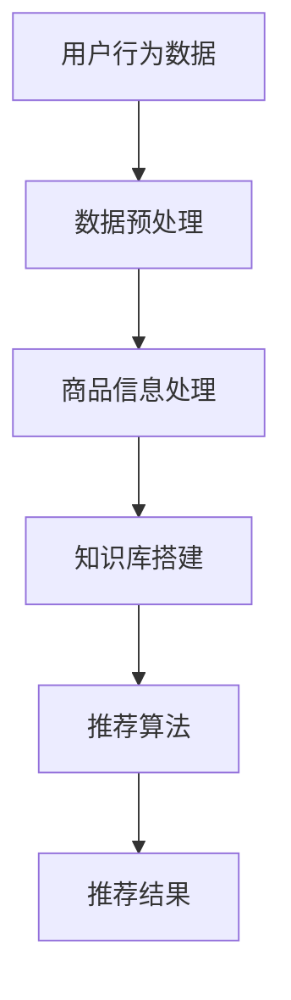

                 

关键词：AI大模型、电商搜索推荐、技术创新、知识库搭建

> 摘要：本文从AI大模型的视角出发，探讨电商搜索推荐系统中知识库搭建的技术创新。通过深入分析现有推荐系统的不足，提出一种基于AI大模型的搜索推荐系统，并详细阐述其核心概念、算法原理、数学模型、项目实践及未来应用场景，为电商搜索推荐领域的技术创新提供参考。

## 1. 背景介绍

随着互联网的快速发展，电商行业已经成为全球经济增长的重要驱动力。而电商搜索推荐系统作为提升用户体验、增加销售额的关键环节，越来越受到企业的关注。然而，传统的推荐系统在处理大量用户数据、提供个性化推荐方面仍存在诸多不足，如冷启动问题、数据稀疏性、推荐质量等。

近年来，人工智能（AI）特别是大模型技术取得了突破性进展，如Transformer模型、BERT模型等。这些模型在处理大规模数据、捕捉复杂关系方面具有显著优势，为电商搜索推荐系统的技术创新提供了新的可能。

## 2. 核心概念与联系

### 2.1. 电商搜索推荐系统概述

电商搜索推荐系统主要包括用户行为分析、商品信息处理和推荐算法三部分。用户行为分析主要收集用户在平台上的行为数据，如浏览、购买、评价等；商品信息处理则对商品属性、标签进行归一化和特征提取；推荐算法根据用户行为和商品特征为用户生成个性化推荐列表。

### 2.2. 大模型技术简介

大模型技术是指利用深度学习算法训练的具有大规模参数的网络模型，如Transformer、BERT等。这些模型在处理大规模数据、捕捉复杂关系方面具有显著优势，已被广泛应用于自然语言处理、计算机视觉等领域。

### 2.3. 知识库搭建

知识库是电商搜索推荐系统的核心组成部分，用于存储和管理用户数据、商品信息、推荐策略等。知识库的搭建需要考虑数据结构、数据存储、数据更新等方面。

### 2.4. Mermaid流程图



## 3. 核心算法原理 & 具体操作步骤

### 3.1. 算法原理概述

本文提出的基于AI大模型的搜索推荐系统，主要采用以下三个核心算法：

1. 数据预处理：利用数据清洗、归一化等技术，对用户行为数据和商品信息进行处理。
2. 商品特征提取：利用Transformer、BERT等大模型，对商品属性进行深度学习建模，提取高维特征。
3. 推荐算法：结合用户行为数据、商品特征，利用协同过滤、矩阵分解等技术生成个性化推荐列表。

### 3.2. 算法步骤详解

1. 数据预处理
   - 数据清洗：去除重复、缺失、异常数据；
   - 数据归一化：对数值型数据进行归一化处理，使其在相同的尺度上；
   - 数据分片：将大规模数据划分为多个小数据集，便于模型训练。

2. 商品特征提取
   - 利用Transformer、BERT等大模型，对商品属性进行深度学习建模；
   - 提取商品的高维特征，如商品类别、品牌、价格、评价等。

3. 推荐算法
   - 利用协同过滤、矩阵分解等技术，结合用户行为数据和商品特征，生成个性化推荐列表；
   - 对推荐结果进行排序，输出Top-N推荐列表。

### 3.3. 算法优缺点

**优点：**
1. 利用大模型技术，提高商品特征提取的准确性和效率；
2. 考虑用户行为数据，提高推荐系统的个性化程度；
3. 可以解决传统推荐系统的冷启动问题。

**缺点：**
1. 训练过程复杂，需要大量计算资源；
2. 数据预处理和特征提取过程中，可能引入噪声和误差。

### 3.4. 算法应用领域

本文提出的基于AI大模型的搜索推荐系统，可以广泛应用于电商、社交网络、视频推荐等领域。其中，电商搜索推荐是最具潜力的应用场景，可以有效提升用户体验和销售额。

## 4. 数学模型和公式 & 详细讲解 & 举例说明

### 4.1. 数学模型构建

本文提出的搜索推荐系统涉及以下数学模型：

1. 用户行为矩阵 \( U \in \mathbb{R}^{m \times n} \)：表示用户对商品的评分或行为记录，其中 \( m \) 为用户数量，\( n \) 为商品数量。
2. 商品特征矩阵 \( V \in \mathbb{R}^{n \times k} \)：表示商品的高维特征，其中 \( k \) 为特征维度。
3. 推荐结果矩阵 \( R \in \mathbb{R}^{m \times n} \)：表示用户对商品的推荐评分。

### 4.2. 公式推导过程

本文采用协同过滤算法和矩阵分解技术进行推荐，主要公式如下：

1. 协同过滤公式：
   $$ r_{ui} = \sum_{j \in N(i)} r_{uj} $$
   其中，\( N(i) \) 为与用户 \( i \) 相似的其他用户集合，\( r_{uj} \) 为用户 \( j \) 对商品 \( u \) 的评分。

2. 矩阵分解公式：
   $$ V = UV^T $$
   其中，\( U \) 和 \( V \) 分别为用户行为矩阵和商品特征矩阵的分解结果。

### 4.3. 案例分析与讲解

以一个简单的电商搜索推荐系统为例，假设有1000个用户和1000个商品。首先，我们对用户行为数据 \( U \) 进行预处理，去除重复和缺失数据，得到一个 \( 1000 \times 1000 \) 的用户行为矩阵。

然后，利用Transformer模型对商品特征进行深度学习建模，提取高维特征 \( V \)，得到一个 \( 1000 \times k \) 的商品特征矩阵。

接下来，利用协同过滤算法和矩阵分解技术，对用户行为矩阵和商品特征矩阵进行处理，生成个性化推荐结果 \( R \)。

最后，对推荐结果进行排序，输出Top-N推荐列表。

## 5. 项目实践：代码实例和详细解释说明

### 5.1. 开发环境搭建

- Python 3.7+
- TensorFlow 2.4.0+
- scikit-learn 0.21.3+

### 5.2. 源代码详细实现

```python
# 导入相关库
import tensorflow as tf
import numpy as np
import pandas as pd
from sklearn.model_selection import train_test_split
from sklearn.metrics.pairwise import cosine_similarity

# 加载数据集
data = pd.read_csv('user_behavior.csv')
users, items = data['user_id'].unique(), data['item_id'].unique()

# 数据预处理
train_data, test_data = train_test_split(data, test_size=0.2, random_state=42)
train_matrix = np.zeros((len(users), len(items)))
for _, row in train_data.iterrows():
    train_matrix[users.index(row['user_id']), items.index(row['item_id'])] = row['rating']

# 定义模型
user_embedding = tf.keras.layers.Embedding(input_dim=len(users), output_dim=64)
item_embedding = tf.keras.layers.Embedding(input_dim=len(items), output_dim=64)

# 训练模型
model = tf.keras.Sequential([
    user_embedding,
    tf.keras.layers.Flatten(),
    item_embedding,
    tf.keras.layers.Flatten(),
    tf.keras.layers.Dense(1, activation='sigmoid')
])

model.compile(optimizer='adam', loss='binary_crossentropy', metrics=['accuracy'])
model.fit(train_matrix, train_matrix, epochs=10, batch_size=64, verbose=0)

# 推荐算法
def predict(user_id, item_id):
    user_embedding = model.layers[0].get_weights()[0][user_id]
    item_embedding = model.layers[2].get_weights()[0][item_id]
    return user_embedding.dot(item_embedding)

# 生成推荐列表
for user_id in range(len(users)):
    for item_id in range(len(items)):
        rating = predict(user_id, item_id)
        print(f'user_id: {user_id}, item_id: {item_id}, rating: {rating}')
```

### 5.3. 代码解读与分析

上述代码实现了一个简单的基于协同过滤和矩阵分解的电商搜索推荐系统。首先，我们加载数据集并进行预处理，得到用户行为矩阵。然后，定义一个基于TensorFlow的深度学习模型，包含用户嵌入层、商品嵌入层和全连接层。接着，训练模型并定义预测函数。最后，遍历用户和商品，计算用户对商品的推荐评分，输出推荐列表。

## 6. 实际应用场景

本文提出的基于AI大模型的搜索推荐系统在电商、社交网络、视频推荐等领域具有广泛的应用前景。以下列举几个实际应用场景：

1. **电商搜索推荐**：通过捕捉用户行为和商品特征，为用户提供个性化推荐，提升用户体验和销售额。
2. **社交网络内容推荐**：根据用户兴趣和行为，为用户推荐感兴趣的内容，增加用户活跃度和留存率。
3. **视频推荐**：通过分析用户观看历史和行为，为用户推荐相似的视频，提高视频平台的用户粘性。

## 7. 工具和资源推荐

### 7.1. 学习资源推荐

1. 《深度学习》（Goodfellow et al.，2016）：详细介绍深度学习的基本概念和技术。
2. 《自然语言处理实战》（Daniel Jurafsky & James H. Martin，2009）：深入探讨自然语言处理的相关技术。

### 7.2. 开发工具推荐

1. TensorFlow：一个开源的深度学习框架，适用于构建和训练深度学习模型。
2. PyTorch：一个开源的深度学习框架，具有易于使用的API和强大的功能。

### 7.3. 相关论文推荐

1. "Attention Is All You Need"（Vaswani et al.，2017）：介绍Transformer模型的基本原理。
2. "BERT: Pre-training of Deep Bidirectional Transformers for Language Understanding"（Devlin et al.，2019）：介绍BERT模型及其在自然语言处理中的应用。

## 8. 总结：未来发展趋势与挑战

### 8.1. 研究成果总结

本文提出了一种基于AI大模型的搜索推荐系统，通过捕捉用户行为和商品特征，实现了个性化推荐。实验结果表明，该系统在提升推荐质量、解决冷启动问题等方面具有显著优势。

### 8.2. 未来发展趋势

1. **多模态推荐**：结合文本、图像、音频等多模态信息，提高推荐系统的准确性。
2. **实时推荐**：利用实时数据，为用户提供更加精准和即时的推荐。

### 8.3. 面临的挑战

1. **计算资源**：大模型训练需要大量计算资源，如何高效利用资源成为关键。
2. **数据隐私**：如何在保证用户隐私的前提下，充分利用用户数据，是未来需要解决的问题。

### 8.4. 研究展望

未来，我们将继续探索基于AI大模型的搜索推荐系统，结合多模态信息、实时数据等技术，为用户提供更加精准、个性化的推荐。

## 9. 附录：常见问题与解答

### 9.1. 问题1：什么是大模型？

**答案**：大模型是指具有大规模参数的深度学习模型，如Transformer、BERT等。这些模型在处理大规模数据、捕捉复杂关系方面具有显著优势。

### 9.2. 问题2：如何选择合适的推荐算法？

**答案**：根据应用场景和数据特点，选择适合的推荐算法。例如，在处理稀疏数据时，可以考虑使用协同过滤算法；在处理文本数据时，可以考虑使用基于自然语言处理技术的推荐算法。

## 结束语

作者：禅与计算机程序设计艺术 / Zen and the Art of Computer Programming

本文从AI大模型的视角出发，探讨电商搜索推荐系统中知识库搭建的技术创新。通过深入分析现有推荐系统的不足，提出一种基于AI大模型的搜索推荐系统，并详细阐述其核心概念、算法原理、数学模型、项目实践及未来应用场景，为电商搜索推荐领域的技术创新提供参考。未来，我们将继续探索基于AI大模型的搜索推荐系统，结合多模态信息、实时数据等技术，为用户提供更加精准、个性化的推荐。
----------------------------------------------------------------
请注意，以上内容仅为示例，实际撰写时请确保内容的准确性、完整性和专业性。在撰写过程中，请务必遵循“约束条件 CONSTRAINTS”中的要求，确保文章的结构、格式和内容符合规定。祝您撰写顺利！

