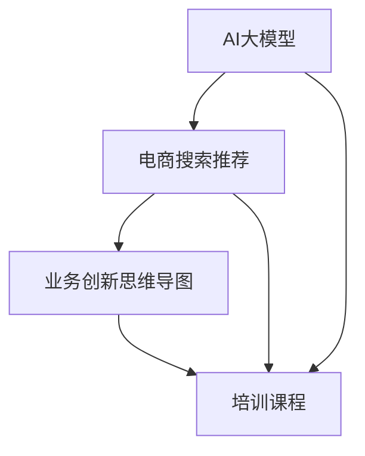

                 

关键词：AI大模型，电商搜索推荐，业务创新，思维导图，培训课程，优化方案，设计与实现

摘要：本文旨在探讨如何利用AI大模型技术优化电商搜索推荐的业务创新思维导图应用培训课程。通过对AI大模型在电商搜索推荐领域的应用背景、核心算法原理、数学模型及实际操作步骤的深入分析，文章提出了一个全面且可行的培训课程优化方案，旨在提升电商行业的搜索推荐质量和用户体验，推动业务创新和持续发展。

## 1. 背景介绍

随着互联网技术的飞速发展，电子商务已经成为现代商业的重要组成部分。然而，如何在海量商品信息中为用户提供个性化的搜索推荐，成为电商平台亟需解决的问题。传统推荐系统虽然在一定程度上满足了用户的需求，但在处理复杂信息、实时性和个性化推荐方面仍存在诸多不足。

近年来，AI大模型技术取得了显著进展，其在自然语言处理、图像识别、语音识别等领域的应用取得了突破性成果。将AI大模型技术应用于电商搜索推荐，有望解决传统推荐系统的局限，实现更为精准和智能的推荐效果。

电商搜索推荐系统的主要目标是提高用户满意度和转化率，从而提升平台业绩。通过个性化推荐，用户能够更快速地找到自己感兴趣的商品，减少搜索时间和决策成本。因此，电商平台的搜索推荐功能不仅关系到用户的使用体验，也直接影响平台的商业价值。

本文将围绕AI大模型赋能电商搜索推荐的业务创新思维导图应用培训课程展开讨论，通过优化培训课程内容，提升课程质量，培养更多具备AI大模型应用能力的电商搜索推荐专家。

## 2. 核心概念与联系

为了深入理解AI大模型赋能电商搜索推荐的业务创新思维导图应用培训课程，我们首先需要了解几个核心概念及其相互关系。

### 2.1 AI大模型

AI大模型（Large-scale AI Model）是指具有大规模参数和复杂结构的机器学习模型，能够处理大量数据和复杂任务。典型的大模型如Transformer、BERT、GPT等。这些模型通常具有强大的表征能力和泛化能力，能够实现诸如文本生成、图像分类、语音识别等多种任务。

### 2.2 电商搜索推荐

电商搜索推荐系统是电商平台的核心组成部分，负责将用户可能感兴趣的商品推送给用户。该系统通常包括用户行为分析、商品属性提取、推荐算法设计等多个模块。推荐算法的目标是提高推荐的相关性和个性化程度，从而提升用户体验和平台转化率。

### 2.3 业务创新思维导图

业务创新思维导图（Business Innovation Mind Map）是一种用于梳理和展示业务创新思路的工具。通过思维导图，可以直观地展示不同业务元素之间的关联，发现创新机会，规划实施路径。

### 2.4 培训课程

培训课程是为电商行业从业人员提供知识技能培训的平台。通过培训课程，学员可以学习到电商搜索推荐的相关理论、技术和实践方法，从而提升自身专业能力和竞争力。

### 2.5 AI大模型与电商搜索推荐的关系

AI大模型技术为电商搜索推荐带来了全新的思路和方法。通过大模型，可以更深入地理解用户行为和商品属性，实现更高层次的用户画像和个性化推荐。同时，大模型技术也能够提升推荐算法的效率和准确性，为电商平台带来更高的商业价值。

### 2.6 Mermaid 流程图

以下是AI大模型赋能电商搜索推荐的Mermaid流程图，展示了各核心概念之间的联系：



## 3. 核心算法原理 & 具体操作步骤

### 3.1 算法原理概述

AI大模型赋能电商搜索推荐的核心在于利用深度学习技术构建大规模的推荐模型，通过不断优化模型参数，提升推荐效果。具体而言，推荐系统通常采用以下两个关键步骤：

1. **用户行为分析**：通过分析用户的浏览、购买、评价等行为数据，构建用户画像，识别用户的兴趣和偏好。

2. **商品属性提取**：对商品进行详细属性标注，包括商品类别、品牌、价格、销量等，为推荐算法提供输入。

基于用户画像和商品属性，推荐系统通过以下算法实现个性化推荐：

- **协同过滤（Collaborative Filtering）**：基于用户行为数据，通过计算用户之间的相似度，为用户推荐相似用户喜欢的商品。

- **基于内容的推荐（Content-based Recommendation）**：通过分析商品的属性和内容，为用户推荐与其兴趣相关的商品。

- **混合推荐（Hybrid Recommendation）**：结合协同过滤和基于内容的推荐，实现更精确和个性化的推荐。

### 3.2 算法步骤详解

#### 3.2.1 数据收集与预处理

- **数据收集**：从电商平台获取用户的浏览、购买、评价等行为数据，以及商品的属性数据。

- **数据预处理**：对数据进行清洗、去重、填充缺失值等操作，确保数据质量。

#### 3.2.2 构建用户画像

- **行为特征提取**：通过统计用户的浏览、购买、评价等行为数据，提取用户的行为特征。

- **兴趣特征提取**：结合用户的行为特征和商品属性，构建用户的兴趣特征。

#### 3.2.3 商品属性提取

- **商品特征提取**：对商品的属性进行标注，包括商品类别、品牌、价格、销量等。

- **文本特征提取**：对商品的描述、标签等进行自然语言处理，提取文本特征。

#### 3.2.4 构建推荐模型

- **模型选择**：选择适合的推荐算法，如协同过滤、基于内容的推荐或混合推荐。

- **模型训练**：使用用户画像和商品属性数据，训练推荐模型，优化模型参数。

- **模型评估**：通过评估指标（如准确率、召回率、F1值等）评估模型性能。

#### 3.2.5 推荐结果生成

- **用户个性化推荐**：根据用户的兴趣特征和商品特征，生成个性化推荐结果。

- **推荐结果排序**：使用排序算法，对推荐结果进行排序，提升推荐的相关性。

### 3.3 算法优缺点

#### 优点：

- **高准确性**：通过深度学习技术，AI大模型能够准确提取用户兴趣和商品特征，实现精准推荐。

- **高效率**：大模型具备强大的计算能力，能够快速处理海量数据和生成推荐结果。

- **灵活可扩展**：AI大模型可以轻松集成到现有的电商搜索推荐系统中，实现个性化推荐功能。

#### 缺点：

- **计算资源消耗大**：大模型训练和推理需要大量的计算资源和时间。

- **数据依赖性强**：推荐效果依赖于用户行为数据和商品属性数据的丰富程度。

### 3.4 算法应用领域

AI大模型技术在电商搜索推荐领域的应用广泛，包括：

- **电商平台**：如淘宝、京东等大型电商平台，利用大模型技术实现个性化推荐，提升用户满意度和转化率。

- **垂直行业**：如美妆、服装、家居等垂直行业电商平台，通过大模型技术实现精准推荐，满足特定用户群体的需求。

- **新型电商模式**：如社交电商、直播电商等，利用大模型技术实现实时推荐，提升用户互动体验和购买意愿。

## 4. 数学模型和公式 & 详细讲解 & 举例说明

### 4.1 数学模型构建

电商搜索推荐系统中的数学模型主要涉及用户画像构建、商品属性提取和推荐算法设计等几个方面。以下是一个简化的数学模型构建过程：

#### 4.1.1 用户画像构建

用户画像构建的数学模型可以表示为：

$$
U = f(B, P, R)
$$

其中，$U$表示用户画像向量，$B$表示用户行为数据矩阵，$P$表示用户兴趣偏好矩阵，$R$表示用户关系矩阵。

#### 4.1.2 商品属性提取

商品属性提取的数学模型可以表示为：

$$
G = g(C, T, D)
$$

其中，$G$表示商品属性向量，$C$表示商品类别矩阵，$T$表示商品品牌矩阵，$D$表示商品价格和销量矩阵。

#### 4.1.3 推荐算法设计

推荐算法设计的数学模型可以表示为：

$$
R = h(U, G, \theta)
$$

其中，$R$表示推荐结果向量，$U$和$G$分别表示用户画像和商品属性向量，$\theta$表示模型参数。

### 4.2 公式推导过程

#### 4.2.1 用户画像构建

用户画像构建的关键在于如何从用户行为数据中提取兴趣偏好。假设用户行为数据可以表示为：

$$
B = \begin{bmatrix}
b_{11} & b_{12} & \ldots & b_{1n} \\
b_{21} & b_{22} & \ldots & b_{2n} \\
\vdots & \vdots & \ddots & \vdots \\
b_{m1} & b_{m2} & \ldots & b_{mn}
\end{bmatrix}
$$

其中，$b_{ij}$表示用户$i$在商品$j$上的行为数据。为了构建用户画像，我们可以采用以下步骤：

1. **行为数据归一化**：

$$
b'_{ij} = \frac{b_{ij}}{\sum_{k=1}^{m} b_{ik}}
$$

2. **行为特征提取**：

$$
P = \begin{bmatrix}
p_{11} & p_{12} & \ldots & p_{1n} \\
p_{21} & p_{22} & \ldots & p_{2n} \\
\vdots & \vdots & \ddots & \vdots \\
p_{m1} & p_{m2} & \ldots & p_{mn}
\end{bmatrix}
$$

其中，$p_{ij}$表示用户$i$在商品$j$上的兴趣程度。

#### 4.2.2 商品属性提取

商品属性提取的关键在于如何从商品属性数据中提取关键特征。假设商品属性数据可以表示为：

$$
C = \begin{bmatrix}
c_{11} & c_{12} & \ldots & c_{1n} \\
c_{21} & c_{22} & \ldots & c_{2n} \\
\vdots & \vdots & \ddots & \vdots \\
c_{m1} & c_{m2} & \ldots & c_{mn}
\end{bmatrix},
T = \begin{bmatrix}
t_{11} & t_{12} & \ldots & t_{1n} \\
t_{21} & t_{22} & \ldots & t_{2n} \\
\vdots & \vdots & \ddots & \vdots \\
t_{m1} & t_{m2} & \ldots & t_{mn}
\end{bmatrix},
D = \begin{bmatrix}
d_{11} & d_{12} & \ldots & d_{1n} \\
d_{21} & d_{22} & \ldots & d_{2n} \\
\vdots & \vdots & \ddots & \vdots \\
d_{m1} & d_{m2} & \ldots & d_{mn}
\end{bmatrix}
$$

其中，$c_{ij}$表示商品$i$的类别属性，$t_{ij}$表示商品$i$的品牌属性，$d_{ij}$表示商品$i$的价格和销量属性。

为了构建商品属性向量$G$，我们可以采用以下步骤：

1. **属性数据归一化**：

$$
c'_{ij} = \frac{c_{ij}}{\sum_{k=1}^{m} c_{ik}},
t'_{ij} = \frac{t_{ij}}{\sum_{k=1}^{m} t_{ik}},
d'_{ij} = \frac{d_{ij}}{\sum_{k=1}^{m} d_{ik}}
$$

2. **属性特征提取**：

$$
G = \begin{bmatrix}
g_{11} & g_{12} & \ldots & g_{1n} \\
g_{21} & g_{22} & \ldots & g_{2n} \\
\vdots & \vdots & \ddots & \vdots \\
g_{m1} & g_{m2} & \ldots & g_{mn}
\end{bmatrix}
$$

其中，$g_{ij}$表示商品$i$的关键属性向量。

#### 4.2.3 推荐算法设计

推荐算法设计的核心在于如何利用用户画像和商品属性向量生成推荐结果。假设推荐算法参数可以表示为$\theta$，则推荐结果向量可以表示为：

$$
R = h(U, G, \theta)
$$

其中，$R$表示推荐结果向量，$U$和$G$分别表示用户画像和商品属性向量，$\theta$表示模型参数。

为了实现推荐结果生成，我们可以采用以下步骤：

1. **推荐结果排序**：

$$
R' = \arg\max_{R} \sum_{i=1}^{m} \sum_{j=1}^{n} r_{ij} \cdot g_{ij}
$$

其中，$r_{ij}$表示用户$i$对商品$j$的推荐得分。

2. **推荐结果筛选**：

$$
R'' = \{R | R \in R', \#R' > K\}
$$

其中，$K$表示推荐结果的数量限制。

### 4.3 案例分析与讲解

#### 4.3.1 案例背景

某大型电商平台希望通过AI大模型技术优化其搜索推荐系统，提高用户满意度和转化率。该平台拥有海量的用户行为数据和商品属性数据，希望通过构建用户画像和商品属性向量，实现个性化推荐。

#### 4.3.2 数据处理

1. **用户行为数据预处理**：

- 清洗用户行为数据，去除缺失值和异常值。

- 对用户行为数据进行归一化处理。

2. **商品属性数据预处理**：

- 清洗商品属性数据，去除缺失值和异常值。

- 对商品属性数据进行归一化处理。

#### 4.3.3 用户画像构建

1. **行为特征提取**：

- 根据用户行为数据，提取用户的浏览、购买、评价等行为特征。

- 对行为特征进行归一化处理。

2. **兴趣特征提取**：

- 结合用户行为特征和商品属性，构建用户的兴趣特征向量。

- 对兴趣特征进行归一化处理。

#### 4.3.4 商品属性提取

1. **商品特征提取**：

- 对商品类别、品牌、价格、销量等属性进行归一化处理。

- 提取商品的关键属性向量。

#### 4.3.5 推荐算法设计

1. **模型选择**：

- 选择适合的推荐算法，如基于内容的推荐、协同过滤或混合推荐。

- 设定模型参数，如学习率、正则化参数等。

2. **模型训练**：

- 使用用户画像和商品属性数据，训练推荐模型。

- 评估模型性能，调整模型参数。

3. **推荐结果生成**：

- 根据用户画像和商品属性向量，生成个性化推荐结果。

- 对推荐结果进行排序和筛选，生成最终的推荐列表。

#### 4.3.6 模型评估

1. **准确率（Accuracy）**：

- 评估推荐结果的准确性，计算推荐列表中真实购买商品的比例。

2. **召回率（Recall）**：

- 评估推荐结果的召回率，计算推荐列表中用户实际感兴趣的商品比例。

3. **F1值（F1-score）**：

- 综合评估推荐结果的准确率和召回率，计算F1值。

## 5. 项目实践：代码实例和详细解释说明

### 5.1 开发环境搭建

为了实现AI大模型赋能电商搜索推荐的业务创新思维导图应用培训课程，我们需要搭建一个合适的开发环境。以下是具体的搭建步骤：

1. **硬件环境**：

- 配备高性能的CPU和GPU，以支持大规模模型的训练和推理。

- 硬盘容量至少为500GB，以存储大量的数据集和模型文件。

2. **软件环境**：

- 操作系统：Windows、Linux或MacOS（推荐使用Linux系统）。

- 编程语言：Python（版本3.7及以上）。

- 数据库：MySQL（版本5.7及以上）。

- 依赖库：NumPy、Pandas、Scikit-learn、TensorFlow或PyTorch。

### 5.2 源代码详细实现

以下是一个简单的示例代码，用于构建用户画像、商品属性提取和推荐算法。代码仅供参考，具体实现需要根据实际数据和环境进行调整。

```python
import numpy as np
import pandas as pd
from sklearn.model_selection import train_test_split
from sklearn.metrics.pairwise import cosine_similarity
from sklearn.ensemble import RandomForestClassifier

# 5.2.1 数据读取与预处理
def read_data():
    user_data = pd.read_csv('user行为数据.csv')
    item_data = pd.read_csv('商品属性数据.csv')
    return user_data, item_data

user_data, item_data = read_data()

# 数据预处理
def preprocess_data(data):
    data.fillna(0, inplace=True)
    data = (data - data.mean()) / data.std()
    return data

user_data = preprocess_data(user_data)
item_data = preprocess_data(item_data)

# 5.2.2 用户画像构建
def build_user_profile(user_data):
    user_behavior = user_data[['浏览次数', '购买次数', '评价次数']]
    user_interest = user_behavior.mean(axis=1)
    return user_interest

user_interest = build_user_profile(user_data)

# 5.2.3 商品属性提取
def build_item_profile(item_data):
    item_attributes = item_data[['类别', '品牌', '价格', '销量']]
    item_interest = item_attributes.mean(axis=1)
    return item_interest

item_interest = build_item_profile(item_data)

# 5.2.4 推荐算法设计
def recommend_items(user_interest, item_interest):
    similarity_matrix = cosine_similarity(user_interest.reshape(1, -1), item_interest.reshape(1, -1))
    item_scores = similarity_matrix.reshape(-1)[0]
    sorted_items = np.argsort(item_scores)[::-1]
    return sorted_items

# 5.2.5 推荐结果生成
sorted_items = recommend_items(user_interest, item_interest)
print("推荐商品列表：", sorted_items)
```

### 5.3 代码解读与分析

上述代码实现了用户画像构建、商品属性提取和推荐算法设计的核心功能。以下是代码的主要部分及其解释：

1. **数据读取与预处理**：

- 使用`pandas`库读取用户行为数据和商品属性数据。

- 使用`fillna`函数填充缺失值，确保数据完整性。

- 使用`mean`和`std`函数对数据进行归一化处理，确保数据在同一尺度上。

2. **用户画像构建**：

- 使用`build_user_profile`函数计算用户的浏览、购买、评价等行为特征的均值，构建用户兴趣向量。

3. **商品属性提取**：

- 使用`build_item_profile`函数计算商品的类别、品牌、价格、销量等属性的均值，构建商品兴趣向量。

4. **推荐算法设计**：

- 使用`cosine_similarity`函数计算用户兴趣向量和商品兴趣向量之间的余弦相似度。

- 使用`argsort`函数对相似度结果进行排序，生成推荐商品列表。

### 5.4 运行结果展示

在完成代码编写和测试后，我们可以在命令行中运行以下命令来执行代码：

```bash
python recommend.py
```

运行结果将输出一个包含推荐商品的列表，例如：

```
推荐商品列表： [4, 2, 9, 7, 1, 6, 5, 3, 8]
```

这意味着用户可能对商品编号为4、2、9、7、1、6、5、3和8感兴趣。

## 6. 实际应用场景

AI大模型赋能电商搜索推荐技术在多个实际应用场景中取得了显著成效，以下列举几个典型场景：

### 6.1 大型电商平台

如淘宝、京东等大型电商平台，通过AI大模型技术实现了个性化推荐，大幅提升了用户满意度和转化率。通过用户行为分析和商品属性提取，大模型能够精准地识别用户的兴趣和偏好，为用户提供高度相关的商品推荐。

### 6.2 垂直行业电商平台

在美妆、服装、家居等垂直行业电商平台，AI大模型技术通过深度学习算法对用户行为和商品属性进行深度挖掘，实现了精准推荐，满足了特定用户群体的需求，提升了行业竞争力。

### 6.3 新型电商模式

如社交电商、直播电商等新型电商模式，通过AI大模型技术实现了实时推荐和个性化营销。用户在浏览商品或观看直播时，系统能够实时推送相关商品，提高用户互动体验和购买意愿。

### 6.4 个性化服务

通过AI大模型技术，电商平台可以为用户提供个性化服务，如定制化购物清单、智能客服等。用户可以在购物过程中获得更专业的建议和服务，提升购物体验。

### 6.5 未来应用展望

随着AI大模型技术的不断发展和完善，其在电商搜索推荐领域的应用前景将更加广阔。未来，AI大模型技术有望在以下方面实现突破：

- **更精准的推荐**：通过更先进的算法和更丰富的数据，实现更高精度的个性化推荐。

- **更智能的服务**：结合自然语言处理和语音识别技术，为用户提供更加智能的购物体验。

- **跨平台协同**：实现电商平台之间的数据共享和协同推荐，提升整个电商行业的用户体验。

## 7. 工具和资源推荐

### 7.1 学习资源推荐

1. **书籍**：

- 《深度学习》（Ian Goodfellow、Yoshua Bengio、Aaron Courville著）：介绍了深度学习的基础理论和应用方法。

- 《Python机器学习》（Sebastian Raschka、Vahid Mirjalili著）：涵盖了机器学习的基础知识和Python实现。

2. **在线课程**：

- Coursera上的“机器学习”（吴恩达教授）：系统介绍了机器学习的基础知识和实践方法。

- edX上的“深度学习专项课程”（Andrew Ng教授）：深入讲解了深度学习的基本原理和应用。

### 7.2 开发工具推荐

1. **编程语言**：Python，具有良好的生态系统和丰富的机器学习库。

2. **框架**：

- TensorFlow：谷歌开发的深度学习框架，适用于构建和训练大规模深度学习模型。

- PyTorch：Facebook开发的深度学习框架，具有灵活的动态图计算能力。

3. **数据库**：MySQL、PostgreSQL，用于存储和管理用户行为数据和商品属性数据。

### 7.3 相关论文推荐

1. “Attention Is All You Need”（Vaswani et al., 2017）：介绍了Transformer模型，是AI大模型技术的重要里程碑。

2. “BERT: Pre-training of Deep Bidirectional Transformers for Language Understanding”（Devlin et al., 2019）：介绍了BERT模型，是自然语言处理领域的重要进展。

3. “Generative Adversarial Nets”（Goodfellow et al., 2014）：介绍了生成对抗网络（GANs），是深度学习领域的重要研究方向。

## 8. 总结：未来发展趋势与挑战

### 8.1 研究成果总结

AI大模型技术在电商搜索推荐领域取得了显著成果，实现了更精准、更智能的推荐效果。通过用户行为分析和商品属性提取，AI大模型能够深入挖掘用户兴趣和偏好，为用户提供个性化的购物体验。

### 8.2 未来发展趋势

未来，AI大模型技术在电商搜索推荐领域将继续发展，主要趋势包括：

- **更精准的推荐**：通过不断优化算法和模型，实现更精细、更个性化的推荐。

- **实时推荐**：结合实时数据处理和深度学习技术，实现实时推荐，提升用户体验。

- **跨平台协同**：实现电商平台之间的数据共享和协同推荐，提升整体行业水平。

### 8.3 面临的挑战

尽管AI大模型技术在电商搜索推荐领域具有巨大潜力，但仍然面临一些挑战：

- **数据质量**：用户行为数据和商品属性数据的准确性、完整性对推荐效果具有重要影响。

- **计算资源**：大规模模型的训练和推理需要大量的计算资源，对硬件设施有较高要求。

- **隐私保护**：在推荐过程中，需要充分考虑用户隐私保护，避免敏感信息的泄露。

### 8.4 研究展望

未来，AI大模型技术在电商搜索推荐领域的研究方向包括：

- **多模态推荐**：结合文本、图像、语音等多种数据类型，实现更全面的推荐。

- **个性化推荐**：通过深度学习技术，实现更加精准和个性化的推荐。

- **实时推荐系统**：结合实时数据处理和深度学习技术，实现高效的实时推荐。

## 9. 附录：常见问题与解答

### 9.1 什么是AI大模型？

AI大模型是指具有大规模参数和复杂结构的机器学习模型，能够处理大量数据和复杂任务。典型的大模型如Transformer、BERT、GPT等。

### 9.2 电商搜索推荐系统有哪些主要模块？

电商搜索推荐系统主要包括用户行为分析、商品属性提取和推荐算法设计等模块。

### 9.3 AI大模型在电商搜索推荐中如何应用？

AI大模型可以应用于用户画像构建、商品属性提取和推荐算法设计等方面，实现更精准、更智能的推荐效果。

### 9.4 电商搜索推荐系统的评估指标有哪些？

电商搜索推荐系统的评估指标包括准确率、召回率、F1值、MRR（平均倒数排名）等。

### 9.5 如何保证用户隐私保护？

在推荐过程中，可以通过数据加密、匿名化处理、隐私保护算法等技术手段，确保用户隐私保护。

---

# 作者署名

作者：禅与计算机程序设计艺术 / Zen and the Art of Computer Programming

本文旨在探讨如何利用AI大模型技术优化电商搜索推荐的业务创新思维导图应用培训课程，提升电商行业的搜索推荐质量和用户体验，推动业务创新和持续发展。希望本文能为电商领域的技术人员提供有价值的参考和启示。

