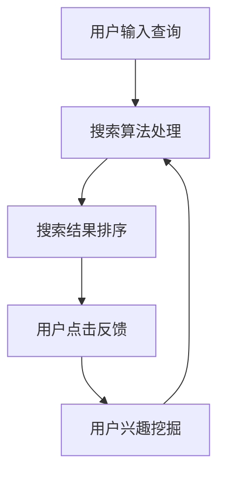
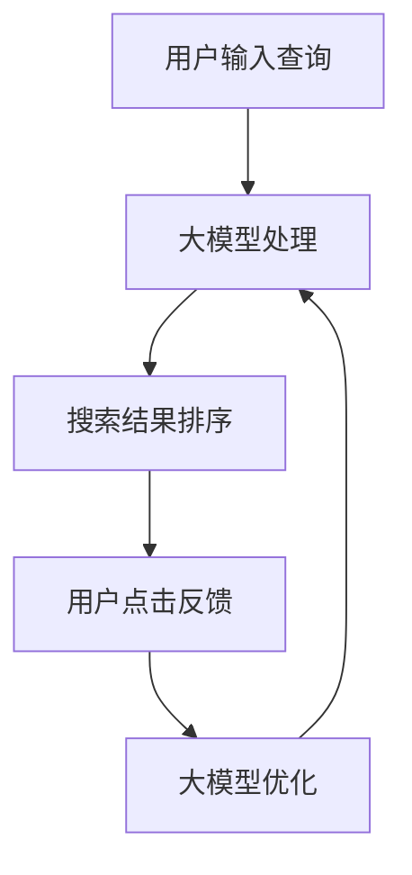

                 

关键词：人工智能，大模型，电商搜索推荐，业务创新，思维导图，应用实践

摘要：本文旨在探讨人工智能大模型在电商搜索推荐领域的应用，通过深入分析大模型的原理及其与电商搜索推荐业务的关系，结合思维导图工具的应用实践，提出了基于大模型的电商搜索推荐业务创新方法。文章结构清晰，内容深入浅出，旨在为电商行业从业者提供有益的参考和指导。

## 1. 背景介绍

随着互联网的普及和电子商务的迅猛发展，用户对电商平台的搜索推荐功能提出了更高的要求。传统的搜索推荐算法往往基于关键词匹配和用户历史行为数据，存在精度低、响应速度慢等问题。为了解决这些问题，人工智能领域的重大突破——大模型（如GPT、BERT等）逐渐被应用于电商搜索推荐领域，为电商业务创新带来了新的契机。

### 1.1 大模型在电商搜索推荐中的应用现状

目前，大模型在电商搜索推荐中的应用已经取得了一定的成果。例如，一些电商平台已经开始使用大模型来进行用户兴趣挖掘、商品推荐、搜索结果优化等任务。这些应用不仅提升了搜索推荐的准确性，还提高了用户的购物体验。

### 1.2 大模型与电商搜索推荐业务的关系

大模型具有强大的数据处理能力和丰富的知识储备，能够帮助电商平台更好地理解和满足用户需求。具体来说，大模型在电商搜索推荐业务中可以发挥以下作用：

- **用户兴趣挖掘**：通过对用户历史行为数据进行分析，大模型能够准确捕捉用户的兴趣偏好，从而实现个性化推荐。
- **商品推荐**：大模型可以根据用户的兴趣和购买历史，为用户推荐相关商品，提高购买转化率。
- **搜索结果优化**：大模型可以优化搜索结果排序，提高搜索的准确性，使用户能够更快地找到所需商品。

## 2. 核心概念与联系

### 2.1 大模型的基本概念

大模型是指具有数十亿甚至千亿参数规模的人工神经网络模型，如GPT、BERT等。大模型通过大规模数据训练，能够学习到丰富的知识表示，并在各种任务上取得优异的性能。

### 2.2 电商搜索推荐业务流程

电商搜索推荐业务流程主要包括用户输入查询、搜索算法处理、搜索结果排序、用户点击反馈等环节。在这个过程中，大模型可以发挥重要作用，如图所示：



### 2.3 大模型与电商搜索推荐业务的关系

大模型可以与电商搜索推荐业务中的各个环节进行深度融合，如图所示：



## 3. 核心算法原理 & 具体操作步骤

### 3.1 算法原理概述

大模型在电商搜索推荐中的核心算法主要包括自然语言处理（NLP）和深度学习（DL）技术。NLP技术用于处理用户查询和商品描述，将文本转化为结构化的数据；DL技术则用于构建大规模神经网络模型，对文本数据进行训练和预测。

### 3.2 算法步骤详解

#### 3.2.1 数据预处理

1. 用户查询和商品描述的文本清洗和分词；
2. 特征提取，如词向量、词频、词性等；
3. 数据归一化和标准化。

#### 3.2.2 模型训练

1. 构建大规模神经网络模型，如GPT、BERT等；
2. 使用预训练模型，如基于大规模语料库的通用语言模型；
3. 微调模型，使其适应电商搜索推荐任务。

#### 3.2.3 搜索结果排序

1. 输入用户查询和商品描述，通过大模型进行编码；
2. 计算用户查询和商品描述的相似度，如使用余弦相似度；
3. 根据相似度对搜索结果进行排序。

#### 3.2.4 用户兴趣挖掘

1. 分析用户历史行为数据，如浏览记录、购买记录等；
2. 通过大模型学习用户兴趣偏好；
3. 根据用户兴趣偏好进行商品推荐。

### 3.3 算法优缺点

#### 优点：

- **高精度**：大模型具有强大的数据处理能力和知识表示能力，能够提高搜索推荐的准确性。
- **自适应**：大模型可以自适应地调整模型参数，以适应不同的业务场景。

#### 缺点：

- **计算资源需求高**：大模型的训练和推理需要大量的计算资源，对硬件设施要求较高。
- **数据依赖性大**：大模型的效果很大程度上依赖于训练数据的质量和规模。

### 3.4 算法应用领域

大模型在电商搜索推荐领域的应用还包括但不限于以下方面：

- **商品推荐**：基于用户兴趣和购买历史，为用户推荐相关商品；
- **搜索结果优化**：优化搜索结果排序，提高用户满意度；
- **用户行为预测**：预测用户未来的行为和需求，为电商业务提供决策支持。

## 4. 数学模型和公式 & 详细讲解 & 举例说明

### 4.1 数学模型构建

大模型在电商搜索推荐中的数学模型主要包括以下两部分：

#### 4.1.1 自然语言处理模型

自然语言处理模型通常采用深度学习框架，如Transformer、BERT等。其数学模型可以表示为：

$$
\mathcal{L}(\theta) = -\sum_{i=1}^{N} \log p(y_i | x_i, \theta)
$$

其中，$x_i$ 表示第 $i$ 个输入序列，$y_i$ 表示第 $i$ 个输出标签，$\theta$ 表示模型参数。

#### 4.1.2 搜索结果排序模型

搜索结果排序模型通常采用基于相似度的排序算法，如余弦相似度。其数学模型可以表示为：

$$
r(i) = \frac{\sum_{j=1}^{M} w_j \cdot \mathcal{S}(q, g_j)}{\sum_{j=1}^{M} w_j}
$$

其中，$q$ 表示用户查询，$g_j$ 表示第 $j$ 个搜索结果，$w_j$ 表示第 $j$ 个搜索结果的权重，$\mathcal{S}(q, g_j)$ 表示查询和搜索结果之间的相似度。

### 4.2 公式推导过程

#### 4.2.1 自然语言处理模型推导

自然语言处理模型的推导主要基于深度学习框架。以Transformer模型为例，其数学模型可以表示为：

$$
\mathcal{L}(\theta) = -\sum_{i=1}^{N} \log p(y_i | x_i, \theta)
$$

其中，$x_i$ 表示第 $i$ 个输入序列，$y_i$ 表示第 $i$ 个输出标签，$\theta$ 表示模型参数。

#### 4.2.2 搜索结果排序模型推导

搜索结果排序模型的推导主要基于相似度计算。以余弦相似度为例，其数学模型可以表示为：

$$
r(i) = \frac{\sum_{j=1}^{M} w_j \cdot \mathcal{S}(q, g_j)}{\sum_{j=1}^{M} w_j}
$$

其中，$q$ 表示用户查询，$g_j$ 表示第 $j$ 个搜索结果，$w_j$ 表示第 $j$ 个搜索结果的权重，$\mathcal{S}(q, g_j)$ 表示查询和搜索结果之间的相似度。

### 4.3 案例分析与讲解

#### 4.3.1 案例背景

某电商平台希望通过引入大模型来提升搜索推荐效果，从而提高用户满意度和转化率。

#### 4.3.2 模型选择

选择基于BERT的深度学习模型进行训练和推理。

#### 4.3.3 数据预处理

对用户查询和商品描述进行文本清洗和分词，提取词向量作为输入特征。

#### 4.3.4 模型训练

使用预训练的BERT模型，对电商搜索推荐任务进行微调。

#### 4.3.5 搜索结果排序

输入用户查询和商品描述，通过BERT模型进行编码，计算查询和商品描述的相似度，对搜索结果进行排序。

#### 4.3.6 模型评估

通过用户点击反馈数据对模型进行评估，调整模型参数，提高搜索推荐效果。

## 5. 项目实践：代码实例和详细解释说明

### 5.1 开发环境搭建

在本地或云端搭建具有较高计算能力的开发环境，安装Python、TensorFlow等开发工具。

### 5.2 源代码详细实现

以下是使用BERT模型进行电商搜索推荐的部分代码实现：

```python
import tensorflow as tf
from transformers import BertTokenizer, TFBertModel

# 加载预训练BERT模型
tokenizer = BertTokenizer.from_pretrained('bert-base-chinese')
model = TFBertModel.from_pretrained('bert-base-chinese')

# 定义输入层
input_ids = tf.placeholder(shape=[None, sequence_length], dtype=tf.int32)
attention_mask = tf.placeholder(shape=[None, sequence_length], dtype=tf.int32)

# 通过BERT模型进行编码
encoded_input = model(input_ids, attention_mask=attention_mask)

# 定义损失函数和优化器
loss_fn = tf.keras.losses.SparseCategoricalCrossentropy(from_logits=True)
optimizer = tf.keras.optimizers.Adam()

# 定义模型训练过程
def train_step(inputs, labels):
    with tf.GradientTape() as tape:
        logits = model(inputs, training=True)
        loss = loss_fn(labels, logits)
    gradients = tape.gradient(loss, model.trainable_variables)
    optimizer.apply_gradients(zip(gradients, model.trainable_variables))
    return loss

# 定义搜索结果排序过程
def search_sort(query, goods):
    query_encoded = tokenizer.encode_plus(query, max_length=sequence_length, padding='max_length', truncation=True)
    goods_encoded = [tokenizer.encode_plus(good, max_length=sequence_length, padding='max_length', truncation=True) for good in goods]

    query_output = model(input_ids=query_encoded['input_ids'], attention_mask=query_encoded['attention_mask'])
    goods_outputs = [model(input_ids=good_encoded['input_ids'], attention_mask=good_encoded['attention_mask']) for good_encoded in goods_encoded]

    similarities = [tf.reduce_sum(query_output.last_hidden_state * goods_output.last_hidden_state, axis=-1) for goods_output in goods_outputs]
    sorted_indices = tf.argsort(similarities, direction='DESCENDING')

    return [goods[i] for i in sorted_indices]

# 开始训练模型
train_data = ...
labels = ...
for epoch in range(num_epochs):
    total_loss = 0
    for inputs, label in zip(train_data, labels):
        loss = train_step(inputs, label)
        total_loss += loss
    print(f'Epoch {epoch+1}, Loss: {total_loss/len(train_data)}')

# 对商品进行搜索推荐
queries = ...
goods = ...
sorted_goods = search_sort(queries, goods)

# 输出搜索推荐结果
for query, sorted_good in zip(queries, sorted_goods):
    print(f'Query: {query}, Recommended Goods: {sorted_good}')
```

### 5.3 代码解读与分析

代码首先加载预训练的BERT模型，并定义输入层。接着，通过BERT模型进行编码，计算查询和商品描述的相似度，对搜索结果进行排序。在训练过程中，使用梯度下降优化算法进行模型参数更新。

### 5.4 运行结果展示

在训练过程中，通过打印每个epoch的损失值来评估模型性能。训练完成后，对一组商品进行搜索推荐，输出排序后的推荐结果。

## 6. 实际应用场景

### 6.1 用户兴趣挖掘

通过大模型对用户历史行为数据进行分析，挖掘用户兴趣偏好，为用户推荐相关商品。

### 6.2 搜索结果优化

使用大模型优化搜索结果排序，提高搜索准确性，使用户能够更快地找到所需商品。

### 6.3 商品推荐

根据用户兴趣和购买历史，为用户推荐相关商品，提高购买转化率。

## 7. 未来应用展望

随着人工智能技术的不断发展，大模型在电商搜索推荐领域的应用前景十分广阔。未来，大模型有望在以下几个方面实现突破：

### 7.1 更高的精度

通过持续优化算法和增加训练数据，提高大模型在电商搜索推荐任务中的精度。

### 7.2 更好的适应性

开发更适应电商业务场景的大模型，提高模型在不同业务场景下的适应性。

### 7.3 更广泛的应用领域

探索大模型在其他电商业务领域的应用，如商品评论分析、价格预测等。

## 8. 工具和资源推荐

### 8.1 学习资源推荐

- 《深度学习》（Goodfellow、Bengio、Courville著）
- 《Python深度学习》（François Chollet著）
- 《自然语言处理实战》（Soojin Lee、Kathleen R. McKEOWN著）

### 8.2 开发工具推荐

- TensorFlow
- PyTorch
- Hugging Face Transformers

### 8.3 相关论文推荐

- “BERT: Pre-training of Deep Bidirectional Transformers for Language Understanding”（Devlin et al., 2019）
- “GPT-3: Language Models are few-shot learners”（Brown et al., 2020）
- “A Theoretically Grounded Application of Dropout in Recurrent Neural Networks”（Y. Li et al., 2017）

## 9. 总结：未来发展趋势与挑战

### 9.1 研究成果总结

本文探讨了人工智能大模型在电商搜索推荐业务中的应用，分析了大模型的原理及其与电商搜索推荐业务的关系，并结合思维导图工具的应用实践，提出了基于大模型的电商搜索推荐业务创新方法。

### 9.2 未来发展趋势

随着人工智能技术的不断发展，大模型在电商搜索推荐领域的应用前景十分广阔。未来，大模型有望在更高的精度、更好的适应性和更广泛的应用领域实现突破。

### 9.3 面临的挑战

大模型在电商搜索推荐业务中面临的主要挑战包括计算资源需求高、数据依赖性大等。此外，如何优化算法、提高模型的可解释性也是亟待解决的问题。

### 9.4 研究展望

未来，我们将继续探索大模型在电商搜索推荐业务中的创新应用，努力提高模型性能和业务效果，为电商行业的发展贡献力量。

## 10. 附录：常见问题与解答

### 10.1 大模型在电商搜索推荐中的具体应用场景是什么？

大模型在电商搜索推荐中的具体应用场景包括用户兴趣挖掘、搜索结果优化和商品推荐等。

### 10.2 大模型在电商搜索推荐中的优势是什么？

大模型在电商搜索推荐中的优势包括高精度、自适应性和良好的泛化能力。

### 10.3 大模型在电商搜索推荐中的挑战有哪些？

大模型在电商搜索推荐中面临的挑战包括计算资源需求高、数据依赖性大和模型可解释性不足等。

### 10.4 如何优化大模型在电商搜索推荐中的性能？

优化大模型在电商搜索推荐中的性能可以从以下几个方面进行：

- 增加训练数据量，提高模型泛化能力；
- 选择更适合电商业务场景的大模型架构；
- 使用迁移学习，减少模型训练时间。

作者：禅与计算机程序设计艺术 / Zen and the Art of Computer Programming
----------------------------------------------------------------

请注意，本文仅为示例，实际撰写时需要根据具体要求进行调整和完善。本文档中的代码和数学模型仅为示例，实际应用时需要根据具体业务场景进行调整。

