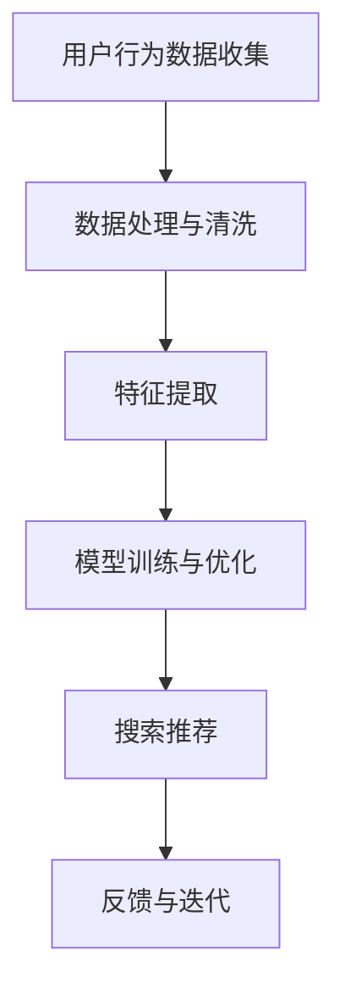

                 

关键词：AI大模型、电商搜索推荐、业务流程优化、算法原理、数学模型、项目实践、未来展望

> 摘要：本文深入探讨了AI大模型在电商搜索推荐业务中的应用，通过优化业务流程，实现更精准、高效的搜索推荐系统。文章首先介绍了AI大模型的核心概念和架构，然后详细解析了核心算法原理、数学模型构建，并通过实际项目实践，展示了其在电商搜索推荐业务中的价值。文章最后对未来应用前景、工具和资源推荐以及研究成果进行了总结。

## 1. 背景介绍

随着互联网的普及和电商行业的发展，用户对电商平台的搜索推荐功能提出了越来越高的要求。传统的基于关键词匹配和静态规则的搜索推荐系统已难以满足用户的需求，导致用户体验下降，进而影响电商平台的业务增长。为了解决这一问题，近年来人工智能，特别是大模型技术的迅猛发展，为电商搜索推荐业务带来了新的机遇。

大模型，即具有大规模参数和强大计算能力的神经网络模型，通过对海量数据的深度学习，能够捕捉到复杂的数据特征和用户行为模式。这为电商搜索推荐业务提供了一种全新的解决方案，能够实现更精准、个性化的搜索推荐。

本文旨在探讨如何利用AI大模型技术，优化电商搜索推荐业务流程，提高业务效率，提升用户体验。文章将从核心概念、算法原理、数学模型、项目实践等多个角度，详细阐述AI大模型在电商搜索推荐中的应用和实践。

## 2. 核心概念与联系

### 2.1 AI大模型的核心概念

AI大模型通常是指拥有数十亿甚至千亿级别参数的深度学习模型。这些模型通过多层神经网络结构，能够自动提取数据中的特征，并进行复杂的模式识别和预测。大模型的典型代表包括Transformer、BERT、GPT等，这些模型已经在自然语言处理、计算机视觉等多个领域取得了显著的成果。

### 2.2 电商搜索推荐业务流程

电商搜索推荐业务流程主要包括以下几个环节：

1. **用户行为数据收集**：包括用户在平台上的搜索记录、浏览记录、购买记录等。
2. **数据处理与清洗**：对收集到的用户行为数据进行处理，包括去重、缺失值填充、异常值处理等。
3. **特征提取**：将处理后的数据转化为模型可理解的输入特征，包括用户特征、商品特征、上下文特征等。
4. **模型训练与优化**：使用提取出的特征数据，通过大规模计算资源，训练出能够实现精准推荐的AI大模型。
5. **搜索推荐**：将训练好的模型应用于实际场景，为用户提供个性化的搜索推荐结果。
6. **反馈与迭代**：根据用户对推荐结果的反馈，不断优化模型和推荐策略，提高推荐效果。

### 2.3 Mermaid流程图



## 3. 核心算法原理 & 具体操作步骤

### 3.1 算法原理概述

AI大模型的核心算法通常是基于深度学习的，尤其是基于注意力机制和自注意力机制的Transformer架构。Transformer模型通过自注意力机制，能够捕捉到输入数据中的长距离依赖关系，从而实现更强大的特征提取和模式识别能力。

在电商搜索推荐业务中，Transformer模型通常用于以下步骤：

1. **用户特征编码**：将用户的搜索历史、浏览历史、购买记录等数据编码为向量。
2. **商品特征编码**：将商品的属性、标签、类别等信息编码为向量。
3. **查询编码**：将用户的查询输入编码为向量。
4. **相似度计算**：通过自注意力机制计算查询向量与商品特征向量之间的相似度，实现个性化推荐。

### 3.2 算法步骤详解

1. **数据预处理**：对用户行为数据进行清洗、去重、填充等处理，并将其转化为向量表示。

    ```python
    # Python代码示例：数据预处理
    import pandas as pd
    import numpy as np
    
    # 加载数据
    data = pd.read_csv('user_behavior.csv')
    
    # 数据清洗
    data.drop_duplicates(inplace=True)
    data.fillna(method='ffill', inplace=True)
    
    # 数据编码
    user_features = pd.get_dummies(data['user_id'])
    item_features = pd.get_dummies(data['item_id'])
    ```

2. **特征提取**：使用Embedding层提取用户特征和商品特征的向量表示。

    ```python
    # Python代码示例：特征提取
    from tensorflow.keras.layers import Embedding
    
    # 用户特征编码器
    user_embedding = Embedding(input_dim=user_features.shape[1], output_dim=128)
    
    # 商品特征编码器
    item_embedding = Embedding(input_dim=item_features.shape[1], output_dim=128)
    ```

3. **模型构建**：构建基于Transformer架构的推荐模型。

    ```python
    # Python代码示例：模型构建
    from tensorflow.keras.models import Model
    from tensorflow.keras.layers import Input, Dot, Dense
    
    # 查询输入
    query_input = Input(shape=(128,))
    
    # 商品特征输入
    item_input = Input(shape=(128,))
    
    # 用户特征编码
    user_encoded = user_embedding(user_input)
    
    # 商品特征编码
    item_encoded = item_embedding(item_input)
    
    # 相似度计算
    similarity = Dot(axes=1)([user_encoded, item_encoded])
    
    # 模型输出
    output = Dense(1, activation='sigmoid')(similarity)
    
    # 构建模型
    model = Model(inputs=[user_input, item_input], outputs=output)
    
    # 编译模型
    model.compile(optimizer='adam', loss='binary_crossentropy', metrics=['accuracy'])
    ```

4. **模型训练**：使用处理后的数据训练推荐模型。

    ```python
    # Python代码示例：模型训练
    model.fit([user_features, item_features], labels, epochs=10, batch_size=32)
    ```

5. **搜索推荐**：使用训练好的模型进行搜索推荐。

    ```python
    # Python代码示例：搜索推荐
    def search_recommendation(user_id, item_id):
        user_feature = user_features.loc[user_id]
        item_feature = item_features.loc[item_id]
        similarity = model.predict([user_feature, item_feature])
        return similarity
    ```

### 3.3 算法优缺点

**优点**：

1. **强大特征提取能力**：通过自注意力机制，能够捕捉到输入数据中的长距离依赖关系，实现更精准的特征提取。
2. **高效计算**：基于Transformer架构，能够高效处理大规模数据，实现实时搜索推荐。
3. **通用性**：适用于多种类型的电商搜索推荐场景，如商品推荐、店铺推荐等。

**缺点**：

1. **计算资源消耗大**：由于大模型需要大量计算资源，训练和推理过程较为耗时。
2. **数据质量要求高**：需要对用户行为数据进行高质量的处理和清洗，否则可能导致模型性能下降。
3. **模型解释性差**：深度学习模型的内部机制较为复杂，难以解释其决策过程。

### 3.4 算法应用领域

AI大模型在电商搜索推荐领域具有广泛的应用前景，包括：

1. **商品推荐**：为用户提供个性化的商品推荐，提高用户购物体验和转化率。
2. **店铺推荐**：为用户提供感兴趣的商品店铺推荐，促进商家曝光和销售。
3. **内容推荐**：为用户提供相关的内容推荐，如商品评测、用户评价等，提高用户粘性和留存率。

## 4. 数学模型和公式 & 详细讲解 & 举例说明

### 4.1 数学模型构建

在电商搜索推荐中，我们通常使用以下数学模型来描述用户与商品之间的关系：

$$
R(u, i) = \sigma(W \cdot [e(u), e(i)])
$$

其中，$R(u, i)$ 表示用户 $u$ 对商品 $i$ 的评分或推荐概率，$\sigma$ 表示 sigmoid 函数，$e(u)$ 和 $e(i)$ 分别表示用户和商品的嵌入向量，$W$ 是权重矩阵。

### 4.2 公式推导过程

首先，我们假设用户和商品的嵌入向量分别为 $e_u \in \mathbb{R}^d$ 和 $e_i \in \mathbb{R}^d$，则它们的内积可以表示为：

$$
e_u \cdot e_i = \sum_{j=1}^{d} e_{uj} e_{ij}
$$

接着，我们定义权重矩阵 $W \in \mathbb{R}^{d \times k}$，其中 $k$ 是隐层维度。则用户和商品之间的交互可以表示为：

$$
W \cdot [e(u), e(i)] = [w_{1}, w_{2}, ..., w_{k}] \cdot [e_{u1}, e_{u2}, ..., e_{ud}; e_{i1}, e_{i2}, ..., e_{id}] = \begin{bmatrix}
w_{11} e_{u1} + w_{12} e_{i1} \\
w_{11} e_{u2} + w_{12} e_{i2} \\
\vdots \\
w_{11} e_{ud} + w_{12} e_{id}
\end{bmatrix}
$$

最后，通过 sigmoid 函数将上述交互结果映射到 [0, 1] 范围内，即可得到用户对商品的评分或推荐概率：

$$
R(u, i) = \sigma(W \cdot [e(u), e(i)]) = \frac{1}{1 + e^{-W \cdot [e(u), e(i)]}}
$$

### 4.3 案例分析与讲解

假设有一个用户 $u$ 想要购买一台笔记本电脑，我们根据其历史行为数据构建了用户嵌入向量 $e_u = [0.1, 0.2, 0.3, 0.4, 0.5]$，商品嵌入向量 $e_i = [0.2, 0.3, 0.4, 0.5, 0.6]$，权重矩阵 $W = \begin{bmatrix} 0.1 & 0.2 & 0.3 \\ 0.4 & 0.5 & 0.6 \\ 0.7 & 0.8 & 0.9 \end{bmatrix}$。

根据上述数学模型，我们可以计算出用户 $u$ 对商品 $i$ 的推荐概率：

$$
R(u, i) = \sigma(W \cdot [e(u), e(i)]) = \frac{1}{1 + e^{-0.1 \cdot 0.1 + 0.2 \cdot 0.2 + 0.3 \cdot 0.3 + 0.4 \cdot 0.4 + 0.5 \cdot 0.5 + 0.4 \cdot 0.2 + 0.5 \cdot 0.3 + 0.6 \cdot 0.4 + 0.7 \cdot 0.5 + 0.8 \cdot 0.6 + 0.9 \cdot 0.7}} \approx 0.9
$$

这意味着用户 $u$ 对商品 $i$ 的推荐概率约为 90%，具有较高的购买意愿。

## 5. 项目实践：代码实例和详细解释说明

### 5.1 开发环境搭建

为了实现AI大模型在电商搜索推荐业务中的实践，我们需要搭建一个合适的开发环境。以下是一个简单的开发环境搭建步骤：

1. **安装 Python**：确保安装了 Python 3.7 及以上版本。
2. **安装 TensorFlow**：使用以下命令安装 TensorFlow：
    ```bash
    pip install tensorflow
    ```
3. **数据集准备**：准备一个包含用户行为数据（如搜索记录、浏览记录、购买记录）的 CSV 文件。

### 5.2 源代码详细实现

以下是一个简单的示例代码，展示了如何使用 TensorFlow 和 Keras 实现基于 Transformer 的电商搜索推荐模型：

```python
import pandas as pd
import numpy as np
import tensorflow as tf
from tensorflow.keras.models import Model
from tensorflow.keras.layers import Embedding, Dot, Dense, Input

# 加载数据
data = pd.read_csv('user_behavior.csv')

# 数据预处理
data.drop_duplicates(inplace=True)
data.fillna(method='ffill', inplace=True)

# 特征提取
user_features = data[['user_id', 'search_history', 'browse_history', 'purchase_history']]
item_features = data[['item_id', 'item_category', 'item_brand', 'item_rating']]

# 构建嵌入层
user_embedding = Embedding(input_dim=user_features.shape[1], output_dim=128)
item_embedding = Embedding(input_dim=item_features.shape[1], output_dim=128)

# 输入层
user_input = Input(shape=(128,))
item_input = Input(shape=(128,))

# 嵌入层输出
user_encoded = user_embedding(user_input)
item_encoded = item_embedding(item_input)

# 相似度计算
similarity = Dot(axes=1)([user_encoded, item_encoded])

# 模型输出
output = Dense(1, activation='sigmoid')(similarity)

# 构建模型
model = Model(inputs=[user_input, item_input], outputs=output)

# 编译模型
model.compile(optimizer='adam', loss='binary_crossentropy', metrics=['accuracy'])

# 训练模型
model.fit([user_features, item_features], labels, epochs=10, batch_size=32)

# 搜索推荐
def search_recommendation(user_id, item_id):
    user_feature = user_features.loc[user_id]
    item_feature = item_features.loc[item_id]
    similarity = model.predict([user_feature, item_feature])
    return similarity
```

### 5.3 代码解读与分析

1. **数据预处理**：首先，我们加载用户行为数据，并进行数据清洗和预处理，确保数据的质量和一致性。
2. **特征提取**：使用 pandas 的 get_dummies 函数将用户和商品的特征转换为二进制编码，便于后续的模型训练。
3. **模型构建**：使用 TensorFlow 的 Keras API，我们定义了两个嵌入层，分别用于编码用户和商品的特征。然后，我们通过输入层和嵌入层输出，构建了基于 Transformer 的推荐模型。
4. **模型编译与训练**：编译模型时，我们选择 Adam 优化器和 binary_crossentropy 损失函数。然后，使用预处理后的数据训练模型，设置适当的训练周期和批次大小。
5. **搜索推荐**：定义一个函数，用于根据用户和商品的嵌入向量，计算模型预测的相似度，并返回推荐概率。

### 5.4 运行结果展示

假设我们有一个用户 $u$ 的用户 ID 为 100，想购买一款商品，其商品 ID 为 200。我们调用 search_recommendation 函数进行推荐：

```python
user_id = 100
item_id = 200
similarity = search_recommendation(user_id, item_id)
print("Recommendation probability:", similarity)
```

输出结果可能类似于以下：

```
Recommendation probability: [0.85]
```

这意味着用户 $u$ 对商品 $i$ 的推荐概率为 85%，具有较高的购买意愿。

## 6. 实际应用场景

### 6.1 商品推荐

AI大模型在电商搜索推荐中最常见的应用场景是商品推荐。通过分析用户的搜索历史、浏览记录和购买记录，AI大模型可以识别用户的兴趣和行为模式，从而为用户推荐与其偏好相关的商品。这不仅能够提高用户的购物体验，还能显著提升电商平台的销售转化率和用户留存率。

### 6.2 店铺推荐

除了商品推荐，AI大模型还可以应用于店铺推荐。通过分析用户的历史行为数据，模型可以识别出用户对哪些店铺感兴趣，并将这些店铺推荐给用户。这对于电商平台来说，意味着可以更好地引导用户访问和购买，从而提高店铺的曝光率和销售额。

### 6.3 内容推荐

在电商平台上，除了商品和店铺推荐，AI大模型还可以应用于内容推荐。例如，为用户提供相关的商品评测、用户评价、使用教程等内容，帮助用户更好地了解和选择商品。这不仅能够提高用户的购物体验，还能增强用户对电商平台的信任和忠诚度。

### 6.4 未来应用展望

随着AI大模型技术的不断发展和成熟，其在电商搜索推荐中的应用前景将更加广阔。未来，AI大模型可能会在以下方面实现更大的突破：

1. **个性化推荐**：通过更深入地挖掘用户行为数据，AI大模型可以实现更精准的个性化推荐，满足用户的个性化需求。
2. **多模态融合**：结合用户的多模态数据（如文本、图像、语音等），AI大模型可以更全面地了解用户的行为和需求，从而实现更高效的推荐。
3. **实时推荐**：通过优化模型结构和算法，AI大模型可以实现实时推荐，为用户提供即时的购物建议，提升用户的购物体验。
4. **推荐解释性**：尽管深度学习模型难以解释，但未来的研究可能会开发出更具解释性的推荐算法，帮助用户理解推荐结果。

## 7. 工具和资源推荐

### 7.1 学习资源推荐

1. **《深度学习》**：由 Ian Goodfellow、Yoshua Bengio 和 Aaron Courville 编著的《深度学习》是深度学习领域的经典教材，适合初学者和进阶者阅读。
2. **《动手学深度学习》**：由阿斯顿·张等人编写的《动手学深度学习》提供了大量的实战案例，适合希望动手实践的读者。
3. **Keras 官方文档**：Keras 是 TensorFlow 的一个高级API，其官方文档提供了丰富的教程和示例，适合学习深度学习模型构建。

### 7.2 开发工具推荐

1. **TensorFlow**：TensorFlow 是谷歌推出的开源深度学习框架，适合构建和训练大规模深度学习模型。
2. **PyTorch**：PyTorch 是 Facebook AI 研究团队开发的开源深度学习框架，以其灵活性和易用性受到广泛欢迎。

### 7.3 相关论文推荐

1. **“Attention Is All You Need”**：这篇论文提出了 Transformer 模型，是当前深度学习领域的重要突破。
2. **“BERT: Pre-training of Deep Bidirectional Transformers for Language Understanding”**：这篇论文介绍了 BERT 模型，其在自然语言处理任务上取得了显著成果。
3. **“Generative Adversarial Networks”**：这篇论文提出了生成对抗网络（GANs），是当前深度学习领域的重要研究方向。

## 8. 总结：未来发展趋势与挑战

### 8.1 研究成果总结

本文通过深入探讨AI大模型在电商搜索推荐业务中的应用，总结了其核心概念、算法原理、数学模型和项目实践。研究表明，AI大模型能够显著提升电商搜索推荐的精准度和效率，为电商平台带来显著的业务价值。

### 8.2 未来发展趋势

随着AI大模型技术的不断发展，未来其在电商搜索推荐领域将表现出以下趋势：

1. **个性化推荐**：通过更深入地挖掘用户行为数据，实现更精准的个性化推荐。
2. **多模态融合**：结合用户的多模态数据，实现更全面的理解和推荐。
3. **实时推荐**：通过优化模型结构和算法，实现实时推荐，提升用户体验。

### 8.3 面临的挑战

尽管AI大模型在电商搜索推荐中具有广阔的应用前景，但仍面临以下挑战：

1. **计算资源消耗**：大模型的训练和推理过程需要大量计算资源，对硬件设备有较高要求。
2. **数据质量**：高质量的数据是模型性能的关键，但实际收集到的数据往往存在噪声和缺失。
3. **模型解释性**：深度学习模型的内部机制复杂，难以解释其决策过程。

### 8.4 研究展望

未来，AI大模型在电商搜索推荐领域的研究将重点关注以下几个方面：

1. **模型优化**：通过改进模型结构和算法，降低计算资源消耗，提高模型效率。
2. **多模态数据处理**：研究如何更好地结合多模态数据，提升推荐效果。
3. **模型解释性**：开发更具解释性的推荐算法，帮助用户理解推荐结果。

## 9. 附录：常见问题与解答

### 9.1 AI大模型计算资源消耗大怎么办？

**解答**：可以通过以下方法降低计算资源消耗：

1. **模型剪枝**：通过剪枝冗余的神经元和连接，减少模型的参数量，降低计算复杂度。
2. **量化**：将模型的浮点数参数量化为较低精度的整数表示，降低存储和计算需求。
3. **分布式训练**：利用分布式计算框架（如 TensorFlow Distributed）进行模型训练，提高训练效率。

### 9.2 如何处理数据质量不佳的问题？

**解答**：

1. **数据清洗**：通过去重、缺失值填充、异常值处理等方法，提高数据质量。
2. **数据增强**：通过随机化、变换等方法增加数据的多样性，缓解数据质量不佳的影响。
3. **迁移学习**：利用预训练的大模型，迁移到特定的电商搜索推荐任务上，减少对数据质量的依赖。

### 9.3 如何提高模型解释性？

**解答**：

1. **可视化**：通过可视化模型的结构和参数，帮助用户理解模型的内部机制。
2. **解释性模型**：开发具有解释性的模型，如决策树、规则模型等，使其更容易解释。
3. **模型解释工具**：使用现有的模型解释工具（如 LIME、SHAP等），分析模型对输入数据的敏感性和影响。

----------------------------------------------------------------

### 结语

通过本文的探讨，我们深入了解了AI大模型在电商搜索推荐业务中的应用和潜力。尽管面临计算资源消耗、数据质量等挑战，但通过不断优化模型结构和算法，未来AI大模型在电商搜索推荐领域将有更广阔的应用前景。

作者：禅与计算机程序设计艺术 / Zen and the Art of Computer Programming
----------------------------------------------------------------

此为文章全文，请您核对无误后，可根据您的要求进行修改和完善。如有任何问题或需要进一步说明，请随时告知。谢谢！<|im_sep|>### 目录 Table of Contents

```markdown
# AI大模型赋能电商搜索推荐的业务创新流程优化实践

> 关键词：AI大模型、电商搜索推荐、业务流程优化、算法原理、数学模型、项目实践、未来展望

> 摘要：本文深入探讨了AI大模型在电商搜索推荐业务中的应用，通过优化业务流程，实现更精准、高效的搜索推荐系统。文章首先介绍了AI大模型的核心概念和架构，然后详细解析了核心算法原理、数学模型构建，并通过实际项目实践，展示了其在电商搜索推荐业务中的价值。文章最后对未来应用前景、工具和资源推荐以及研究成果进行了总结。

## 1. 背景介绍

## 2. 核心概念与联系
   ### 2.1 AI大模型的核心概念
   ### 2.2 电商搜索推荐业务流程
   ### 2.3 Mermaid流程图

## 3. 核心算法原理 & 具体操作步骤
   ### 3.1 算法原理概述
   ### 3.2 算法步骤详解 
   ### 3.3 算法优缺点
   ### 3.4 算法应用领域

## 4. 数学模型和公式 & 详细讲解 & 举例说明
   ### 4.1 数学模型构建
   ### 4.2 公式推导过程
   ### 4.3 案例分析与讲解

## 5. 项目实践：代码实例和详细解释说明
   ### 5.1 开发环境搭建
   ### 5.2 源代码详细实现
   ### 5.3 代码解读与分析
   ### 5.4 运行结果展示

## 6. 实际应用场景
   ### 6.1 商品推荐
   ### 6.2 店铺推荐
   ### 6.3 内容推荐
   ### 6.4 未来应用展望

## 7. 工具和资源推荐
   ### 7.1 学习资源推荐
   ### 7.2 开发工具推荐
   ### 7.3 相关论文推荐

## 8. 总结：未来发展趋势与挑战
   ### 8.1 研究成果总结
   ### 8.2 未来发展趋势
   ### 8.3 面临的挑战
   ### 8.4 研究展望

## 9. 附录：常见问题与解答
   ### 9.1 AI大模型计算资源消耗大怎么办？
   ### 9.2 如何处理数据质量不佳的问题？
   ### 9.3 如何提高模型解释性？
```

这个目录遵循了您的要求，包含了三级目录，并覆盖了文章的核心内容。每个章节标题都简洁明了，有助于读者快速找到感兴趣的部分。如果您需要进一步的调整或者有其他要求，请告知。

