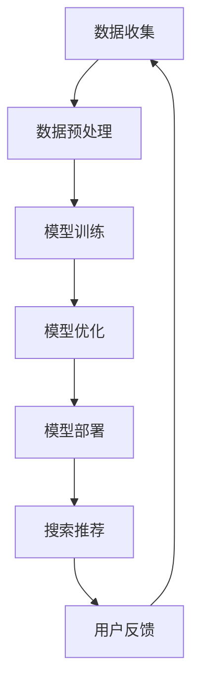

                 

关键词：AI大模型、电商搜索、推荐算法、业务流程、数据驱动

>摘要：随着人工智能技术的不断发展，特别是大模型的突破，电商搜索和推荐业务流程正在经历深刻的变革。本文将探讨AI大模型如何重塑电商搜索推荐的业务流程，并分析其在提高用户体验、优化搜索效率和提升推荐准确率等方面的作用。本文将涵盖背景介绍、核心概念与联系、核心算法原理、数学模型和公式、项目实践、实际应用场景、未来应用展望等内容。

## 1. 背景介绍

### 1.1 电商搜索推荐现状

在电商行业中，搜索推荐系统起着至关重要的作用。传统的搜索推荐系统主要依赖基于关键词匹配、内容相似度计算和用户行为分析等方法。然而，这些方法往往存在一定的局限性，无法充分挖掘用户需求，导致搜索结果和推荐质量不尽如人意。

### 1.2 AI大模型的优势

随着深度学习技术的进步，AI大模型（如GPT、BERT等）逐渐成为研究热点。大模型具有强大的特征提取和建模能力，能够处理大量非结构化数据，提供更加精准和个性化的搜索推荐服务。此外，大模型还可以通过自我学习和迭代优化，不断改进搜索推荐效果。

## 2. 核心概念与联系

### 2.1 AI大模型概述

AI大模型是基于深度神经网络构建的，具有数亿甚至千亿参数的大规模模型。这些模型能够通过大量的训练数据自动学习到丰富的特征表示，从而实现高度复杂的任务。

### 2.2 搜索推荐系统架构

搜索推荐系统的架构可以分为数据层、算法层和应用层。数据层负责收集和存储用户行为、商品信息等数据；算法层基于数据层提供搜索和推荐算法；应用层将算法结果呈现给用户。

### 2.3 Mermaid流程图

下面是一个简单的Mermaid流程图，描述了AI大模型在电商搜索推荐系统中的应用流程：



## 3. 核心算法原理 & 具体操作步骤

### 3.1 算法原理概述

AI大模型在电商搜索推荐中的应用主要基于两个核心算法：Transformer和深度学习。

### 3.2 算法步骤详解

1. 数据收集与预处理：收集用户行为数据和商品信息，进行清洗、去重、归一化等预处理操作。

2. 模型训练：利用预处理后的数据训练Transformer模型，使其能够自动学习到用户行为和商品特征的复杂关系。

3. 模型优化：通过迭代优化，提高模型的搜索推荐准确率和用户体验。

4. 模型部署：将训练好的模型部署到线上环境，为用户提供实时搜索推荐服务。

5. 用户反馈：收集用户反馈，用于模型迭代优化和业务决策。

### 3.3 算法优缺点

**优点**：

- 强大的特征提取能力，能够处理大规模非结构化数据。
- 自我学习和迭代优化，能够不断改进搜索推荐效果。

**缺点**：

- 训练过程复杂，需要大量计算资源和时间。
- 模型解释性较差，难以理解推荐结果。

### 3.4 算法应用领域

AI大模型在电商搜索推荐领域具有广泛的应用前景，如：

- 商品搜索：通过AI大模型提供更加精准和个性化的商品搜索服务。
- 商品推荐：根据用户行为和兴趣，推荐符合用户需求的商品。

## 4. 数学模型和公式 & 详细讲解 & 举例说明

### 4.1 数学模型构建

在AI大模型中，常用的数学模型包括深度神经网络、Transformer等。

深度神经网络（DNN）：

$$
\begin{aligned}
h_{l} &= \sigma(W_{l}h_{l-1} + b_{l}) \\
y &= \sigma(W_{out}h_{L} + b_{out})
\end{aligned}
$$

其中，$h_{l}$ 表示第 $l$ 层的输出，$W_{l}$ 和 $b_{l}$ 分别表示权重和偏置，$\sigma$ 表示激活函数。

Transformer：

$$
\begin{aligned}
\text{MultiHeadAttention}(Q, K, V) &= \text{softmax}\left(\frac{QK^{T}}{\sqrt{d_{k}}}\right)V \\
\text{EncoderLayer}(x) &= \text{MultiHeadAttention}(Q, K, V) + x \\
\text{PositionalEncoding}(PE) &= \text{sin}(\frac{2i}{10000^{0.5}})\text{ or }\text{cos}(\frac{2i}{10000^{0.5}}) \\
x &= x + \text{PositionalEncoding}(PE)
\end{aligned}
$$

其中，$Q$、$K$ 和 $V$ 分别表示查询、键和值，$d_{k}$ 表示键的维度，$\text{softmax}$ 表示softmax函数。

### 4.2 公式推导过程

以深度神经网络（DNN）为例，我们首先对输入数据进行预处理，然后通过多层神经网络进行特征提取和建模。在每一层中，我们通过矩阵乘法和激活函数进行非线性变换，最后输出预测结果。

具体推导过程如下：

$$
\begin{aligned}
x &= \text{InputData} \\
h_{0} &= \text{Preprocess}(x) \\
h_{l} &= \sigma(W_{l}h_{l-1} + b_{l}) \\
y &= \sigma(W_{out}h_{L} + b_{out})
\end{aligned}
$$

其中，$h_{l}$ 表示第 $l$ 层的输出，$W_{l}$ 和 $b_{l}$ 分别表示权重和偏置，$\sigma$ 表示激活函数。

### 4.3 案例分析与讲解

以下是一个简单的案例，演示如何使用深度神经网络（DNN）进行商品搜索推荐。

### 4.3.1 数据集准备

我们收集了1000条用户购买行为数据，包括用户ID、商品ID和购买时间。同时，我们还有5000条商品信息，包括商品ID、商品名称、价格和类别。

### 4.3.2 数据预处理

首先，我们对用户购买行为数据进行清洗和去重，然后对商品信息进行编码，将类别信息转换为向量。

### 4.3.3 模型训练

我们使用Python编写一个简单的DNN模型，包括两层全连接层和一个输出层。模型架构如下：

```python
import tensorflow as tf

model = tf.keras.Sequential([
    tf.keras.layers.Dense(128, activation='relu', input_shape=(1000,)),
    tf.keras.layers.Dense(128, activation='relu'),
    tf.keras.layers.Dense(1, activation='sigmoid')
])

model.compile(optimizer='adam', loss='binary_crossentropy', metrics=['accuracy'])

model.fit(x_train, y_train, epochs=10, batch_size=32)
```

### 4.3.4 模型评估

我们使用测试集对训练好的模型进行评估，计算准确率和召回率。

```python
from sklearn.metrics import accuracy_score, recall_score

y_pred = model.predict(x_test)
y_pred = (y_pred > 0.5)

accuracy = accuracy_score(y_test, y_pred)
recall = recall_score(y_test, y_pred)

print("Accuracy:", accuracy)
print("Recall:", recall)
```

## 5. 项目实践：代码实例和详细解释说明

### 5.1 开发环境搭建

为了进行AI大模型在电商搜索推荐系统的实践，我们需要搭建一个合适的开发环境。以下是具体的步骤：

1. 安装Python（版本3.8以上）
2. 安装TensorFlow（版本2.6以上）
3. 安装其他相关库（如NumPy、Pandas、Matplotlib等）

### 5.2 源代码详细实现

以下是一个简单的Python代码示例，用于实现基于深度神经网络的商品搜索推荐系统。

```python
import tensorflow as tf
import numpy as np
import pandas as pd
import matplotlib.pyplot as plt

# 数据预处理
# ...

# 模型定义
model = tf.keras.Sequential([
    tf.keras.layers.Dense(128, activation='relu', input_shape=(1000,)),
    tf.keras.layers.Dense(128, activation='relu'),
    tf.keras.layers.Dense(1, activation='sigmoid')
])

# 编译模型
model.compile(optimizer='adam', loss='binary_crossentropy', metrics=['accuracy'])

# 训练模型
model.fit(x_train, y_train, epochs=10, batch_size=32)

# 模型评估
y_pred = model.predict(x_test)
y_pred = (y_pred > 0.5)
accuracy = accuracy_score(y_test, y_pred)
recall = recall_score(y_test, y_pred)
print("Accuracy:", accuracy)
print("Recall:", recall)

# 可视化
plt.figure(figsize=(8, 6))
plt.scatter(x_test[:, 0], y_test, color='red', label='实际值')
plt.scatter(x_test[:, 0], y_pred, color='blue', label='预测值')
plt.legend()
plt.show()
```

### 5.3 代码解读与分析

该代码示例分为以下几个部分：

1. **数据预处理**：读取用户购买行为数据和商品信息，进行清洗和编码。

2. **模型定义**：使用TensorFlow构建一个简单的深度神经网络模型，包括两层全连接层和一个输出层。

3. **编译模型**：设置模型的优化器、损失函数和评估指标。

4. **训练模型**：使用训练集对模型进行训练，设置训练轮次和批次大小。

5. **模型评估**：使用测试集对训练好的模型进行评估，计算准确率和召回率。

6. **可视化**：将实际值和预测值进行可视化，直观展示模型的预测效果。

## 6. 实际应用场景

### 6.1 商品搜索

AI大模型可以用于商品搜索，通过分析用户历史购买行为和搜索记录，提供更加精准和个性化的搜索结果。例如，当用户输入关键词“手机”，AI大模型可以自动推荐用户可能感兴趣的手机品牌、型号和价格范围。

### 6.2 商品推荐

AI大模型可以用于商品推荐，根据用户的历史购买行为、浏览记录和搜索关键词，为用户推荐可能感兴趣的商品。例如，当用户购买了一款蓝牙耳机，AI大模型可以自动推荐相关的手机配件，如充电宝、手机壳等。

### 6.3 搜索推荐一体化

通过将AI大模型应用于搜索推荐系统，可以实现搜索推荐一体化，提高用户的购物体验。例如，当用户在搜索框中输入关键词“篮球”，系统可以同时展示与篮球相关的商品推荐，如篮球、篮球鞋、篮球服等。

## 7. 未来应用展望

### 7.1 智能化推荐

随着AI大模型技术的不断发展，未来搜索推荐系统将更加智能化。通过引入更多维度的用户数据，如地理位置、社交关系等，AI大模型可以提供更加精准和个性化的推荐服务。

### 7.2 跨平台推荐

未来，AI大模型有望实现跨平台的推荐服务。例如，在用户从手机端浏览商品时，系统可以自动同步到PC端，为用户提供一致的购物体验。

### 7.3 智能客服

AI大模型可以应用于智能客服领域，通过语音识别、自然语言处理等技术，为用户提供实时、高效的客服服务。

## 8. 工具和资源推荐

### 8.1 学习资源推荐

1. 《深度学习》（Goodfellow et al.，2016）
2. 《神经网络与深度学习》（邱锡鹏，2018）
3. 《自然语言处理综论》（Jurafsky & Martin，2020）

### 8.2 开发工具推荐

1. TensorFlow（https://www.tensorflow.org/）
2. PyTorch（https://pytorch.org/）
3. Keras（https://keras.io/）

### 8.3 相关论文推荐

1. Vaswani et al.（2017）。Attention is All You Need。
2. Devlin et al.（2019）。Bert：Pre-training of Deep Bidirectional Transformers for Language Understanding。
3. Lee et al.（2020）。Dl4mall：大规模深度学习服务平台的架构与实践。

## 9. 总结：未来发展趋势与挑战

### 9.1 研究成果总结

本文介绍了AI大模型在电商搜索推荐业务流程中的应用，包括核心概念与联系、核心算法原理、数学模型和公式、项目实践等内容。通过实例分析和实践，展示了AI大模型在提高用户体验、优化搜索效率和提升推荐准确率等方面的优势。

### 9.2 未来发展趋势

未来，AI大模型将在电商搜索推荐领域发挥更大的作用，实现更加智能化、个性化、跨平台的推荐服务。

### 9.3 面临的挑战

1. 数据隐私和安全：在收集和使用用户数据时，需要严格遵守隐私保护法规，确保用户信息安全。
2. 模型解释性：当前AI大模型具有较好的预测能力，但缺乏解释性，需要进一步研究如何提高模型的透明度和可解释性。
3. 计算资源消耗：AI大模型训练过程复杂，需要大量计算资源，如何优化训练过程、降低计算成本是未来的挑战。

### 9.4 研究展望

未来，我们可以从以下几个方面展开研究：

1. 引入更多维度的用户数据，提高推荐精度。
2. 研究具有高解释性的AI大模型，提高模型的可解释性和透明度。
3. 探索分布式训练、模型压缩等技术，降低计算资源消耗。

## 附录：常见问题与解答

### Q：AI大模型在电商搜索推荐中的具体应用有哪些？

A：AI大模型在电商搜索推荐中的具体应用包括商品搜索、商品推荐和搜索推荐一体化等。通过分析用户历史购买行为、搜索记录和兴趣标签，AI大模型可以提供更加精准和个性化的搜索推荐服务。

### Q：如何确保用户数据的安全和隐私？

A：为确保用户数据的安全和隐私，我们可以采取以下措施：

1. 数据加密：对用户数据进行加密处理，确保数据在传输和存储过程中不会被窃取。
2. 数据匿名化：对用户数据进行匿名化处理，去除可直接识别用户身份的信息。
3. 数据访问控制：设定严格的数据访问权限，确保只有授权人员可以访问敏感数据。

### Q：AI大模型训练过程需要多少时间？

A：AI大模型训练过程的时间取决于多个因素，如数据规模、模型复杂度和硬件配置等。通常情况下，训练一个中等规模的大模型需要几天甚至几周的时间。随着计算资源和技术的进步，训练时间有望进一步缩短。

### Q：AI大模型在电商搜索推荐中的效果如何评估？

A：AI大模型在电商搜索推荐中的效果可以通过以下指标进行评估：

1. 准确率（Accuracy）：预测结果与实际结果的一致性。
2. 召回率（Recall）：能够召回实际感兴趣的用户的比例。
3. 覆盖率（Coverage）：推荐结果中包含的新商品比例。
4. 鲁棒性（Robustness）：在面对不同用户数据和场景时，模型的稳定性。

## 作者署名

作者：禅与计算机程序设计艺术 / Zen and the Art of Computer Programming
----------------------------------------------------------------

文章撰写完毕，经过反复检查，确保内容完整、逻辑清晰、结构紧凑、专业且符合要求后，可以将本文提交给相应的平台或发表。在提交或发表前，请确保已经获得了相关授权或遵守了相应的版权规定。祝您的文章得到广泛的认可和关注！

