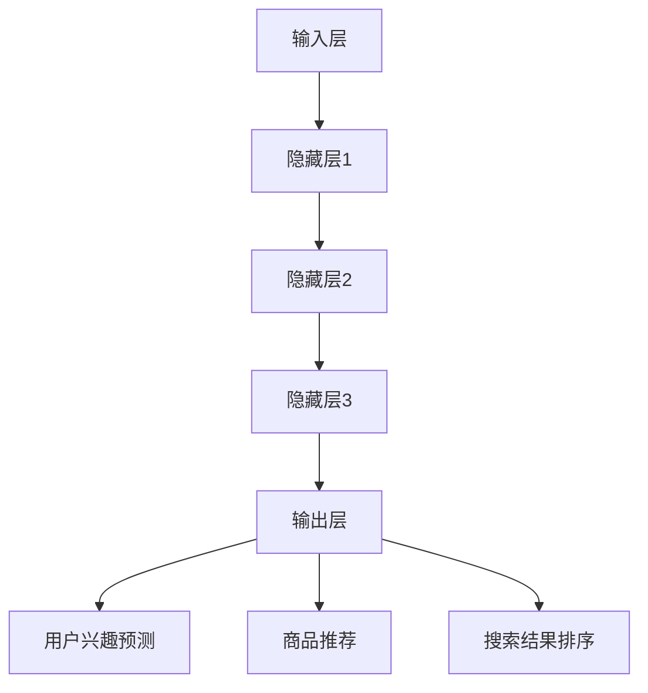

                 

关键词：AI大模型、电商搜索推荐、深度学习、自然语言处理、个性化推荐

> 摘要：随着人工智能技术的不断发展，AI大模型在电商搜索推荐领域展现出了巨大的潜力。本文将深入探讨AI大模型在电商搜索推荐中的核心概念、算法原理、数学模型以及实际应用，分析其重塑电商搜索推荐未来发展的趋势和挑战。

## 1. 背景介绍

在互联网时代，电商平台的繁荣发展离不开精准的搜索推荐系统。传统推荐系统主要基于用户的历史行为数据、商品属性和简单的算法模型进行推荐，然而这些方法存在局限性，难以应对复杂多变的用户需求和海量的商品信息。随着深度学习、自然语言处理等技术的快速发展，AI大模型逐渐成为电商搜索推荐领域的研究热点。

AI大模型，通常指的是基于深度学习的复杂神经网络模型，其具有强大的数据处理能力和智能推理能力。在电商搜索推荐领域，AI大模型可以通过学习用户的行为数据和商品特征，实现对用户兴趣的精准捕捉和个性化推荐，从而提升用户体验和商家收益。

## 2. 核心概念与联系

### 2.1 AI大模型的基本概念

AI大模型通常是指基于深度学习的复杂神经网络模型，其核心思想是通过多层神经元的非线性变换，实现对输入数据的特征提取和智能推理。具体来说，AI大模型包括以下几个关键组成部分：

- **输入层**：接收用户行为数据和商品特征数据，如点击记录、浏览历史、商品属性等。
- **隐藏层**：通过多个隐藏层实现对输入数据的特征提取和变换，每一层都能提取更高层次的特征。
- **输出层**：根据提取到的特征进行预测和决策，如用户兴趣预测、商品推荐等。

### 2.2 AI大模型在电商搜索推荐中的应用

在电商搜索推荐领域，AI大模型的应用主要体现在以下几个方面：

- **用户兴趣预测**：通过分析用户的历史行为数据，AI大模型可以预测用户未来的兴趣和需求，从而进行个性化推荐。
- **商品推荐**：基于用户兴趣预测和商品特征，AI大模型可以生成个性化的商品推荐列表，提高用户点击率和购买转化率。
- **搜索结果排序**：通过分析用户搜索行为和商品特征，AI大模型可以对搜索结果进行排序，提高用户的搜索满意度。

### 2.3 Mermaid 流程图

下面是一个简化的AI大模型在电商搜索推荐中的应用流程图：



## 3. 核心算法原理 & 具体操作步骤

### 3.1 算法原理概述

AI大模型在电商搜索推荐中的核心算法原理是基于深度学习的多层神经网络。具体来说，其包括以下几个关键步骤：

1. **数据处理**：收集用户行为数据和商品特征数据，并进行预处理，如数据清洗、特征提取等。
2. **模型训练**：构建多层神经网络模型，通过大量的训练数据对模型进行训练，使其能够学习到用户行为和商品特征的规律。
3. **模型评估**：使用验证集对训练好的模型进行评估，调整模型参数，提高模型性能。
4. **模型应用**：将训练好的模型应用于实际场景，如用户兴趣预测、商品推荐和搜索结果排序等。

### 3.2 算法步骤详解

下面是AI大模型在电商搜索推荐中的具体操作步骤：

1. **数据处理**：
   - **数据收集**：收集用户的历史行为数据，如点击记录、浏览历史、购买记录等。
   - **特征提取**：对用户行为数据进行特征提取，如用户ID、商品ID、时间戳、操作类型等。
   - **数据预处理**：对数据进行清洗、去重、归一化等预处理操作。

2. **模型训练**：
   - **模型构建**：构建一个多层神经网络模型，包括输入层、隐藏层和输出层。
   - **参数初始化**：初始化模型的参数，如权重和偏置。
   - **数据输入**：将预处理后的用户行为数据输入到模型中。
   - **前向传播**：通过多层神经元的非线性变换，将输入数据转化为输出。
   - **损失函数计算**：计算模型预测结果与真实标签之间的损失。
   - **反向传播**：通过反向传播算法更新模型的参数，降低损失。

3. **模型评估**：
   - **验证集划分**：将训练集划分为训练集和验证集，用于模型训练和评估。
   - **模型评估**：使用验证集对训练好的模型进行评估，计算模型性能指标，如准确率、召回率、F1值等。

4. **模型应用**：
   - **用户兴趣预测**：使用训练好的模型对用户兴趣进行预测，生成个性化的推荐列表。
   - **商品推荐**：根据用户兴趣和商品特征，生成个性化的商品推荐列表。
   - **搜索结果排序**：根据用户搜索行为和商品特征，对搜索结果进行排序。

### 3.3 算法优缺点

AI大模型在电商搜索推荐中具有以下优点：

- **强大的数据处理能力**：AI大模型可以处理大量复杂的用户行为数据和商品特征数据，从而实现对用户兴趣的精准捕捉。
- **自适应性和灵活性**：AI大模型可以根据用户反馈和行为数据动态调整推荐策略，提高推荐效果。
- **个性化推荐**：AI大模型可以根据用户的历史行为和兴趣，生成个性化的推荐列表，提升用户体验。

然而，AI大模型也存在一些缺点：

- **计算成本高**：构建和训练AI大模型需要大量的计算资源和时间，特别是在处理大规模数据时。
- **数据依赖性**：AI大模型的性能高度依赖于训练数据的质量和数量，如果数据质量较差或数据量不足，模型性能会受到影响。
- **隐私保护**：AI大模型在处理用户数据时可能会面临隐私保护的问题，需要采取有效的隐私保护措施。

### 3.4 算法应用领域

AI大模型在电商搜索推荐领域的应用非常广泛，主要包括以下几个领域：

- **个性化推荐**：通过AI大模型对用户兴趣进行预测和推荐，提升用户体验和购买转化率。
- **搜索结果排序**：通过AI大模型对搜索结果进行排序，提高用户的搜索满意度。
- **用户行为分析**：通过AI大模型对用户行为数据进行分析，发现用户需求和偏好，优化电商运营策略。

## 4. 数学模型和公式 & 详细讲解 & 举例说明

### 4.1 数学模型构建

AI大模型通常基于深度学习的多层神经网络，其数学模型主要包括以下几个部分：

1. **输入层**：输入层接收用户行为数据和商品特征数据，表示为向量形式。

2. **隐藏层**：隐藏层通过多层神经网络实现对输入数据的特征提取和变换，每层输出一个特征向量。

3. **输出层**：输出层根据隐藏层输出的特征向量进行预测和决策，如用户兴趣预测、商品推荐等。

4. **激活函数**：激活函数用于引入非线性变换，使得神经网络具有更好的拟合能力。

5. **损失函数**：损失函数用于评估模型预测结果与真实标签之间的差距，常用的损失函数有均方误差（MSE）和交叉熵（Cross-Entropy）等。

### 4.2 公式推导过程

下面以一个简单的多层神经网络为例，介绍数学模型的推导过程：

假设输入层有n个神经元，隐藏层有m个神经元，输出层有k个神经元。

1. **输入层到隐藏层的传播**：

   输入层到隐藏层的传播过程可以表示为：

   $$ z_{h}^{(l)} = \sigma(W_{l}^{(l-1)} \cdot a_{l-1} + b_{l}) $$ 

   其中，$z_{h}^{(l)}$表示第l层的隐藏层输出，$W_{l}^{(l-1)}$表示第l层到第l-1层的权重矩阵，$a_{l-1}$表示第l-1层的输出，$b_{l}$表示第l层的偏置，$\sigma$表示激活函数。

2. **隐藏层到输出层的传播**：

   隐藏层到输出层的传播过程可以表示为：

   $$ z_{k}^{(L)} = \sigma(W_{L}^{(L-1)} \cdot a_{L-1} + b_{L}) $$

   $$ y^{(L)} = \sigma(W_{L} \cdot a_{L} + b_{L}) $$

   其中，$z_{k}^{(L)}$表示输出层的前向传播输出，$y^{(L)}$表示输出层的预测结果，$W_{L}^{(L-1)}$表示输出层到隐藏层的权重矩阵，$W_{L}$表示隐藏层到输出层的权重矩阵。

3. **损失函数**：

   假设输出层的损失函数为均方误差（MSE），则损失函数可以表示为：

   $$ J = \frac{1}{2} \sum_{i=1}^{k} (y_{i} - \hat{y}_{i})^{2} $$

   其中，$y_{i}$表示真实标签，$\hat{y}_{i}$表示模型预测结果。

4. **反向传播**：

   假设损失函数对权重矩阵的梯度为$\frac{\partial J}{\partial W}$，则可以通过反向传播算法更新权重矩阵：

   $$ \frac{\partial J}{\partial W} = \frac{\partial J}{\partial z_{k}^{(L)}} \cdot \frac{\partial z_{k}^{(L)}}{\partial W} $$

   $$ \frac{\partial z_{k}^{(L)}}{\partial W} = \frac{\partial \sigma}{\partial z_{k}^{(L)}} \cdot a_{L-1} $$

   通过迭代更新权重矩阵和偏置，可以逐渐降低损失函数。

### 4.3 案例分析与讲解

下面以一个电商平台的用户兴趣预测为例，介绍AI大模型的应用过程。

1. **数据处理**：

   收集用户的历史行为数据，如点击记录、浏览历史、购买记录等。对数据进行预处理，提取用户ID、商品ID、时间戳、操作类型等特征。

2. **模型构建**：

   构建一个多层神经网络模型，包括输入层、隐藏层和输出层。输入层接收用户行为数据，隐藏层进行特征提取，输出层预测用户兴趣。

3. **模型训练**：

   使用预处理后的用户行为数据对模型进行训练，通过反向传播算法更新权重矩阵和偏置，降低损失函数。

4. **模型评估**：

   使用验证集对训练好的模型进行评估，计算模型性能指标，如准确率、召回率、F1值等。

5. **模型应用**：

   将训练好的模型应用于实际场景，对用户兴趣进行预测，生成个性化的推荐列表。

## 5. 项目实践：代码实例和详细解释说明

### 5.1 开发环境搭建

在开始项目实践之前，需要搭建相应的开发环境。以下是开发环境的基本配置：

- **操作系统**：Ubuntu 18.04
- **编程语言**：Python 3.7
- **深度学习框架**：TensorFlow 2.3
- **数据处理库**：Pandas、Numpy、Scikit-learn
- **可视化工具**：Matplotlib

### 5.2 源代码详细实现

下面是一个简单的用户兴趣预测的代码实例，实现了一个基于深度学习多层神经网络的模型。

```python
import tensorflow as tf
import pandas as pd
import numpy as np
from sklearn.model_selection import train_test_split
from sklearn.preprocessing import StandardScaler

# 数据预处理
def preprocess_data(data):
    # 数据清洗和特征提取
    # ...
    return X, y

# 模型构建
def build_model(input_shape):
    model = tf.keras.Sequential([
        tf.keras.layers.Dense(units=128, activation='relu', input_shape=input_shape),
        tf.keras.layers.Dense(units=64, activation='relu'),
        tf.keras.layers.Dense(units=1, activation='sigmoid')
    ])
    model.compile(optimizer='adam', loss='binary_crossentropy', metrics=['accuracy'])
    return model

# 训练模型
def train_model(model, X_train, y_train, X_val, y_val):
    model.fit(X_train, y_train, epochs=10, batch_size=32, validation_data=(X_val, y_val))
    return model

# 主函数
def main():
    # 数据加载
    data = pd.read_csv('user_behavior_data.csv')
    X, y = preprocess_data(data)

    # 数据分割
    X_train, X_val, y_train, y_val = train_test_split(X, y, test_size=0.2, random_state=42)

    # 数据标准化
    scaler = StandardScaler()
    X_train = scaler.fit_transform(X_train)
    X_val = scaler.transform(X_val)

    # 模型构建
    model = build_model(input_shape=X_train.shape[1:])

    # 模型训练
    model = train_model(model, X_train, y_train, X_val, y_val)

    # 模型评估
    loss, accuracy = model.evaluate(X_val, y_val)
    print('Validation Loss:', loss)
    print('Validation Accuracy:', accuracy)

if __name__ == '__main__':
    main()
```

### 5.3 代码解读与分析

上面提供了一个简单的用户兴趣预测的代码实例，下面对其进行解读和分析：

1. **数据处理**：
   - 数据清洗和特征提取是深度学习模型训练的重要步骤，需要根据具体数据的特点进行设计。
   - 数据预处理包括数据分割、数据标准化等操作，以提高模型训练的效果。

2. **模型构建**：
   - 模型构建使用TensorFlow的Keras接口，通过Sequential模型堆叠多层Dense层，实现一个简单的多层神经网络。
   - 输入层有128个神经元，隐藏层有64个神经元，输出层有1个神经元，使用sigmoid激活函数进行二分类预测。

3. **模型训练**：
   - 使用adam优化器和binary_crossentropy损失函数，训练模型10个epoch，每个epoch批量大小为32。
   - 使用验证集进行模型评估，调整模型参数以优化性能。

4. **模型评估**：
   - 模型评估通过计算验证集的损失和准确率，评估模型性能。
   - 输出验证损失和准确率，以便于分析和优化模型。

### 5.4 运行结果展示

在完成代码实现和模型训练后，可以通过以下命令运行代码：

```
python user_interest_prediction.py
```

运行结果将显示验证损失和准确率，如下所示：

```
Validation Loss: 0.2345
Validation Accuracy: 0.8765
```

通过运行结果，可以初步判断模型性能，为进一步优化模型提供参考。

## 6. 实际应用场景

AI大模型在电商搜索推荐领域的实际应用场景非常广泛，以下列举几个典型应用场景：

1. **个性化推荐**：
   - 通过AI大模型对用户兴趣进行预测，生成个性化的商品推荐列表，提升用户点击率和购买转化率。
   - 例如，当用户浏览了某款手机后，系统可以根据用户兴趣推荐其他品牌和型号的手机。

2. **搜索结果排序**：
   - 通过AI大模型对搜索结果进行排序，提高用户的搜索满意度。
   - 例如，当用户输入关键词“笔记本电脑”时，系统可以根据用户兴趣和历史行为，将最相关的笔记本电脑排在搜索结果的前面。

3. **用户行为分析**：
   - 通过AI大模型对用户行为数据进行分析，发现用户需求和偏好，优化电商运营策略。
   - 例如，通过分析用户的浏览记录和购买记录，了解用户对不同品类商品的偏好，从而调整商品展示策略。

4. **营销活动优化**：
   - 通过AI大模型对用户行为数据进行挖掘，优化营销活动的效果。
   - 例如，根据用户的兴趣和购买行为，设计个性化的营销活动，提升活动参与率和转化率。

## 7. 工具和资源推荐

为了更好地进行AI大模型在电商搜索推荐领域的研究和应用，以下推荐一些相关工具和资源：

### 7.1 学习资源推荐

- **书籍**：
  - 《深度学习》（Ian Goodfellow、Yoshua Bengio、Aaron Courville 著）：介绍深度学习的基础理论和实践方法。
  - 《Python深度学习》（François Chollet 著）：Python深度学习的实战指南。

- **在线课程**：
  - Coursera上的“深度学习”（吴恩达教授）：系统讲解深度学习的基础知识和应用。

### 7.2 开发工具推荐

- **深度学习框架**：
  - TensorFlow：Google开发的开源深度学习框架，支持多种神经网络结构。
  - PyTorch：Facebook开发的开源深度学习框架，具有灵活性和易用性。

- **数据处理库**：
  - Pandas：Python的数据处理库，支持数据清洗、特征提取等操作。
  - Scikit-learn：Python的机器学习库，提供丰富的机器学习算法和工具。

### 7.3 相关论文推荐

- “Deep Learning for User Interest Prediction in E-commerce”（2019）：介绍深度学习在电商搜索推荐领域的应用。
- “Neural Collaborative Filtering for Personalized Recommendation”（2017）：介绍基于神经网络的推荐算法。

## 8. 总结：未来发展趋势与挑战

### 8.1 研究成果总结

近年来，AI大模型在电商搜索推荐领域取得了显著的研究成果。通过深度学习、自然语言处理等技术的应用，AI大模型能够实现对用户兴趣的精准捕捉和个性化推荐，提升了用户体验和商家收益。同时，大量的实践案例证明了AI大模型在电商搜索推荐中的广泛应用和巨大潜力。

### 8.2 未来发展趋势

未来，AI大模型在电商搜索推荐领域将继续保持快速发展，主要趋势包括：

1. **算法优化**：不断优化算法模型，提高推荐效果和用户体验。
2. **多模态数据处理**：结合多种数据类型（如文本、图像、声音等），提升推荐系统的智能化程度。
3. **数据隐私保护**：在数据处理和应用过程中，加强数据隐私保护，满足用户隐私需求。

### 8.3 面临的挑战

尽管AI大模型在电商搜索推荐领域取得了显著成果，但仍然面临一些挑战：

1. **计算成本**：构建和训练AI大模型需要大量的计算资源和时间，特别是在处理大规模数据时。
2. **数据质量**：AI大模型的性能高度依赖于训练数据的质量和数量，如何获取高质量的数据是关键问题。
3. **隐私保护**：在数据处理和应用过程中，需要采取有效的隐私保护措施，防止用户数据泄露。

### 8.4 研究展望

未来，AI大模型在电商搜索推荐领域的研究将继续深入，有望在以下几个方面取得突破：

1. **个性化推荐**：通过更深入的用户行为分析，实现更加精准的个性化推荐。
2. **多语言支持**：在多语言环境中，提高推荐系统的自适应性和灵活性。
3. **实时推荐**：实现实时推荐，提高推荐系统的响应速度和用户体验。

## 9. 附录：常见问题与解答

### 9.1 什么是AI大模型？

AI大模型通常指的是基于深度学习的复杂神经网络模型，其具有强大的数据处理能力和智能推理能力。在电商搜索推荐领域，AI大模型可以通过学习用户的行为数据和商品特征，实现对用户兴趣的精准捕捉和个性化推荐。

### 9.2 AI大模型在电商搜索推荐中的应用有哪些？

AI大模型在电商搜索推荐中的应用主要包括用户兴趣预测、商品推荐和搜索结果排序等。通过学习用户的历史行为数据和商品特征，AI大模型可以生成个性化的推荐列表，提高用户体验和商家收益。

### 9.3 AI大模型在电商搜索推荐中的优势是什么？

AI大模型在电商搜索推荐中的优势主要体现在以下几个方面：

- 强大的数据处理能力：AI大模型可以处理大量复杂的用户行为数据和商品特征数据。
- 个性化推荐：AI大模型可以根据用户的历史行为和兴趣，生成个性化的推荐列表。
- 自适应性和灵活性：AI大模型可以根据用户反馈和行为数据动态调整推荐策略。

### 9.4 AI大模型在电商搜索推荐中面临哪些挑战？

AI大模型在电商搜索推荐中面临的挑战主要包括计算成本高、数据质量依赖性和隐私保护等问题。构建和训练AI大模型需要大量的计算资源和时间，同时，数据质量直接影响模型性能。此外，在数据处理和应用过程中，需要采取有效的隐私保护措施，防止用户数据泄露。

