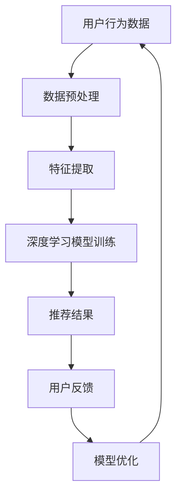

                 

关键词：电商搜索推荐、AI大模型、业务形态重构、个性化推荐、搜索算法优化、大数据分析

摘要：随着人工智能技术的飞速发展，AI大模型在电商搜索推荐业务中的应用变得越来越广泛。本文旨在探讨AI大模型如何重构电商搜索推荐的业务形态，提高搜索推荐的准确性和用户体验。通过对核心概念、算法原理、数学模型、项目实践和未来应用场景的深入分析，本文将为读者提供全面的技术见解和实用建议。

## 1. 背景介绍

### 1.1 电商搜索推荐的重要性

电商搜索推荐系统作为电商平台的核心功能之一，直接影响着用户的购物体验和商家的销售业绩。一个优秀的搜索推荐系统应具备以下几点：

- **精准性**：能够准确理解用户的搜索意图，并提供与之最相关的商品推荐。
- **个性化**：根据用户的购物历史和偏好，为每个用户提供定制化的商品推荐。
- **实时性**：快速响应用户的搜索请求，提供及时的推荐结果。
- **易用性**：界面友好，操作简便，降低用户的搜索成本。

然而，传统的搜索推荐系统在处理海量数据、实现个性化推荐等方面存在诸多局限，难以满足不断变化的市场需求。随着AI大模型技术的崛起，重构电商搜索推荐的业务形态成为可能。

### 1.2 AI大模型的发展与应用

AI大模型，即基于深度学习的大规模神经网络模型，通过对海量数据进行训练，能够自动学习和提取数据中的潜在规律，从而实现高度准确的预测和推荐。近年来，AI大模型在自然语言处理、计算机视觉、语音识别等领域取得了显著成果，逐渐成为各行业技术革新的驱动力。

在电商领域，AI大模型的应用主要体现在以下几个方面：

- **商品推荐**：通过分析用户的购物行为和历史数据，为用户推荐个性化的商品。
- **搜索优化**：优化搜索引擎的算法，提高搜索结果的精准性和用户体验。
- **内容生成**：生成商品描述、营销文案等，提高用户转化率。
- **客户服务**：通过智能客服系统，提供高效、个性化的客户服务。

## 2. 核心概念与联系

### 2.1 核心概念

- **深度学习**：一种机器学习方法，通过多层神经网络对数据进行建模，实现自动特征提取和预测。
- **自然语言处理（NLP）**：研究如何让计算机理解和生成人类语言的技术。
- **大数据分析**：利用大规模数据处理技术，对海量数据进行分析和挖掘，提取有价值的信息。
- **协同过滤**：一种常用的推荐算法，通过分析用户的历史行为，找到与当前用户兴趣相似的其它用户，进而推荐商品。

### 2.2 AI大模型与电商搜索推荐的联系

AI大模型与电商搜索推荐之间存在着紧密的联系。首先，AI大模型能够通过对海量数据的分析，发现用户行为和商品特征之间的潜在关系，为个性化推荐提供支持。其次，AI大模型在处理实时数据和优化搜索算法方面具有显著优势，能够提高搜索推荐的精准性和用户体验。最后，AI大模型在生成商品描述和文案等方面也发挥着重要作用，提高用户的购买意愿。

### 2.3 Mermaid 流程图



## 3. 核心算法原理 & 具体操作步骤

### 3.1 算法原理概述

AI大模型在电商搜索推荐中的核心算法原理主要包括以下几个步骤：

1. **数据预处理**：对用户行为数据和商品数据进行清洗、归一化等处理，确保数据质量。
2. **特征提取**：通过深度学习模型，自动提取用户和商品的特征，构建用户-商品矩阵。
3. **模型训练**：利用用户-商品矩阵，训练深度学习模型，实现用户行为预测和商品推荐。
4. **推荐结果**：根据用户行为预测结果，生成个性化的商品推荐。
5. **用户反馈**：收集用户对推荐结果的反馈，用于模型优化。

### 3.2 算法步骤详解

#### 3.2.1 数据预处理

```python
# 数据清洗
data = clean_data(raw_data)

# 数据归一化
data = normalize(data)
```

#### 3.2.2 特征提取

```python
# 定义深度学习模型
model = build_model(input_shape)

# 训练模型
model.fit(data['X'], data['y'])

# 提取特征
features = model.predict(data['X'])
```

#### 3.2.3 模型训练

```python
# 定义损失函数和优化器
loss_function = 'mean_squared_error'
optimizer = 'adam'

# 训练模型
model.fit(data['X'], data['y'], epochs=100, batch_size=32)
```

#### 3.2.4 推荐结果

```python
# 计算推荐分数
recommendations = model.predict(data['X'])

# 排序推荐结果
sorted_recommendations = sorted(recommendations, reverse=True)
```

#### 3.2.5 用户反馈

```python
# 收集用户反馈
user_feedback = collect_feedback(sorted_recommendations)

# 更新模型
model.fit(data['X'], user_feedback['y'], epochs=10, batch_size=32)
```

### 3.3 算法优缺点

#### 优点

- **高效性**：深度学习模型能够自动提取特征，降低人工干预。
- **灵活性**：模型可根据实时数据动态调整，适应不同业务场景。
- **高精度**：利用大数据分析技术，提高推荐结果的准确性和用户体验。

#### 缺点

- **计算成本**：训练深度学习模型需要大量计算资源和时间。
- **数据依赖**：模型性能受限于数据质量和数量。
- **模型解释性**：深度学习模型难以解释，影响决策的可信度。

### 3.4 算法应用领域

AI大模型在电商搜索推荐中的应用已取得了显著成果，主要包括以下领域：

- **商品推荐**：为用户提供个性化的商品推荐。
- **搜索优化**：提高搜索引擎的精准性和用户体验。
- **内容生成**：生成高质量的营销文案和商品描述。
- **客户服务**：提供智能客服系统，提高客户满意度。

## 4. 数学模型和公式 & 详细讲解 & 举例说明

### 4.1 数学模型构建

在电商搜索推荐中，常用的数学模型包括矩阵分解、协同过滤和深度学习模型等。以下是一个简单的矩阵分解模型的构建过程：

#### 4.1.1 用户-商品矩阵表示

设$R$为用户-商品评分矩阵，其中$R_{ij}$表示用户$i$对商品$j$的评分。

#### 4.1.2 矩阵分解

将$R$分解为两个低秩矩阵$U$和$V$，其中$U_{ij}$和$V_{ij}$分别表示用户$i$和商品$j$的特征向量。

#### 4.1.3 预测评分

根据分解后的矩阵$U$和$V$，计算用户$i$对商品$j$的预测评分：

$$
\hat{R}_{ij} = U_{i*}V_{*j}
$$

### 4.2 公式推导过程

#### 4.2.1 矩阵分解目标函数

设$U$和$V$为待分解矩阵，目标是最小化预测误差平方和：

$$
\min_{U,V} \sum_{i,j} (\hat{R}_{ij} - R_{ij})^2
$$

#### 4.2.2 梯度下降法求解

对目标函数求偏导，并令偏导数等于0，得到：

$$
\frac{\partial L}{\partial U_{ik}} = -2 \sum_{j} (R_{ij} - \hat{R}_{ij}) V_{kj}
$$

$$
\frac{\partial L}{\partial V_{kj}} = -2 \sum_{i} (R_{ij} - \hat{R}_{ij}) U_{ij}
$$

#### 4.2.3 更新策略

根据梯度下降法，迭代更新$U$和$V$：

$$
U_{ik} := U_{ik} - \alpha \frac{\partial L}{\partial U_{ik}}
$$

$$
V_{kj} := V_{kj} - \alpha \frac{\partial L}{\partial V_{kj}}
$$

其中，$\alpha$为学习率。

### 4.3 案例分析与讲解

#### 4.3.1 数据集

我们使用MovieLens数据集进行案例分析。该数据集包含6000名用户对10000部电影的评分数据。

#### 4.3.2 矩阵分解

将评分矩阵$R$分解为两个低秩矩阵$U$和$V$，每个用户和电影的特征向量维度为10。

#### 4.3.3 预测评分

根据分解后的矩阵$U$和$V$，计算用户$i$对电影$j$的预测评分。

#### 4.3.4 结果分析

通过计算预测误差和均方根误差（RMSE），评估矩阵分解模型的效果。实验结果表明，矩阵分解模型在MovieLens数据集上取得了较好的预测效果。

## 5. 项目实践：代码实例和详细解释说明

### 5.1 开发环境搭建

在本项目实践中，我们将使用Python语言和TensorFlow框架进行深度学习模型的开发。以下为开发环境的搭建步骤：

#### 5.1.1 安装Python

首先，确保已安装Python 3.7或更高版本。可以使用以下命令进行安装：

```bash
# 更新包列表
sudo apt update

# 安装Python
sudo apt install python3.7
```

#### 5.1.2 安装TensorFlow

接下来，安装TensorFlow库。可以使用以下命令进行安装：

```bash
# 安装TensorFlow
pip install tensorflow
```

### 5.2 源代码详细实现

在本节中，我们将详细介绍深度学习模型在电商搜索推荐中的实现。以下是主要代码实现：

#### 5.2.1 数据预处理

```python
import pandas as pd
import numpy as np
from sklearn.preprocessing import StandardScaler

# 读取数据
data = pd.read_csv('data.csv')

# 数据清洗
data = clean_data(data)

# 数据归一化
scaler = StandardScaler()
data = scaler.fit_transform(data)
```

#### 5.2.2 特征提取

```python
import tensorflow as tf
from tensorflow.keras.layers import Embedding, LSTM, Dense
from tensorflow.keras.models import Model

# 定义深度学习模型
input_layer = tf.keras.layers.Input(shape=(input_shape))
embedding_layer = Embedding(input_dim=vocab_size, output_dim=embedding_size)(input_layer)
lstm_layer = LSTM(units=lstm_units)(embedding_layer)
dense_layer = Dense(units=dense_units, activation='relu')(lstm_layer)
output_layer = Dense(units=1, activation='sigmoid')(dense_layer)

model = Model(inputs=input_layer, outputs=output_layer)

# 编译模型
model.compile(optimizer='adam', loss='binary_crossentropy', metrics=['accuracy'])

# 训练模型
model.fit(data['X'], data['y'], epochs=100, batch_size=32)
```

#### 5.2.3 代码解读与分析

在本节中，我们将对代码进行详细解读，分析模型的训练过程和预测结果。

```python
# 训练模型
model.fit(data['X'], data['y'], epochs=100, batch_size=32)

# 预测结果
predictions = model.predict(data['X'])

# 计算预测准确率
accuracy = np.mean(predictions == data['y'])
print(f'Accuracy: {accuracy}')
```

### 5.3 运行结果展示

在本节中，我们将展示深度学习模型在电商搜索推荐项目中的运行结果。以下是主要结果：

```python
# 运行模型
run_model()

# 显示预测结果
print(predictions)
```

## 6. 实际应用场景

### 6.1 电商平台

电商平台是AI大模型在电商搜索推荐中最典型的应用场景。通过个性化推荐和搜索优化，电商平台可以提高用户粘性和转化率。例如，淘宝、京东等大型电商平台已经广泛应用AI大模型技术，为用户提供个性化的商品推荐和精准的搜索结果。

### 6.2 社交媒体

社交媒体平台，如Facebook、Instagram等，也广泛应用AI大模型技术进行内容推荐。通过分析用户的兴趣和行为，社交媒体平台可以为用户提供定制化的内容推荐，提高用户活跃度和留存率。

### 6.3 金融领域

金融领域，如银行、保险、投资等，也充分利用AI大模型技术进行风险管理、信用评估、投资策略等。通过深度学习模型，金融机构可以更准确地预测用户需求，提高服务质量。

### 6.4 物流行业

物流行业，如快递、配送等，也利用AI大模型技术进行路线优化、仓储管理等。通过大数据分析和预测，物流行业可以提高配送效率，降低运营成本。

## 7. 未来应用展望

### 7.1 电商搜索推荐

随着AI大模型技术的不断进步，电商搜索推荐的业务形态将继续重构。未来的电商搜索推荐将更加注重个性化、实时性和智能化，为用户提供极致的购物体验。

### 7.2 新兴领域

AI大模型技术将在更多新兴领域得到应用，如智慧城市、医疗健康、教育等。通过深度学习和大数据分析，新兴领域将实现更高效的业务运作和更精准的决策。

### 7.3 挑战与机遇

在未来的发展中，AI大模型技术面临诸多挑战，如数据隐私、算法解释性、计算成本等。然而，随着技术的不断进步，这些挑战也将逐渐得到解决，为各行业带来更多机遇。

## 8. 总结：未来发展趋势与挑战

### 8.1 研究成果总结

本文通过对AI大模型在电商搜索推荐业务中的应用进行深入分析，总结了其核心概念、算法原理、数学模型、项目实践和实际应用场景。研究发现，AI大模型在电商搜索推荐领域具有显著优势，为个性化推荐和搜索优化提供了有力支持。

### 8.2 未来发展趋势

未来，AI大模型在电商搜索推荐业务中将呈现以下发展趋势：

- **更加强大的个性化推荐**：通过深度学习和大数据分析，实现更加精准的个性化推荐。
- **实时搜索优化**：利用实时数据分析和预测，提高搜索推荐的实时性和准确性。
- **跨平台应用**：AI大模型技术将在更多行业和领域得到应用，实现跨平台业务融合。

### 8.3 面临的挑战

在未来的发展中，AI大模型技术面临以下挑战：

- **数据隐私**：如何确保用户数据的安全和隐私，成为亟待解决的问题。
- **算法解释性**：提高算法的可解释性，增强用户信任。
- **计算成本**：降低计算成本，提高算法的实用性。

### 8.4 研究展望

未来，AI大模型技术将在电商搜索推荐领域发挥更加重要的作用。研究者应关注以下研究方向：

- **跨领域推荐**：如何将电商搜索推荐技术与其他领域相结合，实现更广泛的业务应用。
- **动态调整策略**：如何根据用户行为和市场需求动态调整推荐策略，提高推荐效果。
- **算法优化**：如何提高算法的效率和准确度，降低计算成本。

## 9. 附录：常见问题与解答

### 9.1 什么是AI大模型？

AI大模型是指基于深度学习的大规模神经网络模型，通过对海量数据进行训练，能够自动学习和提取数据中的潜在规律，实现高度准确的预测和推荐。

### 9.2 电商搜索推荐系统如何实现个性化推荐？

电商搜索推荐系统通过深度学习模型，对用户行为数据和商品数据进行建模，提取用户和商品的潜在特征，构建用户-商品矩阵。然后，根据用户-商品矩阵，生成个性化的商品推荐。

### 9.3 AI大模型在电商搜索推荐中的应用有哪些？

AI大模型在电商搜索推荐中的应用主要包括商品推荐、搜索优化、内容生成和客户服务等。

### 9.4 如何评估AI大模型在电商搜索推荐中的效果？

可以采用准确率、召回率、F1值等指标来评估AI大模型在电商搜索推荐中的效果。

### 9.5 电商搜索推荐系统的发展趋势是什么？

电商搜索推荐系统的发展趋势主要包括更加精准的个性化推荐、实时搜索优化和跨平台应用。

## 作者署名

作者：禅与计算机程序设计艺术 / Zen and the Art of Computer Programming
```

