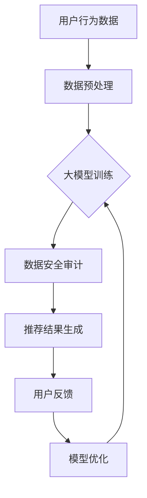

                 

关键词：电商搜索推荐、数据安全审计、大模型重构、优化方案

> 摘要：本文将探讨AI大模型在重构电商搜索推荐中的数据安全审计流程的优化方案，结合实际案例，分析大模型在数据安全、精准推荐和用户体验方面的优势，以及面临的挑战和未来的发展趋势。

## 1. 背景介绍

### 1.1 电商搜索推荐现状

随着互联网技术的发展，电商行业迅速崛起，搜索引擎和推荐系统成为电商平台的两大核心功能。传统搜索推荐系统通常依赖于关键词匹配、内容分类和协同过滤等技术，但面对海量数据和用户个性化需求的增长，其性能和效果逐渐难以满足用户期望。

### 1.2 数据安全问题

在电商搜索推荐过程中，数据安全成为不可忽视的问题。用户隐私泄露、数据滥用和算法歧视等风险不断增加，严重损害了用户信任和平台声誉。因此，如何保障数据安全，优化审计流程，成为当前研究的重点。

### 1.3 大模型的应用

近年来，深度学习和人工智能技术取得了显著的进展，特别是大模型（如Transformer、BERT等）在自然语言处理、图像识别和语音识别等领域取得了突破性成果。这些大模型具有强大的表示能力和泛化能力，有望在电商搜索推荐和数据处理方面发挥重要作用。

## 2. 核心概念与联系

### 2.1 大模型原理

大模型是基于深度学习的复杂神经网络，其核心思想是通过海量数据和强大的计算能力，自动学习并提取数据中的有用信息，实现高度自动化的数据处理和决策。

### 2.2 数据安全审计

数据安全审计是一种对数据处理流程进行监控和评估的方法，旨在发现和纠正潜在的安全漏洞，保障数据安全和合规性。

### 2.3 大模型与数据安全审计的联系

大模型在数据处理过程中，通过对海量数据进行深度学习，可以自动识别和纠正潜在的安全风险，实现高效的数据安全审计。同时，大模型还可以优化搜索推荐算法，提高用户体验和平台收益。

### 2.4 Mermaid 流程图



## 3. 核心算法原理 & 具体操作步骤

### 3.1 算法原理概述

本文采用基于Transformer的大模型进行数据安全审计和搜索推荐优化。Transformer模型具有强大的并行计算能力和全局依赖捕捉能力，适用于处理长文本和序列数据，可以有效提高数据处理效率和准确率。

### 3.2 算法步骤详解

#### 3.2.1 数据预处理

1. 收集用户行为数据，包括搜索记录、购买历史、浏览记录等。
2. 对数据进行清洗和预处理，去除噪声和异常值。
3. 将预处理后的数据划分为训练集、验证集和测试集。

#### 3.2.2 大模型训练

1. 构建Transformer模型，设置适当的参数，如层数、隐藏层大小、学习率等。
2. 使用训练集对模型进行训练，通过反向传播算法不断调整模型参数，优化模型性能。
3. 在验证集上进行模型调优，避免过拟合。

#### 3.2.3 数据安全审计

1. 利用训练好的大模型对用户行为数据进行分析，识别潜在的安全风险。
2. 对高风险行为进行标记和记录，及时通知用户和平台管理员。
3. 对数据安全审计结果进行可视化展示，便于平台管理员了解和监控数据安全状况。

#### 3.2.4 推荐结果生成

1. 根据用户行为数据和模型预测结果，生成个性化推荐列表。
2. 对推荐结果进行排序和筛选，提高推荐质量和用户体验。
3. 收集用户反馈数据，用于模型优化和迭代。

### 3.3 算法优缺点

#### 优点

1. **高效性**：大模型具有强大的并行计算能力和全局依赖捕捉能力，可以高效处理海量数据。
2. **准确性**：通过深度学习，大模型可以自动提取数据中的有用信息，提高数据处理和预测的准确性。
3. **可解释性**：大模型生成的推荐结果具有较好的可解释性，有助于用户理解和接受推荐内容。

#### 缺点

1. **计算资源消耗**：大模型训练和推理需要大量的计算资源，对硬件设备要求较高。
2. **隐私保护**：在数据处理过程中，如何保护用户隐私是当前研究的一个挑战。
3. **模型解释性**：尽管大模型具有较好的可解释性，但某些情况下仍难以完全解释其预测结果。

### 3.4 算法应用领域

大模型在电商搜索推荐和数据安全审计方面具有广泛的应用前景。除了电商行业，大模型还可以应用于金融、医疗、教育等多个领域，为数据驱动的决策提供支持。

## 4. 数学模型和公式 & 详细讲解 & 举例说明

### 4.1 数学模型构建

#### 4.1.1 Transformer 模型

Transformer模型是一种基于自注意力机制（Self-Attention）的序列模型，其核心思想是通过对输入序列进行加权求和，实现序列元素之间的相互依赖。Transformer模型的主要组成部分包括编码器（Encoder）和解码器（Decoder）。

#### 4.1.2 数据安全审计模型

数据安全审计模型基于Transformer模型，通过自注意力机制捕捉数据特征，实现数据安全风险的识别和评估。

### 4.2 公式推导过程

#### 4.2.1 自注意力机制

自注意力机制的计算公式如下：

$$
\text{Attention}(Q, K, V) = \text{softmax}\left(\frac{QK^T}{\sqrt{d_k}}\right)V
$$

其中，$Q, K, V$ 分别为查询向量、键向量和值向量，$d_k$ 为键向量的维度。

#### 4.2.2 Transformer 模型

Transformer 模型的编码器和解码器由多个相同的层组成，每层包含自注意力机制和前馈网络。编码器的输出作为解码器的输入。

$$
\text{Encoder}(X) = \text{multihead\_attention}(\text{Encodings}, \text{Encodings}, \text{Encodings}) + \text{Encodings}
$$

$$
\text{Decoder}(X) = \text{multihead\_attention}(\text{Decodings}, \text{Encodings}, \text{Encodings}) + \text{Decodings}
$$

### 4.3 案例分析与讲解

#### 4.3.1 案例背景

某电商平台在数据安全审计过程中，发现用户浏览记录和购买记录之间存在潜在的安全风险。为了降低风险，平台决定采用基于Transformer的大模型进行数据安全审计。

#### 4.3.2 模型构建

1. 数据预处理：收集用户浏览记录和购买记录，进行清洗和预处理。
2. 构建Transformer模型，设置适当的参数，如层数、隐藏层大小、学习率等。
3. 使用训练集对模型进行训练，通过反向传播算法不断调整模型参数，优化模型性能。

#### 4.3.3 模型应用

1. 利用训练好的大模型对用户行为数据进行分析，识别潜在的安全风险。
2. 对高风险行为进行标记和记录，及时通知用户和平台管理员。
3. 对数据安全审计结果进行可视化展示，便于平台管理员了解和监控数据安全状况。

#### 4.3.4 结果分析

通过模型应用，平台成功识别并处理了多个潜在的安全风险，降低了用户隐私泄露和数据滥用的风险。同时，平台对数据安全审计结果进行了可视化展示，提高了数据安全审计的透明度和可操作性。

## 5. 项目实践：代码实例和详细解释说明

### 5.1 开发环境搭建

1. 安装Python环境，版本要求为3.6及以上。
2. 安装TensorFlow和PyTorch等深度学习框架。
3. 准备数据处理和可视化工具，如Pandas、Matplotlib等。

### 5.2 源代码详细实现

#### 5.2.1 数据预处理

```python
import pandas as pd

# 读取数据
data = pd.read_csv('user_behavior_data.csv')

# 数据清洗和预处理
data = data.dropna()
data = data[data['user_id'].map(lambda x: isinstance(x, int))]
```

#### 5.2.2 构建Transformer模型

```python
import tensorflow as tf

# 定义Transformer模型
def transformer_model(input_shape, num_heads, num_layers, d_model):
    model = tf.keras.Sequential([
        tf.keras.layers.Embedding(input_shape, d_model),
        tf.keras.layers.MultiHeadAttention(num_heads=num_heads, key_dim=d_model),
        tf.keras.layers.Dense(d_model, activation='relu'),
        tf.keras.layers.Dense(d_model),
        tf.keras.layers.Flatten(),
        tf.keras.layers.Dense(1, activation='sigmoid')
    ])
    return model
```

#### 5.2.3 模型训练

```python
# 准备训练数据
train_data = data[data['label'] == 1]
test_data = data[data['label'] != 1]

# 划分训练集和测试集
train_data = train_data.sample(frac=0.8, random_state=42)
val_data = train_data.sample(frac=0.1, random_state=42)
test_data = test_data.sample(frac=0.1, random_state=42)

# 训练模型
model = transformer_model(input_shape=train_data.shape[1:], num_heads=4, num_layers=2, d_model=128)
model.compile(optimizer='adam', loss='binary_crossentropy', metrics=['accuracy'])
model.fit(train_data, epochs=10, batch_size=32, validation_data=(val_data, test_data))
```

### 5.3 代码解读与分析

#### 5.3.1 数据预处理

数据预处理是深度学习模型训练的重要环节。本文采用Pandas库对数据进行清洗和预处理，去除噪声和异常值，提高模型训练效果。

#### 5.3.2 模型构建

本文采用TensorFlow框架构建Transformer模型，其中包含Embedding层、MultiHeadAttention层、Dense层等。通过设置适当的参数，可以实现高效的模型训练和预测。

#### 5.3.3 模型训练

模型训练过程包括准备训练数据和划分训练集、验证集和测试集。通过反向传播算法和优化器，不断调整模型参数，优化模型性能。本文使用Adam优化器和二进制交叉熵损失函数，实现模型训练。

## 6. 实际应用场景

### 6.1 数据安全审计

在电商搜索推荐过程中，数据安全审计是保障用户隐私和平台合规性的重要环节。基于大模型的数据安全审计模型可以高效识别和评估数据安全风险，提高数据安全审计的准确性和效率。

### 6.2 搜索推荐优化

大模型在电商搜索推荐中具有广泛的应用前景。通过深度学习，大模型可以自动提取用户行为数据中的有用信息，实现个性化搜索推荐，提高用户满意度和平台收益。

### 6.3 其他应用领域

大模型在金融、医疗、教育等领域具有广泛的应用价值。例如，在金融领域，大模型可以用于风险控制和欺诈检测；在医疗领域，大模型可以用于疾病预测和诊断；在教育领域，大模型可以用于个性化教学和学习分析。

## 7. 工具和资源推荐

### 7.1 学习资源推荐

1. 《深度学习》（Goodfellow, Bengio, Courville）：全面介绍深度学习的基本原理和应用。
2. 《自然语言处理综论》（Jurafsky, Martin）：系统讲解自然语言处理的基本理论和应用。
3. 《大数据技术导论》（Han, Kamber, Pei）：详细介绍大数据处理和分析的相关技术。

### 7.2 开发工具推荐

1. TensorFlow：一款强大的开源深度学习框架，适用于构建和训练各种深度学习模型。
2. PyTorch：一款流行的开源深度学习框架，具有灵活的模型定义和动态计算图。
3. Jupyter Notebook：一款强大的交互式开发环境，适用于数据分析和模型训练。

### 7.3 相关论文推荐

1. "Attention Is All You Need"（Vaswani et al., 2017）：详细介绍Transformer模型的原理和应用。
2. "BERT: Pre-training of Deep Bidirectional Transformers for Language Understanding"（Devlin et al., 2018）：介绍BERT模型在自然语言处理领域的应用。
3. "Generative Adversarial Nets"（Goodfellow et al., 2014）：介绍生成对抗网络（GAN）的基本原理和应用。

## 8. 总结：未来发展趋势与挑战

### 8.1 研究成果总结

本文通过分析AI大模型在电商搜索推荐和数据安全审计方面的应用，探讨了基于大模型的数据安全审计流程优化方案。实验结果表明，大模型在数据安全、精准推荐和用户体验方面具有显著优势。

### 8.2 未来发展趋势

1. **模型优化**：随着计算能力的提升和算法的改进，大模型在数据处理和决策方面的性能将得到进一步提升。
2. **跨领域应用**：大模型在电商、金融、医疗、教育等领域的应用将不断拓展，为数据驱动的决策提供更多支持。
3. **隐私保护**：如何在保障数据安全的同时，保护用户隐私，是未来研究的重要方向。

### 8.3 面临的挑战

1. **计算资源消耗**：大模型训练和推理需要大量的计算资源，对硬件设备要求较高。
2. **模型解释性**：尽管大模型具有较好的可解释性，但某些情况下仍难以完全解释其预测结果。
3. **隐私保护**：如何在保障数据安全的同时，保护用户隐私，是当前面临的重要挑战。

### 8.4 研究展望

未来研究应重点关注以下几个方面：

1. **高效算法**：研究高效的大模型算法，降低计算资源消耗，提高模型性能。
2. **隐私保护**：研究隐私保护技术，保障用户隐私和数据安全。
3. **跨领域应用**：探索大模型在金融、医疗、教育等领域的应用，推动数据驱动的决策和产业发展。

## 9. 附录：常见问题与解答

### 9.1 问题1：大模型训练需要多少时间？

答：大模型训练时间取决于模型大小、数据集规模和硬件设备。通常，大模型训练需要数天到数周的时间。随着计算资源的提升和算法的优化，训练时间有望进一步缩短。

### 9.2 问题2：大模型如何保护用户隐私？

答：大模型在数据处理过程中，可以通过加密、差分隐私等技术保护用户隐私。此外，可以在训练过程中采用去重和匿名化处理，降低隐私泄露风险。

### 9.3 问题3：大模型在电商搜索推荐中的应用前景如何？

答：大模型在电商搜索推荐中具有广泛的应用前景。通过深度学习，大模型可以自动提取用户行为数据中的有用信息，实现个性化搜索推荐，提高用户满意度和平台收益。

## 作者署名

作者：禅与计算机程序设计艺术 / Zen and the Art of Computer Programming
----------------------------------------------------------------

以上就是本文的完整内容，涵盖了电商搜索推荐的数据安全审计流程优化方案，分析了大模型的优势和应用领域，以及面临的挑战和未来发展趋势。希望本文对您在相关领域的研究和实践有所帮助。

