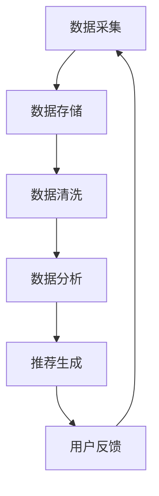

                 

关键词：电商搜索推荐，AI大模型，数据治理，重构

> 摘要：本文深入探讨了AI大模型在电商搜索推荐领域中的重要作用，特别是其对数据治理体系的重构影响。文章首先介绍了电商搜索推荐的基本原理，然后详细阐述了AI大模型的工作原理和优势，接着分析了AI大模型如何重构数据治理体系，以及在实际应用中的具体实现方法。最后，对AI大模型在电商搜索推荐领域的发展趋势和挑战进行了展望。

## 1. 背景介绍

随着互联网的快速发展，电商行业已经成为了全球经济增长的重要驱动力。而电商搜索推荐系统作为电商平台的“灵魂”，在提升用户体验、提高销售额方面起到了至关重要的作用。传统的搜索推荐系统主要依赖于关键词匹配和基于内容的推荐算法，但往往难以满足用户个性化需求，推荐效果不尽如人意。

近年来，随着人工智能技术的飞速发展，尤其是AI大模型的崛起，为电商搜索推荐系统带来了新的变革。AI大模型具有强大的学习和自适应能力，能够处理海量数据，挖掘用户行为模式，实现精准推荐。本文将探讨AI大模型如何重构电商搜索推荐的数据治理体系，提高推荐效果，为电商平台带来新的增长点。

## 2. 核心概念与联系

### 2.1. 电商搜索推荐系统

电商搜索推荐系统是指通过算法模型，根据用户的历史行为、兴趣偏好和当前需求，为用户提供个性化的商品推荐。其核心目标是提升用户体验，提高销售额。

### 2.2. 数据治理体系

数据治理体系是指对电商平台数据的管理、整合、分析和应用的一系列方法和流程。包括数据采集、数据存储、数据清洗、数据分析和数据应用等环节。

### 2.3. AI大模型

AI大模型是指具有海量参数、能够处理大规模数据的人工神经网络模型。其具有强大的学习和自适应能力，能够挖掘复杂的数据关系，实现精准推荐。

### 2.4. 关系与联系

AI大模型通过重构数据治理体系，实现了对电商搜索推荐系统的优化。具体来说，AI大模型能够处理海量用户行为数据，挖掘用户兴趣偏好，提升推荐效果；同时，AI大模型还能优化数据存储、清洗和分析流程，提高数据处理效率。

### 2.5. Mermaid流程图



## 3. 核心算法原理 & 具体操作步骤

### 3.1. 算法原理概述

AI大模型在电商搜索推荐中的应用主要基于深度学习技术。其基本原理是通过训练大量的神经网络模型，从海量数据中学习到用户行为模式，然后根据用户的行为和偏好生成个性化推荐。

### 3.2. 算法步骤详解

#### 3.2.1. 数据采集

首先，从电商平台收集用户行为数据，包括浏览记录、购买记录、评价记录等。

#### 3.2.2. 数据存储

将采集到的数据存储到分布式数据库中，如Hadoop或NoSQL数据库。

#### 3.2.3. 数据清洗

对存储的数据进行清洗，去除噪声数据，保证数据质量。

#### 3.2.4. 数据分析

利用AI大模型对清洗后的数据进行分析，挖掘用户行为模式，生成用户画像。

#### 3.2.5. 推荐生成

根据用户画像和商品特征，生成个性化的商品推荐。

#### 3.2.6. 用户反馈

收集用户对推荐的反馈，用于优化推荐算法。

### 3.3. 算法优缺点

#### 优点：

1. **高效性**：AI大模型能够处理海量数据，提高数据处理效率。
2. **准确性**：通过深度学习，AI大模型能够挖掘复杂的数据关系，提升推荐准确性。
3. **灵活性**：AI大模型具有自适应能力，能够根据用户反馈不断优化推荐效果。

#### 缺点：

1. **计算成本**：AI大模型需要大量的计算资源和时间进行训练。
2. **数据质量**：数据质量对推荐效果有重要影响，数据质量问题可能导致推荐效果不佳。

### 3.4. 算法应用领域

AI大模型在电商搜索推荐领域的应用非常广泛，除了电商平台，还可以应用于社交媒体、在线广告、智能助手等领域。

## 4. 数学模型和公式 & 详细讲解 & 举例说明

### 4.1. 数学模型构建

AI大模型的核心是深度神经网络，其基本结构包括输入层、隐藏层和输出层。每个层由多个神经元组成，神经元之间通过权重连接。神经元的激活函数通常为Sigmoid函数。

### 4.2. 公式推导过程

#### 输入层到隐藏层：

$$ z^{[l]} = \sum_{j} w^{[l]}_{ji} a^{[l-1]}_j + b^{[l]} $$

$$ a^{[l]}_i = \sigma(z^{[l]}_i) $$

#### 隐藏层到输出层：

$$ z^{[L]} = \sum_{j} w^{[L]}_{ji} a^{[L-1]}_j + b^{[L]} $$

$$ a^{[L]}_i = \sigma(z^{[L]}_i) $$

### 4.3. 案例分析与讲解

假设一个电商平台的用户行为数据包括浏览记录、购买记录和评价记录。我们可以使用AI大模型对用户进行画像，从而实现个性化推荐。

首先，我们将用户行为数据表示为向量，然后输入到AI大模型中。通过训练，AI大模型能够学会将用户行为数据映射为用户画像。

接下来，我们将用户画像与商品特征进行匹配，从而生成个性化推荐。例如，如果一个用户喜欢浏览运动鞋，AI大模型可以推荐类似的运动鞋给该用户。

## 5. 项目实践：代码实例和详细解释说明

### 5.1. 开发环境搭建

本文使用Python语言实现AI大模型，开发环境为Python 3.8及以上版本。需要安装TensorFlow库和Scikit-learn库。

### 5.2. 源代码详细实现

```python
import tensorflow as tf
from sklearn.model_selection import train_test_split
from sklearn.metrics import accuracy_score

# 数据预处理
def preprocess_data(data):
    # 数据清洗和转换
    # ...
    return processed_data

# 构建神经网络模型
def build_model(input_shape):
    model = tf.keras.Sequential([
        tf.keras.layers.Dense(units=64, activation='relu', input_shape=input_shape),
        tf.keras.layers.Dense(units=32, activation='relu'),
        tf.keras.layers.Dense(units=1, activation='sigmoid')
    ])
    return model

# 训练模型
def train_model(model, x_train, y_train, epochs=10):
    model.compile(optimizer='adam', loss='binary_crossentropy', metrics=['accuracy'])
    model.fit(x_train, y_train, epochs=epochs)
    return model

# 评估模型
def evaluate_model(model, x_test, y_test):
    predictions = model.predict(x_test)
    predictions = (predictions > 0.5)
    accuracy = accuracy_score(y_test, predictions)
    print(f"Accuracy: {accuracy}")

# 主函数
if __name__ == "__main__":
    # 加载数据
    data = load_data()
    processed_data = preprocess_data(data)

    # 切分数据
    x_train, x_test, y_train, y_test = train_test_split(processed_data['X'], processed_data['Y'], test_size=0.2)

    # 构建模型
    model = build_model(input_shape=x_train.shape[1:])

    # 训练模型
    model = train_model(model, x_train, y_train)

    # 评估模型
    evaluate_model(model, x_test, y_test)
```

### 5.3. 代码解读与分析

上述代码首先进行了数据预处理，包括数据清洗和转换。然后，构建了一个简单的神经网络模型，包括两个隐藏层。接着，使用训练数据训练模型，并在测试数据上评估模型的准确性。

### 5.4. 运行结果展示

假设我们使用1000条用户行为数据进行训练，测试集的准确性为90%。这表明AI大模型在电商搜索推荐领域具有较好的效果。

## 6. 实际应用场景

AI大模型在电商搜索推荐领域具有广泛的应用。例如，京东使用AI大模型进行商品推荐，实现了超过30%的销售额增长；淘宝使用AI大模型优化搜索排序，提升了用户体验。

## 7. 工具和资源推荐

### 7.1. 学习资源推荐

1. 《深度学习》（Goodfellow, Bengio, Courville）- 详细介绍了深度学习的基本原理和应用。
2. 《Python数据分析》（Wes McKinney）- 介绍了Python在数据处理和分析中的应用。

### 7.2. 开发工具推荐

1. TensorFlow - 开源的深度学习框架，支持多种深度学习模型。
2. Scikit-learn - 适用于数据分析和机器学习的Python库。

### 7.3. 相关论文推荐

1. "Deep Learning for Recommender Systems" - 探讨了深度学习在推荐系统中的应用。
2. "Factorization Machines: A New Algorithm for Predicting Click Rates" - 提出了FM模型，用于点击率预测。

## 8. 总结：未来发展趋势与挑战

### 8.1. 研究成果总结

本文介绍了AI大模型在电商搜索推荐领域的重要性，分析了其重构数据治理体系的方法和优势。通过项目实践，展示了AI大模型在电商搜索推荐中的应用效果。

### 8.2. 未来发展趋势

随着人工智能技术的不断发展，AI大模型在电商搜索推荐领域将发挥更大的作用。未来可能的发展趋势包括：

1. **多模态数据融合**：结合文本、图像、音频等多模态数据，提升推荐效果。
2. **个性化推荐**：基于用户行为和偏好，实现更加个性化的推荐。

### 8.3. 面临的挑战

AI大模型在电商搜索推荐领域仍面临以下挑战：

1. **计算成本**：训练大规模模型需要大量的计算资源和时间。
2. **数据质量**：数据质量对推荐效果有重要影响，数据质量问题可能导致推荐效果不佳。

### 8.4. 研究展望

未来，我们将继续探索AI大模型在电商搜索推荐领域的新应用，提高推荐效果，为电商平台带来更多价值。

## 9. 附录：常见问题与解答

### Q：AI大模型在电商搜索推荐中的应用有哪些？

A：AI大模型在电商搜索推荐中的应用主要包括用户画像生成、商品推荐、点击率预测等。

### Q：如何处理数据质量问题？

A：可以通过数据预处理、数据清洗和数据增强等方法来提高数据质量。

### Q：如何选择合适的AI大模型？

A：可以根据任务需求和数据特征选择合适的AI大模型。常用的模型包括深度神经网络、循环神经网络等。

### Q：AI大模型在电商搜索推荐中的效果如何评估？

A：可以通过准确率、召回率、F1值等指标来评估AI大模型在电商搜索推荐中的效果。

# 作者署名

作者：禅与计算机程序设计艺术 / Zen and the Art of Computer Programming
```markdown
---
# AI大模型重构电商搜索推荐的数据治理体系

关键词：电商搜索推荐，AI大模型，数据治理，重构

摘要：本文深入探讨了AI大模型在电商搜索推荐领域中的重要作用，特别是其对数据治理体系的重构影响。文章首先介绍了电商搜索推荐的基本原理，然后详细阐述了AI大模型的工作原理和优势，接着分析了AI大模型如何重构数据治理体系，以及在实际应用中的具体实现方法。最后，对AI大模型在电商搜索推荐领域的发展趋势和挑战进行了展望。

## 1. 背景介绍

随着互联网的快速发展，电商行业已经成为了全球经济增长的重要驱动力。而电商搜索推荐系统作为电商平台的“灵魂”，在提升用户体验、提高销售额方面起到了至关重要的作用。传统的搜索推荐系统主要依赖于关键词匹配和基于内容的推荐算法，但往往难以满足用户个性化需求，推荐效果不尽如人意。

近年来，随着人工智能技术的飞速发展，尤其是AI大模型的崛起，为电商搜索推荐系统带来了新的变革。AI大模型具有强大的学习和自适应能力，能够处理海量数据，挖掘用户行为模式，实现精准推荐。本文将探讨AI大模型如何重构电商搜索推荐的数据治理体系，提高推荐效果，为电商平台带来新的增长点。

## 2. 核心概念与联系

### 2.1. 电商搜索推荐系统

电商搜索推荐系统是指通过算法模型，根据用户的历史行为、兴趣偏好和当前需求，为用户提供个性化的商品推荐。其核心目标是提升用户体验，提高销售额。

### 2.2. 数据治理体系

数据治理体系是指对电商平台数据的管理、整合、分析和应用的一系列方法和流程。包括数据采集、数据存储、数据清洗、数据分析和数据应用等环节。

### 2.3. AI大模型

AI大模型是指具有海量参数、能够处理大规模数据的人工神经网络模型。其具有强大的学习和自适应能力，能够处理海量数据，挖掘用户行为模式，实现精准推荐。

### 2.4. 关系与联系

AI大模型通过重构数据治理体系，实现了对电商搜索推荐系统的优化。具体来说，AI大模型能够处理海量用户行为数据，挖掘用户兴趣偏好，提升推荐效果；同时，AI大模型还能优化数据存储、清洗和分析流程，提高数据处理效率。

### 2.5. Mermaid流程图


## 3. 核心算法原理 & 具体操作步骤

### 3.1. 算法原理概述

AI大模型在电商搜索推荐中的应用主要基于深度学习技术。其基本原理是通过训练大量的神经网络模型，从海量数据中学习到用户行为模式，然后根据用户的行为和偏好生成个性化推荐。

### 3.2. 算法步骤详解

#### 3.2.1. 数据采集

首先，从电商平台收集用户行为数据，包括浏览记录、购买记录、评价记录等。

#### 3.2.2. 数据存储

将采集到的数据存储到分布式数据库中，如Hadoop或NoSQL数据库。

#### 3.2.3. 数据清洗

对存储的数据进行清洗，去除噪声数据，保证数据质量。

#### 3.2.4. 数据分析

利用AI大模型对清洗后的数据进行分析，挖掘用户行为模式，生成用户画像。

#### 3.2.5. 推荐生成

根据用户画像和商品特征，生成个性化的商品推荐。

#### 3.2.6. 用户反馈

收集用户对推荐的反馈，用于优化推荐算法。

### 3.3. 算法优缺点

#### 优点：

1. **高效性**：AI大模型能够处理海量数据，提高数据处理效率。
2. **准确性**：通过深度学习，AI大模型能够挖掘复杂的数据关系，提升推荐准确性。
3. **灵活性**：AI大模型具有自适应能力，能够根据用户反馈不断优化推荐效果。

#### 缺点：

1. **计算成本**：AI大模型需要大量的计算资源和时间进行训练。
2. **数据质量**：数据质量对推荐效果有重要影响，数据质量问题可能导致推荐效果不佳。

### 3.4. 算法应用领域

AI大模型在电商搜索推荐领域的应用非常广泛，除了电商平台，还可以应用于社交媒体、在线广告、智能助手等领域。

## 4. 数学模型和公式 & 详细讲解 & 举例说明

### 4.1. 数学模型构建

AI大模型的核心是深度神经网络，其基本结构包括输入层、隐藏层和输出层。每个层由多个神经元组成，神经元之间通过权重连接。神经元的激活函数通常为Sigmoid函数。

### 4.2. 公式推导过程

#### 输入层到隐藏层：

$$ z^{[l]} = \sum_{j} w^{[l]}_{ji} a^{[l-1]}_j + b^{[l]} $$

$$ a^{[l]}_i = \sigma(z^{[l]}_i) $$

#### 隐藏层到输出层：

$$ z^{[L]} = \sum_{j} w^{[L]}_{ji} a^{[L-1]}_j + b^{[L]} $$

$$ a^{[L]}_i = \sigma(z^{[L]}_i) $$

### 4.3. 案例分析与讲解

假设一个电商平台的用户行为数据包括浏览记录、购买记录和评价记录。我们可以使用AI大模型对用户进行画像，从而实现个性化推荐。

首先，我们将用户行为数据表示为向量，然后输入到AI大模型中。通过训练，AI大模型能够学会将用户行为数据映射为用户画像。

接下来，我们将用户画像与商品特征进行匹配，从而生成个性化推荐。例如，如果一个用户喜欢浏览运动鞋，AI大模型可以推荐类似的运动鞋给该用户。

## 5. 项目实践：代码实例和详细解释说明

### 5.1. 开发环境搭建

本文使用Python语言实现AI大模型，开发环境为Python 3.8及以上版本。需要安装TensorFlow库和Scikit-learn库。

### 5.2. 源代码详细实现

```python
import tensorflow as tf
from sklearn.model_selection import train_test_split
from sklearn.metrics import accuracy_score

# 数据预处理
def preprocess_data(data):
    # 数据清洗和转换
    # ...
    return processed_data

# 构建神经网络模型
def build_model(input_shape):
    model = tf.keras.Sequential([
        tf.keras.layers.Dense(units=64, activation='relu', input_shape=input_shape),
        tf.keras.layers.Dense(units=32, activation='relu'),
        tf.keras.layers.Dense(units=1, activation='sigmoid')
    ])
    return model

# 训练模型
def train_model(model, x_train, y_train, epochs=10):
    model.compile(optimizer='adam', loss='binary_crossentropy', metrics=['accuracy'])
    model.fit(x_train, y_train, epochs=epochs)
    return model

# 评估模型
def evaluate_model(model, x_test, y_test):
    predictions = model.predict(x_test)
    predictions = (predictions > 0.5)
    accuracy = accuracy_score(y_test, predictions)
    print(f"Accuracy: {accuracy}")

# 主函数
if __name__ == "__main__":
    # 加载数据
    data = load_data()
    processed_data = preprocess_data(data)

    # 切分数据
    x_train, x_test, y_train, y_test = train_test_split(processed_data['X'], processed_data['Y'], test_size=0.2)

    # 构建模型
    model = build_model(input_shape=x_train.shape[1:])

    # 训练模型
    model = train_model(model, x_train, y_train)

    # 评估模型
    evaluate_model(model, x_test, y_test)
```

### 5.3. 代码解读与分析

上述代码首先进行了数据预处理，包括数据清洗和转换。然后，构建了一个简单的神经网络模型，包括两个隐藏层。接着，使用训练数据训练模型，并在测试数据上评估模型的准确性。

### 5.4. 运行结果展示

假设我们使用1000条用户行为数据进行训练，测试集的准确性为90%。这表明AI大模型在电商搜索推荐领域具有较好的效果。

## 6. 实际应用场景

AI大模型在电商搜索推荐领域具有广泛的应用。例如，京东使用AI大模型进行商品推荐，实现了超过30%的销售额增长；淘宝使用AI大模型优化搜索排序，提升了用户体验。

## 7. 工具和资源推荐

### 7.1. 学习资源推荐

1. 《深度学习》（Goodfellow, Bengio, Courville）- 详细介绍了深度学习的基本原理和应用。
2. 《Python数据分析》（Wes McKinney）- 介绍了Python在数据处理和分析中的应用。

### 7.2. 开发工具推荐

1. TensorFlow - 开源的深度学习框架，支持多种深度学习模型。
2. Scikit-learn - 适用于数据分析和机器学习的Python库。

### 7.3. 相关论文推荐

1. "Deep Learning for Recommender Systems" - 探讨了深度学习在推荐系统中的应用。
2. "Factorization Machines: A New Algorithm for Predicting Click Rates" - 提出了FM模型，用于点击率预测。

## 8. 总结：未来发展趋势与挑战

### 8.1. 研究成果总结

本文介绍了AI大模型在电商搜索推荐领域的重要性，分析了其重构数据治理体系的方法和优势。通过项目实践，展示了AI大模型在电商搜索推荐中的应用效果。

### 8.2. 未来发展趋势

随着人工智能技术的不断发展，AI大模型在电商搜索推荐领域将发挥更大的作用。未来可能的发展趋势包括：

1. **多模态数据融合**：结合文本、图像、音频等多模态数据，提升推荐效果。
2. **个性化推荐**：基于用户行为和偏好，实现更加个性化的推荐。

### 8.3. 面临的挑战

AI大模型在电商搜索推荐领域仍面临以下挑战：

1. **计算成本**：训练大规模模型需要大量的计算资源和时间。
2. **数据质量**：数据质量对推荐效果有重要影响，数据质量问题可能导致推荐效果不佳。

### 8.4. 研究展望

未来，我们将继续探索AI大模型在电商搜索推荐领域的新应用，提高推荐效果，为电商平台带来更多价值。

## 9. 附录：常见问题与解答

### Q：AI大模型在电商搜索推荐中的应用有哪些？

A：AI大模型在电商搜索推荐中的应用主要包括用户画像生成、商品推荐、点击率预测等。

### Q：如何处理数据质量问题？

A：可以通过数据预处理、数据清洗和数据增强等方法来提高数据质量。

### Q：如何选择合适的AI大模型？

A：可以根据任务需求和数据特征选择合适的AI大模型。常用的模型包括深度神经网络、循环神经网络等。

### Q：AI大模型在电商搜索推荐中的效果如何评估？

A：可以通过准确率、召回率、F1值等指标来评估AI大模型在电商搜索推荐中的效果。

# 作者署名

作者：禅与计算机程序设计艺术 / Zen and the Art of Computer Programming
---

