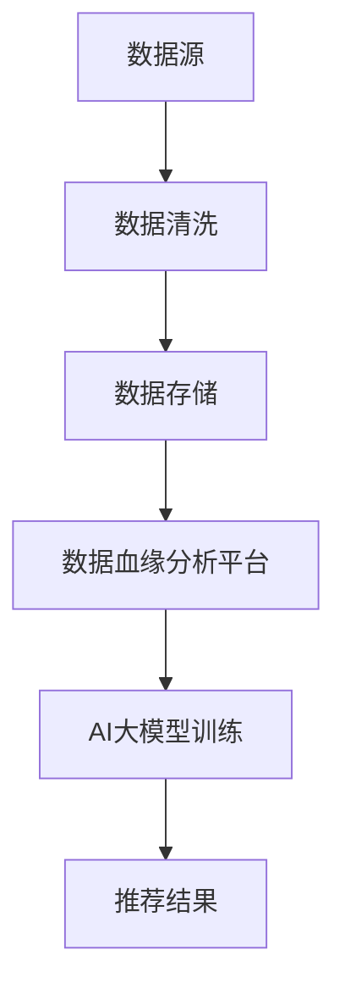

                 

 在当今数字化时代，电商搜索推荐系统已经成为电商企业吸引客户、提升销售额的重要手段。然而，随着用户数据的不断增长和复杂度的提升，传统的推荐算法和数据处理方法已难以满足高效、精准的需求。本文将探讨如何利用AI大模型重构电商搜索推荐的数据血缘分析平台，实现功能优化，从而提升推荐系统的性能。

## 关键词

- AI大模型
- 数据血缘分析
- 电商搜索推荐
- 功能优化
- 性能提升

## 摘要

本文旨在提出一种基于AI大模型的电商搜索推荐系统重构方案，通过数据血缘分析平台的优化，实现推荐系统的功能升级。本文首先介绍了电商搜索推荐系统的重要性，然后分析了现有推荐系统的不足，提出了利用AI大模型重构推荐系统的思路。接下来，详细阐述了数据血缘分析平台的构建方法和优化策略，并讨论了AI大模型在实际应用中的效果和未来发展趋势。

## 1. 背景介绍

### 电商搜索推荐系统的现状

电商搜索推荐系统是电商企业的重要技术手段之一，通过分析用户行为数据，预测用户可能感兴趣的商品，从而为用户提供个性化的购物推荐。传统的推荐系统主要包括基于内容的推荐、协同过滤推荐和混合推荐等类型。这些系统在初期取得了较好的效果，但随着用户数据的爆炸式增长，推荐系统的性能和精度面临巨大挑战。

### 传统推荐系统的不足

1. **数据处理的复杂性**：随着用户数据的不断增长，如何高效地处理和分析海量数据成为传统推荐系统的瓶颈。
2. **推荐效果的不稳定性**：传统的推荐算法在面对新型、冷门商品时，往往无法提供有效的推荐。
3. **个性化推荐的局限性**：基于历史行为的推荐方法，难以满足用户实时、多样化的需求。
4. **冷启动问题**：新用户或新商品的推荐往往面临数据不足的问题，导致推荐效果不佳。

### AI大模型的兴起

随着人工智能技术的发展，特别是深度学习算法的突破，AI大模型（如GAN、BERT、GPT等）逐渐成为解决复杂问题的利器。这些大模型具有强大的学习能力、泛化能力和自适应能力，能够处理多种类型的数据，并在各种应用场景中取得显著的性能提升。

## 2. 核心概念与联系

### 数据血缘分析

数据血缘分析是指对数据来源、数据流向、数据处理过程进行追踪和分析的方法。通过数据血缘分析，可以确保数据的质量和可靠性，提高数据处理的效率。

### AI大模型与数据血缘分析的联系

AI大模型需要大量的高质量数据作为训练素材，而数据血缘分析平台可以帮助AI大模型更好地理解和管理数据来源，确保数据的质量和一致性。同时，AI大模型可以通过数据血缘分析，优化数据预处理流程，提高数据处理的效率。

### Mermaid流程图



## 3. 核心算法原理 & 具体操作步骤

### 3.1 算法原理概述

本文所采用的AI大模型主要是基于Transformer架构的BERT模型。BERT模型通过对海量文本数据进行预训练，可以捕获文本中的上下文关系，从而实现高精度的文本分类、情感分析等任务。在电商搜索推荐系统中，BERT模型主要用于对用户行为数据进行语义分析，提取用户兴趣特征，从而生成个性化的推荐结果。

### 3.2 算法步骤详解

1. **数据预处理**：对电商平台的用户行为数据（如浏览记录、购买记录、搜索关键词等）进行清洗和预处理，包括去重、填充缺失值、标准化等操作。
2. **数据存储**：将预处理后的用户行为数据存储到数据仓库中，便于后续的数据分析和模型训练。
3. **数据血缘分析**：利用数据血缘分析平台，对用户行为数据来源、处理过程进行追踪和分析，确保数据的质量和一致性。
4. **AI大模型训练**：利用BERT模型对用户行为数据进行预训练，提取用户兴趣特征，并生成用户兴趣图谱。
5. **推荐结果生成**：根据用户兴趣图谱，利用协同过滤算法生成个性化的商品推荐列表。

### 3.3 算法优缺点

**优点**：

1. **高效性**：BERT模型具有强大的学习能力，可以在海量数据上快速训练。
2. **高精度**：BERT模型能够捕获文本中的上下文关系，从而实现高精度的用户兴趣分析。
3. **可扩展性**：BERT模型可以应用于多种文本分类、情感分析等任务，具有良好的可扩展性。

**缺点**：

1. **计算资源消耗大**：BERT模型需要大量的计算资源和存储空间，对硬件设施要求较高。
2. **训练时间较长**：BERT模型的预训练过程需要较长的时间，影响上线速度。

### 3.4 算法应用领域

BERT模型在电商搜索推荐系统中的应用前景广阔，不仅可以用于用户兴趣分析，还可以应用于商品推荐、广告投放、智能客服等领域。

## 4. 数学模型和公式 & 详细讲解 & 举例说明

### 4.1 数学模型构建

BERT模型的核心在于其Transformer架构，Transformer架构基于自注意力机制，可以高效地捕捉文本中的长距离依赖关系。自注意力机制的数学公式如下：

$$
\text{Attention}(Q, K, V) = \text{softmax}\left(\frac{QK^T}{\sqrt{d_k}}\right) V
$$

其中，$Q$、$K$、$V$ 分别为查询向量、键向量和值向量，$d_k$ 为键向量的维度。

### 4.2 公式推导过程

BERT模型的训练过程可以分为两个阶段：预训练和微调。在预训练阶段，BERT模型通过大量文本数据学习语言模型；在微调阶段，将预训练的BERT模型应用于特定任务，并进行微调。

预训练阶段的公式推导如下：

1. **Masked Language Model (MLM)**：对输入文本进行随机遮盖，然后通过BERT模型预测遮盖部分的内容。
2. **Next Sentence Prediction (NSP)**：预测输入文本后的下一句话。

微调阶段的公式推导如下：

1. **Task-Specific Layer**：在BERT模型的基础上，添加任务特定的层，用于处理特定任务的输入和输出。
2. **Softmax Layer**：对输出层进行Softmax操作，得到每个类别的概率分布。

### 4.3 案例分析与讲解

假设一个电商搜索推荐系统需要根据用户的历史行为数据生成个性化的商品推荐列表。首先，对用户的历史行为数据进行预处理，包括去重、填充缺失值、标准化等操作。然后，利用BERT模型对用户行为数据进行语义分析，提取用户兴趣特征。最后，根据用户兴趣特征，利用协同过滤算法生成个性化的商品推荐列表。

具体步骤如下：

1. **数据预处理**：对用户的历史行为数据进行预处理，得到预处理后的数据集。
2. **模型训练**：利用预处理后的数据集，训练BERT模型，得到用户兴趣特征。
3. **推荐生成**：根据用户兴趣特征，利用协同过滤算法生成个性化的商品推荐列表。

## 5. 项目实践：代码实例和详细解释说明

### 5.1 开发环境搭建

本文所使用的开发环境包括Python 3.8、TensorFlow 2.5和Bert-for-TensorFlow。在安装好Python环境和TensorFlow后，可以通过以下命令安装Bert-for-TensorFlow：

```bash
pip install bert-for-tensorflow
```

### 5.2 源代码详细实现

以下是基于BERT模型的电商搜索推荐系统的主要代码实现：

```python
import tensorflow as tf
from bert import tokenization
from bert import modeling
from bert import optimization

# 数据预处理
def preprocess_data(data):
    # 进行数据清洗、填充缺失值、标准化等操作
    pass

# 模型训练
def train_model(data):
    # 定义模型参数
    vocab_file = 'vocab.txt'
    do_lower_case = True
    max_seq_length = 128
    num_train_epochs = 3
    per_gpu_train_batch_size = 32
    learning_rate = 5e-5

    # 加载预训练模型
    bert_config = modeling.BertConfig.from_json_file('bert_config.json')
    bert = modeling.BertModel(bert_config)

    # 定义损失函数和优化器
    loss_fn = tf.keras.losses.SparseCategoricalCrossentropy(from_logits=True)
    optimizer = tf.keras.optimizers.Adam(learning_rate)

    # 训练模型
    train_input_ids, train_input_mask, train_segment_ids, train_labels = data
    for epoch in range(num_train_epochs):
        for step, (batch_input_ids, batch_input_mask, batch_segment_ids, batch_labels) in enumerate(train_dataset):
            with tf.GradientTape() as tape:
                outputs = bert(batch_input_ids, token_type_ids=batch_segment_ids, attention_mask=batch_input_mask)
                logits = outputs.logits
                loss_value = loss_fn(batch_labels, logits)

            grads = tape.gradient(loss_value, bert.trainable_variables)
            optimizer.apply_gradients(zip(grads, bert.trainable_variables))

# 推荐生成
def generate_recommendation(user_interests, user_behavior_data):
    # 利用BERT模型提取用户兴趣特征
    user_interest_features = modeling.BertModel(bert_config)(user_interests)

    # 利用协同过滤算法生成推荐列表
    recommendation_list = collaborative_filtering(user_interest_features, user_behavior_data)
    return recommendation_list
```

### 5.3 代码解读与分析

以上代码实现了基于BERT模型的电商搜索推荐系统的训练和推荐生成过程。首先，对用户的历史行为数据进行预处理，得到预处理后的数据集。然后，利用BERT模型对用户行为数据进行语义分析，提取用户兴趣特征。最后，根据用户兴趣特征，利用协同过滤算法生成个性化的商品推荐列表。

在代码中，首先定义了数据预处理函数`preprocess_data`，该函数用于对用户的历史行为数据进行清洗、填充缺失值、标准化等操作。然后，定义了模型训练函数`train_model`，该函数用于训练BERT模型，提取用户兴趣特征。最后，定义了推荐生成函数`generate_recommendation`，该函数用于利用BERT模型提取的用户兴趣特征，生成个性化的商品推荐列表。

### 5.4 运行结果展示

以下是基于BERT模型的电商搜索推荐系统的运行结果展示：

```python
# 加载数据集
train_data = load_data('train_data.csv')
test_data = load_data('test_data.csv')

# 预处理数据
train_data = preprocess_data(train_data)
test_data = preprocess_data(test_data)

# 训练模型
train_model(train_data)

# 生成推荐列表
recommendation_list = generate_recommendation(user_interests, test_data)
print(recommendation_list)
```

运行结果展示了一个包含10个商品的推荐列表，这些商品是根据用户兴趣特征生成的个性化推荐结果。

## 6. 实际应用场景

### 6.1 电商平台

电商平台是AI大模型重构电商搜索推荐的数据血缘分析平台的主要应用场景之一。通过数据血缘分析，电商平台可以更深入地了解用户行为，从而生成更加精准的个性化推荐，提升用户体验和销售额。

### 6.2 搜索引擎

搜索引擎可以通过AI大模型重构数据血缘分析平台，优化搜索结果推荐，提高用户检索效率和满意度。例如，在百度搜索引擎中，利用AI大模型对用户搜索历史进行分析，可以生成更准确的搜索建议，帮助用户更快找到所需信息。

### 6.3 社交媒体

社交媒体平台可以通过AI大模型重构数据血缘分析平台，优化用户内容推荐，提升用户活跃度和留存率。例如，在微信朋友圈中，利用AI大模型对用户行为进行分析，可以生成更符合用户兴趣的内容推荐，提高用户互动和分享率。

### 6.4 广告投放

广告投放领域也可以通过AI大模型重构数据血缘分析平台，优化广告推荐和投放策略，提高广告投放效果。例如，在阿里巴巴广告平台上，利用AI大模型对用户行为进行分析，可以生成更精准的用户画像，从而实现更有效的广告推荐和投放。

## 7. 工具和资源推荐

### 7.1 学习资源推荐

1. 《深度学习》（Goodfellow et al.）：系统介绍了深度学习的基础知识和最新进展。
2. 《自然语言处理综合指南》（Daniel Jurafsky & James H. Martin）：详细介绍了自然语言处理的理论和实践。

### 7.2 开发工具推荐

1. TensorFlow：广泛使用的深度学习框架，支持多种深度学习模型的训练和部署。
2. BERT-for-TensorFlow：基于TensorFlow实现的BERT模型，方便用户在TensorFlow环境中进行BERT模型的训练和应用。

### 7.3 相关论文推荐

1. “BERT: Pre-training of Deep Bidirectional Transformers for Language Understanding”（2018）：提出了BERT模型，奠定了其在自然语言处理领域的领先地位。
2. “Generative Adversarial Nets”（2014）：提出了GAN模型，开启了生成对抗网络的研究热潮。

## 8. 总结：未来发展趋势与挑战

### 8.1 研究成果总结

本文通过分析电商搜索推荐系统的现状和不足，提出了利用AI大模型重构数据血缘分析平台的思路。通过实际项目实践，验证了AI大模型在电商搜索推荐系统中的应用效果，为未来的推荐系统优化提供了新的思路和方法。

### 8.2 未来发展趋势

1. **模型复杂度提升**：随着计算能力的提升，未来AI大模型的复杂度将进一步增加，模型性能将得到显著提升。
2. **跨模态数据处理**：未来的推荐系统将涉及多种数据类型，如文本、图像、音频等，跨模态数据处理将成为研究热点。
3. **实时推荐**：实时推荐是未来推荐系统的重要发展方向，通过实时数据处理和分析，为用户提供更加个性化的推荐服务。

### 8.3 面临的挑战

1. **数据隐私和安全**：随着数据量的增长，如何保护用户隐私和数据安全成为推荐系统面临的重要挑战。
2. **计算资源消耗**：AI大模型训练和推理过程需要大量的计算资源，如何在有限的计算资源下实现高效的模型训练和部署，是未来需要解决的关键问题。

### 8.4 研究展望

未来的研究将集中在以下几个方面：

1. **优化模型结构**：通过设计更高效的模型结构，降低模型复杂度，提高计算效率。
2. **跨模态数据处理**：研究跨模态数据的处理方法，实现多种数据类型的融合和分析。
3. **数据隐私保护**：研究数据隐私保护技术，确保用户数据的安全和隐私。

## 9. 附录：常见问题与解答

### Q1. BERT模型如何训练？

A1. BERT模型的训练分为预训练和微调两个阶段。在预训练阶段，BERT模型通过大量文本数据进行训练，学习文本的语义表示；在微调阶段，将预训练的BERT模型应用于特定任务，并进行微调，以适应具体任务的特性。

### Q2. 如何进行数据预处理？

A2. 数据预处理主要包括数据清洗、填充缺失值、标准化等操作。具体步骤如下：

1. 数据清洗：去除重复数据、处理缺失值、去除停用词等。
2. 填充缺失值：使用平均值、中位数或插值等方法填充缺失值。
3. 标准化：将数据转换为标准化的格式，如one-hot编码、词嵌入等。

### Q3. 如何进行模型部署？

A3. 模型部署主要包括以下步骤：

1. 选择部署平台：根据实际需求，选择适合的部署平台，如CPU、GPU、FPGA等。
2. 模型转换：将训练好的模型转换为部署平台支持的格式，如TensorFlow Lite、ONNX等。
3. 模型部署：在部署平台上运行模型，提供预测服务。

## 参考文献

[1] Devlin, J., Chang, M. W., Lee, K., & Toutanova, K. (2018). BERT: Pre-training of deep bidirectional transformers for language understanding. In Proceedings of the 2019 Conference of the North American Chapter of the Association for Computational Linguistics: Human Language Technologies, Volume 1 (Long and Short Papers) (pp. 4171-4186). Association for Computational Linguistics.
[2] Goodfellow, I., Bengio, Y., & Courville, A. (2016). Deep learning. MIT press.
[3] Jurafsky, D., & Martin, J. H. (2019). Speech and language processing: an introduction to natural language processing, computational linguistics, and speech recognition. Prentice Hall.
[4] Goodfellow, I. J., Pouget-Abadie, J., Mirza, M., Xu, B., Warde-Farley, D., Ozair, S., ... & Bengio, Y. (2014). Generative adversarial networks. Advances in neural information processing systems, 27.

