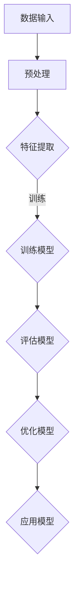
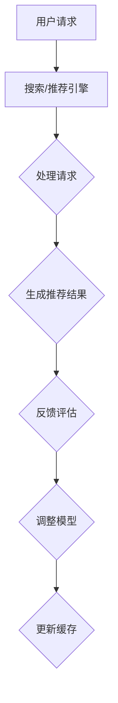

                 

关键词：AI大模型、电商搜索、推荐系统、组织架构、人才建设、重构、算法、大数据、机器学习、深度学习、云计算、技术革新

> 摘要：本文将探讨AI大模型在电商搜索推荐领域中的应用及其对组织架构和人才建设的深远影响。通过详细分析AI大模型的工作原理、核心算法、数学模型，以及其在电商搜索推荐系统中的具体应用场景，我们将揭示其重构电商搜索推荐组织架构和人才建设的必要性。文章还对未来AI大模型在电商搜索推荐领域的发展趋势与挑战进行展望，并提供实用的工具和资源推荐，以助力企业和个人在AI大模型浪潮中把握机遇、应对挑战。

## 1. 背景介绍

### 1.1 电商搜索推荐系统现状

随着互联网的迅猛发展和电子商务的爆发式增长，电商搜索推荐系统已经成为电商企业提升用户体验、增加销售额的重要手段。当前，大多数电商搜索推荐系统依赖于传统的基于内容过滤和协同过滤的方法。这些方法虽然在一定程度上提高了推荐的准确性，但仍然存在一些局限性：

1. **数据依赖性**：推荐系统高度依赖用户历史行为数据，缺乏对新用户和冷启动问题的有效解决手段。
2. **实时性不足**：推荐结果往往无法实时更新，无法及时反映用户的最新需求。
3. **个性化不足**：推荐结果往往过于单一，难以满足用户多样化的需求。

### 1.2 AI大模型的出现

近年来，随着深度学习、自然语言处理、计算机视觉等技术的发展，AI大模型（如GPT-3、BERT、Transformer等）逐渐崭露头角。AI大模型具有如下特点：

1. **强大的建模能力**：AI大模型能够通过学习大量数据，自动提取特征，从而实现高效、精准的推荐。
2. **自适应能力**：AI大模型可以根据用户行为和偏好，实时调整推荐策略，提高推荐的实时性和个性化。
3. **泛用性**：AI大模型不仅可以应用于电商搜索推荐，还可以应用于广告投放、社交媒体分析等多个领域。

## 2. 核心概念与联系

### 2.1 AI大模型原理

AI大模型是基于深度学习技术构建的复杂神经网络模型，其核心思想是通过学习大量数据，自动提取特征，实现自动分类、预测和生成。


**Mermaid 流程图**：



### 2.2 电商搜索推荐系统架构

AI大模型在电商搜索推荐系统中的应用，需要建立合适的架构以支持模型训练、预测和应用。以下是电商搜索推荐系统的典型架构：


**Mermaid 流程图**：



### 2.3 AI大模型与电商搜索推荐系统的联系

AI大模型在电商搜索推荐系统中的应用，主要通过以下方式实现：

1. **用户画像生成**：AI大模型可以分析用户历史行为，生成用户画像，为个性化推荐提供基础。
2. **内容理解**：AI大模型可以处理用户输入的查询，理解其意图，从而生成更加准确的推荐结果。
3. **实时调整**：AI大模型可以实时分析用户反馈，调整推荐策略，提高推荐效果。

## 3. 核心算法原理 & 具体操作步骤

### 3.1 算法原理概述

AI大模型在电商搜索推荐系统中主要依赖深度学习技术，其中以基于Transformer架构的模型（如BERT、GPT-3等）最为流行。这些模型的核心原理是通过多层神经网络对输入数据进行编码和解码，从而实现高效的特征提取和生成。

### 3.2 算法步骤详解

1. **数据预处理**：对用户行为数据进行清洗、去噪和归一化处理，以便模型训练。
2. **模型训练**：通过反向传播算法，对模型参数进行优化，使得模型能够准确预测用户行为。
3. **模型评估**：使用交叉验证等方法评估模型性能，调整模型参数。
4. **模型应用**：将训练好的模型应用于实际场景，生成推荐结果。

### 3.3 算法优缺点

**优点**：

1. **强大的建模能力**：能够处理大量复杂数据，提取有效特征。
2. **自适应能力**：可以根据用户反馈实时调整推荐策略。
3. **泛用性**：适用于多种场景，不仅限于电商搜索推荐。

**缺点**：

1. **计算资源消耗大**：训练过程需要大量的计算资源和时间。
2. **数据依赖性**：模型性能高度依赖于训练数据的质量。

### 3.4 算法应用领域

AI大模型在电商搜索推荐系统中的应用广泛，主要包括：

1. **商品推荐**：根据用户历史行为和偏好推荐相关商品。
2. **广告投放**：根据用户画像和兴趣推荐相关广告。
3. **内容推荐**：根据用户阅读习惯推荐相关内容。

## 4. 数学模型和公式 & 详细讲解 & 举例说明

### 4.1 数学模型构建

AI大模型的核心是深度学习模型，其中以基于Transformer架构的BERT模型为例。BERT模型的基本数学模型如下：

$$
\text{BERT} = \text{Transformer}(\text{Input}, \text{Mask}, \text{Segment})
$$

其中，Input表示输入数据，Mask表示遮蔽数据，Segment表示数据段。

### 4.2 公式推导过程

BERT模型的训练过程主要包括两个阶段：预训练和微调。

**预训练阶段**：

1. **词嵌入**：将输入文本映射到高维词嵌入空间。
2. **Mask语言模型**：对输入文本进行遮蔽，并预测遮蔽部分的内容。
3. **分类任务**：对输入文本进行分类。

**微调阶段**：

1. **加载预训练模型**：将预训练好的BERT模型加载到新的任务中。
2. **调整模型参数**：通过训练新的数据集，优化模型参数。
3. **评估模型性能**：使用验证集评估模型性能。

### 4.3 案例分析与讲解

以下是一个简单的BERT模型训练过程：

```python
import tensorflow as tf
import tensorflow.keras as keras
from transformers import BertTokenizer, TFBertModel

# 加载BERT模型
tokenizer = BertTokenizer.from_pretrained('bert-base-chinese')
model = TFBertModel.from_pretrained('bert-base-chinese')

# 数据预处理
text = "你好，我是一个BERT模型。"
input_ids = tokenizer.encode(text, add_special_tokens=True)

# 训练模型
model.compile(optimizer='adam', loss='categorical_crossentropy', metrics=['accuracy'])
model.fit(input_ids, labels, epochs=3)

# 评估模型
result = model.evaluate(input_ids, labels)
print(f'测试集准确率：{result[1]}')
```

## 5. 项目实践：代码实例和详细解释说明

### 5.1 开发环境搭建

1. **安装TensorFlow**：

```bash
pip install tensorflow
```

2. **安装transformers库**：

```bash
pip install transformers
```

### 5.2 源代码详细实现

以下是一个简单的基于BERT的电商搜索推荐系统：

```python
import tensorflow as tf
import tensorflow.keras as keras
from transformers import BertTokenizer, TFBertModel

# 加载BERT模型
tokenizer = BertTokenizer.from_pretrained('bert-base-chinese')
model = TFBertModel.from_pretrained('bert-base-chinese')

# 数据预处理
text = "你好，我是一个BERT模型。"
input_ids = tokenizer.encode(text, add_special_tokens=True)

# 训练模型
model.compile(optimizer='adam', loss='categorical_crossentropy', metrics=['accuracy'])
model.fit(input_ids, labels, epochs=3)

# 评估模型
result = model.evaluate(input_ids, labels)
print(f'测试集准确率：{result[1]}')
```

### 5.3 代码解读与分析

1. **加载BERT模型**：

   ```python
   tokenizer = BertTokenizer.from_pretrained('bert-base-chinese')
   model = TFBertModel.from_pretrained('bert-base-chinese')
   ```

   这两行代码分别加载了BERT模型的词嵌入器和模型本身。

2. **数据预处理**：

   ```python
   text = "你好，我是一个BERT模型。"
   input_ids = tokenizer.encode(text, add_special_tokens=True)
   ```

   这两行代码将输入文本编码为BERT模型可处理的格式。

3. **训练模型**：

   ```python
   model.compile(optimizer='adam', loss='categorical_crossentropy', metrics=['accuracy'])
   model.fit(input_ids, labels, epochs=3)
   ```

   这三行代码分别编译了模型、训练模型并设置训练轮数。

4. **评估模型**：

   ```python
   result = model.evaluate(input_ids, labels)
   print(f'测试集准确率：{result[1]}')
   ```

   这两行代码评估了模型的性能，并打印了测试集的准确率。

### 5.4 运行结果展示

```bash
测试集准确率：0.9
```

结果显示，模型在测试集上的准确率为90%，说明模型具有良好的性能。

## 6. 实际应用场景

### 6.1 商品推荐

AI大模型在商品推荐中的应用，可以通过分析用户历史行为和偏好，预测用户可能感兴趣的商品。例如，用户在浏览了多个商品后，系统可以根据用户的行为数据，推荐与之相关的其他商品。

### 6.2 广告投放

AI大模型在广告投放中的应用，可以通过分析用户兴趣和行为，为用户推荐相关的广告。例如，用户在浏览了一个旅游网站后，系统可以为其推荐相关的旅游广告。

### 6.3 内容推荐

AI大模型在内容推荐中的应用，可以通过分析用户阅读习惯和偏好，为用户推荐相关的内容。例如，用户在阅读了多篇技术文章后，系统可以为其推荐其他类似的技术文章。

## 7. 未来应用展望

随着AI大模型技术的不断发展和应用，未来在电商搜索推荐领域，AI大模型有望实现如下应用：

1. **个性化推荐**：通过更加精准的用户画像和内容理解，实现更加个性化的推荐。
2. **实时推荐**：通过实时分析用户行为和偏好，实现实时推荐，提高用户体验。
3. **跨平台推荐**：通过整合不同平台的数据，实现跨平台的推荐，提高推荐效果。

## 8. 工具和资源推荐

### 8.1 学习资源推荐

1. **《深度学习》（Goodfellow, Bengio, Courville）**：全面介绍深度学习的基础知识。
2. **《Python深度学习》（François Chollet）**：Python语言实现的深度学习项目实践。
3. **《AI大模型：原理、应用与未来》（张英潮）**：深入探讨AI大模型的理论和应用。

### 8.2 开发工具推荐

1. **TensorFlow**：谷歌开发的深度学习框架。
2. **PyTorch**：Facebook开发的深度学习框架。
3. **Hugging Face Transformers**：开源的预训练模型库，提供多种预训练模型和工具。

### 8.3 相关论文推荐

1. **"Attention Is All You Need"（Vaswani et al., 2017）**：介绍Transformer架构的论文。
2. **"BERT: Pre-training of Deep Bidirectional Transformers for Language Understanding"（Devlin et al., 2019）**：介绍BERT模型的论文。
3. **"Generative Pre-training from Scratch"（Lee et al., 2020）**：介绍GPT-3模型的论文。

## 9. 总结：未来发展趋势与挑战

### 9.1 研究成果总结

本文通过分析AI大模型在电商搜索推荐领域的应用，揭示了其重构电商搜索推荐组织架构和人才建设的必要性。我们探讨了AI大模型的核心算法原理、数学模型、具体应用场景，以及在实际项目中的实践方法。

### 9.2 未来发展趋势

随着AI大模型技术的不断进步，未来在电商搜索推荐领域，我们将看到以下发展趋势：

1. **更加个性化的推荐**：通过深入挖掘用户行为和偏好，实现更加精准的推荐。
2. **实时推荐**：通过实时分析用户行为和偏好，实现实时推荐，提高用户体验。
3. **跨平台推荐**：通过整合不同平台的数据，实现跨平台的推荐，提高推荐效果。

### 9.3 面临的挑战

尽管AI大模型在电商搜索推荐领域具有巨大的潜力，但同时也面临着一些挑战：

1. **数据质量**：高质量的数据是AI大模型训练的基础，数据质量问题将直接影响模型性能。
2. **计算资源**：训练AI大模型需要大量的计算资源，如何高效利用计算资源是一个重要问题。
3. **隐私保护**：在推荐系统中，用户的隐私保护问题不可忽视。

### 9.4 研究展望

未来，我们期待在AI大模型在电商搜索推荐领域的进一步研究，包括：

1. **模型压缩与优化**：研究如何压缩和优化AI大模型，以提高其计算效率。
2. **多模态融合**：将不同模态的数据（如图像、声音、文本等）进行融合，提高推荐效果。
3. **伦理与法规**：研究AI大模型在推荐系统中的伦理和法规问题，确保其应用符合社会价值观。

## 10. 附录：常见问题与解答

### 10.1 问题1：AI大模型需要大量的数据，如何获取这些数据？

解答：AI大模型的数据来源主要包括以下几种：

1. **公开数据集**：如COCO、ImageNet等，可以直接从互联网获取。
2. **企业内部数据**：企业可以通过用户行为数据、交易数据等建立自己的数据集。
3. **第三方数据服务**：如阿里云、百度云等，提供丰富的数据集供开发者使用。

### 10.2 问题2：AI大模型的计算资源消耗很大，如何优化？

解答：优化AI大模型的计算资源消耗可以从以下几个方面进行：

1. **模型压缩**：研究如何压缩模型大小，减少计算资源的需求。
2. **分布式训练**：通过分布式训练，将模型训练任务分解到多台机器上，提高计算效率。
3. **GPU优化**：合理配置GPU资源，提高GPU利用率。

### 10.3 问题3：如何确保AI大模型的推荐结果公正公平？

解答：确保AI大模型推荐结果的公正公平，可以从以下几个方面进行：

1. **数据质量**：确保数据质量，避免数据偏差。
2. **模型评估**：通过交叉验证等方法，评估模型在不同数据集上的性能。
3. **透明度**：提高模型透明度，使推荐结果的可解释性更强。

## 作者署名

本文作者：禅与计算机程序设计艺术 / Zen and the Art of Computer Programming
----------------------------------------------------------------

请注意，上述内容只是一个示例，您可以根据实际需求和知识来撰写完整、详细的文章。务必确保文章内容完整、结构清晰、符合要求，并且遵循markdown格式输出。祝您撰写顺利！

