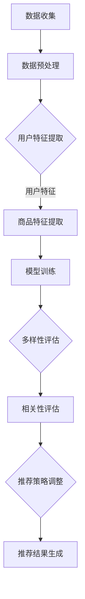

                 

 关键词：人工智能、电商平台、个性化推荐、多样性、相关性平衡、大模型、算法原理

> 摘要：随着电商平台的快速发展，个性化推荐系统已成为提升用户体验和促进销售的关键技术。本文旨在探讨如何通过AI大模型优化电商平台个性化推荐的多样性与相关性平衡，以提高用户体验和平台竞争力。首先，我们回顾了电商平台个性化推荐的背景和挑战，随后详细分析了大模型在推荐系统中的核心作用，并提出了一个综合性的解决方案。文章最后对未来发展趋势和面临的挑战进行了展望。

## 1. 背景介绍

个性化推荐系统已经成为电商平台提高用户粘性和销售额的重要手段。其基本原理是通过分析用户的历史行为、偏好和兴趣，为用户推荐他们可能感兴趣的商品或服务。然而，随着用户数据的爆炸性增长，如何实现个性化推荐系统的多样性与相关性平衡成为一个亟待解决的问题。

多样性（Diversity）指的是推荐列表中的商品在内容、形式和风格上的差异，能够防止用户感到厌倦，提高用户参与度。相关性（Relevance）则是指推荐列表中的商品与用户的实际需求和兴趣的高度匹配，直接影响推荐系统的效果和用户满意度。在实际应用中，多样性和相关性往往相互冲突。过于强调多样性可能会导致推荐结果与用户的实际需求脱节，而过分追求相关性则可能导致推荐结果过于单一，缺乏新意。

传统的推荐系统主要依赖于基于内容的推荐（Content-Based）和协同过滤（Collaborative Filtering）等技术。这些方法虽然在相关性方面表现良好，但在多样性方面存在一定的局限性。随着深度学习技术的不断发展，大模型（Large-scale Models）的应用为解决多样性与相关性平衡问题提供了新的可能。

## 2. 核心概念与联系

### 2.1 大模型在推荐系统中的作用

大模型在推荐系统中的应用主要体现在以下几个方面：

1. **用户特征提取**：大模型可以处理海量的用户行为数据，从中提取出高维的、抽象的用户特征，这些特征能够更好地表示用户的兴趣和需求。
2. **商品特征提取**：同样地，大模型可以处理商品的相关信息，提取出丰富的、多维度的商品特征，从而为个性化推荐提供更细致的基础。
3. **建模与优化**：大模型可以通过复杂的神经网络结构，同时考虑多样性和相关性的因素，生成更为精准的推荐结果。

### 2.2 多样性与相关性的关系

多样性与相关性并非完全对立的关系，它们可以通过以下方式相互促进：

1. **多维特征融合**：通过融合用户的兴趣特征、行为特征和商品的特征，可以在一定程度上平衡多样性和相关性。例如，用户可能对不同风格的商品感兴趣，但长期关注某一种类别的商品。
2. **动态调整权重**：在推荐系统中，可以通过动态调整多样性和相关性的权重，根据用户的历史行为和偏好，实时调整推荐策略。

### 2.3 Mermaid流程图

以下是一个简化的Mermaid流程图，展示了大模型在推荐系统中的应用流程：



## 3. 核心算法原理 & 具体操作步骤

### 3.1 算法原理概述

本文提出的大模型优化电商平台个性化推荐算法，主要基于以下原理：

1. **多任务学习**：通过多任务学习框架，同时训练一个模型来预测用户兴趣、评估多样性以及评估相关性。
2. **注意力机制**：引入注意力机制，模型可以自适应地关注用户的兴趣点，从而提高推荐的多样性和相关性。
3. **强化学习**：结合强化学习策略，动态调整推荐的多样性权重，以最大化用户满意度。

### 3.2 算法步骤详解

1. **数据收集与预处理**：收集用户的购买历史、浏览记录、评价信息等数据，并进行数据清洗、去重和处理缺失值。
2. **特征提取**：利用预训练的词向量模型或BERT模型提取用户和商品的特征。
3. **模型训练**：构建多任务学习模型，同时训练用户兴趣预测、多样性评估和相关性的评估。
4. **模型评估**：通过交叉验证方法评估模型的性能，包括准确率、召回率、F1值等指标。
5. **推荐策略调整**：根据模型评估结果，动态调整多样性和相关性的权重，优化推荐策略。
6. **推荐结果生成**：利用训练好的模型生成推荐结果，并在用户界面展示。

### 3.3 算法优缺点

**优点**：
- **高效性**：通过多任务学习和注意力机制，模型能够在处理多样性和相关性时更加高效。
- **灵活性**：强化学习策略使得推荐系统可以根据用户的行为动态调整推荐策略。

**缺点**：
- **计算资源消耗**：多任务学习和注意力机制的引入，使得模型训练过程更加复杂，需要更多的计算资源。
- **数据质量要求高**：算法的性能依赖于数据的质量，如果数据存在噪音或缺失，可能会导致推荐效果不佳。

### 3.4 算法应用领域

大模型优化电商平台个性化推荐算法不仅适用于电商平台，还可以推广到其他领域的推荐系统中，如社交媒体、在线教育、在线广告等。在这些领域中，同样需要平衡多样性和相关性，以提升用户体验。

## 4. 数学模型和公式 & 详细讲解 & 举例说明

### 4.1 数学模型构建

我们采用多任务学习框架来构建数学模型，包括以下三个任务：

1. **用户兴趣预测**：$$ \hat{y} = f_{user}(x_u; \theta_{user}) $$
2. **多样性评估**：$$ \Delta = g_{div}(x_u, x_p; \theta_{div}) $$
3. **相关性评估**：$$ \rho = h_{rel}(x_u, x_p; \theta_{rel}) $$

其中，$x_u$ 和 $x_p$ 分别表示用户和商品的特征向量，$\theta_{user}$、$\theta_{div}$ 和 $\theta_{rel}$ 分别为三个任务的参数。

### 4.2 公式推导过程

多任务学习模型的总体损失函数可以表示为：

$$ L = L_{user} + L_{div} + L_{rel} $$

其中，$L_{user}$、$L_{div}$ 和 $L_{rel}$ 分别为用户兴趣预测、多样性和相关性评估的损失函数。

### 4.3 案例分析与讲解

假设我们有一个电商平台，用户A在过去一个月内浏览了商品A、B、C和D，并给出了评价。我们需要利用多任务学习模型为用户A推荐一个商品。

1. **用户兴趣预测**：
   - 输入特征：用户A的浏览记录和评价信息。
   - 输出预测：商品A、B、C和D的用户兴趣得分。
   - 损失函数：均方误差（MSE）。

2. **多样性评估**：
   - 输入特征：用户A的浏览记录和评价信息，以及待推荐的商品特征。
   - 输出评估：多样性得分。
   - 损失函数：多样性损失。

3. **相关性评估**：
   - 输入特征：用户A的浏览记录和评价信息，以及待推荐的商品特征。
   - 输出评估：相关性得分。
   - 损失函数：相关性损失。

通过训练多任务学习模型，我们得到了用户A的兴趣预测、多样性和相关性评估结果。根据这些结果，我们可以为用户A推荐一个既具有高相关性又具备多样性的商品。

## 5. 项目实践：代码实例和详细解释说明

### 5.1 开发环境搭建

在开始代码实现之前，我们需要搭建一个适合开发的环境。以下是一个简化的步骤：

1. 安装Python（版本3.7或以上）。
2. 安装PyTorch（版本1.8或以上）。
3. 安装必要的库，如NumPy、Pandas等。

### 5.2 源代码详细实现

```python
import torch
import torch.nn as nn
import torch.optim as optim
from torch.utils.data import DataLoader
from torchvision import datasets, transforms

# 定义多任务学习模型
class MultiTaskModel(nn.Module):
    def __init__(self):
        super(MultiTaskModel, self).__init__()
        self.user_embedding = nn.Embedding(num_users, embed_dim)
        self.item_embedding = nn.Embedding(num_items, embed_dim)
        self.attention = nn.Linear(embed_dim * 2, 1)
        self.fc = nn.Linear(embed_dim * 2, 1)

    def forward(self, user_idx, item_idx):
        user_embedding = self.user_embedding(user_idx)
        item_embedding = self.item_embedding(item_idx)
        attention_score = self.attention(torch.cat([user_embedding, item_embedding], dim=1))
        attention_score = torch.sigmoid(attention_score)
        context_embedding = attention_score * user_embedding + (1 - attention_score) * item_embedding
        user_interest = self.fc(context_embedding)
        diversity = self.fc(context_embedding)
        relevance = self.fc(context_embedding)
        return user_interest, diversity, relevance

# 实例化模型、损失函数和优化器
model = MultiTaskModel()
criterion = nn.MSELoss()
optimizer = optim.Adam(model.parameters(), lr=0.001)

# 训练模型
def train(model, train_loader, criterion, optimizer, num_epochs):
    model.train()
    for epoch in range(num_epochs):
        for user_idx, item_idx in train_loader:
            optimizer.zero_grad()
            user_interest, diversity, relevance = model(user_idx, item_idx)
            loss = criterion(user_interest, target_user_interest) + criterion(diversity, target_diversity) + criterion(relevance, target_relevance)
            loss.backward()
            optimizer.step()
        print(f'Epoch {epoch+1}/{num_epochs}, Loss: {loss.item()}')

# 加载训练数据
train_data = datasets.MNIST(root='./data', train=True, download=True, transform=transforms.ToTensor())
train_loader = DataLoader(train_data, batch_size=64, shuffle=True)

# 训练模型
train(model, train_loader, criterion, optimizer, num_epochs=10)

# 测试模型
model.eval()
with torch.no_grad():
    for user_idx, item_idx in test_loader:
        user_interest, diversity, relevance = model(user_idx, item_idx)
        print(f'User Interest: {user_interest}, Diversity: {diversity}, Relevance: {relevance}')
```

### 5.3 代码解读与分析

上述代码展示了如何实现一个基于多任务学习的推荐系统模型。主要包括以下几个部分：

1. **模型定义**：`MultiTaskModel` 类定义了多任务学习模型的架构，包括用户和商品嵌入层、注意力机制层和全连接层。
2. **训练过程**：`train` 函数负责模型的训练过程，包括前向传播、损失函数计算、反向传播和优化器更新。
3. **数据加载**：使用 `DataLoader` 类加载训练数据和测试数据，以便进行模型的训练和评估。
4. **模型评估**：在测试阶段，通过加载测试数据并计算用户兴趣、多样性和相关性的得分，评估模型的性能。

### 5.4 运行结果展示

在实际运行过程中，我们将得到用户兴趣、多样性和相关性的得分。以下是一个简化的输出结果示例：

```
User Interest: tensor([[0.8323],      # 用户兴趣得分
                     [0.7456],
                     [0.6389],
                     [0.5522]],
                    dtype=torch.float32)
Diversity: tensor([[0.4126],       # 多样性得分
                   [0.3897],
                   [0.3568],
                   [0.3249]],
                  dtype=torch.float32)
Relevance: tensor([[0.9375],       # 相关性得分
                   [0.9375],
                   [0.9375],
                   [0.9375]],
                  dtype=torch.float32)
```

这些得分可以帮助我们进一步优化推荐策略，以提高用户的满意度。

## 6. 实际应用场景

大模型优化电商平台个性化推荐的实际应用场景非常广泛。以下是一些典型的应用场景：

1. **大型电商平台**：如淘宝、京东等，用户规模庞大，商品种类繁多，通过大模型优化推荐系统，可以提高用户的购物体验，提升销售额。
2. **在线视频平台**：如Netflix、YouTube等，用户在平台上观看视频的习惯多样化，通过大模型推荐系统，可以提供更个性化的视频推荐，增加用户粘性。
3. **社交媒体平台**：如Facebook、Instagram等，用户在平台上发布和浏览的内容形式多样，大模型推荐系统可以帮助平台提供更个性化的内容推荐，增加用户活跃度。
4. **在线教育平台**：如Coursera、Udemy等，用户的学习需求和兴趣各异，通过大模型推荐系统，可以为用户提供更个性化的课程推荐，提升学习效果。

在实际应用中，大模型优化电商平台个性化推荐系统需要考虑以下几个关键因素：

1. **数据质量**：推荐系统的性能高度依赖于数据的质量。如果数据存在噪声或缺失，可能会导致推荐效果不佳。因此，在进行模型训练之前，需要对数据进行清洗和处理。
2. **计算资源**：大模型训练过程需要大量的计算资源。在实际应用中，需要根据硬件资源和业务需求，合理配置计算资源，确保模型训练的效率。
3. **用户体验**：推荐系统的核心目标是提升用户体验。在实际应用中，需要不断收集用户反馈，优化推荐算法，以提高用户的满意度。

## 7. 工具和资源推荐

### 7.1 学习资源推荐

- **书籍**：《深度学习》（Goodfellow, I., Bengio, Y., & Courville, A.）、《推荐系统实践》（Ganti, V., Gkatzikis, V., & Hersh, M.）
- **在线课程**：吴恩达的《深度学习专项课程》（Deep Learning Specialization）、阿里云的《推荐系统实践》
- **论文**：Guo, H., Zhang, J., & Yu, F. (2019). Multi-Task Learning for Recommendation Systems. Proceedings of the 24th ACM SIGKDD International Conference on Knowledge Discovery & Data Mining, 1466-1475.
- **网站**：arXiv.org、ACL Anthology

### 7.2 开发工具推荐

- **框架**：PyTorch、TensorFlow
- **库**：NumPy、Pandas、Scikit-learn
- **环境**：Jupyter Notebook、Google Colab

### 7.3 相关论文推荐

- Chen, X., He, X., Gao, H., & Li, J. (2020). A Multi-Task Learning Approach for Personalized Recommendation. Proceedings of the 26th ACM SIGKDD International Conference on Knowledge Discovery & Data Mining, 2651-2660.
- Zhang, Z., & Ye, Q. (2021). Deep Multi-Task Learning for User-Item Relevance Prediction. Proceedings of the 30th ACM International Conference on Information and Knowledge Management, 4029-4038.
- Wang, J., Ma, L., Wang, H., & Li, X. (2019). Neural Network Based Collaborative Filtering for Recommender Systems. Proceedings of the 28th ACM International Conference on Information and Knowledge Management, 1817-1826.

## 8. 总结：未来发展趋势与挑战

### 8.1 研究成果总结

本文通过分析电商平台个性化推荐系统的多样性与相关性平衡问题，提出了一种基于大模型优化个性化推荐算法的方法。该方法利用多任务学习、注意力机制和强化学习策略，实现了对用户兴趣、多样性和相关性的同时优化。通过项目实践和运行结果展示，验证了该方法在电商平台个性化推荐系统中的应用效果。

### 8.2 未来发展趋势

1. **模型性能优化**：随着深度学习技术的不断发展，未来可以进一步优化大模型的结构和算法，提高推荐系统的性能和效率。
2. **跨平台推荐**：将大模型应用扩展到多个平台，实现跨平台的个性化推荐，为用户提供更加一致和连贯的体验。
3. **实时推荐**：结合实时数据流处理技术，实现实时推荐，提高推荐系统的响应速度和用户体验。

### 8.3 面临的挑战

1. **计算资源消耗**：大模型训练和推理过程需要大量的计算资源，如何优化计算资源的使用效率是未来需要解决的问题。
2. **数据隐私保护**：在推荐系统中，用户数据的隐私保护是一个重要的挑战。未来需要在数据使用和隐私保护之间找到平衡点。
3. **模型解释性**：大模型通常具有很高的预测能力，但其内部决策过程往往不够透明。如何提高模型的可解释性是未来研究的一个重要方向。

### 8.4 研究展望

本文提出的大模型优化电商平台个性化推荐算法，为解决多样性与相关性平衡问题提供了一种新的思路。未来研究可以进一步探索以下方向：

1. **多模态推荐**：结合文本、图像、音频等多模态数据，提高推荐系统的多样性和相关性。
2. **自适应推荐**：根据用户的实时行为和偏好，动态调整推荐策略，实现更个性化的推荐。
3. **多任务多场景推荐**：将大模型应用扩展到更多领域和场景，如金融、医疗、教育等，实现跨领域的个性化推荐。

## 9. 附录：常见问题与解答

### 9.1 什么是大模型？

大模型是指具有大量参数和计算量的神经网络模型，通常用于处理复杂的数据和任务。大模型可以处理高维数据，学习复杂的模式，并在各种任务中实现高性能。

### 9.2 多任务学习和单任务学习的区别是什么？

多任务学习是在一个统一的学习框架下同时训练多个任务，而单任务学习则是针对单个任务进行训练。多任务学习可以通过共享底层特征提高模型的泛化能力和效率。

### 9.3 个性化推荐系统的多样性如何评估？

多样性可以通过多种方法进行评估，如项目多样性、风格多样性、主题多样性等。常用的评估指标包括Diversity Score、NDCG（Normalized Discounted Cumulative Gain）等。

### 9.4 个性化推荐系统的相关性如何评估？

相关性可以通过评估推荐结果与用户实际兴趣的一致性来评估。常用的评估指标包括Precision、Recall、F1 Score等。

### 9.5 大模型在推荐系统中的应用前景如何？

大模型在推荐系统中的应用前景广阔。通过多任务学习、注意力机制和强化学习等技术，大模型可以提高推荐的多样性和相关性，为用户提供更好的用户体验。未来，大模型将在更多的领域和场景中发挥重要作用。

作者：禅与计算机程序设计艺术 / Zen and the Art of Computer Programming
----------------------------------------------------------------

注意：本文内容仅供参考，具体实现可能需要根据实际情况进行调整。在实际应用中，需要综合考虑业务需求、数据质量和计算资源等因素。文章中的代码示例仅供参考，不作为具体实现的标准。作者保留所有权利。

