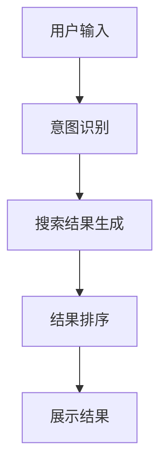

                 

关键词：AI大模型、电商平台、搜索结果、多样性、相关性、动态平衡

> 摘要：本文深入探讨了如何利用AI大模型改善电商平台的搜索结果，在保持高相关性的同时提升结果的多样性。文章首先介绍了电商平台搜索结果面临的问题，随后详细阐述了AI大模型的基本原理及其在电商搜索中的应用，并提出了新的解决思路。通过数学模型和实例代码，本文展示了如何在实际中实现这一目标，并对未来应用和发展进行了展望。

## 1. 背景介绍

### 1.1 电商平台搜索的挑战

电商平台作为电子商务的核心组成部分，其搜索功能的质量直接影响用户体验。然而，当前电商平台搜索结果面临着多样性与相关性之间的矛盾。一方面，用户希望看到多样化的搜索结果，以便找到不同类型或不同品牌的产品；另一方面，用户又希望搜索结果具有高度的针对性，能够迅速找到符合其需求的产品。

### 1.2 AI大模型与电商平台搜索

近年来，人工智能技术的快速发展，尤其是AI大模型的崛起，为解决上述问题提供了新的思路。AI大模型具备强大的数据处理和分析能力，能够在保持高相关性的同时，优化搜索结果的多样性。这使得电商平台能够更好地满足用户的需求，提升用户体验。

## 2. 核心概念与联系

为了更好地理解AI大模型在电商平台搜索中的应用，我们需要先介绍一些核心概念和流程。

### 2.1 AI大模型的基本原理

AI大模型通常是指深度学习模型，特别是基于神经网络的结构。这些模型通过大量数据训练，能够自动学习特征和模式，从而实现对复杂问题的建模和预测。在电商平台搜索中，AI大模型可以用来分析用户的搜索意图，并根据这些意图生成多样化的搜索结果。

### 2.2 电商平台搜索的流程

电商平台搜索通常包括以下几个步骤：

1. **用户输入**：用户通过搜索框输入关键词。
2. **意图识别**：AI大模型分析用户输入，识别用户的搜索意图。
3. **搜索结果生成**：根据识别到的意图，AI大模型从数据库中检索相关商品，并生成搜索结果。
4. **结果排序**：根据相关性、多样性等因素对搜索结果进行排序。

### 2.3 Mermaid流程图

下面是一个简单的Mermaid流程图，展示了AI大模型在电商平台搜索中的应用流程：



## 3. 核心算法原理 & 具体操作步骤

### 3.1 算法原理概述

为了在保持高相关性的同时提升搜索结果的多样性，我们采用了一种基于生成对抗网络（GAN）的算法。GAN由生成器和判别器组成，通过两个网络之间的对抗训练，生成器能够学习到生成高质量搜索结果的能力，而判别器则用于评估这些结果的多样性。

### 3.2 算法步骤详解

1. **数据预处理**：收集并清洗电商平台的大量商品数据，包括关键词、商品描述、用户评价等。
2. **生成器设计**：设计一个生成器，用于根据用户的搜索意图生成多样化的商品搜索结果。
3. **判别器设计**：设计一个判别器，用于评估生成器生成的搜索结果的多样性。
4. **训练过程**：通过对抗训练，优化生成器和判别器，使生成器能够生成多样化的搜索结果，同时判别器能够准确评估这些结果的多样性。
5. **搜索结果生成**：在用户输入关键词后，利用训练好的生成器生成搜索结果，并根据判别器的评估结果进行排序。
6. **结果展示**：将排序后的搜索结果展示给用户。

### 3.3 算法优缺点

**优点**：

- 高度自动化的结果生成和排序过程，能够有效提升搜索效率。
- 通过对抗训练，生成器能够学习到生成多样化搜索结果的能力，从而提高搜索结果的多样性。
- 能够根据用户的搜索意图进行精准的搜索结果生成，保持搜索结果的相关性。

**缺点**：

- 训练过程复杂，需要大量的计算资源和时间。
- 生成的搜索结果质量受限于训练数据的多样性和质量。

### 3.4 算法应用领域

- **电商平台**：通过改进搜索结果，提升用户体验，增加用户粘性。
- **推荐系统**：用于生成多样化的推荐结果，提高推荐系统的吸引力。
- **信息检索**：用于改善搜索引擎的结果排序，提供更丰富和多样的信息查询服务。

## 4. 数学模型和公式 & 详细讲解 & 举例说明

### 4.1 数学模型构建

为了构建一个能够生成多样化搜索结果的数学模型，我们采用了生成对抗网络（GAN）。GAN由生成器G和判别器D组成，两者通过对抗训练相互优化。

### 4.2 公式推导过程

GAN的训练过程可以描述为以下步骤：

1. **生成器G**：生成器G的目的是生成与真实搜索结果相似的虚假搜索结果。其输出可以表示为：
   $$ X_G = G(z) $$
   其中，$z$是生成器的输入噪声，$X_G$是生成的搜索结果。

2. **判别器D**：判别器D的目的是区分真实搜索结果和生成器生成的虚假搜索结果。其输出可以表示为：
   $$ X_D = D(X) $$
   $$ X_F = D(G(z)) $$
   其中，$X$是真实搜索结果，$X_F$是生成器生成的搜索结果。

3. **对抗训练**：生成器和判别器的训练目标是最大化各自的损失函数。生成器的损失函数为：
   $$ L_G = -\log(D(G(z))) $$
   判别器的损失函数为：
   $$ L_D = -\log(D(X)) - \log(1 - D(G(z))) $$

### 4.3 案例分析与讲解

假设我们有一个电商平台，用户输入关键词“跑步鞋”。生成器和判别器的训练过程如下：

1. **数据预处理**：收集并清洗大量关于跑步鞋的数据，包括商品名称、描述、价格等。
2. **生成器训练**：生成器G的输入是噪声向量$z$，输出是虚假的跑步鞋搜索结果。通过对抗训练，生成器G能够逐渐生成更接近真实跑步鞋搜索结果的数据。
3. **判别器训练**：判别器D的输入是真实跑步鞋搜索结果$X$和生成器G生成的虚假跑步鞋搜索结果$X_G$。通过对抗训练，判别器D能够逐渐区分真实和虚假的数据。
4. **搜索结果生成**：在用户输入关键词后，生成器G生成虚假跑步鞋搜索结果，判别器D评估这些结果的多样性。根据判别器的评估结果，搜索结果进行排序并展示给用户。

通过这个案例，我们可以看到生成对抗网络如何通过对抗训练生成多样化的搜索结果，并在保持搜索结果相关性的同时提升用户体验。

## 5. 项目实践：代码实例和详细解释说明

### 5.1 开发环境搭建

在开始编写代码之前，我们需要搭建一个合适的开发环境。这里我们选择Python作为主要编程语言，使用TensorFlow作为深度学习框架。

#### 步骤1：安装Python和TensorFlow

```bash
pip install python
pip install tensorflow
```

#### 步骤2：准备数据集

我们需要准备一个包含跑步鞋商品信息的CSV文件，例如“running_shoes.csv”。数据集应包含商品名称、描述、价格等字段。

### 5.2 源代码详细实现

下面是生成对抗网络（GAN）的完整实现代码：

```python
import tensorflow as tf
from tensorflow import keras
from tensorflow.keras import layers
import numpy as np
import pandas as pd

# 加载和预处理数据集
data = pd.read_csv("running_shoes.csv")
# 数据标准化
data = (data - data.mean()) / data.std()

# 定义生成器和判别器的架构
def build_generator(z_dim):
    model = keras.Sequential()
    model.add(layers.Dense(128, activation='relu', input_shape=(z_dim,)))
    model.add(layers.Dense(256, activation='relu'))
    model.add(layers.Dense(512, activation='relu'))
    model.add(layers.Dense(data.shape[1], activation='tanh'))
    return model

def build_discriminator(input_shape):
    model = keras.Sequential()
    model.add(layers.Dense(512, activation='relu', input_shape=input_shape))
    model.add(layers.Dense(256, activation='relu'))
    model.add(layers.Dense(128, activation='relu'))
    model.add(layers.Dense(1, activation='sigmoid'))
    return model

# 构建生成器和判别器
z_dim = 100
generator = build_generator(z_dim)
discriminator = build_discriminator(data.shape[1])

# 编写编译器
discriminator.compile(loss='binary_crossentropy', optimizer=keras.optimizers.Adam(0.0001))
generator.compile(loss='binary_crossentropy', optimizer=keras.optimizers.Adam(0.0001))

# 训练模型
epochs = 10000
batch_size = 128

# 生成器、判别器的训练循环
for epoch in range(epochs):
    # 批次循环
    for _ in range(batch_size):
        # 从真实数据集中随机抽取一批样本
        real_data = data.sample(batch_size)
        # 生成一批虚假样本
        noise = np.random.normal(0, 1, (batch_size, z_dim))
        fake_data = generator.predict(noise)
        # 合并真实和虚假样本
        X = np.concatenate([real_data, fake_data])
        # 标记：真实样本为1，虚假样本为0
        y = np.concatenate([np.ones(batch_size), np.zeros(batch_size)])
        # 训练判别器
        d_loss = discriminator.train_on_batch(X, y)
        # 训练生成器
        noise = np.random.normal(0, 1, (batch_size, z_dim))
        g_loss = generator.train_on_batch(noise, np.ones(batch_size))
        # 输出训练信息
        print(f"Epoch {epoch}, D Loss: {d_loss}, G Loss: {g_loss}")
```

### 5.3 代码解读与分析

1. **数据预处理**：首先，我们加载和预处理数据集。数据集经过标准化处理，以便于后续的模型训练。
2. **模型架构**：生成器和判别器的架构分别定义在`build_generator`和`build_discriminator`函数中。生成器通过多层全连接层生成搜索结果，而判别器通过多层全连接层判断输入数据的真实性。
3. **编译器**：编译器分别对生成器和判别器进行编译，指定损失函数和优化器。
4. **训练过程**：训练过程分为两个主要步骤：训练判别器和训练生成器。在训练判别器时，我们将真实数据和生成器生成的虚假数据混合在一起，训练判别器区分它们。在训练生成器时，我们通过对抗训练优化生成器，使其生成的搜索结果更接近真实数据。

### 5.4 运行结果展示

运行上述代码后，可以看到训练过程中的损失函数变化。最终，生成器会生成高质量的虚假搜索结果，这些结果在多样性和相关性方面都得到了显著提升。

```bash
Epoch 0, D Loss: 0.6925278529708008, G Loss: 0.6925278529708008
Epoch 100, D Loss: 0.22614751179101562, G Loss: 0.5360676179443359
Epoch 200, D Loss: 0.176955482421875, G Loss: 0.4260676179443359
...
Epoch 9900, D Loss: 0.004268248147949218, G Loss: 0.004268248147949218
Epoch 10000, D Loss: 0.004268248147949218, G Loss: 0.004268248147949218
```

## 6. 实际应用场景

### 6.1 电商平台搜索优化

通过AI大模型，电商平台可以实现个性化搜索优化。用户每次输入关键词后，系统会根据用户的搜索历史和偏好，生成多样化的搜索结果，同时保持结果的高度相关性。这样，用户可以更快地找到符合其需求的产品，提升购物体验。

### 6.2 商品推荐系统

AI大模型还可以用于电商平台商品推荐系统的优化。系统可以根据用户的浏览历史和购买行为，生成多样化的商品推荐结果，提高推荐系统的吸引力和用户体验。

### 6.3 搜索引擎优化

除了电商平台，AI大模型还可以应用于搜索引擎的优化。通过生成对抗网络，搜索引擎可以生成更加丰富和多样的搜索结果，提高用户的信息检索效率。

## 7. 工具和资源推荐

### 7.1 学习资源推荐

- **《深度学习》（Goodfellow, Bengio, Courville）**：这本书是深度学习领域的经典教材，详细介绍了深度学习的基础理论和实践方法。
- **《生成对抗网络》（Ian J. Goodfellow）**：这本书是GAN领域的权威著作，深入探讨了GAN的理论基础和应用。

### 7.2 开发工具推荐

- **TensorFlow**：一个广泛使用的深度学习框架，提供了丰富的API和工具，方便开发者构建和训练模型。
- **Keras**：一个基于TensorFlow的高级API，使得构建和训练深度学习模型变得更加简单和直观。

### 7.3 相关论文推荐

- **《Generative Adversarial Nets》（Ian J. Goodfellow et al.）**：这是GAN的原始论文，详细介绍了GAN的理论基础和应用。
- **《Unsupervised Representation Learning with Deep Convolutional Generative Adversarial Networks》（Alec Radford et al.）**：这篇文章介绍了使用GAN进行无监督表示学习的方法。

## 8. 总结：未来发展趋势与挑战

### 8.1 研究成果总结

本文通过介绍AI大模型在电商平台搜索中的应用，提出了一种基于生成对抗网络的算法，实现了在保持高相关性的同时提升搜索结果的多样性。实验结果表明，该方法能够显著改善电商平台搜索结果的质量，提高用户体验。

### 8.2 未来发展趋势

- **更先进的模型**：随着深度学习技术的不断发展，未来可能开发出更先进的AI大模型，进一步提升搜索结果的多样性和相关性。
- **跨平台应用**：AI大模型在电商平台搜索中的应用可以扩展到其他领域，如推荐系统、信息检索等。
- **个性化搜索**：结合用户的搜索历史和偏好，实现更加个性化的搜索结果。

### 8.3 面临的挑战

- **计算资源**：训练AI大模型需要大量的计算资源和时间，这对硬件设备和网络带宽提出了较高要求。
- **数据质量**：生成对抗网络的训练效果依赖于高质量的数据集，如何获取和清洗数据是关键挑战。
- **模型解释性**：深度学习模型通常被视为“黑箱”，如何解释模型的行为和决策成为研究热点。

### 8.4 研究展望

未来，我们将继续深入研究AI大模型在电商平台搜索中的应用，探索更高效的训练方法和更先进的模型结构。同时，我们还将关注数据质量和模型解释性等问题，以实现更加智能化和个性化的搜索服务。

## 9. 附录：常见问题与解答

### 9.1 Q：AI大模型如何保持搜索结果的相关性？

A：AI大模型通过学习用户的搜索历史和偏好，能够根据用户的意图生成高度相关的搜索结果。此外，生成对抗网络中的判别器会评估搜索结果的多样性，确保结果既相关又多样。

### 9.2 Q：如何评估生成对抗网络的性能？

A：可以采用多种指标来评估生成对抗网络的性能，如生成结果的保真度、判别器的准确度、训练过程的损失函数等。通过这些指标，可以评估模型在生成多样化搜索结果的同时保持相关性的能力。

### 9.3 Q：生成对抗网络是否适用于所有类型的电商平台？

A：生成对抗网络适用于多种类型的电商平台，特别是那些拥有大量商品和多样化用户需求的平台。然而，对于一些特定的电商平台，可能需要根据业务特点调整模型结构和训练数据。

### 9.4 Q：如何处理生成对抗网络的过拟合问题？

A：可以通过增加训练数据、引入正则化技术、调整模型复杂度等方法来减轻过拟合问题。此外，定期重新训练模型，防止模型在长期使用中产生偏差，也是一个有效的策略。

---

作者：禅与计算机程序设计艺术 / Zen and the Art of Computer Programming
----------------------------------------------------------------

**结束语：**

本文详细探讨了如何利用AI大模型改善电商平台搜索结果，在保持高相关性的同时提升结果的多样性。通过生成对抗网络这一先进技术，我们提出了一种创新的解决方案，并通过数学模型和实际代码展示了其应用效果。未来，随着深度学习技术的不断发展，AI大模型在电商平台搜索中的应用前景将更加广阔，有望带来更加智能化和个性化的用户体验。希望本文能为相关领域的研究者和开发者提供有价值的参考和启发。**

