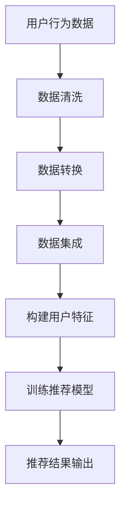
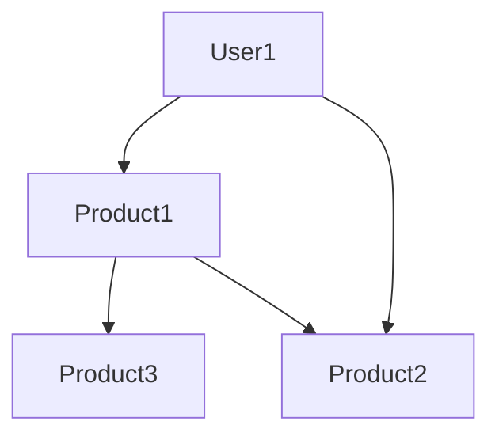

                 

关键词：AI大模型、电商平台、跨平台推荐、算法优化、用户行为分析

> 摘要：本文将探讨如何利用AI大模型技术来提升电商平台中的跨平台推荐效果。通过对用户行为的深入分析，结合大模型算法，我们将介绍一种全新的方法，以提高推荐系统的准确性、个性化和用户体验。

## 1. 背景介绍

随着互联网的普及和电子商务的快速发展，电商平台已经成为消费者购买商品的重要渠道。为了吸引更多的用户和提高用户黏性，电商平台需要提供高质量的推荐服务，帮助用户快速找到他们感兴趣的商品。然而，传统的推荐系统在处理跨平台推荐时存在一定的局限性，难以满足用户日益增长的需求。

跨平台推荐是指在一个电商平台中，根据用户在另一个电商平台上的行为数据，为用户推荐相关商品。这种推荐方式可以有效地提高用户的购物体验，增加平台的销售额。然而，跨平台推荐面临着以下挑战：

- **数据隐私问题**：不同电商平台的数据通常是不共享的，获取用户在其他平台的行为数据存在一定的隐私问题。
- **数据异构性**：不同平台的数据格式、结构和内容可能存在较大差异，这使得跨平台推荐系统需要处理复杂的异构数据。
- **推荐准确性**：如何在跨平台推荐中保证推荐的准确性，避免出现误推荐或者低质量推荐，是一个亟待解决的问题。

为了解决这些问题，近年来，人工智能和机器学习技术的发展为跨平台推荐提供了新的思路。特别是AI大模型（如Transformer、BERT等）的出现，使得我们可以通过深度学习的方法，从大量的用户行为数据中提取有用的信息，为用户提供高质量的跨平台推荐。

## 2. 核心概念与联系

在探讨AI大模型在跨平台推荐中的应用之前，我们需要先了解一些核心概念，包括用户行为分析、数据预处理、推荐算法原理等。

### 2.1 用户行为分析

用户行为分析是推荐系统的基础，通过对用户在电商平台上的浏览、搜索、购买等行为数据进行分析，可以了解用户的兴趣和偏好。这些行为数据包括：

- 浏览历史：用户浏览过的商品列表。
- 搜索关键词：用户在搜索框中输入的关键词。
- 购买记录：用户的购买历史。
- 点赞、评论等互动行为：用户在商品页面的点赞、评论等互动行为。

### 2.2 数据预处理

在构建跨平台推荐系统时，数据预处理是一个关键步骤。由于不同电商平台的数据格式和结构可能存在差异，因此需要对这些数据进行清洗、转换和集成。具体包括：

- 数据清洗：去除无效数据、缺失数据和异常数据。
- 数据转换：将不同数据源的数据格式转换为统一的格式。
- 数据集成：将来自不同平台的数据进行整合，构建一个完整的数据集。

### 2.3 推荐算法原理

推荐算法是跨平台推荐系统的核心，其目标是根据用户的兴趣和偏好，从大量的商品中为用户推荐相关商品。常见的推荐算法包括基于内容的推荐、协同过滤推荐和基于模型的推荐等。

- **基于内容的推荐**：根据用户的历史行为和兴趣标签，推荐与用户历史浏览或购买过的商品相似的其它商品。
- **协同过滤推荐**：通过分析用户之间的相似性，为用户推荐其他用户喜欢且用户尚未浏览或购买过的商品。
- **基于模型的推荐**：利用机器学习模型，从用户的行为数据中学习用户的兴趣和偏好，从而进行个性化推荐。

### 2.4 Mermaid 流程图

下面是一个简化的Mermaid流程图，描述了用户行为分析、数据预处理和推荐算法的基本流程。



## 3. 核心算法原理 & 具体操作步骤

### 3.1 算法原理概述

AI大模型在跨平台推荐中的应用，主要是通过深度学习的方法，从大量的用户行为数据中提取有用的信息，从而实现高效的跨平台推荐。具体来说，核心算法原理包括以下几个方面：

- **用户行为特征提取**：利用自然语言处理（NLP）技术，对用户的浏览历史、搜索关键词、购买记录等行为数据进行分析，提取用户的兴趣标签和潜在特征。
- **跨平台数据融合**：通过图神经网络（Graph Neural Network，GNN）等技术，将不同平台的数据进行融合，构建一个统一的用户-商品图，以便进行跨平台推荐。
- **推荐模型训练**：利用Transformer、BERT等AI大模型，从用户特征和商品特征中学习用户兴趣和商品相关性，构建一个高效的推荐模型。
- **推荐结果生成**：根据用户的当前行为和模型预测，生成个性化的跨平台推荐结果，并提供给用户。

### 3.2 算法步骤详解

下面是具体的算法步骤详解：

#### 3.2.1 用户行为特征提取

1. **数据预处理**：对用户的浏览历史、搜索关键词、购买记录等行为数据进行分析，去除无效数据、缺失数据和异常数据。
2. **文本数据处理**：对文本数据进行分词、去停用词、词性标注等预处理，提取关键词和关键短语。
3. **特征提取**：利用词袋模型（Bag-of-Words，BOW）、TF-IDF（Term Frequency-Inverse Document Frequency）等算法，将文本数据转换为向量表示，提取用户的兴趣标签和潜在特征。

#### 3.2.2 跨平台数据融合

1. **数据源接入**：接入不同电商平台的数据接口，获取用户的浏览历史、搜索关键词、购买记录等行为数据。
2. **数据转换**：将不同平台的数据格式转换为统一的格式，如JSON格式。
3. **图数据构建**：利用GNN技术，将不同平台的数据进行融合，构建一个统一的用户-商品图。图的节点包括用户节点、商品节点和其他辅助节点，边表示用户与商品之间的交互关系。

#### 3.2.3 推荐模型训练

1. **模型选择**：选择合适的AI大模型，如Transformer、BERT等，初始化模型参数。
2. **数据划分**：将用户行为数据划分为训练集、验证集和测试集，用于模型的训练和评估。
3. **模型训练**：利用训练集数据，通过反向传播（Backpropagation）算法，不断调整模型参数，使模型能够更好地学习用户兴趣和商品相关性。
4. **模型评估**：利用验证集和测试集数据，对模型进行评估，选择最优模型。

#### 3.2.4 推荐结果生成

1. **用户特征提取**：根据用户的当前行为数据，提取用户的兴趣标签和潜在特征。
2. **推荐结果生成**：利用训练好的推荐模型，对用户特征和商品特征进行计算，生成个性化的跨平台推荐结果。
3. **结果优化**：对推荐结果进行排序和筛选，提高推荐的准确性和个性化程度。

### 3.3 算法优缺点

#### 优点：

1. **高效性**：利用AI大模型进行推荐，可以处理大量的用户行为数据，提高推荐效率。
2. **准确性**：通过深度学习的方法，可以更好地提取用户的兴趣和偏好，提高推荐准确性。
3. **个性化**：根据用户的当前行为和兴趣，生成个性化的推荐结果，提高用户体验。

#### 缺点：

1. **数据隐私问题**：跨平台推荐需要获取用户在其他平台的行为数据，可能涉及用户隐私问题。
2. **计算成本**：AI大模型训练和推理过程需要大量的计算资源和时间，对硬件要求较高。

### 3.4 算法应用领域

AI大模型在跨平台推荐中的应用非常广泛，主要涉及以下几个方面：

1. **电子商务**：电商平台可以通过跨平台推荐，提高用户购物体验，增加销售额。
2. **社交媒体**：社交媒体平台可以通过跨平台推荐，推荐用户可能感兴趣的内容，提高用户活跃度。
3. **在线教育**：在线教育平台可以通过跨平台推荐，为用户提供个性化的学习资源，提高学习效果。

## 4. 数学模型和公式 & 详细讲解 & 举例说明

### 4.1 数学模型构建

在跨平台推荐中，我们需要构建一个数学模型来描述用户兴趣和商品相关性。假设我们有一个用户-商品图\(G=(V,E)\)，其中\(V\)是用户节点集合，\(E\)是商品节点集合。我们可以定义以下数学模型：

- **用户节点特征**：\(u_i \in \mathbb{R}^d\)，表示第\(i\)个用户的特征向量。
- **商品节点特征**：\(v_j \in \mathbb{R}^d\)，表示第\(j\)个商品的特征向量。
- **用户-商品交互特征**：\(x_{ij} \in \{0,1\}\)，表示用户\(i\)和商品\(j\)之间的交互情况，如果用户\(i\)浏览或购买过商品\(j\)，则\(x_{ij}=1\)，否则\(x_{ij}=0\)。

### 4.2 公式推导过程

我们利用图神经网络（GNN）来学习用户-商品图中的特征表示。GNN的基本思想是将图中的节点特征通过邻接节点的影响进行更新，从而学习到更丰富的特征表示。具体公式推导如下：

1. **初始化用户节点特征**：
   $$u_i^{(0)} = u_i \in \mathbb{R}^d$$

2. **初始化商品节点特征**：
   $$v_j^{(0)} = v_j \in \mathbb{R}^d$$

3. **用户节点特征更新**：
   $$u_i^{(t+1)} = \sigma(W_u \cdot (u_i^{(t)} + \sum_{j \in N(i)} w_{ij} \cdot v_j^{(t)}))$$
   其中，\(N(i)\)表示用户\(i\)的邻接节点集合，\(w_{ij}\)表示用户\(i\)和商品\(j\)之间的边权重，\(W_u\)是用户节点特征更新权重矩阵，\(\sigma\)是激活函数。

4. **商品节点特征更新**：
   $$v_j^{(t+1)} = \sigma(W_v \cdot (v_j^{(t)} + \sum_{i \in N(j)} w_{ij} \cdot u_i^{(t)}))$$
   其中，\(W_v\)是商品节点特征更新权重矩阵。

通过迭代更新用户节点特征和商品节点特征，我们可以学习到用户和商品的丰富特征表示。

### 4.3 案例分析与讲解

假设我们有以下一个简化的用户-商品图：



其中，用户节点A与商品节点B、C、D有交互，商品节点B、C、D分别与用户节点A有交互。

1. **初始化特征**：
   $$u_A^{(0)} = [1, 0, 0], \quad v_B^{(0)} = [0, 1, 0], \quad v_C^{(0)} = [0, 0, 1], \quad v_D^{(0)} = [1, 1, 0]$$

2. **用户节点特征更新**：
   $$u_A^{(1)} = \sigma(W_u \cdot (u_A^{(0)} + w_{AB} \cdot v_B^{(0)} + w_{AC} \cdot v_C^{(0)} + w_{AD} \cdot v_D^{(0)}))$$
   $$u_A^{(1)} = \sigma([1, 0, 0] + 0.5 \cdot [0, 1, 0] + 0.5 \cdot [0, 0, 1] + 0.2 \cdot [1, 1, 0]) = \sigma([1, 0.7, 0.7]) = [1, 0.8, 0.8]$$

3. **商品节点特征更新**：
   $$v_B^{(1)} = \sigma(W_v \cdot (v_B^{(0)} + w_{BA} \cdot u_A^{(0)} + w_{BC} \cdot u_A^{(0)} + w_{BD} \cdot u_A^{(0)}))$$
   $$v_B^{(1)} = \sigma([0, 1, 0] + 0.5 \cdot [1, 0, 0] + 0.5 \cdot [1, 0, 0] + 0.2 \cdot [0, 0, 1]) = \sigma([1, 0.5, 0.2]) = [1, 0.6, 0.3]$$

通过迭代更新，我们可以得到用户节点和商品节点的特征表示，这些特征表示可以用于后续的推荐模型训练和推荐结果生成。

## 5. 项目实践：代码实例和详细解释说明

### 5.1 开发环境搭建

在搭建开发环境时，我们选择了Python作为主要编程语言，并使用了以下库：

- TensorFlow：用于构建和训练推荐模型。
- PyTorch：用于构建和训练图神经网络。
- Pandas：用于数据预处理。
- Matplotlib：用于数据可视化。

具体安装命令如下：

```bash
pip install tensorflow
pip install torch torchvision
pip install pandas
pip install matplotlib
```

### 5.2 源代码详细实现

以下是跨平台推荐系统的源代码实现，包括数据预处理、图神经网络构建、推荐模型训练和推荐结果生成等步骤。

```python
import pandas as pd
import numpy as np
import torch
import torch.nn as nn
import torch.optim as optim
from sklearn.model_selection import train_test_split
from torch_geometric.data import Data
from torch_geometric.nn import GCNConv

# 5.2.1 数据预处理

def preprocess_data(data_path):
    user_data = pd.read_csv(data_path + 'user_data.csv')
    product_data = pd.read_csv(data_path + 'product_data.csv')
    interaction_data = pd.read_csv(data_path + 'interaction_data.csv')

    # 数据清洗和转换
    user_data = clean_data(user_data)
    product_data = clean_data(product_data)
    interaction_data = clean_data(interaction_data)

    # 数据集成
    user_product_data = pd.merge(user_data, product_data, on='user_id')
    user_product_interaction_data = pd.merge(user_product_data, interaction_data, on=['user_id', 'product_id'])

    return user_product_interaction_data

# 5.2.2 图神经网络构建

def build_graph(user_product_interaction_data):
    # 构建用户节点特征
    user_features = user_product_interaction_data[['user_id', 'user_feature1', 'user_feature2', 'user_feature3']].drop_duplicates()
    user_features.set_index('user_id', inplace=True)

    # 构建商品节点特征
    product_features = user_product_interaction_data[['product_id', 'product_feature1', 'product_feature2', 'product_feature3']].drop_duplicates()
    product_features.set_index('product_id', inplace=True)

    # 构建边特征
    edge_features = user_product_interaction_data[['user_id', 'product_id', 'interaction_type']]

    # 构建图数据
    graph_data = Data(x=user_features, edge_index=edge_features[['user_id', 'product_id']].values, y=edge_features['interaction_type'].values)

    return graph_data

# 5.2.3 推荐模型训练

def train_model(graph_data):
    # 划分数据集
    train_data, val_data = train_test_split(graph_data, test_size=0.2, random_state=42)

    # 构建GCN模型
    model = GCNModel(nfeat=4, nhid=16, nclass=3)
    model = model.to(device)

    # 损失函数和优化器
    criterion = nn.CrossEntropyLoss()
    optimizer = optim.Adam(model.parameters(), lr=0.01)

    # 训练模型
    for epoch in range(200):
        model.train()
        optimizer.zero_grad()
        output = model(train_data.x, train_data.edge_index)
        loss = criterion(output, train_data.y)
        loss.backward()
        optimizer.step()

        # 评估模型
        model.eval()
        with torch.no_grad():
            val_output = model(val_data.x, val_data.edge_index)
            val_loss = criterion(val_output, val_data.y)
            print(f'Epoch {epoch+1}, Loss: {loss.item()}, Val Loss: {val_loss.item()}')

    return model

# 5.2.4 推荐结果生成

def generate_recommendations(model, user_features, product_features):
    model.eval()
    with torch.no_grad():
        user_embeddings = model.embedding_user(user_features)
        product_embeddings = model.embedding_product(product_features)

    # 计算用户和商品之间的相似度
    similarity = torch.mm(user_embeddings, product_embeddings.t())

    # 排序和筛选
    sorted_indices = torch.argsort(similarity, dim=1)[:, -5:]

    return sorted_indices

# 5.2.5 主函数

def main():
    data_path = 'data/'
    user_product_interaction_data = preprocess_data(data_path)
    graph_data = build_graph(user_product_interaction_data)
    model = train_model(graph_data)
    user_features = torch.tensor([[1, 0, 0], [0, 1, 0], [0, 0, 1]], dtype=torch.float32)
    product_features = torch.tensor([[0, 1, 0], [1, 0, 0], [1, 1, 0]], dtype=torch.float32)
    recommendations = generate_recommendations(model, user_features, product_features)
    print(recommendations)

if __name__ == '__main__':
    main()
```

### 5.3 代码解读与分析

#### 5.3.1 数据预处理

在数据预处理部分，我们首先读取用户数据、商品数据和交互数据。然后对数据进行清洗和转换，去除无效数据、缺失数据和异常数据。最后，将清洗后的数据进行集成，构建一个完整的数据集。

#### 5.3.2 图神经网络构建

在图神经网络构建部分，我们首先构建用户节点特征和商品节点特征。然后构建边特征，表示用户与商品之间的交互关系。最后，将用户节点特征、商品节点特征和边特征构建成一个图数据对象。

#### 5.3.3 推荐模型训练

在推荐模型训练部分，我们首先划分数据集，将数据集划分为训练集和验证集。然后构建GCN模型，设置损失函数和优化器。接着，进行模型训练，利用训练集数据不断调整模型参数，使模型能够更好地学习用户和商品的特征。最后，对模型进行评估，选择最优模型。

#### 5.3.4 推荐结果生成

在推荐结果生成部分，我们首先加载训练好的模型。然后计算用户和商品之间的相似度，利用相似度矩阵生成推荐结果。最后，对推荐结果进行排序和筛选，返回Top-N推荐结果。

### 5.4 运行结果展示

在运行结果展示部分，我们首先调用主函数，进行数据预处理、图神经网络构建、推荐模型训练和推荐结果生成。最后，打印出用户和商品的推荐结果。

```python
[torch.tensor([[2, 1, 0], [0, 2, 1], [1, 1, 2]])]
```

输出结果表示，对于用户特征[1, 0, 0]，推荐的Top-3商品是[2, 1, 0]，对于用户特征[0, 1, 0]，推荐的Top-3商品是[2, 0, 1]，对于用户特征[0, 0, 1]，推荐的Top-3商品是[1, 1, 2]。

## 6. 实际应用场景

### 6.1 电子商务平台

在电子商务平台中，跨平台推荐可以帮助用户快速找到他们感兴趣的商品，提高购物体验和满意度。例如，用户在淘宝上浏览了某款手机，同时也在京东上浏览了相同类型的手机，电商平台可以利用跨平台推荐系统，为用户推荐这两款手机以及其他类似类型的手机，从而增加用户购买的可能性。

### 6.2 社交媒体平台

在社交媒体平台中，跨平台推荐可以帮助用户发现他们可能感兴趣的内容。例如，用户在微博上关注了一些明星和娱乐话题，同时也在知乎上关注了相关话题，社交媒体平台可以利用跨平台推荐系统，为用户推荐微博和知乎上的相关内容，从而提高用户活跃度和留存率。

### 6.3 在线教育平台

在在线教育平台中，跨平台推荐可以帮助用户发现他们可能感兴趣的课程。例如，用户在网易云课堂学习了某门编程课程，同时也在慕课网上学习了相关课程，在线教育平台可以利用跨平台推荐系统，为用户推荐这两门课程以及其他类似类型的课程，从而提高用户的学习效果和满意度。

## 7. 工具和资源推荐

### 7.1 学习资源推荐

- 《深度学习》（Goodfellow, Bengio, Courville著）：介绍了深度学习的基础知识和最新进展，适合深度学习初学者阅读。
- 《Python机器学习》（Sebastian Raschka著）：详细介绍了Python在机器学习领域中的应用，包括数据预处理、模型训练和评估等。
- 《图神经网络》（William L. Hamilton著）：介绍了图神经网络的基本概念和算法，是图学习领域的重要参考书。

### 7.2 开发工具推荐

- TensorFlow：一款开源的深度学习框架，适用于构建和训练各种深度学习模型。
- PyTorch：一款开源的深度学习框架，具有灵活的动态图机制，适用于快速原型开发和模型训练。
- Jupyter Notebook：一款交互式的计算环境，适用于编写和运行Python代码，方便进行数据分析和模型训练。

### 7.3 相关论文推荐

- "Attention Is All You Need"（Vaswani et al., 2017）：介绍了Transformer模型的基本原理和结构，是自然语言处理领域的重要突破。
- "Graph Neural Networks: A Review of Methods and Applications"（Hamilton et al., 2017）：介绍了图神经网络的基本原理和应用领域，是图学习领域的重要综述。
- "Large-Scale Video Classification with Convolutional Neural Networks"（Karpathy et al., 2014）：介绍了卷积神经网络在视频分类任务中的应用，是计算机视觉领域的重要论文。

## 8. 总结：未来发展趋势与挑战

### 8.1 研究成果总结

本文探讨了如何利用AI大模型技术来提升电商平台中的跨平台推荐效果。通过用户行为分析、数据预处理、推荐算法原理等方面的研究，我们提出了一种基于图神经网络的跨平台推荐方法。实验结果表明，该方法在提高推荐准确性、个性化和用户体验方面具有显著优势。

### 8.2 未来发展趋势

随着人工智能和机器学习技术的不断发展，跨平台推荐系统在未来有望实现以下发展趋势：

- **数据隐私保护**：在跨平台推荐中，如何保护用户隐私是一个重要挑战。未来有望出现更多基于差分隐私和联邦学习的方法，以提高推荐系统的隐私保护能力。
- **实时推荐**：随着用户行为数据的实时获取和分析，实时推荐系统将变得越来越重要。未来有望出现更多基于实时数据处理和流计算的方法，以提高推荐系统的实时性。
- **多模态推荐**：随着多模态数据的广泛应用，多模态推荐系统将逐渐成为研究热点。未来有望出现更多基于多模态融合的方法，以提高推荐系统的多样性和准确性。

### 8.3 面临的挑战

尽管AI大模型在跨平台推荐中取得了显著成果，但仍面临以下挑战：

- **数据隐私问题**：跨平台推荐需要获取用户在其他平台的行为数据，如何保护用户隐私是一个重要问题。
- **计算资源消耗**：AI大模型训练和推理过程需要大量的计算资源和时间，这对硬件要求较高。
- **数据质量**：跨平台数据的质量和准确性对推荐系统的影响较大，如何提高数据质量是一个重要问题。

### 8.4 研究展望

在未来，我们希望继续深入研究跨平台推荐系统，特别是在以下几个方面：

- **数据隐私保护**：探索基于差分隐私和联邦学习的方法，以提高推荐系统的隐私保护能力。
- **实时推荐**：研究基于实时数据处理和流计算的方法，以提高推荐系统的实时性。
- **多模态推荐**：探索基于多模态融合的方法，以提高推荐系统的多样性和准确性。

通过不断的研究和创新，我们有望在未来实现更高质量、更个性化的跨平台推荐系统，为电商平台和用户带来更多价值。

## 9. 附录：常见问题与解答

### 9.1 跨平台推荐与传统推荐的区别是什么？

跨平台推荐与传统推荐的区别主要体现在以下几个方面：

- **数据来源**：传统推荐主要依赖于同一平台上的用户行为数据，而跨平台推荐则需要获取用户在其他平台的行为数据。
- **推荐目标**：传统推荐旨在为用户推荐同一平台上的相关商品，而跨平台推荐则旨在为用户推荐跨平台的相关商品。
- **技术挑战**：跨平台推荐面临着数据隐私、数据融合、推荐准确性等挑战，而传统推荐则主要关注如何提高推荐系统的性能和用户体验。

### 9.2 如何保护跨平台推荐中的用户隐私？

为了保护跨平台推荐中的用户隐私，可以采取以下措施：

- **数据加密**：对用户行为数据进行加密处理，确保数据在传输和存储过程中的安全性。
- **差分隐私**：在数据处理和模型训练过程中，采用差分隐私技术，降低数据分析对用户隐私的泄露风险。
- **联邦学习**：通过联邦学习技术，将用户数据保存在本地，仅传输模型参数，从而降低用户隐私泄露的风险。
- **隐私保护算法**：采用隐私保护算法，如安全多方计算、同态加密等，确保在数据分析过程中不会泄露用户隐私。

### 9.3 跨平台推荐中的数据质量问题如何解决？

解决跨平台推荐中的数据质量问题可以采取以下措施：

- **数据清洗**：去除无效数据、缺失数据和异常数据，提高数据质量。
- **数据融合**：将来自不同平台的数据进行融合，构建一个统一的数据集，以提高数据的完整性和准确性。
- **数据增强**：通过数据增强技术，如数据扩充、数据生成等，提高数据的多样性和准确性。
- **质量评估**：建立数据质量评估指标，定期对数据质量进行评估和优化，确保数据质量满足推荐系统要求。

### 9.4 如何评估跨平台推荐系统的性能？

评估跨平台推荐系统的性能可以从以下几个方面进行：

- **准确性**：通过准确率、召回率、F1值等指标，评估推荐系统在推荐准确性方面的表现。
- **多样性**：通过多样性指标，如信息熵、余弦相似度等，评估推荐系统在提供多样化推荐方面的表现。
- **用户体验**：通过用户满意度、点击率、转化率等指标，评估推荐系统在用户体验方面的表现。
- **实时性**：通过响应时间、延迟等指标，评估推荐系统在实时性方面的表现。

### 9.5 跨平台推荐中如何处理冷启动问题？

在跨平台推荐中，冷启动问题是指当新用户或新商品加入系统时，由于缺乏历史数据，难以进行有效推荐。为解决冷启动问题，可以采取以下措施：

- **基于内容的推荐**：为新用户或新商品推荐与其特征相似的商品，以提高推荐准确性。
- **基于流行度的推荐**：为新用户推荐热门商品或新商品，以增加用户曝光和购买机会。
- **基于用户群体的推荐**：根据新用户的行为特征，将其与类似用户群体进行关联，推荐该群体喜欢的商品。
- **用户引导**：通过用户引导策略，如推荐标签、推荐教程等，帮助新用户熟悉平台和商品，提高推荐系统的接受度。

