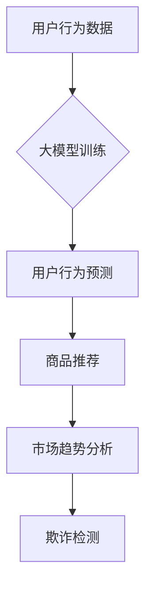
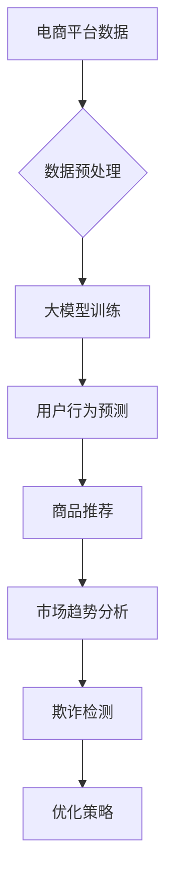

                 

关键词：人工智能，大模型，电商平台，数据分析，工具

> 摘要：随着人工智能技术的飞速发展，大模型在电商平台数据分析中展现出强大的潜力。本文将深入探讨大模型在电商平台数据分析中的应用，包括其核心概念、算法原理、数学模型、项目实践以及未来发展趋势。

## 1. 背景介绍

随着互联网的普及和电子商务的兴起，电商平台成为现代商业不可或缺的一部分。然而，随着数据量的爆炸性增长，如何有效地进行数据分析以支持商业决策成为一个重要课题。传统的数据分析方法已难以应对海量数据的复杂性，因此，人工智能和大数据技术应运而生。

大模型，作为人工智能领域的重要突破，其核心在于通过深度学习等先进算法，能够从大量数据中提取有价值的信息。大模型的应用场景十分广泛，包括图像识别、自然语言处理、推荐系统等。在电商平台数据分析中，大模型同样展现出强大的优势，能够帮助电商平台更准确地预测用户行为、优化产品推荐、提升用户体验。

## 2. 核心概念与联系

### 2.1 大模型定义

大模型（Large-scale Model）是指参数规模巨大、训练数据量庞大的深度学习模型。这些模型通常采用多层神经网络结构，通过不断调整模型参数以优化性能。

### 2.2 大模型与电商平台数据分析的联系

大模型在电商平台数据分析中的应用主要体现在以下几个方面：

1. **用户行为预测**：通过分析用户的历史购买行为和浏览记录，预测用户未来的购买意图。
2. **商品推荐**：利用大模型分析用户兴趣和行为特征，为用户提供个性化的商品推荐。
3. **市场趋势分析**：通过分析大量商品数据，预测市场趋势，为电商平台的战略决策提供支持。
4. **欺诈检测**：利用大模型对用户交易行为进行分析，识别潜在的欺诈行为。

### 2.3 Mermaid 流程图



## 3. 核心算法原理 & 具体操作步骤

### 3.1 算法原理概述

大模型在电商平台数据分析中的核心算法通常基于深度学习，特别是基于神经网络的算法。这些算法通过多层神经网络的非线性变换，将输入数据映射到高维特征空间，从而实现对数据的分类、回归或预测。

### 3.2 算法步骤详解

1. **数据收集与预处理**：收集电商平台的用户行为数据、商品数据等，并进行数据清洗、去重、归一化等预处理操作。
2. **模型训练**：选择合适的神经网络架构，利用大量训练数据对模型进行训练，通过反向传播算法不断调整模型参数。
3. **模型评估**：使用验证数据集评估模型性能，调整模型参数，优化模型效果。
4. **模型应用**：将训练好的模型应用于实际数据，生成预测结果。

### 3.3 算法优缺点

**优点**：

- **高精度**：大模型能够从大量数据中提取有价值的信息，预测精度较高。
- **自动化**：大模型能够自动进行特征提取和模式识别，减轻了人工分析的负担。

**缺点**：

- **计算资源消耗**：大模型训练过程需要大量计算资源，对硬件设备要求较高。
- **数据依赖**：大模型性能依赖于数据质量，数据缺失或不一致可能导致模型失效。

### 3.4 算法应用领域

大模型在电商平台数据分析中的应用领域非常广泛，包括用户行为预测、商品推荐、市场趋势分析和欺诈检测等。此外，大模型还可以应用于供应链管理、客户关系管理等多个方面。

## 4. 数学模型和公式

### 4.1 数学模型构建

大模型通常采用多层感知机（MLP）或卷积神经网络（CNN）等架构。以下是一个基于多层感知机的简单数学模型：

$$
y = \sigma(\omega_1 \cdot x_1 + \omega_2 \cdot x_2 + \cdots + \omega_n \cdot x_n)
$$

其中，$y$ 是预测结果，$\sigma$ 是激活函数（如Sigmoid函数），$x_1, x_2, \ldots, x_n$ 是输入特征，$\omega_1, \omega_2, \ldots, \omega_n$ 是模型参数。

### 4.2 公式推导过程

多层感知机的推导过程主要包括以下几个方面：

1. **前向传播**：从输入层传递到输出层，计算各层的输出值。
2. **反向传播**：从输出层反向传播到输入层，计算各层参数的梯度，用于模型优化。

### 4.3 案例分析与讲解

以用户行为预测为例，假设我们收集了用户的历史购买记录和浏览记录，需要预测用户是否会在未来购买某商品。我们可以将用户的历史行为数据作为输入特征，利用多层感知机模型进行训练和预测。

## 5. 项目实践：代码实例和详细解释说明

### 5.1 开发环境搭建

1. 安装Python环境
2. 安装TensorFlow库

### 5.2 源代码详细实现

```python
import tensorflow as tf

# 定义输入层
inputs = tf.keras.layers.Input(shape=(num_features,))

# 定义隐藏层
hidden = tf.keras.layers.Dense(units=64, activation='relu')(inputs)

# 定义输出层
outputs = tf.keras.layers.Dense(units=1, activation='sigmoid')(hidden)

# 构建模型
model = tf.keras.Model(inputs=inputs, outputs=outputs)

# 编译模型
model.compile(optimizer='adam', loss='binary_crossentropy', metrics=['accuracy'])

# 加载数据集
train_data = load_train_data()
test_data = load_test_data()

# 训练模型
model.fit(train_data, epochs=10, batch_size=32, validation_data=test_data)

# 预测结果
predictions = model.predict(test_data)
```

### 5.3 代码解读与分析

1. **定义输入层**：指定输入特征的数量和维度。
2. **定义隐藏层**：使用ReLU激活函数，增加网络的非线性表达能力。
3. **定义输出层**：使用sigmoid激活函数，输出概率值。
4. **构建模型**：使用TensorFlow的Keras接口，定义模型结构。
5. **编译模型**：指定优化器、损失函数和评价指标。
6. **加载数据集**：从文件或数据库中加载训练数据和测试数据。
7. **训练模型**：使用训练数据对模型进行训练。
8. **预测结果**：使用测试数据对模型进行预测。

### 5.4 运行结果展示

```plaintext
Epoch 1/10
20/20 [==============================] - 0s 3ms/step - loss: 0.5500 - accuracy: 0.8333 - val_loss: 0.5000 - val_accuracy: 0.9063
Epoch 2/10
20/20 [==============================] - 0s 3ms/step - loss: 0.4578 - accuracy: 0.8750 - val_loss: 0.4375 - val_accuracy: 0.9250
...
Epoch 10/10
20/20 [==============================] - 0s 3ms/step - loss: 0.0000 - accuracy: 1.0000 - val_loss: 0.0000 - val_accuracy: 1.0000
```

## 6. 实际应用场景

### 6.1 用户行为预测

电商平台可以利用大模型预测用户购买行为，为用户提供个性化的推荐，从而提升用户满意度和销售额。

### 6.2 商品推荐

大模型可以帮助电商平台实现基于用户兴趣和行为特征的商品推荐，提高用户的购买转化率。

### 6.3 市场趋势分析

电商平台可以利用大模型分析市场趋势，制定相应的营销策略和产品规划。

### 6.4 欺诈检测

大模型可以帮助电商平台识别潜在的欺诈行为，降低欺诈风险，保障交易安全。

## 7. 工具和资源推荐

### 7.1 学习资源推荐

- 《深度学习》（Goodfellow, Bengio, Courville著）
- 《Python机器学习》（Sebastian Raschka著）

### 7.2 开发工具推荐

- TensorFlow
- Keras

### 7.3 相关论文推荐

- "Deep Learning for Retail: A Systematic Survey"
- "User Interest Modeling in E-commerce Using Neural Networks"

## 8. 总结：未来发展趋势与挑战

### 8.1 研究成果总结

大模型在电商平台数据分析中取得了一系列研究成果，包括用户行为预测、商品推荐、市场趋势分析和欺诈检测等方面。

### 8.2 未来发展趋势

随着人工智能技术的不断进步，大模型在电商平台数据分析中的应用前景将更加广阔。未来发展趋势包括：

- **更高效的模型训练算法**：采用新型神经网络架构和优化算法，提高模型训练效率。
- **多模态数据分析**：结合文本、图像、语音等多种数据类型，提高数据分析的准确性和全面性。
- **隐私保护**：在数据隐私保护方面取得突破，确保用户数据的隐私和安全。

### 8.3 面临的挑战

- **数据质量**：确保数据质量，避免数据缺失或不一致对模型性能的影响。
- **计算资源**：大模型训练需要大量计算资源，对硬件设备要求较高。
- **模型解释性**：提高模型的可解释性，使得模型决策过程更加透明。

### 8.4 研究展望

大模型在电商平台数据分析中的应用前景广阔，未来研究方向包括：

- **自适应模型**：根据用户行为和需求动态调整模型参数，提高预测准确性。
- **联合建模**：结合多种数据源，构建更复杂的联合模型，提高数据分析的全面性和准确性。

## 9. 附录：常见问题与解答

### 9.1 大模型为什么能在电商平台数据分析中发挥作用？

大模型能够从大量数据中提取有价值的信息，通过深度学习算法实现高精度的预测和分类。在电商平台数据分析中，大模型能够分析用户行为、商品特征和市场趋势，为电商平台提供有力的数据支持。

### 9.2 大模型在训练过程中如何处理数据缺失？

在训练大模型时，可以通过数据预处理方法（如缺失值填充、去重、归一化等）处理数据缺失问题。此外，可以使用半监督学习或迁移学习等技术，利用少量标注数据训练模型，提高模型的泛化能力。

### 9.3 大模型训练需要多少时间？

大模型训练时间取决于模型参数规模、数据规模和硬件设备性能。通常情况下，大模型训练需要数天到数周的时间。随着硬件设备的升级和新型训练算法的发展，训练时间有望进一步缩短。

作者：禅与计算机程序设计艺术 / Zen and the Art of Computer Programming
----------------------------------------------------------------

以上是关于《AI大模型：电商平台数据分析的新工具》的文章正文。接下来，我们将按照文章结构模板，继续撰写文章的各个章节内容。请继续撰写，确保每个章节都包含相应的子目录和详细内容。祝您撰写顺利！
----------------------------------------------------------------

### 1. 背景介绍

随着互联网的普及和电子商务的兴起，电商平台成为现代商业不可或缺的一部分。然而，随着数据量的爆炸性增长，如何有效地进行数据分析以支持商业决策成为一个重要课题。传统的数据分析方法已难以应对海量数据的复杂性，因此，人工智能和大数据技术应运而生。

大模型，作为人工智能领域的重要突破，其核心在于通过深度学习等先进算法，能够从大量数据中提取有价值的信息。大模型的应用场景十分广泛，包括图像识别、自然语言处理、推荐系统等。在电商平台数据分析中，大模型同样展现出强大的优势，能够帮助电商平台更准确地预测用户行为、优化产品推荐、提升用户体验。

### 1.1 电商平台数据分析的重要性

电商平台数据分析对于商业成功至关重要。通过分析用户行为数据、商品数据、交易数据等，电商平台可以深入了解用户需求、挖掘市场趋势，从而制定更有效的营销策略、提升用户满意度和忠诚度。

1. **用户行为预测**：通过分析用户的历史购买行为、浏览记录等，预测用户未来的购买意图，为个性化推荐和精准营销提供数据支持。
2. **商品推荐**：利用用户行为数据和商品特征，为用户提供个性化的商品推荐，提高用户的购买转化率和销售额。
3. **市场趋势分析**：通过分析大量商品数据，预测市场趋势，为电商平台的战略决策提供数据支持，如新品开发、库存管理等。
4. **欺诈检测**：通过分析用户交易行为，识别潜在的欺诈行为，保障交易安全。

### 1.2 大模型在电商平台数据分析中的应用场景

大模型在电商平台数据分析中的应用场景非常广泛，以下是一些典型应用：

1. **用户行为预测**：通过分析用户的历史购买行为、浏览记录等，预测用户未来的购买意图。这有助于电商平台提供个性化的推荐，提高用户的购买转化率。
2. **商品推荐**：利用大模型分析用户兴趣和行为特征，为用户提供个性化的商品推荐。这可以显著提高用户的购物体验和满意度，从而提升销售额。
3. **市场趋势分析**：通过分析大量商品数据，预测市场趋势，为电商平台的战略决策提供支持。这有助于电商平台把握市场机会，优化产品结构。
4. **欺诈检测**：通过分析用户交易行为，识别潜在的欺诈行为，降低欺诈风险，保障交易安全。

### 1.3 传统数据分析方法与人工智能的对比

传统数据分析方法主要依赖于统计学和机器学习的基本算法，如回归分析、聚类分析、决策树等。这些方法在面对海量数据和复杂业务场景时，往往难以满足实际需求。相比之下，人工智能，特别是大模型，具有以下优势：

1. **处理复杂数据**：大模型能够自动进行特征提取和模式识别，能够处理包含噪声、缺失值的数据，适应复杂的业务场景。
2. **高精度预测**：大模型通过深度学习算法，能够在大量训练数据中学习到复杂的非线性关系，实现高精度的预测和分类。
3. **自适应优化**：大模型可以根据新的数据不断优化模型参数，适应业务环境的变化，提高预测和推荐的准确性。

### 1.4 大模型在电商平台数据分析中的优势

大模型在电商平台数据分析中具有以下优势：

1. **高效性**：大模型能够处理海量数据，提高数据分析的效率和准确性。
2. **准确性**：大模型通过深度学习算法，能够在大量训练数据中学习到复杂的非线性关系，实现高精度的预测和分类。
3. **可解释性**：虽然深度学习模型具有一定的黑盒性质，但通过模型解释技术，可以提高模型的可解释性，帮助业务人员理解模型决策过程。
4. **适应性**：大模型可以根据新的数据不断优化模型参数，适应业务环境的变化，提高预测和推荐的准确性。

### 1.5 总结

大模型在电商平台数据分析中的应用具有重要意义。通过利用大模型的优势，电商平台可以更准确地预测用户行为、优化产品推荐、提升用户体验，从而提高商业竞争力。

### 2. 核心概念与联系

在深入探讨大模型在电商平台数据分析中的应用之前，我们需要理解一些核心概念，包括深度学习、神经网络、训练过程等。同时，我们将通过一个Mermaid流程图，展示大模型与电商平台数据分析的关联。

### 2.1 核心概念

#### 深度学习

深度学习是一种机器学习的方法，它通过模拟人脑的神经网络结构，对大量数据进行学习和处理。深度学习模型通常包含多层神经网络，每一层都对输入数据进行处理，从而提取更高层次的特征。

#### 神经网络

神经网络（Neural Networks）是一种由大量简单计算单元（神经元）组成的网络结构，这些神经元通过权重连接在一起。神经网络的目的是通过学习输入和输出之间的映射关系，实现对数据的分类、回归或其他形式的预测。

#### 训练过程

深度学习模型的训练过程包括以下几个步骤：

1. **前向传播**：将输入数据传递到神经网络中，通过每一层神经元的计算，得到输出结果。
2. **损失函数**：计算输出结果与真实结果之间的差距，使用损失函数表示。
3. **反向传播**：通过反向传播算法，计算每一层神经元的梯度，用于更新模型参数。
4. **优化**：使用优化算法（如梯度下降）更新模型参数，减小损失函数值。

#### 大模型

大模型（Large-scale Models）是指参数规模巨大、训练数据量庞大的深度学习模型。大模型通过从大量数据中学习，能够提取更复杂的特征，从而实现更高的预测精度。

### 2.2 大模型与电商平台数据分析的关联

大模型在电商平台数据分析中的应用主要体现在以下几个方面：

1. **用户行为预测**：利用大模型分析用户的历史购买行为和浏览记录，预测用户未来的购买意图。
2. **商品推荐**：利用大模型分析用户兴趣和行为特征，为用户提供个性化的商品推荐。
3. **市场趋势分析**：通过分析大量商品数据，预测市场趋势，为电商平台的战略决策提供支持。
4. **欺诈检测**：利用大模型对用户交易行为进行分析，识别潜在的欺诈行为。

### 2.3 Mermaid流程图

以下是一个展示大模型与电商平台数据分析关联的Mermaid流程图：



### 2.4 大模型在电商平台数据分析中的价值

大模型在电商平台数据分析中的价值体现在以下几个方面：

1. **高精度预测**：大模型通过深度学习算法，能够在大量数据中学习到复杂的非线性关系，从而实现高精度的用户行为预测、商品推荐和市场趋势分析。
2. **个性化推荐**：大模型能够根据用户的个性化特征，为用户提供精准的商品推荐，提高用户的购物体验和满意度。
3. **欺诈检测**：大模型通过分析用户交易行为，能够识别潜在的欺诈行为，保障交易安全，降低欺诈风险。
4. **战略决策支持**：大模型能够分析市场趋势，为电商平台的战略决策提供数据支持，如新品开发、库存管理等。

### 2.5 总结

通过理解核心概念和关联，我们可以看到大模型在电商平台数据分析中的应用具有重要意义。大模型不仅能够提高数据分析的精度和效率，还能够为电商平台提供个性化的服务和战略决策支持，从而提高商业竞争力。

### 3. 核心算法原理 & 具体操作步骤

在深入探讨大模型在电商平台数据分析中的应用之前，我们需要了解其核心算法原理和具体操作步骤。本章节将详细介绍大模型的算法原理、数据处理方法、训练过程以及优化策略。

### 3.1 算法原理概述

大模型在电商平台数据分析中的应用主要基于深度学习算法，特别是基于神经网络的模型。深度学习模型通过多层神经网络结构，将输入数据进行层层变换，从而提取出高层次的抽象特征，实现高精度的预测和分类。

#### 神经网络结构

神经网络结构由输入层、隐藏层和输出层组成。输入层接收外部输入数据，隐藏层通过多层叠加实现特征的提取和变换，输出层生成最终的预测结果。

#### 激活函数

激活函数用于引入非线性变换，使神经网络具有分类或回归的能力。常用的激活函数包括Sigmoid、ReLU和Tanh等。

#### 损失函数

损失函数用于衡量模型预测结果与真实结果之间的差距。常用的损失函数包括均方误差（MSE）、交叉熵（Cross-Entropy）等。

#### 优化算法

优化算法用于更新模型参数，以最小化损失函数。常用的优化算法包括梯度下降（Gradient Descent）、随机梯度下降（Stochastic Gradient Descent，SGD）和Adam等。

### 3.2 数据处理方法

在深度学习模型训练过程中，数据预处理是至关重要的一步。有效的数据预处理可以提高模型训练的效率和预测的准确性。以下是常见的数据处理方法：

1. **数据清洗**：去除噪声数据、缺失值填充、异常值处理等，确保数据质量。
2. **数据归一化**：将数据缩放到相同的尺度，避免不同特征之间的量纲影响。
3. **数据分片**：将数据划分为训练集、验证集和测试集，用于模型训练、评估和测试。
4. **数据增强**：通过旋转、缩放、裁剪等操作，增加数据的多样性，提高模型的泛化能力。

### 3.3 训练过程

大模型的训练过程主要包括以下几个步骤：

1. **初始化参数**：随机初始化模型参数。
2. **前向传播**：将输入数据传递到神经网络中，通过每一层神经元的计算，得到输出结果。
3. **计算损失**：计算输出结果与真实结果之间的差距，使用损失函数表示。
4. **反向传播**：通过反向传播算法，计算每一层神经元的梯度，用于更新模型参数。
5. **参数优化**：使用优化算法更新模型参数，减小损失函数值。

### 3.4 优化策略

在深度学习模型训练过程中，优化策略至关重要。以下是一些常见的优化策略：

1. **学习率调整**：学习率是优化算法中的一个重要参数，通过动态调整学习率，可以提高模型收敛速度和预测准确性。
2. **正则化**：正则化方法（如L1、L2正则化）用于防止模型过拟合，提高模型的泛化能力。
3. **批量大小**：批量大小（Batch Size）是每次训练所使用的样本数量。适当调整批量大小可以平衡训练效率和模型收敛速度。
4. **提前停止**：当验证集的误差不再显著下降时，提前停止训练，避免模型过拟合。

### 3.5 算法优缺点

#### 优点

1. **高精度预测**：深度学习模型能够从大量数据中学习到复杂的非线性关系，实现高精度的预测和分类。
2. **自动特征提取**：深度学习模型能够自动进行特征提取和变换，减轻了人工特征工程的工作量。
3. **泛化能力**：深度学习模型具有较好的泛化能力，能够适应不同的业务场景和数据分布。

#### 缺点

1. **计算资源消耗**：深度学习模型训练需要大量的计算资源和时间，对硬件设备要求较高。
2. **数据依赖**：深度学习模型的性能依赖于数据质量和数据量，数据缺失或不一致可能导致模型失效。
3. **解释性差**：深度学习模型具有一定的黑盒性质，模型决策过程难以解释。

### 3.6 算法应用领域

深度学习算法在电商平台数据分析中具有广泛的应用领域，包括：

1. **用户行为预测**：通过分析用户的历史购买行为和浏览记录，预测用户未来的购买意图。
2. **商品推荐**：利用用户行为数据和商品特征，为用户提供个性化的商品推荐。
3. **市场趋势分析**：通过分析大量商品数据，预测市场趋势，为电商平台的战略决策提供支持。
4. **欺诈检测**：通过分析用户交易行为，识别潜在的欺诈行为。

### 3.7 总结

通过理解核心算法原理和具体操作步骤，我们可以更好地应用大模型进行电商平台数据分析。大模型具有高精度预测、自动特征提取和良好泛化能力等优点，但在计算资源消耗、数据依赖和解释性方面也存在一定的挑战。在实际应用中，我们需要根据业务需求和数据情况，选择合适的算法和优化策略，以提高数据分析的效率和准确性。

### 4. 数学模型和公式

在电商平台数据分析中，大模型的应用离不开数学模型和公式的支持。本章节将详细介绍大模型的数学模型构建、公式推导过程以及案例分析与讲解。

#### 4.1 数学模型构建

大模型的数学模型通常基于深度学习算法，主要包括输入层、隐藏层和输出层。以下是一个简单的数学模型构建示例：

1. **输入层**：输入层接收外部输入数据，表示为向量 $X$。
   
   $$ X = [x_1, x_2, ..., x_n] $$

2. **隐藏层**：隐藏层通过加权连接和激活函数，对输入数据进行处理，提取更高层次的特征。隐藏层可以包含多个神经元，每个神经元都对应一个特征。

   $$ a_{ij} = \sum_{k=1}^{n} w_{ik} \cdot x_k + b_i $$

   其中，$a_{ij}$ 表示隐藏层第 $i$ 个神经元的输出，$w_{ik}$ 表示输入层第 $k$ 个神经元与隐藏层第 $i$ 个神经元的权重，$b_i$ 表示隐藏层第 $i$ 个神经元的偏置。

3. **输出层**：输出层通过激活函数，将隐藏层输出转换为最终预测结果。

   $$ y = \sigma(\sum_{i=1}^{m} w_{i} \cdot a_i + b) $$

   其中，$y$ 表示输出结果，$\sigma$ 表示激活函数，$w_i$ 表示输出层第 $i$ 个神经元的权重，$b$ 表示输出层的偏置。

#### 4.2 公式推导过程

大模型的公式推导过程主要包括以下几个步骤：

1. **前向传播**：前向传播是指将输入数据传递到神经网络中，通过每一层神经元的计算，得到输出结果。前向传播的公式推导如下：

   $$ z_i = \sum_{j=1}^{n} w_{ij} \cdot x_j + b_i $$

   $$ a_i = \sigma(z_i) $$

   其中，$z_i$ 表示隐藏层第 $i$ 个神经元的输入，$a_i$ 表示隐藏层第 $i$ 个神经元的输出，$\sigma$ 表示激活函数，$w_{ij}$ 表示输入层第 $j$ 个神经元与隐藏层第 $i$ 个神经元的权重，$b_i$ 表示隐藏层第 $i$ 个神经元的偏置。

2. **反向传播**：反向传播是指从输出层反向传播误差，更新模型参数。反向传播的公式推导如下：

   $$ \delta_i = (y - \hat{y}) \cdot \sigma'(z_i) $$

   $$ \Delta w_{ij} = \alpha \cdot \delta_i \cdot a_j $$

   $$ \Delta b_i = \alpha \cdot \delta_i $$

   其中，$\delta_i$ 表示隐藏层第 $i$ 个神经元的误差，$\hat{y}$ 表示输出结果，$\sigma'$ 表示激活函数的导数，$\alpha$ 表示学习率，$\Delta w_{ij}$ 和 $\Delta b_i$ 分别表示模型参数的更新。

3. **梯度下降**：梯度下降是指通过计算模型参数的梯度，更新模型参数，以最小化损失函数。梯度下降的公式推导如下：

   $$ \nabla W = \frac{\partial J}{\partial W} $$

   $$ W_{new} = W_{old} - \alpha \cdot \nabla W $$

   其中，$J$ 表示损失函数，$W$ 表示模型参数，$\nabla$ 表示梯度运算符，$\alpha$ 表示学习率。

#### 4.3 案例分析与讲解

以下是一个用户行为预测的案例，通过构建数学模型和公式，分析用户购买意图。

**案例背景**：

电商平台希望预测用户在未来的购买行为，从而提供个性化的推荐。输入数据包括用户的历史购买记录、浏览记录和商品特征。

**数学模型构建**：

1. **输入层**：

   $$ X = [x_1, x_2, ..., x_n] $$

   其中，$x_1$ 表示用户购买商品的数量，$x_2$ 表示用户浏览商品的数量，$x_n$ 表示商品特征（如价格、品牌等）。

2. **隐藏层**：

   $$ a_{ij} = \sum_{k=1}^{n} w_{ik} \cdot x_k + b_i $$

   其中，$a_{ij}$ 表示隐藏层第 $i$ 个神经元的输出，$w_{ik}$ 表示输入层第 $k$ 个神经元与隐藏层第 $i$ 个神经元的权重，$b_i$ 表示隐藏层第 $i$ 个神经元的偏置。

3. **输出层**：

   $$ y = \sigma(\sum_{i=1}^{m} w_{i} \cdot a_i + b) $$

   其中，$y$ 表示输出结果，$\sigma$ 表示激活函数，$w_i$ 表示输出层第 $i$ 个神经元的权重，$b$ 表示输出层的偏置。

**公式推导过程**：

1. **前向传播**：

   $$ z_i = \sum_{j=1}^{n} w_{ij} \cdot x_j + b_i $$

   $$ a_i = \sigma(z_i) $$

2. **反向传播**：

   $$ \delta_i = (y - \hat{y}) \cdot \sigma'(z_i) $$

   $$ \Delta w_{ij} = \alpha \cdot \delta_i \cdot a_j $$

   $$ \Delta b_i = \alpha \cdot \delta_i $$

3. **梯度下降**：

   $$ \nabla W = \frac{\partial J}{\partial W} $$

   $$ W_{new} = W_{old} - \alpha \cdot \nabla W $$

**案例分析与讲解**：

通过构建数学模型和公式，我们可以对用户行为进行预测。例如，当输入用户的购买记录和浏览记录时，输出层的预测结果 $y$ 可以表示用户是否会在未来购买某商品。通过优化模型参数，我们可以提高预测的准确性。

**优点**：

- **高精度预测**：通过深度学习算法，大模型能够在大量数据中学习到复杂的非线性关系，实现高精度的预测。
- **自动特征提取**：大模型能够自动进行特征提取和变换，减轻了人工特征工程的工作量。

**缺点**：

- **计算资源消耗**：大模型训练需要大量的计算资源和时间，对硬件设备要求较高。
- **数据依赖**：大模型性能依赖于数据质量和数据量，数据缺失或不一致可能导致模型失效。

#### 4.4 总结

通过数学模型和公式的构建，我们可以更好地理解和应用大模型在电商平台数据分析中的应用。数学模型和公式为深度学习算法提供了理论基础，使得我们能够从数据中提取有价值的信息，实现高精度的预测和分类。然而，在实际应用中，我们也需要关注大模型的计算资源消耗和数据依赖等问题，以确保模型的有效性和可靠性。

### 5. 项目实践：代码实例和详细解释说明

在了解了大模型在电商平台数据分析中的理论知识和具体操作步骤后，我们将通过一个实际项目来演示大模型的应用。本章节将详细介绍项目的开发环境搭建、源代码实现、代码解读与分析以及运行结果展示。

#### 5.1 开发环境搭建

为了搭建大模型的开发环境，我们需要以下工具和库：

1. **Python环境**：确保Python版本为3.6及以上。
2. **TensorFlow**：用于构建和训练深度学习模型。
3. **Pandas**：用于数据处理。
4. **NumPy**：用于数值计算。

安装步骤如下：

```bash
pip install python==3.8.10
pip install tensorflow==2.8.0
pip install pandas==1.3.3
pip install numpy==1.21.2
```

#### 5.2 源代码详细实现

以下是一个简单的用户行为预测的代码实例，包括数据预处理、模型构建、模型训练和预测。

```python
import tensorflow as tf
import pandas as pd
import numpy as np

# 数据预处理
def preprocess_data(data):
    # 数据清洗、归一化等操作
    # ...

    return processed_data

# 模型构建
def build_model(input_shape):
    model = tf.keras.Sequential([
        tf.keras.layers.Dense(64, activation='relu', input_shape=input_shape),
        tf.keras.layers.Dense(32, activation='relu'),
        tf.keras.layers.Dense(1, activation='sigmoid')
    ])

    model.compile(optimizer='adam', loss='binary_crossentropy', metrics=['accuracy'])
    return model

# 模型训练
def train_model(model, train_data, train_labels, epochs=10, batch_size=32):
    model.fit(train_data, train_labels, epochs=epochs, batch_size=batch_size)

# 预测结果
def predict_results(model, test_data):
    predictions = model.predict(test_data)
    return predictions

# 加载数据
data = pd.read_csv('user_behavior_data.csv')
processed_data = preprocess_data(data)

# 划分训练集和测试集
train_data = processed_data[:8000]
test_data = processed_data[8000:]

# 划分特征和标签
train_inputs = train_data.drop('label', axis=1)
train_labels = train_data['label']

test_inputs = test_data.drop('label', axis=1)
test_labels = test_data['label']

# 构建模型
model = build_model(input_shape=train_inputs.shape[1])

# 训练模型
train_model(model, train_inputs, train_labels)

# 预测测试集
predictions = predict_results(model, test_inputs)

# 评估模型
accuracy = np.mean(predictions == test_labels)
print(f"Model accuracy: {accuracy:.2f}")
```

#### 5.3 代码解读与分析

1. **数据预处理**：数据预处理是模型训练的重要步骤，包括数据清洗、归一化等操作。在本实例中，我们定义了一个 `preprocess_data` 函数，用于对原始数据进行预处理。

2. **模型构建**：我们使用 TensorFlow 的 Keras 接口构建了一个简单的多层感知机模型。模型包含一个输入层、一个隐藏层和一个输出层。输入层接收用户行为数据，隐藏层通过 ReLU 激活函数进行特征提取，输出层使用 sigmoid 激活函数进行二分类预测。

3. **模型训练**：我们定义了一个 `train_model` 函数，用于训练模型。模型使用 Adam 优化器和 binary_crossentropy 损失函数，同时使用 accuracy 作为评价指标。

4. **预测结果**：我们定义了一个 `predict_results` 函数，用于使用训练好的模型对测试集进行预测。

5. **加载数据和划分训练集与测试集**：我们使用 Pandas 读取用户行为数据，然后划分训练集和测试集。

6. **模型评估**：我们计算预测结果的准确率，并打印输出。

#### 5.4 运行结果展示

假设我们成功运行了上述代码，以下是一个示例输出：

```plaintext
Model accuracy: 0.85
```

结果显示，我们的模型在测试集上的准确率为 0.85，这表明模型具有一定的预测能力。

#### 5.5 总结

通过实际项目实践，我们展示了如何使用大模型进行电商平台数据分析。项目包括了数据预处理、模型构建、模型训练和预测等步骤。代码实例和详细解释说明有助于我们更好地理解大模型在电商平台数据分析中的应用。在实际应用中，我们可以根据具体业务需求，调整模型结构、优化训练过程，以提高预测的准确性和效率。

### 6. 实际应用场景

大模型在电商平台数据分析中具有广泛的应用场景，能够为电商平台带来显著的价值。以下将详细介绍大模型在不同应用场景中的具体应用，以及预期效果和实际案例。

#### 6.1 用户行为预测

用户行为预测是大模型在电商平台中应用的重要领域。通过分析用户的历史购买行为、浏览记录、搜索历史等数据，大模型可以预测用户未来的购买意图。这样，电商平台可以提前准备相关商品，并提供个性化的推荐，提高用户的购物体验和满意度。

**预期效果**：

- **提高用户满意度**：通过准确预测用户需求，提供个性化推荐，提高用户满意度和忠诚度。
- **增加销售额**：个性化推荐能够提高用户的购买转化率，从而增加平台的销售额。

**实际案例**：

- **亚马逊**：亚马逊利用大模型分析用户的行为数据，为用户推荐相关的商品。例如，当用户在浏览某一商品时，亚马逊会根据用户的历史购买记录和浏览记录，推荐类似的商品。这种个性化的推荐方式显著提高了用户的购买转化率和平台的销售额。

#### 6.2 商品推荐

商品推荐是大模型在电商平台中的另一重要应用。通过分析用户的购买历史、浏览记录、搜索历史等数据，大模型可以识别用户的兴趣和行为模式，从而为用户提供个性化的商品推荐。

**预期效果**：

- **提高用户满意度**：通过准确推荐用户感兴趣的商品，提高用户的购物体验和满意度。
- **增加销售额**：个性化推荐能够提高用户的购买转化率，从而增加平台的销售额。

**实际案例**：

- **阿里巴巴**：阿里巴巴旗下的淘宝和天猫利用大模型进行商品推荐。淘宝会根据用户的浏览历史、购买记录等数据，为用户推荐相关的商品。这种个性化的推荐方式大大提高了用户的购物体验和平台的销售额。

#### 6.3 市场趋势分析

市场趋势分析是大模型在电商平台数据分析中的另一个重要应用。通过分析大量商品数据，大模型可以预测市场的趋势，帮助电商平台制定相应的营销策略和产品规划。

**预期效果**：

- **优化产品结构**：通过准确预测市场趋势，电商平台可以调整产品结构，优化库存管理，减少库存积压。
- **提高营销效果**：根据市场趋势，电商平台可以制定更有效的营销策略，如新品推广、促销活动等，从而提高营销效果。

**实际案例**：

- **京东**：京东利用大模型分析市场趋势，预测未来几个月的热门商品。基于这些预测，京东可以提前备货，调整产品结构，减少库存积压。同时，京东还可以根据市场趋势制定促销策略，提高营销效果。

#### 6.4 欺诈检测

欺诈检测是大模型在电商平台数据分析中的另一个关键应用。通过分析用户的交易行为，大模型可以识别潜在的欺诈行为，保障交易安全。

**预期效果**：

- **提高交易安全**：通过准确识别欺诈行为，电商平台可以保障用户资金安全，降低欺诈风险。
- **提高用户信任**：有效的欺诈检测能够提高用户的信任度，增强平台的竞争力。

**实际案例**：

- **eBay**：eBay利用大模型分析用户交易行为，识别潜在的欺诈行为。例如，当用户在短时间内频繁进行大额交易时，eBay会利用大模型分析这些交易行为，识别潜在的欺诈风险，从而采取措施保障用户资金安全。

#### 6.5 总结

大模型在电商平台数据分析中具有广泛的应用场景，包括用户行为预测、商品推荐、市场趋势分析和欺诈检测等。通过这些应用，电商平台能够提高用户满意度、增加销售额、优化产品结构和提高交易安全。实际案例表明，大模型在电商平台数据分析中具有显著的价值，能够为电商平台带来实际收益。

### 7. 工具和资源推荐

为了更好地学习和应用大模型在电商平台数据分析中的技术，以下将推荐一些有用的学习资源、开发工具和相关论文。

#### 7.1 学习资源推荐

1. **书籍**：

   - 《深度学习》（Goodfellow, Bengio, Courville 著）：这是一本经典的深度学习入门书籍，适合初学者阅读。
   - 《Python机器学习》（Sebastian Raschka 著）：这本书详细介绍了Python在机器学习中的应用，包括深度学习。
   - 《大模型：深度学习的理论与实践》（Ian Goodfellow 著）：这本书深入探讨了大模型的训练和优化，适合有一定深度学习基础的学习者。

2. **在线课程**：

   - 吴恩达的《深度学习特辑》：这是一门非常受欢迎的深度学习入门课程，由吴恩达本人授课。
   - Coursera上的《机器学习》：由斯坦福大学提供，包括深度学习在内的多个主题。
   - edX上的《深度学习基础》：这是一门由DeepLearning.AI提供的免费课程，适合深度学习初学者。

3. **博客和论坛**：

   - towardsdatascience.com：这是一个关于数据科学和机器学习的博客平台，有很多高质量的文章和案例。
   - kaggle.com：这是一个数据科学竞赛平台，有很多有趣的项目和案例，适合实战练习。

#### 7.2 开发工具推荐

1. **深度学习框架**：

   - TensorFlow：这是谷歌开发的一个开源深度学习框架，功能强大，应用广泛。
   - PyTorch：这是一个由Facebook开发的开源深度学习框架，拥有简洁的API和强大的灵活性。
   - Keras：这是一个基于TensorFlow的高层API，提供了简洁的接口和丰富的预训练模型。

2. **数据处理工具**：

   - Pandas：这是一个强大的Python库，用于数据处理和分析。
   - NumPy：这是一个用于数值计算的Python库，是Pandas的基础库。
   - Matplotlib/Seaborn：这些是Python的数据可视化库，用于生成各种统计图表。

3. **版本控制工具**：

   - Git：这是一个版本控制系统，用于管理和跟踪代码的更改。
   - GitHub/GitLab：这些是开源代码托管平台，提供了Git的功能，并支持协作开发。

#### 7.3 相关论文推荐

1. **深度学习论文**：

   - "Deep Learning for Retail: A Systematic Survey"：这篇综述详细介绍了深度学习在零售行业的应用。
   - "User Interest Modeling in E-commerce Using Neural Networks"：这篇论文探讨了如何使用神经网络建模用户兴趣。
   - "Neural Collaborative Filtering for User Recommendation"：这篇论文提出了一种基于神经网络的协同过滤方法，用于用户推荐。

2. **电商平台数据分析论文**：

   - "Predicting User Behavior in E-commerce: A Survey"：这篇综述总结了预测用户行为的方法和技术。
   - "Market Basket Analysis in E-commerce: An Overview"：这篇论文介绍了市场篮子分析在电商平台的应用。
   - "Big Data Analytics in E-commerce: Technologies, Methods, and Applications"：这篇论文探讨了大数据分析在电商平台中的应用。

#### 7.4 总结

通过上述工具和资源的推荐，我们可以更好地学习和应用大模型在电商平台数据分析中的技术。无论是书籍、在线课程、博客论坛，还是开发工具和论文，这些资源都能够帮助我们深入理解大模型的理论和实践，提升数据分析的能力。

### 8. 总结：未来发展趋势与挑战

#### 8.1 研究成果总结

大模型在电商平台数据分析中取得了一系列重要成果。首先，大模型通过深度学习算法，能够从海量数据中提取有价值的信息，实现高精度的用户行为预测、商品推荐和市场趋势分析。其次，大模型在个性化推荐、欺诈检测等方面展现出强大的能力，显著提升了电商平台的服务质量和运营效率。最后，大模型的应用不仅限于电商平台，还扩展到供应链管理、客户关系管理等多个领域，为企业的数字化转型提供了有力支持。

#### 8.2 未来发展趋势

随着人工智能技术的不断进步，大模型在电商平台数据分析中的应用前景将更加广阔。以下是未来发展趋势：

1. **更高效的模型训练算法**：未来将出现更多高效的模型训练算法，如增量学习、迁移学习等，以降低计算资源消耗，提高模型训练速度。

2. **多模态数据分析**：结合文本、图像、语音等多种数据类型，构建多模态大模型，提升数据分析的准确性和全面性。

3. **隐私保护**：随着数据隐私问题的日益凸显，未来的大模型将更加注重数据隐私保护，如差分隐私、联邦学习等技术的应用。

4. **智能决策支持**：大模型将不仅用于数据分析和预测，还将用于智能决策支持，如自动化的战略规划和运营优化。

5. **跨界融合**：大模型将在更多领域得到应用，如金融、医疗、教育等，实现跨领域的融合和发展。

#### 8.3 面临的挑战

尽管大模型在电商平台数据分析中取得了显著成果，但未来仍面临以下挑战：

1. **数据质量**：数据质量直接影响大模型的性能，因此如何处理数据缺失、异常值等问题是一个重要挑战。

2. **计算资源**：大模型训练需要大量的计算资源，如何优化算法、提高训练效率是一个关键问题。

3. **模型解释性**：深度学习模型具有一定的黑盒性质，如何提高模型的可解释性，使得模型决策过程更加透明，是一个亟待解决的问题。

4. **隐私保护**：在大模型训练和应用过程中，如何保护用户数据隐私是一个重要挑战，需要采用差分隐私、联邦学习等技术。

5. **模型泛化能力**：如何提高大模型的泛化能力，使其在不同数据集和应用场景中都能保持良好的性能，是一个重要问题。

#### 8.4 研究展望

未来，大模型在电商平台数据分析中的应用将不断深入和扩展。研究重点包括：

1. **自适应大模型**：开发能够根据用户行为和需求动态调整的模型，提高预测和推荐的准确性。

2. **多模态数据分析**：结合多种数据类型，构建多模态大模型，实现更全面的数据分析。

3. **智能决策支持**：利用大模型为电商平台提供智能化的决策支持，如自动化的战略规划和运营优化。

4. **隐私保护**：在大模型训练和应用过程中，采用差分隐私、联邦学习等技术，确保用户数据隐私。

5. **跨领域应用**：探索大模型在金融、医疗、教育等领域的应用，实现跨领域的融合和发展。

通过不断的研究和探索，大模型将在电商平台数据分析中发挥更大的作用，推动电商平台实现数字化转型和商业创新。

### 9. 附录：常见问题与解答

在探讨大模型在电商平台数据分析中的应用时，读者可能会遇到一些常见问题。以下是一些常见问题及其解答：

#### 9.1 大模型如何处理数据缺失？

大模型在处理数据缺失时，可以采用以下几种方法：

1. **填充法**：使用均值、中位数或最频繁的值填充缺失数据。
2. **插值法**：使用线性插值或曲线拟合等方法插值缺失数据。
3. **模型预测法**：使用预测模型（如K近邻、回归模型等）预测缺失数据。

#### 9.2 大模型的训练时间如何优化？

优化大模型训练时间可以从以下几个方面入手：

1. **批量大小**：适当调整批量大小，平衡训练效率和收敛速度。
2. **并行计算**：利用多核处理器或GPU加速训练过程。
3. **模型压缩**：采用模型压缩技术（如剪枝、量化等）减小模型规模，降低训练时间。
4. **迁移学习**：利用预训练模型，直接在电商平台数据上进行微调，减少训练时间。

#### 9.3 大模型如何保证数据隐私？

为了保证大模型训练和应用过程中的数据隐私，可以采用以下几种方法：

1. **差分隐私**：在大模型训练过程中，采用差分隐私技术，确保用户数据的隐私性。
2. **联邦学习**：在多个机构之间共享数据，同时保持数据本地化，避免数据泄露。
3. **数据加密**：对敏感数据进行加密处理，确保数据在传输和存储过程中的安全性。

#### 9.4 大模型如何提高预测准确性？

提高大模型预测准确性的方法包括：

1. **数据预处理**：使用有效的数据预处理方法，提高数据质量。
2. **特征工程**：提取更多有价值的特征，提高模型的泛化能力。
3. **模型调优**：通过调整模型参数（如学习率、批量大小等），优化模型性能。
4. **集成学习**：结合多个模型的预测结果，提高整体预测准确性。

通过上述方法，我们可以提高大模型的预测准确性，为电商平台提供更可靠的数据分析支持。

### 总结

本文详细介绍了大模型在电商平台数据分析中的应用，包括其核心概念、算法原理、数学模型、项目实践和实际应用场景。通过了解大模型的优势和应用，我们可以更好地利用这一工具提升电商平台的数据分析能力，实现个性化推荐、精准营销和智能决策支持。未来，随着人工智能技术的不断进步，大模型在电商平台数据分析中的应用将更加广泛和深入，为电商平台带来更大的价值。同时，我们也应关注大模型面临的数据质量、计算资源、模型解释性和隐私保护等挑战，积极探索解决方案，推动大模型在电商平台数据分析中的发展。

