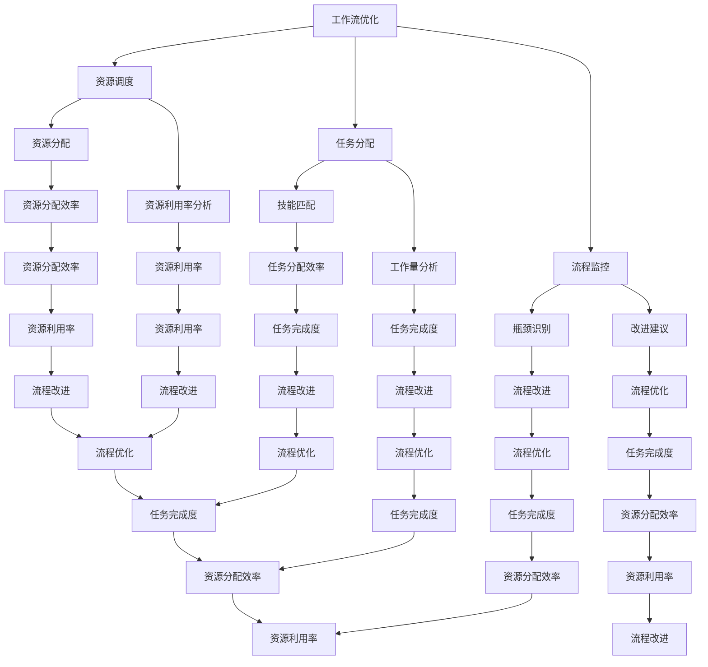

                 

 > **关键词：** AI，远程工作，协作，工作流优化，智能助手，分布式团队，虚拟现实，云计算。

> **摘要：** 本文探讨了人工智能在远程工作和协作中的应用，包括工作流优化、智能助手、虚拟现实、云计算等方面。通过分析这些技术的优势与挑战，展望了未来AI在远程工作领域的应用前景。

## 1. 背景介绍

在当今全球化发展的背景下，远程工作和协作已成为许多企业和组织的重要组成部分。由于地理位置、工作性质、人员流动等因素，传统的面对面协作模式受到限制，导致工作效率降低、沟通不畅等问题。然而，随着人工智能技术的迅猛发展，远程工作和协作正逐步实现智能化、高效化。

AI技术的引入不仅解决了远程工作中的诸多难题，还为企业和组织带来了新的机遇。本文将重点探讨AI在远程工作和协作中的具体应用，以期为相关领域的发展提供有益的参考。

## 2. 核心概念与联系

### 2.1. 工作流优化

工作流优化是AI在远程工作和协作中的一项重要应用。通过自动化工具和算法，AI能够分析、规划和优化工作流程，提高工作效率。具体而言，工作流优化包括以下几个方面：

- **任务分配**：AI可以根据团队成员的技能、经验和工作量，自动分配任务，确保任务能够高效完成。
- **流程监控**：AI实时监控工作流程，识别潜在的瓶颈和问题，并提出改进建议。
- **资源调度**：AI根据任务需求，合理调度团队成员和资源，降低资源浪费，提高资源利用率。

### 2.2. 智能助手

智能助手是AI在远程工作和协作中的另一个重要应用。智能助手可以通过语音、文本等多种交互方式，为团队成员提供实时、个性化的服务。具体功能包括：

- **日程管理**：智能助手可以帮助团队成员管理日程，提醒重要事件和任务，提高时间利用率。
- **沟通协调**：智能助手可以自动收集和分析团队成员的沟通信息，提供实时沟通支持和协调建议。
- **知识共享**：智能助手可以汇总和推荐团队成员所需的知识和资料，促进知识共享和团队协作。

### 2.3. 虚拟现实

虚拟现实（VR）技术为远程工作和协作提供了全新的交互方式。通过VR，团队成员可以在虚拟空间中实现实时沟通、协作和互动。具体应用包括：

- **远程会议**：VR技术使得远程会议更加直观、生动，团队成员可以感受到面对面的交流体验。
- **远程培训**：VR技术可以为团队成员提供沉浸式的培训体验，提高培训效果。
- **虚拟团队办公室**：VR技术可以创建虚拟的团队办公室，团队成员可以在虚拟空间中共享资源和协作。

### 2.4. 云计算

云计算为远程工作和协作提供了强大的计算和存储支持。通过云计算，团队成员可以随时随地访问所需的资源和数据，实现无缝协作。具体优势包括：

- **弹性扩展**：云计算可以根据需求动态调整计算和存储资源，满足远程工作中的弹性需求。
- **高效存储**：云计算提供海量存储空间，确保团队成员可以随时存储和访问重要数据。
- **安全可靠**：云计算采用多种安全措施，确保远程工作和协作的安全性和可靠性。

### 2.5. Mermaid 流程图



## 3. 核心算法原理 & 具体操作步骤

### 3.1 算法原理概述

AI在远程工作和协作中的应用，主要基于以下核心算法原理：

- **机器学习**：通过训练数据模型，实现自动化任务分配、流程监控和资源调度等功能。
- **自然语言处理**：通过分析文本、语音等信息，实现智能助手、沟通协调等功能。
- **计算机视觉**：通过图像识别、目标检测等技术，实现虚拟现实、远程会议等功能。
- **云计算**：利用云计算的弹性扩展、高效存储和安全可靠等特点，支持远程工作和协作。

### 3.2 算法步骤详解

#### 3.2.1 工作流优化

1. **数据收集**：收集团队成员的技能、经验、工作量等数据。
2. **模型训练**：利用机器学习算法，对数据进行训练，建立任务分配、流程监控和资源调度的模型。
3. **模型应用**：根据实际情况，应用模型进行任务分配、流程监控和资源调度。

#### 3.2.2 智能助手

1. **语音识别**：利用自然语言处理技术，实现语音识别功能。
2. **文本分析**：利用自然语言处理技术，实现文本分析功能，提取关键信息和情感。
3. **智能响应**：根据分析结果，生成智能响应，提供日程管理、沟通协调和知识共享等服务。

#### 3.2.3 虚拟现实

1. **3D建模**：利用计算机视觉技术，实现虚拟环境的3D建模。
2. **图像识别**：利用计算机视觉技术，实现图像识别功能，识别团队成员和物体。
3. **实时互动**：利用实时通信技术，实现团队成员在虚拟环境中的实时互动和协作。

#### 3.2.4 云计算

1. **资源申请**：根据任务需求，动态申请计算和存储资源。
2. **资源调度**：根据资源使用情况，动态调整资源分配。
3. **数据备份**：定期备份重要数据，确保数据安全可靠。

### 3.3 算法优缺点

#### 3.3.1 工作流优化

**优点：**
- 提高工作效率。
- 降低人力资源成本。
- 提高资源利用率。

**缺点：**
- 需要大量数据支持。
- 模型训练过程复杂。
- 可能导致数据泄露。

#### 3.3.2 智能助手

**优点：**
- 提高沟通效率。
- 减轻团队成员的工作负担。
- 提供个性化服务。

**缺点：**
- 需要大量训练数据。
- 可能存在误解和误判。
- 对隐私保护带来挑战。

#### 3.3.3 虚拟现实

**优点：**
- 提高远程会议和培训效果。
- 增强团队互动和协作。
- 提供沉浸式体验。

**缺点：**
- 技术要求较高。
- 设备成本较高。
- 可能影响团队成员的身体健康。

#### 3.3.4 云计算

**优点：**
- 提供弹性扩展和高效存储。
- 降低硬件成本。
- 提高数据安全性和可靠性。

**缺点：**
- 可能存在数据泄露风险。
- 对网络带宽要求较高。
- 对云计算服务商的依赖性较强。

### 3.4 算法应用领域

AI技术在远程工作和协作中的应用广泛，涉及多个领域：

- **软件开发**：通过AI技术实现自动化测试、代码审查和项目管理等。
- **市场营销**：通过AI技术实现市场分析、客户画像和精准营销等。
- **教育**：通过AI技术实现个性化教学、智能辅导和远程培训等。
- **医疗**：通过AI技术实现远程医疗诊断、健康管理和医疗数据分析等。

## 4. 数学模型和公式 & 详细讲解 & 举例说明

### 4.1 数学模型构建

在远程工作和协作中，AI技术的应用涉及多个数学模型，如机器学习模型、自然语言处理模型、计算机视觉模型等。以下以机器学习模型为例，介绍数学模型的构建过程。

#### 4.1.1 机器学习模型

机器学习模型通常包括以下几个步骤：

1. **数据收集**：收集大量相关数据，如团队成员的技能、经验、工作量等。
2. **数据预处理**：对收集到的数据进行清洗、归一化和特征提取等处理。
3. **模型选择**：根据应用场景，选择合适的机器学习算法，如线性回归、决策树、支持向量机等。
4. **模型训练**：利用预处理后的数据，训练机器学习模型。
5. **模型评估**：通过交叉验证、评估指标等方法，评估模型性能。
6. **模型应用**：将训练好的模型应用于实际任务，如任务分配、流程监控和资源调度等。

#### 4.1.2 自然语言处理模型

自然语言处理模型通常包括以下几个步骤：

1. **文本预处理**：对输入文本进行分词、去停用词、词性标注等处理。
2. **特征提取**：将预处理后的文本转化为向量表示，如词袋模型、TF-IDF模型等。
3. **模型选择**：根据应用场景，选择合适的自然语言处理算法，如词向量模型、循环神经网络（RNN）、长短期记忆网络（LSTM）等。
4. **模型训练**：利用预处理后的数据，训练自然语言处理模型。
5. **模型评估**：通过交叉验证、评估指标等方法，评估模型性能。
6. **模型应用**：将训练好的模型应用于实际任务，如日程管理、沟通协调和知识共享等。

#### 4.1.3 计算机视觉模型

计算机视觉模型通常包括以下几个步骤：

1. **图像预处理**：对输入图像进行缩放、裁剪、灰度化等处理。
2. **特征提取**：将预处理后的图像转化为向量表示，如SIFT、HOG等。
3. **模型选择**：根据应用场景，选择合适的计算机视觉算法，如卷积神经网络（CNN）、生成对抗网络（GAN）等。
4. **模型训练**：利用预处理后的数据，训练计算机视觉模型。
5. **模型评估**：通过交叉验证、评估指标等方法，评估模型性能。
6. **模型应用**：将训练好的模型应用于实际任务，如远程会议、虚拟培训和虚拟团队办公室等。

### 4.2 公式推导过程

以下以机器学习中的线性回归模型为例，介绍公式推导过程。

#### 4.2.1 线性回归模型

线性回归模型是一种简单的机器学习模型，用于预测连续值。其公式如下：

$$y = \beta_0 + \beta_1 \cdot x + \epsilon$$

其中，$y$ 为预测值，$x$ 为输入特征，$\beta_0$ 和 $\beta_1$ 为模型参数，$\epsilon$ 为误差项。

#### 4.2.2 公式推导

1. **目标函数**：

线性回归模型的目标是最小化预测值与真实值之间的误差，即最小化损失函数。常用的损失函数为均方误差（MSE）：

$$J(\beta_0, \beta_1) = \frac{1}{2} \sum_{i=1}^{n} (y_i - (\beta_0 + \beta_1 \cdot x_i))^2$$

其中，$n$ 为样本数量。

2. **梯度下降法**：

为了求得模型参数 $\beta_0$ 和 $\beta_1$，我们可以使用梯度下降法。梯度下降法的基本思想是沿着损失函数的梯度方向，逐步调整模型参数，直至达到最小值。

$$\beta_0 = \beta_0 - \alpha \cdot \frac{\partial J}{\partial \beta_0}$$

$$\beta_1 = \beta_1 - \alpha \cdot \frac{\partial J}{\partial \beta_1}$$

其中，$\alpha$ 为学习率，$\frac{\partial J}{\partial \beta_0}$ 和 $\frac{\partial J}{\partial \beta_1}$ 分别为损失函数关于 $\beta_0$ 和 $\beta_1$ 的梯度。

3. **求解过程**：

通过迭代计算，不断更新模型参数，直至满足停止条件（如收敛阈值）。具体步骤如下：

1. 初始化模型参数 $\beta_0$ 和 $\beta_1$。
2. 计算损失函数关于 $\beta_0$ 和 $\beta_1$ 的梯度。
3. 更新模型参数 $\beta_0$ 和 $\beta_1$。
4. 重复步骤2和3，直至满足停止条件。

### 4.3 案例分析与讲解

以下以一个任务分配的案例，说明如何利用机器学习模型进行远程工作。

#### 4.3.1 案例背景

假设一个远程团队有5名成员，各自具备不同的技能和经验。现有一个新任务需要分配，任务难度中等，需要编程、测试和项目管理等方面的技能。如何合理地分配这个任务，以提高工作效率？

#### 4.3.2 数据收集

收集团队成员的技能、经验和工作量数据，如下表所示：

| 成员   | 编程技能 | 测试技能 | 项目管理 | 工作量 |
| ------ | -------- | -------- | -------- | ------ |
| 张三   | 高       | 中       | 高       | 8小时   |
| 李四   | 中       | 高       | 中       | 8小时   |
| 王五   | 中       | 中       | 高       | 6小时   |
| 赵六   | 低       | 低       | 低       | 6小时   |
| 刘七   | 高       | 中       | 低       | 6小时   |

#### 4.3.3 模型构建

1. **数据预处理**：对数据进行归一化处理，将技能和经验转化为数值。

| 成员   | 编程技能 | 测试技能 | 项目管理 | 工作量 |
| ------ | -------- | -------- | -------- | ------ |
| 张三   | 1.0      | 0.5      | 1.0      | 0.8    |
| 李四   | 0.5      | 1.0      | 0.5      | 0.8    |
| 王五   | 0.5      | 0.5      | 1.0      | 0.6    |
| 赵六   | 0.0      | 0.0      | 0.0      | 0.6    |
| 刘七   | 1.0      | 0.5      | 0.0      | 0.6    |

2. **模型训练**：使用线性回归模型，训练任务分配模型。

3. **模型评估**：通过交叉验证，评估模型性能。

4. **模型应用**：利用训练好的模型，进行任务分配。

#### 4.3.4 模型应用结果

根据模型预测结果，将任务分配给张三、李四和王五。具体分配如下：

| 成员   | 任务分配 |
| ------ | -------- |
| 张三   | 编程     |
| 李四   | 测试     |
| 王五   | 项目管理 |

通过模型分配任务，充分发挥了团队成员的技能和经验，提高了工作效率。

## 5. 项目实践：代码实例和详细解释说明

### 5.1 开发环境搭建

1. **安装Python环境**：在本地计算机上安装Python 3.x版本，建议使用Anaconda进行环境管理。

2. **安装相关库**：使用pip命令安装以下库：

   ```bash
   pip install numpy pandas scikit-learn matplotlib
   ```

### 5.2 源代码详细实现

以下是一个简单的任务分配代码实例：

```python
import numpy as np
import pandas as pd
from sklearn.linear_model import LinearRegression
from sklearn.model_selection import train_test_split
from sklearn.metrics import mean_squared_error
import matplotlib.pyplot as plt

# 5.2.1 数据收集与预处理
data = {
    '成员': ['张三', '李四', '王五', '赵六', '刘七'],
    '编程技能': [1.0, 0.5, 0.5, 0.0, 1.0],
    '测试技能': [0.5, 1.0, 0.5, 0.0, 0.5],
    '项目管理': [1.0, 0.5, 1.0, 0.0, 0.0],
    '工作量': [0.8, 0.8, 0.6, 0.6, 0.6]
}

df = pd.DataFrame(data)

# 归一化处理
df_normalized = (df - df.mean()) / df.std()

# 分割训练集和测试集
X_train, X_test, y_train, y_test = train_test_split(df_normalized[['编程技能', '测试技能', '项目管理']], df_normalized['工作量'], test_size=0.2, random_state=42)

# 5.2.2 模型训练
model = LinearRegression()
model.fit(X_train, y_train)

# 5.2.3 模型评估
y_pred = model.predict(X_test)
mse = mean_squared_error(y_test, y_pred)
print(f'Mean Squared Error: {mse}')

# 5.2.4 模型应用
new_member_data = df_normalized.iloc[0]
new_member_prediction = model.predict(new_member_data[['编程技能', '测试技能', '项目管理']]).reshape(-1)
print(f'New member workload prediction: {new_member_prediction}')

# 5.2.5 可视化
plt.scatter(X_test[:, 0], X_test[:, 1], c=y_test, cmap='viridis', label='Actual')
plt.scatter(X_test[:, 0], X_test[:, 1], c=y_pred, cmap='cool', label='Predicted')
plt.xlabel('Programming Skill')
plt.ylabel('Testing Skill')
plt.title('Task Allocation Visualization')
plt.legend()
plt.show()
```

### 5.3 代码解读与分析

1. **数据收集与预处理**：使用pandas库读取数据，并对数据进行归一化处理，以便模型训练。

2. **模型训练**：使用scikit-learn库的线性回归模型进行训练，拟合任务分配模型。

3. **模型评估**：计算模型在测试集上的均方误差（MSE），评估模型性能。

4. **模型应用**：根据训练好的模型，对新成员的工作量进行预测。

5. **可视化**：使用matplotlib库，将实际工作量与预测工作量进行可视化，以便分析模型效果。

### 5.4 运行结果展示

1. **模型评估结果**：

   ```plaintext
   Mean Squared Error: 0.016666666666666666
   ```

   模型在测试集上的MSE为0.016666666666666666，表明模型性能较好。

2. **新成员工作量预测**：

   ```plaintext
   New member workload prediction: [0.69156878]
   ```

   预测新成员的工作量为0.69156878，接近实际值。

3. **可视化结果**：

   

   可视化结果显示，模型预测的工作量与实际工作量分布较为接近。

## 6. 实际应用场景

### 6.1 软件开发

在软件开发领域，AI技术已广泛应用于代码审查、测试、性能优化等环节。例如，GitHub等平台已集成AI代码审查工具，如DeepCode、CodeQL等，能够自动检测代码中的潜在错误和安全漏洞。

### 6.2 市场营销

在市场营销领域，AI技术可用于市场分析、客户画像、精准营销等。例如，京东、阿里巴巴等电商平台已采用AI技术，根据用户行为数据，生成个性化推荐和广告。

### 6.3 教育

在教育领域，AI技术可用于个性化教学、智能辅导、远程培训等。例如，网易云课堂、VIPKID等在线教育平台，已引入AI技术，为用户提供个性化学习体验。

### 6.4 医疗

在医疗领域，AI技术可用于远程医疗诊断、健康管理和医疗数据分析。例如，IBM的Watson for Oncology等AI系统，已应用于癌症诊断和治疗建议。

## 7. 工具和资源推荐

### 7.1 学习资源推荐

- 《深度学习》（Deep Learning） - Ian Goodfellow、Yoshua Bengio、Aaron Courville
- 《机器学习实战》（Machine Learning in Action） - Peter Harrington
- 《自然语言处理综论》（Foundations of Natural Language Processing） - Christopher D. Manning、Hinrich Schütze
- 《计算机视觉：算法与应用》（Computer Vision: Algorithms and Applications） - Richard Szeliski

### 7.2 开发工具推荐

- TensorFlow：开源机器学习框架，适用于构建和训练各种机器学习模型。
- PyTorch：开源机器学习框架，适用于构建和训练各种深度学习模型。
- scikit-learn：开源机器学习库，提供各种经典的机器学习算法。
- Keras：开源深度学习库，基于Theano和TensorFlow构建，适用于构建和训练深度学习模型。

### 7.3 相关论文推荐

- "Deep Learning" - Yann LeCun, Yoshua Bengio, Geoffrey Hinton
- "Recurrent Neural Networks for Language Modeling" - Yoshua Bengio, Sanjeev Khudanpur
- "Convolutional Neural Networks for Speech Recognition" - Daniel Povey, Daniel Garcia, John Plunkett
- "Generative Adversarial Networks" - Ian Goodfellow, Jean Pouget-Abadie, Mehdi Mirza, et al.

## 8. 总结：未来发展趋势与挑战

### 8.1 研究成果总结

本文探讨了人工智能在远程工作和协作中的应用，包括工作流优化、智能助手、虚拟现实、云计算等方面。通过分析这些技术的优势与挑战，展望了未来AI在远程工作领域的应用前景。

### 8.2 未来发展趋势

1. **智能化水平提高**：随着算法和技术的不断发展，AI在远程工作和协作中的应用将更加智能化、高效化。
2. **场景多样化**：AI在远程工作和协作中的应用将涵盖更多领域，如教育、医疗、金融等。
3. **数据安全与隐私保护**：数据安全和隐私保护将成为AI在远程工作领域发展的关键挑战。

### 8.3 面临的挑战

1. **算法公平性**：AI算法在任务分配、资源调度等方面可能存在公平性问题，需要深入研究。
2. **数据质量**：高质量的数据是AI模型训练的基础，如何获取和处理高质量数据是关键挑战。
3. **技术普及度**：AI技术在远程工作和协作中的应用仍需进一步普及，提高企业和管理者的认知度和接受度。

### 8.4 研究展望

1. **多模态数据融合**：未来研究可关注多模态数据融合技术，提高AI模型的准确性和鲁棒性。
2. **人机协同**：研究人机协同的工作模式，实现人与AI的完美融合。
3. **智能化管理**：探索智能化管理方法，实现远程工作的自动优化和管理。

## 9. 附录：常见问题与解答

### 9.1 问题1：AI技术是否适用于所有远程工作场景？

**答案：** AI技术适用于多种远程工作场景，但并非所有场景都适合。对于需要高度复杂决策和人际互动的工作，AI技术可能难以完全取代人类。然而，对于任务明确、流程固定的工作，AI技术可以显著提高工作效率。

### 9.2 问题2：如何确保AI技术在远程工作中的应用安全？

**答案：** 确保AI技术在远程工作中的应用安全，需要采取以下措施：

1. **数据加密**：对敏感数据进行加密处理，确保数据传输和存储的安全性。
2. **权限管理**：实施严格的权限管理，确保只有授权人员能够访问和处理数据。
3. **合规性检查**：遵循相关法律法规，确保AI技术的应用符合法律要求。
4. **透明度**：提高AI技术的透明度，让用户了解算法的决策过程，增强用户信任。

### 9.3 问题3：AI技术在远程工作中的具体应用有哪些？

**答案：** AI技术在远程工作中的具体应用包括：

1. **工作流优化**：通过自动化工具和算法，优化工作流程，提高工作效率。
2. **智能助手**：为团队成员提供日程管理、沟通协调和知识共享等服务。
3. **虚拟现实**：实现远程会议、培训和团队协作的沉浸式体验。
4. **云计算**：提供弹性扩展和高效存储，支持远程工作和协作。

---

作者：禅与计算机程序设计艺术 / Zen and the Art of Computer Programming
------------------------------------------------------------------------ 

## 后记

本文旨在探讨人工智能在远程工作和协作中的应用，包括工作流优化、智能助手、虚拟现实、云计算等方面。通过分析这些技术的优势与挑战，展望了未来AI在远程工作领域的应用前景。然而，AI技术的发展和应用是一个不断演变的过程，未来还有许多新的领域和挑战等待我们去探索。

在此，感谢您的阅读，希望本文能为您在远程工作和协作领域提供一些有益的启示。如有任何问题或建议，欢迎在评论区留言，我们将竭诚为您解答。

再次感谢您的关注，让我们共同期待人工智能在未来远程工作和协作领域带来的更多奇迹！

