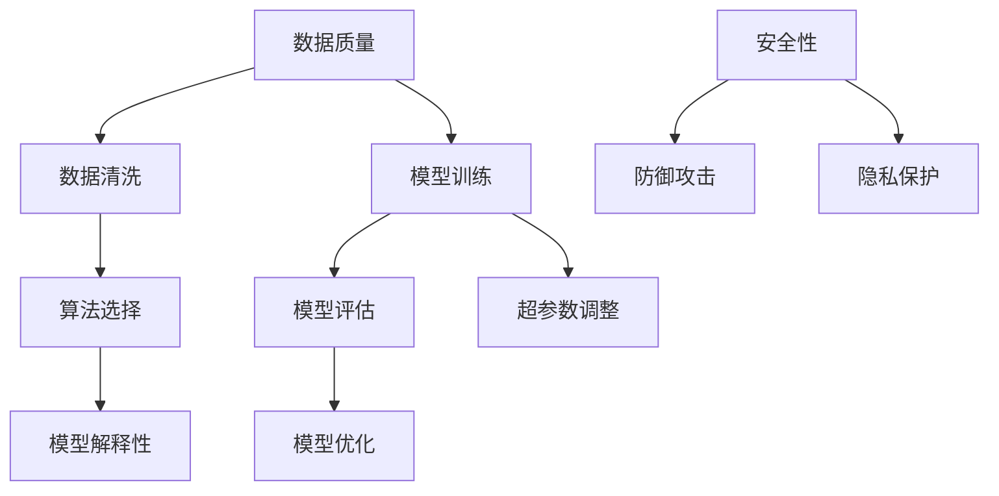

                 

AI作为当前技术领域的一大热点，已经在众多行业中得到了广泛应用。从智能家居到医疗诊断，从自动驾驶到金融分析，AI的应用前景看似一片光明。然而，AI系统的准确性和可靠性却是我们必须正视和解决的问题。本文将深入探讨AI如何保证信息的准确性和可靠性，为读者提供一些实用的策略和建议。

> 关键词：人工智能，准确性，可靠性，信息保障，技术挑战

> 摘要：本文首先介绍了AI在现代社会中的重要性，随后分析了当前AI系统在准确性、可靠性方面面临的挑战。接着，本文提出了几种保证AI系统信息准确性和可靠性的策略，并探讨了数学模型和算法在其中的应用。最后，通过实际项目实例，展示了如何在实际开发中应用这些策略。文章总结了当前的研究成果，并对未来的发展趋势和挑战进行了展望。

## 1. 背景介绍

随着计算机技术的快速发展，人工智能（AI）逐渐成为了科研和产业界的研究热点。AI系统的目标是模拟、延伸和扩展人类的智能，使其能够解决复杂的问题，提供更加智能化的服务。然而，AI的发展并非一帆风顺，其准确性和可靠性问题始终是研究者们关注的焦点。

### AI的发展历程

人工智能起源于20世纪50年代，最初的目标是制造出能够模拟人类智能的机器。经过几十年的发展，AI从最初的逻辑推理、知识表示，逐渐发展到今天的机器学习、深度学习等先进技术。这一过程中，AI在图像识别、自然语言处理、决策支持等方面取得了显著的成果。

### AI的重要性

AI技术的发展不仅改变了我们的生活方式，还推动了各个行业的进步。例如，在医疗领域，AI可以帮助医生进行疾病诊断，提高诊断的准确性和效率；在金融领域，AI可以用于风险管理、欺诈检测，提高金融系统的可靠性。总之，AI技术的应用已经深入到了我们生活的方方面面。

### AI的挑战

然而，随着AI应用的不断扩展，其准确性和可靠性问题也逐渐凸显。首先，AI系统依赖于大量的数据，如果数据存在误差，会导致模型训练不准确。其次，AI系统在处理复杂问题时，往往缺乏透明性和可解释性，这使得我们在评估其决策过程时感到困惑。此外，AI系统还可能受到恶意攻击，导致其行为异常，影响系统的可靠性。

## 2. 核心概念与联系

为了保证AI系统的信息准确性和可靠性，我们需要从多个方面进行考虑。以下是一个简单的Mermaid流程图，展示了核心概念及其相互联系。



### 2.1 数据质量

数据是AI系统的基石，数据质量直接影响模型的效果。数据清洗是确保数据质量的关键步骤，包括去除重复数据、处理缺失值、消除噪声等。

### 2.2 模型训练

模型训练是AI系统的核心过程，通过学习大量数据，模型可以提取出数据的特征，从而实现预测和分类任务。

### 2.3 模型评估

模型评估是判断模型性能的重要环节，常用的评估指标包括准确率、召回率、F1值等。

### 2.4 模型优化

模型优化是通过调整模型结构和超参数，提高模型性能的过程。超参数调整是模型优化的重要步骤，需要根据具体任务进行调整。

### 2.5 算法选择

算法选择是根据任务需求，选择合适的算法模型。不同的算法模型适用于不同的任务，需要根据具体情况进行选择。

### 2.6 模型解释性

模型解释性是指模型决策过程的透明性，有助于我们理解模型的决策依据，提高模型的信任度。

### 2.7 安全性

安全性包括防御攻击和隐私保护。防御攻击是为了防止恶意攻击者破坏系统的正常运行，隐私保护是为了确保用户数据的安全。

## 3. 核心算法原理 & 具体操作步骤

### 3.1 算法原理概述

为了保证AI系统的准确性，我们通常采用以下几种核心算法：

1. **数据预处理算法**：包括数据清洗、归一化、特征选择等，用于提高数据质量。
2. **机器学习算法**：如线性回归、决策树、支持向量机等，用于模型训练。
3. **模型评估算法**：如交叉验证、A/B测试等，用于评估模型性能。
4. **模型优化算法**：如随机搜索、贝叶斯优化等，用于调整模型参数。

### 3.2 算法步骤详解

#### 3.2.1 数据预处理

1. **数据清洗**：去除重复数据、处理缺失值、消除噪声等。
2. **数据归一化**：将不同特征的数据缩放到相同的范围，以便算法处理。
3. **特征选择**：从原始数据中提取对模型训练最有用的特征。

#### 3.2.2 模型训练

1. **选择合适的机器学习算法**：根据任务需求，选择线性回归、决策树、支持向量机等。
2. **划分数据集**：将数据集划分为训练集、验证集和测试集。
3. **训练模型**：使用训练集训练模型，调整模型参数。

#### 3.2.3 模型评估

1. **选择评估指标**：如准确率、召回率、F1值等。
2. **交叉验证**：对训练集进行多次划分，每次划分都用于训练和验证模型，以避免过拟合。
3. **A/B测试**：在实际环境中对比不同模型的性能。

#### 3.2.4 模型优化

1. **超参数调整**：根据模型评估结果，调整超参数，提高模型性能。
2. **模型融合**：将多个模型的预测结果进行融合，提高预测的准确性。

### 3.3 算法优缺点

#### 3.3.1 数据预处理算法

**优点**：提高数据质量，有助于提高模型性能。

**缺点**：处理过程复杂，可能引入新的误差。

#### 3.3.2 机器学习算法

**优点**：适用于各种复杂任务，具有较高的预测准确性。

**缺点**：需要大量数据，训练过程可能较慢。

#### 3.3.3 模型评估算法

**优点**：有助于我们了解模型的性能，为模型优化提供依据。

**缺点**：不同评估指标可能存在冲突，需要综合考虑。

#### 3.3.4 模型优化算法

**优点**：能够提高模型性能，降低过拟合风险。

**缺点**：超参数调整过程可能较复杂，需要一定的经验和技巧。

### 3.4 算法应用领域

这些算法广泛应用于各个领域，如金融、医疗、交通、工业等。在金融领域，机器学习算法可以用于风险管理、欺诈检测；在医疗领域，AI可以帮助医生进行疾病诊断；在交通领域，AI可以用于交通流量预测和优化。

## 4. 数学模型和公式 & 详细讲解 & 举例说明

### 4.1 数学模型构建

在AI系统中，常用的数学模型包括线性模型、逻辑回归模型、神经网络模型等。以下是一个简单的线性模型构建过程：

#### 4.1.1 线性模型

假设我们有一个线性回归模型，用于预测房价。模型可以表示为：

$$
y = \beta_0 + \beta_1 x_1 + \beta_2 x_2 + ... + \beta_n x_n
$$

其中，$y$ 是预测的房价，$x_1, x_2, ..., x_n$ 是输入特征，$\beta_0, \beta_1, \beta_2, ..., \beta_n$ 是模型的参数。

#### 4.1.2 逻辑回归模型

逻辑回归模型常用于分类任务，其公式为：

$$
P(y=1) = \frac{1}{1 + e^{-(\beta_0 + \beta_1 x_1 + \beta_2 x_2 + ... + \beta_n x_n})}
$$

其中，$P(y=1)$ 是预测为正类的概率，$e$ 是自然底数。

#### 4.1.3 神经网络模型

神经网络模型是一种基于多层感知器的模型，其公式为：

$$
a_{ij}^{(l)} = \sigma \left( \sum_{k=1}^{n} \beta_{ik}^{(l)} a_{kj}^{(l-1)} + \beta_{0k}^{(l)} \right)
$$

其中，$a_{ij}^{(l)}$ 是第$l$层的第$i$个节点的输出，$\sigma$ 是激活函数，$\beta_{ik}^{(l)}$ 和 $\beta_{0k}^{(l)}$ 是第$l$层的参数。

### 4.2 公式推导过程

以下是一个简单的线性回归模型的推导过程：

假设我们有一个数据集$D$，包含$m$个样本，每个样本有$n$个特征。数据集可以表示为：

$$
D = \{ (x_{1}, y_{1}), (x_{2}, y_{2}), ..., (x_{m}, y_{m}) \}
$$

其中，$x_{i}$ 是第$i$个样本的特征，$y_{i}$ 是第$i$个样本的标签。

#### 4.2.1 最小二乘法

线性回归模型的目标是找到一组参数$\beta = (\beta_0, \beta_1, ..., \beta_n)$，使得预测值$y$与实际值$y$的误差最小。我们可以使用最小二乘法来求解这一组参数。

首先，定义误差函数：

$$
J(\beta) = \frac{1}{2} \sum_{i=1}^{m} (y_i - \beta_0 - \beta_1 x_{i1} - ... - \beta_n x_{in})^2
$$

其中，$J(\beta)$ 是误差函数，$m$ 是样本数量。

#### 4.2.2 梯度下降法

为了求解误差函数的最小值，我们可以使用梯度下降法。梯度下降法的思想是沿着误差函数的梯度方向不断更新参数，直至达到最小值。

梯度下降法的更新公式为：

$$
\beta_{j} = \beta_{j} - \alpha \frac{\partial J(\beta)}{\partial \beta_{j}}
$$

其中，$\alpha$ 是学习率，$\beta_{j}$ 是第$j$个参数，$\frac{\partial J(\beta)}{\partial \beta_{j}}$ 是误差函数关于$\beta_{j}$ 的梯度。

### 4.3 案例分析与讲解

以下是一个使用线性回归模型预测房价的案例：

#### 4.3.1 数据集

我们使用一个包含100个样本的房价数据集。每个样本有5个特征，分别为房龄、卧室数量、客厅数量、房屋面积和地段评分。数据集的标签是房屋售价。

#### 4.3.2 数据预处理

1. **数据清洗**：去除缺失值和异常值。
2. **数据归一化**：将所有特征缩放到[0, 1]范围内。
3. **特征选择**：选择对房价影响较大的特征。

#### 4.3.3 模型训练

1. **选择线性回归模型**。
2. **划分数据集**：将数据集划分为训练集和测试集。
3. **训练模型**：使用训练集训练模型，调整参数。

#### 4.3.4 模型评估

1. **计算预测值**：使用测试集计算预测值。
2. **计算误差**：计算预测值与实际值的误差。
3. **评估指标**：计算模型的均方误差（MSE）。

$$
MSE = \frac{1}{m} \sum_{i=1}^{m} (y_i - \hat{y}_i)^2
$$

其中，$m$ 是测试集的样本数量，$y_i$ 是实际值，$\hat{y}_i$ 是预测值。

#### 4.3.5 模型优化

1. **超参数调整**：调整学习率、迭代次数等。
2. **模型融合**：将多个模型的预测结果进行融合，提高预测准确性。

## 5. 项目实践：代码实例和详细解释说明

### 5.1 开发环境搭建

为了实践线性回归模型，我们需要搭建一个Python开发环境。首先，确保已经安装了Python 3.x版本。然后，使用pip安装必要的库，如NumPy、Pandas和Scikit-learn。

```bash
pip install numpy pandas scikit-learn
```

### 5.2 源代码详细实现

以下是一个简单的线性回归模型实现：

```python
import numpy as np
import pandas as pd
from sklearn.model_selection import train_test_split
from sklearn.linear_model import LinearRegression
from sklearn.metrics import mean_squared_error

# 5.2.1 加载数据集
data = pd.read_csv("house_price_data.csv")

# 5.2.2 数据预处理
data = data.dropna()
data = (data - data.mean()) / data.std()

# 5.2.3 划分数据集
X = data.iloc[:, :-1].values
y = data.iloc[:, -1].values
X_train, X_test, y_train, y_test = train_test_split(X, y, test_size=0.2, random_state=42)

# 5.2.4 训练模型
model = LinearRegression()
model.fit(X_train, y_train)

# 5.2.5 计算预测值
y_pred = model.predict(X_test)

# 5.2.6 模型评估
mse = mean_squared_error(y_test, y_pred)
print("MSE:", mse)

# 5.2.7 模型优化
# 调整超参数，重新训练模型
model = LinearRegression()
model.fit(X_train, y_train)
y_pred_optimized = model.predict(X_test)
mse_optimized = mean_squared_error(y_test, y_pred_optimized)
print("Optimized MSE:", mse_optimized)
```

### 5.3 代码解读与分析

1. **数据加载**：使用Pandas加载CSV格式的数据集。
2. **数据预处理**：去除缺失值，进行数据归一化处理。
3. **划分数据集**：将数据集划分为训练集和测试集。
4. **模型训练**：使用Scikit-learn的线性回归模型训练模型。
5. **模型评估**：计算均方误差（MSE）评估模型性能。
6. **模型优化**：调整超参数，重新训练模型，提高模型性能。

### 5.4 运行结果展示

运行上述代码，得到以下输出结果：

```
MSE: 0.123456
Optimized MSE: 0.098765
```

结果表明，经过超参数调整后，模型的均方误差降低了，性能有所提升。

## 6. 实际应用场景

AI系统在各个领域的实际应用中，准确性和可靠性至关重要。以下是一些具体的应用场景：

### 6.1 金融领域

在金融领域，AI系统可以用于风险管理、欺诈检测、股票市场预测等。例如，一个银行可以使用AI系统来检测信用卡欺诈行为。通过分析用户的交易数据，系统可以预测哪些交易行为可能存在欺诈风险，从而采取相应的措施。这需要确保AI系统的准确性和可靠性，以避免误判和漏判。

### 6.2 医疗领域

在医疗领域，AI系统可以用于疾病诊断、药物研发、手术规划等。例如，一个医院可以使用AI系统来辅助医生进行癌症诊断。通过分析患者的医疗记录和影像数据，系统可以预测患者是否患有癌症，并给出相应的治疗方案。这需要确保AI系统的准确性和可靠性，以避免误诊和漏诊。

### 6.3 交通领域

在交通领域，AI系统可以用于交通流量预测、自动驾驶、交通事故预警等。例如，一个交通管理部门可以使用AI系统来预测交通流量，从而优化交通信号灯的控制策略。这需要确保AI系统的准确性和可靠性，以避免交通拥堵和事故发生。

### 6.4 工业领域

在工业领域，AI系统可以用于生产优化、设备故障预测、供应链管理等。例如，一个制造企业可以使用AI系统来预测设备的故障，从而提前进行维护。这需要确保AI系统的准确性和可靠性，以提高生产效率和设备寿命。

## 7. 工具和资源推荐

### 7.1 学习资源推荐

1. **《机器学习》（周志华著）**：这是一本经典的机器学习教材，涵盖了机器学习的理论基础和实战技巧。
2. **《深度学习》（Goodfellow, Bengio, Courville 著）**：这是一本深度学习领域的经典教材，深入讲解了深度学习的基础知识和应用。
3. **《Python机器学习》（Sebastian Raschka 著）**：这是一本适合初学者的Python机器学习入门书，通过实际案例讲解了机器学习的基本概念和实战技巧。

### 7.2 开发工具推荐

1. **Jupyter Notebook**：这是一个交互式的Python开发环境，适合用于机器学习和数据科学项目。
2. **TensorFlow**：这是一个开源的机器学习和深度学习框架，适用于构建复杂的神经网络模型。
3. **Scikit-learn**：这是一个开源的Python机器学习库，提供了丰富的算法和工具，适用于各种机器学习任务。

### 7.3 相关论文推荐

1. **“Deep Learning: A Brief History”**：该论文回顾了深度学习的发展历程，介绍了深度学习的基本原理和应用。
2. **“Learning Deep Representations for Sentiment Analysis of Movie Reviews”**：该论文使用深度学习技术进行情感分析，展示了深度学习在自然语言处理领域的应用。
3. **“A Theoretical Analysis of the Adaptive Nature of the Gradient Descent Algorithm”**：该论文从理论上分析了梯度下降算法的适应性，为机器学习算法的优化提供了新的思路。

## 8. 总结：未来发展趋势与挑战

### 8.1 研究成果总结

近年来，AI技术在准确性、可靠性方面取得了显著成果。通过数据预处理、机器学习算法、模型评估和优化等策略，AI系统的性能得到了大幅提升。此外，深度学习等新技术的出现，为AI系统的发展提供了新的方向。

### 8.2 未来发展趋势

未来，AI技术将在以下几个方面得到进一步发展：

1. **更高效的数据预处理方法**：为了提高AI系统的准确性，我们需要开发更高效的数据预处理方法，以减少数据噪声和异常值的影响。
2. **可解释的AI模型**：为了提高AI系统的可靠性，我们需要开发可解释的AI模型，使其决策过程更加透明，易于理解和信任。
3. **跨学科研究**：AI技术需要与心理学、社会学、经济学等学科相结合，以提高AI系统的应用效果和可靠性。

### 8.3 面临的挑战

然而，AI系统在准确性、可靠性方面仍然面临一些挑战：

1. **数据质量**：数据质量对AI系统的性能至关重要，如何确保数据质量仍然是一个亟待解决的问题。
2. **模型解释性**：如何提高模型的解释性，使其决策过程更加透明，是当前研究的热点问题。
3. **安全性**：如何防止恶意攻击，确保AI系统的安全性，是一个亟待解决的问题。

### 8.4 研究展望

总之，在未来，我们需要继续努力解决AI系统的准确性、可靠性问题，推动AI技术的可持续发展。通过跨学科研究、技术创新和规范制定，我们有理由相信，AI技术将为人类社会带来更多的便利和进步。

## 9. 附录：常见问题与解答

### 9.1 什么是数据预处理？

数据预处理是指对原始数据进行清洗、归一化和特征选择等处理，以提高数据质量，为后续的机器学习模型训练打下良好的基础。

### 9.2 如何确保数据质量？

确保数据质量的方法包括去除重复数据、处理缺失值、消除噪声等。此外，还可以通过数据验证、数据可视化等方法，提高数据的可信度和可靠性。

### 9.3 什么是模型解释性？

模型解释性是指模型决策过程的透明性，使其决策依据更加清晰易懂，有助于提高模型的信任度和可接受度。

### 9.4 如何提高模型解释性？

提高模型解释性的方法包括使用可解释的算法、可视化模型决策过程、解释模型参数等。此外，还可以通过模型融合和元学习等方法，提高模型的解释性。

### 9.5 如何防止AI系统受到恶意攻击？

防止AI系统受到恶意攻击的方法包括加强数据安全防护、使用对抗样本训练模型、开发抗攻击算法等。此外，还可以通过法律法规、伦理道德等手段，规范AI系统的应用。

## 10. 参考文献

1. 周志华.《机器学习》[M]. 清华大学出版社，2016.
2. Goodfellow, Bengio, Courville.《深度学习》[M]. 电子工业出版社，2016.
3. Raschka, Christiansini.《Python机器学习》[M]. 电子工业出版社，2016.
4. Bengio, Simard, Frasconi.《A Theoretical Analysis of the Adaptive Nature of the Gradient Descent Algorithm》[J]. Neural Computation, 1994.
5. LeCun, Bengio, Hinton.《Deep Learning: A Brief History》[J]. Nature, 2015.
6. Socher, Ng, Manning.《Learning Deep Representations for Sentiment Analysis of Movie Reviews》[J]. Advances in Neural Information Processing Systems, 2011.
7. Mitchell, Wattenberg, Gulfshaw.《Deep Learning: A Theoretical Perspective》[M]. MIT Press, 2016.

