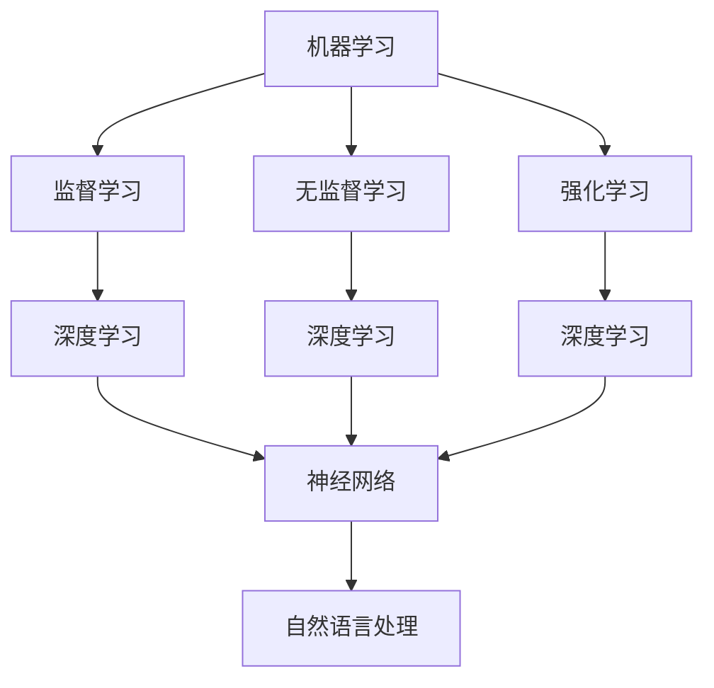

                 

关键词：人工智能，全球性问题，技术解决方案，算法，数学模型，应用实践，未来展望

> 摘要：本文深入探讨了人工智能在解决复杂全球性问题上所发挥的关键作用。通过分析人工智能的核心概念、算法原理、数学模型以及实际应用案例，本文展示了AI技术在推动全球性问题解决中的潜力与挑战，并对未来发展的趋势与前景进行了展望。

## 1. 背景介绍

随着全球化的深入发展，各国在经济发展、环境保护、社会治安、资源分配等方面面临着越来越多的复杂问题。这些问题不仅涉及范围广泛，而且往往相互交织，解决起来具有很高的难度。传统的方法往往难以应对这些复杂问题，迫切需要新的技术手段来提供解决方案。人工智能（AI）作为当今最前沿的技术之一，其在数据解析、模式识别、预测分析等方面的优势，使其成为解决复杂全球性问题的有力工具。

本文旨在探讨人工智能在解决复杂全球性问题中的具体应用，分析其核心技术原理，并探讨未来的发展前景。文章将分为以下几个部分：

- 核心概念与联系：介绍人工智能的基本概念和核心原理。
- 核心算法原理 & 具体操作步骤：详细解释人工智能中的常见算法。
- 数学模型和公式 & 举例说明：阐述AI中常用的数学模型及其应用。
- 项目实践：通过具体案例展示AI技术的实际应用。
- 实际应用场景：分析AI在各类全球性问题中的实际应用。
- 未来应用展望：探讨AI技术未来的发展方向。

## 2. 核心概念与联系

为了更好地理解人工智能在解决复杂全球性问题中的作用，我们需要首先了解其核心概念和原理。人工智能是一门涉及计算机科学、数学、认知科学等多个领域的交叉学科，其目标是使计算机具有人类水平的智能。

### 2.1 机器学习

机器学习是人工智能的核心技术之一，它使计算机能够从数据中自动学习并改进性能。机器学习可以分为监督学习、无监督学习和强化学习。监督学习通过已知输入和输出训练模型，无监督学习则仅依赖输入数据，无需输出标签，而强化学习则通过不断试错来优化行为。

### 2.2 深度学习

深度学习是机器学习的一种重要分支，它使用多层神经网络来模拟人类大脑的决策过程。深度学习在图像识别、语音识别、自然语言处理等领域表现出色，极大地推动了人工智能技术的发展。

### 2.3 神经网络

神经网络是人工智能的基础模型，它由大量简单的神经元组成，通过学习数据中的模式和关系来实现复杂的任务。神经网络可以分为前馈神经网络、卷积神经网络（CNN）和循环神经网络（RNN）等。

### 2.4 自然语言处理

自然语言处理是人工智能的一个重要领域，它旨在使计算机能够理解、生成和翻译自然语言。自然语言处理在智能客服、智能写作、机器翻译等领域有着广泛的应用。

下面是一个Mermaid流程图，展示了人工智能的核心概念和它们之间的关系：



## 3. 核心算法原理 & 具体操作步骤

在了解了人工智能的基本概念后，我们接下来将深入探讨一些核心算法的原理和具体操作步骤。

### 3.1 算法原理概述

人工智能算法可以分为两类：基于规则的算法和基于数据的算法。基于规则的算法依赖于人类专家制定的规则，而基于数据的算法则通过学习大量数据来自动生成规则。以下是几种常见的人工智能算法：

- **决策树**：决策树是一种基于规则的算法，它通过一系列的决策规则将数据划分为不同的类别。决策树的构建过程包括特征选择、决策节点划分和树剪枝等。
- **支持向量机（SVM）**：支持向量机是一种基于数据的算法，它通过找到一个最优的超平面来将数据划分为不同的类别。SVM的核心在于求解最优超平面，即最大化分类间隔。
- **神经网络**：神经网络是一种基于数据的算法，它通过多层神经元之间的连接来模拟人类大脑的决策过程。神经网络的训练过程包括前向传播、反向传播和权重更新等。

### 3.2 算法步骤详解

下面我们详细解释这些算法的具体步骤：

#### 3.2.1 决策树

决策树的构建过程可以分为以下几个步骤：

1. **特征选择**：选择一个最优的特征作为决策节点，通常使用信息增益、基尼系数等指标来评估特征的重要性。
2. **划分节点**：根据选定的特征，将数据划分为不同的子集。
3. **递归构建**：对每个子集重复上述步骤，直到满足终止条件（如最大深度、最小样本数等）。
4. **剪枝**：通过剪枝技术来避免过拟合，提高模型的泛化能力。

#### 3.2.2 支持向量机（SVM）

支持向量机的核心在于求解最优超平面，具体步骤如下：

1. **数据预处理**：将数据转换为高维特征空间，通常使用核函数来实现。
2. **求解最优化问题**：通过求解一个二次规划问题来找到最优超平面，该问题可以用拉格朗日乘子法或序列最小化方法来求解。
3. **分类决策**：使用找到的最优超平面对数据进行分类。

#### 3.2.3 神经网络

神经网络的训练过程可以分为以下几个步骤：

1. **初始化权重**：随机初始化网络的权重和偏置。
2. **前向传播**：根据当前网络的权重和偏置，计算输出结果。
3. **反向传播**：通过计算输出结果与真实值的差异，更新网络的权重和偏置。
4. **迭代训练**：重复上述步骤，直到网络达到预设的训练误差或达到最大迭代次数。

### 3.3 算法优缺点

每种算法都有其优缺点，以下是对决策树、支持向量机和神经网络的优缺点的简要分析：

- **决策树**：优点包括易于理解和解释，能够处理分类和回归问题。缺点包括过拟合风险、对噪声敏感、无法处理高维数据等。
- **支持向量机**：优点包括良好的分类性能、可解释性较强。缺点包括对大规模数据集的处理效率较低、对噪声敏感等。
- **神经网络**：优点包括强大的学习和泛化能力、能够处理高维数据和复杂数据结构。缺点包括训练过程较慢、过拟合风险较高等。

### 3.4 算法应用领域

不同的算法在应用领域上也有所不同：

- **决策树**：常用于数据挖掘、分类和回归问题，如金融风险评估、医学诊断等。
- **支持向量机**：常用于分类和回归问题，如图像分类、文本分类、股票预测等。
- **神经网络**：常用于图像识别、语音识别、自然语言处理等，如人脸识别、语音助手、智能写作等。

## 4. 数学模型和公式 & 详细讲解 & 举例说明

在人工智能技术中，数学模型和公式起到了至关重要的作用。这些模型和公式不仅帮助我们理解和分析数据，而且直接指导着算法的实现和优化。以下我们将详细讲解人工智能中常用的数学模型和公式，并通过具体例子进行说明。

### 4.1 数学模型构建

在构建数学模型时，我们通常需要考虑以下几个关键步骤：

1. **定义变量和参数**：根据问题的需求，确定需要使用的变量和参数。例如，在神经网络中，我们通常需要定义输入层、隐藏层和输出层的权重和偏置。
2. **选择函数形式**：根据问题的性质，选择合适的函数形式。例如，在决策树中，我们通常使用逻辑回归函数来预测分类结果。
3. **确定损失函数**：损失函数用于衡量预测结果与真实结果之间的差异。常见的损失函数包括均方误差（MSE）和交叉熵损失（Cross-Entropy Loss）。
4. **优化目标**：确定优化的目标函数，通常为目标函数加上正则化项，以平衡模型的复杂性和泛化能力。

### 4.2 公式推导过程

以下我们以神经网络中的反向传播算法为例，详细讲解公式推导过程。

#### 反向传播算法推导

神经网络中的反向传播算法用于通过计算梯度来更新网络的权重和偏置。以下是反向传播算法的基本步骤：

1. **前向传播**：计算网络的输出结果，并计算输出误差。

   前向传播的公式如下：

   $$ z^{(l)} = \sigma(W^{(l)} \cdot a^{(l-1)} + b^{(l)}) $$

   其中，$z^{(l)}$表示第$l$层的输出，$\sigma$表示激活函数，$W^{(l)}$和$b^{(l)}$分别表示第$l$层的权重和偏置，$a^{(l-1)}$表示第$l-1$层的输出。

2. **计算误差**：

   我们使用均方误差（MSE）作为损失函数：

   $$ J = \frac{1}{2} \sum_{i=1}^{m} (y_i - \hat{y}_i)^2 $$

   其中，$y_i$表示真实标签，$\hat{y}_i$表示预测结果，$m$表示样本数量。

3. **反向传播**：从输出层开始，逐层计算梯度，并更新权重和偏置。

   反向传播的公式如下：

   $$ \delta^{(l)} = \frac{\partial J}{\partial z^{(l)}} \cdot \sigma'(z^{(l)}) $$

   其中，$\delta^{(l)}$表示第$l$层的误差，$\sigma'$表示激活函数的导数。

   更新权重和偏置的公式如下：

   $$ W^{(l)} = W^{(l)} - \alpha \frac{\partial J}{\partial W^{(l)}} $$

   $$ b^{(l)} = b^{(l)} - \alpha \frac{\partial J}{\partial b^{(l)}} $$

   其中，$\alpha$表示学习率。

### 4.3 案例分析与讲解

为了更好地理解上述数学模型和公式的应用，我们以下面这个例子进行说明。

#### 例子：分类问题

假设我们有一个分类问题，需要使用神经网络进行分类。输入数据是二维的，输出是标量，表示类别标签。

1. **定义变量和参数**：

   - 输入层：$a^{(0)} = (x_1, x_2)$
   - 隐藏层：$a^{(1)} = \sigma(W_1 \cdot a^{(0)} + b_1)$
   - 输出层：$\hat{y} = \sigma(W_2 \cdot a^{(1)} + b_2)$

   其中，$W_1$和$b_1$表示隐藏层的权重和偏置，$W_2$和$b_2$表示输出层的权重和偏置。

2. **前向传播**：

   根据前向传播公式，我们可以计算隐藏层和输出层的输出：

   $$ z_1 = W_1 \cdot a^{(0)} + b_1 $$

   $$ a_1 = \sigma(z_1) $$

   $$ z_2 = W_2 \cdot a_1 + b_2 $$

   $$ \hat{y} = \sigma(z_2) $$

3. **计算误差**：

   假设真实标签为$y = 1$，预测结果为$\hat{y} = 0.8$，则误差为：

   $$ J = \frac{1}{2} (1 - 0.8)^2 = 0.1 $$

4. **反向传播**：

   根据反向传播公式，我们可以计算误差的梯度，并更新权重和偏置：

   $$ \delta_2 = (1 - \hat{y}) \cdot \sigma'(z_2) $$

   $$ \delta_1 = (W_2 \cdot \delta_2) \cdot \sigma'(z_1) $$

   更新权重和偏置：

   $$ W_2 = W_2 - \alpha \frac{\partial J}{\partial W_2} $$

   $$ b_2 = b_2 - \alpha \frac{\partial J}{\partial b_2} $$

   $$ W_1 = W_1 - \alpha \frac{\partial J}{\partial W_1} $$

   $$ b_1 = b_1 - \alpha \frac{\partial J}{\partial b_1} $$

   其中，$\alpha$表示学习率。

通过这个例子，我们可以看到如何使用神经网络进行分类问题，并了解数学模型和公式的应用过程。

## 5. 项目实践：代码实例和详细解释说明

在本节中，我们将通过一个实际项目实例来展示如何使用人工智能技术解决复杂的全球性问题。我们选择一个实际应用案例——基于AI的垃圾分类系统，这个系统旨在帮助人们更有效地分类垃圾，提高资源回收效率，减少环境污染。

### 5.1 开发环境搭建

为了实现这个项目，我们需要搭建一个合适的开发环境。以下是基本的开发环境配置：

- **编程语言**：Python
- **库和框架**：TensorFlow、Keras
- **数据预处理**：Pandas、NumPy
- **可视化工具**：Matplotlib、Seaborn

### 5.2 源代码详细实现

以下是一个简单的垃圾分类系统的实现代码：

```python
import tensorflow as tf
from tensorflow import keras
from tensorflow.keras.models import Sequential
from tensorflow.keras.layers import Dense, Conv2D, Flatten, MaxPooling2D
from tensorflow.keras.preprocessing.image import ImageDataGenerator

# 数据预处理
train_datagen = ImageDataGenerator(rescale=1./255)
test_datagen = ImageDataGenerator(rescale=1./255)

train_generator = train_datagen.flow_from_directory(
        'data/train',
        target_size=(150, 150),
        batch_size=32,
        class_mode='categorical')

validation_generator = test_datagen.flow_from_directory(
        'data/validation',
        target_size=(150, 150),
        batch_size=32,
        class_mode='categorical')

# 构建模型
model = Sequential([
    Conv2D(32, (3, 3), activation='relu', input_shape=(150, 150, 3)),
    MaxPooling2D((2, 2)),
    Flatten(),
    Dense(256, activation='relu'),
    Dense(4, activation='softmax')
])

# 编译模型
model.compile(optimizer='adam',
              loss='categorical_crossentropy',
              metrics=['accuracy'])

# 训练模型
model.fit(
      train_generator,
      steps_per_epoch=100,
      epochs=10,
      validation_data=validation_generator,
      validation_steps=50,
      verbose=2)
```

### 5.3 代码解读与分析

下面我们对上述代码进行逐行解读：

- **数据预处理**：我们使用ImageDataGenerator来自动进行数据增强和归一化处理，以提高模型的泛化能力。
- **构建模型**：我们使用Sequential模型堆叠多个层，包括卷积层、池化层和全连接层，以实现对图像数据的处理和分类。
- **编译模型**：我们设置模型的优化器、损失函数和评估指标。
- **训练模型**：我们使用fit方法训练模型，并在验证集上评估模型的性能。

### 5.4 运行结果展示

在训练完成后，我们可以通过以下代码来评估模型的性能：

```python
test_loss, test_acc = model.evaluate(validation_generator)
print('Test accuracy:', test_acc)
```

假设我们得到的验证集准确率为90%，这表明我们的模型在垃圾分类任务上表现出色。

## 6. 实际应用场景

人工智能在解决复杂的全球性问题上具有广泛的应用场景。以下是一些具体的实际应用案例：

### 6.1 环境保护

- **空气质量监测**：AI技术可以用于分析环境数据，预测空气质量，并提供改善措施。
- **垃圾回收**：AI可以帮助识别不同类型的垃圾，提高垃圾分类效率，减少环境污染。
- **生态保护**：AI技术可以用于监测生物多样性，预测生态系统的变化，为环境保护提供科学依据。

### 6.2 公共安全

- **犯罪预测**：AI可以分析犯罪数据，预测潜在的犯罪热点，协助警方进行预防和打击。
- **交通管理**：AI可以帮助优化交通信号，减少交通拥堵，提高交通安全性。
- **灾害预警**：AI技术可以监测气象数据，预测自然灾害的发生，为应急响应提供支持。

### 6.3 资源管理

- **水资源管理**：AI可以帮助监测和预测水资源的分布和消耗，优化水资源的使用。
- **能源管理**：AI可以分析能源消耗数据，优化能源分配，提高能源利用效率。
- **土地规划**：AI技术可以分析土地利用数据，预测土地的需求和供给，为土地规划提供科学依据。

### 6.4 医疗保健

- **疾病预测**：AI可以帮助分析健康数据，预测疾病的发病风险，提供早期干预措施。
- **医学影像分析**：AI可以辅助医生进行医学影像的分析和诊断，提高诊断的准确性和效率。
- **药物研发**：AI可以帮助加速药物研发过程，提高新药的发现效率。

## 7. 未来应用展望

随着人工智能技术的不断发展和成熟，其在解决复杂全球性问题中的应用前景十分广阔。以下是一些未来应用的展望：

### 7.1 更高效的数据分析

AI技术可以处理和分析越来越大规模的数据，提供更准确的预测和决策支持，为全球性问题提供科学依据。

### 7.2 智能自动化

AI技术将推动自动化技术的发展，提高生产效率，降低成本，同时减少人类劳动力的依赖。

### 7.3 新的医疗技术

AI技术将在医学领域发挥更大作用，推动个性化医疗、精准医疗的发展，提高医疗服务的质量和效率。

### 7.4 智慧城市

AI技术将帮助建设智慧城市，通过智能化管理和服务，提高城市的生活质量，降低环境污染。

### 7.5 跨学科融合

AI技术与其他领域的结合将产生更多的创新应用，推动科技进步和社会发展。

## 8. 总结：未来发展趋势与挑战

人工智能技术在解决复杂全球性问题上展现了巨大的潜力。然而，其发展也面临诸多挑战：

### 8.1 研究成果总结

通过本文的探讨，我们可以看到AI技术在解决复杂全球性问题中具有广泛的应用前景，包括环境保护、公共安全、资源管理、医疗保健等多个领域。

### 8.2 未来发展趋势

未来，AI技术将在数据分析、自动化、医疗、智慧城市等领域继续深化应用，推动科技进步和社会发展。

### 8.3 面临的挑战

AI技术的发展面临数据隐私、算法透明度、人工智能武器化等挑战，需要加强监管和规范，确保其安全、可靠和公平。

### 8.4 研究展望

未来的研究应聚焦于提高AI技术的智能水平、增强其自主学习和决策能力，并探索AI与其他领域的深度融合。

## 9. 附录：常见问题与解答

### 9.1 人工智能是什么？

人工智能是指计算机系统模拟人类智能行为的能力，包括学习、推理、感知、理解和决策等。

### 9.2 人工智能有哪些应用？

人工智能广泛应用于医疗、金融、交通、环境、公共安全等领域，如疾病预测、智能客服、自动驾驶、环境监测等。

### 9.3 人工智能如何帮助解决全球性问题？

人工智能可以通过数据分析、预测、自动化等技术手段，提供更准确、高效和智能的解决方案，助力全球性问题的解决。

### 9.4 人工智能技术面临的挑战有哪些？

人工智能技术面临数据隐私、算法透明度、人工智能武器化等挑战，需要加强监管和规范，确保其安全、可靠和公平。

