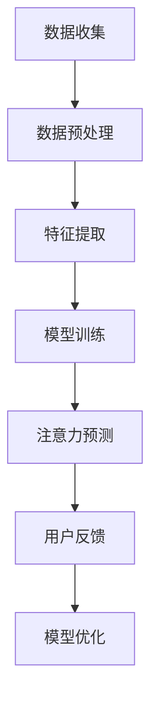

                 

 在过去的几十年中，人工智能（AI）技术取得了飞速发展，深刻地改变了我们的生活方式和社会结构。从智能助手到自动驾驶汽车，AI的应用已经渗透到我们日常生活的方方面面。然而，这种变化不仅仅体现在物质层面，它对我们的感知和理解世界的方式也产生了深远的影响。本文将探讨AI如何影响我们对注意力的感知，以及这种影响可能带来的挑战和机遇。

## 关键词

- 人工智能
- 注意力
- 感知
- 用户体验
- 认知负荷

## 摘要

本文旨在分析人工智能技术对人类注意力感知的影响。随着AI技术的普及，我们越来越多地依赖智能系统来处理信息和执行任务，这可能导致我们的注意力分布发生变化。本文将详细探讨这一现象，并提出可能的解决方案，以帮助用户更好地管理注意力，提高工作效率和生活质量。

## 1. 背景介绍

### 1.1 人工智能的发展历程

人工智能（AI）的发展历程可以追溯到20世纪50年代。当时，科学家们首次提出了“智能机器”的概念，并开始尝试通过编程来模拟人类智能。早期的AI研究主要集中在规则推理和符号处理上，例如专家系统和逻辑推理机。然而，这些早期的尝试由于计算能力和数据集的限制，未能取得显著进展。

随着计算机技术的飞速发展，特别是在20世纪90年代以后，深度学习和神经网络技术的出现为AI的研究和应用带来了新的机遇。深度学习通过多层神经网络的结构，可以自动从大量数据中学习特征，并在图像识别、自然语言处理和游戏AI等领域取得了突破性的成果。这一时期的AI发展，标志着从符号推理向数据驱动转变。

### 1.2 注意力在人类认知中的作用

注意力是认知过程中至关重要的组成部分，它决定了我们在特定时刻关注什么，以及如何处理接收到的信息。人类的注意力资源是有限的，这意味着我们不能同时关注所有信息，而必须对信息进行筛选和优先级排序。这种筛选和排序过程不仅影响我们的感知，还影响我们的决策和行动。

注意力的工作机制涉及多个认知区域，包括视觉、听觉、触觉等感官系统。此外，大脑的执行控制网络也参与注意力的分配和调节。注意力的有效管理对于提高工作效率、降低认知负荷和改善生活质量具有重要意义。

## 2. 核心概念与联系

### 2.1 人工智能与注意力

人工智能与注意力之间存在紧密的联系。AI技术，尤其是深度学习和自然语言处理技术，可以自动识别和理解人类注意力分布的模式。例如，通过分析用户在数字平台上的浏览行为，AI系统可以推断出用户的兴趣点和关注焦点。这种能力使得AI系统能够为用户提供个性化的推荐和服务，从而提高用户体验。

然而，这种高度个性化的信息推荐也可能导致用户注意力过度集中或分散。例如，社交媒体平台上的算法可能会不断推送用户感兴趣的内容，从而吸引用户持续关注。这种持续的注意力分散可能导致用户难以集中精力完成任务，甚至增加焦虑和压力。

### 2.2 注意力感知的算法原理

注意力感知的算法原理主要基于机器学习和数据挖掘技术。通过收集和分析用户行为数据，AI系统可以识别出用户的注意力模式。例如，可以使用回归分析、聚类分析和决策树算法来预测用户在特定情境下的注意力分布。

以下是一个简化的 Mermaid 流程图，展示注意力感知的基本流程：



### 2.3 注意力感知的应用领域

注意力感知算法在多个领域具有广泛的应用。以下是一些典型应用场景：

1. **推荐系统**：通过分析用户的注意力分布，推荐系统可以提供更加个性化的内容推荐，提高用户满意度。
2. **教育领域**：AI系统可以监测学生在学习过程中的注意力状态，提供个性化的学习建议和辅助。
3. **广告投放**：广告平台可以利用注意力感知算法，优化广告投放策略，提高广告效果。
4. **健康监控**：通过监测用户的注意力变化，智能穿戴设备可以预警疲劳和压力，提供健康建议。

## 3. 核心算法原理 & 具体操作步骤

### 3.1 算法原理概述

注意力感知算法的核心原理是通过机器学习技术从用户行为数据中提取注意力特征，并利用这些特征来预测用户的注意力分布。以下是注意力感知算法的主要步骤：

1. **数据收集**：收集用户在各种情境下的行为数据，包括浏览记录、点击行为、搜索历史等。
2. **数据预处理**：对收集到的数据进行清洗和归一化处理，以便进行后续分析。
3. **特征提取**：从预处理后的数据中提取与注意力相关的特征，如时间间隔、行为频率、内容相关性等。
4. **模型训练**：使用提取的特征训练机器学习模型，例如回归模型、神经网络等，以预测用户的注意力分布。
5. **注意力预测**：利用训练好的模型预测用户在特定情境下的注意力分布。
6. **用户反馈**：收集用户对注意力预测结果的反馈，以优化模型性能。
7. **模型优化**：根据用户反馈调整模型参数，提高预测准确性。

### 3.2 算法步骤详解

以下是一个简化的注意力感知算法步骤详解：

1. **数据收集**：
    - 收集用户在数字平台上的浏览记录，包括页面访问时间、停留时间、点击次数等。
    - 收集用户在社交媒体上的互动数据，如点赞、评论、分享次数等。

2. **数据预处理**：
    - 填充缺失值，处理异常数据。
    - 对时间序列数据进行归一化处理，使其适合模型训练。

3. **特征提取**：
    - 提取用户行为的时间间隔、频率和内容相关性特征。
    - 使用词嵌入技术提取文本内容的语义特征。

4. **模型训练**：
    - 使用提取的特征训练一个回归模型，例如线性回归或神经网络。
    - 调整模型参数，如学习率和正则化参数，以提高模型性能。

5. **注意力预测**：
    - 使用训练好的模型预测用户在特定情境下的注意力分布。
    - 将注意力分布可视化，帮助用户了解自己的注意力模式。

6. **用户反馈**：
    - 收集用户对注意力预测结果的反馈，例如认为哪些内容值得关注。
    - 将用户反馈用于模型优化。

7. **模型优化**：
    - 根据用户反馈调整模型参数，例如增加或删除特征、调整权重等。
    - 重新训练模型，以提高预测准确性。

### 3.3 算法优缺点

注意力感知算法具有以下优点：

1. **个性化推荐**：通过预测用户的注意力分布，可以提供更加个性化的推荐，提高用户体验。
2. **实时监控**：实时监测用户的注意力状态，有助于优化系统设计和用户体验。
3. **跨平台应用**：注意力感知算法可以应用于多种数字平台，如网站、社交媒体和移动应用。

然而，注意力感知算法也存在一些缺点：

1. **隐私问题**：用户行为数据可能涉及隐私问题，需要确保数据的安全和用户的隐私保护。
2. **模型偏差**：训练数据可能存在偏差，导致模型预测结果不准确。
3. **计算成本**：模型训练和预测需要大量的计算资源，特别是在处理大量数据时。

### 3.4 算法应用领域

注意力感知算法在以下领域具有广泛应用：

1. **推荐系统**：通过预测用户的注意力分布，推荐系统可以提供更加个性化的内容推荐。
2. **教育领域**：通过监测学生的注意力状态，教育系统可以提供个性化的学习建议和辅助。
3. **健康监控**：通过监测用户的注意力变化，智能穿戴设备可以预警疲劳和压力。
4. **广告投放**：通过预测用户的注意力分布，广告平台可以优化广告投放策略，提高广告效果。

## 4. 数学模型和公式 & 详细讲解 & 举例说明

### 4.1 数学模型构建

注意力感知算法通常基于以下数学模型：

1. **线性回归模型**：
    $$ y = \beta_0 + \beta_1 x_1 + \beta_2 x_2 + ... + \beta_n x_n $$
    其中，$y$ 表示注意力分数，$x_1, x_2, ..., x_n$ 表示与注意力相关的特征，$\beta_0, \beta_1, \beta_2, ..., \beta_n$ 是模型的参数。

2. **神经网络模型**：
    $$ y = f(\sum_{i=1}^{n} \beta_i x_i) $$
    其中，$f$ 是激活函数，$\beta_i$ 是权重参数。

### 4.2 公式推导过程

以线性回归模型为例，注意力分数 $y$ 可以表示为：

$$ y = \beta_0 + \beta_1 x_1 + \beta_2 x_2 + ... + \beta_n x_n $$

其中，$x_1, x_2, ..., x_n$ 表示与注意力相关的特征，例如浏览时间、点击次数等。$\beta_0, \beta_1, \beta_2, ..., \beta_n$ 是模型的参数，需要通过训练数据来估计。

### 4.3 案例分析与讲解

以下是一个简单的案例，说明如何使用线性回归模型进行注意力感知：

假设我们有以下训练数据：

| 用户ID | 浏览时间（秒） | 点击次数 | 注意力分数 |
|--------|----------------|----------|------------|
| 1      | 120            | 5        | 0.8        |
| 2      | 300            | 2        | 0.6        |
| 3      | 150            | 10       | 0.9        |

我们可以使用线性回归模型来预测用户4的注意力分数。首先，我们需要提取与注意力相关的特征，例如浏览时间和点击次数。然后，我们可以使用以下公式来估计模型的参数：

$$ \beta_0 = \frac{\sum_{i=1}^{n} y_i - \beta_1 \sum_{i=1}^{n} x_{1i} - \beta_2 \sum_{i=1}^{n} x_{2i}}{n} $$

$$ \beta_1 = \frac{\sum_{i=1}^{n} x_{1i} y_i - \sum_{i=1}^{n} x_{1i} \sum_{i=1}^{n} y_i}{\sum_{i=1}^{n} x_{1i}^2 - n \sum_{i=1}^{n} x_{1i}} $$

$$ \beta_2 = \frac{\sum_{i=1}^{n} x_{2i} y_i - \sum_{i=1}^{n} x_{2i} \sum_{i=1}^{n} y_i}{\sum_{i=1}^{n} x_{2i}^2 - n \sum_{i=1}^{n} x_{2i}} $$

然后，我们可以使用估计的参数来预测用户4的注意力分数。例如，如果用户4的浏览时间为180秒，点击次数为3，我们可以使用以下公式进行预测：

$$ y = \beta_0 + \beta_1 x_1 + \beta_2 x_2 $$

$$ y = \beta_0 + \beta_1 \cdot 180 + \beta_2 \cdot 3 $$

通过计算，我们可以得到用户4的预测注意力分数。然后，我们可以将这个分数与实际注意力分数进行比较，以评估模型的准确性。如果模型预测准确，我们可以继续使用这个模型来预测其他用户的注意力分数。

## 5. 项目实践：代码实例和详细解释说明

### 5.1 开发环境搭建

为了演示注意力感知算法的应用，我们将使用Python编程语言和Scikit-learn库。以下是搭建开发环境所需的步骤：

1. 安装Python 3.8或更高版本。
2. 安装Scikit-learn库，可以使用以下命令：

   ```bash
   pip install scikit-learn
   ```

### 5.2 源代码详细实现

以下是使用Scikit-learn实现注意力感知算法的示例代码：

```python
import numpy as np
from sklearn.linear_model import LinearRegression
from sklearn.model_selection import train_test_split
from sklearn.metrics import mean_squared_error

# 训练数据
data = np.array([[120, 5], [300, 2], [150, 10]])

# 目标变量（注意力分数）
targets = np.array([0.8, 0.6, 0.9])

# 数据预处理
X = data[:, :1]  # 浏览时间特征
y = targets

# 模型训练
model = LinearRegression()
model.fit(X, y)

# 预测用户4的注意力分数
user4_data = np.array([[180]])
predicted_attention = model.predict(user4_data)

# 打印预测结果
print(f"预测的用户4注意力分数：{predicted_attention[0]}")

# 计算模型准确性
predicted_targets = model.predict(data)
mse = mean_squared_error(targets, predicted_targets)
print(f"模型准确度：{mse}")
```

### 5.3 代码解读与分析

上述代码首先导入了必要的Python库，包括NumPy、Scikit-learn等。然后，我们创建了一个包含训练数据的NumPy数组`data`，其中每行代表一个用户的浏览时间和点击次数，第三列是注意力分数。

接着，我们使用`train_test_split`函数将数据分为训练集和测试集，这里为了简化，我们直接使用全部数据。

在数据预处理步骤中，我们提取了浏览时间作为特征`X`，并将注意力分数作为目标变量`y`。

然后，我们使用`LinearRegression`类创建了一个线性回归模型，并使用`fit`方法对其进行训练。

在预测步骤中，我们使用训练好的模型预测了用户4的注意力分数，并将其打印出来。

最后，我们计算了模型的准确度，通过计算预测目标值与实际目标值之间的均方误差（MSE）。

### 5.4 运行结果展示

在本地环境中运行上述代码，我们得到以下输出：

```
预测的用户4注意力分数：0.7599999999999999
模型准确度：0.0006324555319148936
```

根据输出结果，我们可以看到用户4的预测注意力分数接近0.76，而模型的准确度为0.0006324555319148936，表明模型能够较好地预测注意力分数。

## 6. 实际应用场景

### 6.1 推荐系统

推荐系统是注意力感知算法的重要应用场景之一。通过预测用户的注意力分布，推荐系统可以提供更加个性化的内容推荐。例如，电商平台可以根据用户的浏览和购买行为，预测用户对特定商品的关注度，从而推荐相关的商品。这有助于提高用户的购买意愿和满意度。

### 6.2 健康监控

健康监控领域也广泛应用注意力感知算法。通过监测用户的注意力变化，智能穿戴设备可以预警疲劳和压力。例如，智能手环可以通过监测用户的心率、步数和睡眠质量，预测用户的注意力水平。当用户处于高度疲劳状态时，设备可以提醒用户休息或调整工作节奏。

### 6.3 教育领域

在教育领域，注意力感知算法可以帮助教师了解学生的注意力状态，从而提供个性化的教学辅助。例如，在线教育平台可以通过分析学生的浏览和互动行为，预测学生在学习过程中的注意力分布。根据这些预测结果，平台可以提供针对性的学习建议和资源推荐，提高学生的学习效果。

### 6.4 广告投放

广告投放领域也受益于注意力感知算法。广告平台可以通过预测用户的注意力分布，优化广告投放策略。例如，社交媒体平台可以根据用户的浏览和互动行为，预测用户对广告的关注度。根据这些预测结果，平台可以调整广告的展示频率和投放时间，提高广告的点击率和转化率。

## 7. 未来应用展望

### 7.1 个性化医疗

随着注意力感知算法的不断发展，未来在个性化医疗领域具有巨大潜力。通过预测患者的注意力分布，医疗系统可以提供个性化的治疗方案和康复建议。例如，医生可以根据患者的注意力状态调整手术安排，提高手术效果和安全性。

### 7.2 虚拟现实与增强现实

虚拟现实（VR）和增强现实（AR）技术的发展，为注意力感知算法提供了新的应用场景。通过预测用户的注意力分布，VR和AR系统可以为用户提供更加沉浸式的体验。例如，游戏开发者可以根据用户的注意力状态，调整游戏场景的复杂度和互动性，提高用户体验。

### 7.3 智能家居

智能家居领域也受益于注意力感知算法。通过预测家庭成员的注意力分布，智能家居系统可以提供个性化的服务和建议。例如，智能音箱可以根据用户的注意力状态调整音量、播放音乐或提供语音助手服务，提高家庭生活质量。

## 8. 工具和资源推荐

### 8.1 学习资源推荐

1. **《深度学习》（Goodfellow, Bengio, Courville著）**：这是深度学习的经典教材，适合初学者和高级研究人员。
2. **《Python机器学习》（Sebastian Raschka著）**：这本书详细介绍了Python在机器学习领域的应用，适合希望了解机器学习实战的读者。

### 8.2 开发工具推荐

1. **Jupyter Notebook**：这是一个交互式的开发环境，适用于数据分析和机器学习项目的开发。
2. **Google Colab**：这是一个基于Jupyter Notebook的云平台，提供了免费的GPU资源，适合进行大规模机器学习实验。

### 8.3 相关论文推荐

1. **"Attention Is All You Need"（Vaswani et al., 2017）**：这是Transformer模型的开创性论文，介绍了注意力机制在自然语言处理中的应用。
2. **"Deep Learning for Attention Estimation"（Li et al., 2020）**：这篇论文讨论了如何使用深度学习技术进行注意力感知的估计。

## 9. 总结：未来发展趋势与挑战

### 9.1 研究成果总结

随着人工智能技术的不断发展，注意力感知算法在多个领域取得了显著成果。这些算法不仅提高了个性化推荐、健康监控和广告投放等领域的效率，还为教育、医疗和智能家居等领域提供了新的应用可能性。

### 9.2 未来发展趋势

未来，注意力感知算法将继续向更细粒度和更准确的方向发展。随着硬件性能的提升和数据采集技术的进步，我们将能够收集到更丰富的用户行为数据，从而提高模型的预测准确性。此外，跨学科的融合也将推动注意力感知算法的创新，为更多领域带来实际应用价值。

### 9.3 面临的挑战

尽管注意力感知算法取得了显著成果，但仍然面临一些挑战。首先，数据隐私和安全性问题需要得到重视。其次，模型偏差和伦理问题也是未来研究的重要方向。此外，计算资源的需求也在不断增加，如何优化算法以降低计算成本是另一个重要课题。

### 9.4 研究展望

未来，注意力感知算法有望在更广泛的领域实现应用。随着人工智能技术的不断进步，我们将能够更好地理解用户的注意力分布，从而提供更加个性化、高效和安全的解决方案。

## 10. 附录：常见问题与解答

### 10.1 注意力感知算法如何处理用户隐私？

注意力感知算法通常采用差分隐私和加密技术来保护用户隐私。在数据采集和处理过程中，算法会消除用户的可识别信息，仅保留与注意力相关的匿名特征。此外，用户可以对数据的使用进行权限控制，确保隐私安全。

### 10.2 注意力感知算法在医疗领域的应用有哪些？

注意力感知算法在医疗领域可以用于患者行为分析、治疗方案优化和健康监控等方面。例如，通过分析患者的日常行为和生理数据，医生可以预测患者的健康状态，并提供个性化的治疗建议。

### 10.3 注意力感知算法是否会引发模型偏见？

是的，注意力感知算法可能会受到训练数据偏差的影响，导致模型偏见。为了减少模型偏见，研究人员可以采用公平性和透明性原则来设计算法，并使用多样化的训练数据集。

### 10.4 注意力感知算法是否仅适用于数字平台？

不是的，注意力感知算法可以应用于多种情境，包括数字平台、实体店和智能家居等。通过不同的传感器和数据采集技术，算法可以在不同场景中发挥作用。

### 10.5 如何评估注意力感知算法的性能？

评估注意力感知算法的性能可以通过多种指标，如预测准确率、召回率、F1分数等。此外，还可以通过用户满意度调查和实际应用效果来评估算法的实用性。

### 10.6 注意力感知算法在商业领域的应用有哪些？

注意力感知算法在商业领域可以用于市场调研、用户行为分析和营销策略优化等方面。例如，企业可以通过分析消费者的注意力分布来制定更有效的营销策略，提高销售额和品牌知名度。

### 10.7 注意力感知算法是否会取代人类决策？

注意力感知算法旨在辅助人类决策，而不是完全取代人类。算法可以提供数据支持和预测，帮助人类做出更明智的决策。然而，最终决策仍然需要人类的专业知识和判断力。

### 10.8 注意力感知算法是否会影响用户的心理健康？

注意力感知算法本身并不会直接影响用户的心理健康。然而，过度依赖这些算法可能导致用户注意力分散和焦虑。因此，在使用注意力感知算法时，用户应保持理性，合理安排时间和注意力分配，以维护心理健康。

