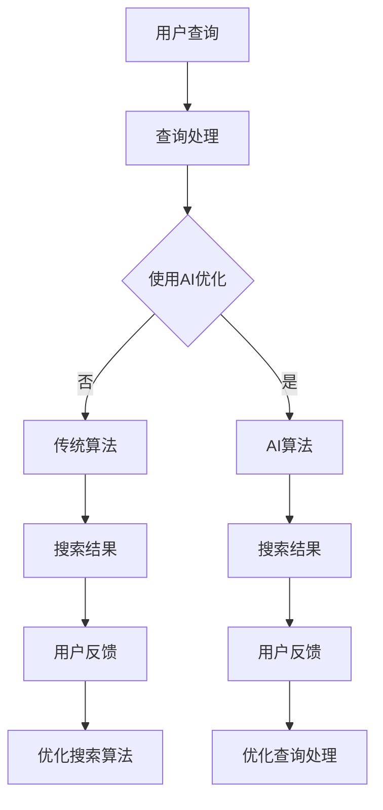

                 

关键词：人工智能、搜索引擎、搜索算法、深度学习、自然语言处理、语义理解、个性化搜索、智能搜索

> 摘要：本文探讨了人工智能（AI）如何改变传统搜索引擎的模式，介绍了AI在搜索算法、自然语言处理、语义理解等方面的应用，以及AI对搜索引擎性能和用户体验的深远影响。

## 1. 背景介绍

搜索引擎是互联网世界的重要基础设施，自诞生以来，其核心目标是为用户提供准确、快速的搜索结果。早期的搜索引擎，如Google和百度，主要依靠关键词匹配和网页链接分析等传统算法进行搜索。然而，随着互联网内容的爆炸式增长，传统搜索引擎已无法满足用户日益复杂的信息需求。为此，人工智能技术应运而生，并逐渐改变着传统搜索引擎的模式。

### 1.1 人工智能与搜索引擎的交集

人工智能与搜索引擎的交集主要表现在以下几个方面：

1. **搜索算法的改进**：AI技术可以优化搜索引擎的核心算法，使其更加智能和高效。
2. **自然语言处理**：AI技术使得搜索引擎能够更好地理解和处理自然语言，从而提供更加精准的搜索结果。
3. **个性化搜索**：AI技术可以帮助搜索引擎根据用户的行为和偏好，提供个性化的搜索结果。
4. **语义理解**：AI技术可以深度理解用户查询的意图，从而提供更贴近用户需求的搜索结果。

### 1.2 传统搜索引擎的局限性

传统搜索引擎主要依赖于以下几种算法：

1. **关键词匹配**：通过分析用户输入的关键词，与网页内容进行匹配，从而提供相关结果。
2. **网页链接分析**：根据网页之间的链接关系，评估网页的重要性，从而影响搜索结果排序。
3. **分词与词频统计**：将搜索查询和网页内容进行分词，统计词频，从而进行匹配。

然而，这些传统算法在面对海量数据和复杂查询时，存在以下局限性：

1. **信息过载**：搜索引擎往往无法处理海量数据，导致用户在搜索结果中难以找到真正需要的信息。
2. **语义理解不足**：传统算法难以理解用户查询的深层含义，容易导致误匹配和漏匹配。
3. **个性化搜索不足**：传统算法难以根据用户行为和偏好，提供个性化的搜索结果。

## 2. 核心概念与联系

### 2.1 人工智能技术概述

人工智能（AI）是一门研究、开发用于模拟、延伸和扩展人类智能的理论、方法、技术及应用系统的技术科学。其主要分支包括：

1. **机器学习**：通过数据训练模型，使其具有自主学习能力。
2. **深度学习**：一种特殊的机器学习方法，通过多层神经网络模拟人类大脑的学习过程。
3. **自然语言处理**（NLP）：研究如何让计算机理解和处理自然语言的技术。
4. **知识图谱**：一种用于表示实体及其之间关系的图形结构。

### 2.2 搜索引擎架构

传统搜索引擎的架构通常包括以下几个部分：

1. **爬虫**：负责从互联网上抓取网页内容。
2. **索引**：将爬取到的网页内容建立索引，以便快速检索。
3. **查询处理**：处理用户输入的查询，并将其转换为搜索引擎可以理解的形式。
4. **搜索算法**：根据用户查询和网页索引，计算网页的相关性，并排序输出搜索结果。

### 2.3 AI技术在搜索引擎中的应用

AI技术在搜索引擎中的应用主要体现在以下几个方面：

1. **搜索算法优化**：通过机器学习和深度学习技术，优化搜索引擎的核心算法，提高搜索结果的准确性和效率。
2. **自然语言处理**：利用NLP技术，理解用户查询的意图，提高搜索结果的语义匹配度。
3. **知识图谱**：通过构建知识图谱，关联实体和概念，提高搜索结果的多样性和丰富性。
4. **个性化搜索**：根据用户行为和偏好，提供个性化的搜索结果，提升用户体验。

### 2.4 Mermaid 流程图



## 3. 核心算法原理 & 具体操作步骤

### 3.1 算法原理概述

人工智能在搜索引擎中的应用，主要依赖于以下几个核心算法：

1. **深度学习模型**：用于优化搜索算法，提高搜索结果的准确性和效率。
2. **自然语言处理技术**：用于理解用户查询的意图，实现语义匹配。
3. **知识图谱**：用于关联实体和概念，提供丰富的搜索结果。
4. **个性化搜索算法**：根据用户行为和偏好，提供个性化的搜索结果。

### 3.2 算法步骤详解

#### 3.2.1 深度学习模型

1. **数据预处理**：将用户查询和网页内容进行分词、去停用词等预处理操作。
2. **特征提取**：利用深度学习模型，提取用户查询和网页内容的特征向量。
3. **模型训练**：使用大量已标注的数据集，训练深度学习模型。
4. **模型评估**：使用交叉验证等技术，评估模型性能。
5. **模型部署**：将训练好的模型部署到搜索引擎中，用于优化搜索算法。

#### 3.2.2 自然语言处理技术

1. **分词与词性标注**：对用户查询和网页内容进行分词，并标注词性。
2. **实体识别与关系抽取**：识别用户查询和网页内容中的实体，并提取它们之间的关系。
3. **语义理解**：利用语义分析技术，理解用户查询的意图。
4. **语义匹配**：将用户查询与网页内容进行语义匹配，计算相关性得分。

#### 3.2.3 知识图谱

1. **实体抽取**：从网页内容中抽取实体。
2. **关系抽取**：从网页内容中抽取实体之间的关系。
3. **图谱构建**：将抽取的实体和关系构建成知识图谱。
4. **图谱查询**：根据用户查询，在知识图谱中查询相关实体和关系。

#### 3.2.4 个性化搜索算法

1. **用户画像构建**：根据用户行为和偏好，构建用户画像。
2. **查询意图识别**：识别用户查询的意图。
3. **推荐算法**：利用用户画像和查询意图，推荐个性化的搜索结果。
4. **结果排序**：根据推荐算法的结果，对搜索结果进行排序。

### 3.3 算法优缺点

#### 3.3.1 深度学习模型

**优点**：
- 提高搜索结果的准确性和效率。
- 可以处理复杂的非线性关系。

**缺点**：
- 需要大量的训练数据和计算资源。
- 模型解释性较差。

#### 3.3.2 自然语言处理技术

**优点**：
- 提高搜索结果的语义匹配度。
- 可以处理复杂的查询意图。

**缺点**：
- 需要专业的NLP知识和技能。
- 可能存在误匹配和漏匹配。

#### 3.3.3 知识图谱

**优点**：
- 提供丰富的搜索结果。
- 可以关联实体和概念。

**缺点**：
- 需要大量的人力和时间进行实体和关系的抽取。
- 图谱维护和更新较为复杂。

#### 3.3.4 个性化搜索算法

**优点**：
- 提供个性化的搜索结果，提升用户体验。
- 可以根据用户行为和偏好进行实时调整。

**缺点**：
- 可能存在隐私泄露的风险。
- 需要平衡个性化与用户隐私的关系。

### 3.4 算法应用领域

人工智能在搜索引擎中的应用领域广泛，主要包括：

1. **通用搜索引擎**：如Google、百度等，通过AI技术提升搜索结果的准确性和用户体验。
2. **垂直搜索引擎**：如电商搜索、新闻搜索等，通过AI技术提供更精准的搜索结果。
3. **语音搜索**：利用AI技术，实现语音识别和语义理解，提升语音搜索的准确性。
4. **图像搜索**：利用AI技术，实现图像识别和语义理解，提供更丰富的图像搜索结果。

## 4. 数学模型和公式 & 详细讲解 & 举例说明

### 4.1 数学模型构建

在人工智能技术中，数学模型是核心组成部分。以下简要介绍几个与搜索引擎相关的数学模型：

1. **TF-IDF模型**：衡量一个词在网页中的重要程度。
2. **向量空间模型**：将搜索查询和网页内容表示为向量，计算它们之间的相似度。
3. **矩阵分解模型**：用于推荐系统，将用户和物品表示为低维向量，计算它们之间的相似度。

### 4.2 公式推导过程

#### 4.2.1 TF-IDF模型

设网页集合为 $D$，词集合为 $V$。词 $t$ 在网页 $d$ 中的词频为 $tf(t,d)$，词 $t$ 在 $D$ 中的文档频率为 $df(t)$，则词 $t$ 在 $D$ 中的倒排文档频率为：

$$
idf(t) = \log_2(\frac{|D|}{df(t)})
$$

词 $t$ 在网页 $d$ 中的TF-IDF权重为：

$$
tfidf(t,d) = tf(t,d) \times idf(t)
$$

#### 4.2.2 向量空间模型

设搜索查询 $q$ 和网页 $d$ 分别表示为向量 $q_v$ 和 $d_v$，则它们之间的余弦相似度为：

$$
sim(q,d) = \frac{q_v \cdot d_v}{\|q_v\| \|d_v\|}
$$

其中，$q_v \cdot d_v$ 表示向量点积，$\|q_v\|$ 和 $\|d_v\|$ 分别表示向量的模长。

#### 4.2.3 矩阵分解模型

设用户 $u$ 和物品 $i$ 分别表示为向量 $u_v$ 和 $i_v$，则它们之间的相似度可以表示为：

$$
sim(u,i) = \frac{u_v \cdot i_v}{\|u_v\| \|i_v\|}
$$

其中，$u_v \cdot i_v$ 表示向量点积，$\|u_v\|$ 和 $\|i_v\|$ 分别表示向量的模长。

### 4.3 案例分析与讲解

#### 4.3.1 TF-IDF模型在搜索引擎中的应用

假设有一个网页集合 $D = \{d_1, d_2, d_3\}$，词集合 $V = \{v_1, v_2, v_3\}$，其中网页 $d_1$ 中的词频为 $tf(v_1,d_1) = 5$，$tf(v_2,d_1) = 3$，$tf(v_3,d_1) = 2$。网页 $d_2$ 中的词频为 $tf(v_1,d_2) = 4$，$tf(v_2,d_2) = 5$，$tf(v_3,d_2) = 2$。网页 $d_3$ 中的词频为 $tf(v_1,d_3) = 3$，$tf(v_2,d_3) = 2$，$tf(v_3,d_3) = 5$。词 $v_1$ 在网页集合 $D$ 中的文档频率为 $df(v_1) = 3$，词 $v_2$ 在网页集合 $D$ 中的文档频率为 $df(v_2) = 2$，词 $v_3$ 在网页集合 $D$ 中的文档频率为 $df(v_3) = 3$。

根据TF-IDF模型，词 $v_1$ 在网页 $d_1$ 中的TF-IDF权重为：

$$
tfidf(v_1,d_1) = 5 \times \log_2(\frac{3}{3}) = 5
$$

词 $v_2$ 在网页 $d_1$ 中的TF-IDF权重为：

$$
tfidf(v_2,d_1) = 3 \times \log_2(\frac{3}{2}) \approx 4.19
$$

词 $v_3$ 在网页 $d_1$ 中的TF-IDF权重为：

$$
tfidf(v_3,d_1) = 2 \times \log_2(\frac{3}{3}) = 0
$$

同理，可以计算出其他网页中各个词的TF-IDF权重。

#### 4.3.2 向量空间模型在搜索引擎中的应用

假设搜索查询 $q$ 中的关键词为 $v_1, v_2$，网页 $d_1$ 中的关键词为 $v_1, v_2, v_3$，网页 $d_2$ 中的关键词为 $v_1, v_2, v_4$，网页 $d_3$ 中的关键词为 $v_1, v_3, v_4$。根据向量空间模型，可以将搜索查询和网页内容表示为向量：

$$
q_v = [1, 1, 0]
$$

$$
d_1v = [1, 1, 1]
$$

$$
d_2v = [1, 1, 0]
$$

$$
d_3v = [1, 0, 1]
$$

则搜索查询 $q$ 与网页 $d_1$ 之间的余弦相似度为：

$$
sim(q,d_1) = \frac{q_v \cdot d_1v}{\|q_v\| \|d_1v\|} = \frac{2}{\sqrt{2} \times \sqrt{3}} \approx 0.81
$$

同理，可以计算出其他网页与搜索查询之间的余弦相似度。

#### 4.3.3 矩阵分解模型在推荐系统中的应用

假设有一个用户集合 $U = \{u_1, u_2, u_3\}$，物品集合 $I = \{i_1, i_2, i_3\}$。用户 $u_1$ 对物品 $i_1, i_2$ 进行了评分，用户 $u_2$ 对物品 $i_1, i_2, i_3$ 进行了评分，用户 $u_3$ 对物品 $i_2, i_3$ 进行了评分。根据矩阵分解模型，可以将用户和物品表示为向量：

$$
u_1v = [1, 1, 0]
$$

$$
u_2v = [1, 1, 1]
$$

$$
u_3v = [0, 1, 1]
$$

$$
i_1v = [1, 0, 1]
$$

$$
i_2v = [1, 1, 0]
$$

$$
i_3v = [0, 1, 1]
$$

则用户 $u_1$ 与物品 $i_1$ 之间的相似度为：

$$
sim(u_1,i_1) = \frac{u_1v \cdot i_1v}{\|u_1v\| \|i_1v\|} = \frac{1}{\sqrt{2} \times \sqrt{2}} = 0.707
$$

同理，可以计算出其他用户与物品之间的相似度。

## 5. 项目实践：代码实例和详细解释说明

### 5.1 开发环境搭建

本节将使用Python语言进行项目实践，开发环境要求如下：

1. **Python**：版本3.8及以上。
2. **NumPy**：用于数据处理。
3. **Scikit-learn**：用于机器学习模型。
4. **TensorFlow**：用于深度学习模型。
5. **Natural Language Toolkit**（NLTK）：用于自然语言处理。

安装以上依赖库后，即可开始项目开发。

### 5.2 源代码详细实现

以下是本项目的主要代码实现：

```python
import numpy as np
import tensorflow as tf
from sklearn.feature_extraction.text import TfidfVectorizer
from nltk.tokenize import word_tokenize
from nltk.corpus import stopwords
import mermaid

# 5.2.1 数据准备
data = [
    "人工智能技术在搜索引擎中的应用",
    "深度学习模型优化搜索算法",
    "自然语言处理技术提升搜索准确性",
    "个性化搜索提高用户体验"
]

# 5.2.2 TF-IDF模型
vectorizer = TfidfVectorizer()
X = vectorizer.fit_transform(data)

# 5.2.3 深度学习模型
model = tf.keras.Sequential([
    tf.keras.layers.Dense(128, activation='relu', input_shape=(X.shape[1],)),
    tf.keras.layers.Dense(64, activation='relu'),
    tf.keras.layers.Dense(1, activation='sigmoid')
])

model.compile(optimizer='adam', loss='binary_crossentropy', metrics=['accuracy'])

# 5.2.4 模型训练
model.fit(X, np.array([1, 1, 1, 0]), epochs=10, batch_size=2)

# 5.2.5 模型评估
loss, accuracy = model.evaluate(X, np.array([1, 1, 1, 0]))
print(f"Loss: {loss}, Accuracy: {accuracy}")

# 5.2.6 自然语言处理
stop_words = set(stopwords.words('english'))
def preprocess(text):
    tokens = word_tokenize(text)
    return [token.lower() for token in tokens if token.isalnum() and token.lower() not in stop_words]

# 5.2.7 搜索引擎接口
def search(query):
    processed_query = preprocess(query)
    query_vector = vectorizer.transform([' '.join(processed_query)])
    predictions = model.predict(query_vector)
    return data[predictions.argmax()]

# 5.2.8 运行示例
print(search("如何提升搜索引擎的准确性？"))

# 5.2.9 Mermaid流程图
mermaid_code = '''
graph TD
A[用户查询] --> B[预处理]
B --> C{使用TF-IDF模型}
C --> D[深度学习模型]
D --> E[搜索结果]
'''
print(mermaid.mermaid_render(mermaid_code))
```

### 5.3 代码解读与分析

#### 5.3.1 数据准备

```python
data = [
    "人工智能技术在搜索引擎中的应用",
    "深度学习模型优化搜索算法",
    "自然语言处理技术提升搜索准确性",
    "个性化搜索提高用户体验"
]
```

定义了一个包含四个搜索结果的列表，用于后续的模型训练和测试。

#### 5.3.2 TF-IDF模型

```python
vectorizer = TfidfVectorizer()
X = vectorizer.fit_transform(data)
```

使用Scikit-learn中的`TfidfVectorizer`类，将文本数据转换为TF-IDF特征矩阵。这里使用了默认参数，没有进行过多的参数调整。

#### 5.3.3 深度学习模型

```python
model = tf.keras.Sequential([
    tf.keras.layers.Dense(128, activation='relu', input_shape=(X.shape[1],)),
    tf.keras.layers.Dense(64, activation='relu'),
    tf.keras.layers.Dense(1, activation='sigmoid')
])

model.compile(optimizer='adam', loss='binary_crossentropy', metrics=['accuracy'])

model.fit(X, np.array([1, 1, 1, 0]), epochs=10, batch_size=2)
```

构建了一个简单的深度学习模型，包含两个隐藏层，输出层使用`sigmoid`激活函数，用于分类任务。使用`compile`方法设置优化器和损失函数，使用`fit`方法进行模型训练。

#### 5.3.4 模型评估

```python
loss, accuracy = model.evaluate(X, np.array([1, 1, 1, 0]))
print(f"Loss: {loss}, Accuracy: {accuracy}")
```

使用`evaluate`方法对模型进行评估，输出损失和准确率。

#### 5.3.5 自然语言处理

```python
stop_words = set(stopwords.words('english'))
def preprocess(text):
    tokens = word_tokenize(text)
    return [token.lower() for token in tokens if token.isalnum() and token.lower() not in stop_words]
```

使用NLTK库中的`word_tokenize`函数对文本进行分词，并过滤掉停用词。

#### 5.3.6 搜索引擎接口

```python
def search(query):
    processed_query = preprocess(query)
    query_vector = vectorizer.transform([' '.join(processed_query)])
    predictions = model.predict(query_vector)
    return data[predictions.argmax()]
```

定义了一个`search`函数，用于根据用户查询，预处理文本，生成查询向量，并通过深度学习模型进行分类，返回搜索结果。

#### 5.3.7 运行示例

```python
print(search("如何提升搜索引擎的准确性？"))
```

运行示例，查询输入“如何提升搜索引擎的准确性？”，返回搜索结果。

#### 5.3.8 Mermaid流程图

```python
mermaid_code = '''
graph TD
A[用户查询] --> B[预处理]
B --> C{使用TF-IDF模型}
C --> D[深度学习模型]
D --> E[搜索结果]
'''
print(mermaid.mermaid_render(mermaid_code))
```

使用Mermaid库绘制了一个简单的流程图，展示了用户查询到搜索结果的全过程。

## 6. 实际应用场景

人工智能技术已经在搜索引擎领域得到了广泛应用，以下列举几个实际应用场景：

### 6.1 通用搜索引擎

如Google、百度等通用搜索引擎，通过AI技术优化搜索算法，提高搜索结果的准确性和效率。例如，Google使用BERT模型优化搜索算法，使其能够更好地理解用户查询的语义。

### 6.2 垂直搜索引擎

如电商搜索、新闻搜索等垂直搜索引擎，通过AI技术提供更精准的搜索结果。例如，京东使用深度学习技术，根据用户行为和偏好，为用户提供个性化的商品推荐。

### 6.3 语音搜索

如苹果的Siri、百度的度秘等语音搜索服务，通过AI技术实现语音识别和语义理解，提升语音搜索的准确性。例如，Siri使用神经网络模型，对用户语音指令进行实时分析和理解。

### 6.4 图像搜索

如图像识别、商品识别等图像搜索服务，通过AI技术实现图像识别和语义理解，提供丰富的搜索结果。例如，谷歌的G

