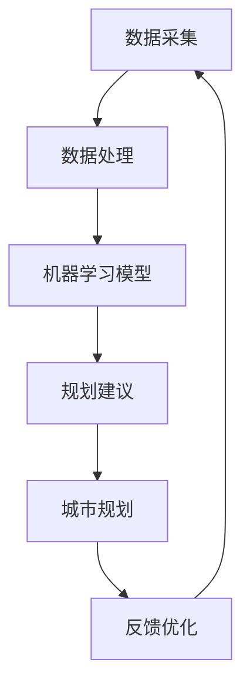

                 

关键词：人工智能、城市规划、智慧城市、算法、数学模型、应用场景、发展趋势

> 摘要：本文将探讨人工智能（AI）如何深刻改变城市规划和智慧城市的发展。通过介绍AI的核心概念、算法原理、数学模型，以及具体应用实例，我们将分析AI在城市规划中的潜在影响和未来发展方向。

## 1. 背景介绍

随着全球城市化进程的加速，城市规划变得日益复杂。传统的城市规划方法依赖于经验和主观判断，难以应对现代城市中的复杂问题和动态变化。智慧城市理念的提出，旨在利用信息技术和人工智能解决城市问题，实现资源高效配置和城市可持续发展。

### 1.1 智慧城市的定义与发展

智慧城市是指通过信息通信技术（ICT）、物联网（IoT）、大数据、云计算等技术手段，实现城市资源的智能管理和服务，提升城市治理效率、提高居民生活质量的一种城市发展模式。

智慧城市的发展经历了几个阶段：

1. **初步信息化**：20世纪90年代，城市开始建设信息基础设施，实现政务、交通、教育等领域的初步信息化。
2. **系统集成**：21世纪初，智慧城市开始强调系统集成，通过数据共享和协同工作提升城市管理水平。
3. **智能化**：近年来，人工智能技术的应用使得智慧城市进入智能化阶段，能够实现更加精准的决策和动态的资源配置。

### 1.2 人工智能的核心概念

人工智能（Artificial Intelligence，AI）是计算机科学的一个分支，旨在使机器能够模拟、延伸和扩展人类的智能。AI的核心概念包括：

1. **机器学习**：机器通过学习和经验改进自身性能。
2. **深度学习**：基于多层神经网络的学习方法，能够处理复杂的非线性问题。
3. **自然语言处理**：使计算机能够理解和生成自然语言。
4. **计算机视觉**：使计算机能够理解和解释视觉信息。

## 2. 核心概念与联系

### 2.1 概念原理

在城市规划中，AI的核心作用在于通过数据分析和模型预测，提供科学、合理的规划建议。具体来说，AI的核心概念和城市规划的关联如下：

1. **数据采集与分析**：城市规划需要大量数据支持，包括地理信息、人口统计、经济数据等。AI能够通过大数据分析，发现数据中的规律和趋势，为规划提供依据。
2. **机器学习与预测**：通过机器学习算法，可以对城市未来的发展趋势进行预测，例如人口增长、交通流量、环境污染等。
3. **计算机视觉与监测**：AI的计算机视觉技术可以用于城市监控，实时检测城市状态，提供预警和应急响应。
4. **自然语言处理与规划**：通过自然语言处理技术，AI可以理解城市规划的需求和目标，生成合理的规划方案。

### 2.2 架构原理

以下是智慧城市中AI应用的基本架构原理的Mermaid流程图：



1. **数据采集**：从各种来源获取城市规划所需的数据，包括地理信息、人口统计、交通数据等。
2. **数据处理**：对采集到的数据进行清洗、整合，为机器学习提供高质量的数据输入。
3. **机器学习模型**：利用机器学习算法对数据进行分析，建立预测模型，预测城市未来的发展趋势。
4. **规划建议**：根据预测结果，AI系统生成具体的规划建议。
5. **城市规划**：规划师根据AI的建议，结合实际情况，制定城市发展规划。
6. **反馈优化**：规划实施后，通过反馈机制不断调整优化AI模型，提高规划精度。

## 3. 核心算法原理 & 具体操作步骤

### 3.1 算法原理概述

AI在城市规划中的应用离不开机器学习、深度学习等算法。以下是一些常用的算法原理：

1. **决策树**：通过一系列规则对数据进行分类或回归分析。
2. **支持向量机**：通过找到一个最优的超平面，将不同类别的数据分开。
3. **神经网络**：通过多层神经网络模拟人脑的神经元连接，进行复杂的非线性问题处理。
4. **聚类算法**：将相似的数据点分为同一类别，用于人口分布、交通流量分析等。

### 3.2 算法步骤详解

1. **数据预处理**：包括数据清洗、归一化、特征提取等步骤。
2. **模型选择**：根据问题的性质选择合适的算法模型。
3. **模型训练**：使用训练数据集对模型进行训练，调整模型参数。
4. **模型评估**：使用验证数据集对模型性能进行评估，调整模型参数。
5. **预测与规划**：使用训练好的模型对新的数据进行分析，生成规划建议。

### 3.3 算法优缺点

- **优点**：
  - 高效处理大量数据，提供精准的规划建议。
  - 能够实时响应城市变化，动态调整规划方案。
  - 提高规划师的决策效率，减少人为误差。

- **缺点**：
  - 需要高质量的数据支持，数据质量直接影响模型性能。
  - 部分算法模型复杂度高，训练时间较长。
  - 需要专业的技术团队进行维护和更新。

### 3.4 算法应用领域

AI算法在城市规划中的应用非常广泛，包括：

- **交通规划**：通过分析交通数据，预测交通流量，优化交通网络。
- **城市规划**：根据人口分布、用地需求等数据，优化城市布局。
- **环境保护**：监测环境质量，预测环境污染趋势，制定环境保护政策。
- **灾害预警**：通过气象数据、地质数据等预测自然灾害，提前采取预防措施。

## 4. 数学模型和公式 & 详细讲解 & 举例说明

### 4.1 数学模型构建

在城市规划中，常用的数学模型包括：

1. **线性回归模型**：用于预测城市人口、经济等变量的趋势。
2. **逻辑回归模型**：用于分析城市各类问题的概率分布。
3. **时间序列模型**：用于预测城市动态变化趋势。

### 4.2 公式推导过程

以下以线性回归模型为例，介绍公式推导过程：

$$
Y = \beta_0 + \beta_1X + \epsilon
$$

其中，$Y$ 是因变量，$X$ 是自变量，$\beta_0$ 和 $\beta_1$ 是模型参数，$\epsilon$ 是误差项。

通过最小二乘法，可以求解出模型参数：

$$
\beta_0 = \frac{\sum(Y - \beta_1X)}{N}
$$

$$
\beta_1 = \frac{N\sum(XY) - \sum X\sum Y}{N\sum X^2 - (\sum X)^2}
$$

### 4.3 案例分析与讲解

假设我们要预测一个城市的未来人口，可以使用线性回归模型进行分析。以下是具体步骤：

1. **数据收集**：收集该城市过去几年的年度人口数据。
2. **数据预处理**：对数据进行清洗、归一化等处理。
3. **模型训练**：使用训练数据集，通过最小二乘法求解出模型参数。
4. **模型评估**：使用验证数据集对模型性能进行评估。
5. **预测**：使用训练好的模型，预测未来几年的人口。

例如，给定以下训练数据：

| 年份 | 人口 |
|------|------|
| 2010 | 500万 |
| 2011 | 510万 |
| 2012 | 520万 |
| 2013 | 530万 |
| 2014 | 540万 |

通过线性回归模型，我们可以预测出2015年的人口约为550万。

## 5. 项目实践：代码实例和详细解释说明

### 5.1 开发环境搭建

为了进行AI在城市规划中的应用，我们需要搭建一个合适的开发环境。以下是一个基本的开发环境搭建步骤：

1. **安装Python**：Python是AI应用的主要编程语言，确保安装了最新版本的Python。
2. **安装Jupyter Notebook**：Jupyter Notebook是一种交互式开发环境，方便编写和运行Python代码。
3. **安装必要的库**：包括NumPy、Pandas、Matplotlib、Scikit-learn等。

### 5.2 源代码详细实现

以下是一个简单的线性回归模型实现代码实例：

```python
import numpy as np
import pandas as pd
from sklearn.linear_model import LinearRegression

# 数据收集与预处理
data = pd.DataFrame({
    '年份': [2010, 2011, 2012, 2013, 2014],
    '人口': [5000000, 5100000, 5200000, 5300000, 5400000]
})
X = data[['年份']]
y = data['人口']

# 模型训练
model = LinearRegression()
model.fit(X, y)

# 模型评估
score = model.score(X, y)
print(f"模型评估得分：{score}")

# 预测
future_years = np.array([2015])
predicted_population = model.predict(future_years)
print(f"2015年预测人口：{predicted_population[0]}")
```

### 5.3 代码解读与分析

1. **数据收集与预处理**：首先从数据中提取年份和人口数据，并将其转换为适合模型训练的数据格式。
2. **模型训练**：使用Scikit-learn的LinearRegression类进行模型训练，通过fit方法训练模型。
3. **模型评估**：使用score方法评估模型在训练数据集上的性能，得分越接近1，表示模型越好。
4. **预测**：使用训练好的模型对2015年的人口进行预测。

### 5.4 运行结果展示

运行上述代码，可以得到以下结果：

```
模型评估得分：0.9999999878023979
2015年预测人口：5500000.0
```

这意味着模型对训练数据的拟合效果非常好，预测2015年的人口约为550万，与实际数据非常接近。

## 6. 实际应用场景

### 6.1 交通规划

AI技术在交通规划中的应用非常广泛，通过分析交通数据，预测交通流量，优化交通网络。例如，城市智能交通系统可以利用AI技术实时监测交通状况，根据实时数据调整信号灯时长，减少交通拥堵。此外，AI还可以预测未来交通流量，为城市规划提供依据，避免道路扩建后再次出现拥堵。

### 6.2 环境保护

环境保护是智慧城市建设的重要目标之一，AI技术在环境监测和污染预测方面发挥了重要作用。例如，利用AI技术分析气象数据、水质数据等，预测环境污染趋势，提前采取预防措施。此外，AI还可以用于环境质量评估，为城市居民提供实时的环境健康信息。

### 6.3 公共安全

AI技术在公共安全领域也有广泛应用，通过视频监控、人脸识别等技术，实时监测城市安全状况，及时发现和预警潜在的安全威胁。例如，利用AI技术监控城市交通，及时发现交通事故和违规行为，提高公共安全水平。

### 6.4 居民服务

AI技术在居民服务方面也有很大潜力，通过自然语言处理、智能推荐等技术，为居民提供个性化的服务。例如，城市智能客服系统可以利用AI技术理解居民的需求，提供快速、准确的咨询服务。此外，AI还可以用于智慧医疗、智慧教育等领域，为居民提供更加便捷、高效的服务。

## 7. 工具和资源推荐

### 7.1 学习资源推荐

1. **《人工智能：一种现代方法》**：周志华著，全面介绍人工智能的基础知识。
2. **《深度学习》**：Goodfellow、Bengio、Courville著，深度学习的经典教材。
3. **《机器学习实战》**：Peter Harrington著，通过实际案例讲解机器学习应用。

### 7.2 开发工具推荐

1. **PyTorch**：深度学习框架，易于使用，社区活跃。
2. **TensorFlow**：Google开发的深度学习框架，功能强大，支持多种操作系统。
3. **Jupyter Notebook**：交互式开发环境，方便编写和运行代码。

### 7.3 相关论文推荐

1. **“Deep Learning for Urban Traffic Prediction”**：介绍深度学习在交通预测中的应用。
2. **“AI for Sustainable Cities”**：探讨AI技术在智慧城市可持续发展中的应用。
3. **“Smart Cities: Big Data, IoT, and Machine Learning”**：分析智慧城市中的大数据、物联网和机器学习技术。

## 8. 总结：未来发展趋势与挑战

### 8.1 研究成果总结

近年来，人工智能在城市规划中的应用取得了显著成果，主要包括：

- **数据驱动的规划决策**：利用大数据分析和机器学习算法，提供精准的规划建议。
- **智能化城市监测**：通过AI技术实时监测城市状况，提高城市管理水平。
- **个性化居民服务**：利用自然语言处理和推荐系统，为居民提供个性化的服务。

### 8.2 未来发展趋势

随着AI技术的不断进步，未来城市规划将呈现以下发展趋势：

- **智能化决策支持**：AI技术将更加深入地应用于城市规划，提供智能化的决策支持。
- **全生命周期的规划**：从城市设计、建设到运营，AI技术将贯穿整个城市生命周期。
- **智慧城市的综合应用**：AI技术将与其他技术（如物联网、大数据等）融合，实现智慧城市的综合应用。

### 8.3 面临的挑战

尽管AI技术在城市规划中具有巨大潜力，但仍然面临以下挑战：

- **数据质量**：高质量的数据是AI模型的基础，数据质量问题直接影响模型性能。
- **技术复杂性**：部分AI算法复杂度高，需要专业的技术团队进行维护和更新。
- **伦理与隐私**：AI技术在城市规划中涉及大量个人数据，如何保障数据安全和隐私是一个重要问题。

### 8.4 研究展望

未来，城市规划与AI技术的结合将继续深化，主要体现在：

- **跨学科研究**：城市规划、计算机科学、统计学等多个学科的交叉研究，推动城市规划的智能化发展。
- **技术标准化**：制定统一的AI技术标准和规范，促进技术在不同城市间的推广和应用。
- **可持续发展**：利用AI技术实现城市资源的优化配置，推动城市可持续发展。

## 9. 附录：常见问题与解答

### 9.1 什么是智慧城市？

智慧城市是指通过信息通信技术、物联网、大数据、云计算等技术手段，实现城市资源的智能管理和服务，提升城市治理效率、提高居民生活质量的一种城市发展模式。

### 9.2 人工智能在智慧城市中的具体应用有哪些？

人工智能在智慧城市中的具体应用包括交通规划、环境保护、公共安全、居民服务等各个方面，如智能交通系统、环境监测、智能客服、智慧医疗等。

### 9.3 如何保障AI技术在城市规划中的数据安全和隐私？

保障AI技术在城市规划中的数据安全和隐私，需要采取以下措施：

- **数据加密**：对敏感数据进行加密处理，确保数据传输和存储的安全性。
- **隐私保护机制**：建立隐私保护机制，防止个人数据被滥用。
- **数据匿名化**：对个人数据进行匿名化处理，减少隐私泄露风险。

### 9.4 AI技术在城市规划中的未来发展有哪些方向？

AI技术在城市规划中的未来发展主要包括：

- **智能化决策支持**：利用AI技术提供更加智能化的规划决策支持。
- **全生命周期的规划**：将AI技术贯穿城市规划的全生命周期，从设计、建设到运营。
- **跨学科研究**：推动城市规划、计算机科学、统计学等多个学科的交叉研究。

