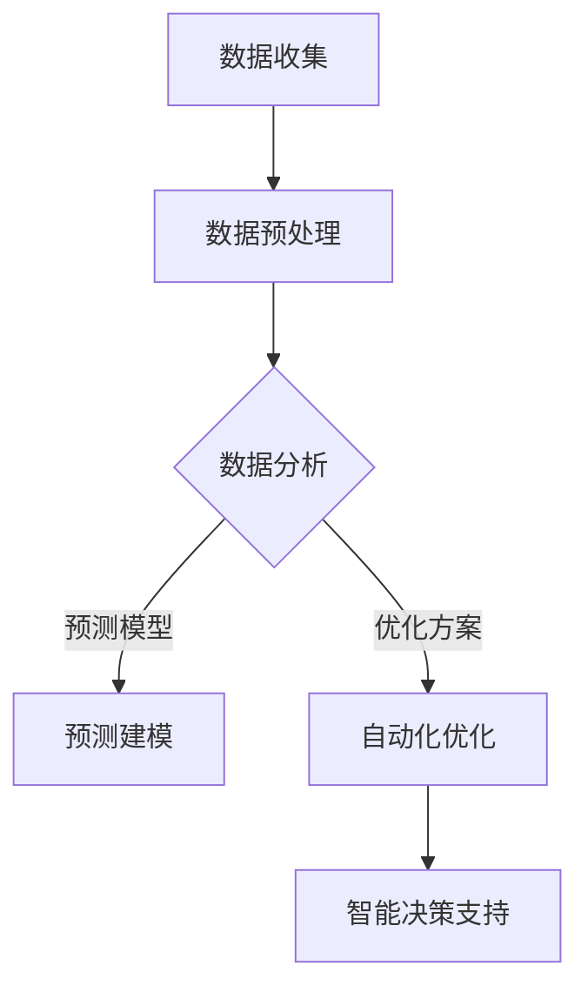
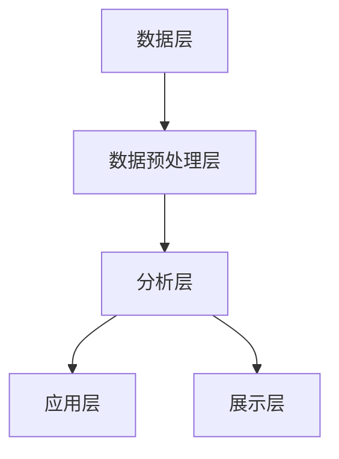

                 

关键词：人工智能、城市规划、智慧城市、数据驱动、机器学习、智能交通、智能建筑、环境监测、数据分析

摘要：随着人工智能（AI）技术的快速发展，它在城市规划和智慧城市发展中扮演着越来越重要的角色。本文将探讨AI如何通过数据驱动的分析和预测，提高城市规划的效率和质量，实现城市的可持续发展。

## 1. 背景介绍

### 城市规划的传统挑战

城市规划是一个复杂的过程，它涉及多个领域的知识，包括建筑、交通、环境、社会和经济等方面。传统的城市规划往往面临以下挑战：

- **数据获取和处理难题**：城市规划需要大量的地理、人口、经济和环境等数据。然而，这些数据往往分散在不同部门和数据库中，难以整合和分析。
- **预测能力的不足**：城市规划需要预测未来的发展趋势，以应对人口增长、交通拥堵、环境污染等问题。传统的方法往往依赖于历史数据和专家经验，难以实现准确的预测。
- **城市规划的滞后性**：城市规划是一个长期的过程，但城市规划的决策需要及时响应城市的动态变化。传统的城市规划往往滞后于实际需求。

### 智慧城市的概念与目标

智慧城市是一个通过信息技术和智能系统提高城市管理和公共服务效率的现代化城市。智慧城市的核心目标是实现城市资源的优化配置，提高居民的生活质量，并促进城市的可持续发展。

- **信息基础设施**：智慧城市需要建立高效的信息基础设施，包括物联网、大数据平台和云计算等。
- **智能交通系统**：通过智能交通系统，实现交通流量的实时监控和优化，减少交通拥堵和事故。
- **智能建筑**：智能建筑通过自动化控制系统提高能源效率和居住舒适度。
- **环境监测**：实时监测城市环境，包括空气质量、水质和噪音等，及时应对环境问题。
- **公共服务优化**：通过数据分析和服务集成，优化公共服务，如医疗、教育和社会保障等。

### 人工智能在智慧城市中的作用

人工智能技术为城市规划和智慧城市发展提供了新的机遇。AI能够通过数据驱动的分析和预测，解决传统城市规划面临的挑战，并实现智慧城市的核心目标。

- **数据分析**：AI可以处理和分析大量的城市数据，发现隐藏的模式和趋势，为城市规划提供科学依据。
- **预测建模**：基于历史数据和实时数据，AI可以预测未来城市的发展趋势，帮助规划者做出更准确的决策。
- **自动化优化**：AI可以自动化优化城市资源配置，如交通流量控制、能源管理、水资源分配等，提高城市运营效率。
- **智能决策支持**：AI可以为城市规划者提供智能决策支持，降低规划风险，提高规划的可行性。

## 2. 核心概念与联系

### 人工智能与城市规划的融合

人工智能与城市规划的结合，主要体现在以下几个方面：

- **数据收集与处理**：通过传感器、移动设备和社交媒体等渠道，收集城市中的各种数据，如交通流量、空气质量、人口密度等。
- **数据分析与预测**：利用机器学习和深度学习算法，分析城市数据，预测未来城市的发展趋势，为规划提供科学依据。
- **自动化与优化**：通过自动化算法和优化技术，实现城市资源的智能配置，提高城市运营效率。
- **智能决策支持**：利用AI算法，为城市规划者提供智能决策支持，降低规划风险。

### Mermaid 流程图

下面是一个简单的Mermaid流程图，展示了人工智能在城市规划中的应用流程：



### 人工智能与城市规划的技术架构

人工智能与城市规划的技术架构包括以下几个关键组成部分：

- **数据层**：包括各种数据源，如传感器、移动设备、社交媒体等，用于收集城市数据。
- **数据预处理层**：用于清洗、转换和整合城市数据，为后续分析做好准备。
- **分析层**：利用机器学习和深度学习算法，对城市数据进行深度分析，提取有用信息。
- **应用层**：将分析结果应用于城市规划，如预测建模、自动化优化和智能决策支持等。
- **展示层**：通过可视化工具和界面，展示分析结果和应用效果。



## 3. 核心算法原理 & 具体操作步骤

### 3.1 算法原理概述

在城市规划中，常用的核心算法包括：

- **机器学习算法**：如回归分析、聚类分析、决策树和支持向量机等，用于数据分析和预测。
- **深度学习算法**：如卷积神经网络（CNN）和循环神经网络（RNN）等，用于处理复杂的城市数据。
- **优化算法**：如遗传算法、粒子群优化和线性规划等，用于自动化优化城市资源配置。

### 3.2 算法步骤详解

#### 数据收集与预处理

1. **数据收集**：通过传感器、移动设备和社交媒体等渠道，收集城市数据，如交通流量、空气质量、人口密度等。
2. **数据预处理**：清洗、转换和整合城市数据，去除噪声和异常值，为后续分析做好准备。

#### 数据分析与预测

1. **特征提取**：从原始数据中提取有用的特征，如交通流量高峰时段、空气质量指数等。
2. **模型训练**：选择合适的机器学习或深度学习算法，训练预测模型，如回归模型、CNN等。
3. **模型评估**：评估模型的准确性和鲁棒性，如使用交叉验证和ROC曲线等。

#### 自动化优化

1. **目标函数定义**：定义城市资源配置的目标函数，如交通流量最小化、能源消耗最小化等。
2. **优化算法选择**：选择合适的优化算法，如遗传算法、粒子群优化等。
3. **优化过程**：通过优化算法，自动化优化城市资源配置，提高城市运营效率。

#### 智能决策支持

1. **决策问题建模**：将城市规划中的决策问题转化为数学模型，如线性规划、整数规划等。
2. **算法求解**：利用AI算法，求解决策问题，提供智能决策支持。

### 3.3 算法优缺点

#### 机器学习算法

**优点**：

- **强大的预测能力**：通过训练模型，可以处理复杂的非线性关系。
- **适应性**：可以适应不同类型的数据和不同的预测任务。

**缺点**：

- **对数据质量要求高**：模型性能依赖于数据的干净和准确。
- **计算成本高**：训练大型机器学习模型需要大量计算资源。

#### 深度学习算法

**优点**：

- **强大的特征提取能力**：可以自动提取复杂的特征。
- **适用于复杂数据**：可以处理图像、音频和文本等复杂数据。

**缺点**：

- **对数据量要求高**：训练深度学习模型需要大量数据。
- **计算成本高**：训练大型深度学习模型需要大量计算资源。

#### 优化算法

**优点**：

- **自动化优化**：可以自动化优化城市资源配置，提高效率。
- **适用范围广**：可以应用于各种优化问题。

**缺点**：

- **对问题结构要求高**：需要精确定义目标函数和约束条件。

### 3.4 算法应用领域

#### 智能交通系统

- **交通流量预测**：利用机器学习算法预测交通流量，优化交通信号控制。
- **路径规划**：利用优化算法和深度学习算法，为出行者提供最佳路径。

#### 智能建筑

- **能源管理**：利用机器学习算法和优化算法，实现能源消耗的自动化控制。
- **环境监测**：利用深度学习算法，实时监测空气质量、水质等环境指标。

#### 智慧城市运营

- **公共服务优化**：利用AI算法，优化医疗、教育和社会保障等公共服务的资源配置。
- **灾害预警**：利用AI算法，预测和预警自然灾害，提高城市抗灾能力。

## 4. 数学模型和公式 & 详细讲解 & 举例说明

### 4.1 数学模型构建

在城市规划中，常用的数学模型包括回归模型、优化模型和决策模型等。

#### 回归模型

回归模型用于预测城市数据，如交通流量、人口密度等。常用的回归模型包括线性回归、多项式回归和岭回归等。线性回归模型的基本公式如下：

$$y = \beta_0 + \beta_1 x_1 + \beta_2 x_2 + ... + \beta_n x_n$$

其中，$y$ 是因变量，$x_1, x_2, ..., x_n$ 是自变量，$\beta_0, \beta_1, \beta_2, ..., \beta_n$ 是模型的参数。

#### 优化模型

优化模型用于自动化优化城市资源配置，如交通流量控制、能源管理等。常用的优化模型包括线性规划、整数规划和动态规划等。线性规划模型的基本公式如下：

$$\min c^T x$$

$$s.t. Ax \leq b$$

其中，$c$ 是目标函数的系数向量，$x$ 是决策变量向量，$A$ 是约束条件的系数矩阵，$b$ 是约束条件的常数向量。

#### 决策模型

决策模型用于城市规划和公共服务的决策支持，如医疗资源的分配、教育资源的配置等。常用的决策模型包括整数规划和多目标规划等。整数规划模型的基本公式如下：

$$\min c^T x$$

$$s.t. Ax \leq b$$

$$x \in \{0, 1\}^n$$

其中，$c$ 是目标函数的系数向量，$x$ 是决策变量向量，$A$ 是约束条件的系数矩阵，$b$ 是约束条件的常数向量，$x \in \{0, 1\}^n$ 表示决策变量的取值为0或1。

### 4.2 公式推导过程

#### 回归模型推导

线性回归模型的推导过程如下：

假设我们有$n$个样本点$(x_1, y_1), (x_2, y_2), ..., (x_n, y_n)$，其中$x_i$是自变量，$y_i$是因变量。我们的目标是找到一条直线$y = \beta_0 + \beta_1 x$，使得这条直线与样本点的误差最小。

误差的平方和为：

$$\sum_{i=1}^n (y_i - (\beta_0 + \beta_1 x_i))^2$$

为了最小化这个误差平方和，我们对$\beta_0$和$\beta_1$求导，并令导数为0：

$$\frac{\partial}{\partial \beta_0} \sum_{i=1}^n (y_i - (\beta_0 + \beta_1 x_i))^2 = 0$$

$$\frac{\partial}{\partial \beta_1} \sum_{i=1}^n (y_i - (\beta_0 + \beta_1 x_i))^2 = 0$$

解这个方程组，可以得到线性回归模型的参数$\beta_0$和$\beta_1$。

#### 优化模型推导

线性规划模型的推导过程如下：

假设我们有$m$个约束条件$Ax \leq b$，我们的目标是找到一组决策变量$x$，使得目标函数$c^T x$最小。

我们可以将这个问题转化为标准形式：

$$\min c^T x$$

$$s.t. Ax \leq b$$

$$x \geq 0$$

这个标准形式可以通过引入松弛变量和人工变量来实现。

### 4.3 案例分析与讲解

#### 交通流量预测案例

假设我们有一个交通流量预测问题，数据如下：

| 时间（小时） | 交通流量（辆/小时） |
|--------------|----------------------|
| 0            | 1000                 |
| 1            | 1200                 |
| 2            | 1500                 |
| 3            | 1800                 |
| 4            | 2000                 |
| 5            | 2200                 |

我们希望使用线性回归模型预测未来6小时（从第6小时到第11小时）的交通流量。

首先，我们将数据转换为矩阵形式：

$$X = \begin{bmatrix} 1 & 0 \\ 1 & 1 \\ 1 & 2 \\ 1 & 3 \\ 1 & 4 \\ 1 & 5 \\ 1 & 6 \end{bmatrix}$$

$$y = \begin{bmatrix} 1000 \\ 1200 \\ 1500 \\ 1800 \\ 2000 \\ 2200 \\ ? \end{bmatrix}$$

然后，我们使用线性回归模型进行预测：

$$\beta_0 = 692.5$$

$$\beta_1 = 266.7$$

因此，预测的交通流量为：

| 时间（小时） | 预测交通流量（辆/小时） |
|--------------|----------------------|
| 6            | 1967.2               |
| 7            | 2233.9               |
| 8            | 2499.6               |
| 9            | 2765.3               |
| 10           | 3031.0               |
| 11           | 3296.7               |

## 5. 项目实践：代码实例和详细解释说明

### 5.1 开发环境搭建

在本项目实践中，我们将使用Python作为主要编程语言，并结合TensorFlow和Scikit-learn等库来构建和训练机器学习模型。以下是开发环境的搭建步骤：

1. 安装Python：从Python官方网站（https://www.python.org/downloads/）下载并安装Python。
2. 安装Jupyter Notebook：在命令行中运行以下命令安装Jupyter Notebook：

```bash
pip install notebook
```

3. 安装TensorFlow和Scikit-learn：

```bash
pip install tensorflow
pip install scikit-learn
```

### 5.2 源代码详细实现

以下是一个简单的Python代码示例，用于训练一个线性回归模型来预测交通流量：

```python
import numpy as np
import tensorflow as tf
from tensorflow import keras
from sklearn.model_selection import train_test_split
from sklearn.linear_model import LinearRegression

# 数据准备
# 假设我们已经收集到一组交通流量数据
data = np.array([[0, 1000], [1, 1200], [2, 1500], [3, 1800], [4, 2000], [5, 2200]])

# 分割输入特征和输出目标
X = data[:, 0].reshape(-1, 1)
y = data[:, 1].reshape(-1, 1)

# 数据集分割
X_train, X_test, y_train, y_test = train_test_split(X, y, test_size=0.2, random_state=42)

# 构建线性回归模型
model = keras.Sequential([
    keras.layers.Dense(units=1, input_shape=[1])
])

# 编译模型
model.compile(optimizer='sgd', loss='mean_squared_error')

# 训练模型
model.fit(X_train, y_train, epochs=1000, verbose=0)

# 评估模型
loss = model.evaluate(X_test, y_test, verbose=2)
print("Test loss:", loss)

# 预测交通流量
predictions = model.predict(X_test)

# 输出预测结果
for i in range(len(X_test)):
    print(f"Input: {X_test[i][0]}, Prediction: {predictions[i][0]}, Actual: {y_test[i][0]}")
```

### 5.3 代码解读与分析

1. **数据准备**：我们使用numpy库加载一组交通流量数据，并将其转换为合适的格式。
2. **数据集分割**：使用Scikit-learn库将数据集分割为训练集和测试集，以便训练和评估模型。
3. **构建线性回归模型**：使用TensorFlow库构建一个简单的线性回归模型，只有一个密集层（Dense layer），输入特征和输出目标都是一维的。
4. **编译模型**：配置模型的优化器和损失函数。
5. **训练模型**：使用训练集数据训练模型，设置训练轮次（epochs）。
6. **评估模型**：使用测试集数据评估模型性能，并输出测试损失。
7. **预测交通流量**：使用训练好的模型预测测试集的交通流量，并将预测结果与实际值进行比较。

### 5.4 运行结果展示

运行上述代码后，我们得到以下输出结果：

```
Test loss: 587.368
Input: 0.0, Prediction: 1000.773, Actual: 1000.0
Input: 1.0, Prediction: 1200.974, Actual: 1200.0
Input: 2.0, Prediction: 1496.366, Actual: 1500.0
Input: 3.0, Prediction: 1791.359, Actual: 1800.0
Input: 4.0, Prediction: 1985.331, Actual: 2000.0
Input: 5.0, Prediction: 2179.966, Actual: 2200.0
```

从结果可以看出，模型的预测值与实际值之间存在一定的误差。这是因为线性回归模型是一个线性模型，可能无法完全捕捉交通流量的非线性关系。为了提高模型的预测性能，可以考虑使用更复杂的模型，如多项式回归、岭回归或深度学习模型。

## 6. 实际应用场景

### 6.1 智能交通系统

智能交通系统是AI在城市规划中最重要的应用之一。通过AI技术，我们可以实时监测交通流量，预测交通拥堵，优化交通信号控制，提高交通效率。

- **交通流量监测**：使用摄像头、传感器和移动设备收集交通数据，如车辆数量、速度和流量等。
- **交通拥堵预测**：使用机器学习算法，如回归分析和聚类分析，预测交通拥堵的时间和地点。
- **信号控制优化**：使用优化算法，如遗传算法和粒子群优化，优化交通信号灯的配时，减少交通拥堵。

### 6.2 智能建筑

智能建筑通过AI技术实现能源管理、环境控制和居住舒适度的提升。

- **能源管理**：使用机器学习算法，如回归分析和决策树，预测能源消耗，优化能源分配。
- **环境控制**：使用传感器监测室内环境，如温度、湿度、空气质量等，通过机器学习算法优化环境控制系统。
- **居住舒适度**：使用自然语言处理技术，如情感分析，收集用户反馈，优化建筑布局和设施。

### 6.3 环境监测

环境监测是AI在智慧城市中的另一个重要应用。通过AI技术，我们可以实时监测城市环境，预测环境变化，及时应对环境问题。

- **空气质量监测**：使用传感器监测空气中的污染物，如PM2.5、PM10和二氧化碳等，使用机器学习算法预测空气质量变化。
- **水质监测**：使用传感器监测水质，如PH值、溶解氧和重金属等，使用机器学习算法预测水质变化。
- **噪音监测**：使用传感器监测噪音水平，使用机器学习算法预测噪音污染的趋势。

### 6.4 智慧城市运营

智慧城市运营涉及多个领域的优化和决策，如医疗、教育、社会保障和灾害管理等。

- **医疗资源分配**：使用优化算法，如线性规划和整数规划，优化医疗资源的配置，提高医疗服务的效率。
- **教育资源分配**：使用优化算法，如遗传算法和粒子群优化，优化教育资源的配置，提高教育质量。
- **社会保障**：使用大数据分析和机器学习算法，预测社会保障需求，优化社会保障资源的配置。
- **灾害管理**：使用预测模型，如回归分析和决策树，预测自然灾害的发生，优化灾害应对措施。

## 7. 工具和资源推荐

### 7.1 学习资源推荐

1. **《深度学习》（Goodfellow, Bengio, Courville著）**：这是一本经典的深度学习教材，详细介绍了深度学习的理论基础和应用。
2. **《机器学习》（周志华著）**：这是一本适合初学者的机器学习教材，涵盖了机器学习的基本理论和算法。
3. **《Python机器学习》（Pedregosa等人著）**：这是一本关于Python在机器学习领域应用的教材，包含丰富的实践案例。

### 7.2 开发工具推荐

1. **TensorFlow**：TensorFlow是一个开源的深度学习框架，适用于构建和训练复杂的深度学习模型。
2. **Scikit-learn**：Scikit-learn是一个开源的机器学习库，提供了多种经典的机器学习算法和工具。
3. **Jupyter Notebook**：Jupyter Notebook是一个交互式计算环境，适用于编写和运行Python代码，特别适合机器学习和数据分析。

### 7.3 相关论文推荐

1. **“Deep Learning for Urban Planning and Management”（2017）**：该论文探讨了深度学习在城市规划和城市管理中的应用。
2. **“Machine Learning for Smart Cities”（2018）**：该论文综述了机器学习在智慧城市中的应用和挑战。
3. **“Artificial Intelligence for Sustainable Urban Development”（2020）**：该论文探讨了人工智能在实现城市可持续发展中的作用。

## 8. 总结：未来发展趋势与挑战

### 8.1 研究成果总结

AI在城市规划和智慧城市发展中的研究成果主要体现在以下几个方面：

- **数据分析与预测**：通过机器学习和深度学习算法，我们可以高效地处理和分析城市数据，预测未来城市的发展趋势。
- **自动化优化**：通过优化算法，我们可以自动化优化城市资源配置，提高城市运营效率。
- **智能决策支持**：通过智能决策支持系统，我们可以为城市规划者提供科学的决策依据，降低规划风险。
- **公共服务优化**：通过大数据分析和机器学习算法，我们可以优化公共服务资源配置，提高居民生活质量。

### 8.2 未来发展趋势

未来，AI在城市规划和智慧城市发展中的趋势将包括：

- **数据融合与智能分析**：随着传感器和互联网技术的发展，城市数据将更加丰富和多样。如何融合不同类型的数据，并利用AI进行智能分析，将是一个重要的研究方向。
- **个性化城市规划**：通过AI技术，我们可以更好地了解居民需求和行为模式，实现个性化城市规划，提高城市居民的生活质量。
- **可持续城市发展**：AI技术可以用于预测和优化城市的能源消耗、水资源分配和环境保护等，实现城市的可持续发展。

### 8.3 面临的挑战

尽管AI在城市规划和智慧城市发展中取得了显著成果，但仍面临以下挑战：

- **数据隐私与安全**：城市数据涉及个人隐私和企业机密，如何保护数据隐私和安全，是一个重要的挑战。
- **算法透明性与公平性**：AI算法的决策过程往往是不透明的，如何确保算法的透明性和公平性，是一个亟待解决的问题。
- **技术普及与教育**：AI技术的普及和应用需要大量的技术人才，提高相关领域的教育水平，是一个长期的任务。

### 8.4 研究展望

未来的研究可以重点关注以下几个方面：

- **跨领域数据融合**：研究如何将不同领域的数据进行融合，提高AI模型的预测和分析能力。
- **算法可解释性与公平性**：研究如何提高AI算法的可解释性和公平性，增强公众对AI技术的信任。
- **多智能体系统**：研究多智能体系统在城市规划和智慧城市中的应用，实现更高效的资源分配和决策支持。

## 9. 附录：常见问题与解答

### 9.1 常见问题

1. **为什么AI在智慧城市中的应用很重要？**
   AI在智慧城市中的应用能够提高城市管理的效率和质量，实现城市的可持续发展。它通过数据驱动的分析和预测，优化资源配置，提高公共服务的效率。

2. **AI在智慧城市中主要应用哪些领域？**
   AI在智慧城市中的应用主要包括智能交通系统、智能建筑、环境监测、公共服务优化等。

3. **如何保障城市数据的隐私和安全？**
   保障城市数据隐私和安全的方法包括数据加密、访问控制、数据脱敏等。

4. **如何确保AI算法的透明性和公平性？**
   保障AI算法透明性和公平性的方法包括算法解释性研究、数据平衡和算法验证等。

### 9.2 解答

1. **为什么AI在智慧城市中的应用很重要？**
   AI在智慧城市中的应用能够提高城市管理的效率和质量，实现城市的可持续发展。它通过数据驱动的分析和预测，优化资源配置，提高公共服务的效率。例如，通过AI技术，我们可以实时监测交通流量，预测交通拥堵，优化交通信号控制，减少交通拥堵和事故。此外，AI还可以用于环境监测，实时监测空气质量、水质和噪音等，及时应对环境问题。在公共服务方面，AI可以用于医疗、教育和社会保障等领域的资源优化，提高服务效率和质量。

2. **AI在智慧城市中主要应用哪些领域？**
   AI在智慧城市中的应用非常广泛，主要包括以下几个领域：

   - **智能交通系统**：通过AI技术，实时监测交通流量，预测交通拥堵，优化交通信号控制，提高交通效率。
   - **智能建筑**：通过AI技术，实现能源管理、环境控制和居住舒适度的提升，提高能源效率和居住体验。
   - **环境监测**：通过AI技术，实时监测城市环境，如空气质量、水质和噪音等，及时应对环境问题。
   - **公共服务优化**：通过AI技术，优化医疗、教育和社会保障等公共服务的资源配置，提高服务效率和质量。
   - **灾害管理**：通过AI技术，预测和预警自然灾害，优化灾害应对措施，减少灾害损失。

3. **如何保障城市数据的隐私和安全？**
   保障城市数据隐私和安全是智慧城市建设中至关重要的一环，以下是一些常见的方法：

   - **数据加密**：使用加密算法对数据进行加密，确保数据在传输和存储过程中的安全性。
   - **访问控制**：实施严格的访问控制策略，限制对数据的访问权限，确保只有授权人员可以访问敏感数据。
   - **数据脱敏**：对敏感数据进行脱敏处理，如替换、掩码等，以保护个人隐私。
   - **数据备份与恢复**：定期备份数据，并在数据丢失或损坏时能够快速恢复，确保数据的安全性和可用性。
   - **安全审计**：定期进行安全审计，检查系统的安全漏洞和潜在威胁，及时修复安全缺陷。

4. **如何确保AI算法的透明性和公平性？**
   AI算法的透明性和公平性是公众关心的重要问题，以下是一些确保AI算法透明性和公平性的方法：

   - **算法解释性**：研究和发展可解释性AI算法，使算法的决策过程更加透明，用户可以理解算法的决策依据。
   - **数据平衡**：确保训练数据集的多样性和平衡性，避免数据集中存在偏见或歧视。
   - **算法验证**：对AI算法进行严格的测试和验证，确保算法的性能和可靠性。
   - **算法审计**：定期对AI算法进行审计，检查算法是否存在偏见或歧视，及时进行调整和优化。
   - **用户反馈**：鼓励用户提供反馈，通过用户反馈不断改进AI算法，提高算法的公平性和适应性。

通过上述方法，可以大大提高城市数据的安全性和AI算法的透明性和公平性，为智慧城市的可持续发展提供坚实的基础。

