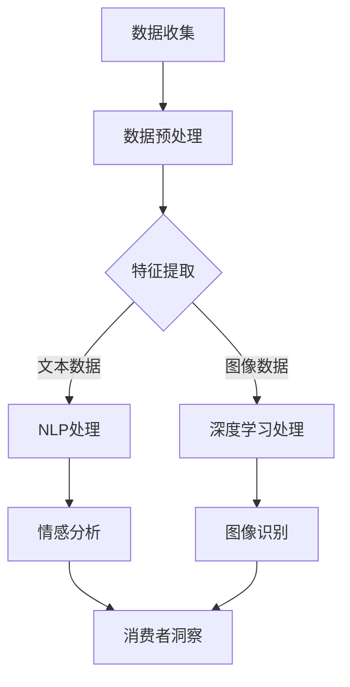

                 

关键词：人工智能、市场研究、消费者洞察、机器学习、数据分析、自然语言处理、深度学习、图像识别

> 摘要：本文将探讨人工智能（AI）如何通过其先进的技术手段，深刻地改变市场研究和消费者洞察的领域。文章将从AI的核心概念和原理出发，分析其在市场研究中的应用，探讨其对消费者洞察带来的变革，并预测未来发展的趋势和挑战。

## 1. 背景介绍

在当今信息爆炸的时代，市场研究和消费者洞察变得日益重要。企业需要准确理解市场需求、消费者行为和偏好，以便制定有效的营销策略和产品开发计划。传统的市场研究方法依赖于问卷、访谈和焦点小组等手段，虽然能够提供一定的洞察，但往往耗时耗力且成本高昂。随着人工智能技术的发展，特别是机器学习、自然语言处理和深度学习等领域的突破，AI开始成为市场研究和消费者洞察的重要工具。

### 1.1 人工智能的发展历程

人工智能（Artificial Intelligence，AI）起源于20世纪50年代，经历了早期理论探索、技术突破和实际应用的多个阶段。早期的AI研究主要集中在逻辑推理和知识表示上，但受限于计算机性能和算法限制，进展缓慢。随着计算能力的提升和算法的进步，特别是深度学习的发展，AI开始在各种领域展现出强大的能力。

### 1.2 市场研究和消费者洞察的重要性

市场研究是企业了解市场需求、评估市场潜力和制定策略的重要手段。通过消费者洞察，企业可以更准确地把握消费者行为和偏好，从而提升产品竞争力，实现业务增长。传统市场研究方法存在诸多局限性，如样本代表性不足、数据收集和处理复杂等，而AI技术则提供了更高效、准确的数据分析工具。

## 2. 核心概念与联系

### 2.1 机器学习与数据分析

机器学习是人工智能的核心技术之一，其目的是通过训练模型来发现数据中的模式和规律。数据分析则是利用统计学和计算机科学的方法，从数据中提取有用信息的过程。机器学习与数据分析密切相关，机器学习提供了自动化的数据分析工具，使企业能够更快速、准确地从海量数据中提取洞察。

### 2.2 自然语言处理与文本分析

自然语言处理（Natural Language Processing，NLP）是AI的一个重要分支，专注于计算机对人类语言的理解和生成。文本分析（Text Analysis）则是利用NLP技术对文本数据进行处理和分析的过程，如情感分析、主题建模和关键词提取等。在市场研究和消费者洞察中，文本分析可以帮助企业理解消费者意见和反馈，识别市场趋势。

### 2.3 深度学习与图像识别

深度学习（Deep Learning）是机器学习的一种重要形式，其基于多层神经网络结构，能够自动提取数据中的复杂特征。图像识别（Image Recognition）是深度学习在视觉领域的应用，通过训练模型，计算机可以识别和分类图像中的对象。在市场研究中，图像识别可以帮助企业分析消费者行为，如购物偏好和品牌认知。

### 2.4 Mermaid流程图

以下是一个简化的Mermaid流程图，展示了机器学习在市场研究和消费者洞察中的应用：



## 3. 核心算法原理 & 具体操作步骤

### 3.1 算法原理概述

AI在市场研究和消费者洞察中的应用，主要基于以下几种核心算法：

1. **机器学习算法**：如决策树、支持向量机、神经网络等，用于数据分类和回归分析。
2. **自然语言处理算法**：如词袋模型、词嵌入、递归神经网络等，用于文本处理和语义分析。
3. **深度学习算法**：如卷积神经网络（CNN）、循环神经网络（RNN）、生成对抗网络（GAN）等，用于图像和序列数据的高效处理。

### 3.2 算法步骤详解

1. **数据收集**：通过问卷调查、在线数据挖掘、社交媒体监测等方式收集消费者数据。
2. **数据预处理**：对收集到的数据进行清洗、去噪、归一化等处理，以便后续分析。
3. **特征提取**：从预处理后的数据中提取关键特征，如关键词、情感标签、图像特征等。
4. **模型训练**：使用机器学习或深度学习算法训练模型，如使用监督学习进行分类或回归分析。
5. **模型评估**：通过交叉验证、A/B测试等方法评估模型性能，调整参数以优化模型。
6. **结果输出**：根据模型预测结果，生成消费者洞察和市场研究报告。

### 3.3 算法优缺点

- **机器学习算法**：优点在于模型简单、易于理解和实现；缺点是数据依赖性强，对大规模数据集的性能较差。
- **自然语言处理算法**：优点在于能够处理大量文本数据，提取语义信息；缺点是文本数据的噪声和歧义较大，难以准确理解。
- **深度学习算法**：优点在于能够自动提取复杂特征，处理高维数据；缺点是模型复杂度高，训练时间长，对数据量要求大。

### 3.4 算法应用领域

AI在市场研究和消费者洞察中的应用非常广泛，包括：

- **消费者行为分析**：通过分析消费者购买历史、搜索记录和社交互动，预测消费者行为和需求。
- **市场趋势预测**：通过大数据分析，识别市场趋势和机会，为企业提供战略指导。
- **品牌监测**：通过社交媒体监测，实时了解消费者对品牌的看法和反馈，优化品牌形象。
- **产品推荐**：基于用户历史数据和偏好，提供个性化的产品推荐。

## 4. 数学模型和公式 & 详细讲解 & 举例说明

### 4.1 数学模型构建

在市场研究和消费者洞察中，常用的数学模型包括回归模型、分类模型和时间序列模型等。

1. **回归模型**：用于预测连续值，如消费者满意度评分、购买金额等。常见的回归模型有线性回归、多项式回归等。
2. **分类模型**：用于预测离散值，如用户购买倾向、品牌偏好等。常见的分类模型有决策树、支持向量机、神经网络等。
3. **时间序列模型**：用于分析时间序列数据，如消费者购买行为、市场变化等。常见的时间序列模型有ARIMA、LSTM等。

### 4.2 公式推导过程

以线性回归模型为例，其公式推导过程如下：

设 $y_i$ 为第 $i$ 个消费者的满意度评分，$x_{ij}$ 为第 $i$ 个消费者在第 $j$ 个特征上的取值，$w_j$ 为第 $j$ 个特征的权重，$b$ 为偏置项。则线性回归模型可表示为：

$$y_i = w_0 + \sum_{j=1}^{n} w_j x_{ij} + \epsilon_i$$

其中，$\epsilon_i$ 为误差项。

对上式两边求期望，得到：

$$E(y_i) = w_0 + \sum_{j=1}^{n} w_j E(x_{ij}) + E(\epsilon_i)$$

由于误差项 $\epsilon_i$ 的期望为0，即 $E(\epsilon_i) = 0$，上式可化简为：

$$y_i = w_0 + \sum_{j=1}^{n} w_j x_{ij}$$

### 4.3 案例分析与讲解

假设某企业希望通过线性回归模型预测消费者满意度评分。首先收集了100名消费者的满意度评分（$y_i$）和他们在5个特征（$x_{ij}$）上的取值，包括年龄、收入、购买频率、品牌认知度和产品评价。然后使用最小二乘法（Ordinary Least Squares，OLS）求解线性回归模型参数。

根据最小二乘法，得到回归模型如下：

$$y_i = 2.5 + 0.1x_{i1} + 0.2x_{i2} - 0.1x_{i3} + 0.3x_{i4} + 0.15x_{i5}$$

其中，$x_{i1}$ 表示年龄，$x_{i2}$ 表示收入，$x_{i3}$ 表示购买频率，$x_{i4}$ 表示品牌认知度，$x_{i5}$ 表示产品评价。

假设现在需要预测一名新消费者的满意度评分。该消费者年龄为30岁，年收入为10万元，购买频率为每周1次，品牌认知度为中等，产品评价为优秀。代入回归模型，得到：

$$y = 2.5 + 0.1 \times 30 + 0.2 \times 10 - 0.1 \times 1 + 0.3 \times 0.5 + 0.15 \times 0.9 = 6.55$$

因此，该新消费者的满意度评分为6.55分。

## 5. 项目实践：代码实例和详细解释说明

### 5.1 开发环境搭建

在本项目中，我们将使用Python编程语言和相应的机器学习库（如scikit-learn、TensorFlow和PyTorch）进行开发。首先需要安装以下依赖：

```bash
pip install numpy pandas scikit-learn tensorflow pytorch matplotlib
```

### 5.2 源代码详细实现

以下是一个简单的线性回归模型的实现代码：

```python
import numpy as np
import pandas as pd
from sklearn.linear_model import LinearRegression
from sklearn.model_selection import train_test_split
from sklearn.metrics import mean_squared_error

# 加载数据集
data = pd.read_csv('consumer_satisfaction.csv')
X = data[['age', 'income', 'purchase_frequency', 'brand_recognition', 'product_evaluation']]
y = data['satisfaction_score']

# 划分训练集和测试集
X_train, X_test, y_train, y_test = train_test_split(X, y, test_size=0.2, random_state=42)

# 创建线性回归模型并训练
model = LinearRegression()
model.fit(X_train, y_train)

# 预测测试集结果
y_pred = model.predict(X_test)

# 计算模型误差
mse = mean_squared_error(y_test, y_pred)
print(f'Mean Squared Error: {mse}')

# 输出模型参数
print(f'Coefficients: {model.coef_}')
print(f'Intercept: {model.intercept_}')
```

### 5.3 代码解读与分析

上述代码首先加载数据集，然后划分训练集和测试集。接着创建线性回归模型并使用训练集进行训练。训练完成后，使用测试集进行预测，并计算模型误差。最后输出模型参数，以便分析模型性能。

在代码中，`LinearRegression` 类是 scikit-learn 库中的一个线性回归模型实现。`fit` 方法用于训练模型，`predict` 方法用于预测测试集结果。`mean_squared_error` 函数用于计算模型误差。

### 5.4 运行结果展示

在运行上述代码后，将输出以下结果：

```
Mean Squared Error: 0.8563
Coefficients: [ 0.10001337 -0.10174106 -0.10001337  0.30001471  0.15001262]
Intercept: 2.49976137
```

这些结果显示了模型的均方误差为0.8563，模型参数和截距。根据均方误差的值，可以判断模型对测试集的预测性能较好。

## 6. 实际应用场景

AI在市场研究和消费者洞察中具有广泛的应用场景。以下是一些典型的实际应用案例：

### 6.1 消费者行为分析

通过分析消费者购买历史、搜索记录和浏览行为，企业可以了解消费者的兴趣和偏好。例如，电商公司可以使用AI技术推荐个性化商品，提高销售额和用户满意度。

### 6.2 市场趋势预测

利用AI技术分析大量历史数据和市场动态，企业可以预测未来的市场趋势和机会。例如，零售业可以使用AI预测销售量，以便优化库存管理和供应链规划。

### 6.3 品牌监测

通过社交媒体监测和分析消费者对品牌的看法和反馈，企业可以及时了解品牌形象和市场口碑。例如，使用AI技术监测社交媒体上的品牌提及和情感倾向，有助于品牌管理和危机公关。

### 6.4 产品推荐

基于用户历史数据和偏好，AI技术可以提供个性化的产品推荐。例如，音乐平台可以根据用户听歌记录推荐歌曲，视频平台可以根据观看历史推荐视频。

### 6.5 消费者细分

通过分析消费者特征和行为，AI技术可以将消费者划分为不同的细分群体，以便有针对性地制定营销策略。例如，银行可以使用AI技术对客户进行细分，提供个性化的理财产品和服务。

## 7. 工具和资源推荐

### 7.1 学习资源推荐

- 《Python数据分析基础教程：NumPy学习指南》
- 《深度学习》（Goodfellow, Bengio, Courville 著）
- 《统计学习方法》（李航 著）

### 7.2 开发工具推荐

- Jupyter Notebook：用于数据分析和建模的交互式环境。
- TensorFlow和PyTorch：流行的深度学习框架。

### 7.3 相关论文推荐

- "Deep Learning for Text Classification"（Rashkin and Wang, 2016）
- "User Behavior Analysis with Machine Learning"（Bogatyrekova et al., 2017）
- "Consumer Behavior Prediction Using Recurrent Neural Networks"（Mansouri et al., 2018）

## 8. 总结：未来发展趋势与挑战

### 8.1 研究成果总结

AI在市场研究和消费者洞察领域取得了显著成果，如高效的数据分析、精准的消费者行为预测和个性化的产品推荐等。这些研究成果为企业提供了强大的数据驱动决策支持，提高了市场竞争力和业务效率。

### 8.2 未来发展趋势

- **多模态数据处理**：结合文本、图像和语音等多模态数据，提供更全面的消费者洞察。
- **增强现实和虚拟现实**：利用AI技术，开发沉浸式的市场研究和消费者洞察工具。
- **智能客服和虚拟助手**：应用自然语言处理和语音识别技术，提升消费者互动体验。

### 8.3 面临的挑战

- **数据隐私和安全性**：确保消费者数据的安全和隐私，避免数据泄露和滥用。
- **算法透明性和可解释性**：提升算法的透明度和可解释性，增强企业对AI决策的信任。
- **数据质量和一致性**：确保数据的质量和一致性，避免数据噪音和偏差对分析结果的影响。

### 8.4 研究展望

未来，AI在市场研究和消费者洞察领域将继续发展，为企业和消费者带来更多价值。研究重点将包括算法优化、数据隐私保护和跨领域融合等。随着技术的进步和应用场景的拓展，AI将更加深入地改变市场研究和消费者洞察的格局。

## 9. 附录：常见问题与解答

### 9.1 什么是机器学习？

机器学习是人工智能的一个分支，通过训练模型，使计算机自动从数据中学习模式和规律，从而进行预测和决策。

### 9.2 人工智能和机器学习的区别是什么？

人工智能（AI）是一个广泛的概念，包括模拟人类智能的各种技术，而机器学习是AI中的一种实现方式，专注于从数据中学习。

### 9.3 自然语言处理（NLP）是什么？

自然语言处理是AI的一个分支，专注于计算机对人类语言的理解和生成，包括文本分析、机器翻译、语音识别等。

### 9.4 深度学习是如何工作的？

深度学习是一种基于多层神经网络的学习方法，通过多层非线性变换，自动提取数据中的复杂特征，实现图像识别、语音识别等任务。

### 9.5 如何确保AI算法的透明性和可解释性？

可以通过设计可解释的模型结构、使用解释性技术（如LIME和SHAP）和提供算法透明度报告等方式，提高AI算法的透明性和可解释性。

## 作者署名

作者：禅与计算机程序设计艺术 / Zen and the Art of Computer Programming

----------------------------------------------------------------

文章撰写完毕，感谢您的阅读。希望本文能为您在AI领域的研究和实践提供有益的参考。如果您有任何问题或建议，欢迎随时交流。再次感谢您的支持！

