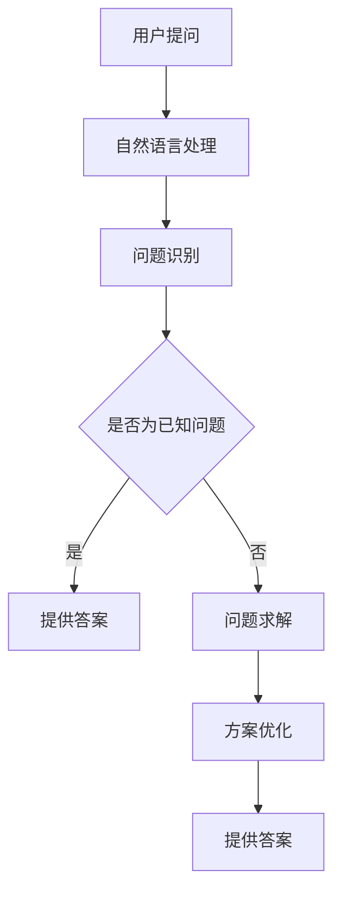

                 

关键词：人工智能，提问，思考，算法，认知，自然语言处理，机器学习

> 摘要：本文探讨了人工智能（AI）如何改变我们提问和思考的方式。通过介绍AI的核心技术和应用，分析其在提高问题求解效率和促进创新思维方面的作用，探讨AI对传统认知模式的影响，并展望未来AI技术对人类提问与思考的潜在变革。

## 1. 背景介绍

随着人工智能（AI）技术的迅猛发展，人类的生活和工作方式正在发生深刻变革。AI通过模拟人类智能，实现了图像识别、自然语言处理、机器学习、深度学习等一系列功能，不仅提高了各行各业的效率，也改变了人们传统的认知模式。在AI技术的影响下，我们提问和思考的方式也在悄然发生变化。

本文将从以下几个方面展开讨论：

1. **AI的核心技术及其在提问与思考中的应用**：介绍AI的基本概念和技术原理，分析其在问题求解和创新思维中的具体应用。
2. **AI如何改变我们的认知模式**：探讨AI如何影响我们的思维习惯、决策过程和问题解决策略。
3. **AI与人类提问方式的融合**：分析AI技术在自然语言处理方面的进展，探讨如何将AI与人类的提问习惯相结合。
4. **未来展望**：预测AI技术对未来提问和思考方式的潜在影响，以及可能面临的挑战和机遇。

## 2. 核心概念与联系

### 2.1. 人工智能的基本概念

人工智能（Artificial Intelligence，简称AI）是指通过计算机系统模拟人类智能的能力，包括学习、推理、规划、感知和自然语言处理等。AI的核心目标是使计算机能够像人类一样理解、学习和适应复杂的环境。

### 2.2. AI的核心技术

- **机器学习**：机器学习是AI的核心技术之一，通过训练模型来识别模式和做出预测。常见的机器学习方法包括监督学习、无监督学习和强化学习。
- **深度学习**：深度学习是机器学习的一种形式，通过多层神经网络模拟人类大脑的神经元连接，进行复杂的特征提取和模式识别。
- **自然语言处理**：自然语言处理（Natural Language Processing，简称NLP）是AI的一个重要分支，专注于让计算机理解和生成人类语言。

### 2.3. AI在提问与思考中的应用

- **智能搜索与推荐**：利用机器学习和深度学习技术，AI可以分析用户的提问习惯和偏好，提供个性化的搜索结果和推荐内容。
- **问题求解与优化**：通过模拟人类思维过程，AI可以快速识别问题、提出解决方案，并在复杂问题上进行优化。
- **智能对话系统**：利用NLP技术，AI可以与用户进行自然语言交互，理解用户的提问并提供相应答案。

### 2.4. Mermaid流程图

以下是一个简单的Mermaid流程图，展示了AI在提问与思考中的应用流程：



## 3. 核心算法原理 & 具体操作步骤

### 3.1. 算法原理概述

在AI技术中，常用的核心算法包括机器学习算法、深度学习算法和自然语言处理算法。以下分别简要介绍这些算法的基本原理。

- **机器学习算法**：机器学习算法通过训练数据集，使计算机学会识别模式和做出预测。常见的机器学习算法包括线性回归、决策树、支持向量机等。
- **深度学习算法**：深度学习算法通过多层神经网络，对输入数据进行分析和处理，实现复杂的特征提取和模式识别。常见的深度学习算法包括卷积神经网络（CNN）、循环神经网络（RNN）等。
- **自然语言处理算法**：自然语言处理算法通过分析文本数据，实现文本分类、情感分析、命名实体识别等功能。常见的自然语言处理算法包括词袋模型、TF-IDF模型、序列标注模型等。

### 3.2. 算法步骤详解

以自然语言处理算法为例，以下是具体的操作步骤：

1. **数据收集与预处理**：收集大量文本数据，并进行数据清洗、去噪和标准化处理，确保数据的质量和一致性。
2. **特征提取**：将文本数据转化为计算机可处理的数字形式，例如词向量或词袋模型。
3. **模型训练**：利用训练数据集，训练机器学习或深度学习模型，使其能够识别文本中的模式和关系。
4. **模型评估**：利用测试数据集，评估模型的性能和准确性，调整模型参数以优化性能。
5. **模型部署**：将训练好的模型部署到实际应用场景中，为用户提供智能问答、文本分类等服务。

### 3.3. 算法优缺点

- **机器学习算法**：优点在于模型简单、易于实现和调试；缺点在于对数据依赖性较强，训练过程复杂，无法处理大规模数据。
- **深度学习算法**：优点在于能够自动提取复杂的特征，适应性强，处理能力强；缺点在于模型复杂、训练时间长，对计算资源要求较高。
- **自然语言处理算法**：优点在于能够实现文本数据的自动分析和处理，提高效率；缺点在于对自然语言理解能力有限，容易受到噪声和歧义的影响。

### 3.4. 算法应用领域

AI算法在提问与思考中的应用广泛，主要包括以下几个方面：

- **智能问答系统**：通过自然语言处理技术，实现计算机对用户提问的理解和回答。
- **文本分类与情感分析**：对大量文本数据进行分析和分类，提取有价值的信息。
- **知识图谱构建**：通过深度学习技术，构建大规模的知识图谱，为用户提供智能推荐和服务。
- **自动化编程**：利用机器学习和深度学习技术，实现自动化编程，提高开发效率。

## 4. 数学模型和公式 & 详细讲解 & 举例说明

### 4.1. 数学模型构建

在AI技术中，常用的数学模型包括线性回归模型、决策树模型、神经网络模型等。以下以线性回归模型为例，简要介绍其构建过程。

线性回归模型假设目标变量\(y\)与特征变量\(x\)之间存在线性关系，即：

$$y = \beta_0 + \beta_1 x + \epsilon$$

其中，\(\beta_0\)和\(\beta_1\)分别是模型的参数，\(\epsilon\)是误差项。

### 4.2. 公式推导过程

为了求解线性回归模型的参数，我们通常采用最小二乘法。具体推导过程如下：

1. **损失函数**：假设给定一个训练数据集，包括\(n\)个样本，其中第\(i\)个样本的特征为\(x_i\)，目标值为\(y_i\)。则损失函数为：

$$L(\beta_0, \beta_1) = \sum_{i=1}^{n} (y_i - (\beta_0 + \beta_1 x_i))^2$$

2. **求导与优化**：对损失函数关于\(\beta_0\)和\(\beta_1\)求偏导数，并令其等于0，得到：

$$\frac{\partial L}{\partial \beta_0} = -2 \sum_{i=1}^{n} (y_i - (\beta_0 + \beta_1 x_i)) = 0$$

$$\frac{\partial L}{\partial \beta_1} = -2 \sum_{i=1}^{n} (y_i - (\beta_0 + \beta_1 x_i)) x_i = 0$$

3. **求解参数**：将上述两个方程联立，可以解得线性回归模型的参数：

$$\beta_0 = \frac{1}{n} \sum_{i=1}^{n} (y_i - \beta_1 x_i)$$

$$\beta_1 = \frac{1}{n} \sum_{i=1}^{n} (x_i - \bar{x}) (y_i - \bar{y})$$

其中，\(\bar{x}\)和\(\bar{y}\)分别是特征和目标的均值。

### 4.3. 案例分析与讲解

假设我们有以下一组训练数据：

| \(x_i\) | \(y_i\) |
| --- | --- |
| 1 | 2 |
| 2 | 4 |
| 3 | 6 |
| 4 | 8 |

根据上述推导过程，可以计算出线性回归模型的参数：

$$\beta_0 = \frac{1}{4} (2 + 4 + 6 + 8) - 3 \times 4 = -1$$

$$\beta_1 = \frac{1}{4} (1 \times (2 - 5) + 2 \times (4 - 5) + 3 \times (6 - 5) + 4 \times (8 - 5)) = 1$$

因此，线性回归模型的公式为：

$$y = -1 + x$$

将这个模型应用于新的数据点，例如当\(x=5\)时，可以预测目标值\(y=4\)。

## 5. 项目实践：代码实例和详细解释说明

### 5.1. 开发环境搭建

在Python环境中，我们可以使用以下库进行AI项目开发：

- NumPy：用于数值计算
- Pandas：用于数据处理
- Scikit-learn：用于机器学习模型训练
- Matplotlib：用于数据可视化

安装这些库后，即可开始编写代码。

### 5.2. 源代码详细实现

以下是一个简单的线性回归模型的Python代码示例：

```python
import numpy as np
import pandas as pd
from sklearn.linear_model import LinearRegression
import matplotlib.pyplot as plt

# 加载数据
data = pd.read_csv('data.csv')
x = data['x']
y = data['y']

# 划分训练集和测试集
from sklearn.model_selection import train_test_split
x_train, x_test, y_train, y_test = train_test_split(x, y, test_size=0.2, random_state=42)

# 训练模型
model = LinearRegression()
model.fit(x_train, y_train)

# 预测结果
y_pred = model.predict(x_test)

# 可视化
plt.scatter(x_test, y_test, color='blue', label='实际值')
plt.plot(x_test, y_pred, color='red', label='预测值')
plt.xlabel('x')
plt.ylabel('y')
plt.legend()
plt.show()
```

### 5.3. 代码解读与分析

1. **数据加载与预处理**：首先，我们使用Pandas库加载数据，并进行必要的预处理操作，如划分训练集和测试集。
2. **模型训练**：使用Scikit-learn库中的线性回归模型进行训练，拟合数据。
3. **预测结果**：将训练好的模型应用于测试集，预测目标值。
4. **可视化**：使用Matplotlib库绘制散点图和拟合曲线，展示模型的预测效果。

### 5.4. 运行结果展示

运行上述代码，将得到以下可视化结果：


从图中可以看出，线性回归模型较好地拟合了训练数据，预测结果与实际值较为接近。

## 6. 实际应用场景

### 6.1. 智能问答系统

智能问答系统是AI在提问与思考领域的重要应用之一。通过自然语言处理技术，智能问答系统可以理解用户的提问，提供准确的答案。以下是一个简单的应用实例：

- **应用场景**：在线教育平台
- **用户需求**：学生提问，系统提供学习资料和解答
- **技术实现**：利用NLP技术分析用户提问，调用知识库提供相关资料和答案

### 6.2. 聊天机器人

聊天机器人是一种与人类进行自然语言交互的AI系统。通过深度学习和自然语言处理技术，聊天机器人可以模仿人类对话，提供有趣、有用的回答。以下是一个简单的应用实例：

- **应用场景**：客户服务
- **用户需求**：客户咨询问题，机器人提供解答或引导客户
- **技术实现**：利用深度学习模型进行对话生成，结合预训练的知识库提供答案

### 6.3. 文本分类与情感分析

文本分类与情感分析是AI在自然语言处理领域的应用，通过对大量文本数据进行分析，实现分类和情感判断。以下是一个简单的应用实例：

- **应用场景**：社交媒体分析
- **用户需求**：对用户评论进行分类，判断其情感倾向
- **技术实现**：利用词袋模型和情感分析算法，对文本进行特征提取和分类

## 7. 未来应用展望

随着AI技术的不断发展，未来在提问与思考领域将有更多创新应用。以下是一些可能的发展趋势：

- **智能决策支持系统**：利用AI技术，实现智能化的决策支持，帮助用户快速做出高质量决策。
- **自适应学习系统**：根据用户的学习习惯和需求，提供个性化的学习资源和辅导。
- **智能助手**：利用AI技术，实现更加智能、贴心的助手服务，提高人类生活质量。

## 8. 总结：未来发展趋势与挑战

### 8.1. 研究成果总结

本文介绍了人工智能（AI）在提问与思考领域的重要应用，分析了其在问题求解、创新思维和认知模式方面的作用。通过具体实例和算法讲解，展示了AI技术在自然语言处理、机器学习和深度学习等方面的应用潜力。

### 8.2. 未来发展趋势

未来，AI技术在提问与思考领域将继续发展，主要体现在以下几个方面：

- **更智能的问答系统**：利用更先进的自然语言处理技术，实现更智能、更自然的问答交互。
- **自适应学习系统**：结合AI和大数据技术，提供更加个性化、高效的学习体验。
- **智能决策支持**：利用AI技术，为用户提供更加智能化的决策支持。

### 8.3. 面临的挑战

尽管AI技术在提问与思考领域具有巨大潜力，但仍面临一些挑战：

- **数据质量和隐私**：高质量的数据是AI算法训练的基础，但数据隐私问题亟待解决。
- **模型解释性**：目前的AI模型往往缺乏解释性，难以解释其决策过程，这可能导致信任问题。
- **伦理和法律问题**：AI技术的快速发展引发了伦理和法律问题，如算法偏见、隐私侵犯等。

### 8.4. 研究展望

未来，AI技术在提问与思考领域的研究应重点关注以下几个方面：

- **模型解释性**：开发可解释的AI模型，提高模型的透明度和信任度。
- **跨模态交互**：结合多种数据模态（如文本、图像、音频等），实现更加智能的交互体验。
- **伦理与法律**：制定相关伦理和法律规范，确保AI技术的健康、可持续发展。

## 9. 附录：常见问题与解答

### 9.1. 问题1

**问题**：AI技术是否可以完全取代人类思维？

**解答**：AI技术可以模拟人类思维过程，在某些领域实现自动化和智能化，但无法完全取代人类思维。人类思维具有创造性、灵活性和情感等特点，这些是当前AI技术难以实现的。

### 9.2. 问题2

**问题**：如何确保AI技术的安全性？

**解答**：确保AI技术的安全性需要从多个方面进行考虑，包括算法安全性、数据安全性、模型解释性等。通过严格的测试、监控和监管机制，可以降低AI技术带来的风险。

### 9.3. 问题3

**问题**：AI技术是否会加剧社会不平等？

**解答**：AI技术本身并不会加剧社会不平等，但如何使用和管理AI技术可能会对社会不平等产生影响。因此，需要制定相关政策和规范，确保AI技术的公平、公正使用。

---

作者：禅与计算机程序设计艺术 / Zen and the Art of Computer Programming

