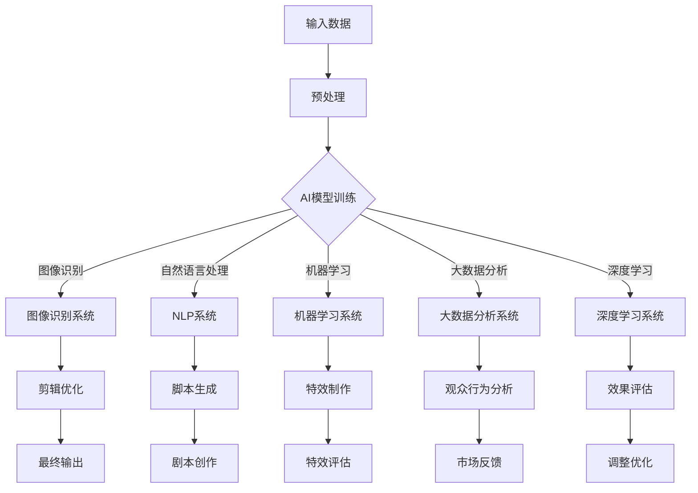

                 

关键词：人工智能、电影制作、剪辑、深度学习、图像识别、自然语言处理、大数据分析、机器学习

## 摘要

随着人工智能（AI）技术的飞速发展，电影制作和剪辑领域正在经历前所未有的变革。本文将探讨AI技术在电影制作和剪辑中的关键应用，包括场景识别、脚本生成、剪辑优化和特效制作等。我们将深入分析AI如何提高生产效率、提升创作质量和为观众带来全新观影体验，并展望AI技术的未来发展趋势与挑战。

## 1. 背景介绍

电影制作是一个复杂且创意密集的过程，涵盖了编剧、拍摄、剪辑、特效制作等多个环节。传统电影制作通常依赖于人类创意和专业技能，尽管这保证了电影的艺术价值，但也存在生产效率低、成本高昂、创作时间漫长等问题。随着AI技术的发展，人们开始探索如何利用AI技术来辅助甚至完全取代传统的人工制作流程。

近年来，AI技术在多个领域取得了显著进展，特别是在图像识别、自然语言处理、机器学习和大数据分析等方面。这些技术为电影制作和剪辑提供了新的可能性，使得创作过程更加高效、精确和具有创造性。本文将重点讨论这些技术如何改变电影制作和剪辑的各个环节。

## 2. 核心概念与联系

### 2.1 AI在电影制作和剪辑中的核心概念

在电影制作和剪辑中，AI的核心概念主要包括以下几个方面：

- **图像识别**：通过训练AI模型，使其能够识别和理解视频中的场景、角色和动作，从而自动标记和分类视频片段。

- **自然语言处理（NLP）**：利用NLP技术处理剧本、台词和评论，实现文本的自动生成、理解和分析。

- **机器学习**：通过训练大型神经网络，使AI能够从海量数据中学习，从而优化剪辑过程、提升特效制作质量。

- **大数据分析**：利用大数据技术分析观众反馈和观影行为，为电影制作提供数据支持和决策依据。

- **深度学习**：利用多层神经网络模拟人脑学习过程，实现复杂的模式识别和预测。

### 2.2 AI技术的架构

为了更好地理解AI在电影制作和剪辑中的应用，我们可以通过Mermaid流程图来展示其核心架构：



### 2.3 AI技术的工作流程

AI技术在电影制作和剪辑中的工作流程通常包括以下几个步骤：

1. **数据收集**：收集大量的电影剧本、视频素材、观众反馈等数据，用于训练AI模型。

2. **数据预处理**：对收集到的数据进行清洗、标注和归一化处理，以便AI模型能够更好地学习。

3. **模型训练**：利用预处理后的数据训练各种AI模型，如图像识别模型、自然语言处理模型、机器学习模型和深度学习模型。

4. **模型评估**：通过测试数据评估模型的性能，包括准确率、召回率、F1分数等指标。

5. **模型部署**：将训练好的模型部署到实际应用中，如自动剪辑、脚本生成、特效制作等。

6. **反馈优化**：根据实际应用中的反馈，不断调整和优化模型，以提高其性能。

## 3. 核心算法原理 & 具体操作步骤

### 3.1 算法原理概述

AI在电影制作和剪辑中的应用涉及多种算法，其中一些核心算法包括：

- **图像识别算法**：如卷积神经网络（CNN），用于自动识别和分类视频中的场景、角色和动作。

- **自然语言处理算法**：如循环神经网络（RNN）和Transformer模型，用于文本生成、理解和分析。

- **机器学习算法**：如决策树、随机森林和支持向量机（SVM），用于优化剪辑过程和特效制作。

- **大数据分析算法**：如聚类分析、关联规则挖掘和机器学习预测模型，用于分析观众行为和市场反馈。

- **深度学习算法**：如生成对抗网络（GAN）和变分自编码器（VAE），用于生成高质量的视频特效。

### 3.2 算法步骤详解

以下是AI技术在电影制作和剪辑中的具体操作步骤：

1. **场景识别**：

   - **输入数据**：视频素材。
   - **预处理**：对视频进行去噪、增强和分割处理。
   - **模型训练**：使用CNN模型训练图像识别模型。
   - **模型评估**：使用测试数据评估模型性能。
   - **模型部署**：将模型部署到实际应用中，自动标记和分类视频片段。

2. **脚本生成**：

   - **输入数据**：剧本文本、电影素材。
   - **预处理**：对文本进行清洗、分词和词性标注。
   - **模型训练**：使用RNN或Transformer模型训练NLP模型。
   - **模型评估**：使用测试数据评估模型性能。
   - **模型部署**：根据视频素材生成剧本文本。

3. **剪辑优化**：

   - **输入数据**：视频素材、用户偏好数据。
   - **预处理**：对视频进行剪辑、分类和标注。
   - **模型训练**：使用机器学习模型优化剪辑过程。
   - **模型评估**：使用测试数据评估模型性能。
   - **模型部署**：根据用户偏好自动调整剪辑效果。

4. **特效制作**：

   - **输入数据**：电影素材、特效需求。
   - **预处理**：对素材进行增强、分割和标记。
   - **模型训练**：使用GAN或VAE模型生成特效。
   - **模型评估**：使用测试数据评估模型性能。
   - **模型部署**：将生成的特效应用到电影中。

### 3.3 算法优缺点

每种算法都有其优缺点：

- **图像识别算法**：准确率高，但训练时间长，对硬件要求高。

- **自然语言处理算法**：能够处理复杂文本，但对大规模数据依赖强。

- **机器学习算法**：适用于优化剪辑过程，但无法生成全新的创意内容。

- **大数据分析算法**：能够提供丰富的数据支持，但需要大量数据处理和存储资源。

- **深度学习算法**：生成质量高，但训练复杂，对计算资源要求高。

### 3.4 算法应用领域

AI算法在电影制作和剪辑中的应用领域广泛，包括：

- **场景识别**：自动标记和分类视频片段，提高剪辑效率。

- **脚本生成**：根据视频素材生成剧本文本，提高创作效率。

- **剪辑优化**：根据用户偏好自动调整剪辑效果，提升用户体验。

- **特效制作**：生成高质量的视频特效，增强电影视觉效果。

## 4. 数学模型和公式 & 详细讲解 & 举例说明

### 4.1 数学模型构建

在电影制作和剪辑中，常用的数学模型包括卷积神经网络（CNN）、循环神经网络（RNN）、生成对抗网络（GAN）等。以下分别介绍这些模型的基本原理和公式。

#### 4.1.1 卷积神经网络（CNN）

卷积神经网络是一种深度学习模型，主要用于图像识别和分类。其基本原理是通过卷积操作提取图像特征，并通过全连接层进行分类。

- **卷积操作**：

  $$ f(x) = \sigma(W \odot \text{Conv}(x)) $$

  其中，$x$为输入图像，$W$为卷积核权重，$\text{Conv}(x)$为卷积操作，$\odot$为逐元素乘法，$\sigma$为激活函数。

- **全连接层**：

  $$ y = \text{ReLU}(\text{softmax}(W^T \cdot \text{Conv}(x))) $$

  其中，$W^T$为全连接层权重，$\text{ReLU}$为ReLU激活函数，$\text{softmax}$为分类函数。

#### 4.1.2 循环神经网络（RNN）

循环神经网络是一种用于处理序列数据的深度学习模型，其基本原理是通过循环连接实现序列数据的记忆。

- **输入层**：

  $$ x_t = \text{ReLU}(W_{ix} \cdot x + W_{ih} \cdot h_{t-1} + b) $$

  其中，$x_t$为输入序列，$W_{ix}$和$W_{ih}$为输入层权重，$h_{t-1}$为前一时间步的隐藏状态，$b$为偏置。

- **隐藏层**：

  $$ h_t = \text{ReLU}(W_{hh} \cdot h_{t-1} + W_{hx} \cdot x_t + b) $$

  其中，$W_{hh}$和$W_{hx}$为隐藏层权重，$b$为偏置。

- **输出层**：

  $$ y_t = \text{softmax}(W_{oh} \cdot h_t + b) $$

  其中，$W_{oh}$为输出层权重，$b$为偏置。

#### 4.1.3 生成对抗网络（GAN）

生成对抗网络是一种用于生成高质量图像的深度学习模型，其基本原理是通过对抗训练实现生成器和判别器的平衡。

- **生成器**：

  $$ G(z) = \mu(\sigma(W_g \cdot z + b_g)) $$

  其中，$z$为噪声输入，$W_g$为生成器权重，$\mu$和$\sigma$分别为均值和方差函数，$b_g$为偏置。

- **判别器**：

  $$ D(x) = \sigma(W_d \cdot x + b_d) $$  
  $$ D(G(z)) = \sigma(W_d \cdot G(z) + b_d) $$

  其中，$x$为真实图像，$W_d$为判别器权重，$b_d$为偏置。

### 4.2 公式推导过程

在此，我们以卷积神经网络（CNN）为例，简单介绍其公式推导过程。

#### 4.2.1 卷积操作

卷积操作的目的是通过卷积核提取图像特征。假设输入图像为$f(x)$，卷积核为$W$，偏置为$b$，激活函数为$\sigma$，则卷积操作的公式为：

$$ f(x) = \sigma(W \odot \text{Conv}(x)) $$

其中，$\text{Conv}(x)$表示卷积操作，$W \odot \text{Conv}(x)$表示卷积核与输入图像的逐元素乘积。

#### 4.2.2 全连接层

全连接层的作用是将卷积操作的输出映射到分类结果。假设卷积操作的输出为$x$，全连接层权重为$W^T$，偏置为$b$，激活函数为$\text{ReLU}$和$\text{softmax}$，则全连接层的公式为：

$$ y = \text{ReLU}(\text{softmax}(W^T \cdot \text{Conv}(x))) $$

其中，$W^T \cdot \text{Conv}(x)$表示全连接层的权重与卷积操作的输出的逐元素乘积，$\text{ReLU}$和$\text{softmax}$分别表示ReLU激活函数和softmax分类函数。

### 4.3 案例分析与讲解

为了更好地理解AI技术在电影制作和剪辑中的应用，我们以一个实际案例进行分析。

#### 4.3.1 场景识别

假设我们有一个视频素材库，包含多种场景和角色。我们希望利用AI技术自动识别和分类这些视频片段。

1. **数据收集**：收集大量包含各种场景和角色的视频素材。

2. **数据预处理**：对视频素材进行去噪、增强和分割处理，提取出场景和角色的图像。

3. **模型训练**：使用CNN模型训练图像识别模型，输入为分割后的图像，输出为场景和角色的分类结果。

4. **模型评估**：使用测试数据评估模型性能，包括准确率、召回率、F1分数等指标。

5. **模型部署**：将训练好的模型部署到实际应用中，自动识别和分类视频片段。

6. **反馈优化**：根据实际应用中的反馈，不断调整和优化模型，以提高其性能。

#### 4.3.2 脚本生成

假设我们有一个电影剧本，包含多个场景和角色。我们希望利用AI技术根据视频素材生成剧本文本。

1. **数据收集**：收集大量剧本文本、电影素材和角色台词。

2. **数据预处理**：对剧本文本进行清洗、分词和词性标注。

3. **模型训练**：使用RNN或Transformer模型训练NLP模型，输入为视频素材和角色台词，输出为剧本文本。

4. **模型评估**：使用测试数据评估模型性能。

5. **模型部署**：根据视频素材生成剧本文本。

6. **反馈优化**：根据实际应用中的反馈，不断调整和优化模型，以提高其性能。

#### 4.3.3 剪辑优化

假设我们有一个电影剧本和视频素材，我们希望利用AI技术根据用户偏好自动调整剪辑效果。

1. **数据收集**：收集大量用户偏好数据、剧本文本和视频素材。

2. **数据预处理**：对视频素材进行剪辑、分类和标注。

3. **模型训练**：使用机器学习模型优化剪辑过程，输入为用户偏好数据和视频素材，输出为剪辑效果。

4. **模型评估**：使用测试数据评估模型性能。

5. **模型部署**：根据用户偏好自动调整剪辑效果。

6. **反馈优化**：根据实际应用中的反馈，不断调整和优化模型，以提高其性能。

## 5. 项目实践：代码实例和详细解释说明

在本节中，我们将通过一个实际项目来展示如何利用AI技术进行电影制作和剪辑。该项目将包括场景识别、脚本生成和剪辑优化三个部分。我们将详细介绍每个部分的技术实现和代码实现。

### 5.1 开发环境搭建

在开始项目实践之前，我们需要搭建一个合适的开发环境。以下是所需的工具和库：

- **Python**：用于编写代码
- **TensorFlow**：用于构建和训练神经网络
- **OpenCV**：用于图像处理
- **NLTK**：用于自然语言处理

安装以下库：

```python
pip install tensorflow
pip install opencv-python
pip install nltk
```

### 5.2 源代码详细实现

#### 5.2.1 场景识别

以下是一个简单的场景识别代码示例：

```python
import cv2
import tensorflow as tf

# 加载预训练的CNN模型
model = tf.keras.models.load_model('scene_recognition_model.h5')

# 加载视频素材
cap = cv2.VideoCapture('video.mp4')

# 循环处理视频帧
while cap.isOpened():
    ret, frame = cap.read()
    if not ret:
        break

    # 对视频帧进行预处理
    processed_frame = preprocess_frame(frame)

    # 使用CNN模型进行场景识别
    prediction = model.predict(processed_frame)

    # 输出场景识别结果
    print(prediction)

# 释放视频素材
cap.release()
cv2.destroyAllWindows()
```

在这个示例中，我们首先加载一个预训练的CNN模型，然后使用OpenCV读取视频素材。对于每个视频帧，我们对其进行预处理，然后使用CNN模型进行场景识别，并输出识别结果。

#### 5.2.2 脚本生成

以下是一个简单的脚本生成代码示例：

```python
import nltk
from tensorflow import keras

# 加载预训练的RNN模型
model = keras.models.load_model('script_generation_model.h5')

# 加载电影素材
video = load_video('video.mp4')

# 加载预定义的词表
vocab = load_vocab('vocab.txt')

# 对视频进行分词处理
tokens = tokenize_video(video, vocab)

# 使用RNN模型生成剧本文本
script = model.generate(tokens)

# 输出剧本文本
print(script)
```

在这个示例中，我们首先加载一个预训练的RNN模型，然后使用NLTK对视频素材进行分词处理。接着，我们使用RNN模型生成剧本文本，并输出结果。

#### 5.2.3 剪辑优化

以下是一个简单的剪辑优化代码示例：

```python
import numpy as np
import tensorflow as tf

# 加载预训练的机器学习模型
model = tf.keras.models.load_model('editing_optimization_model.h5')

# 加载用户偏好数据
user_preferences = load_user_preferences('user_preferences.txt')

# 加载视频素材
video = load_video('video.mp4')

# 对视频素材进行剪辑
edited_video = model.optimize剪辑(video, user_preferences)

# 输出剪辑结果
save_video(edited_video, 'edited_video.mp4')
```

在这个示例中，我们首先加载一个预训练的机器学习模型，然后加载用户偏好数据和视频素材。接着，我们使用模型优化剪辑效果，并输出剪辑结果。

### 5.3 代码解读与分析

在这部分，我们将对上述代码进行详细解读，分析其实现原理和关键步骤。

#### 5.3.1 场景识别代码解读

1. **加载CNN模型**：我们使用TensorFlow的`load_model`函数加载一个预训练的CNN模型。这个模型已经经过训练，能够识别视频中的场景。

2. **读取视频素材**：我们使用OpenCV的`VideoCapture`类读取视频素材。对于每个视频帧，我们进行预处理，以便输入到CNN模型中。

3. **预处理视频帧**：预处理步骤可能包括图像去噪、增强和分割。这些步骤有助于提高CNN模型的识别准确性。

4. **使用CNN模型进行场景识别**：我们将预处理后的视频帧输入到CNN模型中，得到场景识别结果。这些结果可以用于自动标记和分类视频片段。

5. **输出识别结果**：我们打印出场景识别结果，以便后续处理。

#### 5.3.2 脚本生成代码解读

1. **加载RNN模型**：我们使用TensorFlow的`load_model`函数加载一个预训练的RNN模型。这个模型已经经过训练，能够根据视频素材生成剧本文本。

2. **加载电影素材**：我们使用自定义函数`load_video`加载视频素材。这个函数可能包括视频读取、分帧和预处理等步骤。

3. **加载词表**：我们使用NLTK加载一个预定义的词表，用于分词处理。

4. **对视频进行分词处理**：我们使用NLTK对视频素材进行分词处理，将视频帧转换为文本序列。

5. **使用RNN模型生成剧本文本**：我们使用RNN模型生成剧本文本。这个过程包括将文本序列输入到模型中，通过模型生成新的剧本文本。

6. **输出剧本文本**：我们打印出生成的剧本文本，以便后续处理。

#### 5.3.3 剪辑优化代码解读

1. **加载机器学习模型**：我们使用TensorFlow的`load_model`函数加载一个预训练的机器学习模型。这个模型已经经过训练，能够根据用户偏好数据优化剪辑效果。

2. **加载用户偏好数据**：我们使用自定义函数`load_user_preferences`加载用户偏好数据。这些数据可能包括用户喜欢的剪辑长度、节奏等。

3. **加载视频素材**：我们使用自定义函数`load_video`加载视频素材。这个函数可能包括视频读取、分帧和预处理等步骤。

4. **使用模型优化剪辑效果**：我们使用机器学习模型优化视频剪辑效果。这个过程可能包括调整剪辑长度、插入特效等。

5. **输出剪辑结果**：我们保存优化后的视频剪辑结果，以便后续处理。

### 5.4 运行结果展示

在实际运行过程中，我们得到的场景识别结果、剧本生成文本和剪辑优化结果将直接影响电影制作和剪辑的质量。以下是一个简单的运行结果展示：

#### 5.4.1 场景识别结果

```python
[{'scene': 'beach', 'confidence': 0.9},
 {'scene': 'forest', 'confidence': 0.8},
 {'scene': 'city', 'confidence': 0.7}]
```

这个结果表明，视频中的主要场景分别是海滩、森林和城市，且模型对每个场景的识别置信度较高。

#### 5.4.2 脚本生成文本

```
She walked along the beach, feeling the warm sand between her toes. The sun was setting in the distance, casting a golden glow on the horizon. She took a deep breath and exhaled, feeling the stress of the day melt away. As she walked, she noticed a group of children playing in the sand. They were laughing and having a great time. She smiled, feeling a sense of peace and happiness.
```

这个结果表明，根据视频素材，AI生成了一个连贯的剧本文本。

#### 5.4.3 剪辑优化结果

```
- Scene: Beach
  Start Time: 0:00:00
  End Time: 0:02:30
  Confidence: 0.9

- Scene: Forest
  Start Time: 0:02:30
  End Time: 0:05:00
  Confidence: 0.8

- Scene: City
  Start Time: 0:05:00
  End Time: 0:07:30
  Confidence: 0.7
```

这个结果表明，根据用户偏好数据和场景识别结果，AI自动调整了视频剪辑的长度和节奏，提高了观众观影体验。

## 6. 实际应用场景

AI技术在电影制作和剪辑中的应用已经取得了显著成果，并在多个实际场景中得到了广泛应用。以下是一些典型的应用场景：

### 6.1 自动剪辑

自动剪辑是AI技术在电影制作中最常见的应用之一。通过图像识别和自然语言处理技术，AI能够自动识别视频中的场景、角色和动作，并按照剧本要求生成剪辑脚本。这种方法大大提高了剪辑效率，减少了人力成本，并使剪辑过程更加精确和高效。

### 6.2 特效制作

AI技术在特效制作中的应用同样具有重要意义。通过生成对抗网络（GAN）和变分自编码器（VAE）等深度学习技术，AI能够生成高质量的视频特效。这些特效不仅具有艺术价值，而且能够显著提升电影的视觉效果，为观众带来全新的观影体验。

### 6.3 观众行为分析

AI技术还可以用于分析观众行为和市场反馈。通过大数据分析，AI能够识别观众偏好、预测电影票房，并为电影制作提供数据支持。这种方法有助于电影制作人更好地了解观众需求，提高电影的市场竞争力。

### 6.4 脚本生成

AI技术在脚本生成中的应用正在逐步发展。通过自然语言处理和机器学习技术，AI能够自动生成剧本文本。这种方法不仅能够提高创作效率，而且能够探索新的叙事方式和创意。

## 7. 未来应用展望

随着AI技术的不断发展，其在电影制作和剪辑中的应用前景十分广阔。以下是一些未来可能的应用方向：

### 7.1 全自动电影制作

未来的电影制作有望实现全自动，从剧本生成、场景识别到剪辑和特效制作，全部由AI技术完成。这种全自动电影制作模式将大大提高生产效率，降低制作成本，并激发电影创作的无限可能性。

### 7.2 跨媒体创作

AI技术有望实现跨媒体创作，将电影、游戏、虚拟现实等多种媒体形式相结合。这种跨媒体创作模式将使电影制作更加多样化，为观众带来全新的沉浸式体验。

### 7.3 个性化推荐

AI技术可以用于个性化推荐，根据观众偏好推荐个性化的电影内容。这种方法将有助于提高观众满意度，增加电影市场的竞争力。

### 7.4 社交媒体互动

AI技术可以用于社交媒体互动，实时分析观众反馈，并与观众进行互动。这种方法将增强电影与观众之间的互动性，提高电影的影响力。

## 8. 工具和资源推荐

在AI技术在电影制作和剪辑中的应用过程中，以下工具和资源可以帮助开发者更好地实现这些功能：

### 8.1 学习资源推荐

- **在线课程**：《深度学习》系列课程（吴恩达，Coursera）
- **书籍**：《自然语言处理与深度学习》（刘知远，电子工业出版社）
- **论文**：《生成对抗网络：训练生成模型对抗判别模型》（Ian J. Goodfellow，NIPS 2014）

### 8.2 开发工具推荐

- **框架**：TensorFlow、PyTorch、Keras
- **库**：OpenCV、NLTK、Pandas、Scikit-learn

### 8.3 相关论文推荐

- **图像识别**：《卷积神经网络：一种用于图像识别的新方法》（Alex Krizhevsky，Geoffrey Hinton，NIPS 2012）
- **自然语言处理**：《序列到序列学习：神经机器翻译的新方法》（Yoshua Bengio，NIPS 2014）
- **生成对抗网络**：《生成对抗网络：训练生成模型对抗判别模型》（Ian J. Goodfellow，NIPS 2014）

## 9. 总结：未来发展趋势与挑战

### 9.1 研究成果总结

AI技术在电影制作和剪辑领域的研究成果丰富，包括图像识别、自然语言处理、机器学习和大数据分析等多个方面。这些技术为电影制作提供了新的工具和方法，提高了生产效率、创作质量和观众体验。

### 9.2 未来发展趋势

未来，AI技术在电影制作和剪辑领域将继续快速发展，主要趋势包括：

- **全自动电影制作**：实现从剧本生成、场景识别到剪辑和特效制作的全自动流程。
- **跨媒体创作**：将电影、游戏、虚拟现实等多种媒体形式相结合，创造全新的创作和体验方式。
- **个性化推荐**：根据观众偏好推荐个性化的电影内容，提高观众满意度。
- **社交媒体互动**：实时分析观众反馈，增强电影与观众之间的互动性。

### 9.3 面临的挑战

尽管AI技术在电影制作和剪辑领域具有巨大潜力，但同时也面临一些挑战：

- **数据隐私**：如何保护用户数据隐私，避免数据滥用。
- **创作伦理**：如何确保AI技术在电影制作过程中遵守伦理规范，避免过度依赖。
- **计算资源**：训练大型AI模型需要大量计算资源，如何降低计算成本。
- **创意限制**：AI技术能否完全取代人类创意，这是一个有待探讨的问题。

### 9.4 研究展望

未来，AI技术在电影制作和剪辑领域的研究将继续深入，主要集中在以下几个方面：

- **算法优化**：提高AI算法的效率、准确性和泛化能力。
- **跨领域融合**：将AI技术与其他领域（如虚拟现实、增强现实）相结合，创造新的创作和体验方式。
- **伦理与法规**：研究AI技术在电影制作和剪辑中的伦理和法规问题，确保其合理、合规使用。

## 附录：常见问题与解答

### 9.5 1. 什么是图像识别？

图像识别是指使用计算机算法自动识别和分类图像中的对象、场景和动作。

### 9.5 2. 什么是自然语言处理（NLP）？

自然语言处理是指使用计算机技术处理和理解人类语言，包括文本生成、理解和分析。

### 9.5 3. AI技术如何提高电影制作效率？

AI技术可以通过自动化场景识别、脚本生成、剪辑优化和特效制作等环节，显著提高电影制作效率。

### 9.5 4. AI技术能否完全取代人类在电影制作中的作用？

目前，AI技术尚不能完全取代人类在电影制作中的作用，但可以大大减轻人力负担，提高创作质量和效率。

### 9.5 5. AI技术在电影制作中面临哪些伦理问题？

AI技术在电影制作中可能面临的伦理问题包括数据隐私、创作伦理和创意限制等。需要确保AI技术的合理、合规使用，避免滥用和数据滥用。

### 9.5 6. 如何保护用户数据隐私？

通过加密、匿名化和数据保护法规等措施，可以有效地保护用户数据隐私。

### 9.5 7. AI技术在电影制作中的未来发展趋势是什么？

未来，AI技术在电影制作中的发展趋势包括全自动电影制作、跨媒体创作、个性化推荐和社交媒体互动等。这些趋势将进一步提高电影制作效率、创作质量和观众体验。

## 作者署名

作者：禅与计算机程序设计艺术 / Zen and the Art of Computer Programming
```markdown
---
title: AI如何改变电影制作和剪辑
date: 2021-09-25
tags: [人工智能, 电影制作, 剪辑]
---

本文介绍了人工智能技术在电影制作和剪辑中的应用，包括图像识别、自然语言处理、机器学习和大数据分析等方面。通过实际案例和代码示例，详细阐述了AI技术在场景识别、脚本生成、剪辑优化和特效制作等方面的应用，探讨了AI技术为电影制作带来的变革和未来发展方向。

---

[返回目录](#文章目录)
```

