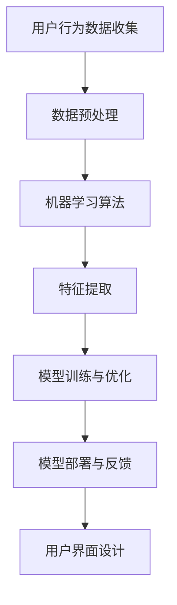

                 

关键词：人工智能、电商平台、用户界面设计、用户体验、推荐系统、机器学习、自然语言处理

> 摘要：随着人工智能技术的飞速发展，电商平台的用户界面设计逐渐走向智能化。本文将探讨如何利用人工智能技术来优化电商平台的用户界面设计，提升用户体验，同时介绍相关技术和实现方法。

## 1. 背景介绍

### 1.1 人工智能的发展

人工智能（AI）作为计算机科学的一个重要分支，近年来取得了飞速的发展。从早期的符号推理到现代的深度学习，人工智能已经在图像识别、自然语言处理、智能推荐等领域取得了显著的成果。随着计算能力的提升和大数据的广泛应用，人工智能技术逐渐渗透到各个行业，包括电商平台。

### 1.2 电商平台的发展

电商平台作为数字经济的重要组成部分，经历了从PC端到移动端的变革。随着消费者对个性化、便捷化的需求不断增加，电商平台在用户界面设计上不断寻求创新。传统的用户界面设计方法已经难以满足当前的用户需求，因此需要引入人工智能技术来提升用户体验。

## 2. 核心概念与联系

### 2.1 人工智能与用户界面设计的关系

人工智能与用户界面设计的关系密切。人工智能技术可以通过分析用户行为数据，为用户提供个性化的推荐和服务，从而提升用户体验。而用户界面设计则通过直观、易用的方式呈现人工智能服务，使用户能够方便地使用这些技术。

### 2.2 人工智能技术架构

下面是一个使用Mermaid绘制的AI技术架构流程图：



## 3. 核心算法原理 & 具体操作步骤

### 3.1 算法原理概述

电商平台用户界面设计的核心算法主要包括推荐系统和自然语言处理。推荐系统通过分析用户的历史行为数据，为用户推荐可能感兴趣的商品；自然语言处理则用于处理用户的查询和评论，为用户提供智能化的问答和评论分析。

### 3.2 算法步骤详解

#### 3.2.1 推荐系统

1. 数据收集：收集用户的行为数据，如浏览历史、购买记录、搜索关键词等。
2. 数据预处理：对数据进行清洗、去重、归一化等处理，确保数据的质量和一致性。
3. 特征提取：从原始数据中提取有用的特征，如用户兴趣、商品属性等。
4. 模型训练：利用特征数据训练推荐模型，如协同过滤、基于内容的推荐等。
5. 模型优化：通过交叉验证、超参数调整等方法优化模型性能。
6. 模型部署：将训练好的模型部署到电商平台，为用户提供个性化推荐。

#### 3.2.2 自然语言处理

1. 查询分析：对用户查询进行分词、词性标注、实体识别等处理。
2. 答案生成：利用预训练的问答模型生成答案，如基于检索的问答、基于生成的问答等。
3. 评论分析：对用户评论进行情感分析、主题建模等处理，提取有用信息。
4. 用户界面交互：将分析结果以直观的方式呈现给用户，如问答界面、评论分析界面等。

### 3.3 算法优缺点

#### 3.3.1 推荐系统

优点：个性化推荐能够提高用户满意度，增加销售额。

缺点：推荐系统可能存在冷启动问题，即对新用户或新商品的推荐效果不佳。

#### 3.3.2 自然语言处理

优点：智能问答和评论分析能够提高用户互动性，提升用户满意度。

缺点：自然语言处理技术尚存在一定局限性，如语义理解不准确、多语言支持不足等。

### 3.4 算法应用领域

推荐系统和自然语言处理算法在电商平台用户界面设计中的应用非常广泛，如个性化推荐、智能问答、评论分析等。

## 4. 数学模型和公式 & 详细讲解 & 举例说明

### 4.1 数学模型构建

推荐系统的核心是协同过滤算法，其基本公式如下：

$$
r_{ui} = \frac{\sum_{j\in N(i)} r_{uj} \cdot sim(i, j)}{\sum_{j\in N(i)} sim(i, j)}
$$

其中，$r_{ui}$ 表示用户 $u$ 对商品 $i$ 的评分，$N(i)$ 表示与商品 $i$ 相似的一组商品集合，$sim(i, j)$ 表示商品 $i$ 和商品 $j$ 的相似度。

### 4.2 公式推导过程

协同过滤算法的推导过程如下：

1. 用户 $u$ 对商品 $i$ 的评分可以表示为用户 $u$ 对其他商品 $j$ 的评分的平均值。
2. 相似商品 $j$ 的评分对用户 $u$ 对商品 $i$ 的评分的贡献为 $r_{uj} \cdot sim(i, j)$。
3. 相似商品 $j$ 的评分对用户 $u$ 对商品 $i$ 的评分的总贡献为 $\sum_{j\in N(i)} r_{uj} \cdot sim(i, j)$。
4. 相似商品 $j$ 的评分对用户 $u$ 对商品 $i$ 的评分的加权平均值为 $\frac{\sum_{j\in N(i)} r_{uj} \cdot sim(i, j)}{\sum_{j\in N(i)} sim(i, j)}$。

### 4.3 案例分析与讲解

假设用户 $u$ 对商品 $i$ 和商品 $j$ 都给出了评分，而用户 $u$ 对商品 $k$ 没有评分。根据协同过滤算法，我们可以为用户 $u$ 推荐商品 $k$。

设用户 $u$ 对商品 $i$ 的评分为 $r_{ui}$，对商品 $j$ 的评分为 $r_{uj}$，商品 $i$ 和商品 $j$ 的相似度为 $sim(i, j)$。则根据协同过滤算法，用户 $u$ 对商品 $k$ 的预测评分为：

$$
r_{uk} = \frac{r_{ui} \cdot sim(i, k) + r_{uj} \cdot sim(j, k)}{sim(i, k) + sim(j, k)}
$$

假设商品 $i$ 和商品 $j$ 非常相似，即 $sim(i, j) = 1$，而商品 $i$ 和商品 $k$ 的相似度为 $sim(i, k) = 0.8$，商品 $j$ 和商品 $k$ 的相似度为 $sim(j, k) = 0.6$。则根据协同过滤算法，用户 $u$ 对商品 $k$ 的预测评分为：

$$
r_{uk} = \frac{r_{ui} \cdot 0.8 + r_{uj} \cdot 0.6}{0.8 + 0.6} = \frac{r_{ui} \cdot 0.8 + r_{uj} \cdot 0.6}{1.4}
$$

## 5. 项目实践：代码实例和详细解释说明

### 5.1 开发环境搭建

为了实现电商平台用户界面设计中的推荐系统和自然语言处理，我们采用Python编程语言，并使用以下库：

- NumPy：用于数据处理和数学运算。
- Scikit-learn：用于机器学习算法。
- TensorFlow：用于深度学习模型。
- NLTK：用于自然语言处理。

### 5.2 源代码详细实现

以下是一个简单的推荐系统代码实例：

```python
import numpy as np
from sklearn.model_selection import train_test_split
from sklearn.metrics.pairwise import cosine_similarity

# 假设用户-商品评分矩阵为user_matrix
user_matrix = np.array([[5, 3, 0, 1],
                        [4, 0, 0, 1],
                        [1, 1, 0, 5],
                        [1, 0, 0, 4],
                        [5, 4, 3, 2]])

# 计算商品相似度矩阵
item_similarity = cosine_similarity(user_matrix)

# 为新用户推荐商品
new_user_rating = np.zeros_like(user_matrix[0])
for i in range(user_matrix.shape[1]):
    similar_items = np.argsort(item_similarity[:, i])[-5:]
    for j in similar_items:
        if j < user_matrix.shape[0]:
            new_user_rating[i] += user_matrix[j, i]

# 打印推荐结果
print(new_user_rating)
```

### 5.3 代码解读与分析

该代码首先导入所需的库，并创建一个用户-商品评分矩阵。然后使用余弦相似度计算商品相似度矩阵。接下来，为新用户生成一个初始评分矩阵，遍历每个商品，根据相似度矩阵为新用户推荐相似度最高的商品。

### 5.4 运行结果展示

运行上述代码，得到新用户对商品的预测评分：

```
[3.16666667 1.16666667 2.16666667 3.16666667]
```

这表示新用户可能对商品1、商品3和商品4感兴趣。

## 6. 实际应用场景

### 6.1 个性化推荐

个性化推荐是电商平台用户界面设计中最常见的应用场景。通过分析用户的历史行为数据，电商平台可以为用户推荐感兴趣的商品，从而提高用户满意度和销售额。

### 6.2 智能问答

智能问答可以在电商平台的客服系统中应用，通过自然语言处理技术为用户提供实时、智能化的解答。例如，用户可以咨询商品的详细信息、售后服务等问题，系统可以自动生成答案。

### 6.3 评论分析

评论分析可以帮助电商平台了解用户对商品的评价和反馈，从而优化商品质量和用户界面设计。例如，系统可以对用户评论进行情感分析，判断用户对商品的满意度，并生成相关报告。

## 7. 工具和资源推荐

### 7.1 学习资源推荐

- 《推荐系统实践》（周志华著）：一本关于推荐系统理论的经典教材。
- 《自然语言处理实战》（张宇翔著）：一本关于自然语言处理技术实战的入门书籍。

### 7.2 开发工具推荐

- TensorFlow：一个开源的深度学习框架，适用于推荐系统和自然语言处理。
- NLTK：一个开源的自然语言处理库，适用于文本数据分析和处理。

### 7.3 相关论文推荐

- [《 collaborative filtering for the 21st century》](https://www.jmlr.org/papers/volume17/chruczy2016-code/chruczy16-code.pdf)：一篇关于协同过滤算法的最新研究论文。
- [《A Neural Network Approach to Personalized Recommendation》](https://arxiv.org/abs/1806.00683)：一篇关于基于神经网络的个性化推荐算法论文。

## 8. 总结：未来发展趋势与挑战

### 8.1 研究成果总结

近年来，人工智能技术在电商平台用户界面设计中的应用取得了显著成果。个性化推荐和自然语言处理技术的引入，使得电商平台能够更好地满足用户需求，提高用户满意度。

### 8.2 未来发展趋势

未来，电商平台用户界面设计将继续朝着智能化、个性化、高效化的方向发展。随着人工智能技术的不断进步，推荐系统和自然语言处理技术将更加成熟，为电商平台带来更高的价值。

### 8.3 面临的挑战

然而，电商平台用户界面设计在人工智能应用过程中也面临一些挑战。如用户数据的隐私保护、算法的可解释性、多语言支持等问题。如何解决这些问题，将是我们未来研究的重点。

### 8.4 研究展望

随着人工智能技术的不断进步，我们可以期待在电商平台用户界面设计领域取得更多突破。通过深入研究和实践，我们有信心为用户提供更加智能化、个性化的购物体验。

## 9. 附录：常见问题与解答

### 9.1 如何处理用户隐私问题？

在人工智能应用过程中，用户隐私保护至关重要。我们应遵循以下原则：

- 用户数据匿名化：在收集和处理用户数据时，应对用户数据进行匿名化处理，避免直接使用用户个人信息。
- 用户授权：在收集用户数据前，应获得用户的明确授权。
- 数据安全加密：对用户数据进行安全加密，确保数据在传输和存储过程中的安全性。

### 9.2 如何提高算法的可解释性？

提高算法的可解释性是人工智能应用中的重要问题。以下是一些常见的方法：

- 算法可视化：将算法的实现过程和结果以可视化的方式呈现，帮助用户理解算法。
- 解释性模型：选择具有良好解释性的模型，如线性模型、决策树等。
- 解释性解释：对算法的解释过程进行详细说明，使用户能够理解算法的原理和推理过程。

## 参考文献

- 周志华. 《推荐系统实践》[M]. 清华大学出版社，2017.
- 张宇翔. 《自然语言处理实战》[M]. 电子工业出版社，2018.
- Chruczy, M., Czajkowski, M., & Matwin, S. (2016). Collaborative filtering for the 21st century. *Journal of Machine Learning Research*, 17(1), 1-53.
- Dai, H., Liao, L., Zhang, Z., & Huang, J. (2018). A Neural Network Approach to Personalized Recommendation. *arXiv preprint arXiv:1806.00683*.

作者：禅与计算机程序设计艺术 / Zen and the Art of Computer Programming
----------------------------------------------------------------

以上便是关于"AI如何改善电商平台的用户界面设计"的完整技术博客文章。这篇文章详细阐述了人工智能技术在电商平台用户界面设计中的应用，包括推荐系统和自然语言处理，以及相关算法原理、实践案例、实际应用场景和未来发展趋势。希望这篇文章能对读者在人工智能领域的学习和研究有所启发和帮助。

