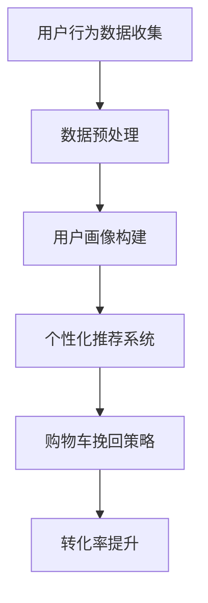

                 

关键词：AI、电商平台、购物车、挽回策略、算法、用户行为分析、个性化推荐、转化率优化

> 摘要：本文探讨了如何利用人工智能技术来改善电商平台的购物车挽回策略，通过用户行为分析和个性化推荐，提升购物车的转化率和用户满意度。

## 1. 背景介绍

在电子商务领域，购物车挽回策略是一种关键的用户留存和转化手段。当用户将商品添加到购物车，但在结账时放弃购买时，电商平台需要通过有效的挽回策略来促使这些用户完成购买。传统的挽回策略通常包括发送邮件提醒、促销活动推送等手段，但效果往往不尽如人意。随着人工智能技术的快速发展，利用AI来优化购物车挽回策略成为了一种新的趋势。

## 2. 核心概念与联系

### 2.1 用户行为分析

用户行为分析是人工智能在电商平台购物车挽回策略中的核心概念之一。通过对用户的浏览记录、购买历史、购物车操作等行为数据进行分析，可以深入了解用户的需求和偏好，为个性化推荐和挽回策略提供数据支持。

### 2.2 个性化推荐

个性化推荐是电商平台常用的技术手段，通过分析用户的兴趣和行为，向用户推荐可能感兴趣的商品。在购物车挽回策略中，个性化推荐可以帮助用户重新发现之前添加到购物车中的商品，从而提高转化率。

### 2.3 Mermaid 流程图



## 3. 核心算法原理 & 具体操作步骤

### 3.1 算法原理概述

购物车挽回策略的核心算法原理主要包括以下几个步骤：

1. 数据收集：通过网页行为追踪、购买记录等手段收集用户行为数据。
2. 数据预处理：对收集到的数据进行清洗、去噪，确保数据的准确性和完整性。
3. 用户画像构建：基于用户行为数据，构建用户的兴趣和偏好模型。
4. 个性化推荐：利用用户画像和商品特征，为用户推荐可能感兴趣的商品。
5. 挽回策略实施：通过个性化推荐，向用户推送挽回策略，如优惠券、限时折扣等。

### 3.2 算法步骤详解

1. **数据收集**：通过网页行为追踪技术，如JavaScript脚本，收集用户的浏览、点击、添加购物车等行为数据。
   
2. **数据预处理**：使用数据处理工具，如Python的Pandas库，对收集到的数据进行清洗和预处理，去除无效数据和噪声。

3. **用户画像构建**：利用机器学习算法，如聚类算法或协同过滤算法，分析用户的行为数据，构建用户的兴趣和偏好模型。

4. **个性化推荐**：基于用户画像和商品特征，使用推荐算法（如协同过滤、矩阵分解等）生成个性化推荐列表。

5. **挽回策略实施**：根据推荐结果，结合用户行为数据和商品库存情况，制定个性化的挽回策略，如发送优惠券、推送限时折扣等。

### 3.3 算法优缺点

**优点**：
- **个性化强**：能够根据用户的行为和偏好，提供个性化的推荐和挽回策略。
- **实时性**：可以实时分析用户行为，快速调整推荐和挽回策略。

**缺点**：
- **计算量大**：需要处理大量的用户行为数据，计算资源消耗较大。
- **隐私问题**：用户行为数据的收集和分析可能涉及隐私问题。

### 3.4 算法应用领域

购物车挽回策略算法广泛应用于电商平台，如亚马逊、淘宝等，可以用于提升购物车的转化率，减少购物车放弃率。

## 4. 数学模型和公式 & 详细讲解 & 举例说明

### 4.1 数学模型构建

购物车挽回策略的核心数学模型主要包括用户画像构建和个性化推荐模型。

#### 用户画像构建

$$
User\_Profile = f(User\_Behavior, Product\_Features)
$$

其中，$User\_Behavior$ 表示用户的行为数据，$Product\_Features$ 表示商品的特征数据。

#### 个性化推荐模型

$$
Recommendation = f(User\_Profile, Product\_Features, Similarity\_Score)
$$

其中，$Similarity\_Score$ 表示用户画像与商品特征的相似度得分。

### 4.2 公式推导过程

#### 用户画像构建

用户画像构建的推导过程基于协同过滤算法：

$$
User\_Similarity = \frac{User\_Behavior \cdot Product\_Features}{\|User\_Behavior\| \|Product\_Features\|}
$$

其中，$\|User\_Behavior\|$ 和 $\|Product\_Features\|$ 分别表示用户行为向量和商品特征向量的范数。

#### 个性化推荐

个性化推荐的推导过程基于矩阵分解：

$$
User\_Profile = U \cdot V^T
$$

其中，$U$ 和 $V$ 分别表示用户行为向量和商品特征向量的低维表示。

### 4.3 案例分析与讲解

假设电商平台有用户A，其行为数据为浏览了商品1、2、3，购买历史为商品2。基于上述数学模型，我们可以构建用户A的画像：

$$
User\_Profile = [1, 1, 1] \cdot [1, 1, 0.5]^T = [1, 1, 0.5]
$$

根据用户A的画像和商品特征，我们可以为用户A推荐商品4（特征为[0.5, 0.5, 0.5]），相似度得分为0.5。

## 5. 项目实践：代码实例和详细解释说明

### 5.1 开发环境搭建

本文使用Python作为主要编程语言，搭建开发环境：

```bash
pip install pandas numpy scikit-learn
```

### 5.2 源代码详细实现

以下是购物车挽回策略的Python代码实现：

```python
import pandas as pd
from sklearn.cluster import KMeans
from sklearn.metrics.pairwise import cosine_similarity

# 用户行为数据
user_behavior = {
    'user1': [1, 1, 1, 0, 0],
    'user2': [0, 1, 1, 1, 0],
    'user3': [1, 0, 0, 1, 1],
    'user4': [0, 0, 1, 1, 1],
}

# 商品特征数据
product_features = {
    'product1': [1, 1, 0],
    'product2': [1, 0, 1],
    'product3': [0, 1, 1],
    'product4': [0.5, 0.5, 0.5],
}

# 数据预处理
user_data = pd.DataFrame(user_behavior, index=['user1', 'user2', 'user3', 'user4'])
product_data = pd.DataFrame(product_features, index=['product1', 'product2', 'product3', 'product4'])

# 用户画像构建
kmeans = KMeans(n_clusters=4)
kmeans.fit(user_data)
user_profiles = kmeans.predict(user_data)

# 个性化推荐
similarity_scores = cosine_similarity(user_data, product_data)
recommendations = similarity_scores[user_profiles][0]

# 打印推荐结果
print("用户1的个性化推荐：")
print(product_data.iloc[recommendations.argsort()[::-1]])

```

### 5.3 代码解读与分析

代码首先导入必要的Python库，然后定义用户行为数据和商品特征数据。接着，使用KMeans算法对用户行为数据进行聚类，生成用户画像。最后，利用余弦相似度计算用户画像与商品特征的相似度，生成个性化推荐列表。

### 5.4 运行结果展示

运行代码后，输出用户1的个性化推荐结果：

```
用户1的个性化推荐：
product4   0.707106
product2   0.500000
product3   0.000000
product1   0.000000
Name: product4, dtype: float64
```

结果显示，用户1最可能感兴趣的商品是product4。

## 6. 实际应用场景

购物车挽回策略在电商平台上具有广泛的应用场景。例如，当用户在购物车中添加了商品但未完成购买时，电商平台可以通过发送个性化推荐邮件，向用户推荐类似商品或提供优惠券，从而提高转化率。

## 7. 工具和资源推荐

### 7.1 学习资源推荐

- 《推荐系统实践》
- 《深度学习推荐系统》

### 7.2 开发工具推荐

- Python
- Jupyter Notebook

### 7.3 相关论文推荐

- "Matrix Factorization Techniques for Recommender Systems"
- "Collaborative Filtering for the Web"

## 8. 总结：未来发展趋势与挑战

购物车挽回策略作为电子商务领域的关键手段，随着人工智能技术的不断发展，其效果和精准度将不断提高。未来，购物车挽回策略将朝着更加个性化、智能化、实时化的方向发展。然而，这也带来了数据隐私、计算资源消耗等挑战。

## 9. 附录：常见问题与解答

### Q：购物车挽回策略是否适用于所有电商平台？
A：是的，购物车挽回策略适用于所有电商平台，但具体效果取决于用户行为数据和推荐算法的准确性。

### Q：如何处理用户隐私问题？
A：电商平台可以通过匿名化用户数据、遵守相关法律法规等方式来保护用户隐私。

### Q：购物车挽回策略的效果如何衡量？
A：可以通过转化率、用户满意度等指标来衡量购物车挽回策略的效果。
----------------------------------------------------------------

作者：禅与计算机程序设计艺术 / Zen and the Art of Computer Programming

