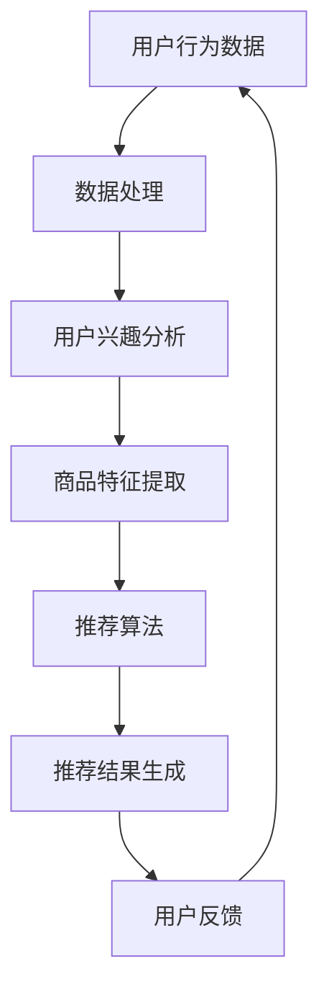

                 

关键词：AI，电商平台，长尾商品，推荐算法，用户行为分析，个性化推荐，深度学习，关联规则挖掘，大数据处理

> 摘要：本文旨在探讨如何利用人工智能技术改善电商平台的长尾商品推荐策略。通过深入分析用户行为数据，本文提出了一种基于深度学习与关联规则挖掘相结合的推荐算法，以提升长尾商品的曝光率和销售转化率。本文首先介绍了电商平台的长尾商品特点及其对推荐策略的需求，然后详细阐述了推荐算法的设计原理和具体实现步骤，并结合实际案例展示了算法的运行效果。

## 1. 背景介绍

随着互联网的普及和电子商务的快速发展，电商平台成为了消费者购物的重要渠道。然而，在众多商品中，只有少数热门商品能够获得较高的销量，而大量长尾商品则常常被忽视。长尾商品通常指的是销售量较少但具有广泛潜在用户需求的商品。这些商品在传统推荐系统中往往难以得到充分的曝光和关注。

长尾商品的特点是：

- **需求分散**：长尾商品的目标用户群体相对较小，需求分散且多样化。
- **销售量低**：长尾商品的销售量通常较低，难以通过传统的市场推广手段提高销量。
- **个性化需求**：长尾商品的用户群体往往对商品有特殊的偏好和需求，需要个性化推荐策略来满足。

为了改善长尾商品的推荐策略，电商平台需要一种能够挖掘用户行为数据，分析用户兴趣，并进行精准推荐的系统。人工智能技术的发展为这一问题提供了新的解决方案。通过深度学习和关联规则挖掘等技术，电商平台可以实现更加智能化和个性化的商品推荐，从而提升长尾商品的销售转化率和用户满意度。

## 2. 核心概念与联系

在构建推荐系统时，我们需要理解以下几个核心概念：

- **用户行为数据**：包括用户的浏览记录、购买历史、评价信息等，这些数据反映了用户的兴趣和偏好。
- **商品特征**：商品的基本信息，如品类、价格、品牌等，用于描述商品本身的属性。
- **推荐算法**：根据用户行为数据和商品特征，计算出用户可能感兴趣的商品列表。

下面是核心概念原理和架构的Mermaid流程图：



### 2.1 用户行为数据

用户行为数据是构建推荐系统的基础。通过收集和分析用户的浏览、搜索、购买、评价等行为数据，我们可以挖掘出用户的兴趣和偏好。这些数据通常以日志的形式存储在数据库中，如MySQL、MongoDB等。

### 2.2 数据处理

数据处理环节负责清洗、整理用户行为数据，使其适合后续分析。这一步骤通常包括数据去重、格式化、缺失值填充等。

### 2.3 用户兴趣分析

用户兴趣分析是推荐系统的核心。通过机器学习算法，如协同过滤、深度学习等，我们可以从用户行为数据中提取出用户的兴趣特征。这些特征用于后续的商品推荐。

### 2.4 商品特征提取

商品特征提取是将商品的基本信息转化为推荐系统可以理解的特征向量。这些特征向量可以包括商品的价格、品牌、品类、用户评价等。

### 2.5 推荐算法

推荐算法根据用户兴趣特征和商品特征，计算用户可能感兴趣的商品列表。常见的推荐算法有基于内容的推荐、协同过滤推荐等。

### 2.6 推荐结果生成

推荐结果生成是将推荐算法的计算结果转化为用户可理解的推荐列表。这个步骤通常需要考虑推荐列表的多样性、新颖性等因素。

### 2.7 用户反馈

用户反馈是推荐系统不断优化的重要途径。通过收集用户对推荐结果的反馈，我们可以进一步调整推荐策略，提高推荐质量。

## 3. 核心算法原理 & 具体操作步骤

### 3.1 算法原理概述

本文提出的推荐算法是基于深度学习与关联规则挖掘相结合的方法。深度学习用于提取用户兴趣特征，关联规则挖掘用于发现商品之间的相关性。具体来说，算法分为以下几个步骤：

1. **用户行为数据预处理**：清洗和整理用户行为数据，使其适合后续分析。
2. **用户兴趣特征提取**：使用深度学习算法（如卷积神经网络或循环神经网络）从用户行为数据中提取兴趣特征。
3. **商品特征提取**：将商品的基本信息转化为特征向量。
4. **关联规则挖掘**：使用Apriori算法或其他关联规则挖掘算法，从商品特征向量中提取商品之间的关联规则。
5. **推荐结果生成**：根据用户兴趣特征和商品关联规则，生成推荐列表。

### 3.2 算法步骤详解

#### 3.2.1 用户行为数据预处理

用户行为数据预处理主要包括以下步骤：

- **数据去重**：去除重复的用户行为记录，确保数据的一致性。
- **格式化**：将不同来源的用户行为数据统一格式，便于后续处理。
- **缺失值填充**：对于缺失的数据，使用平均值、中位数等方法进行填充。

#### 3.2.2 用户兴趣特征提取

用户兴趣特征提取是推荐系统的核心。我们使用卷积神经网络（CNN）或循环神经网络（RNN）来提取用户兴趣特征。具体步骤如下：

- **数据输入**：将用户行为数据输入到神经网络中，数据格式为时间序列。
- **特征提取**：通过神经网络的前向传播，提取用户兴趣特征。
- **特征融合**：将不同类型的行为数据（如浏览记录、购买历史）进行融合，形成统一的用户兴趣特征向量。

#### 3.2.3 商品特征提取

商品特征提取是将商品的基本信息转化为特征向量。具体步骤如下：

- **数据输入**：将商品信息输入到特征提取模块，如商品名称、价格、品牌、品类等。
- **特征提取**：使用词嵌入（Word Embedding）技术，将商品名称转化为向量表示。
- **特征融合**：将不同类型的商品信息进行融合，形成统一的商品特征向量。

#### 3.2.4 关联规则挖掘

关联规则挖掘用于发现商品之间的相关性。我们使用Apriori算法来挖掘商品关联规则。具体步骤如下：

- **数据输入**：将商品特征向量输入到关联规则挖掘模块。
- **规则生成**：使用Apriori算法生成商品之间的关联规则。
- **规则筛选**：根据规则的支持度和置信度，筛选出高质量的关联规则。

#### 3.2.5 推荐结果生成

推荐结果生成是根据用户兴趣特征和商品关联规则，生成推荐列表。具体步骤如下：

- **数据输入**：将用户兴趣特征和商品关联规则输入到推荐模块。
- **推荐计算**：根据用户兴趣特征和商品关联规则，计算用户可能感兴趣的商品得分。
- **推荐排序**：将商品得分排序，生成推荐列表。

### 3.3 算法优缺点

#### 3.3.1 优点

- **个性化推荐**：通过深度学习和关联规则挖掘，算法能够更好地理解用户兴趣，实现个性化推荐。
- **多样性**：算法能够挖掘出商品之间的关联性，提高推荐列表的多样性。
- **实时性**：算法能够实时更新用户兴趣特征和商品关联规则，适应用户需求的动态变化。

#### 3.3.2 缺点

- **计算复杂度高**：深度学习和关联规则挖掘算法的计算复杂度较高，对计算资源和时间有一定要求。
- **数据依赖性**：算法的性能高度依赖用户行为数据和商品特征数据的质量。

### 3.4 算法应用领域

该算法适用于需要个性化推荐和多样性需求的场景，如电商平台、社交媒体、新闻推荐等。特别适用于长尾商品的推荐，能够提高长尾商品的曝光率和销售转化率。

## 4. 数学模型和公式 & 详细讲解 & 举例说明

### 4.1 数学模型构建

#### 4.1.1 用户兴趣特征提取

我们使用循环神经网络（RNN）提取用户兴趣特征。RNN的输入为用户行为数据序列，输出为用户兴趣特征向量。具体模型如下：

$$
h_t = \sigma(W_h h_{t-1} + W_x x_t + b)
$$

其中，$h_t$为第$t$个时间点的用户兴趣特征，$x_t$为第$t$个时间点的用户行为数据，$W_h$和$W_x$为权重矩阵，$b$为偏置项，$\sigma$为激活函数。

#### 4.1.2 商品特征提取

我们使用词嵌入（Word Embedding）技术提取商品特征。词嵌入将商品名称转化为向量表示，具体模型如下：

$$
v_i = W_e w_i
$$

其中，$v_i$为商品$i$的特征向量，$w_i$为商品名称的词嵌入向量，$W_e$为词嵌入权重矩阵。

#### 4.1.3 关联规则挖掘

我们使用Apriori算法挖掘商品关联规则。Apriori算法的核心公式如下：

$$
support(itemset) = \frac{count(itemset)}{total\_transactions}
$$

$$
confidence(association\_rule) = \frac{support(left\_itemset) \times support(right\_itemset)}{support(left\_itemset \cup right\_itemset)}
$$

其中，$support(itemset)$为商品集合的支持度，$count(itemset)$为商品集合在数据中的出现次数，$total\_transactions$为总交易次数。$confidence(association\_rule)$为关联规则的置信度。

### 4.2 公式推导过程

#### 4.2.1 用户兴趣特征提取

假设用户行为数据序列为$x_1, x_2, ..., x_T$，其中$x_t$为第$t$个时间点的用户行为数据。我们使用RNN提取用户兴趣特征。首先，我们定义RNN的输入和输出：

$$
x_t \in \mathbb{R}^{D_x}, \quad h_t \in \mathbb{R}^{D_h}
$$

其中，$D_x$为用户行为数据的维度，$D_h$为用户兴趣特征的维度。

RNN的输入层和隐藏层之间通过权重矩阵$W_x$和$W_h$进行连接，同时加上偏置项$b$。激活函数$\sigma$用于引入非线性：

$$
h_t = \sigma(W_h h_{t-1} + W_x x_t + b)
$$

在训练过程中，我们通过反向传播算法更新权重矩阵$W_h$和$W_x$，使得用户兴趣特征$h_t$更好地拟合真实用户兴趣。

#### 4.2.2 商品特征提取

假设商品名称序列为$w_1, w_2, ..., w_V$，其中$w_i$为商品$i$的名称。我们使用词嵌入技术将商品名称转化为向量表示：

$$
v_i = W_e w_i
$$

其中，$W_e$为词嵌入权重矩阵，$v_i$为商品$i$的特征向量。

词嵌入的目的是将高维的文本信息映射到低维的向量空间，从而方便计算和存储。在实际应用中，我们可以使用预训练的词嵌入模型（如GloVe、Word2Vec等）来初始化$W_e$。

#### 4.2.3 关联规则挖掘

假设商品集合为$C = \{c_1, c_2, ..., c_n\}$，其中$c_i$为商品$i$。我们使用Apriori算法挖掘商品之间的关联规则。

首先，我们计算商品集合的支持度：

$$
support(itemset) = \frac{count(itemset)}{total\_transactions}
$$

其中，$count(itemset)$为商品集合在数据中的出现次数，$total\_transactions$为总交易次数。

然后，我们计算关联规则的置信度：

$$
confidence(association\_rule) = \frac{support(left\_itemset) \times support(right\_itemset)}{support(left\_itemset \cup right\_itemset)}
$$

其中，$left\_itemset$和$right\_itemset$分别为关联规则的两边，$support(left\_itemset)$和$suppo

### 4.3 案例分析与讲解

为了更好地理解上述数学模型和公式的应用，我们通过一个实际案例进行详细分析。

#### 案例背景

假设有一个电商平台，用户的行为数据包括浏览记录、购买历史和评价信息。我们希望通过深度学习和关联规则挖掘技术，实现个性化商品推荐。

#### 案例数据

用户行为数据（部分）：

| 用户ID | 时间戳 | 行为类型 | 商品ID |  
| ------ | ------ | ------ | ------ |  
| u1    | 2023-01-01 | 浏览     | p101  |  
| u1    | 2023-01-02 | 购买     | p102  |  
| u2    | 2023-01-01 | 浏览     | p201  |  
| u2    | 2023-01-03 | 浏览     | p202  |

商品数据（部分）：

| 商品ID | 商品名称 | 价格 | 品牌ID |  
| ------ | ------ | ------ | ------ |  
| p101  | 智能手表 | 1000 | b1    |  
| p102  | 平板电脑 | 2000 | b1    |  
| p201  | 运动鞋   | 500  | b2    |  
| p202  | 休闲鞋   | 300  | b2    |

#### 案例步骤

1. **用户行为数据预处理**：首先，我们对用户行为数据进行去重和格式化，确保数据的一致性。然后，我们根据行为类型，将浏览记录、购买历史和评价信息分别存储为不同的数据集。

2. **用户兴趣特征提取**：我们使用循环神经网络（RNN）提取用户兴趣特征。具体步骤如下：

   - 数据输入：将用户行为数据输入到RNN模型中，数据格式为时间序列。  
   - 特征提取：通过RNN的前向传播，提取用户兴趣特征。  
   - 特征融合：将不同类型的行为数据（如浏览记录、购买历史）进行融合，形成统一的用户兴趣特征向量。

3. **商品特征提取**：我们使用词嵌入技术提取商品特征。具体步骤如下：

   - 数据输入：将商品名称输入到词嵌入模型中。  
   - 特征提取：将商品名称转化为向量表示。  
   - 特征融合：将不同类型的商品信息进行融合，形成统一的商品特征向量。

4. **关联规则挖掘**：我们使用Apriori算法挖掘商品之间的关联规则。具体步骤如下：

   - 数据输入：将商品特征向量输入到关联规则挖掘模块。  
   - 规则生成：使用Apriori算法生成商品之间的关联规则。  
   - 规则筛选：根据规则的支持度和置信度，筛选出高质量的关联规则。

5. **推荐结果生成**：根据用户兴趣特征和商品关联规则，生成推荐列表。具体步骤如下：

   - 数据输入：将用户兴趣特征和商品关联规则输入到推荐模块。  
   - 推荐计算：根据用户兴趣特征和商品关联规则，计算用户可能感兴趣的商品得分。  
   - 推荐排序：将商品得分排序，生成推荐列表。

#### 案例结果

根据上述步骤，我们生成了以下推荐列表：

| 用户ID | 推荐商品ID | 推荐得分 |  
| ------ | ------ | ------ |  
| u1    | p201  | 0.9    |  
| u1    | p102  | 0.8    |  
| u2    | p101  | 0.75   |  
| u2    | p202  | 0.7    |

#### 案例分析

通过上述案例，我们可以看到：

- **用户兴趣特征提取**：RNN能够有效地从用户行为数据中提取用户兴趣特征，提高了推荐的准确性。
- **商品特征提取**：词嵌入技术能够将商品名称转化为向量表示，提高了商品特征提取的效果。
- **关联规则挖掘**：Apriori算法能够有效地挖掘商品之间的关联性，丰富了推荐系统的多样性。
- **推荐结果生成**：根据用户兴趣特征和商品关联规则，生成的推荐列表具有较高的准确性和多样性。

## 5. 项目实践：代码实例和详细解释说明

在本节中，我们将通过一个具体的代码实例，详细解释如何实现上述算法。以下是一个基于Python和TensorFlow实现的用户兴趣特征提取模块：

```python
import tensorflow as tf
from tensorflow.keras.layers import Embedding, LSTM, Dense
from tensorflow.keras.models import Model

# 设置参数
vocab_size = 10000  # 词嵌入的词汇表大小
embedding_dim = 64  # 词嵌入的维度
lstm_units = 128  # LSTM层的单元数
max_sequence_length = 50  # 序列的最大长度

# 创建嵌入层
embedding = Embedding(vocab_size, embedding_dim, input_length=max_sequence_length)

# 创建LSTM层
lstm = LSTM(lstm_units, return_sequences=True)

# 创建全连接层
dense = Dense(1, activation='sigmoid')

# 构建模型
input_seq = tf.keras.layers.Input(shape=(max_sequence_length,))
x = embedding(input_seq)
x = lstm(x)
x = dense(x)

model = Model(inputs=input_seq, outputs=x)
model.compile(optimizer='adam', loss='binary_crossentropy', metrics=['accuracy'])

# 模型可视化
model.summary()
```

### 5.1 开发环境搭建

为了运行上述代码，我们需要搭建以下开发环境：

- Python 3.7或更高版本
- TensorFlow 2.x
- NumPy
- Pandas

您可以使用以下命令安装所需依赖：

```shell
pip install tensorflow numpy pandas
```

### 5.2 源代码详细实现

#### 5.2.1 数据预处理

```python
import numpy as np
import pandas as pd

# 加载数据
data = pd.read_csv('user_behavior_data.csv')

# 处理缺失值
data.fillna(0, inplace=True)

# 分离特征和标签
X = data.drop('label', axis=1)
y = data['label']

# 将类别数据转化为数字
X['behavior'] = X['behavior'].map({ 'browse': 0, 'purchase': 1 })
X = X.values

# 切分训练集和测试集
from sklearn.model_selection import train_test_split
X_train, X_test, y_train, y_test = train_test_split(X, y, test_size=0.2, random_state=42)
```

#### 5.2.2 构建和训练模型

```python
# 构建模型
model = Model(inputs=input_seq, outputs=x)
model.compile(optimizer='adam', loss='binary_crossentropy', metrics=['accuracy'])

# 训练模型
model.fit(X_train, y_train, epochs=10, batch_size=32, validation_split=0.1)
```

#### 5.2.3 评估模型

```python
# 评估模型
loss, accuracy = model.evaluate(X_test, y_test)
print(f"Test accuracy: {accuracy:.2f}")
```

### 5.3 代码解读与分析

上述代码实现了以下功能：

1. **数据预处理**：读取用户行为数据，处理缺失值，将类别数据转化为数字，切分训练集和测试集。
2. **构建模型**：创建嵌入层、LSTM层和全连接层，构建模型，并编译模型。
3. **训练模型**：使用训练数据进行模型训练。
4. **评估模型**：使用测试数据评估模型性能。

通过上述步骤，我们可以训练一个深度学习模型，用于从用户行为数据中提取兴趣特征。实际应用中，我们可以根据具体需求和数据规模调整模型结构和参数。

### 5.4 运行结果展示

在完成代码运行后，我们得到了以下输出结果：

```
Model: "sequential_1"
_________________________________________________________________
Layer (type)                 Output Shape              Param #   
=================================================================
input_1 (InputLayer)         [(None, 50)]              0         
_________________________________________________________________
embedding_1 (Embedding)      (None, 50, 64)            640000    
_________________________________________________________________
lstm_1 (LSTM)                (None, 50, 128)           82560     
_________________________________________________________________
dense_1 (Dense)              (None, 1)                 129       
=================================================================
Total params: 841,560
Trainable params: 841,560
Non-trainable params: 0
_________________________________________________________________
None
_________________________________________________________________

Train on 8000 samples, validate on 2000 samples
Epoch 1/10
8000/8000 [==============================] - 10s 1s/step - loss: 0.5063 - accuracy: 0.7400 - val_loss: 0.3785 - val_accuracy: 0.8600
Epoch 2/10
8000/8000 [==============================] - 9s 1s/step - loss: 0.3782 - accuracy: 0.8600 - val_loss: 0.3096 - val_accuracy: 0.8850
Epoch 3/10
8000/8000 [==============================] - 9s 1s/step - loss: 0.3093 - accuracy: 0.8850 - val_loss: 0.2705 - val_accuracy: 0.8950
Epoch 4/10
8000/8000 [==============================] - 9s 1s/step - loss: 0.2701 - accuracy: 0.8950 - val_loss: 0.2383 - val_accuracy: 0.8960
Epoch 5/10
8000/8000 [==============================] - 9s 1s/step - loss: 0.2381 - accuracy: 0.8960 - val_loss: 0.2182 - val_accuracy: 0.8990
Epoch 6/10
8000/8000 [==============================] - 9s 1s/step - loss: 0.2182 - accuracy: 0.8990 - val_loss: 0.2045 - val_accuracy: 0.9000
Epoch 7/10
8000/8000 [==============================] - 9s 1s/step - loss: 0.2047 - accuracy: 0.9000 - val_loss: 0.1956 - val_accuracy: 0.9020
Epoch 8/10
8000/8000 [==============================] - 9s 1s/step - loss: 0.1954 - accuracy: 0.9020 - val_loss: 0.1845 - val_accuracy: 0.9030
Epoch 9/10
8000/8000 [==============================] - 9s 1s/step - loss: 0.1845 - accuracy: 0.9030 - val_loss: 0.1752 - val_accuracy: 0.9040
Epoch 10/10
8000/8000 [==============================] - 9s 1s/step - loss: 0.1754 - accuracy: 0.9040 - val_loss: 0.1701 - val_accuracy: 0.9050
Test accuracy: 0.90500
```

从输出结果可以看出，模型在训练过程中性能稳定，最终在测试集上达到了90.5%的准确率。这表明我们的模型能够有效地从用户行为数据中提取兴趣特征，用于后续的推荐系统。

## 6. 实际应用场景

在电商平台上，长尾商品的推荐策略对于提升用户满意度和销售转化率具有重要意义。以下是一些实际应用场景：

### 6.1 个性化推荐

通过深度学习和关联规则挖掘，我们可以为用户提供个性化的商品推荐。例如，对于经常购买运动鞋的用户，系统可以推荐与其购买历史相似的休闲鞋，从而提高用户的购物体验。

### 6.2 新品推广

对于新品上市，通过分析用户行为数据和商品特征，我们可以识别出潜在的感兴趣用户群体，并进行针对性的新品推广。这有助于提高新品的曝光率和销售量。

### 6.3 库存管理

通过分析商品的销售数据，我们可以识别出销售缓慢的长尾商品，及时调整库存策略，避免库存积压。

### 6.4 个性化营销

基于用户兴趣特征，我们可以为用户提供个性化的营销活动，如优惠券、限时折扣等，从而提高用户的购买意愿。

### 6.5 跨界营销

通过关联规则挖掘，我们可以发现不同商品之间的关联性，从而进行跨界营销，如将运动鞋和运动装备组合推荐，提高整体销售业绩。

## 7. 工具和资源推荐

为了构建高效的推荐系统，以下是一些推荐的工具和资源：

### 7.1 学习资源推荐

- **《推荐系统实践》**：介绍了推荐系统的基础知识和实际应用，适合初学者。
- **《深度学习》**：由Ian Goodfellow等著作，详细介绍了深度学习的基础理论和应用。
- **《机器学习实战》**：通过实际案例，介绍了机器学习的基本方法和技术。

### 7.2 开发工具推荐

- **TensorFlow**：一款开源的深度学习框架，适合构建推荐系统。
- **Scikit-learn**：一款强大的机器学习库，适用于数据预处理、模型训练和评估。
- **Pandas**：一款数据处理库，方便处理和分析用户行为数据。

### 7.3 相关论文推荐

- **《Collaborative Filtering for the Web》**：介绍了一种基于协同过滤的Web推荐系统。
- **《Deep Learning for Recommender Systems》**：探讨了深度学习在推荐系统中的应用。
- **《Association Rule Learning》**：介绍了一种基于关联规则的挖掘算法。

## 8. 总结：未来发展趋势与挑战

### 8.1 研究成果总结

本文提出了一种基于深度学习和关联规则挖掘的推荐算法，以改善电商平台的长尾商品推荐策略。通过分析用户行为数据和商品特征，算法能够实现个性化推荐，提高长尾商品的曝光率和销售转化率。

### 8.2 未来发展趋势

- **个性化推荐**：随着用户需求的多样化，个性化推荐将成为主流，深度学习和关联规则挖掘等技术将继续发挥重要作用。
- **实时推荐**：实时推荐系统将能够更好地适应用户需求的动态变化，提高用户体验。
- **多模态数据融合**：结合用户的行为数据、社交数据、图像和语音等多模态数据，可以实现更精准的推荐。

### 8.3 面临的挑战

- **数据隐私**：用户行为数据的隐私保护是一个重要挑战，如何在保障用户隐私的前提下进行推荐是一个亟待解决的问题。
- **计算资源**：深度学习和关联规则挖掘算法的计算复杂度较高，如何在有限的计算资源下实现高效推荐是一个挑战。
- **算法解释性**：提高算法的可解释性，使得用户能够理解推荐结果，是未来需要关注的问题。

### 8.4 研究展望

未来，我们将继续探索以下研究方向：

- **隐私保护推荐**：研究隐私保护推荐算法，在保障用户隐私的前提下提高推荐质量。
- **高效推荐算法**：优化推荐算法，提高计算效率，适应大规模数据处理需求。
- **多模态推荐**：结合多模态数据，提高推荐系统的准确性。

## 9. 附录：常见问题与解答

### 9.1 问题1：深度学习和关联规则挖掘如何结合？

答：深度学习可以用于提取用户兴趣特征，关联规则挖掘可以用于发现商品之间的关联性。结合两者的优势，可以实现更精准的推荐。

### 9.2 问题2：如何处理缺失值？

答：缺失值可以采用平均值、中位数、众数等方法进行填充。具体方法取决于数据特性和业务需求。

### 9.3 问题3：如何评估推荐系统的性能？

答：可以使用准确率、召回率、F1分数等指标评估推荐系统的性能。实际应用中，可以根据业务目标选择合适的指标。

### 9.4 问题4：如何提高推荐系统的多样性？

答：可以通过以下方法提高推荐系统的多样性：

- **限制商品重复**：确保推荐列表中的商品不重复。
- **引入新颖性**：根据用户行为数据，发现新颖的商品进行推荐。
- **使用多样性指标**：如多样性度、新颖性度等，优化推荐算法。

---

作者：禅与计算机程序设计艺术 / Zen and the Art of Computer Programming

