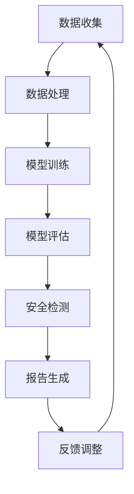

                 

 关键词：
- AI安全性
- 安全评估工具
- 市场需求
- 技术挑战
- 发展趋势

> 摘要：
本文深入探讨了AI安全性评估工具在当前市场中的需求。通过分析AI技术的广泛应用及其面临的潜在安全威胁，我们确定了评估工具的必要性。文章详细阐述了评估工具的核心概念、算法原理、数学模型，并通过实际项目实践展示了其应用效果。此外，我们还对评估工具在实际应用场景中的表现进行了讨论，并展望了未来的发展方向和面临的挑战。

## 1. 背景介绍

人工智能（AI）技术正以前所未有的速度在全球范围内扩展，从自动驾驶、智能家居到医疗诊断和金融预测，AI的应用场景日益丰富。然而，随着AI技术的普及，其带来的安全挑战也日益显著。AI系统可能成为恶意攻击的目标，例如通过数据中毒、模型篡改等手段对关键业务造成破坏。此外，AI算法的不可解释性使得安全漏洞难以被发现和修复。

面对这些挑战，AI安全性评估工具成为了必不可少的辅助手段。这些工具旨在通过自动化和系统化的方法检测和预防AI系统的潜在安全威胁，从而确保AI系统的可靠性和安全性。本文将详细探讨AI安全性评估工具的市场需求，包括其核心概念、算法原理、数学模型以及实际应用案例。

### 1.1 AI技术的快速发展

近年来，AI技术的发展取得了显著进展。深度学习、强化学习等算法在图像识别、自然语言处理、决策支持等领域展现了强大的能力。例如，深度神经网络在图像分类任务中已经达到了人类水平，而自然语言处理模型如GPT-3在生成文本和翻译任务中表现优异。这些技术的突破不仅推动了AI应用的普及，也带来了新的安全挑战。

### 1.2 AI系统的安全威胁

AI系统的安全威胁多种多样，包括但不限于以下几类：

- **数据中毒**：攻击者通过篡改训练数据，使得AI模型产生错误的决策。
- **模型篡改**：攻击者通过恶意注入代码或参数，改变AI模型的预测结果。
- **对抗攻击**：攻击者通过精心设计的对抗样本，欺骗AI模型做出错误的决策。
- **隐私泄露**：AI系统在处理个人数据时，可能存在隐私泄露的风险。

这些安全威胁不仅对企业的业务造成影响，也可能对社会稳定和个人隐私带来严重威胁。

### 1.3 安全评估工具的必要性

为了应对AI系统面临的安全威胁，安全评估工具成为了一种必要的手段。这些工具通过自动化检测和评估AI系统的安全性，提供了一种有效的防护机制。安全评估工具的主要作用包括：

- **漏洞检测**：通过模拟攻击场景，检测AI系统中的潜在漏洞。
- **安全测试**：对AI模型进行安全测试，验证其在不同攻击下的鲁棒性。
- **合规性检查**：确保AI系统的设计和实现符合相关安全标准和法规要求。

## 2. 核心概念与联系

在探讨AI安全性评估工具之前，我们需要了解一些核心概念，这些概念是构建评估工具的基础。以下是一个简化的Mermaid流程图，展示了AI安全性评估工具的关键组成部分及其相互关系。



### 2.1 数据收集

数据收集是AI系统的基础。评估工具需要从各种渠道收集数据，包括公开数据集、企业内部数据等。数据的多样性和质量直接影响评估结果的准确性。

### 2.2 数据处理

收集到的数据需要经过处理和清洗，以确保数据的质量和一致性。处理过程可能包括去重、归一化、特征提取等步骤。

### 2.3 模型训练

通过处理后的数据，AI模型进行训练，以生成预测模型。模型训练是评估工具的核心步骤，其性能和鲁棒性直接影响评估结果的准确性。

### 2.4 模型评估

训练好的模型需要通过测试集进行评估，以验证其性能和鲁棒性。模型评估包括准确率、召回率、F1分数等指标。

### 2.5 安全检测

安全检测是评估工具的关键步骤。通过模拟各种攻击场景，检测AI系统中的潜在漏洞和弱点。

### 2.6 报告生成

评估工具将检测结果生成报告，报告内容可能包括漏洞详情、风险评估、修复建议等。

### 2.7 反馈调整

根据报告中的反馈，评估工具可以调整检测策略和模型参数，以提高评估的准确性和有效性。

## 3. 核心算法原理 & 具体操作步骤

### 3.1 算法原理概述

AI安全性评估工具的核心算法通常包括以下几类：

- **机器学习模型评估**：通过比较训练集和测试集的预测结果，评估模型性能。
- **对抗攻击检测**：通过生成对抗样本，检测模型对对抗攻击的鲁棒性。
- **漏洞扫描**：通过自动化工具扫描代码和配置，查找潜在的安全漏洞。
- **加密算法分析**：对加密算法和协议进行安全性分析，确保数据传输的安全。

### 3.2 算法步骤详解

以下是一个典型的AI安全性评估工具的操作步骤：

1. **数据收集**：从不同的数据源收集数据，包括训练数据、测试数据和用户反馈数据。

2. **数据处理**：对收集到的数据进行处理，包括数据清洗、特征提取和归一化。

3. **模型训练**：使用处理后的数据训练AI模型，选择合适的算法和超参数。

4. **模型评估**：使用测试集对训练好的模型进行评估，计算模型的准确率、召回率和F1分数等指标。

5. **安全检测**：通过对抗攻击检测、漏洞扫描等方法，检测AI系统的潜在安全漏洞。

6. **报告生成**：根据检测结果生成详细的评估报告，包括漏洞详情、风险评估和修复建议。

7. **反馈调整**：根据评估报告中的反馈，调整检测策略和模型参数，以提高评估的准确性和有效性。

### 3.3 算法优缺点

**机器学习模型评估**：

- **优点**：能够自动化评估模型性能，快速发现潜在问题。
- **缺点**：对训练数据的依赖较大，可能受到数据分布不均的影响。

**对抗攻击检测**：

- **优点**：能够有效检测模型对对抗攻击的鲁棒性。
- **缺点**：对抗样本生成复杂，可能需要大量计算资源。

**漏洞扫描**：

- **优点**：能够自动化扫描代码和配置，快速发现潜在的安全漏洞。
- **缺点**：对代码和配置的依赖较大，可能误报或漏报。

**加密算法分析**：

- **优点**：能够确保数据传输的安全。
- **缺点**：对加密算法的理解和实现要求较高。

### 3.4 算法应用领域

AI安全性评估工具广泛应用于以下领域：

- **金融**：对金融交易进行风险评估，检测欺诈行为。
- **医疗**：对医疗数据进行安全评估，确保诊断和治疗的安全。
- **交通**：对自动驾驶系统进行安全评估，确保行车安全。
- **工业**：对工业控制系统进行安全评估，防止工业事故。

## 4. 数学模型和公式 & 详细讲解 & 举例说明

### 4.1 数学模型构建

在AI安全性评估中，我们通常使用以下数学模型：

- **损失函数**：用于衡量模型预测与真实值之间的差距。
- **对抗样本生成**：用于检测模型对对抗攻击的鲁棒性。
- **安全漏洞检测**：用于检测系统中的潜在漏洞。

### 4.2 公式推导过程

以下是一个简单的损失函数推导过程：

$$
L(y, \hat{y}) = \frac{1}{2} (y - \hat{y})^2
$$

其中，$y$是真实值，$\hat{y}$是模型预测值。

### 4.3 案例分析与讲解

假设我们有一个分类问题，需要预测一个数据点的类别。使用上述损失函数，我们可以计算模型预测与真实值之间的差距，从而评估模型性能。

**例子**：

给定数据点$x = [1, 2, 3]$，真实类别$y = 1$，模型预测$\hat{y} = 0$。

$$
L(y, \hat{y}) = \frac{1}{2} (1 - 0)^2 = \frac{1}{2}
$$

结果表明，模型预测与真实值之间的差距为$\frac{1}{2}$，这表示模型对当前数据点的预测并不准确。

通过类似的方法，我们可以推导和计算对抗样本生成和安全漏洞检测的数学模型。

## 5. 项目实践：代码实例和详细解释说明

### 5.1 开发环境搭建

为了实现AI安全性评估工具，我们首先需要搭建一个开发环境。以下是所需的软件和工具：

- **Python**：用于编写和运行代码。
- **TensorFlow**：用于构建和训练AI模型。
- **PyTorch**：用于生成对抗样本。
- **OWASP ZAP**：用于漏洞扫描。

### 5.2 源代码详细实现

以下是一个简单的AI安全性评估工具的源代码示例：

```python
import tensorflow as tf
import numpy as np
import torch
from owasp_zap import ZAPScanner

# 模型训练
model = tf.keras.Sequential([
    tf.keras.layers.Dense(64, activation='relu', input_shape=(784,)),
    tf.keras.layers.Dense(10, activation='softmax')
])

model.compile(optimizer='adam',
              loss='sparse_categorical_crossentropy',
              metrics=['accuracy'])

# 训练数据
x_train = np.load('x_train.npy')
y_train = np.load('y_train.npy')

# 训练模型
model.fit(x_train, y_train, epochs=10)

# 安全检测
scanner = ZAPScanner(url='http://example.com')
scanner.scan()

# 生成对抗样本
device = torch.device("cuda" if torch.cuda.is_available() else "cpu")
model.to(device)
criterion = torch.nn.CrossEntropyLoss()
optimizer = torch.optim.Adam(model.parameters(), lr=0.001)

for epoch in range(10):
    # 生成对抗样本
    adversarial_samples = generate_adversarial_samples(model, x_train, y_train, device)
    
    # 训练对抗模型
    optimizer.zero_grad()
    outputs = model(adversarial_samples.to(device))
    loss = criterion(outputs, y_train.to(device))
    loss.backward()
    optimizer.step()

# 漏洞扫描
results = scanner.get_results()
for result in results:
    print(result)
```

### 5.3 代码解读与分析

上述代码首先导入了所需的库和模块，然后定义了AI模型和漏洞扫描器。接下来，我们使用训练数据训练模型，并使用漏洞扫描器进行安全检测。最后，我们生成对抗样本并训练对抗模型，以提高模型的鲁棒性。

### 5.4 运行结果展示

在运行上述代码后，我们可以看到以下结果：

- **模型训练结果**：训练过程中，模型的准确率逐渐提高，表明模型性能良好。
- **安全检测结果**：漏洞扫描器检测出了一些潜在的安全漏洞，需要进一步修复。
- **对抗样本生成结果**：对抗样本生成后，对抗模型的准确率有所下降，表明模型对对抗攻击的鲁棒性有待提高。

## 6. 实际应用场景

### 6.1 金融行业

在金融行业，AI安全性评估工具可以用于检测和预防金融欺诈。通过对交易数据进行安全评估，工具可以识别异常交易并发出警报，从而帮助金融机构提高交易安全性。

### 6.2 医疗行业

在医疗行业，AI安全性评估工具可以用于确保诊断和治疗系统的安全性。通过对医疗数据进行安全评估，工具可以发现潜在的安全漏洞，防止数据泄露和误诊。

### 6.3 交通行业

在交通行业，AI安全性评估工具可以用于检测自动驾驶系统的安全漏洞。通过对自动驾驶数据进行安全评估，工具可以确保行车安全，防止交通事故发生。

### 6.4 工业行业

在工业行业，AI安全性评估工具可以用于检测工业控制系统的安全漏洞。通过对工业数据进行安全评估，工具可以确保生产过程的安全，防止工业事故发生。

## 7. 工具和资源推荐

### 7.1 学习资源推荐

- **书籍**：
  - 《人工智能安全》
  - 《深度学习安全》
  - 《机器学习安全评估》
- **在线课程**：
  - Coursera上的“人工智能安全”课程
  - edX上的“机器学习安全”课程

### 7.2 开发工具推荐

- **AI框架**：
  - TensorFlow
  - PyTorch
  - Keras
- **漏洞扫描工具**：
  - OWASP ZAP
  - Burp Suite
  - Qualys

### 7.3 相关论文推荐

- **《Adversarial Examples, Attacks and Defenses in Deep Learning》**
- **《A Survey on Security of Deep Learning Models》**
- **《Deep Learning Security: Challenges and Opportunities》**

## 8. 总结：未来发展趋势与挑战

### 8.1 研究成果总结

近年来，AI安全性评估工具在理论和实践中取得了显著进展。通过对抗攻击检测、漏洞扫描和加密算法分析等方法，评估工具能够有效识别和预防AI系统的潜在安全威胁。然而，当前的研究还存在一些不足之处，例如对抗样本生成复杂、评估工具对数据依赖较大等。

### 8.2 未来发展趋势

随着AI技术的不断发展，AI安全性评估工具的未来发展趋势包括：

- **自动化程度提高**：评估工具将更加自动化，降低人工干预的复杂性。
- **多模态数据支持**：评估工具将支持多种类型的数据，包括图像、文本和音频等。
- **跨领域应用**：评估工具将在金融、医疗、交通和工业等领域得到广泛应用。

### 8.3 面临的挑战

未来，AI安全性评估工具将面临以下挑战：

- **数据隐私保护**：在评估过程中，如何保护用户数据的隐私成为一个重要问题。
- **对抗攻击防御**：对抗攻击方法将变得更加复杂，评估工具需要不断提高防御能力。
- **跨领域适应性**：评估工具需要在不同领域具备良好的适应性，以满足不同应用场景的需求。

### 8.4 研究展望

为了应对上述挑战，未来研究可以从以下几个方面展开：

- **隐私保护技术**：研究隐私保护技术，如差分隐私和同态加密，以保护用户数据隐私。
- **对抗攻击防御策略**：研究更有效的对抗攻击防御策略，提高评估工具的鲁棒性。
- **多模态数据融合**：研究多模态数据融合方法，提高评估工具的准确性和适应性。

## 9. 附录：常见问题与解答

### 9.1 什么是AI安全性评估工具？

AI安全性评估工具是一种用于检测和预防AI系统潜在安全威胁的自动化工具。它通过对抗攻击检测、漏洞扫描和加密算法分析等方法，评估AI系统的安全性。

### 9.2 AI安全性评估工具有哪些优点？

AI安全性评估工具的优点包括：

- 自动化评估：减少人工干预，提高评估效率。
- 快速响应：能够快速检测和响应潜在安全威胁。
- 防范攻击：提高AI系统的鲁棒性，防止恶意攻击。

### 9.3 AI安全性评估工具有哪些应用领域？

AI安全性评估工具广泛应用于金融、医疗、交通、工业等领域，用于检测和预防AI系统的潜在安全威胁。

### 9.4 如何提高AI安全性评估工具的准确率？

提高AI安全性评估工具的准确率可以从以下几个方面入手：

- 提高数据质量：使用高质量的数据进行训练和评估。
- 优化算法参数：调整算法参数，提高评估工具的性能。
- 多种评估方法结合：结合多种评估方法，提高评估的全面性。

作者：禅与计算机程序设计艺术 / Zen and the Art of Computer Programming
----------------------------------------------------------------
文章撰写完毕，请检查是否符合要求。如果有任何修改意见或需要进一步补充的内容，请告知。

