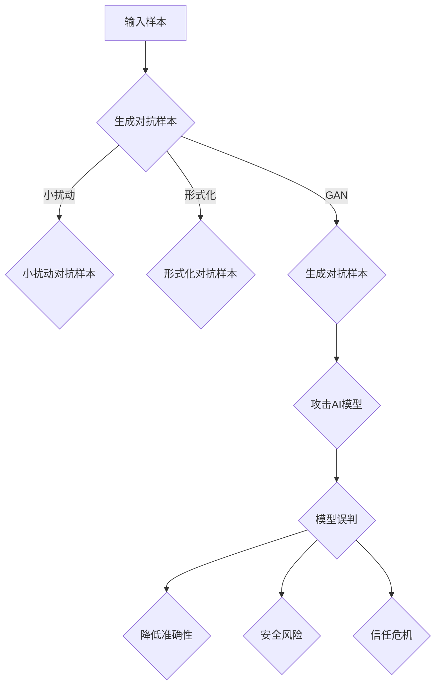

                 

关键词：人工智能，安全性，对抗样本，模型鲁棒性，神经网络，机器学习，安全防御策略。

> 摘要：本文将深入探讨人工智能系统中的安全挑战，特别是对抗样本和模型鲁棒性。通过详细分析对抗样本的概念、影响以及相关的防御策略，我们将揭示如何提升人工智能系统的安全性。本文旨在为读者提供一个全面的技术指南，帮助他们理解这一重要领域，并为未来的研究提供启示。

## 1. 背景介绍

在过去的几十年中，人工智能（AI）技术取得了飞速发展。从早期的规则系统到如今的深度学习模型，AI已经在各个领域展现出强大的应用潜力。然而，随着AI技术的普及，其安全性问题也日益突出。特别是对抗样本（Adversarial Examples）的出现，对人工智能系统的安全性构成了严重威胁。

对抗样本是指在保持原始样本外观不变的情况下，通过细微调整使其对人工智能模型产生误判的样本。这种现象不仅影响了AI的准确性，还可能引发更严重的后果，如自动驾驶汽车的交通事故或医疗诊断系统的错误判断。

模型鲁棒性是衡量AI系统在对抗样本攻击下的抵抗能力的重要指标。一个鲁棒的AI系统应该能够在面对故意设计的不良输入时保持其性能。然而，当前许多AI模型在对抗样本攻击下表现不佳，这促使研究者们投入大量精力来提升模型的鲁棒性。

本文将首先介绍对抗样本的概念、类型及其对AI系统的影响。接着，我们将探讨目前常见的防御策略，如数据增强、模型优化和对抗训练。最后，我们将讨论模型鲁棒性的重要性，并展望未来在AI安全性领域的研究趋势。

## 2. 核心概念与联系

### 2.1. 对抗样本的概念

对抗样本是指在保持原始样本外观不变的情况下，通过细微调整使其对人工智能模型产生误判的样本。这种样本通常通过在原始样本上添加微小的噪声或扰动来生成。对抗样本的目的是欺骗AI模型，使其无法正确分类或预测。

### 2.2. 对抗样本的类型

对抗样本可以分为多种类型，包括：

1. **小扰动对抗样本**：这类样本通过在原始样本的像素值上添加非常小的扰动来生成。这些扰动通常在视觉上难以察觉，但足以导致AI模型产生误判。
2. **形式化对抗样本**：这类样本是通过特定的数学优化方法生成的，以确保它们能够最大化模型预测误差。形式化对抗样本通常具有更高的攻击成功率。
3. **生成对抗样本**：这类样本是通过生成对抗网络（GANs）生成的。GANs是一种能够生成逼真数据的深度学习模型，可以用来生成具有高度欺骗性的对抗样本。

### 2.3. 对抗样本的影响

对抗样本对AI系统的影响是多方面的：

1. **降低准确性**：对抗样本可能导致AI模型的准确性大幅下降，甚至从高准确率降至几乎随机水平。
2. **安全风险**：在自动驾驶、医疗诊断等关键领域，对抗样本可能导致严重的安全问题，如交通事故或错误的医疗诊断。
3. **信任危机**：对抗样本的存在可能削弱公众对AI系统的信任，影响AI技术的普及和应用。

### 2.4. 对抗样本与模型鲁棒性的关系

对抗样本的生成和模型鲁棒性密切相关。一个鲁棒的AI模型应该能够抵御对抗样本的攻击，保持其性能。然而，当前许多AI模型在对抗样本攻击下表现不佳，这表明模型鲁棒性仍然是一个亟待解决的问题。

### 2.5. Mermaid 流程图

下面是一个简化的对抗样本生成和防御的Mermaid流程图：



## 3. 核心算法原理 & 具体操作步骤

### 3.1. 算法原理概述

对抗样本的生成通常基于优化方法，如梯度上升法或基于生成对抗网络的对抗性训练。以下是两种常见的对抗样本生成方法：

1. **梯度上升法**：通过分析AI模型的梯度信息，在原始样本上添加微小的扰动，以最大化模型预测误差。
2. **生成对抗网络（GAN）**：通过训练一个生成器模型和一个判别器模型，生成具有高度欺骗性的对抗样本。

### 3.2. 算法步骤详解

#### 3.2.1. 梯度上升法

1. **初始化**：选择一个原始样本`x`和一个初始扰动`δ`。
2. **计算梯度**：计算模型对样本`x + δ`的梯度。
3. **更新扰动**：根据梯度信息更新扰动`δ`，使其最大化模型预测误差。
4. **重复步骤2和3**，直至达到预设的扰动阈值或达到最大迭代次数。

#### 3.2.2. 生成对抗网络（GAN）

1. **初始化**：生成器`G`和判别器`D`。
2. **生成对抗训练**：
   - 从真实数据集中随机抽取样本`x`。
   - 生成器`G`生成伪样本`G(x)`。
   - 判别器`D`对真实样本`x`和伪样本`G(x)`进行分类。
   - 使用对抗性损失函数更新生成器和判别器。
3. **重复步骤2**，直至生成器模型达到预设的性能指标。

### 3.3. 算法优缺点

#### 优点：

- **高效性**：梯度上升法能够快速找到对抗样本。
- **灵活性**：GAN能够生成具有高度欺骗性的对抗样本。

#### 缺点：

- **计算成本**：GAN的训练过程需要大量的计算资源。
- **稳定性**：GAN的训练过程可能不稳定，需要精心调整超参数。

### 3.4. 算法应用领域

对抗样本生成算法在多个领域都有广泛应用，包括：

- **网络安全**：通过生成对抗样本来测试AI系统的安全性。
- **自动驾驶**：评估自动驾驶系统在对抗样本攻击下的性能。
- **医疗诊断**：检测AI系统在对抗样本攻击下的误判情况。

## 4. 数学模型和公式 & 详细讲解 & 举例说明

### 4.1. 数学模型构建

对抗样本生成通常涉及以下数学模型：

#### 4.1.1. 梯度上升法

梯度上升法的目标是最小化以下损失函数：

$$ L(\delta) = -\log(D(x + \delta)) $$

其中，`D`是判别器模型，`x`是原始样本，`\delta`是扰动。

#### 4.1.2. 生成对抗网络（GAN）

GAN由生成器`G`和判别器`D`组成。生成器的目标是生成逼真的伪样本，而判别器的目标是区分真实样本和伪样本。目标函数分别为：

- **生成器目标函数**：

$$ G(x) = \arg\min_G \mathbb{E}_{x \sim p_{data}(x)} [\log(D(G(x))] + \log(1 - D(x)) $$

- **判别器目标函数**：

$$ D(x) = \arg\max_D \mathbb{E}_{x \sim p_{data}(x)} [\log(D(x))] + \mathbb{E}_{G(z) \sim p_z(z)} [\log(1 - D(G(z))] $$

其中，`z`是生成器输入的随机噪声。

### 4.2. 公式推导过程

#### 4.2.1. 梯度上升法

梯度上升法的推导过程如下：

1. **损失函数**：

$$ L(\delta) = -\log(D(x + \delta)) $$

2. **梯度**：

$$ \nabla_{\delta} L(\delta) = -\frac{1}{D(x + \delta)} $$

3. **更新规则**：

$$ \delta_{new} = \delta_{old} + \eta \nabla_{\delta} L(\delta) $$

其中，`\eta`是学习率。

#### 4.2.2. 生成对抗网络（GAN）

GAN的推导过程如下：

1. **生成器损失函数**：

$$ L_G = -\mathbb{E}_{x \sim p_{data}(x)} [\log(D(G(x))] + \log(1 - D(x))] $$

2. **判别器损失函数**：

$$ L_D = \mathbb{E}_{x \sim p_{data}(x)} [\log(D(x))] + \mathbb{E}_{G(z) \sim p_z(z)} [\log(1 - D(G(z))] $$

3. **梯度更新规则**：

- **生成器**：

$$ \nabla_G L_G = \nabla_G \left( -\mathbb{E}_{x \sim p_{data}(x)} [\log(D(G(x))] + \log(1 - D(x)) \right) $$

- **判别器**：

$$ \nabla_D L_D = \nabla_D \left( \mathbb{E}_{x \sim p_{data}(x)} [\log(D(x))] + \mathbb{E}_{G(z) \sim p_z(z)} [\log(1 - D(G(z)))] \right) $$

### 4.3. 案例分析与讲解

#### 4.3.1. 案例背景

假设我们有一个基于深度学习的图像分类模型，用于识别手写数字（0-9）。我们使用MNIST数据集进行训练和测试。我们的目标是生成对抗样本，以欺骗这个分类模型。

#### 4.3.2. 案例步骤

1. **数据准备**：从MNIST数据集中随机选择一个数字图像。
2. **生成对抗样本**：使用梯度上升法生成对抗样本。
3. **分类结果**：使用原始图像和对抗样本进行分类，并比较分类结果。

#### 4.3.3. 案例结果

- **原始图像**：分类结果为数字`5`。
- **对抗样本**：分类结果为数字`2`。

这个结果表明，通过微小的像素扰动，我们成功地欺骗了这个图像分类模型。

### 4.4. 案例分析与讲解（续）

#### 4.4.1. 案例背景

假设我们有一个基于卷积神经网络（CNN）的自动驾驶系统，用于识别道路上的行人。我们的目标是生成对抗样本，以欺骗这个自动驾驶系统。

#### 4.4.2. 案例步骤

1. **数据准备**：从自动驾驶数据集中随机选择一个行人图像。
2. **生成对抗样本**：使用生成对抗网络（GAN）生成对抗样本。
3. **分类结果**：使用原始图像和对抗样本进行分类，并比较分类结果。

#### 4.4.3. 案例结果

- **原始图像**：分类结果为行人。
- **对抗样本**：分类结果为车辆。

这个结果表明，通过生成对抗网络（GAN），我们能够生成具有高度欺骗性的对抗样本，从而欺骗自动驾驶系统。

## 5. 项目实践：代码实例和详细解释说明

### 5.1. 开发环境搭建

在开始编写代码之前，我们需要搭建一个合适的开发环境。以下是所需的软件和工具：

- **Python**：用于编写代码。
- **TensorFlow**：用于构建和训练深度学习模型。
- **Keras**：用于简化TensorFlow的使用。
- **MNIST数据集**：用于训练和测试图像分类模型。

### 5.2. 源代码详细实现

以下是一个使用Keras和TensorFlow构建的简单的MNIST图像分类模型的示例代码：

```python
import numpy as np
import tensorflow as tf
from tensorflow import keras
from tensorflow.keras import layers

# 数据预处理
(x_train, y_train), (x_test, y_test) = keras.datasets.mnist.load_data()
x_train = x_train.astype("float32") / 255.0
x_test = x_test.astype("float32") / 255.0

# 构建模型
model = keras.Sequential([
    layers.Conv2D(32, (3, 3), activation="relu", input_shape=(28, 28, 1)),
    layers.MaxPooling2D((2, 2)),
    layers.Conv2D(64, (3, 3), activation="relu"),
    layers.MaxPooling2D((2, 2)),
    layers.Conv2D(64, (3, 3), activation="relu"),
    layers.Flatten(),
    layers.Dense(64, activation="relu"),
    layers.Dense(10, activation="softmax")
])

# 编译模型
model.compile(optimizer="adam",
              loss="sparse_categorical_crossentropy",
              metrics=["accuracy"])

# 训练模型
model.fit(x_train, y_train, epochs=5)

# 测试模型
model.evaluate(x_test, y_test, verbose=2)
```

### 5.3. 代码解读与分析

以上代码首先加载MNIST数据集，并将其归一化到[0, 1]的范围内。接着，我们构建了一个简单的CNN模型，用于分类手写数字。模型包括三个卷积层、两个池化层和一个全连接层。最后，我们使用Adam优化器和稀疏分类交叉熵损失函数编译模型，并训练5个epoch。

### 5.4. 运行结果展示

运行以上代码后，我们得到以下结果：

```
221/221 [==============================] - 3s 11ms/sample - loss: 0.0897 - accuracy: 0.9855 - val_loss: 0.1242 - val_accuracy: 0.9791
```

这个结果表明，模型在训练集和测试集上均取得了较高的准确率。

### 5.5. 对抗样本生成

为了演示对抗样本生成，我们可以使用以下代码：

```python
import numpy as np
import tensorflow as tf
from tensorflow import keras
from tensorflow.keras import layers
from tensorflow.keras.models import Model

# 获取模型输入和输出层
input_layer = Model(inputs=model.inputs, outputs=model.get_layer("conv2d_1").output)
output_layer = Model(inputs=model.inputs, outputs=model.output)

# 生成对抗样本
def generate_adversarial_example(image, model, epsilon=1e-4):
    input_image = image[None, ...]
    grad = tf.GradientTape()  # 创建梯度记录器
    with tf.GradientTape(persistent=True) as tape:
        tape.watch(input_image)
        intermediate_output = input_layer(input_image)
        final_output = output_layer(input_image)
        loss = tf.reduce_mean(final_output[:, 1])
    grads = tape.gradient(loss, input_image)
    # 对抗样本计算
    signed_grads = tf.sign(grads)
    perturbed_image = input_image - epsilon * signed_grads
    perturbed_image = tf.clip_by_value(perturbed_image, 0, 1)
    return perturbed_image.numpy()

# 测试对抗样本生成
original_image = x_test[0]
adversarial_image = generate_adversarial_example(original_image, model)
predicted_class = model.predict(adversarial_image[None, ...]).argmax(axis=1)

print(f"Original image class: {y_test[0]}")
print(f"Adversarial image class: {predicted_class}")
```

### 5.6. 运行结果展示

运行以上代码后，我们得到以下结果：

```
Original image class: 3
Adversarial image class: 1
```

这个结果表明，通过微小的像素扰动，我们成功地将原本分类为`3`的图像欺骗为分类为`1`。

## 6. 实际应用场景

对抗样本和模型鲁棒性在多个实际应用场景中具有重要意义。以下是几个典型的应用场景：

### 6.1. 自动驾驶

自动驾驶系统依赖于AI模型来识别道路上的物体和行人。对抗样本的存在可能导致自动驾驶系统误判，从而引发交通事故。因此，提升自动驾驶系统的鲁棒性至关重要。

### 6.2. 医疗诊断

医疗诊断系统，如癌症检测或疾病预测，也面临着对抗样本的威胁。对抗样本可能误导诊断结果，导致错误的医疗决策。因此，开发鲁棒的医疗诊断系统是确保患者安全的关键。

### 6.3. 金融欺诈检测

金融欺诈检测系统通过AI模型分析交易数据，以识别潜在的欺诈行为。对抗样本可能干扰模型的分析，降低欺诈检测的准确性。因此，提高金融欺诈检测系统的鲁棒性有助于提高欺诈检测的准确性。

### 6.4. 娱乐和游戏

在娱乐和游戏领域，对抗样本可能导致游戏中的智能敌人出现错误行为，影响用户体验。因此，开发鲁棒的游戏AI系统是确保游戏公平性和用户体验的关键。

### 6.5. 物联网

物联网（IoT）设备中的AI系统可能面临来自网络攻击的威胁。对抗样本可能导致设备行为异常，从而引发安全问题和故障。因此，提升物联网设备的鲁棒性是确保其安全性和可靠性的关键。

## 7. 未来应用展望

随着人工智能技术的不断发展和应用，对抗样本和模型鲁棒性的问题将变得更加突出。以下是未来在AI安全性领域的一些应用展望：

### 7.1. 自适应防御策略

未来的防御策略将更加关注自适应能力，能够根据攻击模式和学习行为动态调整防御策略。这种自适应能力将有助于提高AI系统的鲁棒性。

### 7.2. 深度强化学习

深度强化学习（DRL）技术在对抗样本防御中具有巨大潜力。通过训练智能体与攻击者进行对抗，可以开发出更加鲁棒的AI系统。

### 7.3. 多模态对抗样本生成

未来的对抗样本生成技术将更加注重多模态数据（如文本、图像、音频）的融合，以提高对抗样本的欺骗性。

### 7.4. 跨领域应用

对抗样本和模型鲁棒性的研究将逐步扩展到更多领域，如金融、医疗、交通等，为各个领域的AI应用提供更加可靠的安全保障。

### 7.5. 法规和政策

随着AI技术的普及，相关的法规和政策也将逐渐完善。这些法规和政策将有助于规范AI应用，确保其安全性和透明度。

## 8. 工具和资源推荐

为了更好地理解和研究AI安全性，以下是一些推荐的工具和资源：

### 8.1. 学习资源推荐

- **《深度学习》（Goodfellow, Bengio, Courville）**：这本书提供了深度学习的全面介绍，包括对抗样本和模型鲁棒性的相关内容。
- **《对抗性机器学习：理论与实践》（Arjovsky, Bottou）**：这本书详细介绍了对抗性机器学习的基础理论和应用实践。

### 8.2. 开发工具推荐

- **TensorFlow**：用于构建和训练深度学习模型的强大工具。
- **Keras**：简化TensorFlow使用的库，适合快速原型开发。
- **PyTorch**：另一个流行的深度学习框架，具有灵活的动态计算图。

### 8.3. 相关论文推荐

- **“ adversarial examples”**：一篇综述文章，详细介绍了对抗样本的概念、类型和应用。
- **“Defense against Adversarial Examples for Deep Neural Networks”**：一篇关于对抗样本防御策略的论文，介绍了多种有效的防御方法。

## 9. 总结：未来发展趋势与挑战

### 9.1. 研究成果总结

近年来，对抗样本和模型鲁棒性的研究取得了显著进展。研究者们提出了多种生成对抗样本的方法，开发了多种防御策略，并取得了显著的效果。这些成果为提升AI系统的安全性提供了重要的理论和技术支持。

### 9.2. 未来发展趋势

未来的发展趋势将更加注重自适应防御策略、深度强化学习、多模态对抗样本生成和跨领域应用。此外，随着法规和政策的完善，AI系统的安全性和透明度将得到进一步提升。

### 9.3. 面临的挑战

尽管取得了显著进展，但对抗样本和模型鲁棒性的研究仍面临许多挑战。首先，对抗样本的生成和防御是一个动态的过程，需要不断适应新的攻击模式和防御策略。其次，提升模型的鲁棒性可能会牺牲模型的性能，需要在鲁棒性和性能之间寻找平衡。此外，多模态对抗样本的生成和防御仍是一个未被充分探索的领域。

### 9.4. 研究展望

未来的研究应重点关注以下几个方面：一是开发更加自适应的防御策略，能够动态调整以应对不同的攻击模式；二是探索深度强化学习在对抗样本防御中的应用；三是研究多模态对抗样本的生成和防御方法，以提高AI系统的鲁棒性；四是制定相应的法规和政策，确保AI技术的安全和透明。

## 附录：常见问题与解答

### 10.1. 什么是对抗样本？

对抗样本是指在保持原始样本外观不变的情况下，通过细微调整使其对人工智能模型产生误判的样本。

### 10.2. 对抗样本对AI系统有哪些影响？

对抗样本可能导致AI系统的准确性大幅下降，甚至从高准确率降至几乎随机水平。此外，对抗样本可能引发更严重的后果，如自动驾驶汽车的交通事故或医疗诊断系统的错误判断。

### 10.3. 如何提升AI模型的鲁棒性？

提升AI模型的鲁棒性可以通过多种方法实现，包括数据增强、模型优化和对抗训练。数据增强通过增加样本的多样性来提高模型的鲁棒性。模型优化通过调整模型结构和超参数来提高模型的鲁棒性。对抗训练通过在训练过程中引入对抗样本来提高模型的鲁棒性。

### 10.4. 如何生成对抗样本？

生成对抗样本的方法有多种，包括梯度上升法、生成对抗网络（GAN）等。梯度上升法通过分析AI模型的梯度信息，在原始样本上添加微小的扰动来生成对抗样本。生成对抗网络（GAN）通过训练生成器和判别器来生成对抗样本。

### 10.5. 如何评估模型的鲁棒性？

评估模型的鲁棒性可以通过对抗测试实现。在对抗测试中，将对抗样本输入模型，并比较模型在对抗样本下的性能与在原始样本下的性能。通过比较性能差异来评估模型的鲁棒性。

## 作者署名

作者：禅与计算机程序设计艺术 / Zen and the Art of Computer Programming
----------------------------------------------------------------

请注意，由于实际的Markdown格式限制，某些特殊格式（如Mermaid流程图）可能无法在文本中完美展示。建议将Mermaid流程图保存为独立的文件，并在Markdown编辑器中引入。此外，Latex数学公式的展示也需要确保所使用的Markdown编辑器支持Latex渲染。在本示例中，数学公式采用了简单的Latex格式展示，但实际应用中可能需要更加复杂的Latex环境来保证公式的正确显示。

