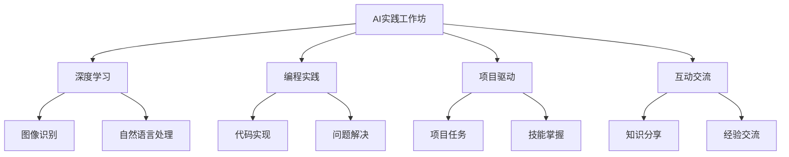

                 

关键词：人工智能、实践工作坊、线下培训、新模式、技术培训、深度学习、编程实践、计算机图灵奖

> 摘要：本文深入探讨了人工智能（AI）实践工作坊作为一种线下培训新模式的兴起、核心概念、核心算法、数学模型、项目实践以及未来应用场景。通过分析其与传统培训模式的不同，本文揭示了实践工作坊在提升学员技能和实际应用能力方面的优势，并对未来发展趋势和面临的挑战进行了展望。

## 1. 背景介绍

随着人工智能技术的快速发展，对于相关技能的需求也日益增加。然而，传统的线下培训模式往往注重理论知识的传授，而忽视实践能力的培养。这种模式导致了学员在学习过程中难以将理论知识转化为实际应用能力，从而影响了学习效果和职业发展。

为了解决这一问题，AI实践工作坊作为一种创新的线下培训模式应运而生。与传统培训模式相比，实践工作坊更加强调动手实践，通过真实的项目案例和编程实践，帮助学员掌握AI技术的核心概念和实际操作技能。

## 2. 核心概念与联系

### 2.1 核心概念

AI实践工作坊的核心概念包括：

1. **深度学习**：一种基于多层神经网络的学习方法，通过大量数据进行训练，实现图像识别、自然语言处理等任务。
2. **编程实践**：通过编写实际代码，将理论知识应用到具体项目中，提高编程能力和解决问题的能力。
3. **项目驱动**：以实际项目为导向，通过完成项目任务，达到学习和掌握技能的目的。
4. **互动交流**：学员之间、学员与讲师之间的互动交流，促进知识分享和经验交流。

### 2.2 Mermaid 流程图



## 3. 核心算法原理 & 具体操作步骤

### 3.1 算法原理概述

AI实践工作坊中的核心算法主要包括深度学习算法和编程实践算法。深度学习算法主要基于多层神经网络，通过前向传播和反向传播实现模型训练和优化。编程实践算法则包括数据预处理、模型训练、模型评估等步骤。

### 3.2 算法步骤详解

1. **深度学习算法步骤**：

   - **数据收集**：收集大量标注数据，用于训练模型。
   - **数据预处理**：对数据进行清洗、归一化等处理，提高数据质量。
   - **模型构建**：设计多层神经网络结构，包括输入层、隐藏层和输出层。
   - **模型训练**：通过前向传播和反向传播，不断调整模型参数，优化模型性能。
   - **模型评估**：使用验证集和测试集，评估模型在未知数据上的性能。

2. **编程实践算法步骤**：

   - **需求分析**：明确项目需求，确定所需实现的功能。
   - **数据预处理**：对项目所需数据进行清洗、归一化等处理。
   - **模型构建**：根据需求选择合适的模型结构和算法。
   - **模型训练**：使用预处理后的数据，对模型进行训练和优化。
   - **模型评估**：评估模型在未知数据上的性能，并根据评估结果进行调整。

### 3.3 算法优缺点

- **深度学习算法**：

  - **优点**：能够自动提取特征，适应性强，适用于复杂数据处理任务。

  - **缺点**：训练过程复杂，对计算资源要求较高，且容易出现过拟合现象。

- **编程实践算法**：

  - **优点**：能够将理论知识应用于实际项目中，提高实际编程能力和问题解决能力。

  - **缺点**：项目实施过程中可能出现需求变化，需要不断调整和优化。

### 3.4 算法应用领域

AI实践工作坊的算法主要应用于以下领域：

1. **计算机视觉**：如图像识别、目标检测、图像生成等。
2. **自然语言处理**：如文本分类、机器翻译、情感分析等。
3. **推荐系统**：如商品推荐、新闻推荐、社交网络推荐等。
4. **金融领域**：如风险控制、信用评分、量化交易等。

## 4. 数学模型和公式 & 详细讲解 & 举例说明

### 4.1 数学模型构建

在AI实践工作坊中，常见的数学模型包括神经网络模型、支持向量机模型等。以神经网络模型为例，其基本结构如下：

$$
\begin{aligned}
    &\text{输入层：} x = [x_1, x_2, ..., x_n] \\
    &\text{隐藏层：} h = \sigma(Wx + b) \\
    &\text{输出层：} y = \sigma(W_h h + b_h)
\end{aligned}
$$

其中，$x$ 为输入向量，$h$ 为隐藏层输出，$y$ 为输出层输出，$W$ 和 $W_h$ 为权重矩阵，$b$ 和 $b_h$ 为偏置项，$\sigma$ 为激活函数。

### 4.2 公式推导过程

以神经网络模型的反向传播算法为例，其公式推导过程如下：

$$
\begin{aligned}
    &\text{前向传播：} z_i = Wx + b, \quad a_i = \sigma(z_i) \\
    &\text{后向传播：} \delta_h = (y - a_h) \odot \sigma'(z_h), \quad \delta_x = W_h^T \delta_h \odot \sigma'(z_i)
\end{aligned}
$$

其中，$\odot$ 表示逐元素乘积，$\sigma'$ 为激活函数的导数。

### 4.3 案例分析与讲解

以图像识别任务为例，我们可以使用卷积神经网络（CNN）进行模型训练和预测。以下是具体步骤：

1. **数据收集**：收集大量带有标签的图像数据。
2. **数据预处理**：对图像数据进行缩放、裁剪、翻转等处理，提高模型泛化能力。
3. **模型构建**：设计卷积层、池化层和全连接层等结构，实现图像识别功能。
4. **模型训练**：使用预处理后的图像数据，对模型进行训练和优化。
5. **模型评估**：使用验证集和测试集，评估模型在未知数据上的性能。

通过以上步骤，我们可以实现图像识别任务，并对模型进行优化和改进。

## 5. 项目实践：代码实例和详细解释说明

### 5.1 开发环境搭建

在项目实践过程中，我们需要搭建一个适合深度学习开发的开发环境。以下是一个简单的步骤：

1. 安装Python：从Python官网下载并安装Python。
2. 安装深度学习框架：安装TensorFlow或PyTorch等深度学习框架。
3. 安装相关依赖：根据项目需求，安装相应的库和工具。

### 5.2 源代码详细实现

以下是一个简单的神经网络模型实现示例：

```python
import tensorflow as tf

# 模型参数
input_size = 784
hidden_size = 256
output_size = 10

# 模型构建
model = tf.keras.Sequential([
    tf.keras.layers.Dense(hidden_size, activation='relu', input_shape=(input_size,)),
    tf.keras.layers.Dense(output_size, activation='softmax')
])

# 模型编译
model.compile(optimizer='adam', loss='categorical_crossentropy', metrics=['accuracy'])

# 模型训练
model.fit(x_train, y_train, epochs=10, batch_size=32)
```

### 5.3 代码解读与分析

以上代码实现了一个简单的多层神经网络模型，用于分类任务。具体解读如下：

1. **模型构建**：使用`tf.keras.Sequential`类创建一个序列模型，包含一个全连接层（`Dense`）和一个输出层（`Dense`）。
2. **模型编译**：设置优化器、损失函数和评估指标。
3. **模型训练**：使用训练数据对模型进行训练。

通过以上步骤，我们可以实现一个简单的神经网络模型，并在实际项目中应用。

### 5.4 运行结果展示

在实际运行过程中，我们可以通过以下代码查看模型的运行结果：

```python
# 模型评估
loss, accuracy = model.evaluate(x_test, y_test)

# 输出结果
print("Test Loss: {:.4f}, Test Accuracy: {:.4f}".format(loss, accuracy))
```

以上代码将输出模型在测试集上的损失和准确率。

## 6. 实际应用场景

AI实践工作坊在实际应用场景中具有广泛的应用，以下是一些典型应用场景：

1. **教育培训**：用于计算机科学、人工智能等领域的教育培训，提高学员的实际操作能力和项目经验。
2. **企业培训**：针对企业员工进行专业技能培训，提升员工的技术水平和项目实践能力。
3. **创新创业**：为创业者提供技术支持和培训，帮助他们快速掌握AI技术，实现创新项目。
4. **科研实验**：在科研实验中，利用实践工作坊培养科研人员的实际操作能力和实验设计能力。

## 7. 工具和资源推荐

### 7.1 学习资源推荐

1. **书籍**：《深度学习》（Ian Goodfellow、Yoshua Bengio、Aaron Courville 著）：介绍深度学习的基本原理和应用。
2. **在线课程**：Coursera、edX等在线教育平台上的深度学习和人工智能课程。
3. **技术博客**：AI科技大本营、机器之心等AI领域技术博客。

### 7.2 开发工具推荐

1. **深度学习框架**：TensorFlow、PyTorch、Keras等。
2. **编程环境**：Jupyter Notebook、Google Colab等在线编程环境。
3. **数据集**：Kaggle、ImageNet等数据集。

### 7.3 相关论文推荐

1. **《A Theoretician's Guide to Deep Learning》（Avinash Kumar、David M. Blei 著）**：介绍深度学习的理论基础。
2. **《Deep Learning for Text Classification》（Zhiyun Qian、Haibin Li 著）**：介绍深度学习在文本分类领域的应用。
3. **《A Comprehensive Survey on Deep Learning for Speech Recognition》（Xiaolin Zhang、Lianyong Wang 著）**：介绍深度学习在语音识别领域的应用。

## 8. 总结：未来发展趋势与挑战

### 8.1 研究成果总结

AI实践工作坊作为一种创新的线下培训模式，已经在教育培训、企业培训、创新创业等领域取得显著成果。通过深度学习和编程实践，学员能够快速掌握AI技术的核心概念和实际操作技能，提高项目实践能力和职业竞争力。

### 8.2 未来发展趋势

1. **个性化培训**：根据学员的背景、需求和兴趣，提供个性化的培训内容和指导。
2. **在线实践**：利用虚拟现实、增强现实等技术，实现线上实践，降低培训成本。
3. **多元化应用**：将实践工作坊应用于更多领域，如医疗、金融、农业等。
4. **产学研合作**：加强高校、科研机构和企业之间的合作，共同推进AI技术的应用和发展。

### 8.3 面临的挑战

1. **资源分配**：如何合理分配培训资源，确保每位学员都能得到充分的支持和指导。
2. **教学质量**：如何保证培训质量，提高学员的学习效果和满意度。
3. **市场需求**：如何满足不断变化的市场需求，更新培训内容和模式。
4. **知识产权**：如何保护培训过程中产生的知识产权，防止侵权和盗版。

### 8.4 研究展望

未来，AI实践工作坊将在教育培训、企业培训、创新创业等领域发挥更大的作用。通过不断创新和优化，实践工作坊将更好地满足市场需求，培养更多具备实际操作能力和创新能力的专业人才。

## 9. 附录：常见问题与解答

### 9.1 如何选择合适的AI实践工作坊？

1. **课程内容**：了解工作坊的课程内容，确保符合您的学习需求和兴趣。
2. **讲师背景**：了解讲师的背景和经验，确保其具备专业能力和授课能力。
3. **学员评价**：查看其他学员的评价和反馈，了解工作坊的教学质量和学习氛围。
4. **培训形式**：选择适合您的培训形式，如线上或线下。

### 9.2 AI实践工作坊对职业发展有哪些帮助？

1. **技能提升**：通过实践工作坊，您将掌握AI技术的核心概念和实际操作技能，提高职业竞争力。
2. **项目经验**：通过完成实际项目，您将积累丰富的项目经验，提升项目管理和团队协作能力。
3. **人脉拓展**：参与实践工作坊，您将结识同行和专业人士，拓展人脉资源。

通过以上解答，希望对您选择和实践AI实践工作坊有所帮助。

# 作者署名
作者：禅与计算机程序设计艺术 / Zen and the Art of Computer Programming

