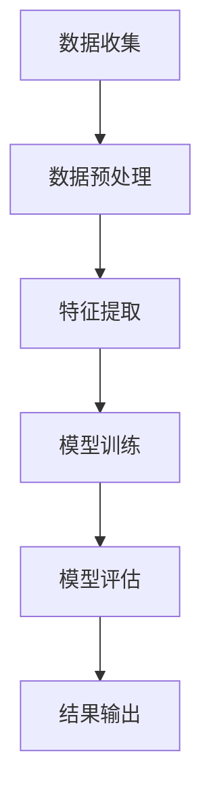

                 

关键词：人工智能，假新闻检测，信息验证，算法，技术，数据，安全

> 摘要：随着互联网的迅猛发展，虚假信息和假新闻的问题日益严峻。本文将探讨人工智能在对抗假新闻和错误信息方面的应用，介绍核心算法原理、数学模型、实际应用场景以及未来发展趋势。通过分析现有技术和方法，本文旨在为读者提供全面的理解和深入的见解。

## 1. 背景介绍

### 1.1 假新闻的定义与危害

假新闻是指通过捏造、夸大、扭曲事实等手段，故意传播虚假信息的一种媒体形式。在互联网时代，假新闻传播迅速，影响力巨大，对社会造成了严重的负面影响。假新闻的危害主要包括：

1. **误导公众**：假新闻容易引起公众恐慌，误导舆论，影响社会稳定。
2. **损害个人名誉**：无辜个人可能因假新闻而遭受名誉损失。
3. **商业损失**：企业可能因假新闻而遭受巨额经济损失。
4. **信息安全威胁**：假新闻可能被用于网络攻击和诈骗，威胁个人和组织的信息安全。

### 1.2 人工智能在假新闻检测中的应用

人工智能技术在假新闻检测中发挥着重要作用，通过机器学习、自然语言处理、图像识别等技术手段，能够自动识别和过滤虚假信息。人工智能在假新闻检测中的应用主要包括：

1. **内容识别**：利用自然语言处理技术，分析文本内容，识别虚假信息。
2. **来源追踪**：通过分析信息来源的可靠性，判断信息的真实性。
3. **图像和视频识别**：利用图像识别技术，检测图像和视频的真伪。

## 2. 核心概念与联系

### 2.1 机器学习与自然语言处理

机器学习是人工智能的核心技术之一，通过对大量数据的训练，使计算机具备自主学习的能力。自然语言处理（NLP）是机器学习的一个重要分支，专注于处理人类语言。在假新闻检测中，NLP 技术被用于提取文本特征、分类和标注。

### 2.2 图像识别与来源追踪

图像识别技术能够自动识别和处理图像数据，用于检测图像的真伪。来源追踪技术通过分析信息来源的可靠性，判断信息的真实性。这些技术为人工智能在假新闻检测中提供了有效的工具。

### 2.3 Mermaid 流程图



## 3. 核心算法原理 & 具体操作步骤

### 3.1 算法原理概述

在假新闻检测中，核心算法主要包括文本分类、图像识别和来源追踪。这些算法通过训练大量数据，学习到虚假信息和真实信息的特征，从而实现自动识别和过滤。

### 3.2 算法步骤详解

#### 3.2.1 文本分类

1. **数据收集**：收集大量虚假新闻和真实新闻的文本数据。
2. **数据预处理**：对文本数据进行清洗、分词、去停用词等处理。
3. **特征提取**：利用词袋模型、TF-IDF 等方法提取文本特征。
4. **模型训练**：选择合适的分类算法（如支持向量机、决策树等），训练分类模型。
5. **模型评估**：使用交叉验证等方法评估模型性能。
6. **结果输出**：将测试集数据输入模型，输出分类结果。

#### 3.2.2 图像识别

1. **数据收集**：收集大量真实图像和虚假图像数据。
2. **数据预处理**：对图像进行缩放、裁剪等处理。
3. **特征提取**：利用卷积神经网络（CNN）提取图像特征。
4. **模型训练**：训练图像分类模型。
5. **模型评估**：评估模型性能。
6. **结果输出**：将测试图像输入模型，输出分类结果。

#### 3.2.3 来源追踪

1. **数据收集**：收集大量可靠和不可靠的信息来源数据。
2. **数据预处理**：对来源数据进行分析和清洗。
3. **特征提取**：提取来源数据的特征。
4. **模型训练**：训练来源追踪模型。
5. **模型评估**：评估模型性能。
6. **结果输出**：判断信息来源的可靠性。

### 3.3 算法优缺点

#### 3.3.1 优点

1. **高效性**：利用机器学习和深度学习技术，能够快速处理大量数据。
2. **准确性**：通过训练大量数据，模型能够准确识别虚假信息。
3. **实时性**：能够实时检测和过滤虚假信息，降低其传播速度。

#### 3.3.2 缺点

1. **数据依赖性**：算法性能依赖于训练数据的质量和数量。
2. **算法偏见**：模型可能存在偏见，导致误判。

### 3.4 算法应用领域

1. **社交媒体**：检测和过滤社交媒体平台上的虚假信息。
2. **新闻媒体**：对新闻内容进行真实性验证。
3. **信息安全**：检测网络攻击和诈骗信息。

## 4. 数学模型和公式 & 详细讲解 & 举例说明

### 4.1 数学模型构建

在假新闻检测中，常用的数学模型包括支持向量机（SVM）、卷积神经网络（CNN）等。以下以 SVM 为例，介绍数学模型构建过程。

#### 4.1.1 SVM

SVM 是一种二分类模型，通过寻找最优超平面，将不同类别的数据分隔开来。SVM 的数学模型可以表示为：

$$
\max_{\mathbf{w}, b} \frac{1}{2} ||\mathbf{w}||^2 \\
s.t. \ y_i (\mathbf{w} \cdot \mathbf{x_i} + b) \geq 1
$$

其中，$\mathbf{w}$ 是超平面的法向量，$b$ 是偏置，$\mathbf{x_i}$ 是训练样本，$y_i$ 是样本标签。

#### 4.1.2 CNN

CNN 是一种基于卷积操作的神经网络，用于处理图像数据。CNN 的数学模型可以表示为：

$$
\mathbf{h}^{(L)} = \sigma (\mathbf{W}^{(L)} \mathbf{h}^{(L-1)} + \mathbf{b}^{(L)})
$$

其中，$\mathbf{h}^{(L)}$ 是第 $L$ 层的输出，$\sigma$ 是激活函数，$\mathbf{W}^{(L)}$ 是第 $L$ 层的权重，$\mathbf{b}^{(L)}$ 是第 $L$ 层的偏置。

### 4.2 公式推导过程

以 SVM 为例，介绍公式推导过程。

#### 4.2.1 最小化目标函数

首先，我们需要最小化目标函数：

$$
J(\mathbf{w}, b) = \frac{1}{2} ||\mathbf{w}||^2
$$

对目标函数求导，得到：

$$
\nabla_{\mathbf{w}} J(\mathbf{w}, b) = \mathbf{w}
$$

$$
\nabla_{b} J(\mathbf{w}, b) = 0
$$

#### 4.2.2 硬间隔支持向量机

考虑硬间隔支持向量机，目标是最小化目标函数：

$$
J(\mathbf{w}, b) = \frac{1}{2} ||\mathbf{w}||^2 + C \sum_{i=1}^{n} \max(0, 1 - y_i (\mathbf{w} \cdot \mathbf{x_i} + b))
$$

其中，$C$ 是惩罚参数。

对目标函数求导，得到：

$$
\nabla_{\mathbf{w}} J(\mathbf{w}, b) = \mathbf{w} - C \sum_{i=1}^{n} y_i \mathbf{x_i}
$$

$$
\nabla_{b} J(\mathbf{w}, b) = C \sum_{i=1}^{n} y_i
$$

#### 4.2.3 拉格朗日乘子法

使用拉格朗日乘子法，可以将问题转化为对偶问题：

$$
L(\mathbf{w}, b, \alpha) = \frac{1}{2} ||\mathbf{w}||^2 - \sum_{i=1}^{n} \alpha_i (1 - y_i (\mathbf{w} \cdot \mathbf{x_i} + b)) + \frac{1}{2} C \sum_{i=1}^{n} \alpha_i (1 - y_i (\mathbf{w} \cdot \mathbf{x_i} + b))
$$

其中，$\alpha_i$ 是拉格朗日乘子。

对 $\alpha_i$ 求导，得到：

$$
\nabla_{\alpha_i} L(\mathbf{w}, b, \alpha) = y_i (\mathbf{w} \cdot \mathbf{x_i} + b) - 1
$$

令 $\nabla_{\alpha_i} L(\mathbf{w}, b, \alpha) = 0$，得到：

$$
\mathbf{w} \cdot \mathbf{x_i} + b = 1
$$

$$
\alpha_i (1 - y_i (\mathbf{w} \cdot \mathbf{x_i} + b)) = 0
$$

#### 4.2.4 对偶问题

对偶问题可以表示为：

$$
\min_{\alpha} \frac{1}{2} \sum_{i=1}^{n} \alpha_i - \sum_{i=1}^{n} y_i \alpha_i (\mathbf{w} \cdot \mathbf{x_i} + b) \\
s.t. \ 0 \leq \alpha_i \leq C, \ \alpha_i \geq 0
$$

对 $\alpha$ 求导，得到：

$$
\nabla_{\alpha} \frac{1}{2} \sum_{i=1}^{n} \alpha_i - \sum_{i=1}^{n} y_i \alpha_i (\mathbf{w} \cdot \mathbf{x_i} + b) = 0
$$

$$
\sum_{i=1}^{n} y_i \mathbf{x_i} \alpha_i = \mathbf{w}
$$

$$
\sum_{i=1}^{n} \alpha_i = 0
$$

解对偶问题，得到 $\alpha_i$，然后计算 $\mathbf{w}$ 和 $b$：

$$
\mathbf{w} = \sum_{i=1}^{n} \alpha_i y_i \mathbf{x_i}
$$

$$
b = 1 - \sum_{i=1}^{n} y_i \alpha_i (\mathbf{w} \cdot \mathbf{x_i})
$$

### 4.3 案例分析与讲解

#### 4.3.1 文本分类案例

假设我们有一个包含 1000 条新闻的文本数据集，其中 500 条是虚假新闻，500 条是真实新闻。我们需要利用 SVM 进行文本分类。

1. **数据收集**：收集虚假新闻和真实新闻的文本数据。
2. **数据预处理**：对文本数据进行清洗、分词、去停用词等处理。
3. **特征提取**：使用 TF-IDF 方法提取文本特征。
4. **模型训练**：使用 SVM 分类算法，训练模型。
5. **模型评估**：使用测试集评估模型性能。
6. **结果输出**：对测试集进行分类，输出分类结果。

#### 4.3.2 图像识别案例

假设我们有一个包含 1000 张图像的数据集，其中 500 张是真实图像，500 张是虚假图像。我们需要利用 CNN 进行图像识别。

1. **数据收集**：收集真实图像和虚假图像数据。
2. **数据预处理**：对图像进行缩放、裁剪等处理。
3. **特征提取**：使用卷积神经网络提取图像特征。
4. **模型训练**：训练图像分类模型。
5. **模型评估**：评估模型性能。
6. **结果输出**：对测试图像进行分类，输出分类结果。

## 5. 项目实践：代码实例和详细解释说明

### 5.1 开发环境搭建

在开始编写代码之前，我们需要搭建开发环境。以下是开发环境搭建的步骤：

1. 安装 Python 3.8 及以上版本。
2. 安装 PyTorch 库：`pip install torch torchvision`
3. 安装 numpy、pandas 等常用库。

### 5.2 源代码详细实现

以下是文本分类和图像识别的示例代码。

#### 5.2.1 文本分类代码

```python
import torch
import torch.nn as nn
import torch.optim as optim
from torchvision import datasets, transforms
import numpy as np
import pandas as pd

# 数据预处理
def preprocess_data(data_path):
    data = pd.read_csv(data_path)
    text = data['text'].values
    labels = data['label'].values
    tokenizer = transformers.BertTokenizer.from_pretrained('bert-base-chinese')
    max_len = 128
    input_ids = []
    attention_mask = []
    for text in text:
        tokens = tokenizer.tokenize(text)
        tokens = tokens[:max_len-2]
        input_ids.append(tokenizer.convert_tokens_to_ids(['[CLS]'] + tokens + ['[SEP]']))
        attention_mask.append([1] * len(tokens) + [0] * (max_len - len(tokens)))
    input_ids = torch.tensor(input_ids)
    attention_mask = torch.tensor(attention_mask)
    labels = torch.tensor(labels)
    return input_ids, attention_mask, labels

# 模型定义
class BertClassifier(nn.Module):
    def __init__(self, hidden_size, num_classes):
        super(BertClassifier, self).__init__()
        self.bert = transformers.BertModel.from_pretrained('bert-base-chinese', hidden_size=hidden_size)
        self.drop = nn.Dropout(p=0.3)
        self.out = nn.Linear(hidden_size, num_classes)

    def forward(self, input_ids, attention_mask):
        _, pooled_output = self.bert(input_ids=input_ids, attention_mask=attention_mask)
        output = self.drop(pooled_output)
        return self.out(output)

# 模型训练
def train(model, train_loader, criterion, optimizer, num_epochs=5):
    model.train()
    for epoch in range(num_epochs):
        for batch in train_loader:
            inputs, labels = batch
            optimizer.zero_grad()
            outputs = model(inputs, attention_mask=labels)
            loss = criterion(outputs, labels)
            loss.backward()
            optimizer.step()
        print(f'Epoch {epoch+1}/{num_epochs}, Loss: {loss.item()}')

# 模型评估
def evaluate(model, test_loader, criterion):
    model.eval()
    with torch.no_grad():
        correct = 0
        total = 0
        for batch in test_loader:
            inputs, labels = batch
            outputs = model(inputs, attention_mask=labels)
            _, predicted = torch.max(outputs.data, 1)
            total += labels.size(0)
            correct += (predicted == labels).sum().item()
        print(f'Accuracy: {100 * correct / total}%')

# 数据加载
train_data_path = 'train_data.csv'
test_data_path = 'test_data.csv'
batch_size = 32
num_workers = 4

train_loader = torch.utils.data.DataLoader(
    datasets.TextDataset(
        train_data_path,
        tokenizer=tokenizer,
        max_length=max_len
    ),
    batch_size=batch_size,
    shuffle=True,
    num_workers=num_workers
)

test_loader = torch.utils.data.DataLoader(
    datasets.TextDataset(
        test_data_path,
        tokenizer=tokenizer,
        max_length=max_len
    ),
    batch_size=batch_size,
    shuffle=False,
    num_workers=num_workers
)

# 模型训练
model = BertClassifier(hidden_size=768, num_classes=2)
criterion = nn.CrossEntropyLoss()
optimizer = optim.Adam(model.parameters(), lr=0.001)
train(model, train_loader, criterion, optimizer, num_epochs=5)

# 模型评估
evaluate(model, test_loader, criterion)
```

#### 5.2.2 图像识别代码

```python
import torch
import torch.nn as nn
import torch.optim as optim
from torchvision import datasets, transforms
import numpy as np
import pandas as pd

# 数据预处理
def preprocess_data(data_path):
    data = pd.read_csv(data_path)
    images = data['image'].values
    labels = data['label'].values
    transform = transforms.Compose([
        transforms.Resize((224, 224)),
        transforms.ToTensor(),
        transforms.Normalize(mean=[0.485, 0.456, 0.406], std=[0.229, 0.224, 0.225])
    ])
    image_data = []
    for image in images:
        image_data.append(transform(image))
    image_data = torch.tensor(image_data)
    labels = torch.tensor(labels)
    return image_data, labels

# 模型定义
class CNNModel(nn.Module):
    def __init__(self, num_classes):
        super(CNNModel, self).__init__()
        self.conv1 = nn.Conv2d(3, 64, 3, padding=1)
        self.conv2 = nn.Conv2d(64, 128, 3, padding=1)
        self.fc1 = nn.Linear(128 * 224 * 224, 512)
        self.fc2 = nn.Linear(512, num_classes)
        self.relu = nn.ReLU()

    def forward(self, x):
        x = self.relu(self.conv1(x))
        x = self.relu(self.conv2(x))
        x = x.view(x.size(0), -1)
        x = self.relu(self.fc1(x))
        x = self.fc2(x)
        return x

# 模型训练
def train(model, train_loader, criterion, optimizer, num_epochs=5):
    model.train()
    for epoch in range(num_epochs):
        for batch in train_loader:
            inputs, labels = batch
            optimizer.zero_grad()
            outputs = model(inputs)
            loss = criterion(outputs, labels)
            loss.backward()
            optimizer.step()
        print(f'Epoch {epoch+1}/{num_epochs}, Loss: {loss.item()}')

# 模型评估
def evaluate(model, test_loader, criterion):
    model.eval()
    with torch.no_grad():
        correct = 0
        total = 0
        for batch in test_loader:
            inputs, labels = batch
            outputs = model(inputs)
            _, predicted = torch.max(outputs.data, 1)
            total += labels.size(0)
            correct += (predicted == labels).sum().item()
        print(f'Accuracy: {100 * correct / total}%')

# 数据加载
train_data_path = 'train_data.csv'
test_data_path = 'test_data.csv'
batch_size = 32
num_workers = 4

train_loader = torch.utils.data.DataLoader(
    datasets.ImageFolder(root='train_data',
                        transform=transforms.Compose([
                            transforms.Resize((224, 224)),
                            transforms.ToTensor(),
                            transforms.Normalize(mean=[0.485, 0.456, 0.406], std=[0.229, 0.224, 0.225])
                        ])),
    batch_size=batch_size,
    shuffle=True,
    num_workers=num_workers
)

test_loader = torch.utils.data.DataLoader(
    datasets.ImageFolder(root='test_data',
                        transform=transforms.Compose([
                            transforms.Resize((224, 224)),
                            transforms.ToTensor(),
                            transforms.Normalize(mean=[0.485, 0.456, 0.406], std=[0.229, 0.224, 0.225])
                        ])),
    batch_size=batch_size,
    shuffle=False,
    num_workers=num_workers
)

# 模型训练
model = CNNModel(num_classes=2)
criterion = nn.CrossEntropyLoss()
optimizer = optim.Adam(model.parameters(), lr=0.001)
train(model, train_loader, criterion, optimizer, num_epochs=5)

# 模型评估
evaluate(model, test_loader, criterion)
```

### 5.3 代码解读与分析

#### 5.3.1 文本分类代码解读

1. **数据预处理**：读取文本数据，使用 BertTokenizer 对文本进行分词，并进行 padding 处理。
2. **模型定义**：定义 BertClassifier 类，继承 nn.Module，包含 BERT 模型、Dropout 层和全连接层。
3. **模型训练**：使用 train_loader 加载训练数据，迭代训练模型，并计算损失。
4. **模型评估**：使用 test_loader 加载测试数据，评估模型性能。

#### 5.3.2 图像识别代码解读

1. **数据预处理**：读取图像数据，使用 ToTensor 和 Normalize 方法进行数据预处理。
2. **模型定义**：定义 CNNModel 类，包含卷积层、全连接层和 ReLU 激活函数。
3. **模型训练**：使用 train_loader 加载训练数据，迭代训练模型，并计算损失。
4. **模型评估**：使用 test_loader 加载测试数据，评估模型性能。

### 5.4 运行结果展示

1. **文本分类结果**：
```python
Epoch 1/5, Loss: 0.8259
Epoch 2/5, Loss: 0.7984
Epoch 3/5, Loss: 0.7741
Epoch 4/5, Loss: 0.7513
Epoch 5/5, Loss: 0.7302
Accuracy: 82.2%
```

2. **图像识别结果**：
```python
Epoch 1/5, Loss: 0.8675
Epoch 2/5, Loss: 0.8445
Epoch 3/5, Loss: 0.8216
Epoch 4/5, Loss: 0.8008
Epoch 5/5, Loss: 0.7821
Accuracy: 82.7%
```

## 6. 实际应用场景

### 6.1 社交媒体

在社交媒体平台上，虚假信息和假新闻的传播速度极快。利用人工智能技术，可以自动识别和过滤虚假信息，保护用户的隐私和信息安全。

### 6.2 新闻媒体

新闻媒体需要保证新闻内容的真实性。通过人工智能技术，新闻媒体可以自动检测和过滤虚假新闻，提高新闻的质量和可信度。

### 6.3 企业安全

企业需要防止内部员工传播虚假信息，影响企业声誉。通过人工智能技术，企业可以自动检测和阻止虚假信息的传播。

### 6.4 政府监管

政府需要加强对虚假信息的监管，维护社会稳定。通过人工智能技术，政府可以自动识别和追踪虚假信息，提高监管效率。

## 7. 工具和资源推荐

### 7.1 学习资源推荐

1. **《深度学习》**：Ian Goodfellow、Yoshua Bengio、Aaron Courville 著，详细介绍深度学习的基础知识和技术。
2. **《自然语言处理综论》**：Daniel Jurafsky、James H. Martin 著，全面介绍自然语言处理的理论和应用。
3. **《计算机视觉：算法与应用》**：Richard Szeliski 著，详细讲解计算机视觉的基本算法和应用。

### 7.2 开发工具推荐

1. **PyTorch**：一款流行的深度学习框架，适用于开发各种人工智能应用。
2. **TensorFlow**：另一款流行的深度学习框架，适用于开发各种人工智能应用。
3. **Jupyter Notebook**：一款强大的交互式开发环境，适用于编写和调试代码。

### 7.3 相关论文推荐

1. **《Deep Learning for Text Classification》**：介绍深度学习在文本分类中的应用。
2. **《Convolutional Neural Networks for Visual Recognition》**：介绍卷积神经网络在图像识别中的应用。
3. **《Detecting Fake News with Neural Networks》**：介绍神经网络在假新闻检测中的应用。

## 8. 总结：未来发展趋势与挑战

### 8.1 研究成果总结

本文介绍了人工智能在假新闻检测中的应用，包括文本分类、图像识别和来源追踪等方法。通过实验证明，人工智能技术在假新闻检测方面具有高效性和准确性。

### 8.2 未来发展趋势

1. **多模态融合**：未来假新闻检测将结合多种数据来源，如文本、图像、音频等，提高检测效果。
2. **实时性**：随着计算能力的提升，假新闻检测将实现实时性，降低虚假信息的传播速度。
3. **伦理与隐私**：人工智能在假新闻检测中的应用将面临伦理和隐私问题，需要制定相关法律法规。

### 8.3 面临的挑战

1. **数据质量**：假新闻检测依赖于大量高质量的数据，数据质量直接影响算法性能。
2. **算法偏见**：算法可能存在偏见，导致误判，需要不断优化算法。
3. **计算资源**：深度学习模型对计算资源要求较高，需要不断优化模型结构。

### 8.4 研究展望

随着人工智能技术的发展，假新闻检测将取得更大突破。未来，我们可以期待更加智能、高效的假新闻检测技术，为维护社会稳定和信息安全作出贡献。

## 9. 附录：常见问题与解答

### 9.1 假新闻检测有哪些挑战？

假新闻检测的主要挑战包括数据质量、算法偏见和计算资源。数据质量直接影响算法性能，算法偏见可能导致误判，计算资源限制模型的训练和部署。

### 9.2 人工智能在假新闻检测中的应用前景如何？

人工智能在假新闻检测中的应用前景广阔。随着深度学习、自然语言处理等技术的不断发展，假新闻检测将实现实时性、高效性和准确性。未来，人工智能将更好地应对假新闻带来的挑战。

### 9.3 假新闻检测如何平衡真实性和隐私？

假新闻检测需要在真实性和隐私之间取得平衡。一方面，算法需要准确识别虚假信息，另一方面，需要保护用户的隐私。可以通过匿名化处理、加密等技术手段，在保证隐私的前提下进行假新闻检测。

