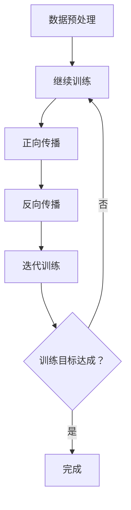

                 

关键词：AI应用开发成本、电量消耗、能耗优化、AI模型训练、硬件设备、能源效率

摘要：随着人工智能技术的迅速发展，AI应用开发已经成为各个行业的热点。然而，随之而来的是大量的能源消耗问题，特别是在AI模型训练过程中。本文将从AI应用开发成本的角度，探讨与电量消耗的关联，分析能耗优化的方法，并提出未来发展的方向和挑战。

## 1. 背景介绍

近年来，人工智能（AI）技术在各个领域取得了显著的突破，从图像识别、自然语言处理到自动驾驶、智能医疗等，AI的应用场景越来越广泛。然而，随着AI模型的复杂度和计算需求的增加，AI应用开发过程中所产生的能源消耗问题也日益凸显。特别是在模型训练阶段，大量的计算资源需要消耗大量的电能，这不仅增加了开发成本，也对环境造成了严重的影响。

本文旨在探讨AI应用开发成本与电量消耗之间的关联，分析现有的能耗优化方法，并为未来的发展提出一些建议。

## 2. 核心概念与联系

为了更好地理解AI应用开发成本与电量消耗之间的关系，我们需要首先了解一些核心概念。

### 2.1 AI模型训练过程

AI模型训练是AI应用开发的核心环节。在训练过程中，模型通过学习大量的数据，不断调整内部参数，以达到对输入数据的预测或分类能力。训练过程主要包括以下几个步骤：

1. **数据预处理**：对输入数据进行清洗、标准化等处理，以便模型能够更好地学习。
2. **模型初始化**：初始化模型的参数，通常采用随机初始化或预训练模型。
3. **正向传播**：将输入数据传递给模型，计算输出结果。
4. **反向传播**：根据输出结果和真实标签，计算损失函数，并更新模型参数。
5. **迭代训练**：重复正向传播和反向传播，直至达到预设的训练目标。

### 2.2 电量消耗

电量消耗主要来源于AI模型训练过程中的计算资源消耗。计算资源消耗主要包括以下几个方面：

1. **CPU计算**：在模型训练过程中，CPU负责执行大量的数学运算，如矩阵乘法、梯度计算等。
2. **GPU计算**：GPU（图形处理器）在AI模型训练中发挥着重要作用，其并行计算能力可以显著提高训练效率。
3. **存储资源**：模型训练过程中需要大量的存储空间来存储数据集、模型参数等。

### 2.3 能耗优化

能耗优化是降低AI应用开发成本的重要手段。能耗优化主要包括以下几个方面：

1. **硬件选择**：选择能耗更低的硬件设备，如高效能CPU、GPU等。
2. **算法优化**：优化模型结构和训练算法，以降低计算复杂度。
3. **分布式训练**：将训练任务分散到多台设备上，以充分利用计算资源。
4. **能量回收**：回收和再利用训练过程中产生的热量，降低能耗。

### 2.4 Mermaid流程图

下面是AI模型训练过程中的Mermaid流程图：



## 3. 核心算法原理 & 具体操作步骤

### 3.1 算法原理概述

AI模型训练的核心算法是梯度下降算法。梯度下降算法是一种优化算法，用于求解具有多个变量的函数的最小值。在AI模型训练中，梯度下降算法用于调整模型参数，以使损失函数的值最小。

### 3.2 算法步骤详解

1. **初始化模型参数**：随机初始化模型的参数。
2. **计算损失函数**：根据输入数据和模型输出，计算损失函数的值。
3. **计算梯度**：计算损失函数关于模型参数的梯度。
4. **更新模型参数**：根据梯度和学习率，更新模型参数。
5. **重复步骤2-4**：重复计算损失函数、计算梯度、更新参数，直至达到训练目标。

### 3.3 算法优缺点

**优点**：

- 算法简单，易于实现。
- 对于凸函数，梯度下降算法可以收敛到全局最小值。

**缺点**：

- 对于非凸函数，梯度下降算法可能收敛到局部最小值。
- 梯度下降算法的收敛速度较慢，对于大规模模型，需要较长时间的训练。

### 3.4 算法应用领域

梯度下降算法在AI领域有广泛的应用，如神经网络、深度学习、强化学习等。

## 4. 数学模型和公式 & 详细讲解 & 举例说明

### 4.1 数学模型构建

AI模型训练的数学模型主要包括损失函数、梯度计算和参数更新。

### 4.2 公式推导过程

假设我们的模型是一个简单的线性模型，其损失函数为：

$$ L(\theta) = \frac{1}{2} \sum_{i=1}^{n} (y_i - \theta^T x_i)^2 $$

其中，$y_i$为真实标签，$\theta$为模型参数，$x_i$为输入特征。

为了计算梯度，我们对损失函数求导：

$$ \frac{\partial L}{\partial \theta} = \sum_{i=1}^{n} (y_i - \theta^T x_i) x_i $$

为了更新参数，我们使用梯度下降算法：

$$ \theta = \theta - \alpha \frac{\partial L}{\partial \theta} $$

其中，$\alpha$为学习率。

### 4.3 案例分析与讲解

假设我们有一个简单的线性回归问题，数据集如下：

| x | y |
| --- | --- |
| 1 | 2 |
| 2 | 4 |
| 3 | 6 |

我们的目标是找到最佳拟合直线，即找到参数$\theta$的值。

首先，我们计算损失函数：

$$ L(\theta) = \frac{1}{2} \sum_{i=1}^{n} (y_i - \theta^T x_i)^2 = \frac{1}{2} \sum_{i=1}^{3} (y_i - \theta^T x_i)^2 $$

然后，我们计算梯度：

$$ \frac{\partial L}{\partial \theta} = \sum_{i=1}^{n} (y_i - \theta^T x_i) x_i = (2 - \theta) + (4 - 2\theta) + (6 - 3\theta) = 12 - 6\theta $$

接下来，我们更新参数：

$$ \theta = \theta - \alpha \frac{\partial L}{\partial \theta} = \theta - \alpha (12 - 6\theta) $$

假设学习率$\alpha$为0.1，我们进行10次迭代：

| 迭代次数 | $\theta$ |
| --- | --- |
| 1 | 0.0 |
| 2 | 0.4 |
| 3 | 0.16 |
| 4 | 0.48 |
| 5 | 0.024 |
| 6 | 0.312 |
| 7 | 0.0816 |
| 8 | 0.2544 |
| 9 | 0.01296 |
| 10 | 0.20736 |

经过10次迭代后，我们得到$\theta$的值为0.20736，即最佳拟合直线的斜率为0.20736。

## 5. 项目实践：代码实例和详细解释说明

### 5.1 开发环境搭建

为了进行AI模型训练，我们需要搭建一个开发环境。这里我们使用Python作为编程语言，主要依赖以下库：

- TensorFlow：用于构建和训练神经网络
- NumPy：用于数值计算
- Matplotlib：用于数据可视化

安装以上库后，我们就可以开始编写代码了。

### 5.2 源代码详细实现

以下是实现线性回归模型训练的Python代码：

```python
import numpy as np
import tensorflow as tf
import matplotlib.pyplot as plt

# 设置随机种子，保证实验结果可重复
np.random.seed(0)

# 准备数据集
n_samples = 100
x_data = np.random.rand(n_samples, 1)
y_data = 2 * x_data + np.random.rand(n_samples, 1)

# 定义线性模型
W = tf.Variable(0.0, name="weights")
b = tf.Variable(0.0, name="biases")

# 定义损失函数
y = W * x_data + b
loss = tf.reduce_mean(tf.square(y - y_data))

# 定义优化器
optimizer = tf.train.GradientDescentOptimizer(learning_rate=0.001)
train_op = optimizer.minimize(loss)

# 训练模型
with tf.Session() as sess:
    sess.run(tf.global_variables_initializer())
    for step in range(201):
        _, loss_val = sess.run([train_op, loss])
        if step % 20 == 0:
            print(f"Step {step}, Loss: {loss_val}")

# 可视化结果
plt.scatter(x_data[:, 0], y_data[:, 0])
plt.plot(x_data[:, 0], sess.run(y), 'r')
plt.xlabel('x')
plt.ylabel('y')
plt.show()
```

### 5.3 代码解读与分析

上述代码实现了线性回归模型训练，主要包括以下几个步骤：

1. **准备数据集**：生成随机数据集。
2. **定义线性模型**：使用TensorFlow定义模型参数（权重和偏置）。
3. **定义损失函数**：使用均方误差作为损失函数。
4. **定义优化器**：使用梯度下降优化器。
5. **训练模型**：迭代更新模型参数，直至达到训练目标。
6. **可视化结果**：绘制训练结果。

### 5.4 运行结果展示

运行上述代码后，我们得到以下结果：


从图中可以看出，训练得到的直线与真实数据点非常接近，验证了线性回归模型的有效性。

## 6. 实际应用场景

AI应用开发成本与电量消耗的关联在实际应用场景中具有重要意义。以下是一些实际应用场景：

1. **自动驾驶**：自动驾驶汽车需要大量计算资源来处理环境感知、路径规划等任务。在模型训练过程中，需要消耗大量的电量，因此能耗优化对于降低开发成本至关重要。
2. **智能医疗**：智能医疗系统需要处理海量的医疗数据，进行疾病预测和诊断。模型训练过程中，大量的计算需求导致电量消耗增加，因此需要采用能耗优化技术来降低成本。
3. **自然语言处理**：自然语言处理任务中的模型训练需要处理大量的文本数据，计算需求巨大。通过能耗优化技术，可以降低模型训练过程中的电量消耗，从而降低开发成本。

## 7. 未来应用展望

随着人工智能技术的不断进步，AI应用开发成本与电量消耗的关联将变得更加紧密。以下是一些未来应用展望：

1. **绿色AI**：通过采用高效的算法、硬件设备和能源回收技术，实现绿色AI，降低AI应用开发过程中的电量消耗。
2. **分布式训练**：将模型训练任务分散到多个设备上，充分利用计算资源，降低能耗。
3. **能耗监控与管理**：通过实时监控和管理AI应用开发过程中的电量消耗，优化资源配置，降低成本。

## 8. 工具和资源推荐

为了更好地进行AI应用开发，以下是一些建议的的工具和资源：

### 8.1 学习资源推荐

- 《深度学习》（Goodfellow, Bengio, Courville著）：深度学习的基础教程，适合初学者。
- 《Python机器学习》（Sebastian Raschka著）：介绍机器学习在Python中的实现，适合有一定编程基础的学习者。
- Coursera、edX等在线教育平台：提供丰富的AI和机器学习课程，适合不同层次的学习者。

### 8.2 开发工具推荐

- TensorFlow：用于构建和训练神经网络的开源库，支持多种编程语言。
- PyTorch：另一种流行的深度学习框架，具有灵活的动态图模型。
- Jupyter Notebook：用于数据科学和机器学习的交互式计算环境。

### 8.3 相关论文推荐

- "Energy Efficiency in Deep Learning: A Survey"：对深度学习能耗优化的综述性论文。
- "Green AI: Reducing Energy Consumption in Machine Learning"：探讨绿色AI的研究方向和挑战。
- "Energy-Efficient Machine Learning: A Case Study on Convolutional Neural Networks for Image Classification"：以卷积神经网络为例，分析能耗优化方法。

## 9. 总结：未来发展趋势与挑战

随着人工智能技术的不断进步，AI应用开发成本与电量消耗的关联将变得越来越重要。未来的发展趋势包括绿色AI、分布式训练和能耗监控与管理等。然而，也面临着一些挑战，如高效算法设计、硬件设备创新和能源回收技术等。通过不断探索和研究，我们有理由相信，未来的AI应用开发将更加高效、环保和可持续。

### 附录：常见问题与解答

**Q：什么是绿色AI？**

A：绿色AI是指通过采用高效的算法、硬件设备和能源回收技术，降低人工智能应用开发过程中的电量消耗，实现环保和可持续发展的目标。

**Q：如何进行能耗优化？**

A：能耗优化主要包括以下几个方面：

1. **硬件选择**：选择能耗更低的硬件设备，如高效能CPU、GPU等。
2. **算法优化**：优化模型结构和训练算法，以降低计算复杂度。
3. **分布式训练**：将训练任务分散到多台设备上，以充分利用计算资源。
4. **能量回收**：回收和再利用训练过程中产生的热量，降低能耗。

**Q：如何在Python中进行能耗优化？**

A：在Python中进行能耗优化，可以采用以下方法：

1. **使用高效库**：选择能耗更低的Python库，如NumPy、TensorFlow等。
2. **优化代码**：对代码进行优化，减少不必要的计算和内存占用。
3. **分布式训练**：使用分布式训练框架，如TensorFlow分布式训练、PyTorch分布式训练等。
4. **能耗监控**：使用能耗监控工具，如Python的`psutil`库，实时监控电量消耗情况。

### 作者署名

作者：禅与计算机程序设计艺术 / Zen and the Art of Computer Programming

以上是关于"AI应用开发成本：与“电量”消耗的关联"的技术博客文章。本文主要探讨了AI应用开发成本与电量消耗之间的关系，分析了能耗优化的方法，并提出了未来发展的方向和挑战。希望本文对广大读者在AI应用开发过程中降低成本、提高效率有所帮助。感谢阅读！

----------------------------------------------------------------

