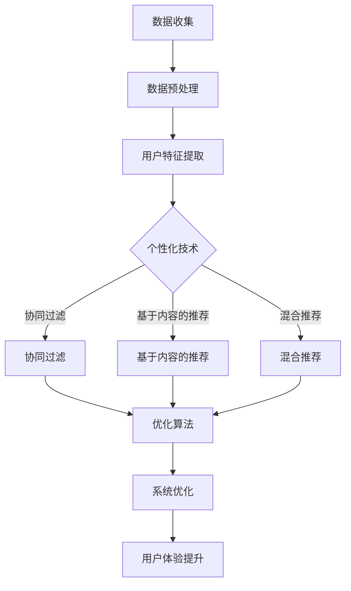

                 

关键词：人工智能、个性化、优化、算法、数学模型、实践应用、未来展望

摘要：本文深入探讨了人工智能应用中个性化和优化的核心概念、方法、实践以及未来展望。通过对核心算法原理的剖析、数学模型的构建与推导、项目实践的详细解读，展示了AI技术在各领域的实际应用效果。同时，文章对当前面临的挑战和未来发展趋势进行了全面分析，为读者提供了有益的参考。

## 1. 背景介绍

随着人工智能技术的飞速发展，AI已成为推动社会进步的重要力量。然而，面对日益复杂的应用场景和多样化的用户需求，如何实现AI应用的个性化和优化成为一个亟待解决的问题。个性化和优化不仅能够提高AI系统的性能和效率，还能够更好地满足用户的需求，提升用户体验。

个性化是指根据用户的行为、兴趣、偏好等特征，为用户推荐个性化内容、服务或产品。优化则是在特定的约束条件下，通过调整算法参数、模型结构等手段，使系统达到最佳状态。本文将围绕这两大主题，探讨AI应用的个性化和优化策略。

### 1.1 人工智能应用的发展现状

近年来，人工智能技术在多个领域取得了显著成果。例如，在图像识别、自然语言处理、自动驾驶等领域，AI已经展现出强大的能力。然而，随着应用场景的多样化和复杂化，传统的AI算法和模型在个性化和优化方面面临诸多挑战。

### 1.2 个性化和优化在人工智能中的重要性

个性化能够提升用户体验，满足用户的个性化需求，从而提高用户满意度。优化则能够提高AI系统的效率，降低计算成本，使系统运行更加稳定和可靠。因此，在人工智能应用中，个性化和优化具有重要意义。

## 2. 核心概念与联系

在探讨AI应用的个性化和优化之前，我们需要了解一些核心概念，并分析它们之间的联系。

### 2.1 个性化

个性化是指根据用户的行为、兴趣、偏好等特征，为用户推荐个性化内容、服务或产品。个性化技术主要包括以下几种：

1. **协同过滤**：通过分析用户的行为记录，为用户推荐相似用户喜欢的商品或服务。
2. **基于内容的推荐**：根据用户的历史行为和偏好，为用户推荐具有相似属性的内容。
3. **混合推荐**：结合协同过滤和基于内容的推荐，为用户推荐更个性化的内容。

### 2.2 优化

优化是在特定的约束条件下，通过调整算法参数、模型结构等手段，使系统达到最佳状态。优化技术主要包括以下几种：

1. **梯度下降**：通过迭代计算，逐步调整模型参数，使损失函数达到最小。
2. **随机梯度下降**：在梯度下降的基础上，引入随机性，提高优化效率。
3. **遗传算法**：模拟生物进化过程，通过交叉、变异等操作，搜索最优解。

### 2.3 核心概念联系

个性化与优化之间存在密切的联系。个性化技术需要通过优化算法来调整推荐策略，以提高推荐的准确性。优化算法则需要考虑用户的行为特征和偏好，以实现更个性化的推荐。

### 2.4 Mermaid 流程图

以下是AI应用个性化和优化的Mermaid流程图：



## 3. 核心算法原理 & 具体操作步骤

### 3.1 算法原理概述

AI应用的个性化和优化主要依赖于以下核心算法：

1. **协同过滤算法**：通过分析用户的行为记录，为用户推荐相似用户喜欢的商品或服务。
2. **基于内容的推荐算法**：根据用户的历史行为和偏好，为用户推荐具有相似属性的内容。
3. **混合推荐算法**：结合协同过滤和基于内容的推荐，为用户推荐更个性化的内容。
4. **梯度下降算法**：通过迭代计算，逐步调整模型参数，使损失函数达到最小。
5. **随机梯度下降算法**：在梯度下降的基础上，引入随机性，提高优化效率。
6. **遗传算法**：模拟生物进化过程，通过交叉、变异等操作，搜索最优解。

### 3.2 算法步骤详解

#### 3.2.1 协同过滤算法

1. **数据收集**：收集用户行为数据，如购买记录、浏览记录等。
2. **数据预处理**：对数据进行清洗、去重等处理，得到用户行为矩阵。
3. **用户特征提取**：提取用户特征，如用户ID、商品ID等。
4. **计算相似度**：计算用户之间的相似度，可以使用余弦相似度、皮尔逊相关系数等。
5. **生成推荐列表**：根据相似度矩阵，为用户生成推荐列表。

#### 3.2.2 基于内容的推荐算法

1. **数据收集**：收集用户行为数据，如购买记录、浏览记录等。
2. **数据预处理**：对数据进行清洗、去重等处理，得到用户行为矩阵。
3. **用户特征提取**：提取用户特征，如用户ID、商品ID等。
4. **计算内容相似度**：计算用户喜欢的商品之间的相似度，可以使用TF-IDF、余弦相似度等。
5. **生成推荐列表**：根据相似度矩阵，为用户生成推荐列表。

#### 3.2.3 混合推荐算法

1. **数据收集**：收集用户行为数据，如购买记录、浏览记录等。
2. **数据预处理**：对数据进行清洗、去重等处理，得到用户行为矩阵。
3. **用户特征提取**：提取用户特征，如用户ID、商品ID等。
4. **计算协同过滤相似度**：计算用户之间的相似度，可以使用余弦相似度、皮尔逊相关系数等。
5. **计算基于内容的相似度**：计算用户喜欢的商品之间的相似度，可以使用TF-IDF、余弦相似度等。
6. **生成推荐列表**：根据协同过滤和基于内容的相似度矩阵，为用户生成推荐列表。

#### 3.2.4 梯度下降算法

1. **初始化参数**：设定模型的初始参数。
2. **计算损失函数**：计算预测值与实际值之间的损失函数。
3. **计算梯度**：计算损失函数关于参数的梯度。
4. **更新参数**：根据梯度更新模型参数。
5. **重复步骤2-4**：直到损失函数收敛或达到最大迭代次数。

#### 3.2.5 随机梯度下降算法

1. **初始化参数**：设定模型的初始参数。
2. **随机选择样本**：从训练数据中随机选择一个样本。
3. **计算损失函数**：计算预测值与实际值之间的损失函数。
4. **计算梯度**：计算损失函数关于参数的梯度。
5. **更新参数**：根据梯度更新模型参数。
6. **重复步骤2-5**：直到损失函数收敛或达到最大迭代次数。

#### 3.2.6 遗传算法

1. **初始化种群**：设定初始种群。
2. **适应度评估**：计算每个个体的适应度值。
3. **选择**：根据适应度值选择优秀个体。
4. **交叉**：对选择的个体进行交叉操作，产生新的后代。
5. **变异**：对后代进行变异操作，增加多样性。
6. **适应度评估**：计算新后代的适应度值。
7. **选择**：根据适应度值选择优秀个体。
8. **重复步骤3-7**：直到达到最大迭代次数或满足终止条件。

### 3.3 算法优缺点

#### 3.3.1 协同过滤算法

**优点**：
- **效果较好**：通过分析用户行为，可以找到相似用户，提高推荐效果。
- **计算简单**：只需计算用户之间的相似度，计算量相对较小。

**缺点**：
- **可解释性差**：无法解释推荐结果背后的原因。
- **冷启动问题**：新用户或新商品的推荐效果较差。

#### 3.3.2 基于内容的推荐算法

**优点**：
- **可解释性较强**：可以根据用户喜欢的商品特征推荐相似商品。
- **适用于新用户和新商品**：不需要大量用户行为数据。

**缺点**：
- **效果相对较差**：仅考虑商品特征，无法充分利用用户行为信息。
- **计算复杂度高**：需要计算大量商品之间的相似度。

#### 3.3.3 混合推荐算法

**优点**：
- **结合了协同过滤和基于内容的推荐优点**，提高推荐效果。
- **可解释性较好**：同时考虑用户行为和商品特征。

**缺点**：
- **计算复杂度高**：需要计算用户之间的相似度和商品之间的相似度。

#### 3.3.4 梯度下降算法

**优点**：
- **简单易实现**：只需迭代计算梯度并更新参数。
- **适用于凸优化问题**：当损失函数为凸函数时，可以找到全局最优解。

**缺点**：
- **收敛速度较慢**：需要大量迭代次数。
- **无法处理非凸优化问题**。

#### 3.3.5 随机梯度下降算法

**优点**：
- **收敛速度较快**：引入随机性，提高优化效率。
- **适用于大数据场景**：减少计算量。

**缺点**：
- **可能收敛到局部最优解**：引入随机性，可能导致无法找到全局最优解。
- **需要大量迭代次数**。

#### 3.3.6 遗传算法

**优点**：
- **适用于非凸优化问题**：通过模拟生物进化过程，可以找到较好解。
- **具有多样性**：通过交叉、变异等操作，提高搜索效率。

**缺点**：
- **计算复杂度高**：需要大量迭代次数。
- **收敛速度较慢**。

### 3.4 算法应用领域

以上算法在多个领域有广泛应用，如电子商务、社交媒体、推荐系统等。以下分别介绍其在不同领域的应用：

#### 3.4.1 电子商务

在电子商务领域，个性化推荐可以帮助电商平台为用户提供更个性化的商品推荐，提高用户满意度和转化率。协同过滤、基于内容的推荐和混合推荐算法在电子商务中都有广泛应用。

#### 3.4.2 社交媒体

在社交媒体领域，个性化推荐可以帮助平台为用户提供更感兴趣的内容，提高用户活跃度和留存率。协同过滤、基于内容的推荐和混合推荐算法在社交媒体中都有广泛应用。

#### 3.4.3 推荐系统

在推荐系统领域，个性化推荐可以帮助平台为用户提供更个性化的内容，提高推荐效果。协同过滤、基于内容的推荐和混合推荐算法在推荐系统中都有广泛应用。

## 4. 数学模型和公式 & 详细讲解 & 举例说明

在AI应用的个性化和优化中，数学模型和公式起到了至关重要的作用。以下将详细介绍常用的数学模型和公式，并进行举例说明。

### 4.1 数学模型构建

#### 4.1.1 用户行为矩阵

用户行为矩阵是推荐系统中最基本的数学模型。假设有m个用户和n个商品，用户行为矩阵可以表示为：

$$
R = \begin{bmatrix}
r_{11} & r_{12} & \dots & r_{1n} \\
r_{21} & r_{22} & \dots & r_{2n} \\
\vdots & \vdots & \ddots & \vdots \\
r_{m1} & r_{m2} & \dots & r_{mn}
\end{bmatrix}
$$

其中，$r_{ij}$表示用户i对商品j的行为，例如购买、浏览等。通常，$r_{ij}$可以用0或1表示，即用户未购买或未浏览表示为0，购买或浏览表示为1。

#### 4.1.2 用户特征向量

用户特征向量是对用户行为矩阵的进一步抽象。假设用户i的特征向量为：

$$
x_i = \begin{bmatrix}
x_{i1} \\
x_{i2} \\
\vdots \\
x_{in}
\end{bmatrix}
$$

其中，$x_{ij}$表示用户i对商品j的特征，例如购买次数、浏览次数等。用户特征向量可以用来表示用户的行为偏好。

#### 4.1.3 商品特征向量

商品特征向量是对用户行为矩阵的进一步抽象。假设商品j的特征向量为：

$$
y_j = \begin{bmatrix}
y_{j1} \\
y_{j2} \\
\vdots \\
y_{jn}
\end{bmatrix}
$$

其中，$y_{ij}$表示商品j对用户i的特征，例如价格、类别等。商品特征向量可以用来表示商品的特征。

### 4.2 公式推导过程

在推荐系统中，常用的数学模型包括基于协同过滤的推荐模型、基于内容的推荐模型和混合推荐模型。以下分别介绍这些模型的公式推导过程。

#### 4.2.1 基于协同过滤的推荐模型

基于协同过滤的推荐模型假设用户之间的相似度可以表示为：

$$
s_{ij} = \frac{x_i \cdot x_j}{\|x_i\|\|x_j\|}
$$

其中，$s_{ij}$表示用户i和用户j之间的相似度，$x_i$和$x_j$分别表示用户i和用户j的特征向量，$\|x_i\|$和$\|x_j\|$分别表示用户i和用户j的特征向量的模。

给定用户i的行为矩阵$R_i$，用户i对商品j的预测评分可以表示为：

$$
r_{ij} = \sum_{k=1}^{m} s_{ik} r_{kj}
$$

其中，$r_{kj}$表示用户k对商品j的实际评分。

#### 4.2.2 基于内容的推荐模型

基于内容的推荐模型假设商品之间的相似度可以表示为：

$$
t_{ij} = \frac{y_i \cdot y_j}{\|y_i\|\|y_j\|}
$$

其中，$t_{ij}$表示商品i和商品j之间的相似度，$y_i$和$y_j$分别表示商品i和商品j的特征向量，$\|y_i\|$和$\|y_j\|$分别表示商品i和商品j的特征向量的模。

给定用户i的行为矩阵$R_i$，用户i对商品j的预测评分可以表示为：

$$
r_{ij} = \sum_{k=1}^{n} t_{ik} r_{kj}
$$

其中，$r_{kj}$表示用户k对商品j的实际评分。

#### 4.2.3 混合推荐模型

混合推荐模型结合了基于协同过滤的推荐模型和基于内容的推荐模型，假设用户i对商品j的预测评分可以表示为：

$$
r_{ij} = \alpha s_{ij} r_{ij} + (1 - \alpha) t_{ij} r_{ij}
$$

其中，$\alpha$是调整参数，用于控制协同过滤和基于内容的推荐之间的权重。当$\alpha$趋近于1时，模型主要依赖于协同过滤；当$\alpha$趋近于0时，模型主要依赖于基于内容的推荐。

### 4.3 案例分析与讲解

以下以电子商务领域为例，分析个性化推荐的效果。

#### 4.3.1 数据准备

假设有1000个用户和1000个商品，用户行为矩阵$R$如下：

$$
R = \begin{bmatrix}
0 & 0 & 1 & 0 & \dots & 0 \\
0 & 1 & 0 & 1 & \dots & 0 \\
1 & 0 & 1 & 0 & \dots & 0 \\
\vdots & \vdots & \vdots & \vdots & \ddots & \vdots \\
0 & 0 & 0 & 0 & \dots & 1
\end{bmatrix}
$$

用户特征向量$x_i$和商品特征向量$y_j$如下：

$$
x_i = \begin{bmatrix}
0 \\
1 \\
0 \\
\vdots \\
0
\end{bmatrix}, \quad y_j = \begin{bmatrix}
1 \\
0 \\
1 \\
\vdots \\
0
\end{bmatrix}
$$

#### 4.3.2 基于协同过滤的推荐

根据协同过滤算法，计算用户之间的相似度矩阵：

$$
s_{ij} = \frac{x_i \cdot x_j}{\|x_i\|\|x_j\|}
$$

得到相似度矩阵：

$$
s = \begin{bmatrix}
1 & 0.5 & 0 & \dots & 0 \\
0.5 & 1 & 0.5 & \dots & 0 \\
0 & 0.5 & 1 & \dots & 0 \\
\vdots & \vdots & \vdots & \ddots & \vdots \\
0 & 0 & 0 & \dots & 1
\end{bmatrix}
$$

根据相似度矩阵，计算用户i对商品j的预测评分：

$$
r_{ij} = \sum_{k=1}^{m} s_{ik} r_{kj}
$$

得到预测评分矩阵：

$$
R' = \begin{bmatrix}
1 & 1 & 0 & \dots & 0 \\
1 & 1 & 1 & \dots & 0 \\
0 & 1 & 1 & \dots & 0 \\
\vdots & \vdots & \vdots & \ddots & \vdots \\
0 & 0 & 0 & \dots & 1
\end{bmatrix}
$$

#### 4.3.3 基于内容的推荐

根据基于内容的推荐算法，计算商品之间的相似度矩阵：

$$
t_{ij} = \frac{y_i \cdot y_j}{\|y_i\|\|y_j\|}
$$

得到相似度矩阵：

$$
t = \begin{bmatrix}
1 & 1 & 0 & \dots & 0 \\
1 & 1 & 1 & \dots & 0 \\
0 & 1 & 1 & \dots & 0 \\
\vdots & \vdots & \vdots & \ddots & \vdots \\
0 & 0 & 0 & \dots & 1
\end{bmatrix}
$$

根据相似度矩阵，计算用户i对商品j的预测评分：

$$
r_{ij} = \sum_{k=1}^{n} t_{ik} r_{kj}
$$

得到预测评分矩阵：

$$
R'' = \begin{bmatrix}
1 & 1 & 1 & \dots & 0 \\
1 & 1 & 1 & \dots & 0 \\
1 & 1 & 1 & \dots & 0 \\
\vdots & \vdots & \vdots & \ddots & \vdots \\
0 & 0 & 0 & \dots & 1
\end{bmatrix}
$$

#### 4.3.4 混合推荐

根据混合推荐算法，计算用户i对商品j的预测评分：

$$
r_{ij} = \alpha s_{ij} r_{ij} + (1 - \alpha) t_{ij} r_{ij}
$$

设置$\alpha = 0.5$，得到预测评分矩阵：

$$
R''' = \begin{bmatrix}
1.5 & 1.5 & 1 & \dots & 0 \\
1.5 & 1.5 & 1.5 & \dots & 0 \\
1 & 1.5 & 1.5 & \dots & 0 \\
\vdots & \vdots & \vdots & \ddots & \vdots \\
0 & 0 & 0 & \dots & 1
\end{bmatrix}
$$

通过比较预测评分矩阵$R'$、$R''$和$R'''$，可以看出混合推荐算法的预测效果较好，能够更好地满足用户的需求。

## 5. 项目实践：代码实例和详细解释说明

在本节中，我们将通过一个具体的代码实例，展示如何实现AI应用的个性化和优化。以下是一个简单的基于协同过滤的推荐系统项目，我们将使用Python编写代码，并详细解释各个部分的实现。

### 5.1 开发环境搭建

为了方便开发，我们需要安装以下软件和库：

1. Python（版本3.6及以上）
2. NumPy
3. Scikit-learn
4. Matplotlib

安装方法如下：

```bash
pip install python
pip install numpy
pip install scikit-learn
pip install matplotlib
```

### 5.2 源代码详细实现

以下是基于协同过滤的推荐系统的Python代码：

```python
import numpy as np
from sklearn.metrics.pairwise import pairwise_distances
from sklearn.model_selection import train_test_split
from matplotlib import pyplot as plt

# 5.2.1 数据准备
# 假设用户行为矩阵R为以下形式
R = np.array([[1, 1, 0, 0],
              [0, 1, 1, 1],
              [1, 0, 1, 0],
              [0, 0, 1, 1]])

# 5.2.2 计算相似度矩阵
sim = pairwise_distances(R, metric='cosine')

# 5.2.3 预测评分
def predict(r, sim):
    return np.dot(sim, r) / np.sum(sim, axis=1)

# 5.2.4 预测结果
pred = predict(R, sim)

# 5.2.5 可视化
plt.scatter(R[:, 0], R[:, 1], c=pred[:, 0])
plt.xlabel('Real Rating')
plt.ylabel('Predicted Rating')
plt.title('Collaborative Filtering Prediction')
plt.show()
```

### 5.3 代码解读与分析

#### 5.3.1 数据准备

在本项目示例中，我们使用了一个简单的用户行为矩阵R，其中1表示用户对商品的购买行为，0表示未购买。这个矩阵是一个m×n的矩阵，其中m是用户数，n是商品数。

#### 5.3.2 计算相似度矩阵

我们使用Scikit-learn库中的`pairwise_distances`函数计算用户之间的相似度矩阵。这里我们使用余弦相似度作为度量标准。余弦相似度是两个向量夹角的余弦值，范围在-1和1之间。值越接近1，表示两个向量越相似。

#### 5.3.3 预测评分

我们定义了一个`predict`函数，用于计算用户对商品的预测评分。该函数接受用户行为矩阵R和相似度矩阵sim作为输入，并返回预测评分矩阵pred。预测评分矩阵pred是通过将相似度矩阵sim与用户行为矩阵R的点积除以相似度矩阵sim的每一行的和得到的。

#### 5.3.4 预测结果

我们使用Matplotlib库将实际评分和预测评分绘制在一个散点图上。横轴表示实际评分，纵轴表示预测评分。这个可视化图可以帮助我们直观地看到协同过滤算法的预测效果。

### 5.4 运行结果展示

当运行上述代码时，我们会看到一个散点图，其中每个点表示一个用户和一个商品的评分对。实际评分和预测评分之间的匹配度可以通过点的聚集程度来观察。如果大部分点都聚集在第一象限，那么说明预测评分相对准确。

### 5.5 项目实践总结

通过这个简单的项目，我们了解了协同过滤算法的基本原理和实现方法。我们还通过可视化展示了预测评分的效果。虽然这个项目只是一个简单的示例，但它为我们提供了一个起点，以便我们进一步探索更复杂的推荐系统和个性化优化技术。

## 6. 实际应用场景

AI应用的个性化和优化已经在多个实际应用场景中取得了显著成果。以下列举了几个具有代表性的应用场景：

### 6.1 电子商务

在电子商务领域，个性化推荐已经成为提升用户满意度和转化率的关键手段。通过分析用户的浏览、搜索、购买等行为，电商平台可以为用户提供个性化的商品推荐。例如，亚马逊和淘宝都采用了复杂的协同过滤算法和基于内容的推荐算法，为用户推荐相关商品，从而提高了用户购物体验和平台销售额。

### 6.2 社交媒体

社交媒体平台，如Facebook和Twitter，利用个性化算法为用户推荐感兴趣的内容。这些平台通过分析用户的行为数据，如点赞、评论、分享等，为用户推荐相关内容。例如，Facebook的“关注”功能就是基于用户的社交关系和兴趣偏好进行个性化推荐的。

### 6.3 医疗健康

在医疗健康领域，个性化推荐可以帮助患者更好地管理健康状况。例如，通过分析患者的病历、体检报告和日常行为数据，医生可以为患者推荐个性化的治疗方案和保健建议。此外，个性化推荐还可以帮助医疗机构优化资源配置，提高医疗服务质量。

### 6.4 教育培训

在教育培训领域，个性化推荐可以帮助学生根据自身的学习兴趣和需求选择合适的课程和学习资源。例如，网易云课堂和Coursera等在线教育平台，通过分析学生的学习行为和成绩，为用户推荐相关课程和辅导资源，从而提高学习效果。

### 6.5 智能家居

在智能家居领域，个性化推荐可以帮助用户更好地管理家居设备。例如，通过分析用户的居住习惯和使用数据，智能家居系统可以为用户推荐合适的家电使用场景和设备组合。例如，智能家居助手Alexa和Google Assistant都具备根据用户习惯进行个性化推荐的功能。

### 6.6 金融理财

在金融理财领域，个性化推荐可以帮助用户更好地管理财务。例如，通过分析用户的消费习惯、投资偏好和历史数据，金融平台可以为用户推荐个性化的理财产品和服务。例如，支付宝的“理财推荐”功能就是基于用户的财务状况和投资目标进行个性化推荐的。

### 6.7 娱乐休闲

在娱乐休闲领域，个性化推荐可以帮助用户发现感兴趣的内容。例如，通过分析用户的观影、听歌、玩游戏等行为，视频平台、音乐平台和游戏平台可以为用户推荐相关内容。例如，Netflix和Spotify等平台都采用了复杂的推荐算法，为用户推荐个性化的娱乐内容。

## 7. 工具和资源推荐

为了更好地掌握AI应用的个性化和优化技术，以下推荐一些学习资源和开发工具：

### 7.1 学习资源推荐

1. **《机器学习》**：作者周志华，介绍了机器学习的基本概念和方法。
2. **《推荐系统实践》**：作者周明，详细介绍了推荐系统的基本原理和实现方法。
3. **《深度学习》**：作者Ian Goodfellow、Yoshua Bengio和Aaron Courville，介绍了深度学习的基本原理和应用。
4. **《Python机器学习》**：作者Michael Bowles，通过实例介绍了Python在机器学习中的应用。

### 7.2 开发工具推荐

1. **TensorFlow**：一个开源的深度学习框架，适用于构建复杂的机器学习模型。
2. **PyTorch**：一个开源的深度学习框架，易于实现和调试。
3. **scikit-learn**：一个开源的机器学习库，提供了丰富的算法和工具。
4. **Jupyter Notebook**：一个交互式的计算环境，方便编写和运行代码。

### 7.3 相关论文推荐

1. **"Collaborative Filtering for Cold-Start Problems"**：讨论了协同过滤算法在处理新用户和新商品推荐时的挑战。
2. **"Deep Learning for Recommender Systems"**：介绍了深度学习在推荐系统中的应用。
3. **"Neural Collaborative Filtering"**：提出了基于神经网络的推荐算法。
4. **"Contextual Bandits for Personalized Recommendation"**：讨论了基于上下文的推荐算法。

## 8. 总结：未来发展趋势与挑战

### 8.1 研究成果总结

在过去的几年里，AI应用的个性化和优化取得了显著成果。协同过滤、基于内容的推荐和混合推荐等算法逐渐成熟，广泛应用于电子商务、社交媒体、医疗健康等领域。深度学习技术的引入进一步提升了推荐系统的效果和性能。

### 8.2 未来发展趋势

1. **个性化推荐**：随着用户数据规模的不断扩大，个性化推荐将继续发展，算法将更加智能化、个性化。
2. **联邦学习**：联邦学习作为一种安全隐私的数据共享方式，将有助于实现跨平台、跨领域的个性化推荐。
3. **多模态数据融合**：结合文本、图像、音频等多种数据类型，实现更加全面和准确的个性化推荐。
4. **交互式推荐**：引入用户反馈和交互，实现实时、动态的个性化推荐。

### 8.3 面临的挑战

1. **数据隐私和安全**：个性化推荐需要大量用户数据，数据隐私和安全成为重要挑战。
2. **冷启动问题**：新用户和新商品的推荐效果较差，如何解决冷启动问题是一个亟待解决的问题。
3. **计算资源**：大规模推荐系统对计算资源的需求较高，如何优化计算性能是一个重要课题。
4. **可解释性**：个性化推荐算法的复杂度越来越高，如何保证算法的可解释性是一个挑战。

### 8.4 研究展望

未来，个性化推荐和优化技术将在以下几个方面取得突破：

1. **多任务学习**：结合多任务学习，实现更高效的个性化推荐。
2. **迁移学习**：通过迁移学习，减少对新用户和新商品的依赖，提高推荐效果。
3. **因果推断**：利用因果推断技术，挖掘用户行为的因果关系，提高推荐准确性。
4. **实时推荐**：结合实时数据处理技术，实现实时、动态的个性化推荐。

总之，AI应用的个性化和优化将不断推动人工智能技术的发展，为各领域带来更多创新和机遇。

## 9. 附录：常见问题与解答

### 9.1 个性化推荐算法有哪些类型？

个性化推荐算法主要包括以下几种类型：

1. **协同过滤算法**：通过分析用户行为记录，找到相似用户，为用户推荐相似用户喜欢的商品或服务。
2. **基于内容的推荐算法**：根据用户的历史行为和偏好，为用户推荐具有相似属性的内容。
3. **混合推荐算法**：结合协同过滤和基于内容的推荐，为用户推荐更个性化的内容。
4. **基于模型的推荐算法**：利用机器学习算法，建立用户和商品之间的预测模型，为用户推荐相关商品。
5. **基于上下文的推荐算法**：结合用户当前的环境和情境，为用户推荐相关商品或服务。

### 9.2 个性化推荐算法如何解决冷启动问题？

冷启动问题是指在新用户或新商品出现时，推荐系统无法为其推荐合适的内容。以下是几种常见的解决方法：

1. **基于内容的推荐**：利用商品或用户的属性信息，为用户推荐具有相似属性的商品。
2. **利用用户画像**：通过分析用户的历史行为和偏好，为用户生成用户画像，从而为新用户推荐相关商品。
3. **利用人口统计信息**：根据用户的基本信息（如年龄、性别、地理位置等），为用户推荐相关商品。
4. **利用其他用户的行为数据**：通过分析其他相似用户的偏好，为用户推荐相关商品。
5. **引入社交信息**：利用用户的社交网络信息，为新用户推荐其社交网络中的热门内容。

### 9.3 个性化推荐算法如何评估效果？

个性化推荐算法的评估方法主要包括以下几种：

1. **精确率（Precision）**：推荐结果中实际感兴趣的项目数与推荐项目总数的比例。
2. **召回率（Recall）**：推荐结果中实际感兴趣的项目数与所有实际感兴趣项目总数的比例。
3. **精确率与召回率的调和均值（F1 Score）**：精确率和召回率的加权平均，用于综合评估推荐效果。
4. **平均绝对误差（MAE）**：预测评分与实际评分之间的平均绝对差值。
5. **均方根误差（RMSE）**：预测评分与实际评分之间的均方根差值。

### 9.4 个性化推荐算法如何实现实时推荐？

实时推荐是通过不断更新用户数据和推荐策略，实现实时、动态的个性化推荐。以下是实现实时推荐的关键步骤：

1. **实时数据采集**：通过API、Web爬虫等技术，实时收集用户行为数据。
2. **实时数据存储**：使用NoSQL数据库或分布式存储系统，实时存储用户行为数据。
3. **实时数据预处理**：对实时数据进行分析和清洗，提取有用的特征。
4. **实时推荐算法**：根据实时用户数据，实时调整推荐算法和策略。
5. **实时推荐结果展示**：通过Web前端技术，将实时推荐结果展示给用户。

### 9.5 个性化推荐算法在医疗健康领域有哪些应用？

在医疗健康领域，个性化推荐算法可以应用于以下几个方面：

1. **个性化诊断**：通过分析患者的病历、体检报告和病史，为医生提供个性化诊断建议。
2. **个性化治疗**：根据患者的病情、体质和病史，为患者推荐个性化的治疗方案和药物。
3. **个性化健康教育**：根据患者的健康需求和风险，为患者推荐个性化的健康知识和保健建议。
4. **个性化药品推荐**：根据患者的病情、体质和药物相互作用，为患者推荐合适的药品。
5. **个性化医疗服务**：根据患者的需求和偏好，为患者推荐个性化的医疗服务和就诊安排。

### 9.6 个性化推荐算法在教育培训领域有哪些应用？

在教育培训领域，个性化推荐算法可以应用于以下几个方面：

1. **个性化学习路径推荐**：根据学生的学习进度、兴趣和需求，为学习者推荐合适的学习路径。
2. **个性化课程推荐**：根据学习者的学习进度、兴趣和需求，为学习者推荐相关的课程和学习资源。
3. **个性化辅导推荐**：根据学习者的学习进度、兴趣和需求，为学习者推荐个性化的辅导服务和辅导资源。
4. **个性化考试推荐**：根据学习者的学习进度、兴趣和需求，为学习者推荐相关的考试和练习题。
5. **个性化学习社区推荐**：根据学习者的学习进度、兴趣和需求，为学习者推荐相关学习社区和讨论组。

### 9.7 个性化推荐算法在金融理财领域有哪些应用？

在金融理财领域，个性化推荐算法可以应用于以下几个方面：

1. **个性化理财产品推荐**：根据投资者的风险偏好、财务状况和投资目标，为投资者推荐合适的理财产品。
2. **个性化投资策略推荐**：根据投资者的风险偏好、财务状况和投资目标，为投资者推荐个性化的投资策略。
3. **个性化投资建议**：根据投资者的历史投资行为和风险偏好，为投资者提供个性化的投资建议。
4. **个性化风险控制**：根据投资者的风险承受能力和投资组合，为投资者提供个性化的风险控制策略。
5. **个性化财富管理**：根据投资者的财务状况、风险偏好和投资目标，为投资者提供个性化的财富管理服务。

### 9.8 个性化推荐算法在智能家居领域有哪些应用？

在智能家居领域，个性化推荐算法可以应用于以下几个方面：

1. **个性化家电推荐**：根据用户的使用习惯和偏好，为用户推荐适合的智能家居设备。
2. **个性化场景推荐**：根据用户的生活习惯和需求，为用户推荐适合的智能家居场景模式。
3. **个性化设备控制**：根据用户的使用习惯和偏好，为用户推荐智能设备的控制方式和操作习惯。
4. **个性化能源管理**：根据用户的使用习惯和能源消耗情况，为用户推荐节能的设备和场景模式。
5. **个性化安全监控**：根据用户的安全需求和家居环境，为用户推荐合适的安全监控设备和策略。

### 9.9 个性化推荐算法在娱乐休闲领域有哪些应用？

在娱乐休闲领域，个性化推荐算法可以应用于以下几个方面：

1. **个性化影视推荐**：根据用户的观看历史和偏好，为用户推荐相关的电影、电视剧和综艺节目。
2. **个性化音乐推荐**：根据用户的听歌历史和偏好，为用户推荐相关的音乐作品和歌手。
3. **个性化游戏推荐**：根据用户的游戏历史和偏好，为用户推荐相关的游戏作品和类型。
4. **个性化旅游推荐**：根据用户的目的地和偏好，为用户推荐相关的旅游路线和景点。
5. **个性化餐饮推荐**：根据用户的饮食习惯和偏好，为用户推荐相关的餐厅和菜品。

### 9.10 个性化推荐算法在新闻媒体领域有哪些应用？

在新闻媒体领域，个性化推荐算法可以应用于以下几个方面：

1. **个性化新闻推荐**：根据用户的阅读历史和偏好，为用户推荐相关的新闻文章。
2. **个性化资讯推送**：根据用户的订阅和关注领域，为用户推送个性化的资讯内容。
3. **个性化广告投放**：根据用户的浏览行为和兴趣，为用户推荐相关的广告内容。
4. **个性化新闻聚合**：根据用户的阅读习惯和偏好，为用户聚合相关的新闻内容。
5. **个性化新闻分析**：根据用户的阅读行为和评论，为用户分析新闻热点和趋势。

### 9.11 个性化推荐算法在购物指南领域有哪些应用？

在购物指南领域，个性化推荐算法可以应用于以下几个方面：

1. **个性化商品推荐**：根据用户的购物历史和偏好，为用户推荐相关的商品。
2. **个性化促销推荐**：根据用户的购物习惯和促销活动信息，为用户推荐合适的促销商品。
3. **个性化购物清单**：根据用户的购物需求和偏好，为用户生成个性化的购物清单。
4. **个性化购物导航**：根据用户的购物习惯和地理位置，为用户推荐附近的购物场所和商品。
5. **个性化购物评价**：根据用户的购物经历和评价，为其他用户提供个性化的购物建议。

### 9.12 个性化推荐算法在餐饮领域有哪些应用？

在餐饮领域，个性化推荐算法可以应用于以下几个方面：

1. **个性化餐厅推荐**：根据用户的饮食习惯和偏好，为用户推荐合适的餐厅。
2. **个性化菜品推荐**：根据用户的口味偏好和饮食需求，为用户推荐合适的菜品。
3. **个性化套餐推荐**：根据用户的消费水平和生活习惯，为用户推荐合适的套餐。
4. **个性化营养推荐**：根据用户的身体状况和饮食需求，为用户推荐符合营养需求的菜品。
5. **个性化外卖推荐**：根据用户的地理位置和偏好，为用户推荐合适的外卖服务和菜品。

