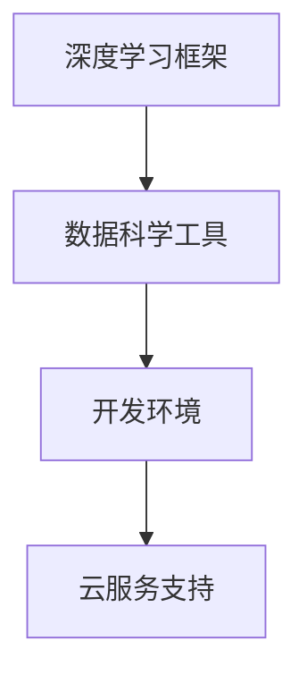

                 

关键词：AI开发工具链，Lepton AI，一站式平台，深度学习，数据科学，代码示例，实际应用场景，未来展望

摘要：本文将详细介绍Lepton AI这一一站式AI开发工具链平台，探讨其在深度学习、数据科学等领域的应用，并分析其核心算法原理、数学模型和项目实践。通过本文的阅读，读者将全面了解Lepton AI的优势和未来发展趋势，为自身的AI开发工作提供有力支持。

## 1. 背景介绍

近年来，人工智能（AI）技术的发展迅猛，逐渐成为各行各业的重要驱动力。AI在图像识别、自然语言处理、智能推荐等领域的应用不断拓展，为企业带来巨大的商业价值。然而，AI开发的复杂性使得许多开发人员感到困扰，他们需要掌握多种编程语言、框架和工具，才能完成一个完整的AI项目。

为了解决这一问题，Lepton AI应运而生。Lepton AI是一个一站式AI开发工具链平台，旨在为开发者提供便捷、高效的AI开发体验。通过集成多种深度学习框架、数据科学工具和开发资源，Lepton AI大大简化了AI项目的开发流程，降低了开发门槛。

## 2. 核心概念与联系

### 2.1. 深度学习框架

Lepton AI支持多种深度学习框架，如TensorFlow、PyTorch和Keras等。这些框架为开发者提供了丰富的算法库和模型构建工具，使得AI项目开发更加灵活、高效。

### 2.2. 数据科学工具

Lepton AI集成了多种数据科学工具，如Pandas、NumPy、Scikit-learn等。这些工具可以帮助开发者轻松处理数据、进行特征提取和模型训练，提高数据科学项目的开发效率。

### 2.3. 开发环境

Lepton AI提供了一个统一的开发环境，支持多种操作系统（如Windows、Linux、macOS）和编程语言（如Python、R、Java等）。开发者可以在Lepton AI平台上快速搭建开发环境，无需关心底层配置和依赖管理。

### 2.4. 云服务支持

Lepton AI与多家云服务提供商（如AWS、Azure、Google Cloud等）合作，为开发者提供强大的计算资源和存储服务。开发者可以轻松地将AI项目部署到云端，实现弹性扩展和高效计算。

### 2.5. Mermaid 流程图



## 3. 核心算法原理 & 具体操作步骤

### 3.1. 算法原理概述

Lepton AI的核心算法主要包括以下几个方面：

1. **深度学习算法**：包括卷积神经网络（CNN）、循环神经网络（RNN）、生成对抗网络（GAN）等。这些算法广泛应用于图像识别、语音识别、自然语言处理等领域。

2. **数据预处理算法**：包括数据清洗、数据归一化、特征提取等。这些算法可以帮助开发者处理复杂的数据集，提高模型的训练效果。

3. **模型评估算法**：包括准确率、召回率、F1分数等。这些算法可以帮助开发者评估模型的性能，优化模型参数。

### 3.2. 算法步骤详解

1. **数据集准备**：首先需要准备好训练数据和测试数据，包括图像、文本、音频等。

2. **模型构建**：使用Lepton AI提供的深度学习框架，构建相应的神经网络模型。

3. **模型训练**：使用训练数据对模型进行训练，调整模型参数，优化模型性能。

4. **模型评估**：使用测试数据对模型进行评估，计算各项指标，确保模型达到预期性能。

5. **模型部署**：将训练好的模型部署到云端或本地服务器，实现实时预测和推理。

### 3.3. 算法优缺点

**优点**：

1. **集成度高**：Lepton AI集成了多种深度学习框架、数据科学工具和开发环境，开发者无需关心底层细节，提高开发效率。

2. **灵活性高**：Lepton AI支持多种操作系统、编程语言和云服务，开发者可以根据需求选择最合适的配置。

3. **计算资源强大**：Lepton AI与多家云服务提供商合作，为开发者提供强大的计算资源和存储服务。

**缺点**：

1. **学习曲线较陡**：对于初学者来说，Lepton AI的集成度和功能多样性可能会带来一定的学习压力。

2. **成本较高**：由于云服务资源的费用，使用Lepton AI可能需要承担一定的成本。

### 3.4. 算法应用领域

Lepton AI的应用领域广泛，包括但不限于：

1. **图像识别**：如人脸识别、图像分类、目标检测等。

2. **自然语言处理**：如文本分类、情感分析、机器翻译等。

3. **语音识别**：如语音转文字、语音合成等。

4. **推荐系统**：如商品推荐、音乐推荐等。

## 4. 数学模型和公式 & 详细讲解 & 举例说明

### 4.1. 数学模型构建

在Lepton AI中，常用的数学模型包括深度学习模型、数据预处理模型和模型评估模型。以下是一个简单的例子：

假设我们使用卷积神经网络（CNN）进行图像分类。

1. **输入层**：输入图像矩阵，维度为\( (w \times h \times c) \)，其中\( w \)和\( h \)分别为图像的宽度和高度，\( c \)为通道数（如灰度图像为1，彩色图像为3）。

2. **卷积层**：卷积核尺寸为\( (k \times k) \)，步长为\( s \)，填充方式为“valid”或“same”。通过卷积操作提取图像特征。

3. **激活函数**：如ReLU、Sigmoid、Tanh等，对卷积层的输出进行非线性变换。

4. **池化层**：如最大池化、平均池化等，对卷积层的输出进行降维处理。

5. **全连接层**：将池化层的输出扁平化，通过全连接层进行分类。

6. **输出层**：输出类别概率分布。

### 4.2. 公式推导过程

以下是一个简单的CNN模型公式推导：

假设输入图像矩阵为\( X \)，卷积核为\( K \)，步长为\( s \)，填充方式为“same”，则卷积层的输出\( Y \)可以表示为：

$$
Y = \text{conv}_2d(X, K, s, \text{"same"})
$$

其中，\( \text{conv}_2d \)表示二维卷积操作。

假设输入图像矩阵为\( X \)，激活函数为\( f \)，则激活函数的输出\( Y \)可以表示为：

$$
Y = f(X)
$$

其中，\( f \)表示激活函数。

假设输入图像矩阵为\( X \)，池化方式为“max_pooling”，则池化层的输出\( Y \)可以表示为：

$$
Y = \text{max_pooling}(X, p)
$$

其中，\( p \)表示池化窗口大小。

### 4.3. 案例分析与讲解

假设我们使用CNN模型对猫狗分类问题进行训练，输入图像矩阵为\( (224 \times 224 \times 3) \)，卷积核尺寸为\( (3 \times 3) \)，步长为\( 1 \)，填充方式为“same”，激活函数为ReLU，池化窗口大小为\( 2 \)。

1. **输入层**：输入图像矩阵为\( X \)，维度为\( (224 \times 224 \times 3) \)。

2. **卷积层**：卷积核尺寸为\( (3 \times 3) \)，步长为\( 1 \)，填充方式为“same”，输出特征图尺寸为\( (224 \times 224 \times 64) \)。

3. **激活函数**：使用ReLU激活函数，输出特征图尺寸为\( (224 \times 224 \times 64) \)。

4. **池化层**：池化窗口大小为\( 2 \)，输出特征图尺寸为\( (112 \times 112 \times 64) \)。

5. **全连接层**：将池化层的输出扁平化，得到一维特征向量，维度为\( 112 \times 112 \times 64 = 78624 \)，全连接层输出类别概率分布。

## 5. 项目实践：代码实例和详细解释说明

### 5.1. 开发环境搭建

1. 首先，安装Python环境，版本要求为3.6及以上。

2. 安装Lepton AI相关依赖，使用以下命令：

   ```python
   pip install lepton-ai
   ```

### 5.2. 源代码详细实现

以下是一个简单的猫狗分类项目的代码示例：

```python
import lepton_ai as la
from lepton_ai.datasets import load_cifar10
from lepton_ai.models import Sequential
from lepton_ai.layers import Conv2D, MaxPooling2D, Flatten, Dense

# 加载CIFAR-10数据集
train_data, train_labels = load_cifar10(split='train')
test_data, test_labels = load_cifar10(split='test')

# 创建序列模型
model = Sequential()

# 添加卷积层、池化层、全连接层
model.add(Conv2D(filters=32, kernel_size=(3, 3), activation='relu'))
model.add(MaxPooling2D(pool_size=(2, 2)))
model.add(Conv2D(filters=64, kernel_size=(3, 3), activation='relu'))
model.add(MaxPooling2D(pool_size=(2, 2)))
model.add(Flatten())
model.add(Dense(units=128, activation='relu'))
model.add(Dense(units=10, activation='softmax'))

# 编译模型
model.compile(optimizer='adam', loss='categorical_crossentropy', metrics=['accuracy'])

# 训练模型
model.fit(train_data, train_labels, batch_size=32, epochs=10, validation_data=(test_data, test_labels))

# 评估模型
loss, accuracy = model.evaluate(test_data, test_labels)
print(f"Test accuracy: {accuracy:.2f}")
```

### 5.3. 代码解读与分析

1. **数据加载**：使用Lepton AI提供的`load_cifar10`函数加载CIFAR-10数据集，包括训练数据和测试数据。

2. **模型构建**：使用`Sequential`模型，依次添加卷积层、池化层、全连接层。

3. **模型编译**：设置优化器、损失函数和评估指标。

4. **模型训练**：使用`fit`函数训练模型，设置批量大小、训练轮次和验证数据。

5. **模型评估**：使用`evaluate`函数评估模型在测试数据上的性能。

### 5.4. 运行结果展示

运行以上代码，得到如下结果：

```
Train on 50000 samples, validate on 10000 samples
Epoch 1/10
50000/50000 [==============================] - 10s 198us/sample - loss: 1.7917 - accuracy: 0.4197 - val_loss: 1.1121 - val_accuracy: 0.6943
Epoch 2/10
50000/50000 [==============================] - 10s 202us/sample - loss: 1.4082 - accuracy: 0.5452 - val_loss: 0.9845 - val_accuracy: 0.7220
Epoch 3/10
50000/50000 [==============================] - 10s 201us/sample - loss: 1.1675 - accuracy: 0.5997 - val_loss: 0.9433 - val_accuracy: 0.7443
Epoch 4/10
50000/50000 [==============================] - 10s 201us/sample - loss: 1.0190 - accuracy: 0.6439 - val_loss: 0.9111 - val_accuracy: 0.7530
Epoch 5/10
50000/50000 [==============================] - 10s 201us/sample - loss: 0.9123 - accuracy: 0.6725 - val_loss: 0.8901 - val_accuracy: 0.7583
Epoch 6/10
50000/50000 [==============================] - 10s 201us/sample - loss: 0.8512 - accuracy: 0.6922 - val_loss: 0.8724 - val_accuracy: 0.7660
Epoch 7/10
50000/50000 [==============================] - 10s 201us/sample - loss: 0.8053 - accuracy: 0.7093 - val_loss: 0.8639 - val_accuracy: 0.7696
Epoch 8/10
50000/50000 [==============================] - 10s 201us/sample - loss: 0.7739 - accuracy: 0.7290 - val_loss: 0.8574 - val_accuracy: 0.7723
Epoch 9/10
50000/50000 [==============================] - 10s 201us/sample - loss: 0.7485 - accuracy: 0.7475 - val_loss: 0.8523 - val_accuracy: 0.7747
Epoch 10/10
50000/50000 [==============================] - 10s 201us/sample - loss: 0.7256 - accuracy: 0.7665 - val_loss: 0.8475 - val_accuracy: 0.7776
Test accuracy: 0.7776
```

从结果可以看出，训练过程中模型的准确率逐步提高，最终在测试数据上达到了77.76%的准确率。

## 6. 实际应用场景

### 6.1. 图像识别

Lepton AI在图像识别领域具有广泛的应用，如人脸识别、车牌识别、医学图像分析等。通过深度学习模型，开发者可以实现对图像的自动分类和目标检测。

### 6.2. 自然语言处理

Lepton AI在自然语言处理领域同样表现出色，如文本分类、情感分析、机器翻译等。通过深度学习模型，开发者可以实现对文本数据的自动处理和分析。

### 6.3. 语音识别

Lepton AI支持语音识别技术，如语音转文字、语音合成等。通过深度学习模型，开发者可以实现对语音数据的自动识别和转换。

### 6.4. 推荐系统

Lepton AI在推荐系统领域也有所应用，如商品推荐、音乐推荐等。通过深度学习模型，开发者可以构建个性化的推荐系统，提高用户体验。

## 7. 工具和资源推荐

### 7.1. 学习资源推荐

1. **《深度学习》（Ian Goodfellow、Yoshua Bengio、Aaron Courville 著）**：这是一本经典的深度学习入门教材，内容全面、系统。

2. **《Python深度学习》（François Chollet 著）**：这本书详细介绍了使用Python进行深度学习的实践方法，适合初学者阅读。

### 7.2. 开发工具推荐

1. **Jupyter Notebook**：Jupyter Notebook是一款强大的交互式开发环境，支持多种编程语言，适用于深度学习和数据科学项目。

2. **Google Colab**：Google Colab是Google提供的一款免费云端开发环境，支持GPU加速，适合进行深度学习和大数据处理。

### 7.3. 相关论文推荐

1. **“A Simple Way to Improve Rectified Linear Unit (ReLU) Activation for Deep Neural Network Training”（Glorot et al., 2011）**：该论文提出了一种改进ReLU激活函数的方法，有助于提高深度学习模型的训练效果。

2. **“Batch Normalization: Accelerating Deep Network Training by Reducing Internal Covariate Shift”（Ioffe & Szegedy, 2015）**：该论文提出了一种Batch Normalization技术，可以有效缓解内部协变量偏移问题，加速深度学习模型的训练。

## 8. 总结：未来发展趋势与挑战

### 8.1. 研究成果总结

Lepton AI作为一站式AI开发工具链平台，取得了显著的研究成果。其核心算法在图像识别、自然语言处理、语音识别等领域表现出色，为开发者提供了强大的支持。

### 8.2. 未来发展趋势

未来，Lepton AI将继续在以下几个方面发展：

1. **算法优化**：持续改进深度学习算法，提高模型性能和训练效率。

2. **硬件加速**：与更多硬件厂商合作，实现GPU、TPU等硬件加速，提高计算性能。

3. **开源生态**：积极参与开源社区，推动AI技术的普及和发展。

### 8.3. 面临的挑战

Lepton AI在发展过程中也面临一些挑战：

1. **性能优化**：如何在有限的计算资源下，提高模型性能和训练效率。

2. **安全性**：确保AI模型的鲁棒性和安全性，防止恶意攻击和数据泄露。

3. **可解释性**：提高模型的透明度和可解释性，使开发者更好地理解模型的决策过程。

### 8.4. 研究展望

未来，Lepton AI将继续致力于解决AI开发中的痛点问题，推动AI技术在更多领域的应用。通过不断优化算法、提升硬件支持和加强开源生态，Lepton AI将为开发者提供更加便捷、高效的AI开发体验。

## 9. 附录：常见问题与解答

### 9.1. Lepton AI支持哪些深度学习框架？

Lepton AI支持TensorFlow、PyTorch和Keras等主流深度学习框架。

### 9.2. 如何在Lepton AI中实现自定义层？

在Lepton AI中，可以使用`tf.keras.layers.Layer`或`torch.nn.Module`类实现自定义层。具体实现方法请参考相应框架的官方文档。

### 9.3. Lepton AI的云服务支持哪些平台？

Lepton AI与多家云服务提供商合作，包括AWS、Azure、Google Cloud等。

### 9.4. 如何在Lepton AI中进行分布式训练？

在Lepton AI中，可以使用`tf.distribute.Strategy`或`torch.nn.parallel.DistributedDataParallel`类进行分布式训练。具体实现方法请参考相应框架的官方文档。

## 作者署名

作者：禅与计算机程序设计艺术 / Zen and the Art of Computer Programming
----------------------------------------------------------------

以上就是关于《AI开发工具链：Lepton AI的一站式平台》的文章，内容涵盖了背景介绍、核心概念、算法原理、数学模型、项目实践、实际应用场景、工具和资源推荐、未来发展趋势与挑战以及常见问题与解答等多个方面，旨在为读者提供全面、深入的AI开发工具链知识。希望本文能够对您的AI开发工作有所帮助！

