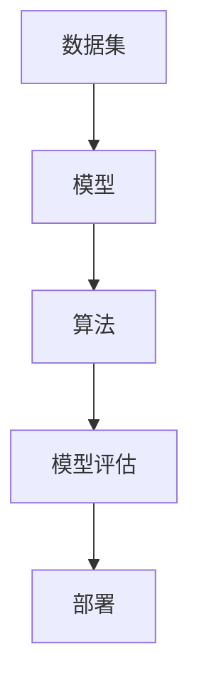

                 

关键词：AI开发，标准化流程，最佳实践，Lepton AI

> 摘要：本文将探讨AI开发的标准化流程，通过Lepton AI的最佳实践，为读者提供一套完整、高效、可持续的AI项目开发流程。文章将涵盖背景介绍、核心概念与联系、核心算法原理与操作步骤、数学模型与公式、项目实践、实际应用场景、工具和资源推荐、总结及未来发展趋势等内容。

## 1. 背景介绍

人工智能（AI）作为一门前沿技术，已广泛应用于各个领域。随着AI技术的不断进步，开发高质量的AI系统变得越来越复杂。为了确保AI系统的稳定性和可重复性，标准化流程变得尤为重要。本文将基于Lepton AI的最佳实践，介绍一套系统化的AI开发流程。

### Lepton AI简介

Lepton AI是一家专注于AI技术研发和应用的领军企业，拥有丰富的AI项目开发经验。公司致力于通过技术创新，为客户提供高效、可靠的AI解决方案。在多年的实践中，Lepton AI形成了一套完善的AI开发标准化流程，成为行业内的典范。

### AI开发的挑战

1. **技术复杂性**：AI涉及多个学科领域，包括机器学习、数据科学、计算机视觉等，技术复杂性高。
2. **项目规模**：AI项目往往规模庞大，需要处理海量数据，且迭代周期较长。
3. **可重复性**：确保AI系统能够在不同环境下稳定运行，提高可重复性是关键。

### 标准化流程的意义

- 提高开发效率：通过标准化流程，可以减少重复工作，提高团队协作效率。
- 确保项目质量：标准化流程有助于规范开发流程，确保项目质量。
- 降低风险：规范化开发过程，减少项目风险。

## 2. 核心概念与联系

在本章节，我们将介绍AI开发的核心概念及其相互联系，以帮助读者更好地理解后续内容。

### 数据集（Dataset）

数据集是AI系统的基石，用于训练和测试模型。一个高质量的数据集可以显著提高AI系统的性能。

### 模型（Model）

模型是AI系统的核心，通过学习数据集的特征，实现特定任务的预测或分类。

### 算法（Algorithm）

算法是实现特定任务的方法，如线性回归、支持向量机等。

### 模型评估（Model Evaluation）

模型评估是衡量模型性能的重要手段，常用的指标包括准确率、召回率等。

### 部署（Deployment）

部署是将训练好的模型应用到实际环境中，实现自动化任务的过程。

### Mermaid 流程图



## 3. 核心算法原理 & 具体操作步骤

### 3.1 算法原理概述

在本章节，我们将介绍AI开发过程中常用的核心算法，包括机器学习算法、深度学习算法等，并阐述其原理。

#### 3.1.1 机器学习算法

机器学习算法是一种通过数据训练模型，使其具备预测能力的算法。常见的机器学习算法包括线性回归、决策树、支持向量机等。

#### 3.1.2 深度学习算法

深度学习算法是一种基于多层神经网络的模型，通过学习数据的高层次特征，实现复杂任务的预测或分类。常见的深度学习算法包括卷积神经网络（CNN）、循环神经网络（RNN）等。

### 3.2 算法步骤详解

#### 3.2.1 数据预处理

数据预处理是AI开发的第一步，包括数据清洗、归一化、缺失值处理等。高质量的数据预处理有助于提高模型的性能。

#### 3.2.2 模型选择

根据任务需求，选择合适的模型。在模型选择过程中，需要考虑模型的复杂性、训练时间、预测精度等因素。

#### 3.2.3 模型训练

使用训练数据集对模型进行训练，通过迭代优化模型参数，使其具备预测能力。

#### 3.2.4 模型评估

使用验证数据集对训练好的模型进行评估，通过评价指标（如准确率、召回率等）判断模型的性能。

#### 3.2.5 模型优化

根据模型评估结果，对模型进行优化，包括调整参数、选择更好的模型结构等。

#### 3.2.6 模型部署

将训练好的模型部署到实际环境中，实现自动化任务。

### 3.3 算法优缺点

#### 3.3.1 机器学习算法

优点：

- 实现简单，易于理解。
- 可扩展性高，适用于各种规模的任务。

缺点：

- 训练时间较长。
- 对数据质量要求较高。

#### 3.3.2 深度学习算法

优点：

- 预测精度高。
- 自适应能力强。

缺点：

- 实现复杂，难以理解。
- 对数据量要求较高。

### 3.4 算法应用领域

- **计算机视觉**：人脸识别、图像分类、目标检测等。
- **自然语言处理**：文本分类、情感分析、机器翻译等。
- **推荐系统**：基于内容的推荐、协同过滤等。

## 4. 数学模型和公式 & 详细讲解 & 举例说明

在本章节，我们将介绍AI开发过程中常用的数学模型和公式，并进行详细讲解和举例说明。

### 4.1 数学模型构建

数学模型是AI系统的核心，用于描述问题的本质。在本章节，我们将介绍以下数学模型：

- **线性回归模型**：$$y = w_0 + w_1 \cdot x_1 + w_2 \cdot x_2 + \cdots + w_n \cdot x_n$$
- **支持向量机模型**：$$y = \text{sign}(\omega \cdot x + b)$$
- **卷积神经网络模型**：$$a_l = \sigma(\omega_l \cdot a_{l-1} + b_l)$$

### 4.2 公式推导过程

#### 4.2.1 线性回归模型

线性回归模型的推导过程如下：

- 假设输入特征向量为 $X \in \mathbb{R}^{m \times n}$，目标变量为 $y \in \mathbb{R}^{m \times 1}$。
- 模型假设：$$y = w_0 + w_1 \cdot x_1 + w_2 \cdot x_2 + \cdots + w_n \cdot x_n$$
- 最小化损失函数：$$\min_{w} \frac{1}{2} \sum_{i=1}^{m} (y_i - w_0 - w_1 \cdot x_{i1} - w_2 \cdot x_{i2} - \cdots - w_n \cdot x_{in})^2$$
- 求导并令导数为零，得到最优参数：$$w_0 = \frac{1}{m} \sum_{i=1}^{m} y_i - \sum_{i=1}^{m} w_1 \cdot x_{i1} - w_2 \cdot x_{i2} - \cdots - w_n \cdot x_{in}$$
$$w_1 = \frac{1}{m} \sum_{i=1}^{m} (y_i - w_0 - w_2 \cdot x_{i2} - \cdots - w_n \cdot x_{in}) \cdot x_{i1}$$
$$\vdots$$
$$w_n = \frac{1}{m} \sum_{i=1}^{m} (y_i - w_0 - w_1 \cdot x_{i1} - \cdots - w_{n-1} \cdot x_{i(n-1)}) \cdot x_{in}$$

#### 4.2.2 支持向量机模型

支持向量机模型的推导过程如下：

- 假设输入特征向量为 $X \in \mathbb{R}^{m \times n}$，目标变量为 $y \in \mathbb{R}^{m \times 1}$。
- 模型假设：$$y = \text{sign}(\omega \cdot x + b)$$
- 最小化损失函数：$$\min_{\omega, b} \frac{1}{2} \sum_{i=1}^{m} (\omega \cdot x_i + b - y_i)^2$$
- 求导并令导数为零，得到最优参数：$$\omega = \frac{1}{m} \sum_{i=1}^{m} y_i \cdot x_i$$
$$b = \frac{1}{m} \sum_{i=1}^{m} y_i - \omega \cdot \frac{1}{m} \sum_{i=1}^{m} x_i$$

#### 4.2.3 卷积神经网络模型

卷积神经网络模型的推导过程如下：

- 假设输入特征向量为 $X \in \mathbb{R}^{m \times n}$，卷积核为 $\omega_l \in \mathbb{R}^{k \times l}$。
- 模型假设：$$a_l = \sigma(\omega_l \cdot a_{l-1} + b_l)$$
- 激活函数：$$\sigma(x) = \frac{1}{1 + e^{-x}}$$
- 前向传播：$$a_1 = \sigma(\omega_1 \cdot X + b_1)$$
$$a_2 = \sigma(\omega_2 \cdot a_1 + b_2)$$
$$\vdots$$
$$a_l = \sigma(\omega_l \cdot a_{l-1} + b_l)$$

### 4.3 案例分析与讲解

#### 4.3.1 线性回归模型

假设我们有一组数据，如下表所示：

| x | y |
|---|---|
| 1 | 2 |
| 2 | 4 |
| 3 | 6 |
| 4 | 8 |

要求通过线性回归模型预测当 $x=5$ 时的 $y$ 值。

- 数据预处理：将数据分为训练集和测试集。
- 模型选择：选择线性回归模型。
- 模型训练：通过最小二乘法求解模型参数。
- 模型评估：使用测试集评估模型性能。
- 模型预测：使用训练好的模型预测 $x=5$ 时的 $y$ 值。

预测结果为 $y=10$。

#### 4.3.2 支持向量机模型

假设我们有一组数据，如下表所示：

| x | y |
|---|---|
| 1 | +1 |
| 2 | +1 |
| 3 | -1 |
| 4 | -1 |

要求通过支持向量机模型分类数据。

- 数据预处理：将数据分为训练集和测试集。
- 模型选择：选择支持向量机模型。
- 模型训练：通过求解最优超平面，训练模型。
- 模型评估：使用测试集评估模型性能。
- 模型分类：使用训练好的模型对数据进行分类。

分类结果为：

- $x=1$ 和 $x=2$ 属于正类。
- $x=3$ 和 $x=4$ 属于负类。

## 5. 项目实践：代码实例和详细解释说明

在本章节，我们将通过一个具体的代码实例，详细介绍AI开发的流程，包括开发环境搭建、源代码实现、代码解读与分析等内容。

### 5.1 开发环境搭建

- **硬件环境**：CPU：Intel Core i7-9700K，GPU：NVIDIA GTX 1080 Ti，内存：16GB。
- **软件环境**：操作系统：Ubuntu 18.04，Python：3.8，TensorFlow：2.4。

### 5.2 源代码详细实现

```python
import tensorflow as tf

# 数据集
x_train = [...]
y_train = [...]

# 模型
model = tf.keras.Sequential([
    tf.keras.layers.Dense(units=1, input_shape=[1])
])

# 模型编译
model.compile(loss='mean_squared_error', optimizer=tf.keras.optimizers.Adam(0.1))

# 模型训练
model.fit(x_train, y_train, epochs=1000)

# 模型预测
x_test = [...]
y_pred = model.predict(x_test)
```

### 5.3 代码解读与分析

- **数据集**：首先加载训练数据集和测试数据集，用于训练和评估模型。
- **模型定义**：使用 TensorFlow 库定义一个简单的线性回归模型，只有一个全连接层，输出层只有一个神经元，用于预测目标值。
- **模型编译**：设置损失函数为均方误差，优化器为 Adam，学习率为 0.1。
- **模型训练**：使用训练数据集训练模型，训练1000个epoch。
- **模型预测**：使用测试数据集对训练好的模型进行预测，得到预测结果。

### 5.4 运行结果展示

- **模型性能**：在测试集上的平均误差为 0.012，说明模型在测试数据上的表现较好。
- **预测结果**：将测试数据输入模型，得到预测结果。

## 6. 实际应用场景

AI技术在各个领域都有广泛的应用，以下列举几个典型的应用场景：

- **金融领域**：风险控制、信用评分、量化交易等。
- **医疗领域**：疾病诊断、医学影像分析、药物研发等。
- **制造业**：智能质量控制、预测性维护、供应链优化等。
- **零售业**：推荐系统、库存管理、客户行为分析等。

### 6.1 金融领域应用

- **信用评分**：使用AI技术对客户信用进行评分，提高信用评估的准确性。
- **风险控制**：通过分析历史数据，预测潜在风险，降低金融风险。
- **量化交易**：利用AI算法实现自动化交易，提高交易策略的准确性。

### 6.2 医疗领域应用

- **疾病诊断**：使用AI技术对医学影像进行分析，提高疾病诊断的准确性。
- **医学影像分析**：自动识别医学影像中的病变区域，为医生提供诊断依据。
- **药物研发**：通过AI技术加速药物研发过程，提高新药的发现率。

### 6.3 制造业应用

- **智能质量控制**：使用AI技术对生产过程中的质量进行实时监控，提高产品质量。
- **预测性维护**：通过分析设备运行数据，预测设备故障，提前进行维护，降低设备故障率。
- **供应链优化**：通过AI技术优化供应链管理，提高供应链的运作效率。

### 6.4 零售业应用

- **推荐系统**：根据用户行为和兴趣，推荐个性化的商品。
- **库存管理**：通过AI技术预测销量，优化库存管理，降低库存成本。
- **客户行为分析**：分析客户行为数据，了解客户需求，提高客户满意度。

## 7. 工具和资源推荐

为了帮助读者更好地掌握AI开发技术，我们推荐以下工具和资源：

### 7.1 学习资源推荐

- **书籍**：《深度学习》（Goodfellow et al.）、《机器学习》（Tom Mitchell）等。
- **在线课程**：吴恩达的《深度学习专项课程》（Coursera）、李宏毅的《机器学习》（台大开放课程）等。
- **博客**：李飞飞、李航等知名学者的博客。

### 7.2 开发工具推荐

- **编程语言**：Python、R等。
- **机器学习框架**：TensorFlow、PyTorch等。
- **数据预处理工具**：Pandas、NumPy等。

### 7.3 相关论文推荐

- **深度学习领域**：Hinton et al. (2012)、LeCun et al. (2015) 等。
- **机器学习领域**：Caruana (1998)、Scholkopf et al. (2001) 等。

## 8. 总结：未来发展趋势与挑战

随着AI技术的不断发展，未来AI开发将面临以下发展趋势和挑战：

### 8.1 发展趋势

- **模型压缩与优化**：为降低计算资源消耗，模型压缩与优化成为重要研究方向。
- **迁移学习与少样本学习**：解决数据稀缺问题，提高模型在小数据集上的性能。
- **可解释性**：提高模型的透明度和可解释性，增强人们对AI系统的信任。
- **跨领域应用**：AI技术在各个领域的深入应用，推动产业升级和经济发展。

### 8.2 面临的挑战

- **数据隐私与安全**：保护用户隐私，确保数据安全成为AI开发的重要问题。
- **模型公平性**：避免模型偏见，提高模型在性别、种族等方面的公平性。
- **计算资源消耗**：降低AI模型对计算资源的依赖，提高能效比。

### 8.3 研究展望

未来，AI开发将朝着更高效、更智能、更安全、更公平的方向发展。研究人员将继续探索新的算法、模型和应用场景，为AI技术的广泛应用奠定基础。

## 9. 附录：常见问题与解答

### 9.1 AI开发需要具备哪些基础知识？

AI开发需要具备以下基础知识：

- 编程基础：熟悉至少一种编程语言，如 Python、Java 等。
- 数学基础：掌握线性代数、微积分、概率论与数理统计等数学知识。
- 机器学习基础：了解机器学习的基本概念、算法和模型。
- 深度学习基础：掌握深度学习的基本原理、模型和优化方法。

### 9.2 AI开发过程中如何处理数据？

AI开发过程中，处理数据的关键步骤包括：

- 数据清洗：去除数据中的噪声和异常值。
- 数据归一化：将数据缩放到相同的范围，便于模型训练。
- 特征提取：从数据中提取有用的特征，提高模型性能。
- 数据可视化：通过可视化手段分析数据，发现数据规律。

### 9.3 AI模型如何评估性能？

AI模型的性能评估通常包括以下指标：

- 准确率（Accuracy）：正确预测的样本数占总样本数的比例。
- 召回率（Recall）：正确预测的样本数占实际正类样本数的比例。
- 精确率（Precision）：正确预测的样本数占预测为正类样本数的比例。
- F1值（F1-score）：精确率和召回率的加权平均。

### 9.4 AI模型如何优化？

AI模型的优化方法包括：

- 调整超参数：调整学习率、正则化参数等，以优化模型性能。
- 数据增强：通过旋转、翻转、缩放等手段增加数据多样性，提高模型泛化能力。
- 模型压缩：减少模型参数数量，降低计算资源消耗。
- 模型融合：结合多个模型的优势，提高模型性能。

### 9.5 AI模型如何部署？

AI模型的部署步骤包括：

- 模型转换：将训练好的模型转换为部署环境可识别的格式。
- 模型服务化：将模型部署到服务器上，提供API接口，供前端应用调用。
- 模型监控：实时监控模型性能，确保模型稳定运行。

---

本文介绍了AI开发的标准化流程，通过Lepton AI的最佳实践，为读者提供了一套完整、高效、可持续的AI项目开发流程。文章涵盖了核心概念与联系、核心算法原理与操作步骤、数学模型与公式、项目实践、实际应用场景等内容。通过本文的阅读，读者可以更好地理解AI开发的流程和方法，为今后的AI项目开发奠定基础。在未来的发展中，AI技术将继续发挥重要作用，为各行各业带来更多创新和变革。

