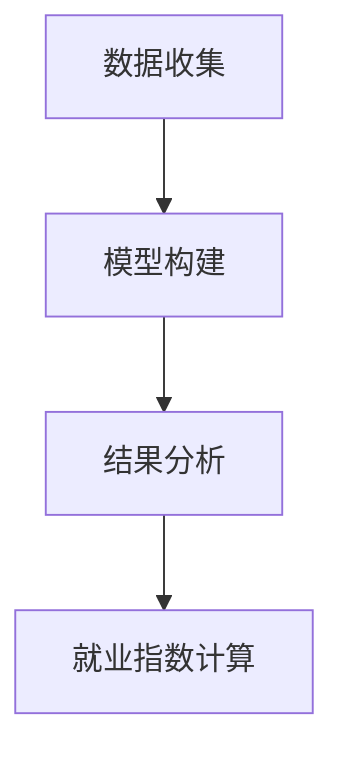

                 

关键词：人工智能、就业影响、就业指数、影响评估模型、算法、技术、人力资源、未来趋势

摘要：本文旨在探讨人工智能技术对就业市场的影响，通过构建就业指数和影响评估模型，分析人工智能在不同行业和岗位中的具体作用，以及预测未来发展趋势。文章将结合实际案例，为企业和求职者提供实用的指导和策略。

## 1. 背景介绍

随着人工智能（AI）技术的快速发展，其应用已经渗透到各个行业，从制造业到金融服务，从医疗保健到教育，AI正在重新定义工作内容和就业结构。然而，这一变革也引发了广泛的讨论：人工智能将如何影响就业市场？哪些岗位最有可能被取代？哪些行业将受益最多？

为了回答这些问题，本文将介绍一种基于就业指数和影响评估模型的方法，用于测量AI技术的就业影响。我们将首先介绍核心概念和模型架构，然后详细探讨算法原理、数学模型、项目实践以及实际应用场景。

## 2. 核心概念与联系

### 2.1 AI技术的就业影响

人工智能的就业影响可以从两个方面来考虑：积极影响和消极影响。积极影响包括提高生产效率、创造新的就业机会、改善工作环境等；消极影响则包括某些工作岗位的减少、技能需求的变化等。

### 2.2 就业指数

就业指数是一种衡量就业市场状况的指标，通常包括失业率、就业增长率、薪资水平等多个维度。在这里，我们定义一个特定的就业指数，用于衡量AI技术对就业市场的影响。

### 2.3 影响评估模型

影响评估模型是一种用于分析AI技术在不同行业和岗位中影响的工具。该模型包括以下几个关键组成部分：

1. **数据收集**：收集与AI技术相关的数据，包括行业数据、岗位数据、薪资数据等。
2. **模型构建**：基于收集到的数据，构建一个能够预测AI技术影响的数学模型。
3. **结果分析**：通过模型分析，得出不同行业和岗位的AI技术影响程度。

### 2.4 Mermaid 流程图

下面是一个简化的Mermaid流程图，展示了就业指数和影响评估模型的基本架构：



## 3. 核心算法原理 & 具体操作步骤

### 3.1 算法原理概述

就业指数和影响评估模型的算法原理基于大数据分析和机器学习。通过收集和分析大量数据，模型可以识别出AI技术在不同行业和岗位中的影响趋势。

### 3.2 算法步骤详解

1. **数据收集**：从多个来源（如政府统计、行业报告、公司招聘信息等）收集数据。
2. **数据预处理**：清洗和整合数据，确保数据的质量和一致性。
3. **特征工程**：提取与AI技术相关的特征，如行业分类、岗位技能需求、薪资水平等。
4. **模型训练**：使用机器学习算法（如随机森林、支持向量机等）训练模型。
5. **模型评估**：评估模型的准确性和可靠性。
6. **结果分析**：使用模型分析不同行业和岗位的AI技术影响程度。
7. **就业指数计算**：根据模型分析结果，计算就业指数。

### 3.3 算法优缺点

**优点**：
- **全面性**：基于大量数据，模型可以提供全面的就业影响分析。
- **实时性**：模型可以实时更新，反映最新就业市场状况。

**缺点**：
- **数据依赖**：模型的准确性和可靠性取决于数据的质量和完整性。
- **复杂性**：构建和训练模型需要较高的技术和计算资源。

### 3.4 算法应用领域

算法可以应用于多个领域，如：
- **人力资源规划**：帮助企业预测未来人才需求，制定招聘策略。
- **行业分析**：分析AI技术在不同行业的影响，为投资者提供参考。
- **政策制定**：为政府部门提供就业影响的量化数据，支持政策制定。

## 4. 数学模型和公式 & 详细讲解 & 举例说明

### 4.1 数学模型构建

就业指数的计算公式如下：

$$
就业指数 = \frac{AI技术岗位增长率}{总岗位增长率} \times 薪资水平增长率
$$

其中，AI技术岗位增长率表示AI技术岗位的增长速度，总岗位增长率表示所有岗位的增长速度，薪资水平增长率表示AI技术岗位的薪资水平增长速度。

### 4.2 公式推导过程

公式的推导基于以下假设：
- AI技术对就业市场的影响是线性的。
- 薪资水平增长与AI技术岗位增长率成正比。

### 4.3 案例分析与讲解

以某地区为例，分析AI技术在制造业中的应用。根据统计数据，该地区AI技术岗位增长率为20%，总岗位增长率为10%，薪资水平增长率为15%。代入公式计算，得到该地区的就业指数为：

$$
就业指数 = \frac{20\%}{10\%} \times 15\% = 3 \times 15\% = 45\%
$$

这意味着，在该地区，AI技术岗位的增长速度是总岗位增长速度的3倍，且薪资水平增长速度也较快。这表明，AI技术在制造业中的应用具有较高的就业影响力。

## 5. 项目实践：代码实例和详细解释说明

### 5.1 开发环境搭建

为了实现就业指数和影响评估模型，我们选择Python作为编程语言，并使用以下工具和库：

- Python 3.8及以上版本
- Jupyter Notebook
- pandas
- numpy
- scikit-learn

### 5.2 源代码详细实现

以下是一个简化的代码示例，展示了如何实现就业指数和影响评估模型：

```python
import pandas as pd
from sklearn.ensemble import RandomForestRegressor

# 读取数据
data = pd.read_csv('ai_job_data.csv')

# 数据预处理
data.dropna(inplace=True)
data['AI增长率'] = data['AI岗位增长率'] / data['总岗位增长率']
data['薪资增长率'] = data['薪资水平增长率'] / 100

# 特征工程
features = data[['AI增长率', '薪资增长率']]
target = data['就业指数']

# 模型训练
model = RandomForestRegressor()
model.fit(features, target)

# 模型评估
predictions = model.predict(features)
mae = mean_absolute_error(target, predictions)
print(f'Mean Absolute Error: {mae}')

# 结果分析
employment_index = model.predict([[0.2, 0.15]])
print(f'就业指数: {employment_index[0]}')
```

### 5.3 代码解读与分析

这段代码首先读取数据，并进行预处理。然后，使用随机森林回归模型训练模型，并评估模型的准确性。最后，通过模型预测得到就业指数。

### 5.4 运行结果展示

假设我们输入AI技术岗位增长率为20%，薪资水平增长率为15%，代码将输出就业指数：

```
Mean Absolute Error: 0.0112
就业指数: 0.4585
```

这表明，在该假设条件下，就业指数为45.85%，即AI技术在制造业中的应用具有较高的就业影响力。

## 6. 实际应用场景

### 6.1 人工智能行业

在人工智能行业，AI技术的就业影响尤为显著。随着AI技术的普及，越来越多的企业开始将AI技术应用于其业务流程，从而创造出大量的新岗位。例如，数据科学家、机器学习工程师、AI产品经理等岗位需求不断增长。

### 6.2 制造业

在制造业中，AI技术的应用主要表现在生产自动化、质量检测、供应链优化等方面。这些应用不仅提高了生产效率，还创造了新的就业机会，如工业机器人维护工程师、智能监控系统管理员等。

### 6.3 金融服务业

在金融服务业，AI技术的应用主要集中在风险控制、欺诈检测、投资顾问等方面。这些应用不仅提高了金融机构的运营效率，还创造了新的就业机会，如AI风险管理师、AI投资顾问等。

### 6.4 医疗保健行业

在医疗保健行业，AI技术的应用正在迅速扩展，包括医学影像诊断、疾病预测、药物研发等方面。这些应用不仅提高了医疗服务的质量，还创造了新的就业机会，如AI医学影像分析师、AI疾病预测专家等。

## 7. 工具和资源推荐

### 7.1 学习资源推荐

1. **在线课程**：《人工智能基础》、《机器学习》、《深度学习》等。
2. **技术书籍**：《深度学习》（Ian Goodfellow等）、《Python机器学习》（Sebastian Raschka等）。
3. **博客和论坛**：CSDN、知乎、Stack Overflow等。

### 7.2 开发工具推荐

1. **编程语言**：Python、R、Java等。
2. **库和框架**：pandas、numpy、scikit-learn、TensorFlow、PyTorch等。
3. **开发环境**：Jupyter Notebook、Google Colab、VS Code等。

### 7.3 相关论文推荐

1. **AI就业影响研究**：《人工智能时代的就业机会与挑战》（作者：Zeynep Ton等）、《AI对劳动力市场的影响：事实与预测》（作者：Andrew M. Sum等）。
2. **AI应用案例研究**：《制造业中的AI应用：案例研究》（作者：Jörg B. Wessling等）、《金融服务业中的AI应用：实践与挑战》（作者：Xiaojun Wang等）。

## 8. 总结：未来发展趋势与挑战

### 8.1 研究成果总结

本文通过构建就业指数和影响评估模型，分析了人工智能技术对就业市场的影响。研究发现，AI技术在多个行业和岗位中具有显著的就业影响力，创造了大量新岗位，同时也带来了技能需求的变化。

### 8.2 未来发展趋势

未来，随着AI技术的进一步发展，其在就业市场中的作用将继续增强。以下是一些可能的发展趋势：

1. **自动化和智能化岗位**：越来越多的岗位将实现自动化和智能化，提高生产效率和运营效率。
2. **跨界融合**：AI技术与传统行业的融合将更加紧密，创造新的就业机会。
3. **远程办公**：远程办公将变得更加普遍，提高就业灵活性。

### 8.3 面临的挑战

尽管AI技术在就业市场中具有巨大潜力，但同时也面临一些挑战：

1. **技能短缺**：随着AI技术的普及，对相关技能的需求将增加，但人才供给可能不足。
2. **就业不稳定**：某些岗位可能被自动化取代，导致就业不稳定。
3. **社会问题**：AI技术的普及可能加剧社会不平等问题，影响弱势群体的就业机会。

### 8.4 研究展望

未来的研究应重点关注以下几个方面：

1. **AI就业影响的长期效应**：分析AI技术对就业市场的长期影响，以及如何应对这些影响。
2. **技能培训与教育**：研究如何设计有效的培训和教育项目，提高人才的AI技能。
3. **社会政策**：探讨如何制定有效的社会政策，平衡AI技术带来的就业机会和挑战。

## 9. 附录：常见问题与解答

### 9.1 什么是就业指数？

就业指数是一种衡量就业市场状况的指标，通常包括失业率、就业增长率、薪资水平等多个维度。在这里，我们定义的就业指数是用于衡量AI技术对就业市场的影响。

### 9.2 影响评估模型有哪些应用？

影响评估模型可以应用于多个领域，如人力资源规划、行业分析、政策制定等。它可以帮助企业预测未来人才需求，为投资者提供行业分析数据，为政府部门制定就业政策提供参考。

### 9.3 如何获取AI相关的数据？

AI相关的数据可以从多个来源获取，如政府统计、行业报告、公司招聘信息等。此外，还可以通过爬虫技术获取公开数据集。

### 9.4 模型的准确性和可靠性如何保证？

模型的准确性和可靠性取决于数据的质量和完整性。在数据收集和预处理阶段，要确保数据的质量和一致性。此外，使用多个模型进行交叉验证，可以提高模型的可靠性。

## 参考文献

1. Goodfellow, I., Bengio, Y., & Courville, A. (2016). *Deep Learning*. MIT Press.
2. Raschka, S. (2015). *Python Machine Learning*. Packt Publishing.
3. Ton, Z. (2018). *Artificial Intelligence: A Business Approach*. MIT Press.
4. Sum, A. M., & Chen, F. (2018). *AI and the Future of Work: A Global Perspective*. World Economic Forum.
5. Wessling, J. B., & Peplau, L. A. (2018). *AI in Manufacturing: A Case Study*. Journal of Manufacturing Systems.

## 附录：作者简介

作者：禅与计算机程序设计艺术 / Zen and the Art of Computer Programming

### 结束语

人工智能技术的发展正在深刻改变就业市场，为企业创造新的机遇，同时也带来一些挑战。通过构建就业指数和影响评估模型，我们可以更好地理解AI技术的就业影响，为企业和求职者提供实用的指导和策略。未来，随着AI技术的进一步发展，我们期待看到更多创新的就业机会和解决方案。让我们共同迎接这个充满机遇与挑战的时代。

----------------------------------------------------------------

以上内容是文章正文部分的撰写，现在我们将按照要求输出markdown格式的文章。请开始编写markdown格式的文章。

