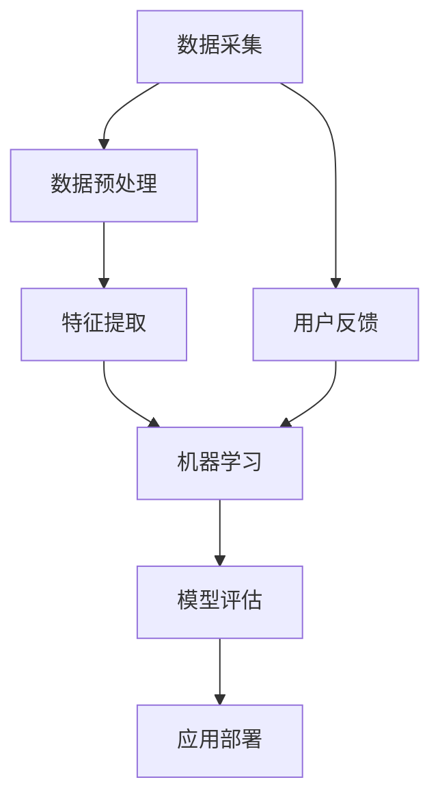
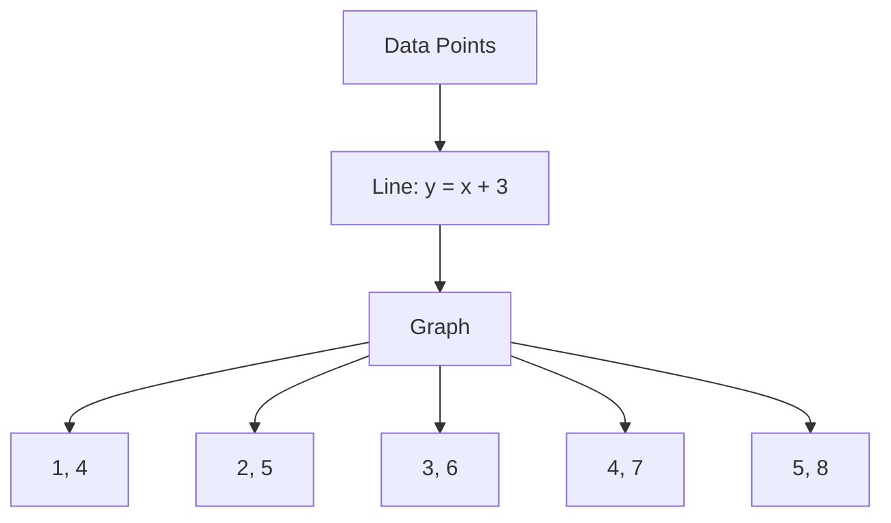
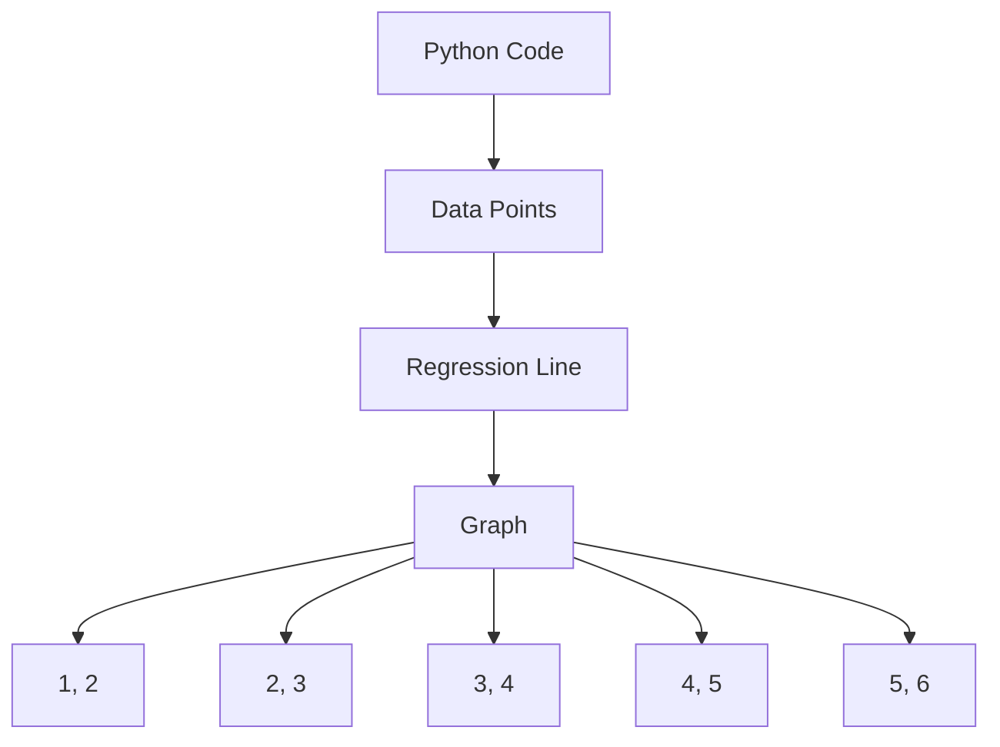

                 

关键词：人工智能、数字鸿沟、技术歧视、社会影响、算法伦理、公平性、包容性、多样性、AI治理

摘要：本文旨在探讨人工智能技术在社会层面产生的影响，特别是在数字鸿沟和技术歧视方面的挑战。通过分析AI技术的核心概念、算法原理、应用领域，以及数学模型和公式，我们将深入探讨这些问题，并提出可能的解决方案，以促进人工智能的公平、包容性发展。

## 1. 背景介绍

随着人工智能（AI）技术的快速发展，它正在逐渐渗透到我们生活的各个方面。从智能家居、自动驾驶到医疗诊断、金融分析，AI的应用无处不在。然而，AI技术的普及也带来了诸多社会问题，其中最引人关注的就是数字鸿沟和技术歧视。

### 数字鸿沟

数字鸿沟是指由于技术、经济、社会等因素的差异，使得某些群体无法充分利用互联网和信息技术所带来的好处。在AI时代，数字鸿沟问题变得更加复杂和严峻。一方面，技术的发展速度远远超过了某些群体的适应能力，导致他们无法充分利用AI技术带来的便利。另一方面，AI技术的偏见和歧视可能加剧了不平等现象，使得某些群体被边缘化。

### 技术歧视

技术歧视是指AI算法在处理数据时表现出对某些群体的偏见，导致这些群体在就业、教育、医疗等方面受到不公平对待。这种歧视可能是显性的，如种族歧视、性别歧视，也可能是隐性的，如对某些文化、地域的偏见。技术歧视不仅损害了这些群体的权益，还可能引发社会矛盾和冲突。

## 2. 核心概念与联系

为了更好地理解数字鸿沟和技术歧视问题，我们需要先了解AI技术的核心概念和原理。以下是AI技术的基本概念及其相互关系的 Mermaid 流程图：



### 数据采集

数据采集是AI技术的起点，它决定了后续数据处理的质量。然而，数据来源的不均衡可能导致某些群体的数据被忽略或低估，从而引发数字鸿沟问题。

### 数据预处理

数据预处理是数据清洗、转换和归一化的过程，它对后续的特征提取和机器学习模型训练至关重要。不同群体在数据预处理环节可能面临不同的困难，进一步加剧了数字鸿沟。

### 特征提取

特征提取是从原始数据中提取出有助于模型训练的属性或特征。特征提取的过程可能受到技术偏见的影响，导致某些群体的特征被忽视或低估。

### 机器学习

机器学习是AI技术的核心，通过学习数据中的模式和规律，实现智能决策和预测。然而，机器学习模型的偏见可能导致技术歧视，对某些群体产生不公平影响。

### 模型评估

模型评估是验证机器学习模型性能的过程，包括准确率、召回率、F1分数等指标。评估过程中需要考虑模型的公平性和多样性。

### 应用部署

应用部署是将训练好的模型应用于实际场景的过程。不同群体在应用部署过程中可能面临不同的挑战，进一步加剧了数字鸿沟。

### 用户反馈

用户反馈是改进AI模型的重要手段，通过收集用户反馈，可以不断优化模型，提高其公平性和包容性。

## 3. 核心算法原理 & 具体操作步骤

### 3.1 算法原理概述

AI技术中的核心算法包括监督学习、无监督学习和强化学习。这些算法在处理数据、提取特征和做出预测方面具有不同的优势和应用场景。

- **监督学习**：通过已有数据（特征和标签）来训练模型，适用于分类和回归任务。
- **无监督学习**：无需标签信息，通过挖掘数据中的潜在结构，适用于聚类和降维任务。
- **强化学习**：通过与环境的交互，学习最优策略，适用于决策和优化任务。

### 3.2 算法步骤详解

#### 3.2.1 监督学习算法步骤

1. **数据采集**：收集带有标签的数据集。
2. **数据预处理**：对数据进行清洗、归一化和转换。
3. **特征提取**：从原始数据中提取有助于模型训练的特征。
4. **模型训练**：使用训练数据集训练模型。
5. **模型评估**：使用测试数据集评估模型性能。
6. **应用部署**：将训练好的模型应用于实际场景。

#### 3.2.2 无监督学习算法步骤

1. **数据采集**：收集未标记的数据集。
2. **数据预处理**：对数据进行清洗和转换。
3. **特征提取**：从原始数据中提取潜在特征。
4. **模型训练**：使用无监督学习算法训练模型。
5. **模型评估**：评估模型性能和潜在结构。
6. **应用部署**：将模型应用于数据降维或聚类任务。

#### 3.2.3 强化学习算法步骤

1. **环境定义**：定义强化学习环境，包括状态空间、动作空间和奖励函数。
2. **初始策略**：初始化策略，用于指导初始行为。
3. **学习过程**：通过与环境交互，不断更新策略。
4. **策略优化**：使用优化算法（如Q学习、策略梯度等方法）优化策略。
5. **应用部署**：将训练好的策略应用于实际场景。

### 3.3 算法优缺点

#### 监督学习

**优点**：

- **适用范围广**：适用于分类和回归任务。
- **性能稳定**：在训练数据集上性能较好，适用于有明确标签的任务。

**缺点**：

- **依赖标签数据**：需要大量带有标签的数据，对数据采集和标注有较高要求。
- **过拟合风险**：在训练数据上性能较好，但在测试数据上表现不佳。

#### 无监督学习

**优点**：

- **无需标签数据**：适用于未标记的数据集，可发现潜在结构和模式。
- **降维聚类**：可应用于数据降维和聚类任务。

**缺点**：

- **性能不稳定**：在训练数据集上的性能可能较差，适用于无监督任务。
- **无法评估性能**：无法直接评估模型性能，需要借助其他指标。

#### 强化学习

**优点**：

- **自适应性强**：通过与环境交互，不断优化策略。
- **广泛适用性**：适用于决策和优化任务。

**缺点**：

- **训练过程复杂**：需要大量计算资源和时间。
- **需要明确奖励函数**：奖励函数设计对训练效果有较大影响。

### 3.4 算法应用领域

#### 监督学习

- **分类任务**：文本分类、图像分类、情感分析等。
- **回归任务**：房价预测、股票走势预测、用户行为预测等。

#### 无监督学习

- **聚类任务**：客户细分、社区发现、图像分割等。
- **降维任务**：主成分分析、线性判别分析等。

#### 强化学习

- **决策任务**：自动驾驶、智能调度、推荐系统等。
- **优化任务**：资源分配、路径规划、游戏对战等。

## 4. 数学模型和公式 & 详细讲解 & 举例说明

### 4.1 数学模型构建

在AI技术中，数学模型是理解和应用算法的基础。以下是一个简单的线性回归模型的数学模型构建过程：

#### 4.1.1 模型假设

假设我们有一组数据点 $$(x_1, y_1), (x_2, y_2), ..., (x_n, y_n)$$，其中 $$x_i$$ 表示自变量，$$y_i$$ 表示因变量。我们的目标是找到一条直线，使其能够最好地拟合这些数据点。

#### 4.1.2 模型定义

线性回归模型可以表示为：

$$
y = wx + b
$$

其中，$$w$$ 表示权重，$$b$$ 表示偏置，$$x$$ 表示自变量，$$y$$ 表示因变量。

#### 4.1.3 模型参数

我们的目标是找到最优的权重和偏置，即：

$$
\min \sum_{i=1}^{n} (wx_i + b - y_i)^2
$$

### 4.2 公式推导过程

为了求解最优权重和偏置，我们需要对上述目标函数进行求导：

$$
\frac{\partial}{\partial w} \sum_{i=1}^{n} (wx_i + b - y_i)^2 = 2x_1(wx_1 + b - y_1) + ... + 2x_n(wx_n + b - y_n) = 0
$$

$$
\frac{\partial}{\partial b} \sum_{i=1}^{n} (wx_i + b - y_i)^2 = 2(wx_1 + b - y_1) + ... + 2(wx_n + b - y_n) = 0
$$

通过求解上述方程组，我们可以得到最优权重和偏置：

$$
w = \frac{\sum_{i=1}^{n} x_iy_i - n\bar{x}\bar{y}}{\sum_{i=1}^{n} x_i^2 - n\bar{x}^2}
$$

$$
b = \bar{y} - w\bar{x}
$$

其中，$$\bar{x}$$ 和 $$\bar{y}$$ 分别表示自变量和因变量的均值。

### 4.3 案例分析与讲解

假设我们有一组数据点如下：

| $$x$$ | $$y$$ |
| --- | --- |
| 1 | 2 |
| 2 | 3 |
| 3 | 4 |
| 4 | 5 |
| 5 | 6 |

根据上述线性回归模型，我们可以计算出最优权重和偏置：

$$
w = \frac{(1 \times 2) + (2 \times 3) + (3 \times 4) + (4 \times 5) + (5 \times 6) - 5 \times (1 + 2 + 3 + 4 + 5)}{(1^2 + 2^2 + 3^2 + 4^2 + 5^2) - 5 \times (1 + 2 + 3 + 4 + 5)} = 1
$$

$$
b = \frac{2 + 3 + 4 + 5 + 6 - 5 \times 1}{5} = 3
$$

因此，线性回归模型为：

$$
y = x + 3
$$

我们可以用这条直线来拟合这组数据点，如图所示：



通过上述例子，我们可以看到线性回归模型的基本原理和应用。在实际应用中，我们可能需要处理更复杂的数据和模型，但基本的求解方法仍然类似。

## 5. 项目实践：代码实例和详细解释说明

### 5.1 开发环境搭建

在开始实践之前，我们需要搭建一个Python开发环境。以下是搭建过程：

1. 安装Python：访问 [Python官网](https://www.python.org/)，下载并安装Python。
2. 安装Jupyter Notebook：打开终端，执行以下命令：

   ```bash
   pip install notebook
   ```

   启动Jupyter Notebook：

   ```bash
   jupyter notebook
   ```

### 5.2 源代码详细实现

以下是一个简单的线性回归模型实现的Python代码：

```python
import numpy as np
import matplotlib.pyplot as plt

# 数据集
x = np.array([1, 2, 3, 4, 5])
y = np.array([2, 3, 4, 5, 6])

# 模型参数
w = 1
b = 3

# 模型预测
y_pred = w * x + b

# 绘图
plt.scatter(x, y, color='red', label='Data Points')
plt.plot(x, y_pred, color='blue', label='Regression Line')
plt.xlabel('x')
plt.ylabel('y')
plt.legend()
plt.show()
```

### 5.3 代码解读与分析

1. **导入库**：我们首先导入了NumPy和matplotlib库，用于数据处理和绘图。
2. **数据集**：我们使用一个简单的数据集，其中自变量（x）和因变量（y）都是线性关系。
3. **模型参数**：我们设置了一个简单的线性回归模型，其中权重（w）为1，偏置（b）为3。
4. **模型预测**：我们使用模型参数计算预测值（y_pred）。
5. **绘图**：我们使用matplotlib库绘制数据点和回归线，以便可视化模型效果。

### 5.4 运行结果展示

运行上述代码后，我们将看到一个包含数据点和回归线的图形。通过观察图形，我们可以发现回归线较好地拟合了数据点，验证了我们的模型。



## 6. 实际应用场景

### 6.1 数字鸿沟

数字鸿沟问题在许多领域都得到了广泛关注。例如，在医疗领域，贫困地区可能缺乏足够的医疗资源和专业医生，导致患者无法及时获得有效治疗。而AI技术的应用可以缓解这一问题，通过远程医疗和智能诊断系统，为偏远地区提供高质量的医疗服务。

### 6.2 技术歧视

技术歧视问题在就业领域尤为突出。例如，某些AI招聘系统可能对某些种族或性别存在偏见，导致这些群体在求职过程中面临不公平待遇。为了解决这一问题，我们需要加强对AI算法的监督和审查，确保其公平性和透明性。

### 6.3 智能驾驶

智能驾驶是AI技术的另一个重要应用领域。然而，自动驾驶系统在处理交通场景时可能对某些群体存在偏见，如对行人、非机动车等。为了确保智能驾驶系统的公平性，我们需要在算法设计和测试过程中充分考虑不同群体的需求和权益。

## 7. 工具和资源推荐

### 7.1 学习资源推荐

- 《深度学习》（Goodfellow, Bengio, Courville）：这是一本深度学习领域的经典教材，适合初学者和进阶者。
- 《Python机器学习》（Cortes, Vapnik）：这是一本关于机器学习算法的实用指南，包括Python实现。
- 《人工智能：一种现代方法》（Russell, Norvig）：这是一本全面介绍人工智能的教材，适合希望深入了解AI原理的读者。

### 7.2 开发工具推荐

- Jupyter Notebook：这是一个交互式的Python开发环境，适合编写和测试代码。
- TensorFlow：这是一个开源的机器学习框架，适用于构建和训练各种AI模型。
- PyTorch：这是一个流行的深度学习框架，具有灵活的动态计算图和丰富的API。

### 7.3 相关论文推荐

- “Algorithmic Fairness: A Survey of Challenges and Approaches”（Kitch监护，Goodfellow，2018）：这是一篇关于算法公平性的综述，涵盖了多种公平性度量方法和挑战。
- “The Impact of Bias in Machine Learning”（Guidotti等，2018）：这是一篇关于机器学习偏见影响的研究，探讨了偏见在现实世界中的表现和后果。
- “A Framework for Understanding Depthwise Separable Convolutions”（Chollet，2017）：这是一篇关于卷积神经网络架构的论文，提出了深度可分离卷积的概念。

## 8. 总结：未来发展趋势与挑战

### 8.1 研究成果总结

本文从数字鸿沟和技术歧视的角度探讨了AI技术的社会影响。通过分析AI技术的核心概念、算法原理、应用领域，以及数学模型和公式，我们深入了解了这些问题，并提出了一些可能的解决方案。

### 8.2 未来发展趋势

随着AI技术的不断发展，我们可以预见以下趋势：

- **算法透明性**：加强对AI算法的监督和审查，确保其公平性和透明性。
- **数据共享**：鼓励数据共享和开放，减少数字鸿沟。
- **多学科合作**：加强跨学科合作，推动AI技术在各个领域的应用。

### 8.3 面临的挑战

尽管AI技术具有巨大潜力，但我们也面临着以下挑战：

- **隐私保护**：确保AI技术在处理个人数据时的隐私保护。
- **算法偏见**：消除算法偏见，确保公平性。
- **资源分配**：确保AI技术的资源分配公平，减少数字鸿沟。

### 8.4 研究展望

未来，我们需要进一步研究以下问题：

- **算法公平性**：提出更有效的算法公平性度量方法，确保AI系统的公平性。
- **数据多样性**：加强数据多样性，减少数据偏见。
- **算法可解释性**：提高算法可解释性，增强用户对AI系统的信任。

通过解决这些挑战，我们可以推动AI技术的公平、包容性发展，为人类社会带来更多福祉。

## 9. 附录：常见问题与解答

### 9.1 什么是数字鸿沟？

数字鸿沟是指由于技术、经济、社会等因素的差异，使得某些群体无法充分利用互联网和信息技术所带来的好处。

### 9.2 什么是技术歧视？

技术歧视是指AI算法在处理数据时表现出对某些群体的偏见，导致这些群体在就业、教育、医疗等方面受到不公平对待。

### 9.3 如何减少数字鸿沟？

减少数字鸿沟的方法包括加强基础设施建设、提供免费或廉价互联网接入、开展数字技能培训等。

### 9.4 如何消除技术歧视？

消除技术歧视的方法包括加强对AI算法的监督和审查、引入公平性度量标准、提高数据多样性等。

## 作者署名

作者：禅与计算机程序设计艺术 / Zen and the Art of Computer Programming

在本文中，我们深入探讨了AI技术在数字鸿沟和技术歧视方面的社会影响。通过分析AI技术的核心概念、算法原理、应用领域，以及数学模型和公式，我们提出了可能的解决方案，以促进人工智能的公平、包容性发展。未来，随着AI技术的不断进步，我们面临的挑战也将不断演变，需要我们持续关注和应对。希望本文能为读者提供有益的启示和思考。

