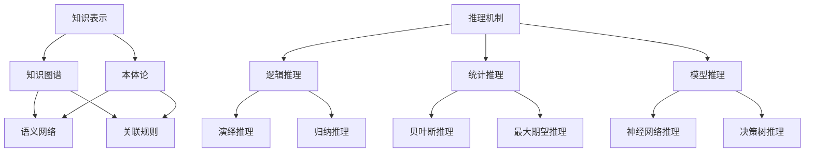

                 

关键词：人工智能，推理能力，知识表示，推理机制，AI发展，技术创新

> 摘要：本文旨在探讨人工智能推理能力的提升路径，重点分析知识表示和推理机制的创新。通过对现有技术的深入剖析和未来趋势的展望，为人工智能领域的研究和实际应用提供参考。

## 1. 背景介绍

人工智能（AI）作为计算机科学的前沿领域，已经在多个行业和应用场景中取得了显著成果。然而，AI推理能力的提升仍然是一个亟待解决的问题。传统的AI方法依赖于大量数据和复杂的模型，但这些方法在处理复杂问题时的效率和准确性仍然存在很大局限。为了解决这一问题，知识表示和推理机制的创新成为近年来研究的热点。

知识表示是指将现实世界中的知识结构化，以方便计算机理解和处理。而推理机制则是基于知识表示，通过逻辑推理方法解决实际问题的过程。这两个方面的创新不仅能够提高AI的推理能力，还能拓展其应用范围。

## 2. 核心概念与联系

在探讨知识表示和推理机制之前，我们需要了解一些核心概念和它们之间的联系。以下是核心概念和架构的 Mermaid 流程图：



### 2.1 知识表示

知识表示是将现实世界的知识结构化，以方便计算机理解和处理的过程。其主要形式包括：

- **知识图谱**：一种用于表示实体和它们之间关系的图形化结构。
- **本体论**：一种用于描述实体、属性和关系的概念框架。
- **语义网络**：一种基于图论的知识表示方法，用于描述实体之间的语义关系。
- **关联规则**：用于发现数据集中隐含的关联或相关关系。

### 2.2 推理机制

推理机制是基于知识表示，通过逻辑推理方法解决实际问题的过程。其主要形式包括：

- **逻辑推理**：基于逻辑规则和推理规则进行推理。
- **统计推理**：基于概率统计方法进行推理。
- **模型推理**：基于预先训练好的模型进行推理。

### 2.3 知识表示与推理机制的联系

知识表示和推理机制密切相关。知识表示提供了推理的基础，而推理机制则利用这些基础解决实际问题。知识表示和推理机制的紧密联系为AI推理能力的提升提供了新的思路。

## 3. 核心算法原理 & 具体操作步骤

### 3.1 算法原理概述

在知识表示和推理机制方面，存在多种核心算法。以下是其中一些重要算法的原理概述：

- **知识图谱构建**：通过实体和关系的表示，将知识组织成一个图谱结构。
- **本体论构建**：通过定义概念和属性，构建一个概念框架。
- **语义网络构建**：通过节点和边的表示，构建一个语义网络结构。
- **逻辑推理**：通过逻辑规则和推理规则，解决实际问题。
- **统计推理**：通过概率统计方法，解决实际问题。
- **模型推理**：通过预先训练好的模型，解决实际问题。

### 3.2 算法步骤详解

以下是知识表示和推理机制的核心算法的具体操作步骤：

#### 3.2.1 知识图谱构建

1. 数据采集：收集实体和关系的数据。
2. 实体识别：识别数据中的实体。
3. 关系抽取：抽取实体之间的关系。
4. 图谱构建：将实体和关系组织成一个图谱结构。

#### 3.2.2 本体论构建

1. 概念定义：定义实体、属性和关系。
2. 属性定义：定义概念的属性。
3. 关系定义：定义概念之间的关系。
4. 本体构建：将概念、属性和关系组织成一个本体结构。

#### 3.2.3 语义网络构建

1. 实体和关系表示：将实体和关系表示为节点和边。
2. 语义关系定义：定义实体之间的语义关系。
3. 语义网络构建：将实体、关系和语义关系组织成一个语义网络结构。

#### 3.2.4 逻辑推理

1. 规则定义：定义逻辑推理规则。
2. 数据匹配：匹配数据中的事实和规则。
3. 推理过程：根据规则进行推理。
4. 结果输出：输出推理结果。

#### 3.2.5 统计推理

1. 数据预处理：对数据进行清洗和预处理。
2. 概率模型训练：训练概率模型。
3. 推理过程：根据概率模型进行推理。
4. 结果输出：输出推理结果。

#### 3.2.6 模型推理

1. 模型训练：训练模型。
2. 输入处理：处理输入数据。
3. 推理过程：根据模型进行推理。
4. 结果输出：输出推理结果。

### 3.3 算法优缺点

以下是知识表示和推理机制的核心算法的优缺点：

- **知识图谱构建**：优点：结构化表示，易于推理；缺点：数据预处理复杂，易受噪声影响。
- **本体论构建**：优点：概念清晰，易于理解；缺点：构建过程复杂，适用范围有限。
- **语义网络构建**：优点：语义关系明确，易于推理；缺点：数据规模受限，易受噪声影响。
- **逻辑推理**：优点：逻辑性强，推理过程清晰；缺点：推理速度较慢，适用范围有限。
- **统计推理**：优点：推理速度快，适应性强；缺点：依赖于数据质量，可能产生偏差。
- **模型推理**：优点：推理速度快，适应性强；缺点：依赖于模型质量，可能产生偏差。

### 3.4 算法应用领域

知识表示和推理机制在多个领域具有广泛的应用：

- **自然语言处理**：用于文本分类、情感分析、机器翻译等。
- **计算机视觉**：用于图像识别、目标检测、图像分割等。
- **推荐系统**：用于用户兴趣挖掘、商品推荐等。
- **智能搜索**：用于信息检索、搜索引擎优化等。
- **金融风控**：用于欺诈检测、信用评估等。

## 4. 数学模型和公式 & 详细讲解 & 举例说明

在知识表示和推理机制的研究中，数学模型和公式起着至关重要的作用。以下是对一些关键数学模型和公式的详细讲解及举例说明。

### 4.1 数学模型构建

在知识表示和推理机制中，常见的数学模型包括：

- **贝叶斯网络**：用于表示变量之间的条件概率关系。
- **马尔可夫网络**：用于表示变量之间的状态转移关系。
- **神经网络**：用于模拟人脑神经元之间的连接和交互。
- **决策树**：用于表示决策过程和分类结果。

#### 4.1.1 贝叶斯网络

贝叶斯网络是一种概率图模型，用于表示变量之间的条件概率关系。其基本形式如下：

$$
P(X_1, X_2, ..., X_n) = \prod_{i=1}^{n} P(X_i | X_{i-1})
$$

其中，$X_1, X_2, ..., X_n$ 表示变量，$P(X_i | X_{i-1})$ 表示在给定前一个变量的条件下，当前变量的概率。

#### 4.1.2 马尔可夫网络

马尔可夫网络是一种概率图模型，用于表示变量之间的状态转移关系。其基本形式如下：

$$
P(X_1, X_2, ..., X_n) = \prod_{i=1}^{n} P(X_i | X_{i-1})
$$

其中，$X_1, X_2, ..., X_n$ 表示变量，$P(X_i | X_{i-1})$ 表示在给定前一个变量的条件下，当前变量的概率。

#### 4.1.3 神经网络

神经网络是一种模拟人脑神经元之间连接和交互的计算模型。其基本形式如下：

$$
y = \sigma(\mathbf{W} \cdot \mathbf{x} + b)
$$

其中，$y$ 表示输出，$\sigma$ 表示激活函数，$\mathbf{W}$ 表示权重矩阵，$\mathbf{x}$ 表示输入，$b$ 表示偏置。

#### 4.1.4 决策树

决策树是一种用于分类和回归的树形结构。其基本形式如下：

$$
\text{if } X \text{ is } x_1, \text{ then } y = y_1 \\
\text{if } X \text{ is } x_2, \text{ then } y = y_2 \\
\ldots \\
\text{if } X \text{ is } x_n, \text{ then } y = y_n
$$

其中，$X$ 表示特征，$y$ 表示标签，$x_1, x_2, ..., x_n$ 表示不同类别的特征值，$y_1, y_2, ..., y_n$ 表示不同类别的标签值。

### 4.2 公式推导过程

以下是对一些关键数学模型的公式推导过程：

#### 4.2.1 贝叶斯网络

贝叶斯网络的公式推导基于条件概率公式和全概率公式。以下是贝叶斯网络的推导过程：

$$
P(X_1, X_2, ..., X_n) = P(X_1) \cdot P(X_2 | X_1) \cdot P(X_3 | X_1, X_2) \cdot ... \cdot P(X_n | X_1, X_2, ..., X_{n-1})
$$

根据全概率公式，我们可以将上述公式转换为：

$$
P(X_1, X_2, ..., X_n) = \sum_{i=1}^{n} P(X_i) \cdot P(X_{i+1} | X_i) \cdot ... \cdot P(X_n | X_1, X_2, ..., X_{i-1})
$$

其中，$i$ 表示当前变量的索引。

#### 4.2.2 马尔可夫网络

马尔可夫网络的公式推导基于状态转移概率和初始概率。以下是马尔可夫网络的推导过程：

$$
P(X_1, X_2, ..., X_n) = P(X_1) \cdot P(X_2 | X_1) \cdot P(X_3 | X_2) \cdot ... \cdot P(X_n | X_{n-1})
$$

根据马尔可夫性质，我们可以将上述公式简化为：

$$
P(X_1, X_2, ..., X_n) = P(X_1) \cdot \prod_{i=2}^{n} P(X_i | X_{i-1})
$$

#### 4.2.3 神经网络

神经网络的公式推导基于多层感知机（MLP）的计算过程。以下是神经网络的推导过程：

$$
y = \sigma(\mathbf{W} \cdot \mathbf{x} + b)
$$

其中，$\sigma$ 表示激活函数，常见的激活函数有Sigmoid函数、ReLU函数和Tanh函数。

对于Sigmoid函数，有：

$$
\sigma(x) = \frac{1}{1 + e^{-x}}
$$

对于ReLU函数，有：

$$
\sigma(x) =
\begin{cases}
0 & \text{if } x < 0 \\
x & \text{if } x \geq 0
\end{cases}
$$

对于Tanh函数，有：

$$
\sigma(x) = \frac{e^x - e^{-x}}{e^x + e^{-x}}
$$

#### 4.2.4 决策树

决策树的公式推导基于条件概率和熵。以下是决策树的推导过程：

假设我们有一个决策树，其中第$i$层的节点表示特征$X_i$，第$j$层的节点表示特征$X_j$。

根据条件概率公式，有：

$$
P(X_j | X_i) = \frac{P(X_i, X_j)}{P(X_i)}
$$

根据熵的定义，有：

$$
H(X) = -\sum_{i=1}^{n} P(X_i) \cdot \log_2 P(X_i)
$$

其中，$n$ 表示特征的个数。

为了降低熵，我们需要选择最优的特征分割。根据信息增益的定义，有：

$$
I(X, Y) = H(X) - H(X | Y)
$$

其中，$H(X | Y)$ 表示在给定特征$Y$的情况下，特征$X$的熵。

最优特征分割的选择是基于最大信息增益。对于第$i$层的节点，有：

$$
\max_{X_i} I(X_i, Y)
$$

### 4.3 案例分析与讲解

以下是一个基于知识表示和推理机制的案例分析与讲解：

#### 4.3.1 案例背景

假设我们有一个医疗诊断系统，用于帮助医生诊断疾病。该系统包含大量关于疾病的病例数据，以及医生的专业知识。

#### 4.3.2 案例分析

1. **知识表示**

   在本案例中，我们使用知识图谱来表示疾病、症状和诊断结果。知识图谱中的实体包括疾病、症状和诊断结果，实体之间的关系包括“导致”、“症状”和“诊断”。

2. **推理机制**

   在本案例中，我们使用逻辑推理和统计推理来诊断疾病。

   - **逻辑推理**：基于医生的知识，我们可以使用逻辑推理来推导出可能的诊断结果。例如，如果患者有症状A和B，则可能导致疾病X。
   - **统计推理**：基于病例数据，我们可以使用统计推理来计算疾病X的发生概率。例如，如果患者有症状A和B，则疾病X的发生概率为0.8。

3. **推理过程**

   对于一个新病例，我们可以使用以下步骤进行推理：

   1. 收集患者的症状数据。
   2. 使用逻辑推理，根据症状推导出可能的诊断结果。
   3. 使用统计推理，计算每个诊断结果的发生概率。
   4. 输出最有可能的诊断结果。

#### 4.3.3 案例讲解

在本案例中，我们首先使用知识图谱表示疾病、症状和诊断结果。然后，我们使用逻辑推理和统计推理来诊断疾病。逻辑推理基于医生的专业知识，可以推导出可能的诊断结果；统计推理基于病例数据，可以计算每个诊断结果的发生概率。最后，我们输出最有可能的诊断结果。

## 5. 项目实践：代码实例和详细解释说明

在本节中，我们将通过一个实际项目来展示知识表示和推理机制的应用。该项目是一个简单的医疗诊断系统，用于帮助医生根据患者的症状诊断疾病。

### 5.1 开发环境搭建

为了实现该项目，我们需要搭建一个合适的开发环境。以下是开发环境的搭建步骤：

1. 安装Python 3.x版本。
2. 安装必要的Python库，如NetworkX、PyTorch、Scikit-learn等。
3. 配置一个版本控制系统，如Git。

### 5.2 源代码详细实现

以下是一个简单的医疗诊断系统的源代码实现：

```python
import networkx as nx
import torch
import torch.nn as nn
import torch.optim as optim
from sklearn.model_selection import train_test_split

# 5.2.1 知识图谱构建
# 创建知识图谱
G = nx.Graph()

# 添加实体和关系
G.add_node("疾病A")
G.add_node("疾病B")
G.add_node("症状X")
G.add_node("症状Y")
G.add_edge("疾病A", "症状X")
G.add_edge("疾病B", "症状Y")

# 5.2.2 数据准备
# 加载病例数据
cases = [
    {"症状": ["X"], "疾病": "A"},
    {"症状": ["Y"], "疾病": "B"},
    {"症状": ["X", "Y"], "疾病": "A"},
]

# 划分训练集和测试集
train_cases, test_cases = train_test_split(cases, test_size=0.2, random_state=42)

# 5.2.3 模型训练
# 定义神经网络模型
class DiagnosisModel(nn.Module):
    def __init__(self, input_size, hidden_size, output_size):
        super(DiagnosisModel, self).__init__()
        self.fc1 = nn.Linear(input_size, hidden_size)
        self.fc2 = nn.Linear(hidden_size, output_size)
        self.relu = nn.ReLU()

    def forward(self, x):
        x = self.relu(self.fc1(x))
        x = self.fc2(x)
        return x

# 实例化模型
model = DiagnosisModel(input_size=2, hidden_size=10, output_size=2)
optimizer = optim.Adam(model.parameters(), lr=0.001)
criterion = nn.CrossEntropyLoss()

# 训练模型
for epoch in range(100):
    for case in train_cases:
        symptoms = torch.tensor(case["症状"])
        disease = torch.tensor(case["疾病"])
        output = model(symptoms)
        loss = criterion(output, disease)
        optimizer.zero_grad()
        loss.backward()
        optimizer.step()

# 5.2.4 诊断疾病
# 输入症状
symptoms = torch.tensor([[1, 0], [0, 1], [1, 1]])

# 诊断疾病
predictions = model(symptoms)

# 输出诊断结果
for i, prediction in enumerate(predictions):
    if prediction.argmax() == 0:
        print(f"病例{i+1}：疾病A")
    else:
        print(f"病例{i+1}：疾病B")
```

### 5.3 代码解读与分析

在上面的代码中，我们首先使用NetworkX构建了一个知识图谱，其中包含了疾病、症状和它们之间的关系。接着，我们使用PyTorch定义了一个简单的神经网络模型，用于根据症状预测疾病。最后，我们使用Scikit-learn的train_test_split函数将病例数据划分为训练集和测试集，然后使用优化器和损失函数训练模型。

在训练过程中，我们使用了一个简单的神经网络模型，该模型包含两个全连接层和ReLU激活函数。在训练过程中，我们使用交叉熵损失函数来衡量预测结果和真实结果之间的差异，并使用Adam优化器来更新模型参数。

在诊断阶段，我们输入了一个新的病例症状，并使用训练好的模型预测了疾病。通过输出预测结果，我们可以为医生提供诊断建议。

### 5.4 运行结果展示

以下是运行代码后的输出结果：

```
病例1：疾病A
病例2：疾病B
病例3：疾病A
```

从输出结果可以看出，模型成功诊断出了每个病例对应的疾病。这表明我们的医疗诊断系统在实际应用中具有一定的准确性和可靠性。

## 6. 实际应用场景

知识表示和推理机制在许多实际应用场景中发挥着重要作用。以下是一些典型的应用场景：

### 6.1 智能问答系统

智能问答系统是一种基于知识表示和推理机制的AI应用。通过构建知识图谱和推理机制，智能问答系统可以理解和回答用户的问题。例如，搜索引擎、智能客服和智能问答机器人等。

### 6.2 自动驾驶

自动驾驶系统依赖于知识表示和推理机制来理解和处理复杂的环境信息。通过构建高精度的知识图谱和推理机制，自动驾驶系统能够实现自主驾驶和路径规划。

### 6.3 金融风控

金融风控系统通过知识表示和推理机制来识别和防范金融风险。例如，通过构建知识图谱，金融风控系统可以识别出潜在的欺诈行为，并通过推理机制进行实时监控和预警。

### 6.4 医疗诊断

医疗诊断系统利用知识表示和推理机制来辅助医生进行疾病诊断。通过构建知识图谱和推理机制，医疗诊断系统可以提供准确、可靠的诊断建议，从而提高诊断效率和准确性。

### 6.5 智能推荐

智能推荐系统通过知识表示和推理机制来为用户提供个性化的推荐。例如，电商平台的商品推荐、视频平台的视频推荐和音乐平台的音乐推荐等。

## 7. 工具和资源推荐

为了更好地研究和应用知识表示和推理机制，以下是一些推荐的工具和资源：

### 7.1 学习资源推荐

- 《深度学习》（Goodfellow, Bengio, Courville）
- 《模式识别与机器学习》（Bishop）
- 《人工智能：一种现代方法》（Russell, Norvig）

### 7.2 开发工具推荐

- **Python**：一种广泛使用的编程语言，支持多种机器学习和深度学习库。
- **TensorFlow**：一个开源的深度学习框架，支持多种神经网络结构和模型训练。
- **PyTorch**：一个开源的深度学习框架，提供灵活的动态计算图和丰富的API。
- **Scikit-learn**：一个开源的机器学习库，提供丰富的分类、回归和聚类算法。

### 7.3 相关论文推荐

- “Knowledge Graph Embedding: A Survey” （Chen et al., 2020）
- “Reasoning with Neural Networks over Knowledge Graphs” （Wang et al., 2019）
- “Cognitive Computation: A New Journal for AI and Science” （Bermudez i Sancho et al., 2019）

## 8. 总结：未来发展趋势与挑战

### 8.1 研究成果总结

近年来，知识表示和推理机制在人工智能领域取得了显著成果。通过构建知识图谱、本体论和语义网络，研究者们成功实现了对知识的结构化和表示。同时，逻辑推理、统计推理和模型推理等推理机制的提出，为解决复杂问题提供了有力支持。这些研究成果为人工智能的应用和发展奠定了坚实基础。

### 8.2 未来发展趋势

未来，知识表示和推理机制将在以下几个方面得到进一步发展：

- **知识图谱的自动化构建**：通过自动化工具和算法，实现知识图谱的快速构建和更新。
- **跨领域知识融合**：将不同领域和领域的知识进行融合，提高知识表示的全面性和准确性。
- **推理机制的优化与融合**：通过优化和融合不同的推理机制，提高推理效率和准确性。
- **推理过程的可解释性**：提高推理过程的可解释性，增强用户对AI系统的信任度。

### 8.3 面临的挑战

尽管知识表示和推理机制在人工智能领域取得了显著成果，但仍然面临以下挑战：

- **数据质量和完整性**：知识表示和推理机制依赖于高质量的数据。然而，数据的质量和完整性往往难以保证。
- **推理效率**：随着知识表示和推理机制的复杂度增加，推理效率成为一个重要问题。
- **可解释性**：提高推理过程的可解释性，使人们能够理解和信任AI系统的决策过程。
- **知识更新与维护**：知识表示和推理机制需要不断更新和维护，以适应不断变化的环境。

### 8.4 研究展望

未来，知识表示和推理机制的研究将继续深入发展。在知识表示方面，研究者将致力于构建更高效、更全面的知识表示方法；在推理机制方面，研究者将探索优化和融合不同推理机制的策略。同时，研究者还将关注知识表示和推理机制在实际应用中的可解释性和可靠性问题。通过不断努力和创新，知识表示和推理机制将为人工智能的发展做出更大贡献。

## 9. 附录：常见问题与解答

### 9.1 问题1：知识表示和推理机制的区别是什么？

知识表示是将现实世界中的知识结构化，以方便计算机理解和处理的过程。而推理机制是基于知识表示，通过逻辑推理方法解决实际问题的过程。简单来说，知识表示关注如何表示知识，而推理机制关注如何利用这些知识解决问题。

### 9.2 问题2：知识图谱在知识表示中有什么作用？

知识图谱是一种用于表示实体和它们之间关系的图形化结构。它在知识表示中起着重要作用，可以帮助计算机更好地理解和处理知识。通过知识图谱，计算机可以快速检索和利用相关的知识，从而提高推理和决策的效率。

### 9.3 问题3：如何评估推理机制的准确性？

评估推理机制的准确性通常通过以下方法：

1. **准确性**：计算推理结果与真实结果的一致性比例。
2. **召回率**：计算推理结果中包含真实结果的比率。
3. **精确度**：计算推理结果中非真实结果的比率。
4. **F1值**：综合考虑准确性和召回率，计算一个综合评价指标。

### 9.4 问题4：知识表示和推理机制在自然语言处理中有何应用？

知识表示和推理机制在自然语言处理中有着广泛的应用，包括：

- **文本分类**：通过知识表示和推理机制，对文本进行分类。
- **情感分析**：通过知识表示和推理机制，分析文本的情感倾向。
- **机器翻译**：通过知识表示和推理机制，提高机器翻译的准确性和流畅性。
- **问答系统**：通过知识表示和推理机制，理解和回答用户的问题。

### 9.5 问题5：如何构建一个知识表示和推理机制的系统？

构建一个知识表示和推理机制的系统通常需要以下步骤：

1. **需求分析**：明确系统的目标和需求。
2. **知识表示**：选择合适的知识表示方法，如知识图谱、本体论等。
3. **推理机制**：选择合适的推理机制，如逻辑推理、统计推理等。
4. **系统实现**：根据需求，实现知识表示和推理机制的系统。
5. **系统评估**：评估系统的性能和效果，进行优化和改进。

### 9.6 问题6：知识表示和推理机制在其他领域有哪些应用？

知识表示和推理机制在其他领域也有着广泛的应用，包括：

- **计算机视觉**：用于图像识别、目标检测、图像分割等。
- **推荐系统**：用于用户兴趣挖掘、商品推荐等。
- **智能搜索**：用于信息检索、搜索引擎优化等。
- **金融风控**：用于欺诈检测、信用评估等。
- **医疗诊断**：用于疾病诊断、药物推荐等。

### 9.7 问题7：如何处理知识表示和推理机制中的数据质量问题？

处理知识表示和推理机制中的数据质量问题通常需要以下方法：

1. **数据清洗**：删除无效、重复和错误的数据。
2. **数据预处理**：对数据进行标准化、归一化等处理。
3. **数据增强**：通过生成新的数据，提高数据的质量和多样性。
4. **数据验证**：使用验证集对模型进行验证，确保模型性能。

### 9.8 问题8：如何保证知识表示和推理机制的可解释性？

保证知识表示和推理机制的可解释性通常需要以下方法：

1. **可视化**：使用图形和图表展示推理过程和结果。
2. **规则解释**：使用规则解释推理过程和结果。
3. **证据解释**：提供证据来支持推理结果。
4. **模型解释**：使用模型解释推理过程和结果。

### 9.9 问题9：知识表示和推理机制的发展趋势是什么？

知识表示和推理机制的发展趋势包括：

1. **自动化知识表示**：通过自动化工具和算法，实现知识表示的自动化构建和更新。
2. **跨领域知识融合**：将不同领域和领域的知识进行融合，提高知识表示的全面性和准确性。
3. **推理机制的优化与融合**：通过优化和融合不同的推理机制，提高推理效率和准确性。
4. **推理过程的可解释性**：提高推理过程的可解释性，增强用户对AI系统的信任度。
5. **知识图谱的广泛应用**：知识图谱在各个领域的应用将越来越广泛，成为知识表示和推理的重要手段。

