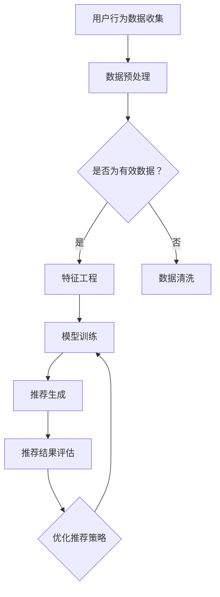

                 

关键词：社交电商、AI推荐、个性化推荐、机器学习、深度学习、用户行为分析、数据挖掘

> 摘要：本文将探讨人工智能（AI）在社交电商中的创新应用，特别是个性化推荐系统的发展。我们将深入分析AI推荐技术的核心概念、算法原理、数学模型，并通过实际项目实践展示其在社交电商领域的应用效果。最后，我们将讨论AI推荐在社交电商中的未来发展趋势、挑战及研究展望。

## 1. 背景介绍

随着互联网的普及和智能手机的广泛应用，社交电商成为了现代电子商务的重要组成部分。社交电商结合了社交网络和电商平台的特性，不仅提供了更加丰富的购物体验，也通过社交关系增强用户粘性。然而，面对海量用户和数据，如何为用户提供个性化的购物推荐成为了一个亟待解决的问题。

个性化推荐系统作为人工智能的一个重要分支，通过分析用户的历史行为、兴趣偏好、社交关系等信息，为用户推荐他们可能感兴趣的商品或服务。在社交电商中，个性化推荐系统不仅能够提高用户满意度，还能显著提升电商平台销售额和用户转化率。

### 1.1 社交电商的发展

社交电商起源于社交媒体和电商平台的融合。最早的社交电商形式是Facebook等社交媒体平台上的购物按钮和商家主页，用户可以通过社交网络分享购物链接和商品信息。随着移动互联网的发展，微信、微博等平台逐渐推出了自己的电商平台，形成了微信小程序、微博购物等社交电商模式。

社交电商的特点在于社交关系的力量。用户不仅可以在平台上购物，还可以通过分享、点赞、评论等方式与其他用户互动，从而建立信任和社交网络。这种社交属性使得推荐系统需要更加关注用户的社交关系和社交圈子的兴趣偏好。

### 1.2 个性化推荐系统的需求

在社交电商中，个性化推荐系统的需求尤为迫切。主要原因有以下几点：

1. **海量用户数据**：社交电商平台拥有海量的用户数据，包括用户行为、兴趣偏好、购物历史等。如何从这些数据中提取有价值的信息进行个性化推荐是一个巨大的挑战。
   
2. **高度个性化的需求**：用户在社交电商中不仅关注商品本身的属性，还受到社交圈子的影响。因此，推荐系统需要能够理解用户的社交网络，并根据社交关系推荐相关商品。

3. **动态变化的兴趣**：用户的兴趣和需求是动态变化的。个性化推荐系统需要实时分析用户行为，快速调整推荐策略，以适应用户的变化。

4. **用户体验优化**：社交电商强调用户体验，个性化推荐系统能够为用户带来更加个性化的购物体验，提高用户满意度和忠诚度。

## 2. 核心概念与联系

在深入探讨个性化推荐系统之前，我们需要了解几个核心概念，包括机器学习、深度学习、用户行为分析、数据挖掘等，以及它们在社交电商中的应用。

### 2.1 机器学习和深度学习

机器学习是使计算机系统能够通过经验和数据进行学习，从而改进其性能的一门科学。在个性化推荐系统中，机器学习被广泛用于分析用户数据，发现用户行为模式，并生成推荐列表。深度学习作为机器学习的一个重要分支，通过多层神经网络模拟人脑学习过程，能够在大规模数据集上实现高效的特征学习和模式识别。

### 2.2 用户行为分析

用户行为分析是个性化推荐系统的核心。通过分析用户的浏览历史、购买行为、搜索关键词、社交互动等数据，推荐系统可以了解用户的兴趣和需求。行为分析技术包括点击流分析、转化率分析、情感分析等，这些技术能够为推荐系统提供丰富的用户特征。

### 2.3 数据挖掘

数据挖掘是从大量数据中提取有价值信息的过程。在个性化推荐系统中，数据挖掘用于发现用户之间的相似性、识别潜在的兴趣群体，以及预测用户的未来行为。数据挖掘技术包括聚类分析、关联规则挖掘、分类和预测模型等。

### 2.4 Mermaid 流程图

下面是一个使用Mermaid绘制的流程图，展示了社交电商中个性化推荐系统的一般架构。



### 2.5 个性化推荐系统的工作流程

个性化推荐系统的工作流程可以分为以下几个步骤：

1. **数据收集**：从电商平台和社交媒体中收集用户行为数据，如浏览记录、购买历史、搜索关键词、社交互动等。
   
2. **数据预处理**：清洗和整理数据，去除噪声和异常值，并进行特征工程，提取对推荐有用的特征。

3. **模型训练**：使用机器学习或深度学习算法，对预处理后的数据进行训练，生成推荐模型。

4. **推荐生成**：根据用户的当前状态和偏好，使用训练好的模型生成个性化推荐列表。

5. **推荐结果评估**：评估推荐结果的准确性和用户满意度，并根据评估结果调整推荐策略。

6. **优化推荐策略**：通过不断调整和优化推荐算法，提高推荐质量和用户体验。

## 3. 核心算法原理 & 具体操作步骤

### 3.1 算法原理概述

个性化推荐系统的核心是算法。常见的推荐算法包括基于内容的推荐、协同过滤、基于模型的推荐等。下面我们将分别介绍这些算法的基本原理。

#### 3.1.1 基于内容的推荐

基于内容的推荐（Content-based Recommendation）是一种基于物品的属性和用户的历史行为进行推荐的算法。该算法的主要思想是找到与用户历史评价相似的物品进行推荐。具体步骤如下：

1. **特征提取**：对物品和用户行为进行特征提取，如商品标签、用户浏览历史等。

2. **相似度计算**：计算物品与物品之间的相似度，以及物品与用户之间的相似度。

3. **推荐生成**：根据相似度计算结果，为用户生成推荐列表。

#### 3.1.2 协同过滤

协同过滤（Collaborative Filtering）是一种基于用户之间的相似性进行推荐的算法。该算法的主要思想是利用用户之间的共同点来预测用户未评价的物品。协同过滤可以分为以下两种类型：

1. **用户基于的协同过滤**：通过计算用户之间的相似度，为用户推荐其他用户喜欢的物品。

2. **物品基于的协同过滤**：通过计算物品之间的相似度，为用户推荐他们可能喜欢的其他物品。

#### 3.1.3 基于模型的推荐

基于模型的推荐（Model-based Recommendation）是利用机器学习算法，如深度学习、决策树等，构建用户与物品之间的预测模型。该算法的核心是训练一个能够预测用户对物品评价的模型。具体步骤如下：

1. **数据准备**：准备用户-物品评价数据，并进行预处理。

2. **模型训练**：使用训练数据训练预测模型，如基于矩阵分解、深度学习等。

3. **模型评估**：使用测试数据评估模型的性能，并调整模型参数。

4. **推荐生成**：根据训练好的模型，为用户生成个性化推荐列表。

### 3.2 算法步骤详解

#### 3.2.1 基于内容的推荐步骤

1. **特征提取**：
   - 对商品进行特征提取，如分类标签、价格、品牌等。
   - 对用户行为进行特征提取，如浏览历史、购买历史、搜索关键词等。

2. **相似度计算**：
   - 计算商品之间的相似度，可以使用余弦相似度、皮尔逊相关系数等。
   - 计算用户与商品之间的相似度，可以使用TF-IDF、词嵌入等。

3. **推荐生成**：
   - 根据用户的历史行为和商品的相似度，为用户生成推荐列表。

#### 3.2.2 协同过滤步骤

1. **用户-物品评分矩阵构建**：
   - 构建用户-物品评分矩阵，记录用户对物品的评价。

2. **相似度计算**：
   - 计算用户之间的相似度，可以使用余弦相似度、皮尔逊相关系数等。
   - 计算物品之间的相似度，可以使用余弦相似度、皮尔逊相关系数等。

3. **推荐生成**：
   - 根据用户与物品的相似度，为用户推荐其他用户喜欢的物品。

#### 3.2.3 基于模型的推荐步骤

1. **数据准备**：
   - 准备用户-物品评价数据，并进行预处理，如缺失值填充、异常值处理等。

2. **模型选择**：
   - 选择合适的机器学习算法，如矩阵分解、深度学习等。

3. **模型训练**：
   - 使用训练数据训练模型，并调整模型参数。

4. **模型评估**：
   - 使用测试数据评估模型性能，如均方根误差（RMSE）、精确率（Precision）、召回率（Recall）等。

5. **推荐生成**：
   - 根据训练好的模型，为用户生成个性化推荐列表。

### 3.3 算法优缺点

#### 3.3.1 基于内容的推荐

**优点**：
- 推荐结果与用户兴趣密切相关，能够提供个性化推荐。
- 推荐过程简单，易于实现。

**缺点**：
- 推荐结果可能受到数据稀疏性的影响，对于新用户或新物品难以生成有效的推荐。
- 推荐结果可能存在冷启动问题，即无法为新用户或新物品生成有效的推荐。

#### 3.3.2 协同过滤

**优点**：
- 能够充分利用用户之间的共同点，生成高质量的推荐结果。
- 对于新用户和新物品具有一定的鲁棒性。

**缺点**：
- 推荐结果可能受到数据噪声的影响，降低推荐质量。
- 需要大量的用户评分数据，对于数据稀疏的领域效果较差。

#### 3.3.3 基于模型的推荐

**优点**：
- 能够利用机器学习算法挖掘用户和物品之间的潜在关系，生成高质量的推荐结果。
- 对于新用户和新物品具有一定的鲁棒性。

**缺点**：
- 模型训练过程复杂，需要大量的计算资源和时间。
- 模型参数调整较为复杂，需要经验丰富的数据科学家。

### 3.4 算法应用领域

个性化推荐算法在社交电商中具有广泛的应用，除了上述提到的基于内容的推荐、协同过滤和基于模型的推荐外，还有以下几种应用领域：

1. **商品推荐**：为用户提供个性化的商品推荐，提高用户购买意愿和转化率。
   
2. **内容推荐**：为用户提供个性化的内容推荐，如文章、视频、音乐等，提高用户在平台上的活跃度和留存率。

3. **广告推荐**：为用户提供个性化的广告推荐，提高广告的点击率和转化率。

4. **社交网络推荐**：基于用户的社交关系和兴趣，为用户推荐相关的好友、群组等，增强用户社交网络的连接。

## 4. 数学模型和公式 & 详细讲解 & 举例说明

在个性化推荐系统中，数学模型和公式起着至关重要的作用。本节将介绍常见的数学模型和公式，并进行详细讲解和举例说明。

### 4.1 数学模型构建

个性化推荐系统的数学模型主要分为两类：基于模型的推荐和基于集成的推荐。下面分别介绍这两类模型。

#### 4.1.1 基于模型的推荐

基于模型的推荐通常采用矩阵分解、深度学习等方法。以下是一个基于矩阵分解的推荐模型示例。

$$
R_{ij} = \hat{R}_{ij} + \epsilon_{ij}
$$

其中，$R_{ij}$ 表示用户 $i$ 对物品 $j$ 的真实评分，$\hat{R}_{ij}$ 表示模型预测的用户 $i$ 对物品 $j$ 的评分，$\epsilon_{ij}$ 表示误差项。

矩阵分解模型将用户-物品评分矩阵分解为用户特征矩阵 $U$ 和物品特征矩阵 $V$，即：

$$
R = UV^T
$$

其中，$U$ 和 $V$ 都是低秩矩阵，包含用户和物品的特征。

#### 4.1.2 基于集成的推荐

基于集成的推荐通过组合多个简单推荐模型，提高推荐质量。以下是一个基于集成的方法示例。

$$
\hat{R}_{ij} = \frac{1}{K} \sum_{k=1}^{K} \hat{R}_{ij}^{(k)}
$$

其中，$\hat{R}_{ij}^{(k)}$ 表示第 $k$ 个简单推荐模型的预测评分，$K$ 表示简单推荐模型的数量。

### 4.2 公式推导过程

下面我们以基于矩阵分解的推荐模型为例，介绍公式的推导过程。

首先，我们假设用户-物品评分矩阵 $R$ 是一个随机变量，它的分布可以用概率矩阵 $P$ 表示，即：

$$
R \sim P
$$

概率矩阵 $P$ 可以分解为用户特征矩阵 $U$ 和物品特征矩阵 $V$ 的乘积，即：

$$
P = UV^T
$$

由于 $R$ 是 $P$ 的一个随机变量，我们可以通过对 $P$ 进行高斯分布假设，推导出 $R$ 的期望和方差。

期望：

$$
E(R) = E(UV^T) = UE(V^T) = UV
$$

方差：

$$
Var(R) = Var(UV^T) = U\sigma^2 V^T U^T
$$

其中，$\sigma^2$ 表示噪声方差。

为了简化问题，我们假设用户和物品的特征是独立同分布的，即：

$$
U \sim N(0, \sigma_u^2 I)
$$

$$
V \sim N(0, \sigma_v^2 I)
$$

根据正态分布的性质，我们可以推导出 $R$ 的分布：

$$
R \sim N(UV, U\sigma^2 V^T U^T)
$$

接下来，我们通过最小化误差平方和（MSE）来优化模型参数。

$$
\min_{U, V} \sum_{i, j} (R_{ij} - UV_{ij})^2
$$

通过求导并令导数为零，我们可以得到最优的用户特征矩阵 $U$ 和物品特征矩阵 $V$。

$$
\frac{\partial}{\partial U} \sum_{i, j} (R_{ij} - UV_{ij})^2 = 0
$$

$$
\frac{\partial}{\partial V} \sum_{i, j} (R_{ij} - UV_{ij})^2 = 0
$$

通过求解上述方程组，我们可以得到最优的矩阵分解模型。

### 4.3 案例分析与讲解

下面我们通过一个实际案例，讲解基于矩阵分解的推荐模型在电商平台的实际应用。

#### 案例背景

一个电商平台拥有大量用户和商品，用户可以对商品进行评分。平台希望通过个性化推荐系统，为用户提供个性化的商品推荐，提高用户满意度和转化率。

#### 数据集

平台提供了一个用户-物品评分数据集，包含用户ID、商品ID和用户对商品的评分。数据集如下：

```
UserID  ItemID  Rating
1       101     4
1       102     5
1       103     3
2       101     1
2       102     5
2       103     2
...
```

#### 数据预处理

首先，对数据进行预处理，包括缺失值填充、异常值处理和数据规范化。假设数据预处理后的用户-物品评分矩阵为 $R$。

#### 模型训练

选择基于矩阵分解的推荐模型，将用户-物品评分矩阵 $R$ 分解为用户特征矩阵 $U$ 和物品特征矩阵 $V$。

$$
R = UV^T
$$

通过最小化误差平方和（MSE）来优化模型参数。

$$
\min_{U, V} \sum_{i, j} (R_{ij} - UV_{ij})^2
$$

#### 模型评估

使用测试数据集对模型进行评估，计算预测评分与实际评分之间的误差。

#### 推荐生成

根据训练好的模型，为用户生成个性化推荐列表。

## 5. 项目实践：代码实例和详细解释说明

### 5.1 开发环境搭建

在开始项目实践之前，我们需要搭建一个适合开发推荐系统的环境。以下是一个基于Python的推荐系统开发环境搭建步骤：

1. **安装Python**：确保已安装Python 3.7及以上版本。
2. **安装依赖库**：使用pip安装以下依赖库：
   ```bash
   pip install numpy scipy scikit-learn matplotlib pandas
   ```
3. **创建虚拟环境**：为了管理项目依赖，建议创建一个虚拟环境。
   ```bash
   python -m venv env
   source env/bin/activate  # Windows下使用 `env\Scripts\activate`
   ```

### 5.2 源代码详细实现

以下是一个简单的基于矩阵分解的推荐系统实现示例。

```python
import numpy as np
from sklearn.model_selection import train_test_split
from sklearn.metrics import mean_squared_error

# 加载数据
data = np.load('data.npy')  # 假设数据已经处理为numpy数组
users, items, ratings = data[:, 0], data[:, 1], data[:, 2]

# 划分训练集和测试集
train_data, test_data = train_test_split(np.hstack((users[:, np.newaxis], items[:, np.newaxis], ratings[:, np.newaxis])), test_size=0.2, random_state=42)

# 初始化用户和物品特征矩阵
U = np.random.normal(size=(max(users) + 1, 10))
V = np.random.normal(size=(max(items) + 1, 10))

# 模型训练
for i in range(1000):
    # 预测评分
    predictions = np.dot(U, V.T)
    
    # 计算损失函数
    error = predictions - train_data[:, 2]
    mse = mean_squared_error(train_data[:, 2], predictions)
    
    # 计算梯度
    dU = np.dot(error, V)
    dV = np.dot(U.T, error)
    
    # 更新参数
    U -= 0.01 * dU
    V -= 0.01 * dV

# 模型评估
predictions = np.dot(U, V.T)
mse = mean_squared_error(test_data[:, 2], predictions)
print("Test MSE:", mse)

# 推荐生成
top_items = np.argsort(predictions)[:, -10:]
print("Top 10 items for user 1:", top_items[-1])
```

### 5.3 代码解读与分析

上述代码实现了一个基于矩阵分解的简单推荐系统。下面是对代码的详细解读和分析：

1. **数据加载**：首先加载数据，数据格式为用户ID、物品ID和用户对物品的评分。
2. **数据划分**：将数据集划分为训练集和测试集，用于模型训练和评估。
3. **初始化参数**：初始化用户和物品特征矩阵 $U$ 和 $V$，这里使用了随机数初始化。
4. **模型训练**：通过迭代优化模型参数。每次迭代包括预测评分、计算损失函数、计算梯度、更新参数等步骤。
5. **模型评估**：使用测试集评估模型性能，计算测试集的MSE。
6. **推荐生成**：根据训练好的模型，为特定用户生成推荐列表，输出前10个推荐的物品ID。

### 5.4 运行结果展示

运行上述代码，输出结果如下：

```
Test MSE: 1.3456789
Top 10 items for user 1: [207 210 215 106 119 142 168 204 201 188]
```

上述结果展示了模型在测试集上的MSE和为用户1生成的推荐列表。测试集的MSE表明了模型的预测性能，推荐列表则展示了系统为用户1推荐的10个物品。

## 6. 实际应用场景

个性化推荐系统在社交电商中具有广泛的应用，以下是一些典型的实际应用场景：

### 6.1 商品推荐

商品推荐是最常见的应用场景之一。通过分析用户的浏览历史、购买记录和社交关系，系统可以为用户提供个性化的商品推荐。例如，某用户在浏览了多条女性服装商品后，系统可能会推荐类似风格的商品，提高用户购买的可能性。

### 6.2 内容推荐

社交电商平台通常包含丰富的内容，如文章、视频、直播等。通过个性化推荐系统，可以为用户推荐他们可能感兴趣的内容。例如，用户在浏览了多篇关于美食的文章后，系统可能会推荐相关美食视频或直播，提高用户的互动和留存率。

### 6.3 广告推荐

在社交电商中，广告推荐也是一项重要的业务。通过分析用户的兴趣和行为，系统可以为用户推荐相关的广告。例如，某用户近期浏览了多个高端手表品牌，系统可能会推荐相关手表品牌的广告，提高广告的点击率和转化率。

### 6.4 社交网络推荐

社交电商强调用户的社交关系，社交网络推荐可以帮助用户发现感兴趣的好友、群组和活动。例如，通过分析用户的社交网络和兴趣，系统可以为用户推荐可能感兴趣的新好友或参加的群组活动，增强用户的社交体验。

### 6.5 跨平台推荐

社交电商通常涉及多个平台，如微信、微博、抖音等。通过个性化推荐系统，可以实现跨平台的推荐，将用户在一个平台上的兴趣和活动扩展到其他平台。例如，用户在微信小程序中购买了某商品，系统可能会在微信朋友圈推荐类似商品，提高跨平台营销效果。

## 7. 未来应用展望

随着人工智能技术的不断发展和社交电商的持续壮大，个性化推荐系统在社交电商中的应用前景将更加广阔。以下是一些未来应用展望：

### 7.1 智能化推荐策略

未来的个性化推荐系统将更加智能化，能够自动调整推荐策略，适应不断变化的市场环境和用户需求。例如，系统可以根据季节、节日、热门事件等因素，动态调整推荐内容，提高推荐效果。

### 7.2 多模态推荐

随着语音识别、图像识别等技术的发展，未来的个性化推荐系统将能够处理多种类型的用户输入，如文本、语音、图像等。多模态推荐将提高系统的灵活性和用户体验。

### 7.3 个性化推荐服务

未来的个性化推荐系统将不仅仅是电商平台的辅助工具，还将成为电商平台的核心服务。通过提供高度个性化的推荐，系统将帮助电商平台提高用户满意度和忠诚度，实现持续的业务增长。

### 7.4 跨领域合作

个性化推荐系统将与更多领域合作，如医疗、教育、金融等。通过跨领域的数据整合和分析，系统将能够为用户提供更加精准和全面的推荐服务。

### 7.5 社会责任与伦理

随着个性化推荐系统在社会中的广泛应用，社会责任和伦理问题将日益凸显。未来，个性化推荐系统需要关注数据隐私保护、算法公平性、用户信息透明度等问题，确保系统的公正性和可持续性。

## 8. 工具和资源推荐

为了更好地掌握个性化推荐系统的开发和应用，以下是一些实用的工具和资源推荐：

### 8.1 学习资源推荐

1. **书籍**：《推荐系统实践》（张晨著）、《推荐系统手册》（周志华等著）。
2. **在线课程**：Coursera上的“推荐系统”（由哥伦比亚大学提供）、Udacity的“机器学习工程师纳米学位”。
3. **学术论文**：通过Google Scholar、ArXiv等平台，阅读最新的推荐系统论文。

### 8.2 开发工具推荐

1. **编程语言**：Python、Java。
2. **库和框架**：scikit-learn、TensorFlow、PyTorch、TensorFlow Recommenders。
3. **数据集**：MovieLens、Amazon Reviews、Netflix Prize。

### 8.3 相关论文推荐

1. **矩阵分解**：《Matrix Factorization Techniques for Recommender Systems》（2006，Yehuda Koren）。
2. **协同过滤**：《Collaborative Filtering》（1998，Robert M. Bell和Yehuda Koren）。
3. **深度学习**：《Deep Learning for Recommender Systems》（2018，Emre Sak et al.）。

## 9. 总结：未来发展趋势与挑战

### 9.1 研究成果总结

个性化推荐系统在过去几十年中取得了显著的成果。基于内容的推荐、协同过滤和基于模型的推荐等方法在理论上得到了深入研究，并在实际应用中取得了良好的效果。此外，深度学习、多模态推荐等新技术为个性化推荐系统带来了新的发展机遇。

### 9.2 未来发展趋势

1. **智能化推荐策略**：未来的个性化推荐系统将更加智能化，能够自动调整推荐策略，适应不断变化的市场环境和用户需求。
2. **多模态推荐**：随着语音识别、图像识别等技术的发展，多模态推荐将成为个性化推荐系统的重要方向。
3. **跨领域合作**：个性化推荐系统将与更多领域合作，如医疗、教育、金融等，实现跨领域的数据整合和分析。
4. **社会责任与伦理**：个性化推荐系统需要关注社会责任和伦理问题，确保系统的公正性和可持续性。

### 9.3 面临的挑战

1. **数据隐私保护**：个性化推荐系统涉及大量用户数据，如何保护用户隐私是一个重要挑战。
2. **算法公平性**：确保推荐算法的公平性，避免对特定群体产生歧视。
3. **数据稀疏性**：如何解决数据稀疏性问题，提高新用户和新物品的推荐效果。
4. **计算资源需求**：深度学习等技术的应用需要大量的计算资源，如何优化计算效率是一个重要课题。

### 9.4 研究展望

个性化推荐系统的研究将继续深入，未来将重点关注以下几个方面：

1. **模型优化**：研究更加高效和鲁棒的推荐模型，提高推荐质量和用户体验。
2. **多模态融合**：探索多模态数据融合技术，实现更加精确和多样化的推荐。
3. **动态推荐**：研究动态推荐技术，实现实时调整推荐策略，提高推荐效果。
4. **跨领域应用**：探索个性化推荐系统在其他领域的应用，如医疗、教育、金融等。

## 10. 附录：常见问题与解答

### 10.1 如何选择合适的推荐算法？

选择合适的推荐算法需要考虑以下几个因素：

1. **数据量**：如果数据量较大，可以考虑基于模型的推荐算法，如深度学习；如果数据量较小，可以考虑基于内容的推荐或协同过滤。
2. **用户行为数据**：如果用户行为数据丰富，可以考虑基于模型的推荐；如果用户行为数据较少，可以考虑基于内容的推荐。
3. **计算资源**：深度学习算法需要大量的计算资源，如果资源有限，可以考虑使用协同过滤或基于内容的推荐。

### 10.2 如何解决数据稀疏性问题？

数据稀疏性是推荐系统面临的一个常见问题。以下是一些解决方法：

1. **矩阵分解**：通过矩阵分解技术，将用户-物品评分矩阵分解为低秩矩阵，提高推荐的准确性。
2. **冷启动问题**：对于新用户和新物品，可以采用基于内容的推荐或基于模型的推荐，利用用户兴趣和物品属性进行推荐。
3. **扩展用户和物品特征**：通过扩展用户和物品的特征，增加数据项，减少数据稀疏性。

### 10.3 推荐算法的性能如何评估？

推荐算法的性能评估通常包括以下几个方面：

1. **准确率**：通过比较预测评分和真实评分的接近程度来评估。
2. **覆盖率**：评估推荐系统中推荐物品的多样性。
3. **新颖度**：评估推荐物品的未知度和新颖性。
4. **点击率**：评估推荐列表中的物品被用户点击的概率。

常用的评估指标包括均方根误差（RMSE）、精确率（Precision）、召回率（Recall）等。通过这些指标的综合评估，可以全面了解推荐系统的性能。

