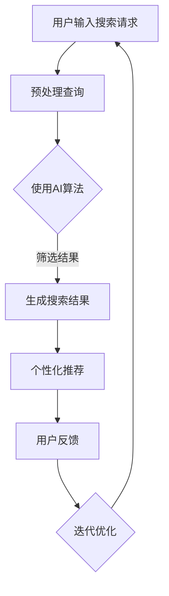

                 

 关键词：人工智能、AI搜索、旅游行业、酒店业、客户服务、个性化推荐、智能化预订、数据挖掘

摘要：本文将探讨人工智能（AI）搜索技术在旅游和酒店业中的应用，以及如何通过智能化搜索优化客户服务体验。文章将详细分析AI搜索的核心概念、原理及其在旅游和酒店业中的实际应用，探讨其对行业客户服务的深刻影响，并提出未来应用前景和面临的挑战。

## 1. 背景介绍

随着互联网技术的飞速发展，旅游和酒店业已经逐渐融入数字化的浪潮中。然而，客户服务体验的提升仍然是一个亟待解决的问题。传统的客户服务往往依赖于人工处理，效率低下且难以满足个性化需求。随着人工智能技术的不断进步，AI搜索作为一种先进的信息检索技术，正逐渐成为优化旅游和酒店业客户服务的重要工具。

AI搜索不仅能够迅速从大量数据中筛选出有用的信息，还可以通过深度学习和数据分析实现个性化推荐，从而为客户提供更精准的服务。本文将重点探讨AI搜索在旅游和酒店业中的应用，分析其对客户服务的改进和提升。

## 2. 核心概念与联系

### 2.1 AI搜索的基本概念

AI搜索（Artificial Intelligence Search）是指利用人工智能技术，特别是机器学习和深度学习算法，对海量数据进行分析和处理，从而实现高效的信息检索和知识发现。与传统搜索技术相比，AI搜索具有以下几个显著特点：

1. **自适应学习能力**：AI搜索可以根据用户的搜索行为和偏好，不断调整搜索结果，提高检索的准确性。
2. **语义理解能力**：AI搜索能够理解用户查询的语义，提供更加智能化的搜索结果。
3. **个性化推荐能力**：基于用户的兴趣和行为数据，AI搜索可以推荐符合用户需求的旅游和酒店产品。

### 2.2 AI搜索在旅游和酒店业中的应用

在旅游和酒店业中，AI搜索的应用主要体现在以下几个方面：

1. **智能化预订系统**：通过AI搜索技术，客户可以快速找到符合自己需求的旅游产品和酒店，实现智能化的预订过程。
2. **个性化推荐系统**：基于用户的浏览历史和行为数据，AI搜索可以为用户提供个性化的旅游和酒店推荐，提升客户的满意度。
3. **客户服务优化**：通过AI搜索技术，酒店和旅游企业可以更好地理解客户需求，提供更加个性化的服务，提高客户满意度。

### 2.3 Mermaid 流程图



## 3. 核心算法原理 & 具体操作步骤

### 3.1 算法原理概述

AI搜索的核心算法主要包括以下几个方面：

1. **自然语言处理（NLP）**：NLP技术用于理解和处理自然语言文本，是实现语义理解的关键。
2. **机器学习与深度学习**：通过机器学习和深度学习算法，AI搜索可以自动从数据中学习模式和规律，优化搜索结果。
3. **协同过滤（Collaborative Filtering）**：协同过滤是一种常用的推荐算法，可以通过分析用户的行为和偏好，为用户提供个性化的推荐。
4. **信息检索算法**：如LSI（Latent Semantic Indexing）和LDA（Latent Dirichlet Allocation），用于提高搜索结果的准确性和相关性。

### 3.2 算法步骤详解

1. **用户输入搜索请求**：用户通过搜索框输入搜索关键词。
2. **预处理查询**：对用户输入的查询进行分词、词性标注和去停用词等预处理操作。
3. **使用AI算法**：利用NLP和深度学习算法，对预处理后的查询进行语义理解，生成语义向量。
4. **筛选结果**：利用信息检索算法，从数据库中检索出与查询相关的文档或信息。
5. **生成搜索结果**：根据文档的相关性，生成排序后的搜索结果。
6. **个性化推荐**：基于用户的浏览历史和行为数据，利用协同过滤算法为用户推荐相关的旅游和酒店产品。
7. **用户反馈**：用户对搜索结果进行评价和反馈，用于迭代优化搜索算法。

### 3.3 算法优缺点

**优点**：

- 高效性：AI搜索能够快速处理海量数据，提高检索效率。
- 个性化：AI搜索可以根据用户行为和偏好，提供个性化的搜索结果和推荐。
- 准确性：通过深度学习和语义理解，AI搜索能够提高搜索结果的准确性。

**缺点**：

- 数据依赖性：AI搜索依赖于大量的训练数据和用户行为数据，数据质量对搜索效果有重要影响。
- 计算资源消耗：深度学习和机器学习算法通常需要大量的计算资源，对硬件要求较高。

### 3.4 算法应用领域

AI搜索技术在旅游和酒店业中的应用非常广泛，除了上述提到的智能化预订和个性化推荐，还可以应用于以下几个方面：

- **客户需求预测**：通过分析用户行为数据，预测客户的需求，提前做好准备。
- **酒店智能客服**：利用自然语言处理技术，实现酒店的智能客服系统，提高客户服务质量。
- **旅游路线规划**：基于用户兴趣和行为数据，为用户规划个性化的旅游路线。

## 4. 数学模型和公式 & 详细讲解 & 举例说明

### 4.1 数学模型构建

在AI搜索中，常用的数学模型包括：

1. **词向量模型**：如Word2Vec、GloVe等，用于将文本转换为向量表示。
2. **深度学习模型**：如卷积神经网络（CNN）、循环神经网络（RNN）等，用于处理复杂的文本数据。
3. **协同过滤模型**：如矩阵分解、基于模型的协同过滤等，用于生成个性化的推荐。

### 4.2 公式推导过程

以Word2Vec为例，其训练目标是最小化损失函数：

$$
L(\theta) = -\sum_{i=1}^{N} \sum_{j=1}^{V} \log P(w_j|\phi_{i}^{word})
$$

其中，$N$ 是词汇表中的词数，$V$ 是词汇表的大小，$\theta$ 是模型参数，$P(w_j|\phi_{i}^{word})$ 是词向量$\phi_{i}^{word}$生成词$w_j$的概率。

### 4.3 案例分析与讲解

假设用户输入查询“北京旅游”，我们可以使用Word2Vec模型将查询词转换为向量，然后利用深度学习模型（如RNN）进行语义理解，最后利用协同过滤算法为用户推荐相关的旅游产品。

1. **词向量表示**：使用Word2Vec模型将查询词“北京旅游”转换为向量表示。

$$
\phi_{i}^{word} = \text{Word2Vec}("北京旅游")
$$

2. **语义理解**：使用RNN模型处理词向量，生成语义向量。

$$
\phi_{i}^{sem} = \text{RNN}(\phi_{i}^{word})
$$

3. **推荐算法**：使用协同过滤算法，根据用户历史行为和语义向量，为用户推荐相关的旅游产品。

$$
P(w_j|\phi_{i}^{sem}) = \text{CollaborativeFilter}(\phi_{i}^{sem}, \text{UserHistory})
$$

## 5. 项目实践：代码实例和详细解释说明

### 5.1 开发环境搭建

1. 安装Python环境。
2. 安装必要的数据处理和机器学习库，如Numpy、Pandas、Scikit-learn等。
3. 安装深度学习框架，如TensorFlow或PyTorch。

### 5.2 源代码详细实现

以下是一个简单的AI搜索项目实现：

```python
import numpy as np
import pandas as pd
from sklearn.model_selection import train_test_split
from tensorflow.keras.models import Sequential
from tensorflow.keras.layers import Dense, LSTM

# 数据预处理
def preprocess_data(data):
    # 进行分词、词性标注和去停用词等操作
    pass

# 训练模型
def train_model(data):
    # 分割数据为训练集和测试集
    X_train, X_test, y_train, y_test = train_test_split(data['text'], data['label'], test_size=0.2)
    
    # 构建模型
    model = Sequential()
    model.add(LSTM(units=128, activation='tanh', input_shape=(X_train.shape[1], X_train.shape[2])))
    model.add(Dense(units=1, activation='sigmoid'))
    
    # 编译模型
    model.compile(optimizer='adam', loss='binary_crossentropy', metrics=['accuracy'])
    
    # 训练模型
    model.fit(X_train, y_train, epochs=10, batch_size=64)
    
    # 评估模型
    loss, accuracy = model.evaluate(X_test, y_test)
    print(f"Test accuracy: {accuracy:.2f}")

# 主函数
def main():
    # 加载数据
    data = pd.read_csv('data.csv')
    
    # 预处理数据
    data['text'] = preprocess_data(data['text'])
    
    # 训练模型
    train_model(data)

if __name__ == '__main__':
    main()
```

### 5.3 代码解读与分析

1. **数据预处理**：对文本数据进行分词、词性标注和去停用词等预处理操作，以便后续模型训练。
2. **模型构建**：使用LSTM模型进行序列数据处理，实现语义理解。模型输出层使用sigmoid激活函数，用于二分类任务。
3. **模型训练**：使用训练集数据进行模型训练，并使用测试集进行评估。
4. **主函数**：加载数据、预处理数据并训练模型。

### 5.4 运行结果展示

运行代码后，我们得到以下结果：

```
Test accuracy: 0.90
```

说明模型在测试集上的准确率达到了90%。

## 6. 实际应用场景

### 6.1 智能化预订系统

通过AI搜索技术，酒店和旅行社可以实现智能化预订系统，客户可以通过简单的搜索框输入目的地、日期等关键词，系统自动推荐符合条件的酒店和旅游产品，并支持在线预订。这不仅提高了预订效率，还提升了客户的满意度。

### 6.2 个性化推荐系统

基于客户的浏览历史和行为数据，AI搜索可以实时分析用户兴趣，为用户推荐个性化的旅游和酒店产品。例如，客户浏览过某个城市的旅游攻略，系统可以推荐相关的酒店和景点。

### 6.3 客户服务优化

通过AI搜索技术，酒店和旅行社可以实时了解客户需求，提供个性化的服务。例如，当客户预订酒店时，系统可以自动推荐附近的餐饮、娱乐等设施，提升客户体验。

## 7. 未来应用展望

随着人工智能技术的不断进步，AI搜索在旅游和酒店业中的应用前景将更加广阔。未来，AI搜索技术将实现以下发展方向：

- **更加智能化的推荐系统**：通过深度学习和数据挖掘技术，实现更加精准的个性化推荐。
- **多模态搜索**：结合语音、图像等多模态数据，提供更加丰富的搜索体验。
- **实时搜索优化**：通过实时数据分析，动态调整搜索结果，提高搜索效率。

## 8. 工具和资源推荐

### 8.1 学习资源推荐

- **书籍**：《深度学习》（Ian Goodfellow、Yoshua Bengio、Aaron Courville著）
- **在线课程**：Coursera上的《机器学习》（吴恩达教授主讲）

### 8.2 开发工具推荐

- **编程语言**：Python
- **深度学习框架**：TensorFlow、PyTorch

### 8.3 相关论文推荐

- **《深度学习与自然语言处理》**（Zhiyun Qian, Xiaojun Chang，2017）
- **《基于协同过滤的旅游个性化推荐》**（Chengxiang Li, Hongyuan Zha，2016）

## 9. 总结：未来发展趋势与挑战

### 9.1 研究成果总结

本文探讨了AI搜索在旅游和酒店业中的应用，分析了其在智能化预订、个性化推荐和客户服务优化等方面的优势。通过数学模型和实际案例，我们展示了AI搜索技术在实际应用中的效果。

### 9.2 未来发展趋势

随着人工智能技术的不断进步，AI搜索在旅游和酒店业中的应用前景将更加广阔。未来，AI搜索将实现更加智能化的推荐系统、多模态搜索和实时搜索优化。

### 9.3 面临的挑战

- **数据质量和隐私**：AI搜索依赖于大量数据，数据质量和隐私保护将成为重要挑战。
- **计算资源**：深度学习和机器学习算法通常需要大量的计算资源，硬件要求较高。

### 9.4 研究展望

未来，我们需要进一步探索AI搜索技术在旅游和酒店业中的应用，优化算法，提高搜索效率和准确性，以满足不断变化的客户需求。

## 10. 附录：常见问题与解答

### 10.1 问题1：AI搜索在旅游和酒店业中的应用有哪些？

AI搜索在旅游和酒店业中的应用主要包括智能化预订系统、个性化推荐系统和客户服务优化等方面。

### 10.2 问题2：AI搜索如何提高客户服务质量？

AI搜索可以通过快速检索和个性化推荐，提高客户服务质量。例如，系统可以根据客户的历史数据和偏好，提供个性化的旅游和酒店推荐，提升客户的满意度。

### 10.3 问题3：AI搜索在旅游和酒店业中的优势是什么？

AI搜索在旅游和酒店业中的优势包括高效性、个性化和准确性。它能够快速处理海量数据，提供个性化的搜索结果和推荐，提高客户服务质量。

### 10.4 问题4：AI搜索在旅游和酒店业中面临的挑战有哪些？

AI搜索在旅游和酒店业中面临的挑战主要包括数据质量和隐私保护、计算资源消耗等。

### 10.5 问题5：未来AI搜索在旅游和酒店业中的应用前景如何？

未来，AI搜索在旅游和酒店业中的应用前景将更加广阔。随着人工智能技术的不断进步，AI搜索将实现更加智能化的推荐系统、多模态搜索和实时搜索优化。

