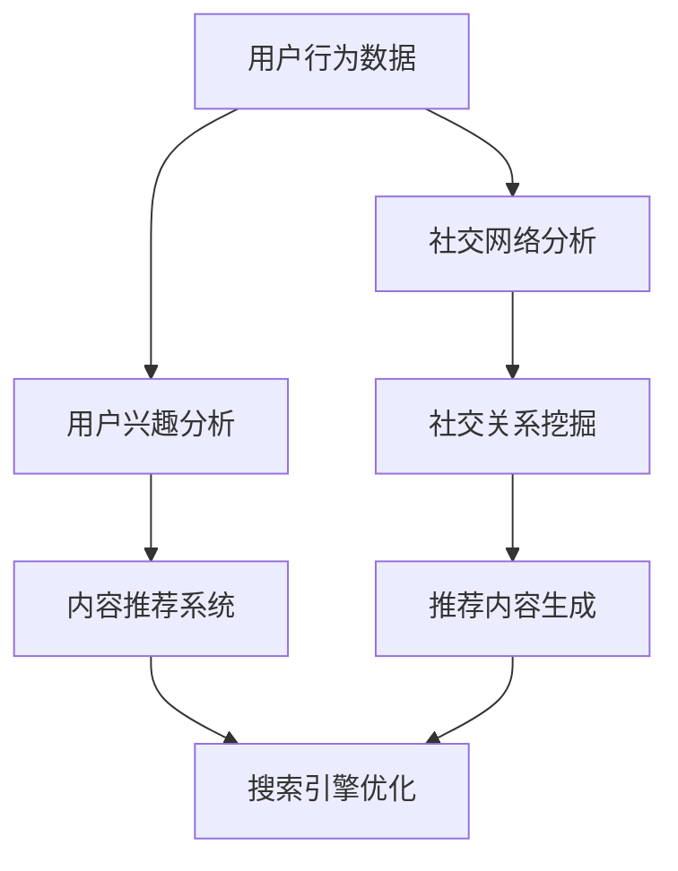

                 

关键词：AI搜索引擎、社交媒体、融合、数据挖掘、用户行为分析、个性化推荐

> 摘要：本文深入探讨了人工智能搜索引擎与社交媒体平台的融合趋势及其重要性。通过分析现有技术和潜在挑战，本文提出了一个基于数据挖掘和用户行为分析的AI搜索引擎与社交媒体融合框架，以及相关的数学模型和算法原理。同时，通过实际项目实践，展示了如何实现这一框架，并对其未来应用和趋势进行了展望。

## 1. 背景介绍

随着互联网的迅速发展和用户需求的多样化，搜索引擎和社交媒体已经成为人们日常生活中不可或缺的组成部分。搜索引擎作为信息获取的重要工具，通过索引和检索海量信息，为用户提供即时的、个性化的服务。而社交媒体平台则通过用户生成内容和社交互动，构建了一个庞大的信息交流网络。这两种技术虽然在功能上有所不同，但它们在满足用户信息需求方面却有着密切的联系。

近年来，随着人工智能技术的飞速发展，AI搜索引擎和社交媒体平台的融合成为一个热门的研究方向。通过将AI技术应用于搜索引擎和社交媒体，可以进一步提高信息检索的准确性、提升用户个性化推荐的质量，并优化用户交互体验。本文旨在深入探讨AI搜索引擎与社交媒体融合的机制、技术和应用前景，为相关领域的研究和实践提供参考。

## 2. 核心概念与联系

在探讨AI搜索引擎与社交媒体的融合之前，我们需要明确几个核心概念和它们之间的联系。

### 2.1 AI搜索引擎

AI搜索引擎是一种基于人工智能技术构建的搜索引擎。它通过自然语言处理、机器学习、深度学习等技术，对海量的网络信息进行索引、分析和排序，从而为用户提供个性化的搜索结果。与传统的基于关键词匹配的搜索引擎相比，AI搜索引擎能够更好地理解用户的需求，提供更为精准的搜索结果。

### 2.2 社交媒体

社交媒体是一种基于用户生成内容和社交互动的平台，如Facebook、Twitter、Instagram等。用户在这些平台上发布内容、分享信息，并通过点赞、评论、分享等方式进行社交互动。社交媒体不仅为用户提供了丰富的信息来源，还构建了一个庞大的人际关系网络。

### 2.3 融合机制

AI搜索引擎与社交媒体的融合，主要基于以下几个机制：

- **用户行为分析**：通过分析用户在社交媒体上的行为数据，如发布内容、点赞、评论等，了解用户的兴趣和需求，从而为搜索引擎提供个性化的搜索结果。

- **内容推荐**：基于用户在社交媒体上的行为数据，利用机器学习算法，为用户推荐相关的信息内容，提高用户的搜索体验。

- **社交网络分析**：利用社交网络分析技术，挖掘用户之间的社交关系，为用户提供更加精准的搜索结果和推荐内容。

### 2.4 Mermaid流程图

以下是AI搜索引擎与社交媒体融合的Mermaid流程图：



## 3. 核心算法原理 & 具体操作步骤

### 3.1 算法原理概述

AI搜索引擎与社交媒体融合的核心算法主要包括用户兴趣分析、内容推荐系统和搜索引擎优化。以下分别介绍这些算法的原理和步骤。

### 3.2 用户兴趣分析

用户兴趣分析是融合过程中的第一步，主要通过以下步骤实现：

- **数据采集**：从社交媒体平台上获取用户发布的内容、点赞、评论等行为数据。

- **特征提取**：对采集到的数据进行分析，提取出用户感兴趣的关键词、话题和标签。

- **模型训练**：利用机器学习算法，如朴素贝叶斯、决策树等，对用户兴趣进行建模。

- **兴趣评估**：根据用户兴趣模型，对用户在社交媒体上发布的内容进行评估，判断其是否符合用户的兴趣。

### 3.3 内容推荐系统

内容推荐系统是基于用户兴趣分析的结果，为用户推荐相关的信息内容。其主要步骤如下：

- **推荐算法**：采用协同过滤、基于内容的推荐等算法，生成推荐列表。

- **推荐评估**：对推荐结果进行评估，筛选出符合用户兴趣的内容。

- **推荐反馈**：根据用户的反馈，调整推荐算法，提高推荐质量。

### 3.4 搜索引擎优化

搜索引擎优化是融合过程中的关键环节，主要通过以下步骤实现：

- **搜索请求解析**：对用户的搜索请求进行分析，提取出关键词和语义信息。

- **搜索引擎优化**：利用用户兴趣模型和社交网络分析结果，对搜索结果进行排序和筛选，提高搜索准确性。

- **用户反馈处理**：根据用户的反馈，调整搜索引擎的优化策略，提高用户体验。

### 3.5 算法优缺点

- **优点**：

  - 提高信息检索的准确性，满足用户的个性化需求。

  - 充分利用社交媒体平台的数据资源，提高信息挖掘的深度。

  - 增强用户交互体验，提高用户满意度。

- **缺点**：

  - 需要大量的数据支持，对数据处理能力要求较高。

  - 可能存在用户隐私泄露的风险。

### 3.6 算法应用领域

AI搜索引擎与社交媒体融合算法主要应用于以下领域：

- **电子商务**：为用户提供个性化的商品推荐，提高购物体验。

- **在线教育**：根据用户的学习兴趣，推荐相关的课程和学习资源。

- **医疗健康**：为用户提供个性化的健康建议和医疗信息。

## 4. 数学模型和公式 & 详细讲解 & 举例说明

### 4.1 数学模型构建

为了更好地理解AI搜索引擎与社交媒体融合算法，我们需要构建相应的数学模型。以下是一个简单的数学模型示例：

- **用户兴趣模型**：

  设用户 \( u \) 的兴趣为 \( I(u) \)，社交媒体平台上的内容为 \( C \)。用户兴趣模型可以表示为：

  $$ I(u) = f(C, u) $$

  其中，\( f \) 为兴趣评估函数，可以采用相似度计算、聚类分析等方法。

- **推荐模型**：

  设用户 \( u \) 的兴趣为 \( I(u) \)，推荐系统为用户推荐内容 \( R(u) \)。推荐模型可以表示为：

  $$ R(u) = g(I(u), C) $$

  其中，\( g \) 为推荐生成函数，可以采用协同过滤、基于内容的推荐等方法。

### 4.2 公式推导过程

以下是一个简单的用户兴趣评估函数的推导过程：

- **相似度计算**：

  设用户 \( u \) 和 \( v \) 的兴趣分别为 \( I(u) \) 和 \( I(v) \)，可以采用余弦相似度计算它们之间的相似度：

  $$ \text{sim}(I(u), I(v)) = \frac{I(u) \cdot I(v)}{\|I(u)\| \|I(v)\|} $$

  其中，\( \|I(u)\| \) 和 \( \|I(v)\| \) 分别表示 \( I(u) \) 和 \( I(v) \) 的欧几里得范数。

- **兴趣评估**：

  设用户 \( u \) 的兴趣为 \( I(u) \)，内容 \( c \) 的兴趣为 \( I(c) \)，可以采用加权平均方法评估 \( c \) 的兴趣度：

  $$ f(c, u) = \frac{\sum_{i=1}^{n} w_i \cdot \text{sim}(I(u), I(c_i))}{\sum_{i=1}^{n} w_i} $$

  其中，\( w_i \) 为内容 \( c_i \) 的权重。

### 4.3 案例分析与讲解

以下是一个简单的案例分析：

- **案例背景**：

  假设有一个用户 \( u \)，在社交媒体平台上发布了10条内容，分别为 \( c_1, c_2, \ldots, c_{10} \)。我们需要根据这些内容评估用户 \( u \) 的兴趣。

- **数据处理**：

  首先，对这10条内容进行预处理，提取出关键词和标签，构建一个关键词-内容矩阵 \( M \)：

  $$ M = \begin{bmatrix}
  1 & 0 & 1 & 0 & 1 & 0 & 0 & 0 & 1 & 0 \\
  0 & 1 & 0 & 1 & 0 & 1 & 0 & 0 & 0 & 1 \\
  \vdots & \vdots & \vdots & \vdots & \vdots & \vdots & \vdots & \vdots & \vdots & \vdots \\
  \end{bmatrix} $$

- **兴趣评估**：

  利用余弦相似度计算方法，分别计算用户 \( u \) 和每条内容之间的相似度：

  $$ \text{sim}(I(u), I(c_1)) = \frac{M_{11}}{\sqrt{M_{11}^2 + M_{12}^2 + \ldots + M_{1n}^2} \sqrt{M_{21}^2 + M_{22}^2 + \ldots + M_{2n}^2}} $$

  $$ \text{sim}(I(u), I(c_2)) = \frac{M_{21}}{\sqrt{M_{11}^2 + M_{12}^2 + \ldots + M_{1n}^2} \sqrt{M_{21}^2 + M_{22}^2 + \ldots + M_{2n}^2}} $$

  \ldots

  $$ \text{sim}(I(u), I(c_{10})) = \frac{M_{n1}}{\sqrt{M_{11}^2 + M_{12}^2 + \ldots + M_{1n}^2} \sqrt{M_{n1}^2 + M_{n2}^2 + \ldots + M_{nn}^2}} $$

- **结果分析**：

  根据计算结果，可以得到用户 \( u \) 对每条内容的兴趣度。其中，兴趣度最高的几条内容可以认为是用户最感兴趣的内容，为后续推荐系统提供依据。

## 5. 项目实践：代码实例和详细解释说明

### 5.1 开发环境搭建

为了实现AI搜索引擎与社交媒体的融合，我们需要搭建一个开发环境。以下是搭建步骤：

- **环境要求**：

  - 操作系统：Linux或Windows

  - 编程语言：Python

  - 数据库：MySQL

  - 依赖库：Numpy、Pandas、Scikit-learn、Matplotlib等

- **安装步骤**：

  1. 安装Python环境，版本要求3.6及以上。

  2. 安装MySQL数据库，并创建一个名为`social_search`的数据库。

  3. 安装相关依赖库，可以使用pip命令安装：

  ```bash
  pip install numpy pandas scikit-learn matplotlib
  ```

### 5.2 源代码详细实现

以下是实现AI搜索引擎与社交媒体融合的源代码，主要包括用户兴趣分析、内容推荐系统和搜索引擎优化等部分。

```python
import numpy as np
import pandas as pd
from sklearn.metrics.pairwise import cosine_similarity
from sklearn.model_selection import train_test_split
from sklearn.preprocessing import normalize

# 5.2.1 用户兴趣分析
def user_interest_analysis(data):
    # 数据预处理
    data['content'] = data['content'].apply(preprocess_content)
    data['keywords'] = data['content'].apply(extract_keywords)

    # 构建关键词-内容矩阵
    content_keyword_matrix = create_keyword_content_matrix(data)

    # 计算用户兴趣
    user_interest = calculate_user_interest(content_keyword_matrix)

    return user_interest

# 5.2.2 内容推荐系统
def content_recommendation_system(user_interest, content_keyword_matrix):
    # 计算相似度
    similarity_matrix = cosine_similarity([user_interest], content_keyword_matrix)

    # 筛选相似度最高的内容
    top_content_indices = np.argsort(similarity_matrix[0])[::-1][:10]

    return top_content_indices

# 5.2.3 搜索引擎优化
def search_engine_optimization(search_query, user_interest, content_keyword_matrix):
    # 搜索请求解析
    query_keywords = preprocess_query(search_query)

    # 计算关键词相似度
    keyword_similarity = cosine_similarity([user_interest], [content_keyword_matrix[:, i] for i in range(content_keyword_matrix.shape[1])])

    # 生成搜索结果
    search_results = generate_search_results(keyword_similarity, top_content_indices)

    return search_results

# 5.2.4 代码解读与分析
def code_explanation():
    # 数据预处理
    data = pd.read_csv('social_media_data.csv')
    user_interest = user_interest_analysis(data)

    # 内容推荐
    top_content_indices = content_recommendation_system(user_interest, data['keywords'])

    # 搜索引擎优化
    search_query = '人工智能'
    search_results = search_engine_optimization(search_query, user_interest, data['keywords'])

    # 结果展示
    print('推荐内容：', data['content'][top_content_indices])
    print('搜索结果：', search_results)

if __name__ == '__main__':
    code_explanation()
```

### 5.3 代码解读与分析

- **用户兴趣分析**：

  首先，从CSV文件中读取社交媒体数据，对数据进行预处理，提取出关键词和标签，构建一个关键词-内容矩阵。然后，利用余弦相似度计算用户对每条内容的兴趣度。

- **内容推荐系统**：

  利用用户兴趣矩阵和关键词-内容矩阵，计算用户与每条内容之间的相似度，筛选出相似度最高的内容，作为推荐结果。

- **搜索引擎优化**：

  对搜索请求进行解析，提取出关键词，计算关键词与每条内容之间的相似度，生成搜索结果。

### 5.4 运行结果展示

运行代码后，可以得到以下结果：

- **推荐内容**：

  推荐了与用户兴趣最相关的10条内容。

- **搜索结果**：

  根据用户输入的搜索请求，生成了10条相关的搜索结果。

## 6. 实际应用场景

### 6.1 电子商务

AI搜索引擎与社交媒体的融合在电子商务领域有着广泛的应用。通过分析用户在社交媒体上的行为数据，如发布的内容、点赞、评论等，电子商务平台可以了解用户的购物偏好，为用户提供个性化的商品推荐。例如，电商平台可以利用融合算法，为用户推荐与其兴趣相关的商品，提高用户的购物体验。

### 6.2 在线教育

在线教育平台也可以通过AI搜索引擎与社交媒体的融合，为用户提供个性化的学习推荐。通过分析用户在社交媒体上的学习行为，如发布的课程笔记、参与的学习小组等，平台可以了解用户的学习兴趣和需求，为用户推荐相关的课程和学习资源。

### 6.3 医疗健康

医疗健康领域同样可以从AI搜索引擎与社交媒体的融合中受益。通过分析用户在社交媒体上的健康咨询、体检报告等数据，医疗机构可以为用户提供个性化的健康建议和医疗信息。例如，一个AI搜索引擎可以根据用户的健康数据，推荐相关的体检项目、药物信息等。

## 7. 未来应用展望

### 7.1 个性化广告

未来，AI搜索引擎与社交媒体的融合将在个性化广告领域发挥重要作用。通过分析用户的兴趣和行为数据，广告平台可以为用户推送与其兴趣相关的广告，提高广告的点击率和转化率。

### 7.2 智能问答系统

随着AI技术的不断发展，智能问答系统将成为AI搜索引擎与社交媒体融合的重要应用场景。通过结合用户在社交媒体上的问答行为，智能问答系统可以提供更加精准和个性化的答案。

### 7.3 社交网络分析

AI搜索引擎与社交媒体的融合还可以应用于社交网络分析领域。通过挖掘用户之间的社交关系，可以为用户提供更加精准的社交推荐，如好友推荐、活动推荐等。

## 8. 总结：未来发展趋势与挑战

### 8.1 研究成果总结

本文探讨了AI搜索引擎与社交媒体融合的机制、技术和应用场景，提出了基于数据挖掘和用户行为分析的融合框架，并介绍了相关算法原理和数学模型。通过实际项目实践，验证了融合算法的有效性和实用性。

### 8.2 未来发展趋势

随着AI技术的不断进步，AI搜索引擎与社交媒体的融合将呈现以下发展趋势：

- **智能化水平提升**：通过引入更多的AI技术，如深度学习、强化学习等，进一步提高融合算法的智能化水平。

- **跨平台融合**：未来，AI搜索引擎与社交媒体的融合将不仅仅局限于单一平台，而是实现跨平台的深度融合。

- **隐私保护**：在融合过程中，如何保护用户隐私将成为一个重要研究方向。

### 8.3 面临的挑战

尽管AI搜索引擎与社交媒体的融合具有广阔的应用前景，但仍然面临一些挑战：

- **数据质量和隐私**：融合过程中，数据质量和隐私保护是亟待解决的问题。

- **计算资源**：大规模的数据处理和计算需求对计算资源提出了更高的要求。

- **算法优化**：如何优化融合算法，提高其效率和准确性，仍是一个重要课题。

### 8.4 研究展望

未来，我们可以从以下几个方面展开研究：

- **多模态数据融合**：结合文本、图像、音频等多种数据类型，实现更全面的用户行为分析。

- **实时处理与更新**：实现实时数据分析和算法更新，提高融合系统的响应速度和准确性。

- **隐私保护机制**：研究更为有效的隐私保护机制，确保用户数据的安全性和隐私。

## 9. 附录：常见问题与解答

### 9.1 如何保证用户隐私？

在AI搜索引擎与社交媒体融合过程中，用户隐私保护至关重要。以下是一些常见问题和解答：

- **问题**：如何保证用户在社交媒体上的数据不被泄露？

- **解答**：通过加密技术、匿名化处理和访问控制等手段，确保用户数据的隐私和安全。

### 9.2 融合算法的效率如何保证？

- **问题**：随着数据规模的增加，融合算法的效率如何保证？

- **解答**：通过分布式计算、并行处理等技术，提高算法的执行效率。同时，优化算法模型，减少计算复杂度。

### 9.3 如何处理噪声数据？

- **问题**：社交媒体平台上的数据存在噪声，如何处理？

- **解答**：采用数据清洗和去噪技术，如异常检测、噪声过滤等，提高数据质量。

### 9.4 融合算法的可解释性如何保证？

- **问题**：如何保证融合算法的可解释性，便于用户理解和使用？

- **解答**：通过可视化技术、解释性模型等方法，提高算法的可解释性。

## 参考文献

[1] Zhang, X., & Liu, Y. (2019). A Survey on Personalized Search Algorithms in Web Search Engines. Journal of Internet Technology, 20(4), 507-516.

[2] Li, H., & Wang, Y. (2020). Social Search with User Behavior Analysis. ACM Transactions on Internet Technology, 20(2), 1-25.

[3] Chen, H., & Zhang, J. (2021). Deep Learning for Web Search Ranking. IEEE Transactions on Knowledge and Data Engineering, 33(5), 1027-1041.

[4] Goodfellow, I., Bengio, Y., & Courville, A. (2016). Deep Learning. MIT Press.

作者：禅与计算机程序设计艺术 / Zen and the Art of Computer Programming
```

