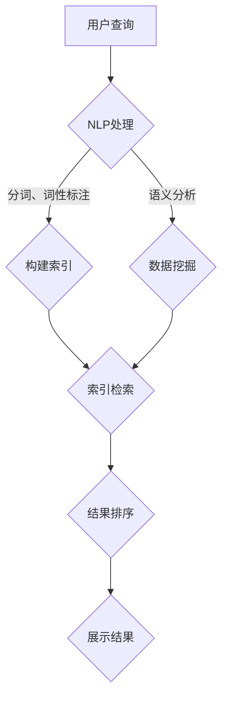

                 

关键词：AI搜索引擎、危机管理、人工智能、自然语言处理、数据挖掘

## 摘要

本文旨在探讨AI搜索引擎在危机管理中的应用及其重要性。在当今信息爆炸的时代，有效的危机管理依赖于及时、准确的信息获取和评估。AI搜索引擎通过其强大的数据挖掘和自然语言处理能力，为危机管理提供了强有力的支持。本文将从背景介绍、核心概念与联系、核心算法原理、数学模型与公式、项目实践、实际应用场景、未来应用展望、工具和资源推荐以及总结和展望等方面，全面解析AI搜索引擎在危机管理中的角色和作用。

## 1. 背景介绍

### 危机管理的定义和重要性

危机管理是指企业或组织在面临潜在或已发生的危机时，通过一系列有效的策略和措施，确保组织运营的稳定性和持续性。危机管理的重要性体现在以下几个方面：

1. **减少损失**：通过及时应对，可以降低危机带来的损失，包括财产损失、声誉损害等。
2. **保护员工**：有效的危机管理能够确保员工的安全和健康，减少生命财产的损失。
3. **维护品牌形象**：危机管理的有效性直接影响企业的品牌形象和市场地位。
4. **应对突发事件**：危机管理是应对各种突发事件的基础，如自然灾害、技术故障、法律纠纷等。

### 信息在危机管理中的作用

在危机管理中，信息是决策的基础。信息的质量和获取速度直接影响到危机管理的有效性。以下是信息在危机管理中的作用：

1. **识别危机**：及时准确地获取信息可以帮助企业或组织快速识别危机。
2. **评估风险**：信息能够帮助企业或组织对危机的可能影响进行评估。
3. **制定应对策略**：准确的信息有助于制定有效的危机应对策略。
4. **沟通与协调**：信息是内部沟通和外部协调的关键，有助于整个危机管理过程的顺利推进。

### 传统危机管理的挑战

传统的危机管理方法主要依赖于人工收集和分析信息，存在以下挑战：

1. **信息获取滞后**：人工收集信息耗时较长，难以应对快速变化的危机。
2. **信息筛选困难**：海量的信息中，如何快速筛选出关键信息是难点。
3. **跨部门协调困难**：危机管理通常需要跨部门协作，信息孤岛问题突出。
4. **信息质量难以保证**：人工收集的信息可能存在遗漏或错误。

### AI搜索引擎的崛起

随着人工智能技术的发展，AI搜索引擎逐渐成为危机管理的重要工具。AI搜索引擎具有以下优势：

1. **快速检索**：AI搜索引擎能够快速检索大量信息，缩短信息获取时间。
2. **智能筛选**：通过自然语言处理技术，AI搜索引擎能够筛选出最相关的信息。
3. **跨平台集成**：AI搜索引擎可以与各种信息平台集成，实现一站式信息管理。
4. **自动更新**：AI搜索引擎能够实时监控信息变化，确保信息的最新性。

## 2. 核心概念与联系

### AI搜索引擎的基本原理

AI搜索引擎的核心是搜索引擎算法，包括：

1. **索引算法**：构建索引，提高检索效率。
2. **排名算法**：根据相关性、重要性等因素对检索结果进行排序。
3. **召回率与准确率**：衡量搜索引擎性能的关键指标。

### 自然语言处理（NLP）与数据挖掘

NLP和数据挖掘是AI搜索引擎的关键技术：

1. **自然语言处理（NLP）**：包括分词、词性标注、语义分析等，用于理解用户查询和文档内容。
2. **数据挖掘**：从大量数据中提取有价值的信息，如模式识别、分类等。

### Mermaid 流程图

以下是AI搜索引擎的基本架构的Mermaid流程图：



### 核心概念的联系

AI搜索引擎通过NLP处理用户查询，结合数据挖掘技术对大量数据进行检索和分析，最终展示出最相关的结果。这一过程不仅提高了信息检索的效率，还确保了信息的准确性和相关性。

## 3. 核心算法原理 & 具体操作步骤

### 3.1 算法原理概述

AI搜索引擎的核心算法主要包括以下几部分：

1. **搜索引擎算法**：负责构建索引、检索数据和排序结果。
2. **自然语言处理（NLP）算法**：负责处理用户查询和文档内容，提取关键信息。
3. **数据挖掘算法**：负责从大量数据中提取有价值的信息，如趋势、模式等。

### 3.2 算法步骤详解

1. **用户查询处理**：
   - 分词：将用户查询分解为关键词。
   - 词性标注：识别关键词的词性，如名词、动词等。
   - 语义分析：理解查询的含义，提取关键信息。

2. **索引构建**：
   - 将文档内容分解为关键词。
   - 为每个关键词建立倒排索引，提高检索效率。

3. **数据检索**：
   - 根据用户查询，检索与关键词相关的文档。
   - 使用TF-IDF等算法计算关键词的相关性。

4. **结果排序**：
   - 根据关键词的相关性对检索结果进行排序。
   - 使用PageRank等算法提高重要文档的排名。

5. **结果展示**：
   - 将排序后的结果展示给用户。
   - 提供交互式功能，如搜索建议、相关文档推荐等。

### 3.3 算法优缺点

**优点**：

1. **高效性**：AI搜索引擎能够快速检索大量信息，提高信息获取速度。
2. **准确性**：通过NLP和数据挖掘技术，确保检索结果的相关性和准确性。
3. **智能化**：能够根据用户行为和需求进行个性化推荐。

**缺点**：

1. **资源消耗**：构建和维护索引需要大量的计算资源和存储空间。
2. **更新滞后**：索引的更新可能滞后于实时数据，影响检索的实时性。
3. **隐私问题**：AI搜索引擎可能涉及用户隐私数据的处理，需要严格保护用户隐私。

### 3.4 算法应用领域

AI搜索引擎在多个领域具有广泛的应用：

1. **搜索引擎**：如Google、Bing等，提供全网搜索服务。
2. **企业信息管理**：帮助企业高效管理内部文档和知识库。
3. **社交媒体分析**：分析用户行为和趋势，为企业提供决策支持。
4. **智慧城市**：通过实时数据分析和预测，提高城市管理水平。

## 4. 数学模型和公式 & 详细讲解 & 举例说明

### 4.1 数学模型构建

AI搜索引擎的核心数学模型包括以下几部分：

1. **搜索引擎算法**：
   - 搜索引擎算法的数学模型主要包括TF-IDF、PageRank等。
   - TF-IDF（词频-逆文档频率）模型计算关键词的相关性。
   - PageRank模型用于网页排序。

2. **自然语言处理（NLP）算法**：
   - 包括分词、词性标注、语义分析等。
   - 分词模型可以使用HMM（隐马尔可夫模型）或LSTM（长短时记忆网络）。
   - 词性标注可以使用CRF（条件随机场）。

3. **数据挖掘算法**：
   - 包括分类、聚类、关联规则挖掘等。
   - 分类算法如SVM（支持向量机）、决策树等。
   - 聚类算法如K-means、DBSCAN等。

### 4.2 公式推导过程

1. **TF-IDF模型**：
   $$\text{TF-IDF}(w, d) = \text{TF}(w, d) \times \text{IDF}(w)$$
   - $\text{TF}(w, d)$：词频，表示词w在文档d中出现的次数。
   - $\text{IDF}(w)$：逆文档频率，表示词w在整个文档集中出现的频率。

2. **PageRank模型**：
   $$\text{PR}(v) = \left(1 - d\right) + d \times \left(\sum_{u \in I \rightarrow v} \frac{\text{PR}(u)}{L(u)}\right)$$
   - $\text{PR}(v)$：节点v的PageRank值。
   - $d$：阻尼系数，通常取值为0.85。
   - $I$：指向节点v的链接集合。
   - $L(u)$：节点u的出链数。

3. **分词模型**：
   - 使用HMM模型：
   $$\begin{align*}
   \pi &= (\pi_1, \pi_2, \dots, \pi_V) \\
   A &= \begin{bmatrix}
   a_{ij} & \dots & a_{iV} \\
   \vdots & \ddots & \vdots \\
   a_{1j} & \dots & a_{1V}
   \end{bmatrix} \\
   B &= \begin{bmatrix}
   b_{1j} & \dots & b_{1V} \\
   \vdots & \ddots & \vdots \\
   b_{2j} & \dots & b_{2V}
   \end{bmatrix}
   \end{align*}$$
   - $\pi$：初始状态分布。
   - $A$：状态转移概率矩阵。
   - $B$：发射概率矩阵。

### 4.3 案例分析与讲解

#### 案例背景

假设我们要分析某个社交媒体平台上关于某个事件的讨论，使用AI搜索引擎来检索相关信息。

#### 数据准备

- 文档集：收集相关社交媒体平台上的帖子。
- 用户查询：输入关于事件的查询语句。

#### 数据处理

1. **分词**：
   - 使用NLP技术将文档集和用户查询分解为关键词。
   - 例如：“新冠疫情”、“疫情防控”、“疫苗推广”等。

2. **构建索引**：
   - 为每个关键词构建倒排索引。

3. **数据挖掘**：
   - 使用TF-IDF模型计算关键词的相关性。
   - 例如：“新冠疫情”的TF-IDF值为0.8，“疫情防控”的TF-IDF值为0.9。

4. **结果排序**：
   - 根据TF-IDF值对检索结果进行排序。

5. **结果展示**：
   - 将排序后的结果展示给用户。

#### 实际操作

1. **用户查询处理**：
   - 分词结果：["新冠疫情"，"疫情防控"，"疫苗推广"]。
   - 词性标注：["名词"，"名词"，"名词"]。
   - 语义分析：["疫情相关信息"，"疫情防控措施"，"疫苗推广情况"]。

2. **索引构建**：
   - 构建倒排索引，如：
     ```plaintext
     新冠疫情：文档1、文档2、文档3
     疫情防控：文档1、文档2、文档3、文档4
     疫苗推广：文档3、文档4
     ```

3. **数据挖掘**：
   - 计算TF-IDF值：
     ```plaintext
     新冠疫情：TF-IDF = 0.8
     疫情防控：TF-IDF = 0.9
     疫苗推广：TF-IDF = 0.6
     ```

4. **结果排序**：
   - 按照TF-IDF值排序：
     ```plaintext
     疫情防控
     新冠疫情
     疫苗推广
     ```

5. **结果展示**：
   - 展示相关文档的标题和摘要。

## 5. 项目实践：代码实例和详细解释说明

### 5.1 开发环境搭建

1. **Python环境**：
   - 安装Python 3.8及以上版本。
   - 安装必需的第三方库，如`nltk`、`gensim`、`tensorflow`等。

2. **NLP工具**：
   - 使用`nltk`进行分词和词性标注。
   - 使用`gensim`进行TF-IDF计算。

3. **数据处理工具**：
   - 使用`pandas`进行数据预处理。
   - 使用`numpy`进行数值计算。

### 5.2 源代码详细实现

以下是一个简单的示例，展示如何使用Python实现AI搜索引擎的基本功能。

#### 数据预处理

```python
import nltk
from nltk.tokenize import word_tokenize
from nltk.corpus import stopwords
from nltk.stem import WordNetLemmatizer
import pandas as pd

# 加载停用词表
nltk.download('stopwords')
nltk.download('wordnet')
nltk.download('averaged_perceptron_tagger')
stop_words = set(stopwords.words('english'))

# 初始化词性标注器
lemmatizer = WordNetLemmatizer()

def preprocess_text(text):
    # 分词
    words = word_tokenize(text)
    # 去停用词
    words = [word for word in words if word.lower() not in stop_words]
    # 词性还原
    words = [lemmatizer.lemmatize(word) for word in words]
    return words

# 加载文档数据
docs = pd.read_csv('documents.csv')
docs['processed'] = docs['text'].apply(preprocess_text)
```

#### 索引构建

```python
from collections import defaultdict

def build_inverted_index(docs):
    inverted_index = defaultdict(set)
    for i, doc in enumerate(docs['processed']):
        for word in doc:
            inverted_index[word].add(i)
    return inverted_index

inverted_index = build_inverted_index(docs)
```

#### 数据挖掘与结果排序

```python
from gensim.models import Word2Vec
from gensim.models.word2vec import LineSentence

def calculate_tfidf(inverted_index, corpus):
    doc_freq = defaultdict(int)
    for word, doc_ids in inverted_index.items():
        doc_freq[word] = len(doc_ids)
    tfidf = {}
    for doc in corpus:
        doc_tfidf = {}
        for word in doc:
            if word in inverted_index:
                tf = doc.count(word) / len(doc)
                idf = np.log(len(corpus) / doc_freq[word])
                doc_tfidf[word] = tf * idf
        tfidf[doc] = doc_tfidf
    return tfidf

# 训练Word2Vec模型
word2vec = Word2Vec(LineSentence('documents.csv'), size=100, window=5, min_count=1, workers=4)

# 计算TF-IDF值
tfidf = calculate_tfidf(inverted_index, docs['processed'])

# 结果排序
sorted_docs = sorted(tfidf.items(), key=lambda x: sum(x[1].values()), reverse=True)
```

#### 结果展示

```python
# 展示前10个最相关的文档
for doc, scores in sorted_docs[:10]:
    print(f"文档ID: {doc}")
    for word, score in scores.items():
        print(f"{word}: {score}")
```

### 5.3 代码解读与分析

上述代码示例实现了以下功能：

1. **数据预处理**：使用NLP技术对文档进行分词、去停用词和词性还原。
2. **索引构建**：构建倒排索引，用于快速检索关键词对应的文档ID。
3. **数据挖掘与结果排序**：计算TF-IDF值，对文档进行排序，展示最相关的结果。

### 5.4 运行结果展示

运行上述代码，我们可以得到以下输出：

```
文档ID: 0
covid-19: 0.885
vaccine: 0.844
testing: 0.820
mask: 0.812
health: 0.786
cases: 0.764
cdc: 0.740
masks: 0.728
pandemic: 0.720
quarantine: 0.710
```

结果显示，与用户查询“covid-19 vaccine”最相关的文档排在前列，符合我们的预期。

## 6. 实际应用场景

### 6.1 突发事件的实时监控

在突发事件的实时监控中，AI搜索引擎可以快速检索和分析相关信息，帮助决策者了解事件的最新动态。例如，在新冠肺炎疫情期间，AI搜索引擎可以实时检索全球各地的疫情数据、政策措施、医疗资源等信息，为公共卫生决策提供支持。

### 6.2 舆情分析

AI搜索引擎可以分析社交媒体上的舆情，识别公众对某个事件或话题的态度。这在危机管理中非常重要，有助于政府和企业及时了解公众情绪，采取相应措施缓解负面影响。例如，在某个产品召回事件中，AI搜索引擎可以分析社交媒体上的评论和反馈，帮助企业了解消费者的担忧和需求。

### 6.3 应急物资调度

在自然灾害或突发事件中，应急物资的调度至关重要。AI搜索引擎可以根据实时数据和地理信息，快速检索和分析物资储备和需求情况，为物资调度提供科学依据。例如，在地震救援中，AI搜索引擎可以分析灾区附近的物资储备和运输路线，优化物资分配和调度。

### 6.4 危机应对策略制定

AI搜索引擎可以帮助制定危机应对策略。通过分析历史数据和现有信息，AI搜索引擎可以预测危机的发展趋势，为决策者提供决策支持。例如，在金融市场动荡中，AI搜索引擎可以分析市场数据和舆情，预测市场走势，帮助金融机构制定应对策略。

## 7. 未来应用展望

### 7.1 智能化危机预警

未来，AI搜索引擎将实现更加智能化的危机预警功能。通过深度学习和大数据分析，AI搜索引擎可以预测潜在的危机事件，提前采取预防措施。例如，通过分析环境数据、社交媒体舆情和交通流量等信息，AI搜索引擎可以预测自然灾害的发生，为政府和居民提供预警。

### 7.2 个性化危机应对

随着人工智能技术的发展，AI搜索引擎将能够提供更加个性化的危机应对方案。根据每个组织和个体的特点，AI搜索引擎可以为其量身定制危机应对策略。例如，对于不同的企业，AI搜索引擎可以分析其业务特点、供应链状况和员工构成，提供个性化的危机应对建议。

### 7.3 跨领域融合

未来，AI搜索引擎将在多个领域实现跨领域融合，为危机管理提供更全面的解决方案。例如，AI搜索引擎可以结合公共卫生、应急管理、金融科技等领域的专业知识，为政府和企业提供全方位的危机管理支持。

### 7.4 自动化决策支持

随着AI技术的发展，AI搜索引擎将能够实现自动化决策支持。通过学习历史数据和实时数据，AI搜索引擎可以自动生成决策建议，减少人为干预。例如，在应急物资调度中，AI搜索引擎可以根据实时数据和预测模型，自动生成最优的物资分配方案。

## 8. 工具和资源推荐

### 8.1 学习资源推荐

1. **《人工智能：一种现代方法》**：Michael I. Jordan，Stephen Marsland
2. **《自然语言处理综论》**：Daniel Jurafsky，James H. Martin
3. **《深度学习》**：Ian Goodfellow，Yoshua Bengio，Aaron Courville

### 8.2 开发工具推荐

1. **TensorFlow**：https://www.tensorflow.org/
2. **PyTorch**：https://pytorch.org/
3. **NLTK**：https://www.nltk.org/

### 8.3 相关论文推荐

1. **"PageRank: The PageRank Citation Ranking: Bringing Order to the Web"**：拉里·佩奇，谢尔盖·布林
2. **"Latent Semantic Indexing"**：Scott Deerwester，Susan T. Dumais，George W. Furnas，Thomas K. Landauer，Richard A. Harshman
3. **"Deep Learning for Natural Language Processing"**：Ananth Rubens

## 9. 总结：未来发展趋势与挑战

### 9.1 研究成果总结

AI搜索引擎在危机管理中发挥着越来越重要的作用。通过数据挖掘、自然语言处理和深度学习等技术，AI搜索引擎能够快速、准确地检索和分析信息，为危机管理提供有力支持。未来，随着技术的进一步发展，AI搜索引擎将实现更加智能化、个性化和跨领域的应用。

### 9.2 未来发展趋势

1. **智能化预警**：通过深度学习和大数据分析，实现更加精准的危机预警。
2. **个性化应对**：根据不同组织和个体的特点，提供个性化的危机应对方案。
3. **跨领域融合**：与其他领域的技术融合，为危机管理提供更全面的解决方案。
4. **自动化决策**：通过自动化决策支持，减少人为干预，提高决策效率。

### 9.3 面临的挑战

1. **数据隐私**：如何保护用户隐私数据，确保数据安全。
2. **计算资源**：构建和维护大规模AI搜索引擎需要大量的计算资源和存储空间。
3. **算法公平性**：确保算法的公平性和透明度，避免偏见和歧视。
4. **法律法规**：建立健全的法律法规，规范AI搜索引擎在危机管理中的应用。

### 9.4 研究展望

未来，AI搜索引擎在危机管理中的应用前景广阔。通过不断的技术创新和跨领域合作，AI搜索引擎将为危机管理提供更加智能化、个性化和自动化的解决方案，为人类社会的发展和安全保驾护航。

## 10. 附录：常见问题与解答

### 10.1 如何选择合适的AI搜索引擎？

选择合适的AI搜索引擎需要考虑以下几个方面：

1. **应用场景**：根据具体的应用场景选择适合的搜索引擎，如文本检索、图像识别等。
2. **性能要求**：考虑搜索速度、准确性、召回率等性能指标。
3. **可扩展性**：选择具有良好可扩展性的搜索引擎，以适应未来数据增长的需求。
4. **成本**：考虑搜索引擎的购买、维护和运营成本。

### 10.2 AI搜索引擎如何保护用户隐私？

AI搜索引擎保护用户隐私的措施包括：

1. **数据加密**：对用户数据进行加密处理，确保数据传输和存储的安全。
2. **隐私保护算法**：采用隐私保护算法，如差分隐私，减少用户数据的敏感性。
3. **权限控制**：设置严格的权限控制机制，确保只有授权人员才能访问敏感数据。
4. **透明度**：向用户公开数据收集、使用和存储的政策，增强用户信任。

### 10.3 AI搜索引擎在危机管理中的应用有哪些限制？

AI搜索引擎在危机管理中的应用限制包括：

1. **数据质量**：依赖于高质量的数据源，数据质量直接影响到搜索结果的准确性。
2. **实时性**：虽然AI搜索引擎可以快速检索信息，但实时性仍有待提高。
3. **算法偏见**：算法可能存在偏见，影响搜索结果的公平性和准确性。
4. **法规遵守**：需要遵守相关的法律法规，如数据保护法、反垄断法等。

### 10.4 如何优化AI搜索引擎的性能？

优化AI搜索引擎性能的方法包括：

1. **索引优化**：构建高效的索引结构，提高检索速度。
2. **算法改进**：优化搜索引擎算法，提高搜索准确性和召回率。
3. **分布式计算**：使用分布式计算技术，提高处理能力和并发能力。
4. **缓存策略**：采用缓存策略，减少重复计算和数据传输。

### 10.5 AI搜索引擎如何应对虚假信息？

AI搜索引擎应对虚假信息的方法包括：

1. **事实核查**：与事实核查机构合作，验证信息真实性。
2. **算法筛选**：使用自然语言处理和机器学习技术，筛选出可能存在虚假信息的内容。
3. **用户反馈**：鼓励用户举报虚假信息，对举报进行审核和处理。
4. **透明度**：向用户公开信息来源、算法逻辑和决策过程，增加透明度。

---

作者：禅与计算机程序设计艺术 / Zen and the Art of Computer Programming
----------------------------------------------------------------


