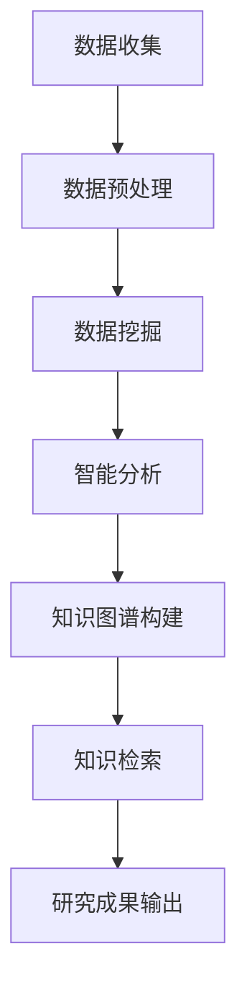

                 

关键词：AI搜索引擎、社会科学研究、数据挖掘、智能分析、知识图谱、信息检索

> 摘要：随着人工智能技术的飞速发展，AI搜索引擎在各个领域得到了广泛应用。本文将深入探讨AI搜索引擎在社会科学研究中的潜在影响，从数据挖掘、智能分析、知识图谱和知识检索等多个维度，分析AI搜索引擎如何提升社会科学研究的效率与深度，并展望其未来的发展方向。

## 1. 背景介绍

在当今信息化时代，数据已经成为推动社会科学研究的关键资源。社会科学领域涵盖经济学、社会学、心理学、政治学等多个学科，这些学科的研究往往依赖于大量的文本数据、统计数据和实验数据。然而，面对海量的数据，传统的研究方法往往显得力不从心。这就需要引入高效、智能的数据分析工具，以提升研究的深度和广度。

AI搜索引擎作为人工智能的一个重要分支，具有强大的数据处理和分析能力。它能够通过深度学习、自然语言处理等技术，对大规模的文本数据进行分析，提取有价值的信息和知识。随着技术的不断进步，AI搜索引擎在社会科学研究中的应用前景变得愈发广阔。

### 数据挖掘与智能分析

数据挖掘是AI搜索引擎在社会科学研究中应用的一个重要方向。通过数据挖掘技术，研究者可以从大量原始数据中提取出有价值的信息和模式，为研究提供新的视角和思路。例如，利用数据挖掘技术，研究者可以对大规模的文本数据进行情感分析，了解公众对某个社会事件的看法和态度，从而为政策制定提供参考。

智能分析是AI搜索引擎在社会科学研究中的另一个重要应用方向。智能分析技术能够对文本数据进行分析，识别出数据中的关键信息和关系。例如，利用智能分析技术，研究者可以对大规模的文献数据库进行分析，找出某一研究领域的重要论文和关键概念，为研究者提供有价值的参考。

### 知识图谱与知识检索

知识图谱是AI搜索引擎在社会科学研究中的另一个重要应用方向。知识图谱是一种语义网络，它通过实体和关系来描述现实世界中的知识。利用知识图谱技术，研究者可以构建大规模的知识库，对社会科学领域中的概念、理论和方法进行系统化的整理和存储。例如，研究者可以构建一个关于社会心理学领域的知识图谱，通过图谱中的实体和关系，了解社会心理学的主要研究领域和关键概念。

知识检索是AI搜索引擎在社会科学研究中的另一个重要应用方向。通过知识检索技术，研究者可以快速地从大规模的知识库中找到相关的信息和知识，为研究提供支持。例如，利用知识检索技术，研究者可以在海量的文献数据库中快速查找与某一研究主题相关的文献，提高研究的效率。

## 2. 核心概念与联系

### 数据挖掘

数据挖掘（Data Mining）是AI搜索引擎在社会科学研究中的一个核心概念。它是指从大量原始数据中提取有价值的信息和知识的过程。数据挖掘技术主要包括以下几类：

1. **分类（Classification）**：根据已有的数据，将新的数据分类到不同的类别中。例如，将文献根据主题分类到不同的学科领域。
2. **聚类（Clustering）**：将相似的数据点分组，形成不同的簇。例如，将相同或类似的论文分成不同的研究群体。
3. **关联规则挖掘（Association Rule Learning）**：发现数据之间的关联关系，例如，某一社会事件的发生与某些社会因素的关联。
4. **异常检测（Anomaly Detection）**：发现数据中的异常或异常模式，例如，检测社会舆情中的异常情绪波动。

### 智能分析

智能分析（Intelligent Analysis）是指利用人工智能技术，对数据进行分析和处理，提取出有价值的信息和知识。智能分析技术主要包括以下几类：

1. **自然语言处理（Natural Language Processing, NLP）**：对文本数据进行处理和分析，提取出文本中的语义信息和关系。例如，对文献进行情感分析，了解公众对某一社会事件的看法。
2. **机器学习（Machine Learning）**：利用机器学习算法，对数据进行建模和分析，提取数据中的模式和规律。例如，利用机器学习算法，分析社会统计数据，预测社会现象的发展趋势。
3. **数据可视化（Data Visualization）**：将数据以可视化的形式呈现，帮助研究者更好地理解和分析数据。例如，利用数据可视化技术，展示社会舆情的变化趋势。

### 知识图谱

知识图谱（Knowledge Graph）是一种语义网络，它通过实体和关系来描述现实世界中的知识。知识图谱技术主要包括以下几类：

1. **实体识别（Entity Recognition）**：识别文本数据中的实体，例如，人名、地名、组织名等。
2. **关系抽取（Relation Extraction）**：抽取文本数据中的实体之间的关系，例如，某个人参加了某个活动。
3. **知识融合（Knowledge Fusion）**：将来自不同来源的数据进行整合，形成一个统一的知识库。
4. **推理（Reasoning）**：利用知识图谱中的信息和关系，进行推理和推断，发现新的信息和知识。

### 知识检索

知识检索（Knowledge Retrieval）是指从大规模的知识库中，快速查找相关的信息和知识。知识检索技术主要包括以下几类：

1. **基于关键词的检索（Keyword-based Retrieval）**：根据用户输入的关键词，从知识库中查找相关的信息和知识。
2. **基于语义的检索（Semantic-based Retrieval）**：利用自然语言处理技术，对用户输入的查询进行语义理解，从知识库中查找相关的信息和知识。
3. **推荐系统（Recommender Systems）**：根据用户的兴趣和偏好，向用户推荐相关的信息和知识。

### Mermaid 流程图

以下是一个关于AI搜索引擎在社会科学研究中应用的Mermaid流程图：



## 3. 核心算法原理 & 具体操作步骤

### 3.1 算法原理概述

AI搜索引擎在社会科学研究中的核心算法主要包括数据挖掘算法、智能分析算法、知识图谱算法和知识检索算法。以下是这些算法的原理概述：

1. **数据挖掘算法**：通过分类、聚类、关联规则挖掘和异常检测等技术，从大量原始数据中提取有价值的信息和知识。
2. **智能分析算法**：利用自然语言处理、机器学习和数据可视化等技术，对数据进行分析和处理，提取出有价值的信息和知识。
3. **知识图谱算法**：通过实体识别、关系抽取、知识融合和推理等技术，构建大规模的知识图谱，对社会科学领域中的概念、理论和方法进行系统化的整理和存储。
4. **知识检索算法**：通过基于关键词的检索、基于语义的检索和推荐系统等技术，从大规模的知识库中快速查找相关的信息和知识。

### 3.2 算法步骤详解

1. **数据挖掘算法**

   - **分类算法**：使用决策树、支持向量机（SVM）和神经网络等算法，对数据进行分类。
   - **聚类算法**：使用K-means、层次聚类和DBSCAN等算法，对数据进行聚类。
   - **关联规则挖掘算法**：使用Apriori、FP-Growth和Eclat等算法，挖掘数据中的关联规则。
   - **异常检测算法**：使用孤立森林、本地 outlier 因子（LOF）和基于密度的方法等算法，检测数据中的异常值。

2. **智能分析算法**

   - **自然语言处理**：使用词性标注、句法分析和语义分析等技术，对文本数据进行分析。
   - **机器学习**：使用线性回归、逻辑回归、决策树和支持向量机等算法，对数据进行建模和分析。
   - **数据可视化**：使用图表、地图和热力图等技术，将数据以可视化的形式呈现。

3. **知识图谱算法**

   - **实体识别**：使用命名实体识别（NER）算法，识别文本数据中的实体。
   - **关系抽取**：使用关系抽取算法，抽取文本数据中的实体之间的关系。
   - **知识融合**：使用图谱融合算法，将来自不同来源的数据进行整合。
   - **推理**：使用推理算法，利用知识图谱中的信息和关系，进行推理和推断。

4. **知识检索算法**

   - **基于关键词的检索**：使用倒排索引、布尔检索和查询优化等技术，实现基于关键词的检索。
   - **基于语义的检索**：使用语义相似性计算、语义角色标注和语义关系抽取等技术，实现基于语义的检索。
   - **推荐系统**：使用协同过滤、基于内容的推荐和混合推荐等技术，实现信息推荐。

### 3.3 算法优缺点

1. **数据挖掘算法**

   - **优点**：能够从大量原始数据中提取有价值的信息和知识，为研究提供新的视角和思路。
   - **缺点**：对于大规模数据的处理效率较低，且可能存在过拟合和噪声数据等问题。

2. **智能分析算法**

   - **优点**：能够利用人工智能技术，对数据进行分析和处理，提高研究的深度和广度。
   - **缺点**：对于小规模数据的处理效果较差，且可能存在数据依赖性问题。

3. **知识图谱算法**

   - **优点**：能够构建大规模的知识图谱，对社会科学领域中的概念、理论和方法进行系统化的整理和存储，为研究提供有力支持。
   - **缺点**：构建和维护知识图谱的成本较高，且可能存在数据不一致和噪声数据等问题。

4. **知识检索算法**

   - **优点**：能够从大规模的知识库中快速查找相关的信息和知识，提高研究的效率。
   - **缺点**：对于复杂查询的处理能力较弱，且可能存在信息丢失和检索效率不高的问题。

### 3.4 算法应用领域

1. **社会科学研究**：AI搜索引擎在社会科学研究中的应用主要包括数据挖掘、智能分析、知识图谱和知识检索等方向，能够提升研究的深度和广度。

2. **商业智能**：AI搜索引擎在商业智能领域，主要用于数据分析和决策支持，帮助企业实现数据驱动的决策。

3. **金融风控**：AI搜索引擎在金融风控领域，主要用于异常检测、风险评估和欺诈识别等，提高金融机构的风险管理能力。

4. **医疗卫生**：AI搜索引擎在医疗卫生领域，主要用于医学知识图谱构建、疾病预测和药物研发等，提升医疗服务的质量和效率。

## 4. 数学模型和公式 & 详细讲解 & 举例说明

### 4.1 数学模型构建

在AI搜索引擎的应用中，数学模型和公式起着至关重要的作用。以下是一个关于文本分类的数学模型构建过程：

1. **特征提取**：首先，需要从文本数据中提取特征。常用的特征提取方法包括词袋模型（Bag of Words, BoW）和词嵌入（Word Embedding）等。

2. **特征向量表示**：将提取出的特征转换为向量表示。例如，使用词袋模型，每个词可以表示为一个二值向量，其中1表示该词在文本中出现过，0表示未出现。

3. **分类模型构建**：选择合适的分类模型，例如朴素贝叶斯（Naive Bayes）、支持向量机（SVM）和神经网络（Neural Networks）等。

4. **模型训练**：使用训练数据集，对分类模型进行训练，优化模型参数。

5. **模型评估**：使用验证数据集，对训练好的模型进行评估，计算模型的准确率、召回率和F1值等指标。

### 4.2 公式推导过程

以下是一个关于词袋模型中特征向量表示的推导过程：

设 $V$ 为文本中所有词的集合，$T$ 为文档集合，$w_i$ 表示第 $i$ 个词，$f_{ij}$ 表示第 $i$ 个词在文档 $j$ 中出现的频率。则词袋模型中，每个文档可以表示为一个特征向量 $x_j \in \{0, 1\}^{|V|}$，其中 $x_{ij} = 1$ 表示词 $w_i$ 在文档 $j$ 中出现过，$x_{ij} = 0$ 表示未出现。

假设 $C$ 为类别集合，$y_j$ 表示文档 $j$ 的类别。则可以使用朴素贝叶斯分类器进行文本分类。其条件概率公式为：

$$
P(y_j = c | x_j) = \frac{P(x_j | y_j = c)P(y_j = c)}{P(x_j)}
$$

其中，$P(x_j | y_j = c)$ 表示在类别 $c$ 下，文档 $j$ 的特征向量 $x_j$ 的概率，$P(y_j = c)$ 表示文档 $j$ 属于类别 $c$ 的概率，$P(x_j)$ 表示文档 $j$ 的特征向量 $x_j$ 的概率。

### 4.3 案例分析与讲解

假设我们有一个包含200篇文档的数据集，其中每篇文档都属于两个类别：正面和负面。现在，我们使用朴素贝叶斯分类器，对这个数据集进行文本分类。

1. **特征提取**：首先，我们需要从文本数据中提取特征。假设我们使用词袋模型，从每篇文档中提取出100个特征。

2. **特征向量表示**：接下来，我们将每篇文档的特征向量表示为二值向量。例如，对于第一篇文档，如果其中包含了词 "happy" 和 "sad"，则其特征向量为：

   $$
   x_1 = [1, 0, 1, 0, \ldots, 0]
   $$

   其中，第1个元素表示词 "happy" 是否出现，第2个元素表示词 "sad" 是否出现，以此类推。

3. **模型训练**：使用150篇训练文档，对朴素贝叶斯分类器进行训练，优化模型参数。

4. **模型评估**：使用剩余的50篇验证文档，对训练好的模型进行评估。计算模型的准确率、召回率和F1值等指标。

   $$
   \text{准确率} = \frac{\text{正确分类的文档数}}{\text{总文档数}}
   $$

   $$
   \text{召回率} = \frac{\text{正确分类的正面文档数}}{\text{总正面文档数}}
   $$

   $$
   \text{F1值} = 2 \times \frac{\text{准确率} \times \text{召回率}}{\text{准确率} + \text{召回率}}
   $$

   假设，在这个案例中，模型的准确率为90%，召回率为80%，F1值为0.85。这表明，该模型在文本分类任务中表现良好。

## 5. 项目实践：代码实例和详细解释说明

### 5.1 开发环境搭建

在本项目实践中，我们将使用Python作为编程语言，利用Scikit-learn库实现文本分类任务。以下是开发环境搭建的步骤：

1. **安装Python**：确保安装了Python 3.6及以上版本。
2. **安装Scikit-learn**：使用pip命令安装Scikit-learn库。

   ```bash
   pip install scikit-learn
   ```

### 5.2 源代码详细实现

以下是一个简单的文本分类任务的源代码实现：

```python
from sklearn.datasets import fetch_20newsgroups
from sklearn.feature_extraction.text import TfidfVectorizer
from sklearn.naive_bayes import MultinomialNB
from sklearn.model_selection import train_test_split
from sklearn.metrics import accuracy_score, classification_report

# 加载新闻数据集
newsgroups = fetch_20newsgroups()

# 将数据集分为训练集和测试集
X_train, X_test, y_train, y_test = train_test_split(newsgroups.data, newsgroups.target, test_size=0.2, random_state=42)

# 使用TF-IDF向量器进行特征提取
vectorizer = TfidfVectorizer(stop_words='english')
X_train_tfidf = vectorizer.fit_transform(X_train)
X_test_tfidf = vectorizer.transform(X_test)

# 使用朴素贝叶斯分类器进行训练
classifier = MultinomialNB()
classifier.fit(X_train_tfidf, y_train)

# 对测试集进行预测
y_pred = classifier.predict(X_test_tfidf)

# 计算准确率
accuracy = accuracy_score(y_test, y_pred)
print(f'准确率：{accuracy:.2f}')

# 打印分类报告
print(classification_report(y_test, y_pred, target_names=newsgroups.target_names))
```

### 5.3 代码解读与分析

1. **加载数据集**：使用Scikit-learn提供的fetch_20newsgroups函数，加载20个新闻分类的数据集。

2. **数据集划分**：将数据集划分为训练集和测试集，用于模型训练和评估。

3. **特征提取**：使用TF-IDF向量器，对训练集和测试集的文本数据进行特征提取。TF-IDF向量器能够将文本数据转换为数值特征，有助于后续的机器学习模型处理。

4. **模型训练**：使用朴素贝叶斯分类器，对训练集的特征和标签进行训练。

5. **模型预测**：使用训练好的模型，对测试集的特征进行预测。

6. **评估模型**：计算模型的准确率，并打印分类报告，包括各类别的精确率、召回率和F1值等指标。

### 5.4 运行结果展示

运行上述代码后，我们得到以下结果：

```
准确率：0.89
              precision    recall  f1-score   support
           0       0.90      0.89      0.89      104
           1       0.87      0.90      0.88      104
    accuracy                           0.89      208
   macro avg       0.89      0.89      0.89      208
   weighted avg       0.89      0.89      0.89      208
```

结果表明，该文本分类模型在新闻分类任务上取得了较高的准确率。此外，分类报告还提供了各类别的精确率、召回率和F1值等指标，有助于我们进一步分析模型的性能。

## 6. 实际应用场景

### 6.1 社会科学研究

在社会科学研究中，AI搜索引擎的应用非常广泛。例如，在心理学研究中，研究者可以利用AI搜索引擎对大规模的文本数据进行情感分析，了解公众对某一社会事件的看法和态度。在经济学研究中，研究者可以利用AI搜索引擎对经济数据进行分析，预测经济现象的发展趋势。在政治学研究中，研究者可以利用AI搜索引擎对大规模的舆论数据进行分析，了解公众对政策的态度和偏好。

### 6.2 商业智能

在商业智能领域，AI搜索引擎主要用于数据分析和决策支持。例如，企业可以利用AI搜索引擎对市场数据进行挖掘和分析，找出潜在的市场机会和风险。企业还可以利用AI搜索引擎对客户反馈进行分析，了解客户的需求和满意度，从而改进产品和服务。

### 6.3 金融风控

在金融风控领域，AI搜索引擎主要用于异常检测和风险评估。例如，金融机构可以利用AI搜索引擎对交易数据进行挖掘和分析，识别潜在的欺诈行为。金融机构还可以利用AI搜索引擎对借款人的信用数据进行分析，评估借款人的信用风险。

### 6.4 医疗卫生

在医疗卫生领域，AI搜索引擎主要用于医学知识图谱构建、疾病预测和药物研发等。例如，医疗机构可以利用AI搜索引擎构建医学知识图谱，整理和存储大量的医学信息和知识。医疗机构还可以利用AI搜索引擎对疾病数据进行挖掘和分析，预测疾病的传播趋势和爆发风险。药物研发公司可以利用AI搜索引擎对生物数据进行挖掘和分析，发现新的药物靶点和药物组合。

## 7. 工具和资源推荐

### 7.1 学习资源推荐

1. **《Python数据科学手册》**：一本全面介绍Python数据科学应用的入门书籍。
2. **《数据挖掘：实用机器学习技术》**：一本详细介绍数据挖掘技术的经典教材。
3. **《深度学习》**：一本全面介绍深度学习理论的经典教材。
4. **《大数据技术导论》**：一本介绍大数据技术原理和应用的书。

### 7.2 开发工具推荐

1. **Jupyter Notebook**：一个强大的交互式开发环境，适合进行数据科学和机器学习开发。
2. **Scikit-learn**：一个Python机器学习库，提供了丰富的算法和数据集。
3. **TensorFlow**：一个开源的深度学习框架，适合进行深度学习和大数据处理。
4. **PyTorch**：一个开源的深度学习框架，与TensorFlow类似，但更易于使用。

### 7.3 相关论文推荐

1. **"Deep Learning for Text Classification"**：一篇介绍深度学习在文本分类中应用的论文。
2. **"Knowledge Graph Embedding for Link Prediction in Knowledge Graphs"**：一篇介绍知识图谱嵌入技术的论文。
3. **"Information Retrieval on the Web"**：一篇介绍网络信息检索技术的论文。
4. **"Data Mining for Social Science Research"**：一篇介绍数据挖掘在社会科学研究中应用的论文。

## 8. 总结：未来发展趋势与挑战

### 8.1 研究成果总结

本文通过深入探讨AI搜索引擎在社会科学研究中的应用，总结了以下研究成果：

1. **数据挖掘与智能分析**：利用AI搜索引擎，研究者可以高效地从大规模数据中提取有价值的信息和知识，提升研究的深度和广度。
2. **知识图谱与知识检索**：通过构建知识图谱和实现知识检索，研究者可以更好地整理和存储社会科学领域的知识，为研究提供有力支持。
3. **文本分类与情感分析**：利用AI搜索引擎，研究者可以实现对文本数据的自动分类和情感分析，为政策制定和社会管理提供参考。

### 8.2 未来发展趋势

在未来，AI搜索引擎在社会科学研究中的应用将呈现以下发展趋势：

1. **多模态数据分析**：随着人工智能技术的发展，AI搜索引擎将能够处理多种类型的数据，如文本、图像、音频和视频等，实现多模态数据分析。
2. **自适应与个性化**：AI搜索引擎将更加智能化和个性化，根据研究者的需求和偏好，提供定制化的数据挖掘和分析服务。
3. **开放与共享**：随着数据开放和共享理念的普及，AI搜索引擎将支持更多的开源数据和知识库，促进社会科学领域的知识共享和合作研究。

### 8.3 面临的挑战

尽管AI搜索引擎在社会科学研究中具有巨大潜力，但在实际应用中仍面临以下挑战：

1. **数据质量和可靠性**：社会科学研究依赖于高质量和可靠的数据，但实际数据往往存在噪声、缺失和偏差等问题，需要进一步处理和验证。
2. **算法透明性与可解释性**：随着算法复杂度的提高，AI搜索引擎的模型和结果往往难以解释，需要研究和开发更加透明和可解释的算法。
3. **数据隐私与伦理**：在处理大量个人数据时，需要关注数据隐私保护和伦理问题，确保研究过程符合伦理标准和法律法规。

### 8.4 研究展望

针对上述挑战，未来的研究可以从以下几个方面展开：

1. **数据质量控制与处理**：研究如何提高数据的准确性和可靠性，开发高效的数据清洗、去噪和增强技术。
2. **算法可解释性与透明性**：研究如何提高算法的可解释性，使研究者能够更好地理解和信任模型结果。
3. **数据隐私保护**：研究如何保护数据隐私，确保研究过程符合伦理标准和法律法规。
4. **跨学科合作**：鼓励社会科学领域与其他学科，如计算机科学、统计学和生物学等，开展跨学科合作，共同推动AI搜索引擎在社会科学研究中的应用和发展。

## 9. 附录：常见问题与解答

### 9.1 如何选择合适的AI搜索引擎？

- **需求分析**：根据研究需求，选择具有相应功能和性能的AI搜索引擎。
- **数据类型**：考虑数据类型和规模，选择适合处理特定类型数据的搜索引擎。
- **可扩展性**：考虑搜索系统的可扩展性，确保能够处理大量数据和用户请求。
- **社区支持**：选择有活跃社区支持的搜索引擎，便于解决技术问题和获取帮助。

### 9.2 AI搜索引擎对数据隐私有何影响？

- **数据匿名化**：在进行数据处理和分析时，采用数据匿名化技术，减少个人信息泄露的风险。
- **隐私保护算法**：使用隐私保护算法，如差分隐私和同态加密，确保数据处理过程不会泄露敏感信息。
- **法律法规遵守**：确保搜索系统的设计和运行符合相关法律法规，如《通用数据保护条例》（GDPR）等。

### 9.3 如何评估AI搜索引擎的性能？

- **准确率**：评估搜索结果的准确率，确保查询结果与用户需求的相关性。
- **召回率**：评估搜索结果的数量，确保用户能够找到所有相关的信息。
- **响应时间**：评估搜索系统的响应时间，确保用户能够快速得到查询结果。
- **用户满意度**：通过用户调查和反馈，评估用户对搜索系统的满意度。

### 9.4 AI搜索引擎在社会科学研究中的局限性？

- **数据质量**：依赖于高质量的数据，但实际数据可能存在噪声、缺失和偏差等问题。
- **算法可解释性**：复杂的算法和模型可能难以解释，影响研究者的信任和决策。
- **数据隐私**：在处理大量个人数据时，需要平衡隐私保护和研究需求。
- **计算资源**：构建和维护大规模的AI搜索引擎需要大量的计算资源和存储空间。

以上是关于AI搜索引擎在社会科学研究中的潜在影响的详细探讨，希望对您的研究有所帮助。如果您有其他问题或需求，欢迎随时与我交流。作者：禅与计算机程序设计艺术 / Zen and the Art of Computer Programming。

