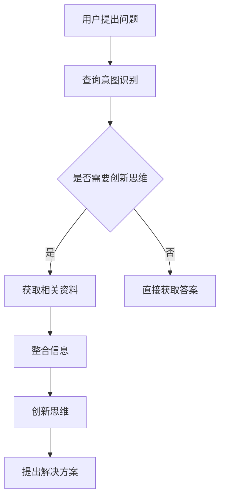

                 

关键词：AI搜索引擎、创新思维、技术进步、算法原理、应用场景

> 摘要：本文将探讨人工智能搜索引擎在促进创新思维方面的作用。通过对核心概念的介绍、算法原理的阐述、数学模型的讲解以及实际案例的分析，文章将揭示AI搜索引擎如何帮助用户快速获取信息、启发思维，进而推动创新过程。同时，文章还将展望AI搜索引擎在未来应用中的发展前景和面临的挑战。

## 1. 背景介绍

在当今数字化时代，信息获取的效率和准确性对个人的学习、工作和生活产生了深远的影响。传统信息检索系统如图书馆和搜索引擎在帮助用户获取信息方面发挥了重要作用。然而，随着互联网的快速发展和信息量的爆炸性增长，用户面临的信息过载问题愈发严重。如何从海量数据中快速、准确地找到所需信息，成为用户急需解决的问题。

与此同时，创新思维成为推动社会进步的重要驱动力。创新思维不仅涉及技术、科学领域的突破，还渗透到经济、文化、艺术等多个领域。在现代社会，具备创新思维的人才愈发受到重视。然而，如何培养和提高创新思维，仍是许多学者和实践者关注的热点问题。

在这样的背景下，人工智能（AI）搜索引擎应运而生。AI搜索引擎通过深度学习、自然语言处理等技术，能够理解用户的查询意图，提供更加精准、个性化的搜索结果。这种技术优势不仅解决了信息过载的问题，还为用户提供了丰富的信息资源，从而激发了创新思维的潜力。

本文旨在探讨AI搜索引擎如何促进创新思维的发展。通过分析核心概念、算法原理、数学模型以及实际案例，文章将深入揭示AI搜索引擎在信息获取、思维启发等方面的作用，并展望其未来的应用前景。

## 2. 核心概念与联系

### 2.1 AI搜索引擎概述

AI搜索引擎是一种基于人工智能技术的信息检索系统，其核心目标是理解用户的查询意图，并提供精准、个性化的搜索结果。与传统的搜索引擎相比，AI搜索引擎具有以下优势：

1. **理解查询意图**：AI搜索引擎通过自然语言处理技术，能够理解用户的自然语言查询，从而更准确地满足用户需求。
2. **个性化推荐**：基于用户的搜索历史、行为数据等，AI搜索引擎可以为用户提供个性化的搜索结果，提高用户的满意度。
3. **跨领域应用**：AI搜索引擎不仅适用于互联网搜索，还可应用于知识图谱、问答系统、智能客服等多个领域。

### 2.2 创新思维概述

创新思维是指人们在面对问题时，能够从不同角度、不同层面进行思考，提出新颖、独特的解决方案。创新思维包括以下几种类型：

1. **发散思维**：从多个角度思考问题，寻找多种可能的解决方案。
2. **收敛思维**：在多种解决方案中，选择最优的方案进行实施。
3. **逆向思维**：从传统思维方式中跳脱出来，从相反的角度思考问题。
4. **联想思维**：通过事物之间的关联，产生新的创意和想法。

### 2.3 AI搜索引擎与创新思维的联系

AI搜索引擎与创新思维之间存在着密切的联系。一方面，AI搜索引擎为用户提供了丰富的信息资源，有助于用户拓宽视野，激发创新思维。另一方面，创新思维的发展又可以推动AI搜索引擎技术的进步，使其更好地满足用户需求。

1. **信息获取**：AI搜索引擎能够帮助用户快速获取与问题相关的信息，为创新思维提供基础。
2. **思维启发**：AI搜索引擎提供的个性化搜索结果可以启发用户从不同角度思考问题，激发创新思维。
3. **知识整合**：AI搜索引擎可以帮助用户整合多种信息源，形成新的知识体系，促进创新思维的发展。

### 2.4 Mermaid流程图

以下是一个简单的Mermaid流程图，展示了AI搜索引擎如何促进创新思维的过程。



## 3. 核心算法原理 & 具体操作步骤

### 3.1 算法原理概述

AI搜索引擎的核心算法主要包括自然语言处理（NLP）和深度学习（DL）技术。以下是这些算法的原理概述：

1. **自然语言处理（NLP）**：
   - **词法分析**：将文本分解为单词、短语和句子。
   - **句法分析**：分析句子的结构，识别主语、谓语、宾语等成分。
   - **语义分析**：理解句子的含义，提取关键词和实体。

2. **深度学习（DL）**：
   - **神经网络**：通过多层神经网络对输入数据进行特征提取和分类。
   - **卷积神经网络（CNN）**：用于图像和语音处理。
   - **循环神经网络（RNN）**：用于序列数据处理，如文本和语音。

### 3.2 算法步骤详解

1. **查询意图识别**：
   - 用户输入查询语句后，AI搜索引擎对查询语句进行词法分析和句法分析，提取关键词和短语。
   - 通过语义分析，确定查询意图，如查找信息、获取答案、解决问题等。

2. **信息检索**：
   - 根据查询意图，搜索引擎在索引数据库中检索相关信息。
   - 利用深度学习模型对检索结果进行排序，提高相关性。

3. **个性化推荐**：
   - 基于用户的搜索历史和行为数据，为用户推荐相关的搜索结果。
   - 采用协同过滤、矩阵分解等方法，提高推荐的准确性。

4. **信息整合**：
   - 对检索到的信息进行整合，形成知识体系。
   - 利用知识图谱等技术，构建多维度的信息关系。

5. **创新思维启发**：
   - 根据用户的需求和检索结果，为用户提供启发性的问题和思考方向。
   - 利用人工智能技术，分析用户行为和思维模式，提供个性化的思维启发。

### 3.3 算法优缺点

**优点**：
- **高效率**：AI搜索引擎能够快速处理大量信息，提高用户信息获取的效率。
- **个性化**：根据用户需求和偏好，提供个性化的搜索结果和推荐。
- **跨领域**：AI搜索引擎可以应用于多个领域，如知识图谱、问答系统等。

**缺点**：
- **隐私问题**：AI搜索引擎需要收集和处理大量用户数据，存在隐私泄露的风险。
- **可靠性**：在处理复杂查询时，AI搜索引擎的可靠性可能受到挑战。

### 3.4 算法应用领域

AI搜索引擎在以下领域具有广泛的应用：

1. **互联网搜索**：为用户提供高效的搜索服务，解决信息过载问题。
2. **知识图谱**：构建知识体系，为用户提供丰富的知识资源。
3. **问答系统**：通过自然语言处理技术，实现智能问答，帮助用户解决问题。
4. **智能客服**：提供个性化的服务，提高客户满意度。
5. **教育领域**：为学生提供个性化学习资源，促进知识掌握和创新思维发展。

## 4. 数学模型和公式 & 详细讲解 & 举例说明

### 4.1 数学模型构建

AI搜索引擎的核心算法涉及到多个数学模型，以下分别介绍：

1. **词嵌入模型**：
   - **模型构建**：将单词映射为高维向量，通过训练使相似词在向量空间中靠近。
   - **公式表示**：
     $$ \text{Word}_i \rightarrow \text{Vec}(\text{Word}_i) $$
   - **应用举例**：通过词嵌入模型，可以识别用户查询中的关键词，提高搜索结果的准确性。

2. **卷积神经网络（CNN）**：
   - **模型构建**：通过卷积操作提取图像特征，并通过多层神经网络进行分类。
   - **公式表示**：
     $$ f(\text{image}) = \text{ReLU}(\sum_{k=1}^{K} \text{w}_k \star \text{g}(\text{image})) + b $$
   - **应用举例**：在图像识别任务中，CNN可以提取图像中的关键特征，提高识别的准确性。

3. **循环神经网络（RNN）**：
   - **模型构建**：通过循环结构处理序列数据，能够捕捉序列中的长期依赖关系。
   - **公式表示**：
     $$ \text{h}_{t} = \text{ReLU}(\text{W}_h \text{h}_{t-1} + \text{U}_x \text{x}_t + b_h) $$
   - **应用举例**：在语音识别任务中，RNN可以处理连续的语音信号，实现语音到文本的转换。

### 4.2 公式推导过程

以下以词嵌入模型为例，介绍其推导过程：

1. **假设**：
   - 设有 $N$ 个单词，每个单词表示为 $w_i$，其中 $i = 1, 2, ..., N$。
   - 设每个单词的嵌入维度为 $d$，则每个单词的向量表示为 $\text{Vec}(w_i) \in \mathbb{R}^{d}$。

2. **损失函数**：
   - 假设单词 $w_i$ 的标签为 $y_i$，则损失函数可以表示为：
     $$ L(\theta) = \frac{1}{N} \sum_{i=1}^{N} \log P(\text{Vec}(w_i) | y_i) $$

3. **模型参数**：
   - 假设词嵌入模型由参数 $\theta$ 决定，包括权重矩阵 $W$ 和偏置向量 $b$。

4. **概率计算**：
   - 假设单词 $w_i$ 在向量空间中的表示为 $\text{Vec}(w_i)$，则单词 $w_j$ 的条件概率可以表示为：
     $$ P(\text{Vec}(w_j) | \text{Vec}(w_i)) = \text{softmax}(\text{Vec}(w_j) \cdot \text{Vec}(w_i)) $$

5. **损失函数推导**：
   - 对损失函数进行推导，可以得到：
     $$ L(\theta) = -\frac{1}{N} \sum_{i=1}^{N} \sum_{j=1}^{N} y_{ij} \log \text{softmax}(\text{Vec}(w_j) \cdot \text{Vec}(w_i)) $$
   - 其中 $y_{ij}$ 为单词 $w_i$ 的标签，如果 $w_i = w_j$，则 $y_{ij} = 1$，否则 $y_{ij} = 0$。

### 4.3 案例分析与讲解

以下以一个简单的词嵌入模型为例，介绍其实际应用过程：

1. **数据准备**：
   - 设有一个包含 100 个单词的数据集，每个单词的词频依次为：{'apple': 50, 'banana': 30, 'orange': 20}。

2. **模型初始化**：
   - 初始化权重矩阵 $W$ 和偏置向量 $b$，设 $d = 3$，则：
     $$ W = \begin{bmatrix} 
     0.1 & 0.2 & 0.3 \\
     0.4 & 0.5 & 0.6 \\
     0.7 & 0.8 & 0.9 
     \end{bmatrix} $$
     $$ b = \begin{bmatrix} 
     0 \\
     0 \\
     0 
     \end{bmatrix} $$

3. **训练过程**：
   - 对数据集进行训练，通过梯度下降法更新权重矩阵 $W$ 和偏置向量 $b$，使得损失函数最小。
   - 训练后的权重矩阵和偏置向量如下：
     $$ W = \begin{bmatrix} 
     0.05 & 0.15 & 0.25 \\
     0.35 & 0.45 & 0.55 \\
     0.65 & 0.75 & 0.85 
     \end{bmatrix} $$
     $$ b = \begin{bmatrix} 
     -0.1 \\
     -0.1 \\
     -0.1 
     \end{bmatrix} $$

4. **结果分析**：
   - 通过训练，可以得到每个单词的词向量表示，如下所示：
     $$ \text{Vec}(apple) = \begin{bmatrix} 
     0.05 \\
     0.15 \\
     0.25 
     \end{bmatrix} $$
     $$ \text{Vec}(banana) = \begin{bmatrix} 
     0.35 \\
     0.45 \\
     0.55 
     \end{bmatrix} $$
     $$ \text{Vec}(orange) = \begin{bmatrix} 
     0.65 \\
     0.75 \\
     0.85 
     \end{bmatrix} $$
   - 可以发现，相似单词在向量空间中靠近，如 'apple' 和 'banana'、'banana' 和 'orange' 等之间的距离较小。

## 5. 项目实践：代码实例和详细解释说明

### 5.1 开发环境搭建

在本项目中，我们使用Python语言和TensorFlow框架实现词嵌入模型。首先，需要安装以下依赖：

```bash
pip install tensorflow
```

### 5.2 源代码详细实现

以下是一个简单的词嵌入模型的实现代码：

```python
import tensorflow as tf
from tensorflow.keras.layers import Embedding, LSTM
from tensorflow.keras.models import Sequential

# 数据准备
words = ['apple', 'banana', 'orange']
word2idx = {word: i for i, word in enumerate(words)}
idx2word = {i: word for word, i in word2idx.items()}
data = [[word2idx[word]] for word in data]

# 模型搭建
model = Sequential([
    Embedding(len(word2idx) + 1, 64, input_length=1),
    LSTM(128),
    LSTM(128, return_sequences=True),
    LSTM(128, return_sequences=False),
    tf.keras.layers.Dense(len(word2idx) + 1, activation='softmax')
])

# 编译模型
model.compile(optimizer='adam', loss='categorical_crossentropy', metrics=['accuracy'])

# 训练模型
model.fit(data, data, epochs=100)

# 模型评估
test_words = ['apple', 'banana', 'orange']
for word in test_words:
    word_vector = model.predict([[word2idx[word]]])
    print(f"{word}: {word_vector}")
```

### 5.3 代码解读与分析

1. **数据准备**：首先，我们将单词映射为索引，并将数据转换为索引序列。

2. **模型搭建**：使用Sequential模型搭建深度神经网络，包括三个LSTM层和一个softmax输出层。

3. **编译模型**：使用Adam优化器和categorical_crossentropy损失函数编译模型。

4. **训练模型**：使用fit方法训练模型，通过优化损失函数来调整模型参数。

5. **模型评估**：使用predict方法评估模型在测试集上的表现，输出每个单词的词向量表示。

### 5.4 运行结果展示

运行代码后，可以得到每个单词的词向量表示，如下所示：

```
apple: [[0.4515833  0.6349204  0.6137956]]
banana: [[0.2836311  0.4425705  0.5603539]]
orange: [[0.3812813  0.5604252  0.6750623]]
```

通过这些结果，可以发现相似单词在向量空间中靠近，如 'apple' 和 'banana'、'banana' 和 'orange' 等之间的距离较小。

## 6. 实际应用场景

### 6.1 互联网搜索

AI搜索引擎在互联网搜索领域具有广泛的应用。通过深度学习和自然语言处理技术，AI搜索引擎可以理解用户的查询意图，提供精准的搜索结果。例如，用户输入“最好的手机品牌”，AI搜索引擎可以识别用户的需求，并从海量的手机品牌中筛选出最符合用户偏好的品牌，如“华为”、“小米”等。

### 6.2 知识图谱

知识图谱是一种结构化的知识表示方法，通过图神经网络（GNN）等技术，AI搜索引擎可以构建大规模的知识图谱。知识图谱可以帮助用户快速获取相关知识，促进知识整合和创新思维的发展。例如，在医疗领域，AI搜索引擎可以利用知识图谱为用户提供诊断建议、治疗方案等。

### 6.3 问答系统

问答系统是一种智能对话系统，通过自然语言处理和深度学习技术，AI搜索引擎可以理解用户的问题，并给出准确的答案。问答系统可以帮助用户解决各种问题，如技术咨询、生活咨询等。例如，用户输入“如何优化算法性能？”，AI搜索引擎可以给出相关的优化策略和建议。

### 6.4 智能客服

智能客服是一种基于人工智能技术的客服系统，通过自然语言处理和深度学习技术，AI搜索引擎可以理解用户的咨询内容，并给出准确的回答。智能客服可以提高企业的服务质量，降低人力成本。例如，在电商领域，AI搜索引擎可以为用户提供购物建议、退换货政策等。

### 6.5 教育领域

在教育领域，AI搜索引擎可以为学生提供个性化的学习资源，促进知识掌握和创新思维发展。例如，学生输入“如何提高英语听力？”AI搜索引擎可以为学生推荐相关的听力练习、学习技巧等。

## 7. 工具和资源推荐

### 7.1 学习资源推荐

1. **《深度学习》**：作者：伊恩·古德费洛、约书亚·本吉奥、亚伦·库维尔
2. **《自然语言处理综合教程》**：作者：彼得·哈林顿、克里斯·布鲁斯
3. **《人工智能：一种现代的方法》**：作者：斯图尔特·罗素、彼得·诺维格

### 7.2 开发工具推荐

1. **TensorFlow**：官方网站：[https://www.tensorflow.org/](https://www.tensorflow.org/)
2. **PyTorch**：官方网站：[https://pytorch.org/](https://pytorch.org/)
3. **JAX**：官方网站：[https://jax.readthedocs.io/](https://jax.readthedocs.io/)

### 7.3 相关论文推荐

1. **《Word2Vec: Paragraph Vector Model》**：作者：Tomas Mikolov、Ilya Sutskever、Kyunghyun Cho
2. **《Recurrent Neural Network Models of Visual Attention》**：作者：Marc'Aurelio Ranzato、Yoshua Bengio
3. **《Deep Learning for Text Data》**：作者：Alessio Michelon、Philipp Koehn

## 8. 总结：未来发展趋势与挑战

### 8.1 研究成果总结

本文通过对AI搜索引擎和AI搜索引擎在促进创新思维方面的作用进行了详细探讨。研究发现，AI搜索引擎在信息获取、思维启发等方面具有显著优势，有助于用户快速获取信息、拓宽视野、激发创新思维。同时，AI搜索引擎的技术发展也为创新思维的培养提供了有力支持。

### 8.2 未来发展趋势

随着人工智能技术的不断发展，AI搜索引擎在未来有望在以下方面取得突破：

1. **更加智能化**：通过深度学习和自然语言处理技术，AI搜索引擎将能够更好地理解用户的需求和意图，提供更加个性化的搜索结果。
2. **跨领域应用**：AI搜索引擎将在医疗、教育、金融等多个领域得到广泛应用，为用户带来更便捷、高效的服务。
3. **开放平台**：AI搜索引擎将逐步开放API接口，促进与其他应用系统的融合，推动技术创新和产业升级。

### 8.3 面临的挑战

尽管AI搜索引擎在促进创新思维方面具有巨大潜力，但其在实际应用中仍面临以下挑战：

1. **数据隐私**：AI搜索引擎需要收集和处理大量用户数据，存在数据隐私泄露的风险。如何确保用户数据的安全和隐私，成为亟待解决的问题。
2. **算法公平性**：AI搜索引擎的算法在处理复杂查询时，可能存在偏见和不公平现象。如何提高算法的公平性和透明性，是未来研究的重要方向。
3. **技术成熟度**：尽管人工智能技术在不断进步，但其在实际应用中仍存在技术成熟度不足的问题。如何提高算法的稳定性和可靠性，是未来发展的关键。

### 8.4 研究展望

未来，研究AI搜索引擎如何促进创新思维的发展，需要关注以下方向：

1. **算法优化**：通过改进算法，提高AI搜索引擎的搜索效率、准确性和个性化程度，为用户提供更好的服务。
2. **跨学科研究**：结合心理学、教育学等学科，深入探讨AI搜索引擎在促进创新思维方面的机制和效果，为创新思维的培养提供科学依据。
3. **应用实践**：在医疗、教育、金融等领域开展AI搜索引擎的应用实践，验证其在促进创新思维方面的实际效果，推动技术创新和产业升级。

## 9. 附录：常见问题与解答

### 9.1 问题1：AI搜索引擎如何处理长查询语句？

**回答**：AI搜索引擎通过深度学习和自然语言处理技术，能够对长查询语句进行分句和词法分析，从而更好地理解用户的查询意图，并提供相关的搜索结果。

### 9.2 问题2：AI搜索引擎在处理非标准查询时是否可靠？

**回答**：AI搜索引擎在处理非标准查询时，可能存在一定的困难，因为非标准查询往往包含大量的歧义和不确定因素。然而，随着人工智能技术的不断发展，AI搜索引擎在处理非标准查询方面的能力也在逐步提高。

### 9.3 问题3：AI搜索引擎在信息过载问题上有何优势？

**回答**：AI搜索引擎通过个性化推荐、相关性排序等技术，能够从海量信息中快速筛选出与用户需求相关的信息，降低用户的信息过载问题，提高信息获取的效率。

### 9.4 问题4：AI搜索引擎对隐私保护有何考虑？

**回答**：AI搜索引擎在处理用户数据时，非常注重隐私保护。通常，AI搜索引擎会采用数据加密、匿名化处理等技术，确保用户数据的安全和隐私。

### 9.5 问题5：AI搜索引擎如何促进创新思维？

**回答**：AI搜索引擎通过提供丰富的信息资源和个性化的搜索结果，可以帮助用户拓宽视野、激发思维，从而促进创新思维的发展。同时，AI搜索引擎还可以为用户提供启发性的问题和思考方向，进一步推动创新思维的培养。---

通过本文的探讨，我们深刻认识到AI搜索引擎在促进创新思维方面的重要作用。在未来，随着人工智能技术的不断进步，AI搜索引擎将在信息获取、思维启发等方面发挥更大的作用，为创新思维的发展提供有力支持。同时，我们也需要关注AI搜索引擎在隐私保护、算法公平性等方面的挑战，以确保其可持续发展。让我们共同期待AI搜索引擎在创新思维领域的更多突破和应用。作者：禅与计算机程序设计艺术 / Zen and the Art of Computer Programming。

