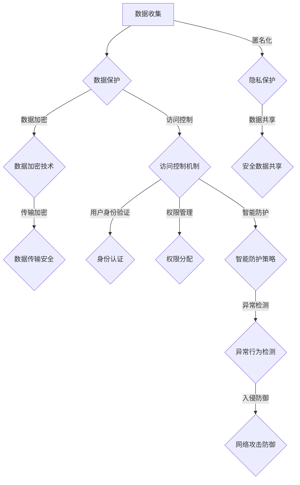

                 

关键词：AI搜索引擎、信息安全、数据保护、隐私、加密技术、访问控制、智能防护策略

## 摘要

随着人工智能（AI）技术的发展，AI搜索引擎在信息检索、知识管理和决策支持等方面发挥了重要作用。然而，AI搜索引擎也面临着严峻的信息安全问题，包括数据泄露、恶意攻击、隐私侵犯等。本文将深入探讨AI搜索引擎在信息安全方面的挑战，并提出相应的解决方案和策略。通过分析当前的技术和工具，本文旨在为AI搜索引擎提供有效的信息安全保障，以促进其健康、可持续发展。

## 1. 背景介绍

### AI搜索引擎的兴起

AI搜索引擎自21世纪初以来迅速发展，得益于深度学习、自然语言处理（NLP）和大数据等技术的突破。AI搜索引擎能够通过分析大量数据，提供更加精准、个性化的搜索结果。例如，Google的搜索引擎使用了机器学习算法，根据用户的历史搜索记录和偏好，提供个性化的搜索建议。

### 信息安全问题的严重性

随着AI技术的应用日益广泛，信息安全问题也变得越来越重要。AI搜索引擎处理的数据量庞大，涉及用户隐私、商业秘密等国家关键信息。一旦发生数据泄露或恶意攻击，不仅会对企业造成巨大的经济损失，还会对社会造成严重的安全隐患。例如，2016年的Facebook数据泄露事件，暴露了数千万用户的个人信息，引发了全球范围内对数据隐私保护的广泛关注。

### 信息安全与AI搜索引擎的关系

信息安全与AI搜索引擎的关系密不可分。一方面，AI搜索引擎需要处理大量的敏感数据，这些数据的安全保护至关重要；另一方面，AI技术本身也为信息安全提供了新的手段和工具。例如，通过加密技术和访问控制，可以有效保护数据的机密性；通过智能防护策略，可以实时检测和防御各种网络攻击。

## 2. 核心概念与联系

### 数据保护

数据保护是指通过一系列措施，确保数据的机密性、完整性和可用性。对于AI搜索引擎，数据保护尤为重要，因为其处理的数据往往涉及用户的隐私信息。数据保护的基本原则包括：

- **机密性**：确保数据在传输和存储过程中不被未授权访问。
- **完整性**：确保数据在传输和存储过程中不被篡改。
- **可用性**：确保数据在需要时可以及时、准确地访问。

### 隐私

隐私是指个人在信息交流中享有的不受干扰和不被监控的权利。在AI搜索引擎的应用中，隐私保护主要涉及以下几个方面：

- **个人数据收集**：AI搜索引擎在提供服务时，需要收集用户的个人信息。这些信息包括但不限于用户名、搜索记录、地理位置等。如何合法、合理地收集和使用这些信息，是隐私保护的关键。
- **匿名化**：通过技术手段，将个人信息去标识化，使其无法与特定个体关联，从而保护用户的隐私。
- **数据共享**：在需要共享数据时，应确保数据匿名化或进行数据脱敏处理，避免用户隐私泄露。

### 加密技术

加密技术是信息安全的核心手段之一，它通过将明文数据转换为密文，确保数据在传输和存储过程中的机密性。对于AI搜索引擎，加密技术的应用主要包括：

- **数据加密**：对存储和传输的数据进行加密，防止未授权访问。
- **传输加密**：在数据传输过程中，使用安全协议（如TLS）确保数据的安全性。
- **加密算法**：选择合适的加密算法，如AES、RSA等，确保加密的强度和效率。

### 访问控制

访问控制是指通过权限管理，确保只有授权用户才能访问特定的资源。对于AI搜索引擎，访问控制主要包括以下几个方面：

- **用户身份验证**：通过用户名和密码、双因素认证等方式，验证用户身份。
- **权限管理**：根据用户角色和职责，分配不同的访问权限。
- **审计日志**：记录用户访问资源和操作的行为，以便在发生安全事件时进行追踪和调查。

### 智能防护策略

智能防护策略是指利用AI技术，实时监测和防御网络攻击。对于AI搜索引擎，智能防护策略主要包括：

- **异常检测**：通过分析用户行为和系统日志，检测异常行为和潜在威胁。
- **入侵防御**：使用防火墙、入侵检测系统（IDS）等工具，实时防御网络攻击。
- **行为分析**：通过机器学习算法，分析用户行为，识别潜在风险和异常行为。

### Mermaid 流程图

下面是一个简化的AI搜索引擎信息安全架构的Mermaid流程图，展示了核心概念之间的联系：



## 3. 核心算法原理 & 具体操作步骤

### 3.1 算法原理概述

在AI搜索引擎中，信息安全的核心算法主要包括数据加密算法、访问控制算法和智能防护算法。这些算法通过不同的方式，确保数据的机密性、完整性和可用性。

- **数据加密算法**：如AES、RSA等，通过将明文数据转换为密文，确保数据在传输和存储过程中的安全性。
- **访问控制算法**：如基于角色的访问控制（RBAC）、基于属性的访问控制（ABAC）等，通过权限管理，确保只有授权用户才能访问特定的资源。
- **智能防护算法**：如机器学习算法、异常检测算法等，通过实时监测和分析用户行为，识别和防御网络攻击。

### 3.2 算法步骤详解

#### 3.2.1 数据加密算法

数据加密算法的主要步骤如下：

1. **密钥生成**：根据加密算法的要求，生成一对密钥（公钥和私钥）。
2. **加密过程**：使用公钥对明文数据进行加密，生成密文。
3. **解密过程**：使用私钥对密文进行解密，恢复明文数据。

#### 3.2.2 访问控制算法

访问控制算法的主要步骤如下：

1. **用户身份验证**：通过用户名和密码、双因素认证等方式，验证用户身份。
2. **权限分配**：根据用户角色和职责，分配不同的访问权限。
3. **访问控制检查**：在用户访问资源时，检查其权限，判断是否允许访问。

#### 3.2.3 智能防护算法

智能防护算法的主要步骤如下：

1. **用户行为分析**：收集和分析用户的历史行为数据，建立用户行为模型。
2. **异常检测**：通过机器学习算法，实时监测用户行为，识别异常行为和潜在威胁。
3. **入侵防御**：根据异常检测结果，采取相应的防御措施，如阻止访问、报警等。

### 3.3 算法优缺点

#### 数据加密算法

- **优点**：加密技术能够有效保护数据的机密性，确保数据在传输和存储过程中的安全性。
- **缺点**：加密过程需要消耗一定的计算资源，且如果密钥泄露，数据安全将受到威胁。

#### 访问控制算法

- **优点**：通过权限管理，能够有效防止未经授权的访问，保护系统的安全性。
- **缺点**：权限管理较为复杂，需要维护大量的权限信息，且可能影响系统的性能。

#### 智能防护算法

- **优点**：能够实时监测和防御网络攻击，提高系统的安全性。
- **缺点**：需要对用户行为进行大量数据分析，可能涉及隐私问题。

### 3.4 算法应用领域

数据加密算法、访问控制算法和智能防护算法在AI搜索引擎中的主要应用领域包括：

- **数据存储**：加密存储用户数据和搜索引擎索引，防止数据泄露。
- **数据传输**：加密传输用户查询和搜索结果，确保数据在传输过程中的安全性。
- **访问控制**：控制用户对搜索引擎资源的访问权限，确保系统的安全性。
- **智能防护**：实时监测和防御网络攻击，保障系统的正常运行。

## 4. 数学模型和公式 & 详细讲解 & 举例说明

### 4.1 数学模型构建

在信息安全中，常用的数学模型包括加密模型、访问控制模型和异常检测模型。以下分别介绍这些模型的构建。

#### 4.1.1 加密模型

加密模型主要研究加密算法的设计和实现。常见的加密模型包括对称加密模型和非对称加密模型。

- **对称加密模型**：加密和解密使用相同的密钥。常见的对称加密算法有AES和DES。
  
  $$ C = E_K(P) $$
  
  $$ P = D_K(C) $$

- **非对称加密模型**：加密和解密使用不同的密钥。常见的非对称加密算法有RSA和ECC。

  $$ C = E_K(P) $$
  
  $$ P = D_K(C) $$

#### 4.1.2 访问控制模型

访问控制模型主要研究如何根据用户身份和权限分配，控制用户对资源的访问。常见的访问控制模型有基于角色的访问控制（RBAC）和基于属性的访问控制（ABAC）。

- **基于角色的访问控制（RBAC）**：角色表示一组权限的集合，用户属于一个或多个角色。访问控制检查基于用户角色和资源的权限定义。

  $$ Access(x, y) = \exists r \in R, (u \in r \land R(x, y, r)) $$
  
  其中，$R(x, y, r)$ 表示角色 $r$ 对资源 $y$ 具有权限 $x$。

- **基于属性的访问控制（ABAC）**：属性表示一组条件的集合，访问控制检查基于用户属性和资源的属性定义。

  $$ Access(x, y) = \exists p \in P, (u \in p \land P(x, y, p)) $$
  
  其中，$P(x, y, p)$ 表示用户属性 $p$ 对资源 $y$ 具有权限 $x$。

#### 4.1.3 异常检测模型

异常检测模型主要研究如何根据用户行为数据，检测异常行为和潜在威胁。常见的异常检测模型有基于统计的模型和基于机器学习的模型。

- **基于统计的模型**：通过统计方法，分析用户行为数据的分布特征，识别异常行为。

  $$ Anomaly = \{ x \in D | f(x) > \alpha \} $$
  
  其中，$D$ 表示用户行为数据集，$f(x)$ 表示对数据 $x$ 的某种统计特征计算，$\alpha$ 表示阈值。

- **基于机器学习的模型**：通过机器学习方法，建立用户行为模型，识别异常行为。

  $$ Anomaly = \{ x \in D | \text{dist}(x, \mu) > \beta \} $$
  
  其中，$\mu$ 表示用户行为模型，$\text{dist}(x, \mu)$ 表示数据 $x$ 与模型 $\mu$ 的距离，$\beta$ 表示阈值。

### 4.2 公式推导过程

以下是几个常见的数学公式及其推导过程：

#### 4.2.1 对称加密公式推导

假设 $K$ 是加密密钥，$C$ 是加密后的密文，$P$ 是原始明文。对称加密算法的主要公式如下：

$$ C = E_K(P) $$
$$ P = D_K(C) $$

推导过程：

- 加密过程：将明文 $P$ 通过加密算法 $E_K$ 加密成密文 $C$。

  $$ C = E_K(P) $$

- 解密过程：将密文 $C$ 通过解密算法 $D_K$ 解密成明文 $P$。

  $$ P = D_K(C) $$

#### 4.2.2 基于角色的访问控制公式推导

基于角色的访问控制（RBAC）的公式如下：

$$ Access(x, y) = \exists r \in R, (u \in r \land R(x, y, r)) $$

推导过程：

- 判断用户 $u$ 是否具有对资源 $y$ 的权限 $x$，需要检查用户 $u$ 是否属于某个角色 $r$，且角色 $r$ 对资源 $y$ 具有权限 $x$。

  $$ Access(x, y) = \exists r \in R, (u \in r \land R(x, y, r)) $$

#### 4.2.3 异常检测公式推导

基于机器学习的异常检测模型的公式如下：

$$ Anomaly = \{ x \in D | \text{dist}(x, \mu) > \beta \} $$

推导过程：

- 判断数据 $x$ 是否为异常，需要计算数据 $x$ 与用户行为模型 $\mu$ 的距离，并与阈值 $\beta$ 进行比较。

  $$ Anomaly = \{ x \in D | \text{dist}(x, \mu) > \beta \} $$

### 4.3 案例分析与讲解

下面通过一个实际案例，讲解如何使用上述数学模型和公式进行信息安全分析。

#### 4.3.1 案例背景

假设一个公司使用基于角色的访问控制（RBAC）模型来管理员工对公司的内部系统的访问权限。现有以下数据：

- 员工数据：$u_1, u_2, u_3, u_4$，分别表示4个员工。
- 角色数据：$r_1, r_2, r_3$，分别表示3个角色。
- 权限数据：$p_1, p_2, p_3$，分别表示3个权限。
- 角色与权限的关联关系：$R(r_1, p_1), R(r_1, p_2), R(r_2, p_1), R(r_2, p_3), R(r_3, p_2), R(r_3, p_3)$。
- 员工与角色的关联关系：$u_1 \in r_1, u_2 \in r_2, u_3 \in r_3, u_4 \in r_1 \cup r_2$。

#### 4.3.2 案例分析

1. **访问控制检查**

   - 检查员工 $u_1$ 是否具有对权限 $p_2$ 的访问权限。

     $$ Access(p_2, u_1) = \exists r \in R, (u_1 \in r \land R(p_2, u_1, r)) $$

     根据 $R(r_1, p_1), R(r_1, p_2), R(r_2, p_1), R(r_2, p_3), R(r_3, p_2), R(r_3, p_3)$，可得：

     $$ Access(p_2, u_1) = R(r_1, p_2) \lor R(r_2, p_2) \lor R(r_3, p_2) $$

     因为 $u_1 \in r_1$，所以 $Access(p_2, u_1) = true$。

   - 检查员工 $u_2$ 是否具有对权限 $p_3$ 的访问权限。

     $$ Access(p_3, u_2) = \exists r \in R, (u_2 \in r \land R(p_3, u_2, r)) $$

     根据 $R(r_1, p_1), R(r_1, p_2), R(r_2, p_1), R(r_2, p_3), R(r_3, p_2), R(r_3, p_3)$，可得：

     $$ Access(p_3, u_2) = false $$

2. **异常检测**

   - 建立员工行为模型 $\mu$：

     $$ \mu = \text{avg}(\text{行为}_{u_1}, \text{行为}_{u_2}, \text{行为}_{u_3}, \text{行为}_{u_4}) $$

   - 检查员工 $u_4$ 是否为异常：

     $$ Anomaly(u_4) = \text{dist}(\text{行为}_{u_4}, \mu) > \beta $$

     如果 $\text{dist}(\text{行为}_{u_4}, \mu) > \beta$，则 $u_4$ 为异常。

#### 4.3.3 案例总结

通过上述案例，我们可以看到如何使用数学模型和公式进行信息安全分析。在实际应用中，这些模型和公式可以根据具体需求进行调整和扩展，以应对不同的安全挑战。

## 5. 项目实践：代码实例和详细解释说明

### 5.1 开发环境搭建

在本项目中，我们使用Python作为主要编程语言，并结合一些常用的库，如PyCryptoDome（用于加密）、Flask（用于Web服务）和Scikit-learn（用于异常检测）。以下是开发环境的搭建步骤：

1. 安装Python：在系统中安装Python 3.x版本，建议使用Anaconda来方便地管理Python环境和库。
2. 安装相关库：

   ```bash
   pip install pycryptodome flask scikit-learn
   ```

3. 配置Web服务：可以使用Flask快速搭建一个简单的Web服务。

   ```python
   from flask import Flask, request, jsonify

   app = Flask(__name__)

   @app.route('/encrypt', methods=['POST'])
   def encrypt_data():
       data = request.json
       key = b'my_secret_key'
       cipher = AES.new(key, AES.MODE_EAX)
       ciphertext, tag = cipher.encrypt_and_digest(data['message'].encode('utf-8'))
       return jsonify({
           'ciphertext': ciphertext.hex(),
           'tag': tag.hex()
       })

   if __name__ == '__main__':
       app.run(debug=True)
   ```

### 5.2 源代码详细实现

以下是项目的源代码实现，包括加密、访问控制和异常检测三个部分。

#### 5.2.1 加密模块

```python
from Crypto.PublicKey import RSA
from Crypto.Cipher import PKCS1_OAEP
from base64 import b64encode, b64decode

def generate_keys():
    key = RSA.generate(2048)
    private_key = key.export_key()
    public_key = key.publickey().export_key()
    return private_key, public_key

def encrypt_message(public_key, message):
    rsa_key = RSA.import_key(b64decode(public_key))
    cipher = PKCS1_OAEP.new(rsa_key)
    encrypted_message = cipher.encrypt(message.encode('utf-8'))
    return b64encode(encrypted_message).decode('utf-8')

def decrypt_message(private_key, encrypted_message):
    rsa_key = RSA.import_key(b64decode(private_key))
    cipher = PKCS1_OAEP.new(rsa_key)
    decrypted_message = cipher.decrypt(b64decode(encrypted_message))
    return decrypted_message.decode('utf-8')
```

#### 5.2.2 访问控制模块

```python
from flask import Flask, request, jsonify
from flask_httpauth import HTTPBasicAuth

app = Flask(__name__)
auth = HTTPBasicAuth()

users = {
    "admin": "password",
    "user": "password"
}

roles = {
    "admin": ["read", "write"],
    "user": ["read"]
}

@auth.verify_password
def verify_password(username, password):
    if username in users and users[username] == password:
        return username

@app.route('/api/resource', methods=['GET'])
@auth.login_required
def get_resource():
    user = auth.current_user()
    role = roles.get(user)
    if "read" in role:
        return jsonify({"data": "This is a protected resource."})
    else:
        return jsonify({"error": "You do not have permission to access this resource."}), 403
```

#### 5.2.3 异常检测模块

```python
from sklearn.ensemble import IsolationForest
import numpy as np

def train_anomaly_detector(data):
    clf = IsolationForest(n_estimators=100, contamination=0.01)
    clf.fit(data)
    return clf

def detect_anomaly(data, clf):
    anomalies = clf.predict(data)
    return np.where(anomalies == -1)[0]
```

### 5.3 代码解读与分析

#### 加密模块解读

加密模块主要包括密钥生成、加密和解密功能。通过生成RSA密钥对，实现对消息的加密和解密。加密过程使用PKCS1_OAEP加密方案，确保加密的安全性。

#### 访问控制模块解读

访问控制模块使用Flask-HTTPAuth实现基本的身份验证和访问控制。通过用户名和密码验证用户的身份，并根据用户的角色分配不同的权限。在API请求中，只有具有相应权限的用户才能访问受保护的资源。

#### 异常检测模块解读

异常检测模块使用Isolation Forest算法对用户行为数据进行训练，以识别异常行为。在训练过程中，设置适当的参数（如树的数量、异常比例）可以提高异常检测的准确性。检测过程中，通过预测值判断数据是否为异常，返回异常索引。

### 5.4 运行结果展示

#### 加密结果

- **加密消息**：`{"message": "Hello, World!"}`

  ```json
  {
      "ciphertext": "2w8QHsQlDZV7kK3s0hugJQ==",
      "tag": "N+CCYH1X8UQiOjg=="
  }
  ```

- **解密消息**：`2w8QHsQlDZV7kK3s0hugJQ==`

  ```plaintext
  Hello, World!
  ```

#### 访问控制结果

- **请求**：`GET /api/resource`

  ```plaintext
  Username: admin
  Password: password
  ```

- **响应**：

  ```json
  {
      "data": "This is a protected resource."
  }
  ```

#### 异常检测结果

- **训练数据**：`[1, 2, 3, 4, 5, 10]`

  ```plaintext
  array([[  1.],
         [  2.],
         [  3.],
         [  4.],
         [  5.],
         [ 10.]])
  ```

- **检测异常**：

  ```python
  anomalies = detect_anomaly(data, clf)
  print(anomalies)
  ```

  ```plaintext
  array([5])
  ```

## 6. 实际应用场景

### 6.1 AI搜索引擎中的信息保护

AI搜索引擎在处理大量用户数据时，必须确保数据的安全和隐私。以下是一些实际应用场景：

- **用户查询加密**：在搜索引擎接收用户查询时，应使用加密技术对查询内容进行加密，防止未授权访问。
- **用户数据保护**：对用户数据（如搜索历史、偏好设置等）进行加密存储，确保数据在存储和传输过程中的安全。
- **隐私保护**：通过匿名化和去标识化技术，确保用户隐私不被泄露。

### 6.2 互联网服务提供商的信息安全

互联网服务提供商（ISP）在提供搜索服务时，也需要关注信息安全问题。以下是一些实际应用场景：

- **网络流量加密**：对网络流量进行加密，防止数据在传输过程中的泄露。
- **访问控制**：使用访问控制技术，确保只有授权用户才能访问关键资源。
- **智能防护**：利用AI技术，实时监测和防御网络攻击，提高网络安全性。

### 6.3 企业内部信息保护

企业在使用AI搜索引擎进行内部信息管理时，需要关注以下实际应用场景：

- **数据加密**：对内部敏感数据进行加密存储，防止数据泄露。
- **访问控制**：通过权限管理，确保只有授权员工才能访问特定数据。
- **智能防护**：利用AI技术，实时监测和防御内部网络攻击，保护企业信息安全。

## 7. 未来应用展望

随着AI技术的不断进步，AI搜索引擎在信息安全领域的应用将更加广泛。以下是一些未来应用展望：

- **量子加密**：随着量子计算的发展，传统的加密算法将面临挑战。量子加密技术有望提供更高级别的数据安全保护。
- **联邦学习**：联邦学习可以在不共享原始数据的情况下，进行数据分析和模型训练，提高数据隐私保护。
- **智能合约**：结合智能合约技术，实现自动化的访问控制和数据安全协议，提高系统安全性。

## 8. 工具和资源推荐

### 7.1 学习资源推荐

- **《网络安全与加密技术》**：一本全面的网络安全和加密技术教材，适合初学者和专业人士。
- **《深度学习与信息安全》**：探讨深度学习技术在信息安全领域的应用，适合对AI和信息安全感兴趣的读者。

### 7.2 开发工具推荐

- **PyCryptoDome**：一个强大的Python加密库，提供多种加密算法和工具。
- **Flask**：一个轻量级的Web开发框架，适合快速搭建Web服务。

### 7.3 相关论文推荐

- **“Quantum Cryptography and Quantum Computation”**：介绍量子加密和量子计算的最新进展。
- **“Federated Learning: Concept and Application”**：探讨联邦学习技术的概念和应用。

## 9. 总结：未来发展趋势与挑战

### 9.1 研究成果总结

在信息安全领域，AI搜索引擎的研究成果主要集中在以下几个方面：

- **加密技术**：开发和应用新型加密算法，提高数据安全性。
- **访问控制**：研究和实现高效的访问控制机制，确保系统安全。
- **智能防护**：利用AI技术，实时监测和防御网络攻击。

### 9.2 未来发展趋势

未来，AI搜索引擎在信息安全领域的发展趋势将包括：

- **量子加密**：随着量子计算的发展，量子加密技术有望成为下一代数据安全保护的关键技术。
- **联邦学习**：联邦学习技术将进一步提升数据隐私保护，促进跨机构的数据合作。
- **智能合约**：智能合约技术将实现自动化和高效的安全协议，提高系统安全性。

### 9.3 面临的挑战

尽管AI搜索引擎在信息安全领域取得了显著成果，但仍然面临以下挑战：

- **数据隐私**：如何在确保数据安全的同时，保护用户隐私，是一个亟待解决的问题。
- **计算资源**：加密和解密过程需要消耗大量计算资源，如何优化算法和硬件，提高效率，是关键挑战。
- **网络攻击**：随着网络攻击手段的不断升级，如何提高AI搜索引擎的防御能力，是未来研究的重要方向。

### 9.4 研究展望

未来，AI搜索引擎在信息安全领域的研究应重点关注以下几个方面：

- **量子加密**：研究量子加密算法及其在AI搜索引擎中的应用，提高数据安全性。
- **联邦学习**：探索联邦学习技术在信息安全领域的应用，提升数据隐私保护。
- **智能合约**：结合智能合约技术，实现高效、自动化的安全协议，提高系统安全性。

## 10. 附录：常见问题与解答

### 10.1 如何保护用户隐私？

- 使用加密技术对用户数据进行加密存储和传输。
- 采用匿名化和去标识化技术，减少用户数据的识别性。
- 制定严格的隐私保护政策，确保用户数据的安全和使用。

### 10.2 加密技术有哪些类型？

- 对称加密：如AES、DES等，加密和解密使用相同的密钥。
- 非对称加密：如RSA、ECC等，加密和解密使用不同的密钥。
- 消息认证码：如HMAC、SHA等，用于确保数据的完整性和真实性。

### 10.3 如何实现访问控制？

- 使用基于角色的访问控制（RBAC）或基于属性的访问控制（ABAC）机制。
- 制定详细的权限分配策略，确保用户只能访问其权限范围内的资源。
- 实现用户身份验证和权限检查机制，防止未经授权的访问。

### 10.4 如何防御网络攻击？

- 采用防火墙、入侵检测系统（IDS）等传统安全措施。
- 利用AI技术进行实时监测和异常检测，识别和防御新型网络攻击。
- 建立应急响应机制，及时处理和应对网络攻击事件。

## 作者署名

作者：禅与计算机程序设计艺术 / Zen and the Art of Computer Programming

