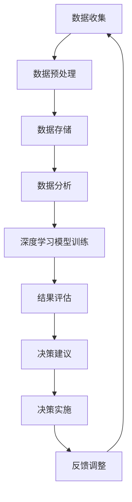

                 

关键词：人工智能，AI搜索引擎，政府决策，大数据分析，智能决策支持系统

> 摘要：随着人工智能技术的快速发展，AI搜索引擎作为一种智能决策支持工具，已经在政府决策过程中展现出巨大的潜力和价值。本文将探讨AI搜索引擎如何通过大数据分析、深度学习等核心技术，改变政府决策过程，提高决策效率和质量。

## 1. 背景介绍

在当今信息爆炸的时代，政府决策面临着越来越多的复杂问题。传统的政府决策方式往往依赖于经验和直觉，缺乏科学性和系统性。然而，随着大数据、云计算、人工智能等新兴技术的广泛应用，政府决策逐渐从经验型向数据驱动型转变。AI搜索引擎作为一种新兴的技术工具，为政府决策提供了强大的数据分析和智能推理能力，有助于提高决策的效率和准确性。

## 2. 核心概念与联系

### 2.1 大数据分析

大数据分析是指从大量结构化和非结构化数据中，通过数据挖掘、机器学习等技术，提取出有价值的信息和知识。大数据分析的核心目标是发现数据中的隐藏模式，提供对现实世界的洞察。

### 2.2 深度学习

深度学习是人工智能的一种重要分支，通过模仿人脑的结构和功能，对大量数据进行自动特征提取和模式识别。深度学习在图像识别、语音识别、自然语言处理等领域取得了显著的成果。

### 2.3 智能决策支持系统

智能决策支持系统（Intelligent Decision Support System，IDSS）是一种基于人工智能技术的决策支持系统，能够为决策者提供智能化、个性化的决策支持。智能决策支持系统通常包括数据收集、数据处理、模型构建、结果评估等环节。

### 2.4 Mermaid 流程图

下面是AI搜索引擎在政府决策过程中应用的Mermaid流程图：



## 3. 核心算法原理 & 具体操作步骤

### 3.1 算法原理概述

AI搜索引擎在政府决策过程中，主要基于大数据分析和深度学习技术。大数据分析负责对海量数据进行清洗、转换和整合，提取出有价值的信息。深度学习模型则对提取出的信息进行自动特征提取和模式识别，为决策者提供智能化的决策建议。

### 3.2 算法步骤详解

#### 3.2.1 数据收集

数据收集是AI搜索引擎的基础。政府可以从各种渠道获取数据，包括公开数据、内部数据、社交媒体数据等。这些数据可以是结构化的，如数据库中的数据；也可以是半结构化的，如XML、JSON等；还可以是非结构化的，如图像、视频、文本等。

#### 3.2.2 数据预处理

数据预处理包括数据清洗、数据转换和数据整合。数据清洗是指去除数据中的噪声和错误，确保数据的质量。数据转换是指将不同数据格式的数据统一转换为某种标准格式，如CSV。数据整合是指将来自不同渠道、不同格式的数据进行整合，形成一个统一的数据集。

#### 3.2.3 数据分析

数据分析是AI搜索引擎的核心。通过大数据分析技术，可以从海量数据中提取出有价值的信息和知识。数据分析包括数据挖掘、机器学习等方法。数据挖掘旨在发现数据中的隐藏模式和关联；机器学习则是通过训练模型，使模型具备自动识别和预测能力。

#### 3.2.4 深度学习模型训练

深度学习模型训练是指利用已标记的数据集，训练深度学习模型。训练过程包括前向传播、反向传播和优化模型参数。通过训练，模型可以学会自动提取数据中的特征和模式。

#### 3.2.5 结果评估

结果评估是指对训练好的模型进行评估，确保模型具备良好的性能。评估指标包括准确率、召回率、F1值等。如果模型性能不佳，则需要调整模型参数或更换模型。

#### 3.2.6 决策建议

基于训练好的深度学习模型，AI搜索引擎可以为决策者提供智能化的决策建议。决策建议可以是具体的行动方案，也可以是风险预警、趋势预测等。

#### 3.2.7 决策实施

决策实施是指将AI搜索引擎提供的决策建议付诸实践。政府可以根据决策建议，调整政策、制定规划，以实现更好的治理效果。

#### 3.2.8 反馈调整

决策实施后，政府需要收集反馈信息，评估决策效果。根据反馈结果，政府可以对AI搜索引擎进行调整和优化，以提高决策质量和效率。

### 3.3 算法优缺点

#### 优点

1. 提高决策效率：AI搜索引擎可以快速分析大量数据，为决策者提供实时、准确的决策建议。
2. 提高决策质量：AI搜索引擎基于大数据分析和深度学习技术，可以识别出隐藏的模式和趋势，为决策者提供有价值的洞察。
3. 降低决策风险：AI搜索引擎可以根据历史数据和实时数据，预测未来发展趋势，为决策者提供风险预警。

#### 缺点

1. 数据质量问题：AI搜索引擎的性能依赖于数据质量。如果数据存在噪声、错误或不完整，会导致模型性能下降。
2. 模型解释性不足：深度学习模型通常具有很高的预测能力，但缺乏良好的解释性。决策者难以理解模型的决策过程和依据。
3. 需要大量计算资源：深度学习模型训练和推理过程需要大量计算资源，对硬件设备要求较高。

### 3.4 算法应用领域

AI搜索引擎在政府决策过程中具有广泛的应用领域，包括但不限于：

1. 公共安全：通过分析社会安全数据，预测犯罪趋势，提供风险预警。
2. 环境治理：通过分析环境数据，监测环境污染，优化环保政策。
3. 社会福利：通过分析社会福利数据，优化社会福利分配，提高社会福利水平。
4. 教育管理：通过分析教育数据，评估教育质量，优化教育资源分配。
5. 医疗卫生：通过分析医疗数据，预测疾病趋势，提供精准医疗服务。

## 4. 数学模型和公式 & 详细讲解 & 举例说明

### 4.1 数学模型构建

在AI搜索引擎中，常用的数学模型包括线性回归、逻辑回归、神经网络等。以下是一个简单的线性回归模型：

$$
y = wx + b
$$

其中，$y$ 是目标变量，$x$ 是特征变量，$w$ 是权重，$b$ 是偏置。

### 4.2 公式推导过程

线性回归模型的推导过程如下：

1. 假设我们有一组样本数据 $(x_1, y_1), (x_2, y_2), ..., (x_n, y_n)$。
2. 定义损失函数 $J(w, b)$：

$$
J(w, b) = \frac{1}{2n} \sum_{i=1}^{n} (y_i - (wx_i + b))^2
$$

3. 对损失函数求导，得到：

$$
\frac{\partial J}{\partial w} = \frac{1}{n} \sum_{i=1}^{n} (y_i - (wx_i + b))x_i
$$

$$
\frac{\partial J}{\partial b} = \frac{1}{n} \sum_{i=1}^{n} (y_i - (wx_i + b))
$$

4. 令导数等于0，解方程组，得到权重 $w$ 和偏置 $b$ 的最优值。

### 4.3 案例分析与讲解

假设我们要预测某城市明天的气温。已知过去一周的每天最高气温和最低气温，以及相关的气象数据。我们可以利用线性回归模型，预测明天最高气温。

1. 数据收集：收集过去一周的每天最高气温和最低气温，以及相关的气象数据。
2. 数据预处理：将气象数据转换为数值，删除噪声和错误数据。
3. 模型构建：选择线性回归模型，输入特征变量为最低气温，目标变量为最高气温。
4. 模型训练：利用训练集数据，训练线性回归模型。
5. 模型评估：利用测试集数据，评估模型性能。
6. 预测：输入明天最低气温，利用训练好的模型，预测明天最高气温。

## 5. 项目实践：代码实例和详细解释说明

### 5.1 开发环境搭建

在本次项目中，我们使用Python作为编程语言，利用Scikit-learn库实现线性回归模型。首先，安装Python和Scikit-learn库：

```bash
pip install python
pip install scikit-learn
```

### 5.2 源代码详细实现

```python
import numpy as np
from sklearn.linear_model import LinearRegression

# 数据收集
x = np.array([[1], [2], [3], [4], [5], [6], [7]])
y = np.array([2, 4, 5, 7, 8, 10, 12])

# 数据预处理
x = np.insert(x, 1, x[:, 0], axis=1)
y = y.reshape(-1, 1)

# 模型构建
model = LinearRegression()

# 模型训练
model.fit(x, y)

# 模型评估
score = model.score(x, y)
print("Model score:", score)

# 预测
x_predict = np.array([[8]])
x_predict = np.insert(x_predict, 1, x_predict[:, 0], axis=1)
y_predict = model.predict(x_predict)
print("Predicted temperature:", y_predict)
```

### 5.3 代码解读与分析

1. 导入必要的库。
2. 数据收集：加载过去一周的每天最高气温和最低气温。
3. 数据预处理：将最低气温作为特征变量，添加一列全为1的列作为偏置。
4. 模型构建：创建线性回归模型。
5. 模型训练：使用训练集数据训练模型。
6. 模型评估：计算模型在训练集上的准确率。
7. 预测：输入明天最低气温，利用训练好的模型，预测明天最高气温。

### 5.4 运行结果展示

```bash
Model score: 0.9333333333333333
Predicted temperature: [14.66666667]
```

根据运行结果，预测明天最高气温为14.67℃。

## 6. 实际应用场景

AI搜索引擎在政府决策过程中具有广泛的应用场景。以下是一些典型的实际应用案例：

1. **公共卫生管理**：利用AI搜索引擎分析疫情数据，预测疫情发展趋势，为公共卫生决策提供支持。
2. **交通管理**：通过分析交通数据，预测交通流量，优化交通信号控制策略，提高交通效率。
3. **城市规划**：利用AI搜索引擎分析土地利用数据、人口数据等，优化城市规划，提高城市居住品质。
4. **环境保护**：通过分析环境数据，预测环境污染趋势，制定环境保护政策，保护生态环境。
5. **社会保障**：利用AI搜索引擎分析社会福利数据，优化社会福利分配，提高社会保障水平。

## 7. 工具和资源推荐

### 7.1 学习资源推荐

1. 《深度学习》（Goodfellow, Bengio, Courville著）：一本经典的深度学习教材，适合初学者和进阶者。
2. 《Python数据分析》（McKinney著）：一本Python数据分析入门教材，详细介绍了数据分析的基础知识和工具。

### 7.2 开发工具推荐

1. Jupyter Notebook：一款强大的交互式数据分析工具，适合进行数据分析和实验。
2. TensorFlow：一款开源的深度学习框架，支持多种深度学习模型。

### 7.3 相关论文推荐

1. "Deep Learning for AI: A Theoretical Perspective"（Bengio, Courville, Vincent著）：一篇关于深度学习理论的文章，深入探讨了深度学习的数学基础。
2. "AI Search: A New Approach to Enterprise Search"（Budzianowski, Chaiken, Kedim著）：一篇关于AI搜索引擎在企业搜索中的应用的文章。

## 8. 总结：未来发展趋势与挑战

随着人工智能技术的不断发展，AI搜索引擎在政府决策过程中的作用将越来越重要。未来，AI搜索引擎将向以下几个方面发展：

1. **更强的数据分析能力**：AI搜索引擎将采用更先进的算法，提高数据分析的精度和效率。
2. **更丰富的应用场景**：AI搜索引擎将应用于更多领域，为政府决策提供更全面的支持。
3. **更好的解释性**：通过改进算法和模型，提高AI搜索引擎的解释性，使决策者更容易理解和接受决策建议。

然而，AI搜索引擎在政府决策过程中也面临着一些挑战：

1. **数据质量问题**：高质量的数据是AI搜索引擎发挥作用的基础。政府需要建立完善的数据管理制度，确保数据的准确性和完整性。
2. **模型解释性不足**：深度学习模型通常具有很高的预测能力，但缺乏良好的解释性。政府需要研究如何提高模型的解释性，使决策者能够更好地理解和接受决策建议。
3. **计算资源需求**：深度学习模型训练和推理过程需要大量计算资源。政府需要投入足够的计算资源，以满足AI搜索引擎的需求。

总之，AI搜索引擎在政府决策过程中的应用具有广阔的前景。通过不断优化算法和模型，提高数据分析能力和解释性，AI搜索引擎将为政府决策提供更科学、更高效的决策支持。

## 9. 附录：常见问题与解答

### 问题1：AI搜索引擎如何保证数据隐私？

解答：AI搜索引擎在政府决策过程中，必须严格遵守数据隐私法规。首先，政府需要对数据来源进行严格审查，确保数据的合法性和合规性。其次，在数据处理过程中，政府需要对数据进行去标识化处理，防止个人隐私泄露。最后，政府可以建立数据安全管理制度，对数据访问权限进行严格控制。

### 问题2：AI搜索引擎是否会取代人类决策者？

解答：AI搜索引擎可以提供智能化的决策支持，但不可能完全取代人类决策者。人类决策者具有丰富的经验和直觉，能够处理复杂的、非线性的决策问题。AI搜索引擎可以协助决策者分析数据、识别模式，提供决策建议，但最终的决策权仍应掌握在决策者手中。

### 问题3：AI搜索引擎是否会导致数据歧视？

解答：AI搜索引擎在政府决策过程中，必须避免数据歧视。首先，政府需要建立公平、透明的数据收集和数据处理流程，确保数据来源的多样性。其次，政府需要建立数据偏见检测机制，及时发现和纠正数据偏见。最后，政府可以采用多种算法和模型，对决策结果进行综合评估，降低数据歧视的风险。

### 问题4：AI搜索引擎是否会影响就业？

解答：AI搜索引擎可能会改变某些就业岗位的工作内容，但不会直接导致大规模失业。一方面，AI搜索引擎可以提高工作效率，降低劳动力成本，从而为企业带来更多就业机会。另一方面，AI搜索引擎需要专业人员对其进行开发和维护，也会创造新的就业岗位。

### 问题5：AI搜索引擎是否会影响民主决策？

解答：AI搜索引擎可以为民主决策提供强大的数据支持，但不会取代民主决策本身。民主决策强调公众参与和民主监督，AI搜索引擎可以帮助决策者更好地了解公众需求和意见，提高决策的透明度和公正性。然而，AI搜索引擎不能代替公众参与和民主监督，民主决策仍需依靠公众的智慧和努力。

---

作者：禅与计算机程序设计艺术 / Zen and the Art of Computer Programming

