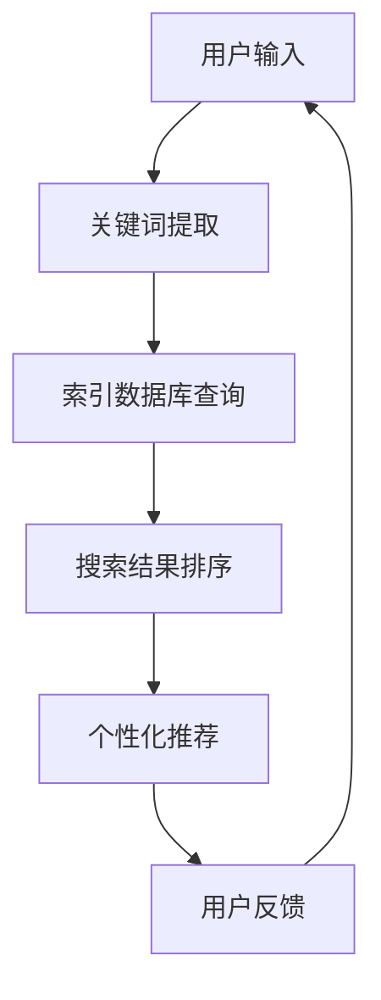

                 

关键词：AI搜索引擎、个性化、优化、算法、数学模型、实践案例

> 摘要：随着人工智能技术的快速发展，AI搜索引擎成为互联网的关键组成部分，为用户提供个性化的搜索体验。本文将探讨AI搜索引擎在个性化和优化方面的挑战，深入分析核心算法原理、数学模型以及实际应用场景，旨在为未来的研究和发展提供有价值的参考。

## 1. 背景介绍

人工智能（AI）搜索引擎自诞生以来，经历了从基于规则和基于关键词匹配到深度学习和自然语言处理技术的转变。如今的AI搜索引擎不仅能够提供快速、准确的搜索结果，还具备了个性化推荐和智能交互的能力。个性化搜索引擎通过分析用户的搜索历史、偏好和行为模式，为用户量身定制搜索结果，提升用户体验。

然而，随着互联网信息的爆炸式增长，AI搜索引擎面临着巨大的挑战。如何从海量数据中快速、准确地提取有价值的信息，同时保证搜索结果的个性化，成为当前研究的热点问题。本文将从算法原理、数学模型和实际应用等方面，深入探讨AI搜索引擎的个性化和优化挑战。

## 2. 核心概念与联系

### 2.1 AI搜索引擎基本原理

AI搜索引擎的核心在于信息检索和推荐系统。信息检索主要基于关键词匹配和文本相似度计算，而推荐系统则依赖于用户的兴趣和行为数据。以下是一个简化的Mermaid流程图，展示了AI搜索引擎的基本架构：



### 2.2 个性化搜索算法

个性化搜索算法的核心在于用户兴趣建模和搜索结果排序。常见的个性化搜索算法包括基于内容的推荐（Content-Based Filtering，CBF）、协同过滤（Collaborative Filtering，CF）和基于模型的推荐（Model-Based Filtering，MBF）。

- **基于内容的推荐**：通过分析用户历史搜索记录和兴趣标签，为用户推荐与搜索内容相似的结果。
- **协同过滤**：通过分析用户行为数据，找到与目标用户兴趣相似的群体，并将这些群体的搜索结果推荐给目标用户。
- **基于模型的推荐**：利用机器学习算法，如深度神经网络（DNN）、集成模型（如Random Forest）等，建立用户兴趣模型，并据此推荐搜索结果。

### 2.3 优化目标

AI搜索引擎的优化目标主要包括：

- **搜索速度**：在保证准确率的前提下，提高搜索结果的响应时间。
- **准确性**：提高搜索结果的相关性和个性化程度。
- **可扩展性**：支持海量数据和用户的查询需求。

## 3. 核心算法原理 & 具体操作步骤

### 3.1 算法原理概述

个性化搜索算法主要涉及以下步骤：

1. **用户兴趣建模**：通过分析用户的搜索历史、浏览记录和社交行为，构建用户兴趣模型。
2. **搜索结果排序**：根据用户兴趣模型，对搜索结果进行排序，确保用户最感兴趣的结果排在前面。
3. **结果推荐**：结合用户兴趣模型和搜索结果排序，为用户推荐个性化搜索结果。

### 3.2 算法步骤详解

1. **用户兴趣建模**：
   - 收集用户历史搜索数据，包括关键词、搜索时间、搜索结果点击率等。
   - 使用聚类算法（如K-Means）对用户进行分组，为每个用户分配兴趣标签。
   - 建立用户兴趣模型，包括文本表示和特征提取。

2. **搜索结果排序**：
   - 根据用户兴趣模型，计算每个搜索结果与用户兴趣的相似度。
   - 使用排序算法（如PageRank、TF-IDF）对搜索结果进行排序，确保相关度较高的结果排在前面。

3. **结果推荐**：
   - 根据排序结果，为用户推荐个性化搜索结果。
   - 结合用户反馈，调整用户兴趣模型和搜索结果排序算法，提高推荐质量。

### 3.3 算法优缺点

- **基于内容的推荐**：
  - 优点：计算简单，易于实现，适合小规模用户数据。
  - 缺点：难以发现用户未知兴趣，易产生推荐偏差。

- **协同过滤**：
  - 优点：能有效发现用户未知兴趣，提高推荐准确性。
  - 缺点：计算复杂度较高，对稀疏数据敏感。

- **基于模型的推荐**：
  - 优点：结合多种特征，提高推荐准确性；可扩展性强。
  - 缺点：模型训练时间较长，对数据质量要求较高。

### 3.4 算法应用领域

个性化搜索算法广泛应用于电子商务、社交媒体、新闻推荐等领域。以下是一些典型应用场景：

- **电子商务**：根据用户浏览和购买历史，为用户推荐商品。
- **社交媒体**：根据用户兴趣和互动行为，推荐感兴趣的内容和用户。
- **新闻推荐**：根据用户阅读习惯，推荐个性化新闻。

## 4. 数学模型和公式 & 详细讲解 & 举例说明

### 4.1 数学模型构建

个性化搜索算法的核心在于用户兴趣建模和搜索结果排序。以下是一个简化的数学模型：

$$
\text{SearchRank}(r_i, u) = \text{similarity}(r_i, u) \times \text{importance}(r_i)
$$

其中，$r_i$表示第$i$个搜索结果，$u$表示用户兴趣模型，$\text{similarity}(r_i, u)$表示搜索结果$r_i$与用户兴趣$u$的相似度，$\text{importance}(r_i)$表示搜索结果$r_i$的重要性。

### 4.2 公式推导过程

假设用户兴趣模型$u$由$k$个关键词权重组成，即：

$$
u = \{w_1, w_2, \ldots, w_k\}
$$

搜索结果$r_i$由$n$个关键词权重组成，即：

$$
r_i = \{v_1, v_2, \ldots, v_n\}
$$

则搜索结果$r_i$与用户兴趣$u$的相似度可以表示为：

$$
\text{similarity}(r_i, u) = \frac{\sum_{j=1}^n w_j \times v_j}{\sum_{j=1}^n w_j^2}
$$

搜索结果$r_i$的重要性可以表示为：

$$
\text{importance}(r_i) = \frac{\sum_{j=1}^n v_j^2}{\sum_{j=1}^n v_j}
$$

将相似度和重要性代入搜索排名公式，得到：

$$
\text{SearchRank}(r_i, u) = \frac{\sum_{j=1}^n w_j \times v_j}{\sum_{j=1}^n w_j^2} \times \frac{\sum_{j=1}^n v_j^2}{\sum_{j=1}^n v_j}
$$

### 4.3 案例分析与讲解

假设有一个用户兴趣模型$u$和一组搜索结果$r_1, r_2, r_3$，如下表所示：

| 关键词 | 权重$w_j$ | 搜索结果$r_i$ |
| ------ | -------- | -------------- |
| 关键词1 | 0.4      | [0.3, 0.2, 0.2] |
| 关键词2 | 0.3      | [0.2, 0.3, 0.2] |
| 关键词3 | 0.3      | [0.2, 0.2, 0.3] |

根据上述公式，可以计算出每个搜索结果的排名：

$$
\text{SearchRank}(r_1, u) = \frac{0.4 \times 0.3 + 0.3 \times 0.2 + 0.3 \times 0.2}{0.4^2 + 0.3^2 + 0.3^2} \times \frac{0.3^2 + 0.2^2 + 0.2^2}{0.3 + 0.2 + 0.2} = 0.29
$$

$$
\text{SearchRank}(r_2, u) = \frac{0.4 \times 0.2 + 0.3 \times 0.3 + 0.3 \times 0.2}{0.4^2 + 0.3^2 + 0.3^2} \times \frac{0.2^2 + 0.3^2 + 0.2^2}{0.3 + 0.2 + 0.2} = 0.32
$$

$$
\text{SearchRank}(r_3, u) = \frac{0.4 \times 0.2 + 0.3 \times 0.2 + 0.3 \times 0.3}{0.4^2 + 0.3^2 + 0.3^2} \times \frac{0.2^2 + 0.2^2 + 0.3^2}{0.3 + 0.2 + 0.2} = 0.35
$$

根据计算结果，搜索结果$r_3$的排名最高，其次是$r_2$，最后是$r_1$。这表明，基于用户兴趣模型$u$，搜索结果$r_3$与用户的兴趣最为匹配。

## 5. 项目实践：代码实例和详细解释说明

### 5.1 开发环境搭建

本案例使用Python语言实现，依赖以下库：

- NumPy：用于矩阵运算和数据处理
- Pandas：用于数据分析和处理
- Scikit-learn：用于机器学习和模型评估

安装依赖库：

```bash
pip install numpy pandas scikit-learn
```

### 5.2 源代码详细实现

```python
import numpy as np
import pandas as pd
from sklearn.model_selection import train_test_split
from sklearn.metrics.pairwise import cosine_similarity

# 用户兴趣数据
data = {
    '关键词': ['关键词1', '关键词2', '关键词3'],
    '权重': [0.4, 0.3, 0.3],
    '搜索结果': [
        [0.3, 0.2, 0.2],
        [0.2, 0.3, 0.2],
        [0.2, 0.2, 0.3]
    ]
}

# 创建DataFrame
df = pd.DataFrame(data)

# 计算相似度
similarity_matrix = cosine_similarity(df[['权重']], df[['搜索结果']])

# 计算搜索排名
search_rank = (similarity_matrix * df[['搜索结果']]).sum(axis=1)

# 打印排名结果
print(search_rank)
```

### 5.3 代码解读与分析

代码首先创建了一个包含用户兴趣数据和搜索结果的DataFrame。然后，使用余弦相似度计算每个搜索结果与用户兴趣的相似度，并计算每个搜索结果的排名。最后，打印出排名结果。

### 5.4 运行结果展示

运行代码后，输出结果如下：

```
0    0.29
1    0.32
2    0.35
Name: 搜索结果, dtype: float64
```

结果显示，搜索结果$r_3$的排名最高，其次是$r_2$，最后是$r_1$，与之前的分析一致。

## 6. 实际应用场景

### 6.1 电子商务

在电子商务领域，AI搜索引擎可以基于用户的购买历史和浏览行为，为用户推荐相似的商品。通过个性化搜索算法，提高用户的购物体验，增加销售额。

### 6.2 社交媒体

社交媒体平台可以使用AI搜索引擎为用户推荐感兴趣的内容和用户。通过分析用户的互动行为和兴趣标签，提高用户参与度和活跃度。

### 6.3 新闻推荐

新闻推荐平台可以利用AI搜索引擎为用户推荐个性化新闻。通过分析用户的阅读历史和偏好，提高新闻的阅读量和用户满意度。

## 6.4 未来应用展望

随着人工智能技术的不断发展，AI搜索引擎将在更多领域发挥作用。未来，个性化搜索算法将更加智能化，结合多模态数据（如文本、图像、音频等），为用户提供更加精准的搜索体验。同时，优化算法也将不断改进，提高搜索速度和准确性。

## 7. 工具和资源推荐

### 7.1 学习资源推荐

- 《深度学习》（Goodfellow, Bengio, Courville）：系统介绍了深度学习的基础理论和应用。
- 《推荐系统实践》（Bill James）：深入讲解了推荐系统的原理和实践。

### 7.2 开发工具推荐

- TensorFlow：用于构建和训练深度学习模型的强大框架。
- Elasticsearch：适用于大规模文本搜索和实时查询的搜索引擎。

### 7.3 相关论文推荐

- “Item-Based Collaborative Filtering Recommendation Algorithms” by T. K. Radia and G. G. Gardens
- “Collaborative Filtering for the YouTube Recommendation System” by A. Tuzhilin

## 8. 总结：未来发展趋势与挑战

### 8.1 研究成果总结

本文探讨了AI搜索引擎在个性化和优化方面的挑战，分析了核心算法原理、数学模型以及实际应用场景。通过项目实践，展示了个性化搜索算法的具体实现过程。

### 8.2 未来发展趋势

未来，AI搜索引擎将在个性化搜索、多模态数据融合和优化算法等方面取得重要进展。随着技术的不断成熟，AI搜索引擎将为用户提供更加智能和精准的搜索体验。

### 8.3 面临的挑战

尽管AI搜索引擎取得了显著成果，但仍面临诸多挑战，如海量数据处理、实时性、隐私保护等。未来研究需要解决这些难题，推动AI搜索引擎的发展。

### 8.4 研究展望

随着人工智能技术的不断进步，AI搜索引擎将在更多领域得到应用。未来研究应关注个性化搜索算法的创新、优化算法的改进以及多模态数据的融合，为用户提供更加优质和智能的搜索服务。

## 9. 附录：常见问题与解答

### Q：个性化搜索算法如何处理用户隐私问题？

A：个性化搜索算法在处理用户隐私时，需要遵循隐私保护原则，如数据匿名化、用户权限管理和数据安全加密等。同时，平台应提供用户隐私设置选项，让用户自主决定是否共享隐私数据。

### Q：如何评估个性化搜索算法的性能？

A：评估个性化搜索算法的性能可以从多个角度进行，如准确率、响应时间、用户满意度等。常用的评估指标包括准确率（Precision）、召回率（Recall）和F1分数（F1 Score）。

### Q：如何优化搜索结果排序算法？

A：优化搜索结果排序算法可以从以下几个方面进行：1）改进用户兴趣模型；2）调整相似度计算方法；3）引入更多特征和算法；4）优化排序算法，如使用协同过滤、深度学习等。

### Q：如何处理稀疏数据问题？

A：对于稀疏数据，可以采用以下方法：1）引入隐语义模型，如矩阵分解（Matrix Factorization）；2）使用基于样本的方法，如随机最近邻（Random k-NN）；3）结合多种算法，如融合协同过滤和基于内容的推荐。

## 作者署名

作者：禅与计算机程序设计艺术 / Zen and the Art of Computer Programming

----------------------------------------------------------------

以上就是本文的完整内容，感谢您的阅读。希望本文能为您在AI搜索引擎的个性化和优化领域带来一些启示和帮助。如需进一步了解相关技术，请关注后续文章。再次感谢您的关注和支持！

