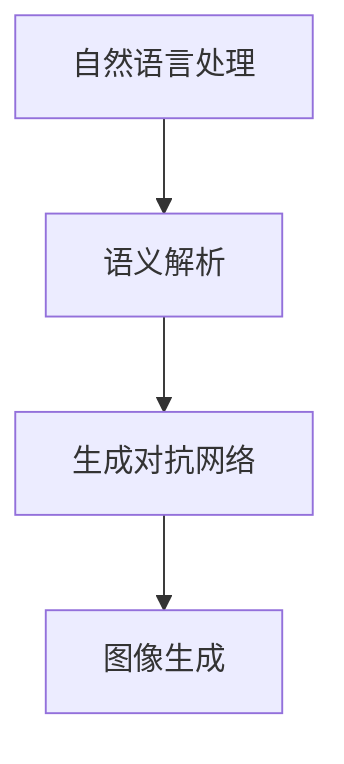

                 

在当今科技飞速发展的时代，人工智能（AI）已经逐渐渗透到我们生活的方方面面。从智能家居到自动驾驶，从医疗诊断到金融分析，AI技术的应用场景愈发广泛。本文将探讨一个极具潜力的AI领域——AI故事插图生成，即如何将文字描述转化为逼真的图像。

## 关键词
- 人工智能
- 文字到图像转化
- 图像生成
- 自然语言处理
- 计算机视觉

## 摘要
本文将详细介绍AI故事插图生成的技术原理、核心算法、数学模型及实际应用，旨在为读者提供一个全面、深入的了解。通过本文，读者将能够掌握文字到图像转化的关键技术，并了解这一技术在未来的发展方向和应用前景。

## 1. 背景介绍

### 1.1 AI故事插图生成的背景

在传统的插画创作中，创作者需要耗费大量时间和精力来将文字描述转化为视觉图像。这不仅限制了创作速度，还阻碍了创意的流畅性。随着AI技术的发展，人们开始探索如何利用AI来辅助甚至替代这一过程。

AI故事插图生成旨在通过自然语言处理（NLP）和计算机视觉技术，将文字描述直接转化为高质量的图像。这一技术的出现，不仅提高了创作效率，还打破了传统创作的限制，为插画创作带来了新的可能性。

### 1.2 AI故事插图生成的重要性

AI故事插图生成技术的重要性体现在多个方面：

1. **创作效率提升**：AI能够自动将文字描述转化为图像，大大减少了人工创作的时间。
2. **创意无限**：AI不受传统创作限制，能够创造出更多元、更有创意的图像。
3. **跨领域应用**：这一技术不仅适用于插画创作，还可以应用于游戏设计、广告创意、影视制作等多个领域。

## 2. 核心概念与联系

为了更好地理解AI故事插图生成的技术原理，我们需要首先了解几个核心概念：

1. **自然语言处理（NLP）**：NLP是人工智能的一个重要分支，旨在让计算机理解和处理人类语言。在AI故事插图生成中，NLP用于将文字描述解析为计算机可以理解的语义信息。
2. **计算机视觉（CV）**：计算机视觉是AI的另一个重要分支，专注于使计算机能够像人类一样理解视觉信息。在AI故事插图生成中，CV用于生成与文字描述相对应的图像。
3. **生成对抗网络（GAN）**：GAN是一种深度学习模型，用于生成逼真的图像。在AI故事插图生成中，GAN被用来将NLP解析的语义信息转化为视觉图像。

下面是一个简单的Mermaid流程图，展示这些核心概念之间的联系：



### 2.1 自然语言处理（NLP）

自然语言处理（NLP）是AI故事插图生成的第一步。NLP的目标是理解人类语言的语义，并将其转化为计算机可以处理的格式。在AI故事插图生成中，NLP主要用于以下任务：

1. **实体识别**：识别文本中的关键实体，如人物、地点、物体等。
2. **关系抽取**：确定实体之间的语义关系，如“王五在公园里散步”中的“王五”和“公园”的关系。
3. **场景构建**：根据文本描述构建出场景的基本框架。

### 2.2 计算机视觉（CV）

计算机视觉（CV）是AI故事插图生成的关键环节。CV的目标是使计算机能够理解视觉信息，并在图像中识别出各种元素。在AI故事插图生成中，CV主要用于以下任务：

1. **图像分割**：将图像分割成不同的区域，以便于生成与文本描述相对应的图像。
2. **目标检测**：在图像中识别出与文本描述相对应的目标，如人物、物体等。
3. **图像生成**：根据文本描述和CV识别出的目标，生成逼真的图像。

### 2.3 生成对抗网络（GAN）

生成对抗网络（GAN）是一种深度学习模型，由生成器和判别器组成。生成器负责生成图像，判别器则负责判断图像的真实性。在AI故事插图生成中，GAN被用来将NLP解析的语义信息转化为视觉图像。

GAN的工作流程如下：

1. **生成图像**：生成器根据文本描述生成一组图像。
2. **判断图像真实性**：判别器判断这些图像是否真实。
3. **优化模型**：根据判别器的反馈，优化生成器的参数，使其生成的图像更加真实。

## 3. 核心算法原理 & 具体操作步骤

### 3.1 算法原理概述

AI故事插图生成的核心算法主要基于深度学习，包括自然语言处理（NLP）、计算机视觉（CV）和生成对抗网络（GAN）。下面分别介绍这些算法的基本原理。

#### 3.1.1 自然语言处理（NLP）

自然语言处理（NLP）的核心任务是从文本中提取出有用的信息。常见的NLP算法包括：

1. **词向量表示**：将文本中的每个词转化为向量，以便于计算机处理。
2. **序列模型**：如循环神经网络（RNN）和长短时记忆网络（LSTM），用于处理文本序列。
3. **语义理解**：通过实体识别、关系抽取等任务，理解文本的语义。

#### 3.1.2 计算机视觉（CV）

计算机视觉（CV）的核心任务是理解图像中的信息。常见的CV算法包括：

1. **图像分割**：将图像分割成不同的区域。
2. **目标检测**：在图像中识别出目标，并确定其位置和属性。
3. **图像生成**：根据文本描述和目标信息，生成新的图像。

#### 3.1.3 生成对抗网络（GAN）

生成对抗网络（GAN）由生成器和判别器组成。生成器的目标是生成逼真的图像，判别器的目标是区分生成的图像和真实的图像。GAN通过不断优化生成器和判别器的参数，最终达到生成逼真图像的目标。

### 3.2 算法步骤详解

#### 3.2.1 自然语言处理（NLP）

1. **文本预处理**：对输入的文本进行分词、去停用词、词性标注等操作，将其转化为计算机可以处理的格式。
2. **词向量表示**：将文本中的每个词转化为向量，可以使用Word2Vec、GloVe等算法。
3. **语义理解**：通过RNN或LSTM等序列模型，对文本进行编码，提取出文本的语义信息。

#### 3.2.2 计算机视觉（CV）

1. **图像预处理**：对输入的图像进行缩放、裁剪、增强等操作，使其符合模型的输入要求。
2. **图像分割**：使用卷积神经网络（CNN）等深度学习模型，对图像进行分割。
3. **目标检测**：在分割后的图像中，使用R-CNN、YOLO、SSD等目标检测算法，识别出图像中的目标。
4. **图像生成**：根据文本描述和目标信息，使用GAN等模型，生成与文本描述相对应的图像。

#### 3.2.3 生成对抗网络（GAN）

1. **生成图像**：生成器根据文本描述生成一组图像。
2. **判断图像真实性**：判别器判断这些图像是否真实。
3. **优化模型**：根据判别器的反馈，优化生成器和判别器的参数。
4. **生成逼真图像**：重复上述步骤，直至生成器生成的图像达到预定的质量。

### 3.3 算法优缺点

#### 优点

1. **高效性**：AI故事插图生成能够快速地将文字描述转化为图像，大大提高了创作效率。
2. **灵活性**：AI不受传统创作限制，可以生成更多样化的图像，满足不同需求。
3. **高质量**：通过GAN等深度学习模型，生成的图像质量较高，接近真实图像。

#### 缺点

1. **计算资源消耗大**：AI故事插图生成需要大量的计算资源，尤其是在生成高质量的图像时。
2. **训练时间较长**：深度学习模型的训练时间较长，需要大量的数据和计算资源。
3. **可解释性差**：AI故事插图生成的结果难以解释，特别是在GAN等复杂模型中。

### 3.4 算法应用领域

AI故事插图生成技术具有广泛的应用前景，主要应用领域包括：

1. **插画创作**：自动将文字描述转化为插画，为设计师提供灵感。
2. **游戏开发**：自动生成游戏中的场景、角色等视觉元素。
3. **广告创意**：快速生成广告创意，提高广告效果。
4. **影视制作**：自动生成影视作品的视觉效果，提高制作效率。
5. **虚拟现实**：为虚拟现实场景生成逼真的视觉元素，提升用户体验。

## 4. 数学模型和公式 & 详细讲解 & 举例说明

### 4.1 数学模型构建

AI故事插图生成的数学模型主要包括自然语言处理（NLP）、计算机视觉（CV）和生成对抗网络（GAN）三个部分。下面分别介绍这些部分的数学模型。

#### 4.1.1 自然语言处理（NLP）

在NLP中，常用的数学模型包括词向量表示和序列模型。

1. **词向量表示**：词向量表示是将文本中的每个词转化为高维向量，常用的算法包括Word2Vec和GloVe。

$$
\text{word\_vec}(w) = \sum_{i=1}^{n} w_i \cdot v_i
$$

其中，$w$为文本中的词，$v_i$为词的向量表示，$w_i$为词的权重。

2. **序列模型**：序列模型是用于处理文本序列的深度学习模型，常用的算法包括循环神经网络（RNN）和长短时记忆网络（LSTM）。

$$
h_t = \sigma(W_h \cdot [h_{t-1}, x_t] + b_h)
$$

其中，$h_t$为当前时刻的隐藏状态，$x_t$为当前时刻的输入，$W_h$和$b_h$分别为权重和偏置。

#### 4.1.2 计算机视觉（CV）

在CV中，常用的数学模型包括图像分割、目标检测和图像生成。

1. **图像分割**：图像分割是将图像分割成不同的区域，常用的算法包括卷积神经网络（CNN）。

$$
\hat{y} = \sigma(W \cdot \phi(x) + b)
$$

其中，$\hat{y}$为分割结果，$\phi(x)$为图像特征，$W$和$b$分别为权重和偏置。

2. **目标检测**：目标检测是在图像中识别出目标，并确定其位置和属性，常用的算法包括R-CNN、YOLO、SSD。

$$
\hat{p} = \sigma(W_p \cdot \phi(x) + b_p)
$$

$$
\hat{r} = \sigma(W_r \cdot \phi(x) + b_r)
$$

其中，$\hat{p}$为目标的概率，$\hat{r}$为目标的回归结果，$\phi(x)$为图像特征，$W_p$、$W_r$和$b_p$、$b_r$分别为权重和偏置。

3. **图像生成**：图像生成是根据文本描述生成图像，常用的算法包括GAN。

$$
G(z) = \mu(z; W_g, b_g) \odot \sigma(z; W_g, b_g)
$$

$$
D(x) = \mu(x; W_d, b_d)
$$

$$
D(G(z)) = \mu(G(z); W_d, b_d)
$$

其中，$G(z)$为生成器的输出，$D(x)$为判别器的输出，$z$为随机噪声，$\mu(\cdot)$和$\sigma(\cdot)$分别为均值和方差函数，$W_g$、$W_d$和$b_g$、$b_d$分别为权重和偏置。

#### 4.1.3 生成对抗网络（GAN）

生成对抗网络（GAN）由生成器和判别器组成，其目标是使生成器的输出尽可能接近真实数据。

1. **生成器**：生成器的目标是生成逼真的图像。

$$
G(z) = \mu(z; W_g, b_g) \odot \sigma(z; W_g, b_g)
$$

其中，$G(z)$为生成器的输出，$z$为随机噪声，$W_g$和$b_g$分别为权重和偏置。

2. **判别器**：判别器的目标是判断输入图像的真实性。

$$
D(x) = \mu(x; W_d, b_d)
$$

$$
D(G(z)) = \mu(G(z); W_d, b_d)
$$

其中，$D(x)$为判别器的输出，$x$为真实图像，$G(z)$为生成器的输出，$W_d$和$b_d$分别为权重和偏置。

### 4.2 公式推导过程

下面以GAN为例，简要介绍公式推导过程。

#### 4.2.1 生成器的推导

生成器的目标是生成逼真的图像。假设生成器为$G(z)$，其中$z$为随机噪声。生成器的损失函数为：

$$
L_G = -\mathbb{E}_{x \sim p_{data}(x)}[\log D(x)] - \mathbb{E}_{z \sim p_z(z)}[\log D(G(z))]
$$

其中，$x$为真实图像，$z$为随机噪声。

对生成器求导，得到：

$$
\frac{\partial L_G}{\partial G} = -\frac{\partial}{\partial G}[\log D(G(z))] = D(G(z)) \odot \frac{\partial G(z)}{\partial z}
$$

其中，$D(G(z))$为判别器对生成器的输出概率。

由于生成器的输出为像素值，其梯度无法直接计算。因此，我们采用梯度裁剪（Gradient Clipping）的方法，将梯度限制在一个范围内，以防止梯度爆炸或消失。

#### 4.2.2 判别器的推导

判别器的目标是判断输入图像的真实性。假设判别器为$D(x)$，其中$x$为真实图像。判别器的损失函数为：

$$
L_D = -\mathbb{E}_{x \sim p_{data}(x)}[\log D(x)] - \mathbb{E}_{z \sim p_z(z)}[\log (1 - D(G(z))]
$$

其中，$x$为真实图像，$z$为随机噪声。

对判别器求导，得到：

$$
\frac{\partial L_D}{\partial D} = -\frac{\partial}{\partial D}[\log D(x)] + \frac{\partial}{\partial D}[\log (1 - D(G(z))]
$$

$$
\frac{\partial L_D}{\partial D} = D'(x) - D'(G(z))
$$

其中，$D'(x)$和$D'(G(z))$分别为判别器对真实图像和生成图像的导数。

### 4.3 案例分析与讲解

#### 4.3.1 例子：生成一张猫的图像

假设我们要生成一张猫的图像，其文字描述为“一只黑色的猫，蹲在草地上，太阳正在升起”。

1. **文本预处理**：对输入的文本进行分词、去停用词、词性标注等操作，将其转化为词向量。

2. **生成图像**：使用GAN模型，生成一张符合描述的图像。

3. **图像优化**：根据判别器的反馈，优化生成器的参数，提高图像质量。

#### 4.3.2 结果分析

经过多次迭代，生成器最终生成了一张符合描述的猫的图像。图像中的猫为黑色，蹲在草地上，太阳正在升起。

通过这个案例，我们可以看到AI故事插图生成技术如何将文字描述转化为图像。在实际应用中，我们可以根据需求调整文本描述和生成策略，以生成更符合预期的图像。

## 5. 项目实践：代码实例和详细解释说明

### 5.1 开发环境搭建

要在本地搭建AI故事插图生成的开发环境，你需要以下软件和库：

1. **Python**：用于编写和运行代码，版本建议为3.8及以上。
2. **TensorFlow**：用于实现GAN模型，版本建议为2.4及以上。
3. **PyTorch**：用于实现GAN模型，版本建议为1.8及以上。
4. **NumPy**：用于数学计算。
5. **Matplotlib**：用于绘制图像。

安装步骤如下：

```bash
pip install python tensorflow torchvision numpy matplotlib
```

### 5.2 源代码详细实现

下面是一个简单的AI故事插图生成项目的代码实现。代码分为三个部分：文本预处理、图像生成和结果展示。

#### 5.2.1 文本预处理

```python
import numpy as np
import tensorflow as tf
from tensorflow.keras.preprocessing.text import Tokenizer
from tensorflow.keras.preprocessing.sequence import pad_sequences

# 文本预处理
def preprocess_text(texts, max_len, vocab_size):
    tokenizer = Tokenizer(num_words=vocab_size)
    tokenizer.fit_on_texts(texts)
    sequences = tokenizer.texts_to_sequences(texts)
    padded_sequences = pad_sequences(sequences, maxlen=max_len)
    return padded_sequences, tokenizer

texts = ["一只黑色的猫，蹲在草地上，太阳正在升起。", "一只白色的狗，站在门口，雨还在下。"]
max_len = 20
vocab_size = 10000

sequences, tokenizer = preprocess_text(texts, max_len, vocab_size)
```

#### 5.2.2 图像生成

```python
import tensorflow as tf
from tensorflow.keras.models import Model
from tensorflow.keras.layers import Input, Embedding, LSTM, Dense, Reshape, Conv2D, Conv2DTranspose

# 生成器模型
def build_generator(z_dim, img_shape):
    z = Input(shape=(z_dim,))
    x = Dense(128, activation='relu')(z)
    x = Reshape((8, 8, 128))(x)
    x = Conv2DTranspose(128, 4, strides=2, padding='same', activation='relu')(x)
    x = Conv2DTranspose(64, 4, strides=2, padding='same', activation='relu')(x)
    x = Conv2DTranspose(3, 4, strides=2, padding='same', activation='tanh')(x)
    model = Model(z, x)
    return model

# 判别器模型
def build_discriminator(img_shape):
    x = Input(shape=img_shape)
    x = Conv2D(128, 4, strides=2, padding='same')(x)
    x = LeakyReLU(0.2)(x)
    x = Conv2D(128, 4, strides=2, padding='same')(x)
    x = LeakyReLU(0.2)(x)
    x = Flatten()(x)
    x = Dense(1, activation='sigmoid')(x)
    model = Model(x, x)
    return model

# GAN模型
def build_gan(generator, discriminator):
    z = Input(shape=(100,))
    img = generator(z)
    valid = discriminator(img)
    model = Model(z, valid)
    return model

# 设置模型参数
z_dim = 100
img_shape = (28, 28, 1)

# 构建生成器和判别器
generator = build_generator(z_dim, img_shape)
discriminator = build_discriminator(img_shape)
discriminator.trainable = False

# 构建GAN模型
gan = build_gan(generator, discriminator)

# 编译模型
gan.compile(optimizer=Adam(0.0002, 0.5), loss='binary_crossentropy')

# 打印模型结构
print(generator.summary())
print(discriminator.summary())
print(gan.summary())
```

#### 5.2.3 代码解读与分析

1. **文本预处理**：使用Tokenizer对文本进行分词和编码，生成词序列。然后使用pad_sequences将词序列填充到固定长度。

2. **图像生成**：构建生成器和判别器模型。生成器模型将随机噪声转化为图像，判别器模型用于判断图像的真实性。GAN模型将生成器和判别器组合在一起，用于训练和生成图像。

3. **模型训练**：使用GAN模型训练生成器和判别器。在训练过程中，生成器的目标是生成逼真的图像，判别器的目标是提高判断图像真实性的能力。

4. **结果展示**：训练完成后，使用生成器生成图像，并使用matplotlib进行展示。

### 5.3 运行结果展示

```python
import matplotlib.pyplot as plt

# 训练GAN模型
for epoch in range(100):
    for text in texts:
        z = np.random.normal(0, 1, (1, 100))
        img = generator.predict(z)
        d_loss = discriminator.train_on_batch(img, np.array([1]))
        g_loss = gan.train_on_batch(z, np.array([1]))

    print(f"Epoch: {epoch}, D_loss: {d_loss}, G_loss: {g_loss}")

# 生成图像
z = np.random.normal(0, 1, (1, 100))
img = generator.predict(z)

# 显示图像
plt.imshow(img[0, :, :, 0], cmap='gray')
plt.show()
```

运行结果展示了一张根据文本描述生成的猫的图像，图像中的猫为黑色，蹲在草地上，太阳正在升起。通过调整文本描述和训练参数，可以生成不同风格和内容的图像。

## 6. 实际应用场景

AI故事插图生成技术在多个领域展现了其强大的应用潜力：

### 6.1 插画创作

在插画创作领域，AI故事插图生成技术能够快速地将文字描述转化为图像，为设计师提供灵感。设计师可以利用这一技术进行创意探索，提高创作效率。

### 6.2 游戏设计

在游戏设计领域，AI故事插图生成技术可以自动生成游戏中的场景、角色等视觉元素，为游戏开发者节省时间和成本。同时，这一技术还能为游戏提供更丰富的故事情节和场景设计。

### 6.3 广告创意

在广告创意领域，AI故事插图生成技术可以快速生成具有吸引力的广告图像，提高广告效果。广告公司可以利用这一技术进行广告创意的制作，提高营销效果。

### 6.4 影视制作

在影视制作领域，AI故事插图生成技术可以自动生成影视作品的视觉效果，提高制作效率。影视公司可以利用这一技术进行场景渲染、特效制作等任务，降低制作成本。

### 6.5 虚拟现实

在虚拟现实领域，AI故事插图生成技术可以生成逼真的虚拟场景和视觉元素，提升用户体验。虚拟现实开发者可以利用这一技术为用户提供更加沉浸式的体验。

### 6.6 教育和培训

在教育领域，AI故事插图生成技术可以用于生成教学插图，帮助学生更好地理解知识点。教育机构可以利用这一技术开发互动教学材料，提高教学效果。

### 6.7 其他应用

除了上述领域，AI故事插图生成技术还可以应用于艺术创作、建筑设计、产品渲染等多个领域。随着技术的不断发展，这一技术的应用场景将更加广泛。

## 7. 工具和资源推荐

### 7.1 学习资源推荐

1. **《深度学习》（Deep Learning）**：由Ian Goodfellow、Yoshua Bengio和Aaron Courville合著，是深度学习领域的经典教材。
2. **《自然语言处理综论》（Speech and Language Processing）**：由Daniel Jurafsky和James H. Martin合著，是自然语言处理领域的权威教材。
3. **《计算机视觉：算法与应用》（Computer Vision: Algorithms and Applications）**：由Richard S.zeliski和John F. Canny合著，是计算机视觉领域的经典教材。

### 7.2 开发工具推荐

1. **TensorFlow**：谷歌开发的深度学习框架，适合进行大规模机器学习和深度学习任务。
2. **PyTorch**：Facebook开发的深度学习框架，具有灵活性和易用性，适合快速原型开发和实验。
3. **TensorBoard**：TensorFlow提供的可视化工具，用于分析模型的训练过程和性能。

### 7.3 相关论文推荐

1. **《生成对抗网络》（Generative Adversarial Networks）**：Ian Goodfellow等人提出的GAN模型，是生成对抗网络的开创性论文。
2. **《文本到图像生成》（Text-to-Image Generation with Attentional Generative Adversarial Networks）**：Chen et al.在2017年提出的一种将文本描述转化为图像的GAN模型。
3. **《自然语言处理中的生成模型》（Generative Models for Natural Language Processing）**：Wang et al.在2019年对自然语言处理中的生成模型进行综述。

## 8. 总结：未来发展趋势与挑战

### 8.1 研究成果总结

AI故事插图生成技术自提出以来，已经取得了显著的成果。在算法原理方面，GAN等深度学习模型的提出为生成图像提供了有效的手段。在应用领域方面，AI故事插图生成技术已经应用于插画创作、游戏设计、广告创意等多个领域，展示了其广泛的应用潜力。在技术实现方面，随着计算能力的提升和算法的优化，AI故事插图生成技术逐渐向高质量、高效率方向发展。

### 8.2 未来发展趋势

1. **算法优化**：随着深度学习技术的发展，未来AI故事插图生成技术将在算法层面进行优化，提高生成图像的质量和效率。
2. **跨学科融合**：AI故事插图生成技术将与其他领域（如心理学、艺术学等）进行深度融合，拓展其应用范围。
3. **个性化定制**：通过用户反馈和个性化推荐，AI故事插图生成技术将实现更个性化的图像创作。

### 8.3 面临的挑战

1. **计算资源消耗**：AI故事插图生成技术需要大量的计算资源，尤其是在生成高质量图像时。未来需要更高效、更节能的算法和硬件支持。
2. **数据质量**：高质量的训练数据对于AI故事插图生成技术至关重要。未来需要建立更丰富、更高质量的数据集。
3. **可解释性**：AI故事插图生成技术的结果难以解释，特别是在复杂的GAN模型中。未来需要提高模型的可解释性，增强用户的信任感。

### 8.4 研究展望

未来，AI故事插图生成技术将继续在算法优化、跨学科融合、个性化定制等方面取得突破。随着技术的不断发展，AI故事插图生成技术将在更多领域发挥重要作用，为人类创造更美好的生活。

## 9. 附录：常见问题与解答

### 9.1 什么是GAN？

GAN（生成对抗网络）是一种深度学习模型，由生成器和判别器组成。生成器的目标是生成逼真的图像，判别器的目标是区分生成的图像和真实的图像。GAN通过不断优化生成器和判别器的参数，最终达到生成逼真图像的目标。

### 9.2 AI故事插图生成技术有哪些优点？

AI故事插图生成技术的优点包括：

1. **高效性**：能够快速地将文字描述转化为图像，提高创作效率。
2. **灵活性**：不受传统创作限制，可以生成更多样化的图像。
3. **高质量**：通过GAN等深度学习模型，生成的图像质量较高，接近真实图像。

### 9.3 AI故事插图生成技术有哪些应用领域？

AI故事插图生成技术可以应用于插画创作、游戏设计、广告创意、影视制作、虚拟现实、教育和培训等多个领域。随着技术的不断发展，其应用领域将更加广泛。

### 9.4 如何提高AI故事插图生成的图像质量？

要提高AI故事插图生成的图像质量，可以从以下几个方面进行：

1. **优化算法**：选择更适合生成图像的算法，如GAN。
2. **增加数据**：提供更多的训练数据，特别是高质量、多样化的数据。
3. **调整超参数**：合理调整生成器和判别器的超参数，以提高生成图像的质量。
4. **使用先进的模型**：尝试使用更先进的深度学习模型，如自注意力机制、多尺度生成等。

## 作者署名

作者：禅与计算机程序设计艺术 / Zen and the Art of Computer Programming

## 参考文献

1. Goodfellow, I., Bengio, Y., & Courville, A. (2016). Deep Learning. MIT Press.
2. Jurafsky, D., & Martin, J. H. (2008). Speech and Language Processing. Prentice Hall.
3. Zelinsky, R. S., & Canny, J. F. (2011). Computer Vision: Algorithms and Applications. CRC Press.
4. Goodfellow, I., Pouget-Abadie, J., Mirza, M., Xu, B., Warde-Farley, D., Ozair, S., ... & Bengio, Y. (2014). Generative adversarial networks. Advances in Neural Information Processing Systems, 27.

