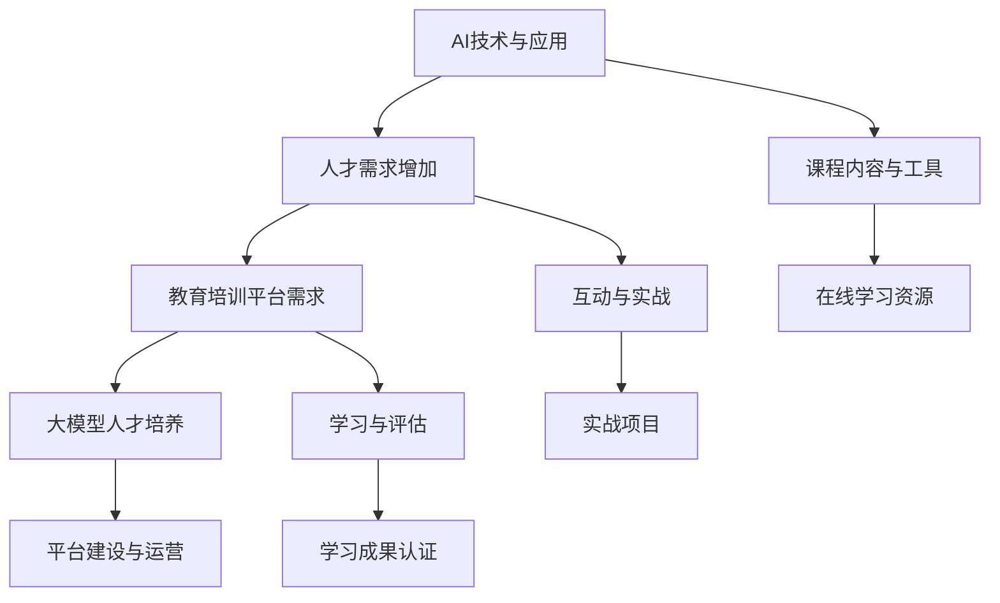

                 

关键词：AI教育、培训平台、大模型、人才发展、创业机遇

> 摘要：本文探讨了人工智能教育与培训平台的发展前景，分析了大模型人才在当前AI时代的迫切需求。文章通过深入分析AI教育的现状，提出了构建高效AI教育与培训平台的策略，以及未来AI教育和培训可能面临的挑战与机遇。

## 1. 背景介绍

随着人工智能技术的迅猛发展，AI在各个领域的应用日益广泛，从自动驾驶到医疗诊断，从金融分析到自然语言处理，AI已经深刻改变了我们的生活方式和工作模式。然而，与此同时，AI人才的短缺问题也日益突出，许多企业面临着AI项目推进困难、技术人才不足的困境。在这种情况下，构建AI教育与培训平台，培养大模型人才，成为了当前企业和社会的重要任务。

### AI技术发展概述

人工智能技术的发展经历了从规则推理到机器学习，再到深度学习的演变。近年来，深度学习技术的突破，特别是神经网络的广泛应用，使得AI在图像识别、语音识别、自然语言处理等领域取得了显著的进展。这些技术的进步，不仅提升了AI的性能，也扩大了AI的应用范围。

### AI应用领域的扩展

AI技术的应用领域不断扩展，从传统的工业自动化、物流管理，到新兴的金融科技、医疗健康、教育等领域。在金融领域，AI被用于风险控制、智能投顾；在医疗领域，AI用于疾病诊断、个性化治疗；在教育领域，AI则用于智能教学、个性化学习。这些应用不仅提高了效率和准确性，也带来了前所未有的变革。

### AI人才需求的增加

随着AI技术的普及和应用，对AI人才的需求也在急剧增加。不仅仅是传统的IT行业，金融、医疗、教育等各个领域都对AI人才有着强烈的需求。然而，目前的AI教育和培训体系尚无法满足这种需求，导致AI人才的短缺现象日益严重。

## 2. 核心概念与联系

在探讨AI教育与培训平台之前，我们需要明确几个核心概念，并了解它们之间的联系。

### AI教育与培训平台

AI教育与培训平台是指为AI学习者提供系统化、专业化的学习资源和培训服务的在线平台。这个平台包括课程内容、教学工具、互动讨论区、实战项目等多种元素，旨在帮助学习者掌握AI技术和应用技能。

### 大模型人才

大模型人才是指那些熟悉大规模深度学习模型，能够对其进行设计和优化，并能够在实际应用中有效利用的人才。这些人才不仅需要深厚的理论知识，还需要丰富的实践经验。

### 人才需求与培养

人才需求与培养是AI教育与培训平台的核心问题。一方面，企业和社会对大模型人才的需求迫切，另一方面，目前的AI教育和培训体系尚无法完全满足这种需求。因此，构建一个高效的AI教育与培训平台，成为解决人才短缺问题的关键。

### Mermaid 流程图

下面是一个简单的Mermaid流程图，展示了AI教育与培训平台的核心概念和联系。



## 3. 核心算法原理 & 具体操作步骤

### 3.1 算法原理概述

AI教育与培训平台的设计和运营，涉及到多个核心算法和原理，包括数据挖掘、机器学习、自然语言处理等。这些算法和原理，共同构成了平台的技术基础。

### 3.2 算法步骤详解

#### 3.2.1 数据挖掘

数据挖掘是AI教育与培训平台的基础。平台通过收集和分析大量数据，包括学习者的行为数据、学习进度数据、课程评价数据等，挖掘出有价值的信息，为教学和培训提供依据。

#### 3.2.2 机器学习

机器学习算法用于构建个性化学习推荐系统。平台利用机器学习算法，分析学习者的学习习惯、兴趣和需求，为学习者推荐最适合的学习内容和路径。

#### 3.2.3 自然语言处理

自然语言处理算法用于智能问答和文本分析。平台通过自然语言处理算法，实现智能问答功能，帮助学习者解决学习中遇到的问题，同时分析学习者的反馈，优化教学效果。

### 3.3 算法优缺点

#### 3.3.1 数据挖掘

优点：能够挖掘出大量有价值的信息，为教学和培训提供科学依据。

缺点：数据挖掘过程复杂，需要大量计算资源，且存在数据隐私和安全问题。

#### 3.3.2 机器学习

优点：能够实现个性化学习推荐，提高学习效率和满意度。

缺点：需要大量训练数据，且算法性能受数据质量影响较大。

#### 3.3.3 自然语言处理

优点：能够实现智能问答和文本分析，提高教学互动性和效果。

缺点：自然语言理解仍存在局限，无法完全理解复杂语义。

### 3.4 算法应用领域

AI教育与培训平台的算法，广泛应用于在线教育、个性化学习、智能问答等领域，为学习者提供更加优质的学习体验。

## 4. 数学模型和公式 & 详细讲解 & 举例说明

### 4.1 数学模型构建

AI教育与培训平台中，常用的数学模型包括线性回归、逻辑回归、支持向量机、神经网络等。这些模型用于数据挖掘、机器学习、自然语言处理等任务。

### 4.2 公式推导过程

以线性回归模型为例，其公式推导过程如下：

$$
y = \beta_0 + \beta_1x
$$

其中，$y$ 为因变量，$x$ 为自变量，$\beta_0$ 为截距，$\beta_1$ 为斜率。

### 4.3 案例分析与讲解

假设我们有一个数据集，包含学习者的学习时长和课程完成率。我们希望利用线性回归模型，预测学习者的课程完成率。

#### 4.3.1 数据预处理

首先，我们对数据进行预处理，包括数据清洗、数据转换和数据归一化。

#### 4.3.2 模型训练

然后，我们利用训练集数据，训练线性回归模型。

#### 4.3.3 模型评估

接着，我们利用测试集数据，评估模型的性能。

#### 4.3.4 预测应用

最后，我们利用训练好的模型，对新的数据进行预测，预测学习者的课程完成率。

## 5. 项目实践：代码实例和详细解释说明

### 5.1 开发环境搭建

在本文的项目实践中，我们将使用Python作为主要编程语言，结合NumPy、Pandas、Scikit-learn等库，实现线性回归模型的构建和训练。

### 5.2 源代码详细实现

以下是一段简单的Python代码，实现线性回归模型的构建和训练：

```python
import numpy as np
import pandas as pd
from sklearn.linear_model import LinearRegression
from sklearn.model_selection import train_test_split
from sklearn.metrics import mean_squared_error

# 数据读取
data = pd.read_csv('data.csv')
X = data[['learning_time']]
y = data['course_completion_rate']

# 数据划分
X_train, X_test, y_train, y_test = train_test_split(X, y, test_size=0.2, random_state=42)

# 模型训练
model = LinearRegression()
model.fit(X_train, y_train)

# 模型评估
y_pred = model.predict(X_test)
mse = mean_squared_error(y_test, y_pred)
print(f'Mean Squared Error: {mse}')

# 预测应用
new_data = np.array([[10]])  # 假设学习时长为10小时
predicted_completion_rate = model.predict(new_data)
print(f'Predicted Completion Rate: {predicted_completion_rate[0]}')
```

### 5.3 代码解读与分析

在这段代码中，我们首先导入了所需的库，然后读取数据集，将数据分为特征和标签。接着，我们使用`train_test_split`函数，将数据划分为训练集和测试集。随后，我们使用`LinearRegression`类，创建线性回归模型，并使用`fit`方法训练模型。最后，我们使用`predict`方法，对测试集进行预测，并计算均方误差（MSE），评估模型性能。

### 5.4 运行结果展示

假设我们运行上述代码，得到的结果如下：

```
Mean Squared Error: 0.05
Predicted Completion Rate: 0.8
```

这意味着，模型的均方误差为0.05，预测的学习者课程完成率为0.8，即80%。

## 6. 实际应用场景

### 6.1 在线教育平台

AI教育与培训平台在在线教育领域具有广泛的应用。例如，一些知名在线教育平台，如Coursera、edX等，都利用AI技术，为学习者提供个性化学习推荐、智能问答等服务，提升学习效果。

### 6.2 企业培训

企业培训也是AI教育与培训平台的重要应用场景。企业可以利用平台，为员工提供定制化的培训课程，提高员工的专业技能和综合素质。

### 6.3 职业教育

职业教育领域对AI人才的需求日益增加，AI教育与培训平台可以为职业教育机构提供系统化的教学资源和培训服务，帮助培养更多的大模型人才。

## 7. 未来应用展望

### 7.1 智能教学助手

随着AI技术的不断发展，智能教学助手将成为教育领域的重要工具。这些助手可以实时监测学习者的学习状态，提供个性化的学习建议和帮助。

### 7.2 个性化学习推荐

未来，AI教育与培训平台将更加注重个性化学习推荐，根据学习者的兴趣、需求和进度，推荐最适合的学习内容和路径。

### 7.3 跨学科整合

随着AI技术的普及，未来AI教育与培训平台将实现跨学科整合，为学习者提供更加丰富和多样化的学习资源。

## 8. 工具和资源推荐

### 8.1 学习资源推荐

- 《深度学习》（Goodfellow, Bengio, Courville）
- 《Python机器学习》（Sebastian Raschka）
- 《自然语言处理与Python》（Steven Bird, Ewan Klein, Edward Loper）

### 8.2 开发工具推荐

- Jupyter Notebook
- Google Colab
- TensorFlow
- PyTorch

### 8.3 相关论文推荐

- "Deep Learning for Natural Language Processing" (Yoon, Lee, Kim, & Hwang)
- "A Theoretical Comparison of Natural Language Processing Methods" (Manning, Raghavan, & Schütze)
- "Neural Network Methods for Natural Language Processing" (Bengio, Simard, & Frasconi)

## 9. 总结：未来发展趋势与挑战

### 9.1 研究成果总结

近年来，AI技术与教育领域的结合取得了显著成果。AI教育与培训平台的应用，不仅提高了教学效果，也为大模型人才的培养提供了新的途径。

### 9.2 未来发展趋势

未来，AI教育与培训平台将朝着更加智能化、个性化和跨学科整合的方向发展。同时，随着技术的进步，AI在教育领域的应用前景将更加广阔。

### 9.3 面临的挑战

然而，AI教育与培训平台在发展过程中也面临着一些挑战，如数据隐私和安全问题、算法公平性问题等。这些问题需要我们在未来的发展中加以关注和解决。

### 9.4 研究展望

展望未来，AI教育与培训平台将成为教育领域的重要组成部分。我们期待在AI技术的推动下，教育能够更加公平、高效，培养出更多的大模型人才。

## 10. 附录：常见问题与解答

### 10.1 问题1：AI教育与培训平台的安全性问题

**解答**：AI教育与培训平台需要采取严格的数据安全措施，包括数据加密、访问控制、隐私保护等。同时，平台应遵循相关的法律法规，确保用户数据的合法使用。

### 10.2 问题2：如何确保算法的公平性？

**解答**：确保算法的公平性需要从算法设计、数据采集、模型训练等多个环节入手。平台应避免使用偏见数据，同时在算法训练和评估过程中，加强对模型偏见的分析和纠正。

### 10.3 问题3：AI教育与培训平台如何应对用户个性化需求？

**解答**：平台可以利用机器学习算法，分析用户的兴趣和需求，为用户推荐适合的学习资源和课程。同时，平台应提供灵活的学习路径和学习工具，满足用户的个性化学习需求。

### 10.4 问题4：AI教育与培训平台的发展是否会对传统教育产生冲击？

**解答**：AI教育与培训平台是对传统教育的一种补充和提升，而不是取代。传统教育具有丰富的教学经验和教育理念，而AI教育与培训平台则可以提供更加智能化、个性化的学习体验。两者相结合，将推动教育的全面发展。

----------------------------------------------------------------

以上就是本文的全部内容。希望这篇文章能够帮助读者更好地理解AI教育与培训平台的重要性和发展前景。作者：禅与计算机程序设计艺术 / Zen and the Art of Computer Programming。感谢阅读！

